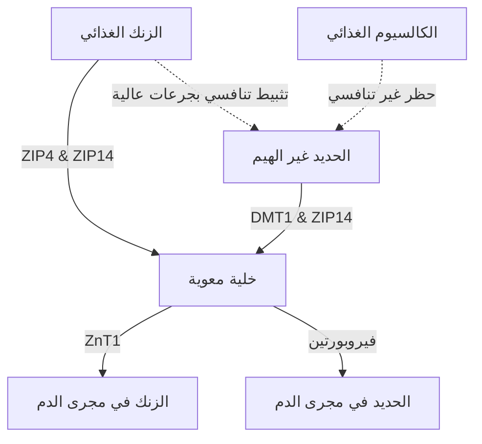

يمثل إعطاء مكملات الزنك ($\text{Zn}^{2+}$) سلسلة من المفارقات الفسيولوجية والكيميائية الحيوية. في حين أن الزنك هو معدن حيوي يشارك في أكثر من 300 تفاعل إنزيمي، فإن تناوله عن طريق الفم غالباً ما يعيقه ضائقة معدية معوية حادة، وتثبيط تنافسي بواسطة الكاتيونات ثنائية التكافؤ الأخرى، واستنزاف المعادن الجهازية. يتطلب حل هذه المشكلات فهماً تفصيلياً لحركية الناقل المعوي، والكيمياء الحيوية المخاطية، وعلم الأدوية الزمني (Chronopharmacology) لتصميم بروتوكولات الجرعات المثلى.

## مفارقة المعدة الفارغة: تهيج الغشاء المخاطي مقابل التوافر البيولوجي

يقدم الزنك عن طريق الفم خياراً صعباً: تناوله على معدة فارغة يزيد من التوافر البيولوجي الخلوي ولكنه غالباً ما يسبب ضائقة معدية معوية حادة (غثيان). على العكس من ذلك، فإن إعطاء الزنك مع وجبات الطعام يخفف الانزعاج بنجاح، ولكنه يُدخل مضادات غذائية (مثبطات) تقلل بشدة من الامتصاص الجزئي.

### الآليات الجزيئية لتهيج المعدة والغثيان
يؤدي ابتلاع أملاح الزنك غير العضوية شديدة الذوبان في الماء - مثل كبريتات الزنك ($\text{ZnSO}_4$) أو كلوريد الزنك ($\text{ZnCl}_2$) - إلى الذوبان السريع داخل تجويف المعدة. في المحاليل المائية، تتفكك هذه الأملاح تماماً، مما ينتج بيئة موضعية شديدة التركيز وحمضية مع درجة حموضة (pH) تتراوح بين 4.0 إلى 5.0.

في حالة الصيام، يؤدي غياب بلعة الطعام إلى ترك الغشاء المخاطي للمعدة بدون مادة واقية. يؤدي التعرض المفاجئ لأيونات الزنك الحرة ($\text{Zn}^{2+}$) إلى إحداث تأثير كاوٍ ومهيج مباشر على الخلايا الظهارية للمعدة. هذا التهيج الموضعي يحفز الخلايا الجدارية في المعدة على فرز حمض الهيدروكلوريك (HCl) بشكل مفرط، مما يؤدي إلى خفض درجة حموضة المعدة بشكل أكبر والتسبب في تآكل الغشاء المخاطي.

يتم الكشف الحسي عن هذه الإهانة الكيميائية والحمضية بواسطة شبكة واسعة من الخلايا العصبية الحسية المبهمة التي تغذي جدار المعدة. بمجرد تنشيطها، تنقل هذه الخلايا العصبية إمكانات العمل عبر العصب المبهم إلى جذع الدماغ. هذا يبدأ رد فعل مقيئ بوساطة مركزية، يتجلى في الغثيان الفوري، وتأخر إفراغ المعدة، وتشنجات المعدة في غضون 30 دقيقة من الابتلاع.

### حظر التوافر البيولوجي: الفيتات والحبوب ومنتجات الألبان

عندما يتم تناول الزنك مع الطعام لمنع تحفيز العصب المبهم (الغثيان)، فإن توافره البيولوجي يتعرض لخطر شديد بسبب مثبطات النظام الغذائي. أقوى هذه المثبطات هو **حمض الفيتيك** (الفيتات)، والذي يتركز بشكل كبير في القشور الخارجية لحبوب السيريال غير المكررة والبقوليات والمكسرات والبذور.

عند درجة الحموضة الفسيولوجية للاثني عشر، يعمل حمض الفيتيك كيجند عدواني يقوم بمخلب (احتجاز) أيونات $\text{Zn}^{2+}$ الحرة، وتشكيل رواسب مستقرة للغاية وغير قابلة للذوبان ومعقدة هيكلياً تقاوم تماماً الامتصاص المعوي. نظراً لأن البشر يفتقرون إلى إنزيمات الفيتاز 내ية المنشأ في الجهاز الهضمي العلوي، فإن مجمعات الزنك والفيتات هذه تظل غير متحللة وتُفرز في البراز.

> [!CAUTION]
> أظهرت الدراسات الكمية باستخدام العلامات المشعة أن إضافة 50 ملغ فقط من الفيتات إلى الوجبة يقلل من الامتصاص الجزئي للزنك بحوالي 36٪ (انخفاضاً من خط أساسي قدره 22٪ إلى 14٪). تركيزات أعلى من الفيتات (250 ملغ) تقمع الامتصاص تماماً إلى 6-7٪ لا تذكر.

بالإضافة إلى ذلك، تمارس منتجات الألبان تأثيراً مثبطاً مستقلاً. يربط **الكازين**، وهو جزء البروتين الأساسي في حليب البقر، أيونات الزنك في تجويف الأمعاء، مما يقلل بشكل كبير من التوافر البيولوجي مقارنةً بمصل اللبن (الواي بروتين).

### بروتوكول التجاوز الأمثل علمياً

1. **الانتقال إلى المخلبيات العضوية:** استبدال أملاح الزنك غير العضوية بمخلبيات الأحماض الأمينية والمعدنية العضوية المحايدة مثل بيسجليسينات الزنك. يرتبط أيون $\text{Zn}^{2+}$ تساهمياً برابطين من الجلايسين، مما يحمي المعدن من التفكك المبكر في حمض المعدة.
2. **وجبات خفيفة منخفضة المضادات:** يجب تناول الزنك حصرياً مع وجبة خفيفة خالية تماماً من الفيتات والكالسيوم عالي الجرعة. تشمل الأطعمة المسموح بها الخبز الأبيض المخمر (العجين المخمر يكسر الفيتات) أو البروتينات الحيوانية البسيطة (البيض أو مصل اللبن المعزول).

> [!TIP]
> **نصيحة للمحترفين:** لتعظيم الامتصاص مع تجنب الغثيان تماماً، فإن البروتوكول المثالي هو تناول 15-30 ملغ من بيسجليسينات الزنك مع وجبة خفيفة خالية من الفيتات في وقت مبكر من بعد الظهر، مع ضمان الصيام لمدة ساعتين (بما في ذلك القهوة والشاي) قبل وبعد الابتلاع.

## حروب الناقلات: DMT1 و ZIP14

تعمل الخلية المعوية في الأمعاء الدقيقة كساحة تنافسية للغاية لامتصاص المعادن ثنائية التكافؤ. يشترك الزنك ($\text{Zn}^{2+}$)، والحديد غير الهيم ($\text{Fe}^{2+}$)، والكالسيوم ($\text{Ca}^{2+}$) في مسارات متداخلة وقابلة للتشبع. هذا يعني أن الإدارة المشتركة للمكملات عالية الجرعة تقمع بشكل مباشر امتصاص كل معدن.

نظراً لأن الزنك والحديد متشابهان للغاية في الشحنة ونصف القطر الأيوني، فإنهما يتنافسان بشدة على مسارات النقل المشتركة (مثل ZIP14). عندما يتم إعطاء جرعات علاجية (عالية) من الحديد (100-400 ملغ) بشكل متزامن مع الزنك، فإن الحديد يتغلب على الزنك في الامتصاص الخلوي، مما يقلل امتصاص الزنك بنسبة 40-50%.

## خطر نضوب النحاس

يتمثل أحد المخاطر الرئيسية لتناول مكملات الزنك بجرعات عالية على المدى الطويل في التطور الخفي لنقص النحاس الجهازي. يتوسط هذا المسار التنظيم التصاعدي لـ **الميثالوثيونين** - وهو بروتين مرتبط بالمعادن داخل الخلايا المعوية.

عندما يستهلك الفرد جرعة عالية من الزنك (> 40-50 ملغ/يوم)، فإنه يؤدي إلى تخليق هائل للميثالوثيونين. على الرغم من أن هذا البروتين مدفوع بالزنك، إلا أن له ألفة ارتباط بالنحاس ($\text{Cu}^+$) أعلى بكثير. وبالتالي، عندما يتم امتصاص النحاس، يربطه الميثالوثيونين ويحتجزه داخل الخلية. تُفقد هذه الخلايا المعوية في البراز كل 3 إلى 5 أيام، مما يؤدي بمرور الوقت إلى نضوب شديد للنحاس (تساقط الشعر، فقر الدم، تلف الأعصاب).

> [!WARNING]
> تجنب تناول أكثر من 40 ملغ من الزنك يومياً لأكثر من أربعة أسابيع دون موازنة النحاس بنسبة 15:1. (لكل 15 ملغ زنك، تناول 1 ملغ نحاس).

## علم الأدوية الزمني للزنك

يعمل الزنك كعامل مساعد كيميائي حيوي أساسي ضروري لتخليق الميلاتونين (هرمون النوم). علاوة على ذلك، يعمل الزنك كمعدل عصبي مباشر، حيث يعمل كمضاد قوي لمستقبلات الجلوتامات NMDA المثيرة، بينما يعزز في نفس الوقت مستقبلات GABA المهدئة، مما يسهل الانتقال السلس إلى النوم العميق.

### بروتوكول الجرعات المحسن من SuppTime

| الوقت | مجموعة المكملات | الأساس المنطقي الزمني البيولوجي |
| :--- | :--- | :--- |
| **الصباح** | البروبيوتيك | انخفاض حجم حمض المعدة عند الاستيقاظ يزيد من بقاء البكتيريا. |
| **الإفطار** | الحديد غير الهيم، فيتامين سي، فيتامين دي 3 | يعزز فيتامين سي امتصاص الحديد. تجنب الكالسيوم والزنك. |
| **الغداء** | بيسجليسينات الزنك (15-30 ملغ) + النحاس (1-2 ملغ) | تمت صياغته بنسبة 15:1 لمنع نضوب النحاس؛ منفصل عن الحديد والكالسيوم. |
| **الليل** | الكالسيوم، جلايسينات المغنيسيوم | يريح المغنيسيوم العضلات ويعدل مستقبلات GABA قبل النوم. |

## المراجع

1. Institute of Medicine (US) Panel on Micronutrients. [Zinc](https://www.ncbi.nlm.nih.gov/books/NBK222317/). *Dietary Reference Intakes for Vitamin A, Vitamin K, Arsenic, Boron, Chromium, Copper, Iodine, Iron, Manganese, Molybdenum, Nickel, Silicon, Vanadium, and Zinc.* National Academies Press, 2001.
2. National Institutes of Health, Office of Dietary Supplements. [Zinc - Health Professional Fact Sheet](https://ods.od.nih.gov/factsheets/Zinc-HealthProfessional/). *NIH Office of Dietary Supplements.* 2022.
3. Pérès JM, Bureau F, Neuville D, Arhan P, Bouglé D. [Inhibition of zinc absorption by iron depends on their ratio](https://pubmed.ncbi.nlm.nih.gov/11846013/). *Journal of Trace Elements in Medicine and Biology.* 2001.
4. Devarshi PP, Mao Q, Grant RW, Mitmesser SH. [Comparative Absorption and Bioavailability of Various Chemical Forms of Zinc in Humans: A Narrative Review](https://www.ncbi.nlm.nih.gov/pmc/articles/PMC11677333/). *Nutrients.* 2024.
5. Gupta N, Carmichael MF. [Zinc-Induced Copper Deficiency as a Rare Cause of Neurological Deficit and Anemia](https://www.ncbi.nlm.nih.gov/pmc/articles/PMC10510946/). *Cureus.* 2023.

*هذا المقال لأغراض معلوماتية فقط ولا يُغني عن الاستشارة الطبية. يُرجى استشارة أخصائي رعاية صحية مؤهل قبل تعديل روتين مكملاتك الغذائية أو أدويتك.*
