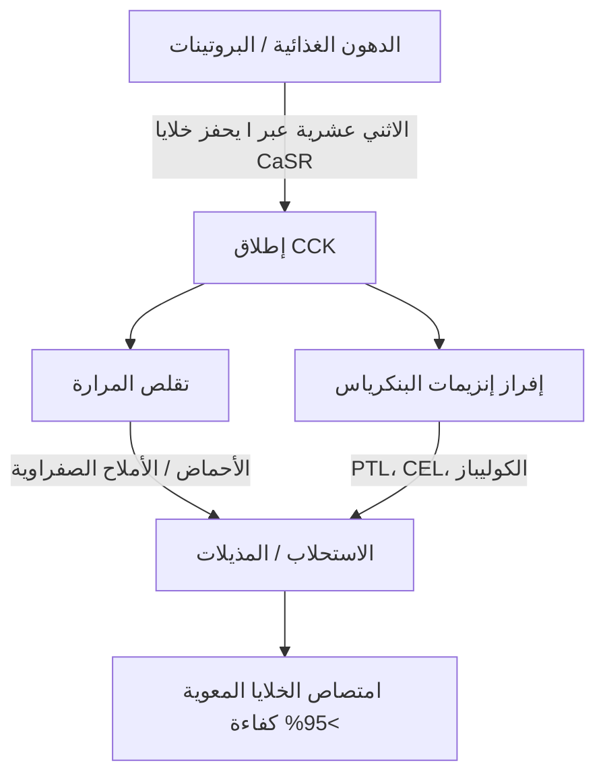
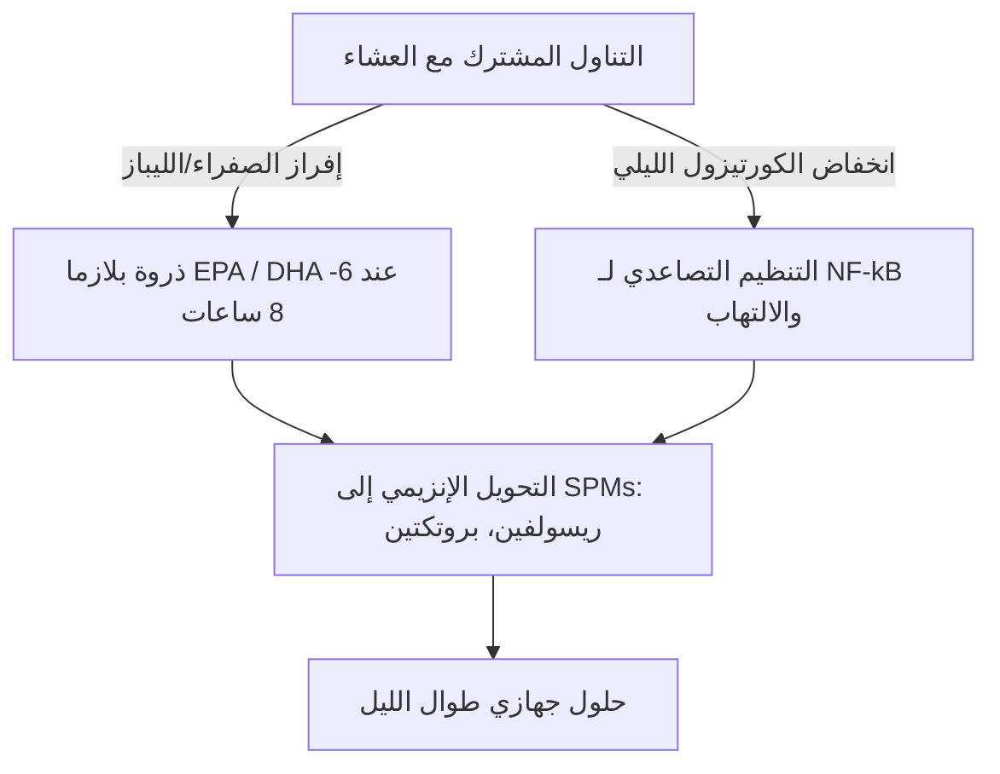

الفعالية العلاجية للأحماض الدهنية البحرية طويلة السلسلة المتعددة غير المشبعة أوميغا-3 ($\text{PUFAs}$)، وتحديداً حمض الإيكوسابنتاينويك ($\text{EPA}$) وحمض الدوكوساهكساينويك ($\text{DHA}$)، محكومة بدقة بتوافرها البيولوجي المعوي. في التغذية السريرية، أحد الأسباب الرئيسية للفشل العلاجي هو "مفارقة الوجبة الخالية من الدهون" (lean-meal paradox) — إعطاء الدهون البحرية شديدة الكراهية للماء (الهيدروفوبية) في حالة الصيام أو إلى جانب وجبات خالية من الدهون. على الرغم من تناول جرعات اسمية عالية، إلا أن الافتقار إلى مصفوفة مهيكلة من الدهون المتناولة في نفس الوقت يمنع الآليات الفيزيائية والإنزيمية اللازمة لامتصاص الدهون في التجويف المائي للجهاز الهضمي البشري. يفصل هذا التحليل السريري المبادئ الفيزيائية الحيوية، والكيميائية الحيوية، والدوائية الزمنية (الكرونوفارماكولوجية) التي تملي هضم وامتصاص الـ $\text{EPA}$ والـ $\text{DHA}$.

## الصيام ومفارقة الوجبة الخالية من الدهون

الجهاز الهضمي هو في الأساس نظام مائي (قائم على الماء). عند تناول الدهون الكارهة للماء مثل زيوت الأسماك القياسية، فإنها تواجه البيئة شديدة القطبية للعصارات المعدية والمعوية. وفقًا لقوانين الديناميكا الحرارية، تقلل الجزيئات الكارهة للماء من ملامستها للماء، مما يؤدي إلى انفصال سريع للطور. يتسبب هذا في تكتل الزيت المبتلع في كريات دهنية كبيرة غير مقسمة تطفو فوق الكيموس (العصارة الهضمية) المعدي المائي.

إن ابتلاع كبسولة أوميغا-3 مع كوب من الماء على معدة فارغة، أو إلى جانب وجبة كربوهيدراتية فقط (مثل قطعة فاكهة أو شريحة خبز جاف) يفشل في تحفيز العمليات الفسيولوجية المطلوبة للتغلب على هذا الانفصال الطوري. بدون الاستحلاب الفيزيائي، تظل نسبة مساحة السطح إلى الحجم للطور الدهني منخفضة للغاية. لا تستطيع المواقع النشطة المحبة للماء لإنزيمات الليباز البنكرياسية الوصول إلى الروابط الإسترية المدفونة داخل هذه القطرات الكارهة للماء الكبيرة. ونتيجة لذلك، فإن شرب الماء مع زيت السمك لا يساعد في الامتصاص؛ بل إنه يخفف من آثار الإنزيمات الهاضمة الموجودة في حالة الصيام، مما يبعد الكريات الدهنية غير المستحلبة عن غشاء الحافة الفرشاتية للخلية المعوية ويؤدي إلى سوء الامتصاص واضطراب الجهاز الهضمي.

لكي تعبر هذه الدهون شديدة الكراهية للماء طبقة الماء غير المحركة (unstirred water layer) للغشاء المخاطي المعوي، يجب تحويلها إلى طور مستقر ديناميكيًا حراريًا وقابل للتشتت في الماء. يعتمد هذا التحول كليًا على الكيمياء الفيزيائية لتكوين المذيلات (micellarization)، وهي عملية تبدأ عن طريق الإشارات الاثني عشرية بوساطة الهرمونات.

## الأملاح الصفراوية وتكوين المذيلات

يتطلب الانتقال من كتلة زيتية عائمة وكارهة للماء إلى قطرات دقيقة قابلة للامتصاص شلالًا إفرازيًا وعصبيًا عضليًا منسقًا في الاثني عشر. المحرك الهرموني الأساسي لهذه العملية هو الكوليسيستوكينين ($\text{CCK}$)، وهو ببتيد مكون من 33 حمضًا أمينيًا يتم تصنيعه وإفرازه بواسطة خلايا I الصماء المعوية في البطانة المخاطية للاثني عشر والصائم العلوي.



في ظل الظروف الفسيولوجية، فإن وجود الأحماض الدهنية طويلة السلسلة والبروتينات المهضومة جزئيًا في تجويف الاثني عشر يحفز مستقبل استشعار الكالسيوم ($\text{CaSR}$) الموجود على خلايا I، مما يؤدي إلى خروج الـ $\text{CCK}$ السريع إلى مجرى الدم. بمجرد إطلاقه، يرتبط الـ $\text{CCK}$ بمستقبلات $\text{CCK}_A$ الموجودة على جدار المرارة، مما يؤدي إلى تقلصها، وفي الوقت نفسه يريح العضلة العاصرة لأودي ويحفز الخلايا العنيبية البنكرياسية لإطلاق إنزيماتها الهاضمة.

الأحماض الصفراوية التي تفرزها المرارة - في المقام الأول أملاح الصوديوم المترددة (الأنفيباتية) لحمض الكوليك وحمض تشينوديوكسيكوليك - هي منظفات بيولوجية أساسية. عندما يتجاوز تركيز الأحماض الصفراوية في الاثني عشر التركيز المذيلي الحرج ($\text{CMC}$)، فإنها ترتب نفسها حول قطرات الدهون الكارهة للماء. يرتبط النواة الستيرويدية الكارهة للماء للملح الصفراوي بالطور الدهني، بينما تتجه المجموعة المقترنة القطبية والمحبة للماء (الجليسين أو التورين) نحو تجويف الاثني عشر المائي.

من خلال العمل الميكانيكي للحركة التمعجية المعوية، يتم قص هذه القطرات المغلفة بالصفراء إلى مذيلات مختلطة. يبلغ قطر هذه الركام الغرواني الكروي من 3 إلى 10 نانومتر فقط، مما يزيد من مساحة السطح الدهني المعرض للليباز البنكرياسي بعدة آلاف من المرات. بدون تناول الدهون الغذائية الصحية (مثل زيت الزيتون البكر الممتاز أو الأفوكادو أو صفار بيض المراعي) لتحفيز عتبة إطلاق $\text{CCK}$، لا يحدث تقلص المرارة. في هذه الحالة، تظل مستويات الأحماض الصفراوية أقل من الـ $\text{CMC}$، ويكون إفراز الليباز البنكرياسي في حده الأدنى، ولا يمكن لدهون أوميغا-3 المبتلعة أن تشكل مذيلات، مما يمنع الامتصاص.

## معركة الأشكال الكيميائية الحيوية: TG مقابل EE مقابل PL

توجد مكملات أوميغا-3 المتاحة تجاريًا في ثلاثة أشكال جزيئية رئيسية: الدهون الثلاثية الطبيعية أو المعاد أسترتها ($\text{TG}$/$\text{rTG}$)، وإسترات الإيثيل ($\text{EE}$)، والدهون الفوسفورية ($\text{PL}$). يحدد التركيب الجزيئي لهذه الحوامل معدل هضمها، واعتمادها على الليباز، وتوافرها البيولوجي.

```text
شكل الدهون الثلاثية (TG):        شكل إستر الإيثيل (EE):         شكل الدهون الفوسفورية (PL):
     ┌─ هيكل الجلسرين                  ┌─ جزيء الإيثانول                ┌─ رأس الفوسفات (قطبي)
     ├─ حمض دهني (EPA)                 └─ حمض دهني (EPA)                ├─ حمض دهني (EPA)
     ├─ حمض دهني (DHA)                                                  └─ حمض دهني (DHA)
     └─ حمض دهني (أخرى)
```

في الدهون الثلاثية الطبيعية والمعاد أسترتها ($\text{TG}$/$\text{rTG}$)، يرتبط ثلاثة أحماض دهنية ($\text{EPA}$/$\text{DHA}$) بهيكل جلسرين مكون من ثلاثة كربونات. أثناء الهضم، يقوم إنزيم ليباز الدهون الثلاثية البنكرياسي ($\text{PTL}$)، الذي يعمل مع الإنزيم المساعد كوليباز، بتحلل الروابط الإسترية المائية في الموضعين $sn\text{-}1$ و $sn\text{-}3$. ينتج عن هذا اثنين من الأحماض الدهنية الحرة وواحد $sn\text{-}2$-أحادي الجليسريد، وكلاهما شديد القطبية، ويسهل تحويلهما إلى مذيلات، ويتم امتصاصهما بسهولة بواسطة الخلايا المعوية بكفاءة تزيد عن 95%.

على العكس من ذلك، فإن شكل إستر الإيثيل ($\text{EE}$) هو منتج صناعي تم إنشاؤه أثناء التركيز الكيميائي. تتم إزالة هيكل الجلسرين، ويتم أسترة كل حمض دهني فردي إلى جزيء إيثانول ($\text{CH}_3\text{CH}_2\text{OH}$). هذه الرابطة الإسترية الاصطناعية شديدة المقاومة لإنزيمات البنكرياس البشرية. تظهر الدراسات المخبرية والحية أن إنزيم الليباز البنكرياسي البشري يحلل رابطة الحمض الدهني-الإيثانول في الـ $\text{EE}$ بمعدل أبطأ بـ 10 إلى 50 مرة من الروابط الجليسريل-الإسترية في الدهون الثلاثية.

بسبب هذا التحلل المائي البطيء، يعتمد امتصاص الـ $\text{EE}$ بشكل كبير على إطلاق هائل للليباز البنكرياسي والأملاح الصفراوية، والذي لا يتم تحفيزه إلا من خلال وجبة غنية بالدهون. عند تناوله مع نظام غذائي منخفض الدهون، لا يستطيع الليباز البنكرياسي المتاح المحدود شق روابط الـ $\text{EE}$ بكفاءة، مما يؤدي إلى ضعف التوافر البيولوجي (غالبًا ما ينخفض إلى حوالي 20%) ويتسبب في انتقال الإسترات الاصطناعية غير الممتصة إلى القولون، حيث يمكن أن تسبب آثارًا جانبية في الجهاز الهضمي.

يتميز شكل الفوسفوليبيد ($\text{PL}$)، المستمد بشكل أساسي من زيت الكريل في القطب الجنوبي (Euphausia superba)، ببنية أمفيباتية (مترددة) حيث يرتبط الـ $\text{EPA}$ والـ $\text{DHA}$ بهيكل فوسفاتيديل كولين. مجموعة رأس الفوسفات شديدة القطبية تجعل الفوسفوليبيدات قابلة للتشتت في الماء بشكل طبيعي. لهذا السبب، يمكن لأشكال الـ $\text{PL}$ أن تستحلب ذاتيًا وتشكل قطرات دقيقة عفوية في الجهاز الهضمي، متجاوزة المتطلب المطلق للميسيلية المحفزة بالأملاح الصفراوية. كما يتم هضم الفوسفوليبيدات عبر فسفوليباز $\text{A}_2$ ويمكن امتصاصها مباشرة بواسطة الخلايا المعوية كليسوفوسفوليبيدات، مما يؤدي إلى ارتفاع التوافر البيولوجي حتى في ظروف الصيام أو انخفاض الدهون.

| الشكل الكيميائي الحيوي | الحامل الجزيئي / الهيكل | متوسط معدل الامتصاص (وجبة خالية من الدهون) | متوسط معدل الامتصاص (وجبة غنية بالدهون) | التوافر البيولوجي النسبي (مقابل خط الأساس EE) | الاعتماد على ليباز البنكرياس |
| --- | --- | --- | --- | --- | --- |
| إستر الإيثيل (EE) | إيثانول ($\text{CH}_3\text{CH}_2\text{OH}$) | $\approx 20\%$ | $\approx 60\%$ | خط الأساس ($100\%$) | مطلق؛ يتحلل مائيًا أبطأ بـ 10-50 مرة من TG |
| الدهون الثلاثية (TG / rTG) | هيكل الجلسرين | $\approx 68\%$ | $\approx 90\%$ | $124\%$ إلى $186\%$ | عالي؛ يتم شقه بسرعة إلى 2-FFA و 1-MAG |
| الدهون الفوسفورية (PL) | فوسفاتيديل كولين | $\approx 80\%$ إلى $95\%$ | $>95\%$ | $168\%$ إلى $500\%$ | الحد الأدنى؛ يستحلب ذاتيًا، يتجاوز بعض الليباز |

> [!WARNING]
> الأفراد الذين يعانون من قصور البنكرياس الخارجي الإفراز (EPI)، أو خلل الحركة الصفراوية، أو أولئك الذين خضعوا لاستئصال المرارة يظهرون ضعفًا شديدًا في هضم الدهون الداخلي. بالنسبة لهؤلاء المرضى، يمثل إعطاء تركيبات إسترات الإيثيل (EE) الاصطناعية تحت قيود غذائية منخفضة الدهون خطرًا كبيرًا لسوء الامتصاص الكامل واضطراب الجهاز الهضمي، حيث أن الانقسام الإنزيمي الضروري غير موجود فعليًا في هذه الحالات.

## أكسدة الدهون والضرورة المطلقة لفيتامين E

السمات الهيكلية التي تجعل الـ $\text{EPA}$ والـ $\text{DHA}$ نشطة بيولوجيًا تجعلها أيضًا غير مستقرة للغاية. يحتوي الـ $\text{EPA}$ على خمس روابط مزدوجة ويحتوي الـ $\text{DHA}$ على ست روابط مزدوجة متقطعة بالميثيلين. الروابط بين الكربون والهيدروجين في كربونات الميثيلين ثنائية الأليليك ($\text{-CH=CH-CH}_2\text{-CH=CH-}$) لها طاقات تفكك رابطة منخفضة. هذا يجعلها عرضة بشكل استثنائي لهجوم الجذور الحرة وبيروكسيد الدهون غير الإنزيمي.

```text
المرحلة 1: البدء
  [رابطة الكربون-الهيدروجين في PUFA] + [ROS / جذر حر] ──> [جذر دهني متمركز حول الكربون (R•)]

المرحلة 2: الانتشار
  [جذر دهني متمركز حول الكربون (R•)] + [O2] ──> [جذر بيروكسيل دهني (ROO•)]
  [جذر بيروكسيل دهني (ROO•)] + [PUFA غير مؤكسد] ──> [هيدروبيروكسيد دهني (ROOH)] + [جذر دهني جديد (R•)]

المرحلة 3: التحلل
  [هيدروبيروكسيد دهني غير مستقر (ROOH)] ──> [ألدهيدات سامة (MDA / HHE)]
```

بمجرد ابتلاعه، يتعرض زيت السمك لبيئة تبلغ $37^\circ\text{C}$ (درجة حرارة الجسم)، وأحماض المعدة، والأكسجين الجزيئي المذاب ($\text{O}_2$). تسرع هذه البيئة شلال بيروكسيد الدهون من خلال ثلاث مراحل متميزة:

1. **البدء:** تقوم أنواع الأكسجين التفاعلية ($\text{ROS}$) بتجريد ذرة هيدروجين من كربون ثنائي الأليليك، مما يولد جذرًا دهنيًا متمركزًا حول الكربون ($\text{R}^\bullet$).
2. **الانتشار:** يتفاعل الجذر الدهني بسرعة مع الأكسجين الجزيئي ($\text{O}_2$) لتكوين جذر بيروكسيل دهني ($\text{ROO}^\bullet$). ثم يقوم جذر البيروكسيل هذا بتجريد ذرة هيدروجين من جزيء $\text{PUFA}$ غير مؤكسد مجاور، مما يولد هيدروبيروكسيد دهني ($\text{ROOH}$) وجذرًا دهنيًا جديدًا، مما يديم التفاعل المتسلسل.
3. **التحلل:** تتحلل الهيدروبيروكسيدات الدهنية غير المستقرة إلى منتجات أكسدة ثانوية شديدة التفاعل وسامة للخلايا، بما في ذلك الألكينالات مثل مالونديالدهيد ($\text{MDA}$) و 4-هيدروكسي هكسينال ($\text{HHE}$).

يتم امتصاص منتجات الأكسدة الثانوية هذه بسهولة عبر الأمعاء، وتندمج في الكيلوميكرونات والبروتينات الدهنية منخفضة الكثافة ($\text{LDL}$)، ويمكن أن تحفز الإجهاد التأكسدي الجهازي، وتلف البطانة، وتصلب الشرايين.

لوقف هذه العملية، يلزم التكوين المشترك لمضاد أكسدة قابل للذوبان في الدهون يكسر السلسلة. يعتبر فيتامين E الطبيعي، وتحديداً دي-ألفا-توكوفيرول ($\text{C}_{29}\text{H}_{50}\text{O}_2$)، محسناً بشكل كبير لهذا الدور. يعمل دي-ألفا-توكوفيرول كمانح للهيدروجين، حيث ينقل ذرة الهيدروجين الفينولية الخاصة به بسرعة إلى جذر البيروكسيل الدهني التفاعلي ($\text{ROO}^\bullet$) بمعدل ثابت سريع للغاية يبلغ حوالي $10^6\,\text{M}^{-1}\text{s}^{-1}$.

الجذر التوكوفيروكسيلي الناتج مستقر للغاية بسبب عدم التمركز الرنيني لإلكترونه غير المزدوج عبر حلقة الكرومانول، مما يمنعه من مهاجمة سلاسل الأحماض الدهنية المجاورة. يوقف هذا التفاعل المتسلسل، ويحمي السلامة الهيكلية لجزيئات الـ $\text{EPA}$ والـ $\text{DHA}$ بحيث يمكنها الوصول إلى الأنسجة المستهدفة في حالتها النشطة غير المؤكسدة.

## علم الصيدلة الزمني والنافذة الليلية المضادة للالتهابات

في الكيمياء الحيوية للدهون، التوقيت عامل حاسم. إن تناول مكملات أوميغا-3 إلى جانب أكبر وجبة وأكثرها كثافة بالدهون في اليوم (عادة العشاء) يحسن كلًا من الامتصاص وعمليات الشفاء الليلية الطبيعية في الجسم.



أولاً، يعتبر العشاء تاريخيًا الوجبة الأكثر احتواءً على الدهون في اليوم للعديد من الأفراد. يوفر هذا الحجم المادي للدهون المطلوب لتحفيز الحد الأقصى من إطلاق الـ $\text{CCK}$، مما يؤدي إلى تقلص قوي في المرارة، وإفراز غني للصفراء، ونشاط مرتفع لليباز البنكرياس. يؤدي هذا إلى تحسين حركية الميسيلية والهضم، مما يضمن امتصاص الجرعة المتناولة بأكملها تقريبًا بنجاح.

ثانيًا، يتماشى الإعطاء المسائي مع دورات المناعة والالتهابات اليومية في الجسم. تنخفض مستويات الكورتيزول الداخلي بشكل طبيعي إلى أدنى مستوياتها اليومية في أواخر المساء وأوائل الليل. الكورتيزول هرمون قوي مضاد للالتهابات؛ عندما تنخفض مستوياته، تشهد المسارات الالتهابية الجهازية - مثل تلك التي يحكمها عامل النسخ المؤيد للالتهابات $\text{NF}\text{-}\kappa\text{B}$ - "تنظيمًا تصاعديًا" (upregulation) نسبيًا.

عن طريق تناول أوميغا-3 مع العشاء، يتم الوصول إلى ذروة تركيزات البلازما وغشاء الخلية من الـ $\text{EPA}$ والـ $\text{DHA}$ بعد 6 إلى 8 ساعات، ليتزامن ذلك مباشرة مع هذه النافذة الالتهابية الليلية. خلال هذه المرحلة، يستخدم الجسم هذه الأحماض الدهنية كركائز للتركيب الإنزيمي لوسطاء التحليل الموالين المتخصصين ($\text{SPMs}$) - وتحديداً الريسولفينات، والبروتكتينات، والماريسينات - عبر مسارات انزيمات الأكسدة الحلقية ($\text{COX}$) وانزيمات الأكسجة الشحمية ($\text{LOX}$). تعمل هذه الـ $\text{SPMs}$ بنشاط على حل الالتهابات الدقيقة المزمنة، وتعزيز دوران الخلايا، ودعم التئام الأنسجة أثناء النوم.

بالإضافة إلى ذلك، يوفر الإعطاء المسائي لأوميغا-3، وخاصة الـ $\text{DHA}$، فوائد عصبية فريدة. الـ $\text{DHA}$ هو دهن هيكلي رئيسي في الأغشية العصبية ويلعب دورًا مهمًا في الساعة البيولوجية للدماغ. وهو يعمل على جينات الساعة (مثل BMAL1 و CLOCK) المسؤولة عن تنظيم دورة النوم والاستيقاظ.

يدعم الدمج الليلي للـ $\text{DHA}$ في الأغشية المشبكية التواصل العصبي، ويعزز تخليق السيروتونين، ويحسن تحويله إلى الميلاتونين. أثبتت التجارب السريرية أن المكملات المسائية المتسقة بأوميغا-3 تحسن كفاءة النوم بشكل كبير، وتقصر وقت بداية النوم، وتقلل من مؤشر تجزئة النوم (الاستيقاظ الليلي).

> [!TIP]
> لزيادة الدمج الحيوي الخلوي للأحماض الدهنية أوميغا-3 طويلة السلسلة إلى أقصى حد، يجب على الأطباء التوصية بأن يتناول المرضى جرعتهم اليومية إلى جانب الوجبة الأكثر كثافة بالدهون في اليوم. التناول المشترك مع ما لا يقل عن 10-15 جرامًا من الدهون الأحادية أو المتعددة غير المشبعة الصحية (مثل زيت الزيتون البكر الممتاز أو الأفوكادو) يكفي لتحفيز عتبة إطلاق الكوليسيستوكينين اللازمة للميسيلية المثلى.

## التوليفات السريرية والتوصيات العملية

يتطلب زيادة الإمكانات العلاجية لمكملات أوميغا-3 إلى أقصى حد التحول من مجرد ابتلاع كبسولات ذات جرعة اسمية عالية نحو نهج يعتمد على الكيمياء الحيوية للدهون وحركية الهضم. غالبًا ما تؤدي الممارسة التقليدية المتمثلة في تناول زيت السمك مع الماء على معدة فارغة إلى سوء الامتصاص وآثار جانبية في الجهاز الهضمي.

للحصول على النتائج العلاجية المثلى، يجب على الأطباء إعطاء الأولوية لتركيبات الدهون الثلاثية المعاد أسترتها ($\text{rTG}$) أو الفوسفوليبيد ($\text{PL}$)، والتي تظهر حركية امتصاص فائقة وتكون أقل اعتمادًا على الوجبات الغنية بالدهون من إسترات الإيثيل الاصطناعية ($\text{EE}$).

بغض النظر عن التركيبة المختارة، يجب تناول المكمل مع وجبة تحتوي على 10 إلى 15 جرامًا على الأقل من الدهون الغذائية. هذا العتبة الدهنية ضروري لتحفيز شلال إشارات $\text{CCK}$ الاثني عشري، وبدء تقلص المرارة وإفراز الليباز البنكرياسي للسماح بالميسيلية الكاملة.

علاوة على ذلك، لحماية الـ $\text{PUFAs}$ غير المستقرة للغاية من الأضرار التأكسدية داخل الجسم، يجب أن تتضمن التركيبة دائمًا مضادًا للأكسدة طبيعيًا قابل للذوبان في الدهون مثل دي-ألفا-توكوفيرول (فيتامين E).

أخيرًا، يضمن مواءمة المكملات مع وجبة العشاء أن تتزامن ذروة الامتصاص مع المسارات الليلية الطبيعية المضادة للالتهابات وإصلاح الخلايا في الجسم، مما يزيد من الفوائد القلبية الوعائية، والمناعية، والعصبية للـ $\text{EPA}$ والـ $\text{DHA}$.

## المراجع

1. Nordøy A, et al. [Absorption of the n-3 eicosapentaenoic and docosahexaenoic acids as ethyl esters and triglycerides by humans](https://pubmed.ncbi.nlm.nih.gov/1826985/). *American Journal of Clinical Nutrition.* 1991.
2. Offman E, Marenco T, Ferber S, Johnson J, Kling D, Curcio D, Davidson M. [Steady-state bioavailability of prescription omega-3 on a low-fat diet is significantly improved with a free fatty acid formulation compared with an ethyl ester formulation: the ECLIPSE II study](https://pubmed.ncbi.nlm.nih.gov/24124374/). *Vascular Health and Risk Management.* 2013.
3. Schuchardt JP, Schneider I, Meyer H, Neubronner J, von Schacky C, Hahn A. [Incorporation of EPA and DHA into plasma phospholipids in response to different omega-3 fatty acid formulations - a comparative bioavailability study of fish oil vs. krill oil](https://pubmed.ncbi.nlm.nih.gov/21854650/). *Lipids in Health and Disease.* 2011.
4. Brown JE, Wahle KW. [Effect of fish-oil and vitamin E supplementation on lipid peroxidation and whole-blood aggregation in man](https://pubmed.ncbi.nlm.nih.gov/2282693/). *Clinica Chimica Acta.* 1990.

*هذا المقال لأغراض معلوماتية فقط ولا يُغني عن الاستشارة الطبية. يُرجى استشارة أخصائي رعاية صحية مؤهل قبل تعديل روتين مكملاتك الغذائية أو أدويتك.*
