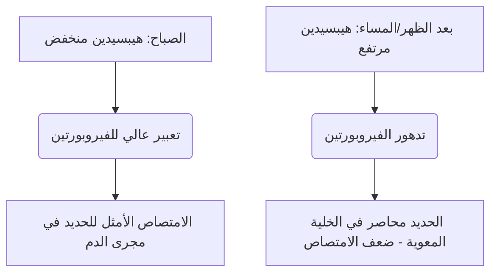

الحديد هو عنصر غذائي دقيق لا غنى عنه يعمل كعامل مساعد تركيبي وتحفيزي في نقل الأكسجين، التنفس الخلوي، وتكوين الحمض النووي (DNA). على الرغم من وفرته البيئية، غالبًا ما يكون الحديد عنصرًا غذائيًا مقيدًا للنمو في النظام الغذائي البشري. نظرًا لأن البشر لا يمتلكون أي آلية فسيولوجية لإفراز الحديد النشط، يتم الحفاظ على توازن الحديد الجهازي حصريًا على مستوى الامتصاص المعوي.

يوجد الحديد الغذائي في شكلين أساسيين: **الحديد العضوي (الهيم)** و**الحديد غير العضوي (غير الهيم)**.

حديد الهيم متوفر بيولوجيًا بدرجة عالية، وعادة ما يتم امتصاصه بمعدلات تتراوح من 15% إلى 35%. يتم نقله سليمًا عبر الحافة الفرشاتية القمية للخلايا المعوية في الاثني عشر عبر بروتين ناقل الهيم 1 (HCP1) ويبقى محميًا من المثبطات الغذائية القياسية.

على العكس من ذلك، يمثل الحديد غير الهيم (الحديد غير العضوي) أكثر من 80% من المدخول الغذائي ولكنه يظهر شكل امتصاص ضعيف للغاية، حيث تتراوح معدلات الامتصاص من 2% فقط إلى 20%.

> [!TIP]
> عند درجة الحموضة الفسيولوجية، يوجد الحديد غير الهيم في الغالب في حالة الحديديك المؤكسدة وغير القابلة للذوبان بدرجة عالية (Fe³⁺). لكي يتم امتصاصه، يجب أن يخضع للاختزال إلى حالة الحديدوز القابلة للذوبان (Fe²⁺) بواسطة إنزيم الاختزال القمي السيتوكروم ب في الاثني عشر (Dcytb)، قبل دخول الخلية المعوية عبر ناقل المعادن ثنائي التكافؤ 1 (DMT1).

## مسارات حديد الهيم مقابل الحديد غير الهيم

| الميزة / المقياس | مسار حديد الهيم | مسار الحديد غير الهيم (غير العضوي) |
| :--- | :--- | :--- |
| **المصادر الغذائية** | الأنسجة الحيوانية (الهيموغلوبين، الميوجلوبين) | النباتات، الأطعمة المدعمة بالحديد، الأملاح المعدنية |
| **الناقل القمي** | بروتين ناقل الهيم 1 (HCP1) | ناقل المعادن ثنائي التكافؤ 1 (DMT1) |
| **حالة التكافؤ المطلوبة** | مركب مرتبط بالبورفيرين | حديدوز (Fe²⁺) |
| **درجة الحموضة اللمعية المثلى** | مستقر إلى حد كبير؛ لا يتأثر بحمض المعدة | يتطلب حموضة عالية (pH < 3.0) للذوبان |
| **فعالية الامتصاص النموذجية**| 15% – 35% (توافر بيولوجي عالي) | 2% – 20% (متغير بشكل كبير) |
| **الحساسية للمثبطات الغذائية** | ضئيلة؛ محمي بحلقة البورفيرين | عالية جدًا (تثبطها الفيتات، البوليفينول، الكالسيوم) |

## التوقيت الأمثل (علم الأدوية الزمني)

يتطلب تحسين امتصاص الحديد غير الهيم تنسيقًا دقيقًا مع الحركية النهارية لـ **الهيبسيدين (Hepcidin)**، وهو هرمون ببتيدي مكون من 25 حمضًا أمينيًا يتم تصنيعه بشكل أساسي بواسطة الخلايا الكبدية. يعمل الهيبسيدين كمنظم جهازي رئيسي لتوازن الحديد عن طريق الارتباط المباشر بالناقل الخارجي الجانبي القاعدي "فيروبورتين" (Ferroportin)، مما يحفز تدهوره. وبالتالي، فإن مستويات الهيبسيدين المرتفعة المنتشرة تحبس الحديد داخل الخلايا المعوية في الاثني عشر وتمنع دخوله إلى مجرى الدم.

### التذبذبات اليومية للهيبسيدين
في ظل الظروف الفسيولوجية الأساسية، تكون تركيزات الهيبسيدين في أدنى مستوياتها في الصباح الباكر، وترتفع باطراد طوال فترة بعد الظهر لتصل إلى ذروتها، وتنخفض أثناء الليل.

يؤثر هذا المنحنى اليومي بشكل مباشر على حركية الحديد الفموي. **الإعطاء الصباحي** لمكملات الحديد يسمح للمعدن بالوصول إلى الاثني عشر عندما يكون التعبير عن الفيروبورتين في الخلايا المعوية في أعلى مستوياته. في المقابل، فإن الجرعات في فترة ما بعد الظهر أو المساء تجبر الحديد على التنافس مع حصار مرتفع للهيبسيدين، مما يؤدي إلى انخفاض بنسبة 37% في امتصاص الحديد الجزئي.

### تأثير حموضة المعدة
تعتمد الحالة الفيزيائية الحيوية للحديد غير العضوي بشكل كبير على إنتاج حمض المعدة. يؤدي القمع الدوائي لحمض المعدة عبر مثبطات مضخة البروتون (PPIs - أدوية المعدة) إلى تعطيل هذه البيئة الدقيقة بشدة، مما يرفع درجة حموضة المعدة ويسبب الأكسدة السريعة لـ Fe²⁺ القابل للذوبان إلى Fe³⁺ غير القابل للذوبان بدرجة عالية.

> [!WARNING]
> يجب تناول مكملات الحديد الفموية على معدة فارغة - من الناحية المثالية قبل ساعة واحدة أو بعد ساعتين من الوجبة - ويجب فصلها تمامًا عن أي أدوية مثبطة للأحماض.

## التفاعلات القاتلة (ما يجب ألا تخلطه أبدًا)

تتعرض الفعالية العلاجية للحديد الفموي للخطر بسهولة عن طريق الابتلاع المتزامن مع مركبات غذائية وعوامل صيدلانية مختلفة.

### الكالسيوم
يعد الكالسيوم، سواء تم تناوله كمنتجات ألبان غذائية (حليب، جبن، زبادي) أو كمكملات معدنية (كربونات الكالسيوم)، مثبطًا قويًا لامتصاص كل من حديد الهيم والحديد غير الهيم. يؤدي الابتلاع المتزامن لـ 500 مجم من كربونات الكالسيوم مع وجبة تحتوي على الحديد إلى تقليل الامتصاص الجزئي للحديد بأكثر من 50%.

### العفص والبوليفينول
تعتبر البوليفينولات الموجودة في **الشاي الأسود، الشاي الأخضر، شاي الأعشاب، والقهوة** خالبة للحديد فعالة بشكل استثنائي. تتناسق هذه المركبات المشتقة من النباتات مع حديد الحديديك لتشكيل مجمعات عضوية معدنية كبيرة ومستقرة للغاية لا يمكنها عبور الحافة الفرشاتية للاثني عشر. إضافة كوب واحد فقط من القهوة أو الشاي إلى الوجبة يمكن أن يقلل من امتصاص الحديد غير الهيم بنسبة 40% إلى 70%.

### حمض الفيتيك
حمض الفيتيك هو مركب تخزين الفوسفور الأساسي في الحبوب الكاملة والمكسرات والبقوليات. النسبة المولية لحمض الفيتيك إلى الحديد هي العامل الغذائي الوحيد الأكثر أهمية الذي يحد من التوافر البيولوجي للحديد في النظم الغذائية النباتية.

### الزنك والمغنيسيوم
يشترك الحديدوز والزنك والمغنيسيوم في مسارات نقل متداخلة عبر الغشاء القمي للخلية المعوية (مثل DMT1). في الجرعات العلاجية للحديد، يحدث تثبيط تنافسي، مما يثبط نقل الحديد بشكل كبير. لا تتناول مكمل الحديد الخاص بك مع الزنك أو المغنيسيوم.

### أدوية الغدة الدرقية (ليفوثيروكسين)
يؤدي الإعطاء المتزامن لمكملات الحديد الفموية مع الليفوثيروكسين (T4) إلى تفاعل حاد بين الدواء والمغذيات. يتناسق الحديد مع جزيء الليفوثيروكسين، مكونًا مركبًا غير قابل للذوبان يقلل من التوافر البيولوجي الفموي لليفوثيروكسين بنسبة 20% إلى 64%.

> [!CAUTION]
> لمنع الفشل السريري لعلاج الغدة الدرقية، يجب أن يكون هناك فاصل زمني صارم لا يقل عن 4 ساعات بين إعطاء الليفوثيروكسين والحديد.

## العامل المساعد المطلق: فيتامين سي

حمض الأسكوربيك (فيتامين سي) هو أقوى معزز لامتصاص الحديد غير الهيم، وقادر على التغلب على الآثار المثبطة للفيتات الغذائية والبوليفينول والكالسيوم.

تعمل هذه العلاقة التآزرية من خلال آلية كيميائية حيوية مزدوجة عالية الكفاءة:
1. **اختزال مفضل ديناميكيًا حراريًا:** يقوم حمض الأسكوربيك بسرعة بتحويل أيونات الحديديك (Fe³⁺) غير القابلة للذوبان إلى شكل الحديدوز (Fe²⁺) عالي الذوبان، وجاهز للنقل.
2. **الاستخلاب الاثني عشري:** يعمل حمض الأسكوربيك كدرع واقٍ، حيث يمنع الحديد من الارتباط بالفيتات والبوليفينول أثناء انتقاله إلى البيئة القلوية للاثني عشر.

## الآثار الجانبية ونموذج الجرعات "يومًا بعد يوم"

غالبًا ما يفشل النهج التقليدي لعلاج فقر الدم الناجم عن نقص الحديد - وصف جرعة عالية من الحديد الفموي يوميًا - بسبب الآثار الجانبية المعوية الشديدة (الغثيان، الإمساك) وحلقات ردود الفعل الجهازية.

بسبب ضعف الامتصاص الجزئي، يبقى ما يصل إلى 90% من الجرعة الفموية القياسية من الحديد غير ممتص في الجهاز الهضمي. يتفاعل هذا الحديد الزائد مع بيروكسيد الهيدروجين لتوليد جذور الهيدروكسيل شديدة السمية، مما يؤدي إلى الإجهاد التأكسدي والتهاب الغشاء المخاطي.

علاوة على ذلك، فإن مكملات الحديد اليومية بجرعات عالية تؤدي إلى حدوث **"حصار مخاطي" (Mucosal Block)** جهازي. يؤدي ابتلاع جرعة حديد فموية ≥ 60 مجم إلى ارتفاع سريع في هيبسيدين المصل الذي يظل مرتفعًا لمدة 24 ساعة. إذا تم إعطاء جرعة حديد ثانية في اليوم التالي، فسيتم منع الخلايا المعوية جسديًا من تصديره إلى الدورة الدموية البابية. يُحاصر الحديد ويُطرد في النهاية.

> [!TIP]
> **الجرعات يومًا بعد يوم:** لتجاوز هذا الحصار بوساطة الهيبسيدين، تحول أمراض الدم الحديثة نحو إعطاء الحديد الفموي **يومًا بعد يوم (كل 48 ساعة)**. تثبت التجارب السريرية أن تناول الحديد كل 48 ساعة يزيد من الامتصاص الجزئي للحديد بنسبة 40% إلى 50% مقارنة بالجرعات اليومية المتتالية، مع تقليل الآثار الجانبية المعدية المعوية بشكل كبير.

### ملخص البروتوكولات السريرية

*   **انخفاض درجة حموضة المعدة أمر ضروري:** تناول الحديد على معدة فارغة مع الماء.
*   **تجنب المثبطات الغذائية الرئيسية:** تجنب تمامًا تناول الحديد جنبًا إلى جنب مع الكالسيوم أو منتجات الألبان أو القهوة أو الشاي.
*   **حافظ على تباعد صارم بين الأدوية:** افصل بين الحديد والليفوثيروكسين لمدة 4 ساعات على الأقل.
*   **الاستفادة من فيتامين سي:** يزيد الإعطاء المتزامن للحديد مع فيتامين سي من الامتصاص بنسبة تصل إلى 300%.
*   **اعتماد الجرعات يومًا بعد يوم:** قم بمباعدة جرعات الحديد الفموية بمقدار 48 ساعة لتجنب الحصار المخاطي الناجم عن الهيبسيدين وزيادة الامتصاص إلى أقصى حد.

## المراجع

1. Stoffel NU, Zeder C, Brittenham GM, Moretti D, Zimmermann MB. [Iron absorption from oral iron supplements given on consecutive versus alternate days and as single morning doses versus twice-daily split dosing in iron-depleted women: two open-label, randomised controlled trials](https://pubmed.ncbi.nlm.nih.gov/29032957/). *Lancet Haematol.* 2017.
2. Campbell NR, Hasinoff BB. [Ferrous sulfate reduces thyroxine efficacy in patients with hypothyroidism](https://pubmed.ncbi.nlm.nih.gov/1443969/). *Ann Intern Med.* 1992.
3. Hallberg L, Hulthén L. [Effect of ascorbic acid intake on nonheme-iron absorption from a complete diet](https://pubmed.ncbi.nlm.nih.gov/11124756/). *Am J Clin Nutr.* 2000.
4. Lönnerdal B. [Calcium and iron absorption—mechanisms and public health relevance](https://pubmed.ncbi.nlm.nih.gov/21462112/). *Int J Vitam Nutr Res.* 2010.

*هذا المقال لأغراض معلوماتية فقط ولا يُغني عن الاستشارة الطبية. يُرجى استشارة أخصائي رعاية صحية مؤهل قبل تعديل روتين مكملاتك الغذائية أو أدويتك.*
