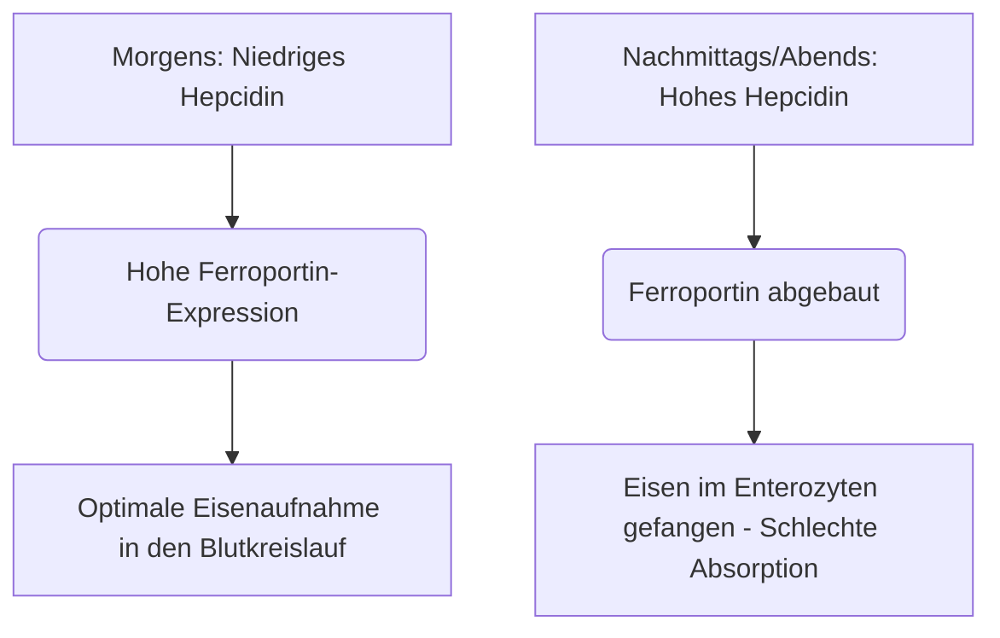

Eisen ist ein unverzichtbarer Mikronährstoff, der als struktureller und katalytischer Cofaktor beim Sauerstofftransport, der Zellatmung und der DNA-Synthese fungiert. Trotz seines reichlichen Vorkommens in der Natur ist Eisen in der menschlichen Ernährung häufig ein wachstumslimitierender Nährstoff. Da der Mensch über keinen physiologischen Mechanismus zur aktiven Eisenausscheidung verfügt, wird der systemische Eisenhaushalt ausschließlich auf der Ebene der Darmabsorption aufrechterhalten.

Nahrungseisen kommt in zwei Hauptformen vor: **organisches (Häm-)Eisen** und **anorganisches (Nicht-Häm-)Eisen**.

Hämeisen hat eine hohe Bioverfügbarkeit und wird normalerweise zu 15 bis 35 % absorbiert. Es wird intakt über den apikalen Bürstensaum der Enterozyten des Zwölffingerdarms über das Häm-Trägerprotein 1 (HCP1) transportiert und bleibt vor herkömmlichen Nahrungshemmern geschützt.

Im Gegensatz dazu macht Nicht-Häm-Eisen (anorganisches Eisen) über 80 % der Nahrungsaufnahme aus, weist jedoch ein stark beeinträchtigtes Absorptionsprofil auf, wobei die Absorptionsraten nur zwischen 2 % und 20 % liegen.

> [!TIP]
> Bei physiologischem pH-Wert liegt Nicht-Häm-Eisen überwiegend in seinem oxidierten, stark unlöslichen Ferri-Zustand (Fe³⁺) vor. Um absorbiert zu werden, muss es vor dem Eintritt in den Enterozyten über den divalenter Metalltransporter 1 (DMT1) durch die apikale Reduktase duodenales Cytochrom b (Dcytb) in den löslichen Ferro-Zustand (Fe²⁺) reduziert werden.

## Häm-Eisen vs. Nicht-Häm-Eisen Wege

| Merkmal / Metrik | Häm-Eisen-Weg | Nicht-Häm-Eisen-Weg (Anorganisch) |
| :--- | :--- | :--- |
| **Nahrungsquellen** | Tierische Gewebe (Hämoglobin, Myoglobin) | Pflanzen, mit Eisen angereicherte Lebensmittel, Mineralsalze |
| **Apikaler Transporter** | Häm-Trägerprotein 1 (HCP1) | Divalenter Metalltransporter 1 (DMT1) |
| **Erforderlicher Valenzzustand** | Porphyringebundener Komplex | Ferro-Zustand (Fe²⁺) |
| **Optimaler luminaler pH-Wert** | Weitgehend stabil; unbeeinflusst durch Magensäure | Stark sauer (pH < 3.0) für die Löslichkeit erforderlich |
| **Typische Absorptionsrate**| 15 % – 35 % (hohe Bioverfügbarkeit) | 2 % – 20 % (stark schwankend) |
| **Empfindlichkeit gegenüber Hemmstoffen** | Vernachlässigbar; geschützt durch den Porphyrinring | Extrem hoch (gehemmt durch Phytate, Polyphenole, Kalzium) |

## Optimales Timing (Chronopharmakologie)

Die Optimierung der Nicht-Häm-Eisenaufnahme erfordert eine genaue Abstimmung mit der tageszeitlichen Kinetik von **Hepcidin**, einem aus 25 Aminosäuren bestehenden Peptidhormon, das hauptsächlich von Hepatozyten synthetisiert wird. Hepcidin fungiert als systemischer Hauptregulator der Eisenhomöostase, indem es direkt an den basolateralen Exporter Ferroportin bindet und dessen Abbau induziert. Infolgedessen fangen erhöhte zirkulierende Hepcidinspiegel Eisen in den Enterozyten des Zwölffingerdarms ein und verhindern dessen Eintritt in die Blutbahn.

### Zirkadiane Rhythmik von Hepcidin
Unter physiologischen Grundbedingungen erreichen die Hepcidinkonzentrationen am frühen Morgen ihren Tiefpunkt, steigen im Laufe des Nachmittags stetig bis zu einem Höhepunkt an und sinken nachts.

Diese zirkadiane Kurve wirkt sich direkt auf die orale Eisenkinetik aus. Eine **morgendliche Einnahme** von Eisenpräparaten ermöglicht es dem Mineral, den Zwölffingerdarm zu erreichen, wenn die Ferroportinexpression der Enterozyten am höchsten ist. Im Gegensatz dazu zwingt eine Einnahme am Nachmittag oder Abend das Eisen dazu, mit einer erhöhten Hepcidinblockade zu konkurrieren, was zu einer Verringerung der fraktionellen Eisenabsorption um 37 % führt.

### Die Auswirkungen der Magensäure
Der biophysikalische Zustand von anorganischem Eisen ist stark abhängig von der Magensäureproduktion. Eine pharmakologische Unterdrückung der Magensäure durch Protonenpumpenhemmer (PPI - Magenschoner) stört dieses Mikromilieu massiv, erhöht den pH-Wert im Magen und führt zu einer schnellen Oxidation von löslichem Fe²⁺ zu stark unlöslichem Fe³⁺.

> [!WARNING]
> Orale Eisenpräparate müssen zwingend auf nüchternen Magen – idealerweise 1 Stunde vor oder 2 Stunden nach einer Mahlzeit – und streng getrennt von säureunterdrückenden Medikamenten eingenommen werden.

## Die tödlichen Wechselwirkungen (Was Sie NIEMALS mischen dürfen)

Die therapeutische Wirksamkeit von oralem Eisen wird durch die gleichzeitige Einnahme verschiedener Nahrungsbestandteile und pharmazeutischer Wirkstoffe leicht beeinträchtigt.

### Kalzium
Kalzium, ob als diätetisches Milchprodukt (Milch, Käse, Joghurt) oder als Mineralstoffergänzung (Kalziumcarbonat) eingenommen, ist ein starker Hemmstoff der Absorption sowohl von Häm- als auch von Nicht-Häm-Eisen. Die gleichzeitige Einnahme von 500 mg Kalziumcarbonat zu einer eisenhaltigen Mahlzeit verringert die fraktionelle Eisenabsorption um über 50 %.

### Tannine und Polyphenole
Polyphenole, die in **Schwarztee, Grüntee, Kräutertees und Kaffee** enthalten sind, sind außergewöhnlich wirksame Eisen-Chelatbildner. Diese aus Pflanzen stammenden Verbindungen koordinieren mit Ferri-Eisen, um hochstabile, große metallorganische Komplexe zu bilden, die den Bürstensaum des Zwölffingerdarms nicht passieren können. Das Hinzufügen von nur einer einzigen Tasse Kaffee oder Tee zu einer Mahlzeit kann die Nicht-Häm-Eisenabsorption um 40 % bis 70 % verringern.

### Phytinsäure
Phytinsäure ist die primäre Phosphorspeicherverbindung in Vollkornprodukten, Getreide, Nüssen und Hülsenfrüchten. Das molare Verhältnis von Phytinsäure zu Eisen ist der wichtigste diätetische Einzelfaktor, der die Bioverfügbarkeit von Eisen bei pflanzlicher Ernährung einschränkt.

### Zink und Magnesium
Ferro-Eisen, Zink und Magnesium teilen sich überlappende Transportwege durch die apikale Membran der Enterozyten (wie DMT1). Bei therapeutischen Eisendosen tritt eine kompetitive Hemmung auf, die den Eisentransport erheblich unterdrückt. Nehmen Sie Ihr Eisenpräparat nicht zusammen mit Zink oder Magnesium ein.

### Schilddrüsenmedikamente (Levothyroxin)
Die gleichzeitige Verabreichung oraler Eisenpräparate mit Levothyroxin (T4) führt zu einer schweren Arzneimittel-Nährstoff-Wechselwirkung. Das Eisen koordiniert mit dem Levothyroxinmolekül und bildet einen unlöslichen Komplex, der die orale Bioverfügbarkeit von Levothyroxin um 20 % bis 64 % verringert.

> [!CAUTION]
> Um ein klinisches Versagen Ihrer Schilddrüsentherapie zu verhindern, muss ein striktes Mindestintervall von 4 Stunden zwischen der Einnahme von Levothyroxin und Eisen eingehalten werden.

## Der ultimative Co-Faktor: Vitamin C

Ascorbinsäure (Vitamin C) ist der stärkste Verstärker der Nicht-Häm-Eisenabsorption und in der Lage, die hemmenden Wirkungen von diätetischen Phytaten, Polyphenolen und Kalzium aufzuheben.

Diese synergistische Beziehung funktioniert über einen hocheffizienten dualen biochemischen Mechanismus:
1. **Thermodynamisch günstige Reduktion:** Ascorbinsäure wandelt unlösliche Ferri-Ionen (Fe³⁺) schnell in die hochlösliche Ferro-Form (Fe²⁺) um, bereit für den Transport.
2. **Duodenale Chelatbildung:** Ascorbinsäure fungiert als Schutzschild und verhindert, dass sich das Eisen beim Übergang in das alkalische Milieu des Zwölffingerdarms an Phytate und Polyphenole bindet.

## Nebenwirkungen und das Paradigma der alternierenden Dosierung

Der traditionelle Ansatz zur Behandlung von Eisenmangelanämie – die tägliche Verschreibung hochdosierter oraler Eisenpräparate – scheitert häufig an schweren gastrointestinalen Nebenwirkungen (Übelkeit, Verstopfung) und systemischen Rückkopplungsschleifen.

Aufgrund der geringen fraktionellen Absorption verbleiben bis zu 90 % einer oralen Standard-Eisendosis unabsorbiert im Magen-Darm-Trakt. Dieses überschüssige Eisen reagiert mit Wasserstoffperoxid, um hochgiftige Hydroxylradikale zu erzeugen, die oxidativen Stress und Schleimhautentzündungen auslösen.

Darüber hinaus lösen hohe tägliche Eisenpräparate einen systemischen **"Mucosal Block" (Schleimhautblockade)** aus. Die Einnahme einer oralen Eisendosis von ≥ 60 mg induziert einen raschen Anstieg des Serum-Hepcidins, das 24 Stunden lang erhöht bleibt. Wird am nächsten Tag eine zweite Eisendosis verabreicht, werden die Enterozyten physisch daran gehindert, es in den Pfortaderkreislauf zu exportieren. Das Eisen ist gefangen und wird schließlich ausgeschieden.

> [!TIP]
> **Alternierende Dosierung:** Um diesen durch Hepcidin vermittelten Block zu umgehen, ist die moderne Hämatologie dazu übergegangen, orales Eisen **jeden zweiten Tag** zu verabreichen. Klinische Studien belegen, dass die Einnahme von Eisen alle 48 Stunden die fraktionelle Eisenabsorption im Vergleich zur täglichen Dosierung um 40 % bis 50 % erhöht, während gastrointestinale Nebenwirkungen drastisch reduziert werden.

### Zusammenfassung der klinischen Protokolle

*   **Niedriger Magen-pH-Wert ist unerlässlich:** Nehmen Sie Eisen auf nüchternen Magen mit Wasser ein.
*   **Vermeiden Sie wichtige diätetische Inhibitoren:** Vermeiden Sie es strikt, Eisen zusammen mit Kalzium, Milchprodukten, Kaffee oder Tee einzunehmen.
*   **Halten Sie strikte Medikamentenabstände ein:** Trennen Sie Eisen und Levothyroxin um mindestens 4 Stunden.
*   **Nutzen Sie Vitamin C:** Die gleichzeitige Einnahme von Eisen mit Vitamin C steigert die Absorption um bis zu 300 %.
*   **Wenden Sie die alternierende Dosierung an:** Nehmen Sie orale Eisendosen im Abstand von 48 Stunden ein, um die durch Hepcidin induzierte Schleimhautblockade zu vermeiden und die Absorption zu maximieren.

## Quellen

1. Stoffel NU, Zeder C, Brittenham GM, Moretti D, Zimmermann MB. [Iron absorption from oral iron supplements given on consecutive versus alternate days and as single morning doses versus twice-daily split dosing in iron-depleted women: two open-label, randomised controlled trials](https://pubmed.ncbi.nlm.nih.gov/29032957/). *Lancet Haematol.* 2017.
2. Campbell NR, Hasinoff BB. [Ferrous sulfate reduces thyroxine efficacy in patients with hypothyroidism](https://pubmed.ncbi.nlm.nih.gov/1443969/). *Ann Intern Med.* 1992.
3. Hallberg L, Hulthén L. [Effect of ascorbic acid intake on nonheme-iron absorption from a complete diet](https://pubmed.ncbi.nlm.nih.gov/11124756/). *Am J Clin Nutr.* 2000.
4. Lönnerdal B. [Calcium and iron absorption—mechanisms and public health relevance](https://pubmed.ncbi.nlm.nih.gov/21462112/). *Int J Vitam Nutr Res.* 2010.

*Dieser Artikel dient nur zu Informationszwecken und stellt keine medizinische Beratung dar. Konsultieren Sie eine qualifizierte medizinische Fachkraft, bevor Sie Ihre Routine für Nahrungsergänzungsmittel oder Medikamente ändern.*
