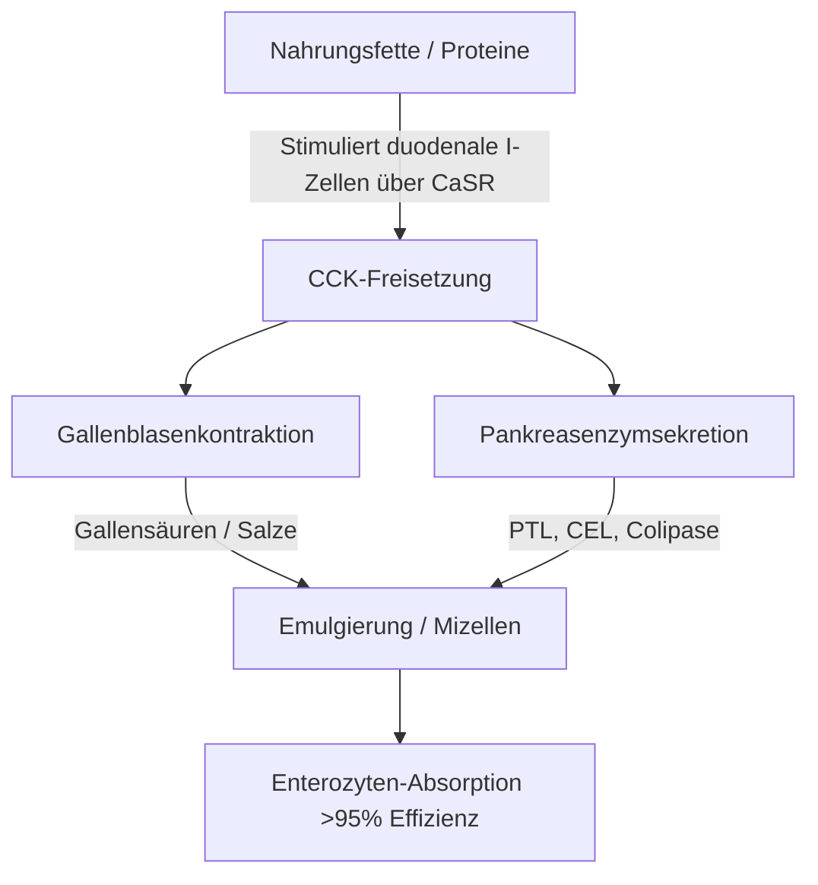
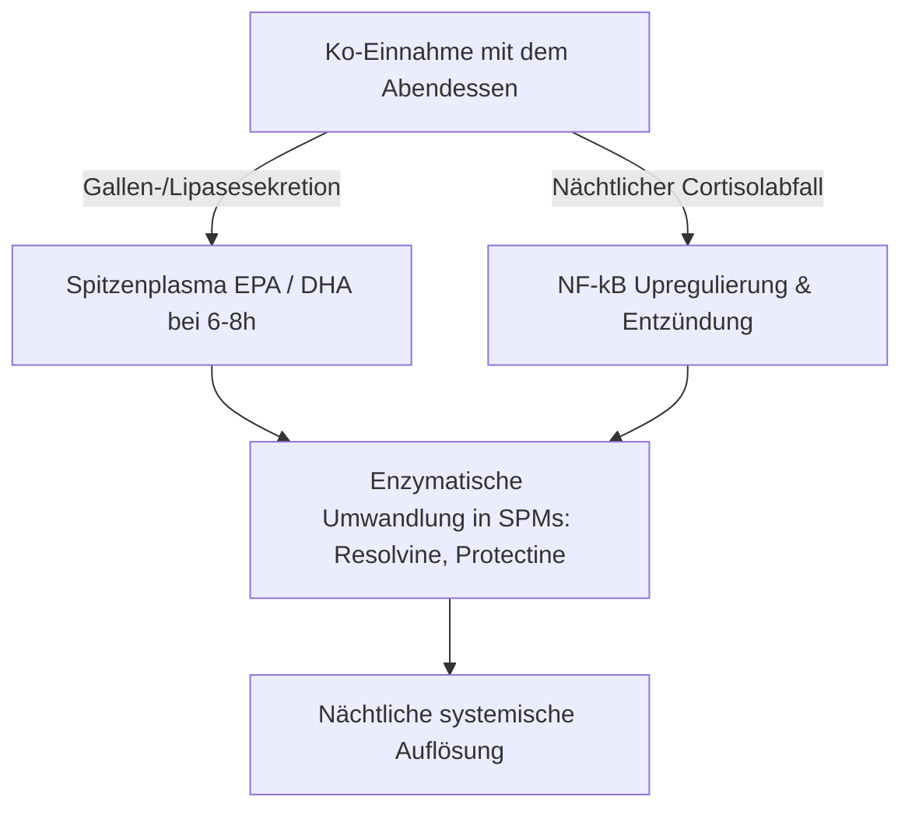

Die therapeutische Wirksamkeit von langkettigen, marinen Omega-3-mehrfach ungesättigten Fettsäuren ($\text{PUFAs}$), insbesondere Eicosapentaensäure ($\text{EPA}$) und Docosahexaensäure ($\text{DHA}$), wird streng durch ihre intestinale Bioverfügbarkeit bestimmt. In der klinischen Ernährung ist eine Hauptursache für therapeutisches Versagen das "Paradoxon der mageren Mahlzeit" – die Verabreichung stark hydrophober mariner Lipide im nüchternen Zustand oder zusammen mit fettfreien Mahlzeiten. Trotz der Einnahme hoher nominaler Dosen verhindert das Fehlen einer strukturierten Lipid-Koingestionsmatrix die physikalischen und enzymatischen Mechanismen, die für die Lipidabsorption im wässrigen Lumen des menschlichen Magen-Darm-Trakts erforderlich sind. Diese klinische Analyse detailliert die biophysikalischen, biochemischen und chronopharmakologischen Prinzipien, die die Verdauung und Absorption von $\text{EPA}$ und $\text{DHA}$ diktieren.

## Fasten und das Paradoxon der mageren Mahlzeit

Der Magen-Darm-Trakt ist grundlegend ein wässriges System. Wenn hydrophobe Lipide wie herkömmliche Fischöle eingenommen werden, treffen sie auf die stark polare Umgebung der Magen- und Darmsäfte. Nach den Gesetzen der Thermodynamik minimieren hydrophobe Moleküle ihren Kontakt mit Wasser, was zu einer schnellen Phasentrennung führt. Dies bewirkt, dass sich das aufgenommene Öl zu großen, ungeteilten Lipidtröpfchen zusammenschließt, die auf dem wässrigen Speisebrei (Chymus) des Magens schwimmen.

Die Einnahme einer Omega-3-Kapsel mit einem Glas Wasser auf nüchternen Magen oder zusammen mit einer reinen Kohlenhydratmahlzeit (wie einem Stück Obst oder einer Scheibe trockenem Brot) löst die physiologischen Prozesse nicht aus, die zur Überwindung dieser Phasentrennung erforderlich sind. Ohne physikalische Emulgierung bleibt das Verhältnis von Oberfläche zu Volumen der Lipidphase extrem gering. Die hydrophilen aktiven Zentren der Pankreaslipasen können nicht auf die Esterbindungen zugreifen, die in diesen großen, hydrophoben Tröpfchen verborgen sind. Folglich fördert das Trinken von Wasser zum Fischöl nicht die Absorption; stattdessen verdünnt es die Spuren der im nüchternen Zustand vorhandenen Verdauungsenzyme, entfernt die unemulgierten Lipidtröpfchen weiter von der Bürstensaummembran der Enterozyten und führt zu Malabsorption und Magen-Darm-Beschwerden.

Damit diese stark hydrophoben Lipide die ungerührte Wasserschicht der Darmschleimhaut überwinden können, müssen sie in eine thermodynamisch stabile, in Wasser dispergierbare Phase umgewandelt werden. Diese Umwandlung hängt vollständig von der physikalischen Chemie der Mizellenbildung ab, einem Prozess, der durch hormonvermittelte duodenale Signalgebung initiiert wird.

## Gallensalze und Mizellenbildung

Der Übergang von einer schwimmenden, hydrophoben Ölmasse zu absorbierbaren Mikrotröpfchen erfordert eine koordinierte neuromuskuläre und sekretorische Kaskade im Zwölffingerdarm (Duodenum). Der primäre hormonelle Treiber dieses Prozesses ist Cholecystokinin ($\text{CCK}$), ein 33-Aminosäure-Peptid, das von enteroendokrinen I-Zellen in der Schleimhaut des Zwölffingerdarms und des oberen Jejunums synthetisiert und sezerniert wird.



Unter physiologischen Bedingungen stimuliert das Vorhandensein von langkettigen Fettsäuren und teilweise verdauten Proteinen im Duodenallumen den Calcium-Sensing-Rezeptor ($\text{CaSR}$) auf I-Zellen, was die schnelle Exozytose von $\text{CCK}$ in den Blutkreislauf auslöst. Sobald freigesetzt, bindet $\text{CCK}$ an $\text{CCK}_A$-Rezeptoren in der Gallenblasenwand, wodurch sie sich zusammenzieht, während gleichzeitig der Sphinkter Oddi entspannt wird und die Pankreasazinuszellen zur Freisetzung ihrer Verdauungsenzyme angeregt werden.

Die aus der Gallenblase freigesetzten Gallensäuren – primär amphipathische Natriumsalze der Cholsäure und Chenodeoxycholsäure – sind wesentliche biologische Reinigungsmittel (Detergenzien). Wenn die Gallensäurekonzentrationen im Zwölffingerdarm die kritische Mizellenkonzentration ($\text{CMC}$) überschreiten, ordnen sie sich um die hydrophoben Lipidtröpfchen herum an. Der hydrophobe Steroidkern des Gallensalzes assoziiert sich mit der Lipidphase, während die polare, hydrophile Konjugatgruppe (Glycin oder Taurin) dem wässrigen Duodenallumen zugewandt ist.

Durch die mechanische Wirkung der Darmperistaltik werden diese gallenbeschichteten Tröpfchen zu gemischten Mizellen zerschert. Diese kugelförmigen kolloidalen Aggregate haben einen Durchmesser von nur 3 bis 10 Nanometern und vergrößern die der Pankreaslipase ausgesetzte Lipidoberfläche um das Mehrtausendfache. Ohne die gleichzeitige Einnahme gesunder Nahrungsfette (wie natives Olivenöl extra, Avocado oder Eigelb aus Freilandhaltung) zur Auslösung der Schwelle für die $\text{CCK}$-Freisetzung erfolgt keine Gallenblasenkontraktion. In diesem Zustand bleiben die Gallensäurespiegel unter der $\text{CMC}$, die Sekretion der Pankreaslipase ist minimal, und die aufgenommenen Omega-3-Lipide können keine Mizellen bilden, was eine Absorption verhindert.

## Kampf der biochemischen Formen: TG vs. EE vs. PL

Kommerziell erhältliche Omega-3-Nahrungsergänzungsmittel existieren in drei primären molekularen Formen: natürliche oder re-veresterte Triglyceride ($\text{TG}$/$\text{rTG}$), Ethylester ($\text{EE}$) und Phospholipide ($\text{PL}$). Die molekulare Struktur dieser Träger bestimmt ihre Verdauungsrate, Lipase-Abhängigkeit und Bioverfügbarkeit.

```text
Triglycerid (TG) Form:             Ethylester (EE) Form:          Phospholipid (PL) Form:
     ┌─ Glycerin-Rückgrat               ┌─ Ethanol-Molekül             ┌─ Phosphat-Kopf (Polar)
     ├─ Fettsäure (EPA)                 └─ Fettsäure (EPA)             ├─ Fettsäure (EPA)
     ├─ Fettsäure (DHA)                                                └─ Fettsäure (DHA)
     └─ Fettsäure (Andere)
```

In natürlichen und re-veresterten Triglyceriden ($\text{TG}$/$\text{rTG}$) sind drei Fettsäuren ($\text{EPA}$/$\text{DHA}$) an ein Drei-Kohlenstoff-Glycerin-Rückgrat gebunden. Während der Verdauung hydrolysiert die pankreatische Triglyceridlipase ($\text{PTL}$), die mit ihrem Cofaktor Colipase zusammenarbeitet, die Esterbindungen an den Positionen $sn\text{-}1$ und $sn\text{-}3$. Dies produziert zwei freie Fettsäuren und ein $sn\text{-}2$-Monoglycerid, die beide stark polar, leicht mizellarisierbar und von Enterozyten mit über 95% Effizienz leicht absorbiert werden.

Umgekehrt ist die Ethylester-Form ($\text{EE}$) ein synthetisches Produkt, das während der chemischen Konzentration entsteht. Das Glycerin-Rückgrat wird entfernt, und jede einzelne Fettsäure wird mit einem Ethanolmolekül ($\text{CH}_3\text{CH}_2\text{OH}$) verestert. Diese synthetische Esterbindung ist sehr resistent gegenüber menschlichen Pankreasenzymen. In-vitro- und In-vivo-Studien zeigen, dass die menschliche Pankreaslipase die Fettsäure-Ethanol-Bindung in $\text{EE}$ mit einer 10- bis 50-mal langsameren Rate hydrolysiert als die Glycerylesterbindungen in Triglyceriden.

Aufgrund dieser langsamen Hydrolyse ist die EE-Absorption in hohem Maße von einer massiven Freisetzung von Pankreaslipasen und Gallensalzen abhängig, die nur durch eine fettreiche Mahlzeit ausgelöst wird. Bei einer fettarmen Diät kann die begrenzte verfügbare Pankreaslipase die EE-Bindungen nicht effizient spalten, was zu einer schlechten Bioverfügbarkeit (oft auf etwa 20% abfallend) führt und dazu führt, dass nicht absorbierte synthetische Ester in den Dickdarm gelangen, wo sie Magen-Darm-Nebenwirkungen verursachen können.

Die Phospholipid-Form ($\text{PL}$), die primär aus antarktischem Krillöl (Euphausia superba) stammt, weist eine amphipathische Struktur auf, bei der $\text{EPA}$ und $\text{DHA}$ an ein Phosphatidylcholin-Rückgrat gebunden sind. Die hochpolare Phosphat-Kopfgruppe macht Phospholipide von Natur aus in Wasser dispergierbar. Aus diesem Grund können sich PL-Formen im Magen-Darm-Trakt selbst emulgieren und spontane Mikrotröpfchen bilden, wodurch die absolute Notwendigkeit der durch Gallensalz stimulierten Mizellenbildung umgangen wird. Phospholipide werden auch über Phospholipase $\text{A}_2$ verdaut und können als Lysophospholipide direkt von den Enterozyten absorbiert werden, was selbst unter Fasten- oder fettarmen Bedingungen zu einer hohen Bioverfügbarkeit führt.

| Biochemische Form | Molekularer Träger / Rückgrat | Mittlere Absorptionsrate (Fettarme Mahlzeit) | Mittlere Absorptionsrate (Fettreiche Mahlzeit) | Relative Bioverfügbarkeit (vs. EE Baseline) | Abhängigkeit von Pankreaslipase |
| --- | --- | --- | --- | --- | --- |
| Ethylester (EE) | Ethanol ($\text{CH}_3\text{CH}_2\text{OH}$) | $\approx 20\%$ | $\approx 60\%$ | Baseline ($100\%$) | Absolut; wird 10-50x langsamer hydrolysiert als TG |
| Triglycerid (TG / rTG) | Glycerin-Rückgrat | $\approx 68\%$ | $\approx 90\%$ | $124\%$ bis $186\%$ | Hoch; wird schnell in 2-FFA und 1-MAG gespalten |
| Phospholipid (PL) | Phosphatidylcholin | $\approx 80\%$ bis $95\%$ | $>95\%$ | $168\%$ bis $500\%$ | Minimal; selbstemulgierend, umgeht bestimmte Lipasen |

> [!WARNING]
> Personen mit exokriner Pankreasinsuffizienz (EPI), biliärer Dyskinesie oder Personen nach Cholezystektomie weisen eine stark beeinträchtigte endogene Lipidverdauung auf. Für diese klinischen Populationen stellt die Verabreichung von synthetischen Ethylester-Formulierungen (EE) unter fettarmen diätetischen Einschränkungen ein hohes Risiko für vollständige Malabsorption und gastrointestinale Beschwerden dar, da die erforderliche enzymatische Spaltung in diesen Zuständen praktisch nicht vorhanden ist.

## Lipidoxidation und die absolute Notwendigkeit von Vitamin E

Die strukturellen Merkmale, die $\text{EPA}$ und $\text{DHA}$ biologisch aktiv machen, machen sie auch sehr instabil. $\text{EPA}$ enthält fünf und $\text{DHA}$ sechs methylenunterbrochene Doppelbindungen. Die Kohlenstoff-Wasserstoff-Bindungen an den bis-allylischen Methylenkohlenstoffen ($\text{-CH=CH-CH}_2\text{-CH=CH-}$) weisen niedrige Bindungsdissoziationsenergien auf. Dies macht sie außergewöhnlich anfällig für den Angriff freier Radikale und die nicht-enzymatische Lipidperoxidation.

```text
Phase 1: Initiation (Einleitung)
  [PUFA Kohlenstoff-Wasserstoff-Bindung] + [ROS / Freies Radikal] ──> [Kohlenstoffzentriertes Lipidradikal (R•)]

Phase 2: Propagation (Ausbreitung)
  [Kohlenstoffzentriertes Lipidradikal (R•)] + [O2] ──> [Lipid-Peroxyl-Radikal (ROO•)]
  [Lipid-Peroxyl-Radikal (ROO•)] + [Unoxidierte PUFA] ──> [Lipidhydroperoxid (ROOH)] + [Neues Lipidradikal (R•)]

Phase 3: Decomposition (Abbau)
  [Instabiles Lipidhydroperoxid (ROOH)] ──> [Toxische Aldehyde (MDA / HHE)]
```

Nach der Einnahme ist das Fischöl einer Umgebung von $37^\circ\text{C}$ (Körpertemperatur), Magensäuren und gelöstem molekularem Sauerstoff ($\text{O}_2$) ausgesetzt. Diese Umgebung beschleunigt die Lipidperoxidationskaskade durch drei verschiedene Phasen:

1. **Initiation:** Eine reaktive Sauerstoffspezies ($\text{ROS}$) abstrahiert ein Wasserstoffatom von einem bis-allylischen Kohlenstoff, wodurch ein kohlenstoffzentriertes Lipidradikal ($\text{R}^\bullet$) erzeugt wird.
2. **Propagation:** Das Lipidradikal reagiert schnell mit molekularem Sauerstoff ($\text{O}_2$) unter Bildung eines Lipid-Peroxyl-Radikals ($\text{ROO}^\bullet$). Dieses Peroxylradikal abstrahiert dann ein Wasserstoffatom von einem benachbarten unoxidierten $\text{PUFA}$-Molekül, wodurch ein Lipidhydroperoxid ($\text{ROOH}$) und ein neues Lipidradikal entstehen, was die Kettenreaktion aufrechterhält.
3. **Decomposition:** Die instabilen Lipidhydroperoxide zerfallen in hochreaktive, zytotoxische sekundäre Oxidationsprodukte, einschließlich Alkenale wie Malondialdehyd ($\text{MDA}$) und 4-Hydroxyhexenal ($\text{HHE}$).

Diese sekundären Oxidationsprodukte werden leicht über den Darm absorbiert, in Chylomikronen und Lipoproteine niedriger Dichte ($\text{LDL}$) eingebaut und können systemischen oxidativen Stress, Endothelschäden und Atherogenese induzieren.

Um diesen Prozess zu stoppen, ist die Koformulierung eines kettenabbrechenden, fettlöslichen Antioxidans erforderlich. Natürliches Vitamin E, insbesondere d-alpha-Tocopherol ($\text{C}_{29}\text{H}_{50}\text{O}_2$), ist für diese Rolle hochgradig optimiert. D-alpha-Tocopherol wirkt als Wasserstoffdonor und überträgt sein phenolisches Wasserstoffatom schnell auf das reaktive Lipid-Peroxyl-Radikal ($\text{ROO}^\bullet$) mit einer extrem schnellen Ratenkonstanten von etwa $10^6\,\text{M}^{-1}\text{s}^{-1}$.

Das resultierende Tocopheroxylradikal ist aufgrund der Resonanzdelokalisierung seines ungepaarten Elektrons über den Chromanolring sehr stabil, was verhindert, dass es benachbarte Fettsäureketten angreift. Dies stoppt die Kettenreaktion und schützt die strukturelle Integrität der $\text{EPA}$- und $\text{DHA}$-Moleküle, so dass sie Zielgewebe in ihrem aktiven, unoxidierten Zustand erreichen können.

## Chronopharmakologie und das nächtliche antiinflammatorische Fenster

In der Lipidbiochemie ist das Timing ein kritischer Faktor. Die Einnahme von Omega-3-Nahrungsergänzungsmitteln zusammen mit der größten, fettreichsten Mahlzeit des Tages (typischerweise das Abendessen) optimiert sowohl die Absorption als auch die natürlichen nächtlichen Heilungsprozesse des Körpers.



Erstens ist das Abendessen für viele Menschen historisch gesehen die fetthaltigste Mahlzeit des Tages. Dies liefert das physikalische Lipidvolumen, das erforderlich ist, um eine maximale $\text{CCK}$-Freisetzung auszulösen, was zu einer robusten Gallenblasenkontraktion, einer reichen Gallensekretion und einer hohen Pankreaslipase-Aktivität führt. Dies optimiert die Mizellenbildung und Verdauungskinetik und stellt sicher, dass fast die gesamte eingenommene Dosis erfolgreich resorbiert wird.

Zweitens passt die abendliche Verabreichung zu den zirkadianen Immun- und Entzündungszyklen des Körpers. Die endogenen Cortisolspiegel fallen am späten Abend und in der frühen Nacht natürlich auf ihre niedrigsten diurnalen Werte ab. Cortisol ist ein potentes entzündungshemmendes Hormon; wenn seine Spiegel sinken, erfahren systemische Entzündungswege – wie die, die durch den pro-inflammatorischen Transkriptionsfaktor $\text{NF}\text{-}\kappa\text{B}$ gesteuert werden – eine relative Upregulation (Hochregulierung).

Durch die Einnahme von Omega-3 mit dem Abendessen werden Spitzenplasma- und Zellmembrankonzentrationen von $\text{EPA}$ und $\text{DHA}$ 6 bis 8 Stunden später erreicht, was direkt mit diesem nächtlichen Entzündungsfenster zusammenfällt. Während dieser Phase nutzt der Körper diese Fettsäuren als Substrate für die enzymatische Synthese von Specialized Pro-resolving Mediators ($\text{SPMs}$) – spezifisch Resolvine, Protectine und Maresine – über Cyclooxygenase ($\text{COX}$)- und Lipoxygenase ($\text{LOX}$)-Wege. Diese $\text{SPMs}$ lösen aktiv chronische Mikroentzündungen auf, fördern den Zellumsatz und unterstützen die Gewebeheilung während des Schlafs.

Darüber hinaus bietet die abendliche Verabreichung von Omega-3-Fettsäuren, insbesondere $\text{DHA}$, einzigartige neurologische Vorteile. $\text{DHA}$ ist ein wichtiges strukturelles Lipid in neuronalen Membranen und spielt eine wichtige Rolle in der zirkadianen Uhr des Gehirns. Es wirkt auf Uhrengene (wie BMAL1 und CLOCK), die für die Regulierung des Schlaf-Wach-Zyklus verantwortlich sind.

Die nächtliche Integration von $\text{DHA}$ in synaptische Membranen unterstützt die neuronale Kommunikation, steigert die Serotoninsynthese und optimiert deren Umwandlung in Melatonin. Klinische Studien zeigen, dass eine konsequente abendliche Omega-3-Supplementierung die Schlafeffizienz signifikant verbessert, die Einschlaflatenz verkürzt und den Schlaffragmentierungsindex (nächtliches Erwachen) reduziert.

> [!TIP]
> Um den zellulären Bio-Einbau von langkettigen Omega-3-Fettsäuren zu maximieren, sollten Ärzte empfehlen, dass Patienten ihre Tagesdosis zusammen mit der fettreichsten Mahlzeit des Tages verabreichen. Die Ko-Einnahme mit mindestens 10-15 Gramm gesunden einfach oder mehrfach ungesättigten Fetten (z.B. natives Olivenöl extra oder Avocado) reicht aus, um die für eine optimale Mizellenbildung notwendige Cholecystokinin-Freisetzung auszulösen.

## Klinische Synthesen und handlungsorientierte Empfehlungen

Die Maximierung des therapeutischen Potenzials der Omega-3-Supplementierung erfordert eine Abkehr von der einfachen Einnahme hochdosierter Kapseln hin zu einem Ansatz, der auf der Lipidbiochemie und Verdauungskinetik basiert. Die traditionelle Praxis, Fischöl mit Wasser auf nüchternen Magen einzunehmen, führt oft zu schlechter Absorption und gastrointestinalen Nebenwirkungen.

Für optimale therapeutische Ergebnisse sollten Kliniker re-veresterte Triglycerid- ($\text{rTG}$) oder Phospholipid- ($\text{PL}$) Formulierungen priorisieren, die im Vergleich zu synthetischen Ethylestern ($\text{EE}$) eine überlegene Absorptionskinetik aufweisen und weniger auf fettreiche Mahlzeiten angewiesen sind.

Unabhängig von der gewählten Formulierung muss das Ergänzungsmittel zusammen mit einer Mahlzeit eingenommen werden, die mindestens 10 bis 15 Gramm Nahrungsfett enthält. Diese Lipidschwelle ist erforderlich, um die duodenale $\text{CCK}$-Signalkaskade auszulösen, die die Gallenblasenkontraktion und Pankreaslipase-Sekretion initiiert, um eine vollständige Mizellenbildung zu ermöglichen.

Um diese hochgradig instabilen $\text{PUFAs}$ vor oxidativen Schäden im Körper zu schützen, sollte die Formulierung darüber hinaus immer ein natürliches, fettlösliches Antioxidans wie d-alpha-Tocopherol (Vitamin E) enthalten.

Schließlich stellt die Abstimmung der Supplementierung auf das Abendessen sicher, dass die maximale Absorption mit den natürlichen nächtlichen entzündungshemmenden und zellulären Reparaturwegen des Körpers übereinstimmt, wodurch die kardiovaskulären, immunologischen und neurologischen Vorteile von $\text{EPA}$ und $\text{DHA}$ maximiert werden.

## Quellen

1. Nordøy A, et al. [Absorption of the n-3 eicosapentaenoic and docosahexaenoic acids as ethyl esters and triglycerides by humans](https://pubmed.ncbi.nlm.nih.gov/1826985/). *American Journal of Clinical Nutrition.* 1991.
2. Offman E, Marenco T, Ferber S, Johnson J, Kling D, Curcio D, Davidson M. [Steady-state bioavailability of prescription omega-3 on a low-fat diet is significantly improved with a free fatty acid formulation compared with an ethyl ester formulation: the ECLIPSE II study](https://pubmed.ncbi.nlm.nih.gov/24124374/). *Vascular Health and Risk Management.* 2013.
3. Schuchardt JP, Schneider I, Meyer H, Neubronner J, von Schacky C, Hahn A. [Incorporation of EPA and DHA into plasma phospholipids in response to different omega-3 fatty acid formulations - a comparative bioavailability study of fish oil vs. krill oil](https://pubmed.ncbi.nlm.nih.gov/21854650/). *Lipids in Health and Disease.* 2011.
4. Brown JE, Wahle KW. [Effect of fish-oil and vitamin E supplementation on lipid peroxidation and whole-blood aggregation in man](https://pubmed.ncbi.nlm.nih.gov/2282693/). *Clinica Chimica Acta.* 1990.

*Dieser Artikel dient nur zu Informationszwecken und stellt keine medizinische Beratung dar. Konsultieren Sie eine qualifizierte medizinische Fachkraft, bevor Sie Ihre Routine für Nahrungsergänzungsmittel oder Medikamente ändern.*
