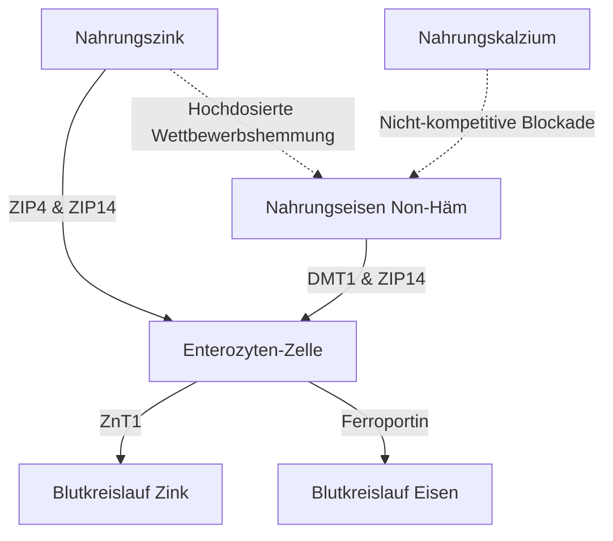

Die Verabreichung von Zinkpräparaten ($\text{Zn}^{2+}$) birgt eine Reihe von physiologischen und biochemischen Paradoxa. Obwohl Zink ein lebenswichtiges Spurenelement ist, das an über 300 enzymatischen Reaktionen beteiligt ist, wird seine orale Aufnahme häufig durch akute Magen-Darm-Beschwerden, die kompetitive Hemmung durch andere zweiwertige Kationen und die systemische Erschöpfung anderer Mineralien behindert. Um diese Probleme zu lösen, bedarf es eines detaillierten Verständnisses der intestinalen Transporterkinetik, der Schleimhautbiochemie und der Chronopharmakologie, um optimale Dosierungsprotokolle zu entwerfen.

## Das Leer-Magen-Paradoxon: Schleimhautreizung vs. Bioverfügbarkeit

Die orale Einnahme von Zink stellt uns vor eine schwierige Wahl: Die Einnahme auf nüchternen Magen maximiert die zelluläre Bioverfügbarkeit, verursacht aber oft akute Magen-Darm-Beschwerden (Übelkeit). Im Gegensatz dazu mildert die Einnahme von Zink zu den Mahlzeiten die Beschwerden erfolgreich, führt aber Nahrungsantagonisten (Hemmstoffe) ein, die die fraktionierte Absorption stark reduzieren.

### Molekulare Mechanismen der Magenreizung und Übelkeit
Die Einnahme von gut wasserlöslichen, anorganischen Zinksalzen – wie Zinksulfat ($\text{ZnSO}_4$) oder Zinkchlorid ($\text{ZnCl}_2$) – führt zu einer schnellen Auflösung im Magenlumen. In wässrigen Lösungen dissoziieren diese Salze vollständig und bilden eine hochkonzentrierte und saure lokale Umgebung mit einem pH-Wert von etwa 4.0 bis 5.0.

Im Nüchternzustand, ohne Speisebrei, bleibt die Magenschleimhaut ungepuffert. Die plötzliche Exposition gegenüber freien zweiwertigen Zinkionen ($\text{Zn}^{2+}$) übt eine direkt ätzende und reizende Wirkung auf die Magenepithelzellen aus. Diese lokale Reizung stimuliert die Belegzellen des Magens, vermehrt Magensäure (HCl) abzusondern, was den pH-Wert weiter senkt und Schleimhauterosionen begünstigen kann.

Die sensorische Erfassung dieses chemischen Reizes wird durch das ausgedehnte Netzwerk vagaler sensorischer Neuronen vermittelt, die die Magenwand durchziehen. Einmal aktiviert, übertragen diese Neuronen Aktionspotentiale über den Vagusnerv in den Hirnstamm. Dies löst einen zentral vermittelten Brechreflex aus, der sich innerhalb von 30 Minuten nach der Einnahme als sofortige Übelkeit, verzögerte Magenentleerung und Magenkrämpfe äußert.

### Die Bioverfügbarkeits-Blockade: Phytate, Getreide und Milchprodukte

Wird Zink mit der Nahrung eingenommen, um die vagale Stimulation (Übelkeit) zu verhindern, wird seine Bioverfügbarkeit durch diätetische Hemmstoffe stark beeinträchtigt. Der stärkste dieser Hemmstoffe ist **Phytinsäure**, die in den äußeren Hüllen von unraffiniertem Getreide, Hülsenfrüchten, Nüssen und Samen hochkonzentriert vorkommt.

Beim physiologischen pH-Wert des Zwölffingerdarms fungiert die Phytinsäure als aggressiver Ligand, der freie $\text{Zn}^{2+}$-Ionen chelatiert. Dabei bilden sich hochstabile, unlösliche und strukturell komplexe Präzipitate, die der Aufnahme im Darm vollständig widerstehen. Da dem Menschen phytatspaltende Enzyme im oberen Magen-Darm-Trakt fehlen, bleiben diese Zink-Phytat-Komplexe ungespalten und werden mit dem Stuhl ausgeschieden.

> [!CAUTION]
> Quantitative Studien mit radioaktiven Markern zeigen, dass die Zugabe von nur 50 mg Phytat zu einer Mahlzeit die fraktionierte Zinkabsorption um etwa 36 % reduziert (von einem Ausgangswert von 22 % auf 14 %). Höhere Phytatkonzentrationen von 250 mg unterdrücken die Absorption vollständig auf vernachlässigbare 6–7 %.

Darüber hinaus üben auch Milchprodukte eine unabhängige hemmende Wirkung aus. **Casein**, das wichtigste Protein in Kuhmilch, bindet zweiwertige Zinkionen im Darmlumen und reduziert die Bioverfügbarkeit im Vergleich zu Molkenprotein erheblich.

### Zinkverbindungen und Verträglichkeit

| Chemische Klasse | Zinkverbindung | Fraktionierte Absorption | Magenverträglichkeit | Wirkmechanismus |
| :--- | :--- | :--- | :--- | :--- |
| **Anorganisches Salz** | Zinksulfat ($\text{ZnSO}_4$) | ~20–49,9 % | Starke Reizung (~15 % Übelkeit) | Dissoziiert schnell zu freiem $\text{Zn}^{2+}$; saurer pH (4.0–5.0). |
| **Organisches Salz** | Zinkgluconat | ~50,6–71,7 % | Mittlere Verträglichkeit (~5 % Übelkeit) | Neutraler pH (5.5–7.0); langsame Dissoziation minimiert Schleimhautexposition. |
| **Organisches Chelat**| Zink-Bisglycinat | ~50–60 % | Sehr hohe Verträglichkeit (< 5 % Übelkeit) | An Glycin gebunden; widersteht der Magendissoziation und der Phytat-Interferenz. |
| **Organisches Chelat**| Zink-Picolinat | Hoch (Langfristig überlegen) | Hohe Verträglichkeit | Mit Picolinsäure komplexiert; exzellente Anreicherung im Gewebe. |

### Wissenschaftlich optimales Einnahmeprotokoll

Um sowohl den Übelkeitsreflex auf nüchternen Magen als auch die Phytat-Blockade vollständig zu umgehen, muss ein spezifisches klinisches Protokoll angewendet werden:

1. **Umstieg auf organische Chelate:** Man sollte anorganische Zinksalze durch organische, pH-neutrale Metall-Aminosäure-Chelate wie Zink-Bisglycinat oder Zink-Picolinat ersetzen. Bei Zink-Bisglycinat ist das $\text{Zn}^{2+}$-Ion kovalent an zwei Glycin-Liganden gebunden, wodurch das Mineral vor einer vorzeitigen Aufspaltung in der Magensäure geschützt ist.
2. **Nutzung alternativer Aufnahmewege:** Im Gegensatz zu anorganischem Zink, das ausschließlich auf sättigbare, pH-abhängige Transporter angewiesen ist, werden organische Chelate intakt über alternative, hocheffiziente Wege (wie Peptid-Cotransporter) aufgenommen.
3. **Phytatarme Begleitmahlzeiten:** Wenn ein Patient extrem empfindlich ist und das Präparat zum Essen einnehmen muss, sollte Zink ausschließlich mit einem leichten Snack eingenommen werden, der völlig frei von Phytaten und hochdosiertem Kalzium ist. Zulässige Lebensmittel sind weißes Sauerteigbrot (durch die Fermentation ist das Phytat bereits abgebaut) oder einfache tierische Proteine (wie Eier oder Molkenisolat).

> [!TIP]
> **Pro-Tipp:** Um die Absorption zu maximieren und Übelkeit vollständig zu vermeiden, ist das ideale Protokoll die Einnahme von 15–30 mg elementarem Zink-Bisglycinat mit einem leichten, phytatfreien Snack am frühen Nachmittag. Dabei sollte eine 2-stündige Pause (auch für Kaffee/Tee) vor und nach der Einnahme eingehalten werden.

## Der Krieg der Transporter: DMT1 und ZIP14

Der Enterozyt im Dünndarm ist eine hart umkämpfte Arena für die Absorption von zweiwertigen Metallen. Zink ($\text{Zn}^{2+}$), pflanzliches/anorganisches Eisen ($\text{Fe}^{2+}$) und Kalzium ($\text{Ca}^{2+}$) teilen sich überlappende, sättigbare Wege. Das bedeutet, dass die gleichzeitige Verabreichung hochdosierter Präparate die Aufnahme des jeweils anderen Minerals direkt unterdrückt.

### Die Transporterlandschaft: ZIP4, ZIP14 und DMT1
An der apikalen Membran (Bürstensaum) der Enterozyten des Zwölffingerdarms ist der primäre Importeur für Nahrungszink der Transporter ZIP4. Nicht-Häm-Eisen (pflanzliches Eisen), das in den Enterozyten gelangt, ist auf einen anderen apikalen Weg angewiesen: den Divalenten Metalltransporter-1 (DMT1). Es gibt jedoch einen weiteren entscheidenden Transporter namens ZIP14. Obwohl er in erster Linie als Zinktransporter eingestuft wird, ist er auch in hohem Maße in der Lage, $\text{Fe}^{2+}$ (Eisen) zu transportieren.

Da sich $\text{Zn}^{2+}$ und $\text{Fe}^{2+}$ in ihrer Ladung und ihrem Ionenradius stark ähneln, konkurrieren sie intensiv um gemeinsame intrazelluläre Transportwege (wie ZIP14). Wenn therapeutische (hohe) Dosen von Eisen (100–400 mg) zusammen mit Zink verabreicht werden, verdrängt das Eisen das Zink bei der Aufnahme.

Klinische Untersuchungen zeigen, dass die gleichzeitige Einnahme von hochdosiertem Eisen und einer Standarddosis von 25 mg Zink die fraktionierte Zinkabsorption um etwa 40–50 % reduziert. Bei einer klinischen Eisen-Standarddosis von 10 mg kommt es bereits bei einem Verhältnis von 1:1 zu einer signifikanten gegenseitigen Hemmung.

## Die Gefahr des Kupfermangels: In der Zelle gefangen

Eine große Gefahr bei einer langfristigen, hochdosierten Zinkergänzung ist die heimtückische Entwicklung eines systemischen Kupfermangels. Dieser Weg wird durch die Hochregulierung von **Metallothionein** – einem intrazellulären metallbindenden Protein innerhalb der Enterozyten – vermittelt.

Wenn eine Person über einen längeren Zeitraum eine hohe Dosis Zink konsumiert (in der Regel mehr als 40–50 mg/Tag), fungiert der große Einstrom von zellulärem $\text{Zn}^{2+}$ als potentes Signal, das eine massive Steigerung der Metallothionein-Synthese auslöst.

Obwohl die Metallothionein-Synthese stark durch den Zinkspiegel gesteuert wird, besitzt das Protein eine Bindungsaffinität für Kupfer ($\text{Cu}^+$), die wesentlich höher ist als seine Affinität für Zink. Wenn folglich Kupfer aus der Nahrung in den Enterozyten aufgenommen wird, binden die reichlich vorhandenen intrazellulären Metallothionein-Moleküle die Kupferionen schnell und fangen sie ein.

Dieses Kupfer ist im extrem stabilen Metallothionein-Kupfer-Komplex gefangen und kann nicht in die Blutbahn gelangen. Da sich die Darmzellen alle 3-5 Tage erneuern und abgestoßen werden, wird das darin gefangene Kupfer über den Stuhl ausgeschieden. Im Laufe der Zeit führt diese Blockade zu einer tiefgreifenden, systemischen Kupferverarmung.

> [!WARNING]
> Die tägliche Einnahme von Zinkdosen von mehr als 40 mg ohne einen entsprechenden Kupferausgleich im Verhältnis 15:1 über mehr als vier aufeinanderfolgende Wochen birgt das Risiko eines schweren Kupfermangels. Unbehandelt kann dies zu Haarausfall, Anämie und irreversiblen Nervenschäden führen.

### Das klinisch sichere Zink-zu-Kupfer-Dosierungsverhältnis
Um den durch Metallothionein ausgelösten Kupfermangel bei einer Langzeitsupplementierung vollständig zu verhindern, muss jegliches Zinkpräparat mit Kupfer in einem hochspezifischen therapeutischen Verhältnis kombiniert werden. Das klinisch etablierte sichere und synergistische **Zink-zu-Kupfer-Verhältnis beträgt 8:1 bis 15:1.**

Die Einnahme von 1 mg Kupfer (z.B. als Kupfergluconat oder -bisglycinat) auf 15 mg Zink beseitigt diese Gefahr vollständig.

## Chronopharmakologie von Zink: Schlaf und zirkadianer Rhythmus

Der Zeitpunkt der Nährstoffverabreichung ist entscheidend für seine Wirksamkeit. Zink steht in einer hochkomplexen Beziehung zur inneren biologischen Uhr des Körpers und wirkt sowohl als zirkadianer Regulator als auch als direkter Teilnehmer an den molekularen Wegen des Schlafs.

### Zink, Melatonin-Synthese und GABA
Zink ist ein essenzieller biochemischer Kofaktor, der für die Synthese des Schlafhormons Melatonin erforderlich ist. Es stabilisiert die Enzyme TPH und AANAT, die die Melatoninproduktion steuern. Ein Zinkmangel fährt die Funktion von AANAT direkt herunter, was zu einem drastischen Abfall des nächtlichen Melatoningipfels (Schlaflosigkeit) führt.

Darüber hinaus wirkt Zink als direkter Neuromodulator im zentralen Nervensystem. Bei neuronaler Erregung wirkt Zink als potenter, nicht-kompetitiver Antagonist (Blocker) des anregenden NMDA-Glutamat-Rezeptors. Gleichzeitig wirkt Zink als Verstärker der beruhigenden GABA-Rezeptoren. Diese doppelte Wirkung – Hemmung der Erregung bei gleichzeitiger Förderung der Entspannung – erleichtert einen reibungslosen Übergang in den tiefen, erholsamen Slow-Wave-Schlaf.

### SuppTime Optimiertes Einnahmeprotokoll

Um diese biologischen Rhythmen zu nutzen, ist der optimale Zeitpunkt für die Zinksupplementierung das Mittagessen oder ein leichter Snack am späten Nachmittag.

| Tageszeit | Supplement-Stack (Kombination) | Chronobiologische Begründung |
| :--- | :--- | :--- |
| **Morgen** | Probiotika | Das geringe Magensäurevolumen nach dem Aufwachen maximiert das Überleben der Bakterien bei der Magenpassage. |
| **Frühstück** | Non-Häm Eisen, Vitamin C, Vitamin D3 | Vitamin C verbessert die Eisenaufnahme; fettlösliche Vitamine werden mit Nahrungsfetten aufgenommen. Zink & Kalzium vermeiden! |
| **Mittag / Nachmittag** | Zink-Bisglycinat (15–30 mg) + Kupfer (1–2 mg) | Im Verhältnis 15:1 formuliert, um Kupfermangel zu verhindern; vollständig von Eisen/Kalzium getrennt. Bereitet auf nächtliches Melatonin vor. |
| **Nacht** | Kalzium, Magnesiumglycinat | Magnesium entspannt die Skelettmuskulatur und moduliert die beruhigenden GABA-Rezeptoren vor dem Schlaf. |

## Quellen

1. Institute of Medicine (US) Panel on Micronutrients. [Zinc](https://www.ncbi.nlm.nih.gov/books/NBK222317/). *Dietary Reference Intakes for Vitamin A, Vitamin K, Arsenic, Boron, Chromium, Copper, Iodine, Iron, Manganese, Molybdenum, Nickel, Silicon, Vanadium, and Zinc.* National Academies Press, 2001.
2. National Institutes of Health, Office of Dietary Supplements. [Zinc - Health Professional Fact Sheet](https://ods.od.nih.gov/factsheets/Zinc-HealthProfessional/). *NIH Office of Dietary Supplements.* 2022.
3. Pérès JM, Bureau F, Neuville D, Arhan P, Bouglé D. [Inhibition of zinc absorption by iron depends on their ratio](https://pubmed.ncbi.nlm.nih.gov/11846013/). *Journal of Trace Elements in Medicine and Biology.* 2001.
4. Devarshi PP, Mao Q, Grant RW, Mitmesser SH. [Comparative Absorption and Bioavailability of Various Chemical Forms of Zinc in Humans: A Narrative Review](https://www.ncbi.nlm.nih.gov/pmc/articles/PMC11677333/). *Nutrients.* 2024.
5. Gupta N, Carmichael MF. [Zinc-Induced Copper Deficiency as a Rare Cause of Neurological Deficit and Anemia](https://www.ncbi.nlm.nih.gov/pmc/articles/PMC10510946/). *Cureus.* 2023.

*Dieser Artikel dient nur zu Informationszwecken und stellt keine medizinische Beratung dar. Konsultieren Sie eine qualifizierte medizinische Fachkraft, bevor Sie Ihre Routine für Nahrungsergänzungsmittel oder Medikamente ändern.*
