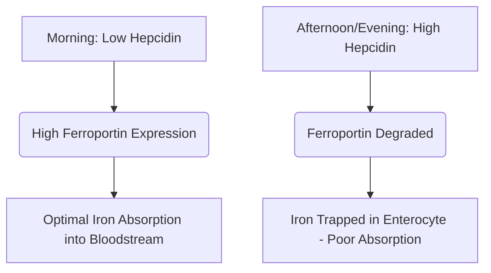

Iron is an indispensable micronutrient that functions as a structural and catalytic cofactor in oxygen transport, cellular respiration, and DNA synthesis. Despite its abundance, iron is frequently a growth-limiting nutrient in the human diet. Because humans possess no physiological mechanism for active iron excretion, systemic iron balance is maintained exclusively at the level of intestinal absorption.

Dietary iron occurs in two primary forms: **organic (heme)** and **inorganic (non-heme)** iron. 

Heme iron is highly bioavailable, typically absorbed at rates of 15% to 35%. It is transported intact across the apical brush border of duodenal enterocytes via Heme Carrier Protein 1 (HCP1) and remains protected from standard dietary inhibitors. 

Conversely, non-heme iron represents over 80% of dietary intake but exhibits a highly compromised absorption profile, with absorption rates ranging from a mere 2% to 20%.

> [!TIP]
> At physiological pH, non-heme iron exists predominantly in its oxidized, highly insoluble ferric (Fe³⁺) state. To be absorbed, it must undergo reduction to the soluble ferrous (Fe²⁺) state by the apical reductase duodenal cytochrome b (Dcytb), before entering the enterocyte via Divalent Metal Transporter 1 (DMT1).

## Heme vs. Non-Heme Iron Pathways

| Feature / Metric | Heme Iron Pathway | Non-Heme (Inorganic) Iron Pathway |
| :--- | :--- | :--- |
| **Dietary Sources** | Animal tissues (hemoglobin, myoglobin) | Plants, iron-fortified foods, mineral salts |
| **Apical Transporter** | Heme Carrier Protein 1 (HCP1) | Divalent Metal Transporter 1 (DMT1) |
| **Required Valence State** | Porphyrin-bound complex | Ferrous (Fe²⁺) |
| **Optimal Luminal pH** | Broadly stable; uninfluenced by gastric pH | Highly acidic (pH < 3.0) for solubilization |
| **Typical Absorption Efficacy**| 15% – 35% (highly bioavailable) | 2% – 20% (highly variable) |
| **Sensitivity to Dietary Inhibitors** | Negligible; shielded by the porphyrin ring | Extremely high (inhibited by phytates, polyphenols, calcium) |

## Optimal Timing (Chronopharmacology)

Optimizing non-heme iron absorption requires precise coordination with the diurnal kinetics of **hepcidin**, a 25-amino acid peptide hormone synthesized primarily by hepatocytes. Hepcidin functions as the master systemic regulator of iron homeostasis by binding directly to the basolateral exporter Ferroportin, inducing its degradation. Consequently, elevated circulating hepcidin levels trap iron inside duodenal enterocytes and prevent its entry into the bloodstream.

### Circadian Oscillations of Hepcidin
Under baseline physiological conditions, hepcidin concentrations are at their nadir in the early morning, rise steadily throughout the afternoon to a peak, and decline during the night.

This circadian curve directly impacts oral iron kinetics. **Morning administration** of iron supplements allows the mineral to arrive at the duodenum when enterocyte Ferroportin expression is at its highest. In contrast, afternoon or evening dosing forces the iron to compete with an elevated hepcidin blockade, resulting in a 37% reduction in fractional iron absorption.

### The Impact of Gastric Acidity
The biophysical state of inorganic iron is highly dependent on gastric acid production. Pharmacological suppression of gastric acid via Proton Pump Inhibitors (PPIs) severely disrupts this microenvironment, raising gastric pH and causing rapid oxidation of soluble Fe²⁺ to highly insoluble Fe³⁺.

> [!WARNING]
> Oral iron supplements must be taken on an empty stomach—ideally 1 hour before or 2 hours after a meal—and strictly separated from any acid-suppressing medications.

## The Critical Interactions (What NOT to Mix)

The therapeutic efficacy of oral iron is easily compromised by concurrent ingestion with various dietary compounds and pharmaceutical agents. 

### Calcium
Calcium, whether ingested as dietary dairy (milk, cheese, yogurt) or as mineral supplements, is a potent inhibitor of both heme and non-heme iron absorption. Co-ingestion of 500 mg of calcium carbonate with an iron-containing meal reduces fractional iron absorption by over 50%.

### Tannins and Polyphenols
Polyphenols found in **black tea, green tea, herbal teas, and coffee** are exceptionally effective iron chelators. These plant-derived compounds coordinate with ferric iron to form highly stable, large organometallic complexes that cannot cross the duodenal brush border. Adding just a single cup of coffee or tea to a meal can decrease non-heme iron absorption by 40% to 70%.

### Phytic Acid
Phytic acid is the primary phosphorus storage compound in whole grains, cereals, nuts, and legumes. The phytic acid-to-iron molar ratio is the single most important dietary factor limiting iron bioavailability in plant-based diets.

### Zinc and Magnesium
Ferrous iron, zinc, and magnesium share overlapping transport pathways across the enterocyte apical membrane (such as DMT1). At therapeutic iron doses, competitive inhibition occurs, significantly suppressing iron transport. Do not take your Iron supplement alongside Zinc or Magnesium.

### Thyroid Medications (Levothyroxine)
Co-administering oral iron supplements with levothyroxine (T4) leads to a severe drug-nutrient interaction. The iron coordinates with the levothyroxine molecule, forming an insoluble complex that reduces the oral bioavailability of levothyroxine by 20% to 64%.

> [!CAUTION]
> To prevent clinical failure of your thyroid therapy, there must be a strict, minimum separation window of 4 hours between levothyroxine and iron administration.

## The Ultimate Co-factor: Vitamin C

Ascorbic acid (Vitamin C) is the most potent enhancer of non-heme iron absorption, capable of overriding the inhibitory effects of dietary phytates, polyphenols, and calcium. 

This synergistic relationship operates through a highly efficient dual biochemical mechanism:
1. **Thermodynamically Favorable Reduction:** Ascorbic acid rapidly converts insoluble ferric ions (Fe³⁺) into the highly soluble ferrous form (Fe²⁺), ready for transport.
2. **Duodenal Chelation:** Ascorbic acid acts as a protective shield, preventing the iron from binding to phytates and polyphenols as it transitions into the alkaline environment of the duodenum.

## Side Effects & The Alternate-Day Dosing Paradigm

The traditional approach to treating iron deficiency—prescribing high-dose oral iron daily—frequently fails due to severe gastrointestinal side effects (nausea, constipation) and systemic feedback loops.

Because of low fractional absorption, up to 90% of a standard oral iron dose remains unabsorbed in the gut. This excess iron reacts with hydrogen peroxide to generate highly toxic hydroxyl radicals, triggering oxidative stress and mucosal inflammation.

Furthermore, high daily iron supplements trigger a systemic **"Mucosal Block"**. Ingestion of an oral iron dose ≥ 60 mg induces a rapid surge in serum hepcidin that remains elevated for 24 hours. If a second iron dose is administered the next day, the enterocytes are physically blocked from exporting it into the portal circulation. The iron is trapped and eventually excreted.

> [!TIP]
> **Alternate-Day Dosing:** To bypass this hepcidin-mediated block, modern hematology has shifted toward administering oral iron **every other day**. Clinical trials prove that taking iron every 48 hours increases fractional iron absorption by 40% to 50% compared to consecutive daily dosing, while drastically reducing GI side effects.

### Summary of Clinical Protocols

*   **Low Gastric pH is Essential:** Take iron on an empty stomach with water.
*   **Avoid Key Dietary Inhibitors:** Strictly avoid taking iron alongside calcium, dairy, coffee, or tea.
*   **Maintain Strict Drug Spacing:** Separate iron from levothyroxine by at least 4 hours.
*   **Leverage Vitamin C:** Co-administering iron with Vitamin C boosts absorption by up to 300%.
*   **Adopt Alternate-Day Dosing:** Space oral iron doses by 48 hours to avoid the hepcidin-induced mucosal block and maximize absorption.

## References

1. Stoffel NU, Zeder C, Brittenham GM, Moretti D, Zimmermann MB. [Iron absorption from oral iron supplements given on consecutive versus alternate days and as single morning doses versus twice-daily split dosing in iron-depleted women: two open-label, randomised controlled trials](https://pubmed.ncbi.nlm.nih.gov/29032957/). *Lancet Haematol.* 2017.
2. Campbell NR, Hasinoff BB. [Ferrous sulfate reduces thyroxine efficacy in patients with hypothyroidism](https://pubmed.ncbi.nlm.nih.gov/1443969/). *Ann Intern Med.* 1992.
3. Hallberg L, Hulthén L. [Effect of ascorbic acid intake on nonheme-iron absorption from a complete diet](https://pubmed.ncbi.nlm.nih.gov/11124756/). *Am J Clin Nutr.* 2000.
4. Lönnerdal B. [Calcium and iron absorption—mechanisms and public health relevance](https://pubmed.ncbi.nlm.nih.gov/21462112/). *Int J Vitam Nutr Res.* 2010.

*This article is for informational purposes only and does not constitute medical advice. Consult a qualified healthcare professional before changing your supplement or medication routine.*
