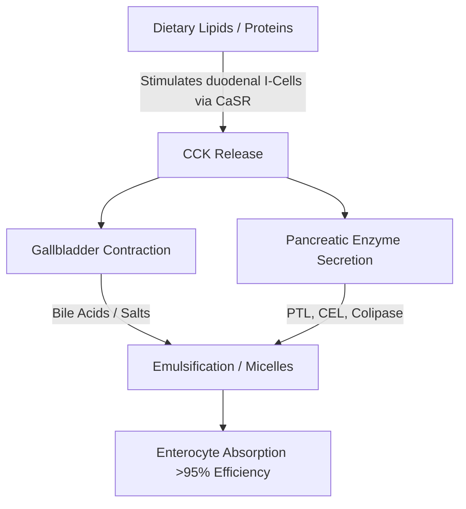
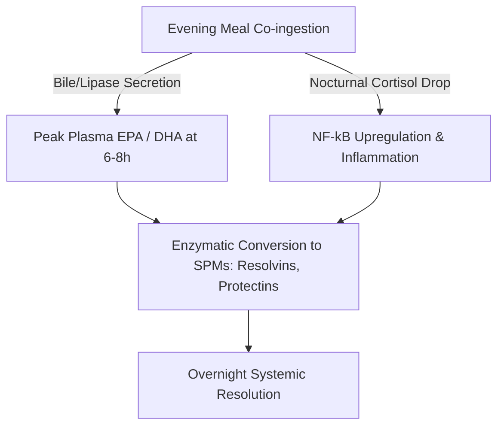

The therapeutic efficacy of long-chain marine omega-3 polyunsaturated fatty acids ($\text{PUFAs}$), specifically eicosapentaenoic acid ($\text{EPA}$) and docosahexaenoic acid ($\text{DHA}$), is strictly governed by their intestinal bioavailability. In clinical nutrition, a major source of therapeutic failure is the "lean-meal paradox"—the administration of highly hydrophobic marine lipids under fasting conditions or alongside fat-free meals. Despite the intake of high nominal doses, the lack of a structured lipid co-ingestion matrix prevents the physical and enzymatic mechanisms required for lipid absorption in the aqueous lumen of the human gastrointestinal tract. This clinical analysis details the biophysical, biochemical, and chronopharmacological principles that dictate the digestion and absorption of $\text{EPA}$ and $\text{DHA}$.

## Fasting and the Lean-Meal Paradox

The gastrointestinal tract is fundamentally an aqueous, water-based system. When hydrophobic lipids like standard fish oils are ingested, they encounter the highly polar environment of gastric and intestinal juices. According to the laws of thermodynamics, hydrophobic molecules minimize their contact with water, leading to rapid phase separation. This causes the ingested oil to coalesce into large, undivided lipid globules that float on top of the aqueous gastric chyme.

Popping an omega-3 capsule with a glass of water on an empty stomach or alongside a carbohydrate-only meal (such as a piece of fruit or a slice of dry bread) fails to trigger the physiological processes required to overcome this phase separation. Without physical emulsification, the surface-area-to-volume ratio of the lipid phase remains extremely low. The hydrophilic active sites of pancreatic lipases cannot access the ester bonds buried within these large, hydrophobic droplets. Consequently, drinking water alongside fish oil does not aid absorption; instead, it dilutes the trace digestive enzymes present in the fasted state, moving the un-emulsified lipid globules further from the enterocyte brush border membrane and leading to malabsorption and gastrointestinal distress.

For these highly hydrophobic lipids to cross the unstirred water layer of the intestinal mucosa, they must be converted into a thermodynamically stable, water-dispersible phase. This transformation is entirely dependent on the physical chemistry of micellarization, a process initiated by hormone-mediated duodenal signaling.

## Bile Salts and Micelle Formation

The transition from a floating, hydrophobic oil mass to absorbable micro-droplets requires a coordinated neuromuscular and secretory cascade in the duodenum. The primary hormonal driver of this process is cholecystokinin ($\text{CCK}$), a 33-amino-acid peptide synthesized and secreted by enteroendocrine I-cells in the mucosal lining of the duodenum and upper jejunum.



Under physiological conditions, the presence of long-chain fatty acids and partially digested proteins in the duodenal lumen stimulates the calcium-sensing receptor ($\text{CaSR}$) on I-cells, triggering the rapid exocytosis of $\text{CCK}$ into the bloodstream. Once released, $\text{CCK}$ binds to $\text{CCK}_A$ receptors on the gallbladder wall, causing it to contract, while simultaneously relaxing the sphincter of Oddi and stimulating pancreatic acinar cells to release their digestive enzymes.

The bile acids released from the gallbladder—primarily amphipathic sodium salts of cholic and chenodeoxycholic acids—are essential biological detergents. When bile acid concentrations in the duodenum exceed the critical micelle concentration ($\text{CMC}$), they arrange themselves around the hydrophobic lipid droplets. The hydrophobic steroid nucleus of the bile salt associates with the lipid phase, while the polar, hydrophilic conjugate group (glycine or taurine) faces the aqueous duodenal lumen.

Through the mechanical action of intestinal peristalsis, these bile-coated droplets are sheared into mixed micelles. These spherical colloidal aggregates have a diameter of only 3 to 10 nanometers, increasing the lipid surface area exposed to pancreatic lipases by several thousand-fold. Without co-ingesting healthy dietary fats (such as extra virgin olive oil, avocado, or pasture-raised egg yolks) to trigger the threshold of $\text{CCK}$ release, gallbladder contraction does not occur. In this state, bile acid levels remain below the $\text{CMC}$, pancreatic lipase secretion is minimal, and the ingested omega-3 lipids cannot form micelles, preventing absorption.

## Battle of Biochemical Forms: TG vs. EE vs. PL

Commercially available omega-3 supplements exist in three primary molecular forms: natural or re-esterified triglycerides ($\text{TG}$/$\text{rTG}$), ethyl esters ($\text{EE}$), and phospholipids ($\text{PL}$). The molecular structure of these carriers determines their digestion rate, lipase dependency, and bioavailability.

```text
Triglyceride (TG) Form:            Ethyl Ester (EE) Form:         Phospholipid (PL) Form:
     ┌─ Glycerol Backbone               ┌─ Ethanol Molecule            ┌─ Phosphate Head (Polar)
     ├─ Fatty Acid (EPA)                └─ Fatty Acid (EPA)            ├─ Fatty Acid (EPA)
     ├─ Fatty Acid (DHA)                                               └─ Fatty Acid (DHA)
     └─ Fatty Acid (Other)
```

In natural and re-esterified triglycerides ($\text{TG}$/$\text{rTG}$), three fatty acids ($\text{EPA}$/$\text{DHA}$) are bound to a three-carbon glycerol backbone. During digestion, pancreatic triglyceride lipase ($\text{PTL}$), acting alongside its cofactor colipase, hydrolyzes the ester bonds at the $sn\text{-}1$ and $sn\text{-}3$ positions. This produces two free fatty acids and one $sn\text{-}2$-monoglyceride, both of which are highly polar, easily micellarized, and readily absorbed by enterocytes with over 95% efficiency.

Conversely, the ethyl ester ($\text{EE}$) form is a synthetic product created during chemical concentration. The glycerol backbone is removed, and each individual fatty acid is esterified to an ethanol molecule ($\text{CH}_3\text{CH}_2\text{OH}$). This synthetic ester bond is highly resistant to human pancreatic enzymes. In vitro and in vivo studies show that human pancreatic lipase hydrolyzes the fatty acid-ethanol bond in $\text{EE}$ at a rate that is 10 to 50 times slower than the glyceryl ester bonds in triglycerides.

Because of this slow hydrolysis, $\text{EE}$ absorption is highly dependent on a massive release of pancreatic lipases and bile salts, which is only triggered by a high-fat meal. When taken on a low-fat diet, the limited pancreatic lipase available cannot efficiently cleave the $\text{EE}$ bonds, leading to poor bioavailability (often dropping to approximately 20%) and causing unabsorbed synthetic esters to pass into the colon, where they can cause gastrointestinal side effects.

The phospholipid ($\text{PL}$) form, primarily sourced from Antarctic krill oil (*Euphausia superba*), features an amphipathic structure where $\text{EPA}$ and $\text{DHA}$ are bound to a phosphatidylcholine backbone. The highly polar phosphate head group makes phospholipids naturally dispersible in water. Because of this, $\text{PL}$ forms can self-emulsify and form spontaneous micro-droplets in the gastrointestinal tract, bypassing the absolute requirement for bile-salt-stimulated micellarization. Phospholipids are also digested via phospholipase $\text{A}_2$ and can be absorbed directly by the enterocytes as lysophospholipids, resulting in high bioavailability even under fasting or low-fat conditions.

| Biochemical Form | Molecular Carrier / Backbone | Mean Absorption Rate (Low-Fat Meal) | Mean Absorption Rate (High-Fat Meal) | Relative Bioavailability (vs. EE Baseline) | Pancreatic Lipase Dependency |
| --- | --- | --- | --- | --- | --- |
| Ethyl Ester (EE) | Ethanol ($\text{CH}_3\text{CH}_2\text{OH}$) | $\approx 20\%$ | $\approx 60\%$ | Baseline ($100\%$) | Absolute; hydrolyzed 10–50x slower than TG |
| Triglyceride (TG / rTG) | Glycerol Backbone | $\approx 68\%$ | $\approx 90\%$ | $124\%$ to $186\%$ | High; rapidly cleaved to 2-FFA and 1-MAG |
| Phospholipid (PL) | Phosphatidylcholine | $\approx 80\%$ to $95\%$ | $>95\%$ | $168\%$ to $500\%$ | Minimal; self-emulsifying, bypasses certain lipases |

> [!WARNING]
> Individuals presenting with exocrine pancreatic insufficiency (EPI), biliary dyskinesia, or those post-cholecystectomy exhibit severely compromised endogenous lipid digestion. For these clinical populations, the administration of synthetic ethyl ester (EE) formulations under low-fat dietary constraints represents a high risk for complete malabsorption and gastrointestinal distress, as the necessary enzymatic cleavage is virtually nonexistent in these states.

## Lipid Oxidation and the Absolute Necessity of Vitamin E

The structural features that make $\text{EPA}$ and $\text{DHA}$ biologically active also make them highly unstable. $\text{EPA}$ contains five and $\text{DHA}$ contains six methylene-interrupted double bonds. The carbon-hydrogen bonds at the bis-allylic methylene carbons ($\text{-CH=CH-CH}_2\text{-CH=CH-}$) have low bond dissociation energies. This makes them exceptionally vulnerable to free radical attack and non-enzymatic lipid peroxidation.

```text
Phase 1: Initiation
  [PUFA Carbon-Hydrogen Bond] + [ROS / Free Radical] ──> [Carbon-Centered Lipid Radical (R•)]

Phase 2: Propagation
  [Carbon-Centered Lipid Radical (R•)] + [O2] ──> [Lipid Peroxyl Radical (ROO•)]
  [Lipid Peroxyl Radical (ROO•)] + [Unoxidized PUFA] ──> [Lipid Hydroperoxide (ROOH)] + [New Lipid Radical (R•)]

Phase 3: Decomposition
  [Unstable Lipid Hydroperoxide (ROOH)] ──> [Toxic Aldehydes (MDA / HHE)]
```

Once ingested, the fish oil is exposed to an environment of $37^\circ\text{C}$ (body temperature), gastric acids, and dissolved molecular oxygen ($\text{O}_2$). This environment accelerates the lipid peroxidation cascade through three distinct phases:

1. **Initiation:** A reactive oxygen species ($\text{ROS}$) abstracts a hydrogen atom from a bis-allylic carbon, generating a carbon-centered lipid radical ($\text{R}^\bullet$).
2. **Propagation:** The lipid radical reacts rapidly with molecular oxygen ($\text{O}_2$) to form a lipid peroxyl radical ($\text{ROO}^\bullet$). This peroxyl radical then abstracts a hydrogen atom from an adjacent unoxidized $\text{PUFA}$ molecule, generating a lipid hydroperoxide ($\text{ROOH}$) and a new lipid radical, perpetuating the chain reaction.
3. **Decomposition:** The unstable lipid hydroperoxides decompose into highly reactive, cytotoxic secondary oxidation products, including alkenals such as malondialdehyde ($\text{MDA}$) and 4-hydroxyhexenal ($\text{HHE}$).

These secondary oxidation products are easily absorbed through the gut, incorporated into chylomicrons and low-density lipoproteins ($\text{LDL}$), and can induce systemic oxidative stress, endothelial damage, and atherogenesis.

To halt this process, the co-formulation of a chain-breaking, lipid-soluble antioxidant is required. Natural vitamin E, specifically d-alpha-tocopherol ($\text{C}_{29}\text{H}_{50}\text{O}_2$), is highly optimized for this role. D-alpha-tocopherol acts as a hydrogen donor, rapidly transferring its phenolic hydrogen atom to the reactive lipid peroxyl radical ($\text{ROO}^\bullet$) with an extremely fast rate constant of approximately $10^6\,\text{M}^{-1}\text{s}^{-1}$.

The resulting tocopheroxyl radical is highly stable due to the resonance delocalization of its unpaired electron across the chromanol ring, preventing it from attacking adjacent fatty acid chains. This halts the chain reaction, protecting the structural integrity of the $\text{EPA}$ and $\text{DHA}$ molecules so they can reach target tissues in their active, unoxidized state.

## Chronopharmacology and the Nocturnal Anti-Inflammatory Window

In lipid biochemistry, timing is a critical factor. Ingesting omega-3 supplements alongside the largest, most lipid-dense meal of the day (typically dinner) optimizes both absorption and the body's natural nocturnal healing processes.



First, the evening meal is historically the most fat-containing meal of the day for many individuals. This provides the physical lipid volume required to trigger maximum $\text{CCK}$ release, leading to robust gallbladder contraction, rich bile secretion, and high pancreatic lipase activity. This optimizes micellarization and digestive kinetics, ensuring that almost the entire ingested dose is successfully absorbed.

Second, evening administration aligns with the body's circadian immune and inflammatory cycles. Endogenous cortisol levels naturally drop to their lowest diurnal levels in the late evening and early night. Cortisol is a potent anti-inflammatory hormone; when its levels drop, systemic inflammatory pathways—such as those governed by the pro-inflammatory transcription factor $\text{NF}\text{-}\kappa\text{B}$—experience a relative upregulation.

By ingesting omega-3s with dinner, peak plasma and cellular membrane concentrations of $\text{EPA}$ and $\text{DHA}$ are achieved 6 to 8 hours later, directly coinciding with this nighttime inflammatory window. During this phase, the body utilizes these fatty acids as substrates for the enzymatic synthesis of Specialized Pro-resolving Mediators ($\text{SPMs}$)—specifically resolvins, protectins, and maresins—via cyclooxygenase ($\text{COX}$) and lipoxygenase ($\text{LOX}$) pathways. These $\text{SPMs}$ actively resolve chronic micro-inflammation, promote cellular turnover, and support tissue healing during sleep.

Additionally, evening administration of omega-3s, particularly $\text{DHA}$, provides unique neurological benefits. $\text{DHA}$ is a key structural lipid in neuronal membranes and plays an important role in the brain's circadian clock. It acts on clock genes (such as BMAL1 and CLOCK) responsible for regulating the sleep-wake cycle.

The nocturnal integration of $\text{DHA}$ into synaptic membranes supports neuronal communication, enhances the synthesis of serotonin, and optimizes its conversion into melatonin. Clinical trials demonstrate that consistent evening omega-3 supplementation significantly improves sleep efficiency, shortens sleep onset latency, and reduces the sleep fragmentation index (nighttime awakenings).

> [!TIP]
> To maximize the cellular bio-incorporation of long-chain omega-3 fatty acids, clinicians should recommend that patients administer their daily dose alongside the most lipid-dense meal of the day. Co-ingestion with at least 10–15 grams of healthy monounsaturated or polyunsaturated fats (e.g., extra virgin olive oil or avocado) is sufficient to trigger the threshold of cholecystokinin release necessary for optimal micellarization.

## Clinical Syntheses and Actionable Recommendations

Maximizing the therapeutic potential of omega-3 supplementation requires moving away from the simple ingestion of high-nominal-dose capsules toward an approach based on lipid biochemistry and digestive kinetics. The traditional practice of taking fish oil with water on an empty stomach often leads to poor absorption and gastrointestinal side effects.

For optimal therapeutic results, clinicians should prioritize re-esterified triglyceride ($\text{rTG}$) or phospholipid ($\text{PL}$) formulations, which show superior absorption kinetics and are less dependent on high-fat meals than synthetic ethyl esters ($\text{EE}$).

Regardless of the formulation chosen, the supplement must be taken alongside a meal containing at least 10 to 15 grams of dietary fat. This lipid threshold is required to trigger the duodenal $\text{CCK}$ signaling cascade, initiating gallbladder contraction and pancreatic lipase secretion to allow for complete micellarization.

Furthermore, to protect these highly unstable $\text{PUFAs}$ from oxidative damage inside the body, the formulation should always include a natural, lipid-soluble antioxidant like d-alpha-tocopherol.

Finally, aligning supplementation with the evening meal ensures that peak absorption coincides with the body's natural nighttime anti-inflammatory and cellular repair pathways, maximizing the cardiovascular, immunological, and neurological benefits of $\text{EPA}$ and $\text{DHA}$.

## References

1. Nordøy A, et al. [Absorption of the n-3 eicosapentaenoic and docosahexaenoic acids as ethyl esters and triglycerides by humans](https://pubmed.ncbi.nlm.nih.gov/1826985/). *American Journal of Clinical Nutrition.* 1991.
2. Offman E, Marenco T, Ferber S, Johnson J, Kling D, Curcio D, Davidson M. [Steady-state bioavailability of prescription omega-3 on a low-fat diet is significantly improved with a free fatty acid formulation compared with an ethyl ester formulation: the ECLIPSE II study](https://pubmed.ncbi.nlm.nih.gov/24124374/). *Vascular Health and Risk Management.* 2013.
3. Schuchardt JP, Schneider I, Meyer H, Neubronner J, von Schacky C, Hahn A. [Incorporation of EPA and DHA into plasma phospholipids in response to different omega-3 fatty acid formulations - a comparative bioavailability study of fish oil vs. krill oil](https://pubmed.ncbi.nlm.nih.gov/21854650/). *Lipids in Health and Disease.* 2011.
4. Brown JE, Wahle KW. [Effect of fish-oil and vitamin E supplementation on lipid peroxidation and whole-blood aggregation in man](https://pubmed.ncbi.nlm.nih.gov/2282693/). *Clinica Chimica Acta.* 1990.

*This article is for informational purposes only and does not constitute medical advice. Consult a qualified healthcare professional before changing your supplement or medication routine.*
