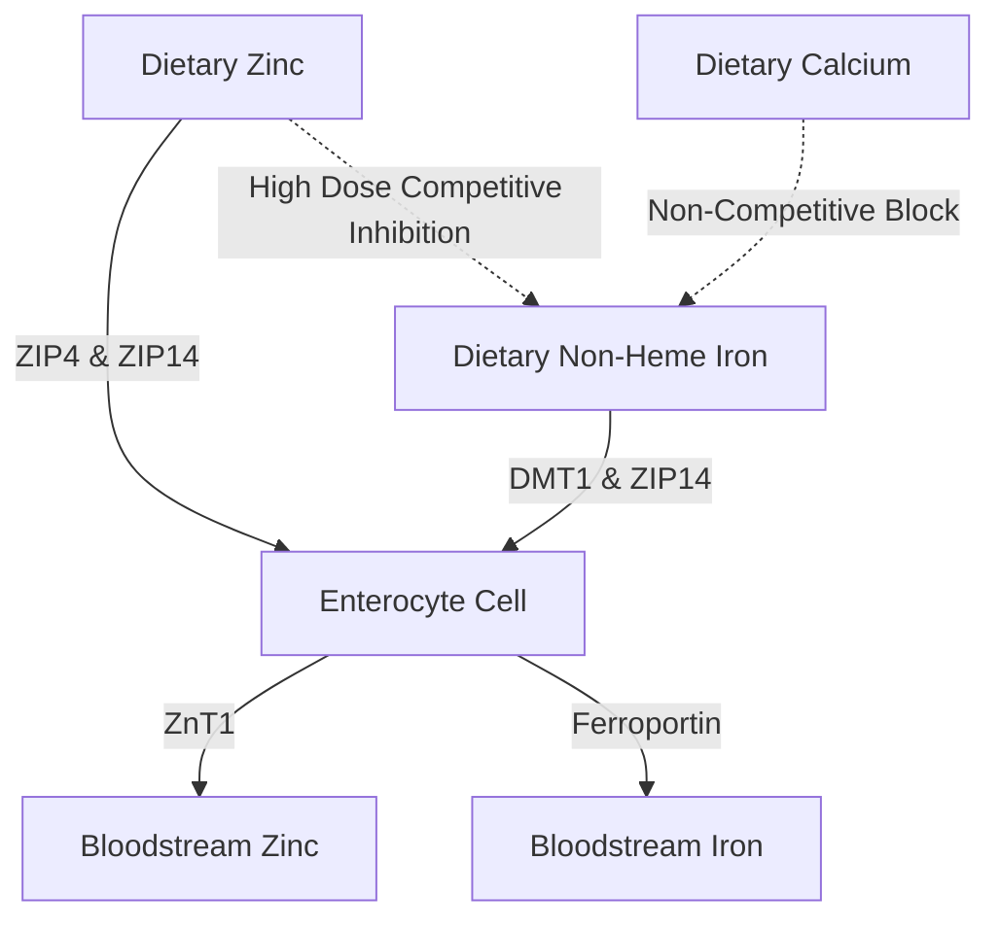

The administration of supplemental zinc ($\text{Zn}^{2+}$) presents a series of physiological and biochemical paradoxes. While zinc is a vital trace mineral involved in over 300 enzymatic reactions, its oral delivery is frequently hindered by acute gastrointestinal distress, competitive inhibition by other divalent cations, and systemic mineral depletion. Resolving these issues requires a detailed understanding of intestinal transporter kinetics, mucosal biochemistry, and chronopharmacology to design optimal dosing protocols for clinical and consumer applications.

## The Empty Stomach Paradox: Mucosal Irritation vs. Nutrient Bioaccessibility

Orally administered zinc presents a difficult choice: ingestion on an empty stomach maximizes cellular bioaccessibility but often causes acute gastrointestinal distress. Conversely, administering zinc with meals successfully mitigates discomfort but introduces dietary antagonists that severely reduce fractional absorption.

### Molecular Mechanisms of Gastric Irritation and Nausea
The ingestion of highly water-soluble, inorganic zinc salts—such as zinc sulfate ($\text{ZnSO}_4$) or zinc chloride ($\text{ZnCl}_2$)—leads to rapid dissolution within the gastric lumen. In aqueous solutions, these salts dissociate completely, yielding a highly concentrated and acidic localized environment with a pH of approximately 4.0 to 5.0. 

In a fasting state, the absence of a food bolus leaves the gastric mucosa unbuffered. The sudden exposure to free divalent zinc ions ($\text{Zn}^{2+}$) exerts a direct caustic and irritating effect on the gastric epithelial cells. This localized irritation stimulates the gastric parietal cells to hypersecrete hydrochloric acid (HCl), further driving down gastric pH and inducing mucosal erosion. 

The sensory detection of this chemical and acidic insult is mediated by the extensive network of vagal sensory neurons that innervate the stomach wall. Once activated, these vagal sensory neurons transmit action potentials up the vagus nerve to the dorsal vagal complex (DVC) in the caudal brainstem. This initiates a centrally mediated emetic reflex, manifesting as immediate nausea, delayed gastric emptying, and stomach spasms within 30 minutes of ingestion.

### The Bioavailability Block: Phytates, Grains, and Dairy

When zinc is taken with food to prevent vagal stimulation, its bioaccessibility is severely compromised by dietary inhibitors. The most potent of these inhibitors is phytic acid, which is highly concentrated in the outer hulls of unrefined cereal grains, legumes, nuts, and seeds.

At the physiological pH of the duodenum, phytic acid acts as an aggressive ligand that chelates free $\text{Zn}^{2+}$ ions, forming highly stable, insoluble, and structurally complex coordination precipitates that are completely resistant to intestinal absorption. Because humans lack endogenous phytase enzymes in their upper gastrointestinal tract, these zinc-phytate complexes remain unhydrolyzed and are excreted in the feces.

> [!CAUTION]
> Quantitative radiolabeled studies demonstrate that adding as little as 50 mg of phytate-phosphorus to a meal reduces fractional zinc absorption by approximately 36% (dropping from a baseline of 22% down to 14%). Higher phytate concentrations of 250 mg completely suppress fractional absorption to a negligible 6–7%.

Furthermore, dairy products exert an independent inhibitory effect. Casein, the primary protein fraction in cow's milk, binds divalent zinc ions in the intestinal lumen, significantly reducing bioaccessibility compared to whey-predominant configurations.

### Zinc Compound Form and Tolerability

| Chemical Class | Zinc Compound Form | Fractional Absorption | Gastric Tolerability | Mechanism of Action |
| :--- | :--- | :--- | :--- | :--- |
| **Inorganic Salt** | Zinc Sulfate ($\text{ZnSO}_4$) | ~20–49.9% | High Irritation (~15% adverse) | Rapidly dissociates into free $\text{Zn}^{2+}$; acidic pH (4.0–5.0). |
| **Organic Salt** | Zinc Gluconate | ~50.6–71.7% | Medium Tolerability (~5% adverse) | Neutral pH (5.5–7.0); slow dissociation minimizes mucosal exposure. |
| **Organic Chelate**| Zinc Bisglycinate | ~50–60% | Very High Tolerability (< 5% adverse) | Bound to glycine; resists gastric dissociation and phytate interference. |
| **Organic Chelate**| Zinc Picolinate | High (superior long-term) | High Tolerability | Complexed with picolinic acid; excellent systemic tissue accumulation. |

### Scientifically Optimal Bypassing Protocol

To completely bypass both the empty-stomach vagal nausea reflex and the phytate absorption blockade, a specific clinical protocol must be utilized:

1. **Transition to Organic Chelates:** Clinicians should replace inorganic zinc salts with organic, neutral-pH metal-amino acid chelates, such as Zinc Bisglycinate or Zinc Picolinate. In Zinc Bisglycinate, the $\text{Zn}^{2+}$ ion is covalently bound to two glycine ligands, shielding the mineral from premature dissociation in gastric acid.
2. **Utilize Alternative Absorption Pathways:** Unlike inorganic zinc, which relies strictly on saturable, pH-dependent transporters, organic chelates are absorbed intact through alternative, highly efficient pathways, such as peptide cotransporters.
3. **Low-Antagonist Buffering Meals:** If a patient exhibits extreme sensitivity and requires a food buffer, zinc should be taken exclusively with a light snack completely devoid of phytates and high-dose calcium. Permissible food buffers include white sourdough bread (where fermentation has pre-hydrolyzed phytate content) or simple animal proteins (such as eggs or whey isolate).

> [!TIP]
> **Pro Tip:** To maximize absorption while completely avoiding nausea, the ideal protocol is to take 15–30 mg of elemental Zinc Bisglycinate with a light, phytate-free snack in the early afternoon, ensuring a 2-hour fast before and after ingestion.

## The DMT1 and ZIP Transporter Wars: Competitive Inhibition

The small intestinal enterocyte acts as a highly competitive arena for the absorption of divalent metals. Zinc ($\text{Zn}^{2+}$), non-heme iron ($\text{Fe}^{2+}$), and calcium ($\text{Ca}^{2+}$) share overlapping, saturable pathways, meaning that the co-administration of high-dose supplements directly suppresses the uptake of each mineral.

### The Transporter Landscape: ZIP4, ZIP14, and DMT1
At the apical (brush border) membrane of the duodenal enterocytes, the primary importer for dietary zinc is ZIP4. Non-heme iron entering the enterocyte relies on a different apical pathway: Divalent Metal Transporter-1 (DMT1). However, another transporter, ZIP14, is highly pleiotropic; while classed as a zinc transporter, it is also highly capable of transporting non-transferrin-bound $\text{Fe}^{2+}$.

Because $\text{Zn}^{2+}$ and $\text{Fe}^{2+}$ are highly similar in charge and ionic radius, they compete intensely for shared intracellular transport pathways (like ZIP14). When therapeutic doses of ferrous iron (100–400 mg) are co-administered with zinc, iron outcompetes zinc for uptake.

Clinical research demonstrates that taking high-dose iron concurrently with a standard 25 mg dose of zinc reduces fractional zinc absorption by approximately 40–50%. At a standard clinical iron dose of 10 mg, significant reciprocal inhibition occurs at a strict 1:1 ratio.

## The Copper Depletion Danger: Enterocyte Trapping

A major hazard of long-term, high-dose zinc supplementation is the insidious development of systemic copper deficiency. This pathway is mediated by the upregulation of **metallothionein**—an intracellular metal-binding protein within the enterocytes.

When an individual consumes a high dose of zinc (exceeding 40–50 mg/day) over an extended period, the large influx of cellular $\text{Zn}^{2+}$ acts as a potent transcription factor signal, triggering a massive upregulation of metallothionein synthesis.

Although metallothionein synthesis is heavily driven by zinc levels, the protein possesses a thermodynamic affinity for copper ($\text{Cu}^+$) that is substantially higher than its affinity for zinc. Consequently, when dietary copper is absorbed into the enterocyte, the abundant intracellular metallothionein molecules rapidly bind to and sequester the copper ions.

> [!WARNING]
> Supplementing with daily zinc doses exceeding 40 mg without a corresponding 15:1 copper balance for more than four consecutive weeks risks triggering severe copper-trapping enterocyte pathways.

### The Clinically Safe Zinc-to-Copper Dosing Ratio
To completely prevent metallothionein-induced copper trapping during long-term supplementation, any supplemental zinc must be paired with copper at a highly specific therapeutic ratio. The clinically established safe and synergistic **zinc-to-copper ratio is 8:1 to 15:1**.

## Chronopharmacology of Zinc: Circadian Regulation and Sleep

The timing of nutrient administration is a primary determinant of its metabolic efficacy. Zinc exhibits a highly complex relationship with the body's internal biological clock, acting both as a circadian regulator and a direct participant in the molecular pathways of sleep.

### Zinc, Melatonin Synthesis, and GABA
Zinc is a fundamental biochemical cofactor required for the synthesis of melatonin. It stabilizes the transcript abundance and protein folding of TPH and AANAT, the rate-limiting enzymes in melatonin production. Zinc deficiency directly downregulates the transcription of AANAT, causing a severe drop in the amplitude of the nocturnal melatonin peak.

Beyond melatonin synthesis, zinc acts as a direct neuromodulator within the central nervous system. During neuronal excitation, zinc acts as a potent, non-competitive antagonist of the NMDA glutamate receptor. Simultaneously, zinc acts as a positive allosteric modulator of GABAergic receptors, enhancing the inhibitory, relaxing effects of GABA. This dual action facilitates a smooth transition into deep, restorative slow-wave sleep.

### SuppTime Optimized Chronotherapeutic Dosing Protocol

To capitalize on these biological rhythms, the optimal timing for zinc supplementation is during lunch (midday) or with a light, early evening dinner.

| Time Slot | Supplement Stack Components | Chronobiological Rationale |
| :--- | :--- | :--- |
| **Morning** | Probiotics | Low stomach acid volume at waking maximizes bacterial survival through gastric passage. |
| **Breakfast** | Non-Heme Iron, Vitamin C, Vitamin D3 | Vitamin C enhances iron absorption; fat-soluble vitamins absorb with dietary fat. Avoid Calcium and Zinc. |
| **Lunch** | Zinc Bisglycinate (15–30 mg) + Copper (1–2 mg) | Formulated at a 15:1 ratio to prevent copper trapping; separated from iron/calcium. |
| **Night** | Calcium, Magnesium Glycinate | Magnesium relaxes muscular skeletal systems and modulates calming GABA receptors before sleep. |

## References

1. Institute of Medicine (US) Panel on Micronutrients. [Zinc](https://www.ncbi.nlm.nih.gov/books/NBK222317/). *Dietary Reference Intakes for Vitamin A, Vitamin K, Arsenic, Boron, Chromium, Copper, Iodine, Iron, Manganese, Molybdenum, Nickel, Silicon, Vanadium, and Zinc.* National Academies Press, 2001.
2. National Institutes of Health, Office of Dietary Supplements. [Zinc - Health Professional Fact Sheet](https://ods.od.nih.gov/factsheets/Zinc-HealthProfessional/). *NIH Office of Dietary Supplements.* 2022.
3. Pérès JM, Bureau F, Neuville D, Arhan P, Bouglé D. [Inhibition of zinc absorption by iron depends on their ratio](https://pubmed.ncbi.nlm.nih.gov/11846013/). *Journal of Trace Elements in Medicine and Biology.* 2001.
4. Devarshi PP, Mao Q, Grant RW, Mitmesser SH. [Comparative Absorption and Bioavailability of Various Chemical Forms of Zinc in Humans: A Narrative Review](https://www.ncbi.nlm.nih.gov/pmc/articles/PMC11677333/). *Nutrients.* 2024.
5. Gupta N, Carmichael MF. [Zinc-Induced Copper Deficiency as a Rare Cause of Neurological Deficit and Anemia](https://www.ncbi.nlm.nih.gov/pmc/articles/PMC10510946/). *Cureus.* 2023.

*This article is for informational purposes only and does not constitute medical advice. Consult a qualified healthcare professional before changing your supplement or medication routine.*
