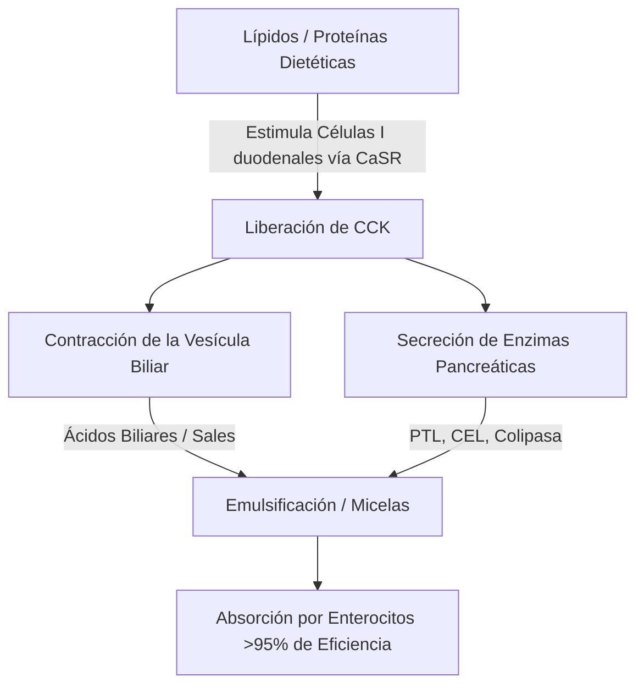
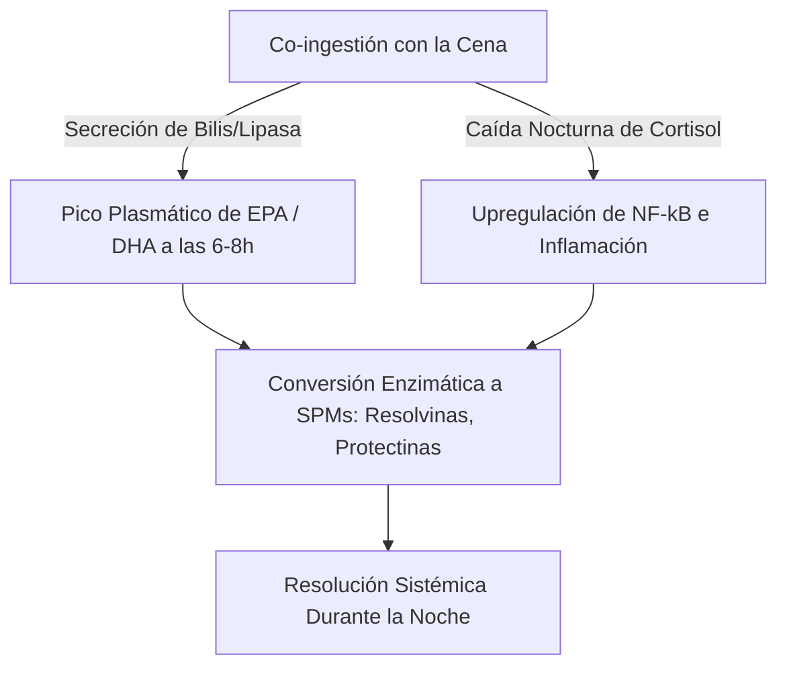

La eficacia terapéutica de los ácidos grasos poliinsaturados ($\text{PUFAs}$) omega-3 marinos de cadena larga, específicamente el ácido eicosapentaenoico ($\text{EPA}$) y el ácido docosahexaenoico ($\text{DHA}$), está estrictamente regida por su biodisponibilidad intestinal. En la nutrición clínica, una fuente principal de fracaso terapéutico es la "paradoja de la comida magra" (lean-meal paradox): la administración de lípidos marinos altamente hidrofóbicos en condiciones de ayuno o junto con comidas sin grasa. A pesar de la ingesta de altas dosis nominales, la falta de una matriz estructurada de co-ingestión de lípidos impide los mecanismos físicos y enzimáticos necesarios para la absorción de lípidos en el lumen acuoso del tracto gastrointestinal humano. Este análisis clínico detalla los principios biofísicos, bioquímicos y cronofarmacológicos que dictan la digestión y absorción de $\text{EPA}$ y $\text{DHA}$.

## El Ayuno y la Paradoja de la Comida Magra

El tracto gastrointestinal es fundamentalmente un sistema acuoso. Cuando se ingieren lípidos hidrofóbicos como los aceites de pescado estándar, se encuentran con el ambiente altamente polar de los jugos gástricos e intestinales. Según las leyes de la termodinámica, las moléculas hidrofóbicas minimizan su contacto con el agua, lo que lleva a una rápida separación de fases. Esto hace que el aceite ingerido se fusione en grandes glóbulos lipídicos no divididos que flotan en la parte superior del quimo gástrico acuoso.

Tomar una cápsula de omega-3 con un vaso de agua con el estómago vacío o junto con una comida solo de carbohidratos (como un trozo de fruta o una rebanada de pan seco) no logra desencadenar los procesos fisiológicos requeridos para superar esta separación de fases. Sin emulsificación física, la relación entre el área superficial y el volumen de la fase lipídica sigue siendo extremadamente baja. Los sitios activos hidrofílicos de las lipasas pancreáticas no pueden acceder a los enlaces éster enterrados dentro de estas grandes gotas hidrofóbicas. En consecuencia, beber agua junto con aceite de pescado no ayuda a la absorción; en cambio, diluye las trazas de enzimas digestivas presentes en el estado de ayuno, alejando los glóbulos lipídicos no emulsionados de la membrana del borde en cepillo del enterocito y provocando malabsorción y malestar gastrointestinal.

Para que estos lípidos altamente hidrofóbicos crucen la capa de agua no agitada de la mucosa intestinal, deben convertirse en una fase dispersable en agua termodinámicamente estable. Esta transformación depende por completo de la química física de la micelización, un proceso iniciado por la señalización duodenal mediada por hormonas.

## Sales Biliares y Formación de Micelas

La transición de una masa de aceite hidrofóbica flotante a microgotas absorbibles requiere una cascada secretora y neuromuscular coordinada en el duodeno. El principal impulsor hormonal de este proceso es la colecistoquinina ($\text{CCK}$), un péptido de 33 aminoácidos sintetizado y secretado por las células I enteroendocrinas en el revestimiento mucoso del duodeno y el yeyuno superior.



Bajo condiciones fisiológicas, la presencia de ácidos grasos de cadena larga y proteínas parcialmente digeridas en el lumen duodenal estimula el receptor sensible al calcio ($\text{CaSR}$) en las células I, desencadenando la exocitosis rápida de $\text{CCK}$ en el torrente sanguíneo. Una vez liberada, la $\text{CCK}$ se une a los receptores $\text{CCK}_A$ en la pared de la vesícula biliar, causando su contracción, al mismo tiempo que relaja el esfínter de Oddi y estimula las células acinares pancreáticas para que liberen sus enzimas digestivas.

Los ácidos biliares liberados por la vesícula biliar (principalmente sales de sodio anfipáticas de los ácidos cólico y quenodeoxicólico) son detergentes biológicos esenciales. Cuando las concentraciones de ácidos biliares en el duodeno superan la concentración micelar crítica ($\text{CMC}$), se organizan alrededor de las gotas de lípidos hidrofóbicos. El núcleo esteroide hidrofóbico de la sal biliar se asocia con la fase lipídica, mientras que el grupo conjugado polar e hidrofílico (glicina o taurina) se orienta hacia el lumen duodenal acuoso.

A través de la acción mecánica del peristaltismo intestinal, estas gotas recubiertas de bilis se fragmentan en micelas mixtas. Estos agregados coloidales esféricos tienen un diámetro de solo 3 a 10 nanómetros, aumentando el área de la superficie lipídica expuesta a las lipasas pancreáticas varios miles de veces. Sin la co-ingestión de grasas dietéticas saludables (como aceite de oliva virgen extra, aguacate o yemas de huevo de pastoreo) para desencadenar el umbral de liberación de $\text{CCK}$, la contracción de la vesícula biliar no ocurre. En este estado, los niveles de ácidos biliares permanecen por debajo de la $\text{CMC}$, la secreción de lipasa pancreática es mínima y los lípidos omega-3 ingeridos no pueden formar micelas, impidiendo la absorción.

## Batalla de Formas Bioquímicas: TG vs. EE vs. PL

Los suplementos comerciales de omega-3 existen en tres formas moleculares principales: triglicéridos naturales o reesterificados ($\text{TG}$/$\text{rTG}$), ésteres etílicos ($\text{EE}$) y fosfolípidos ($\text{PL}$). La estructura molecular de estos portadores determina su tasa de digestión, dependencia de lipasa y biodisponibilidad.

```text
Forma de Triglicérido (TG):        Forma de Éster Etílico (EE):   Forma de Fosfolípido (PL):
     ┌─ Esqueleto de Glicerol           ┌─ Molécula de Etanol          ┌─ Cabeza de Fosfato (Polar)
     ├─ Ácido Graso (EPA)               └─ Ácido Graso (EPA)           ├─ Ácido Graso (EPA)
     ├─ Ácido Graso (DHA)                                              └─ Ácido Graso (DHA)
     └─ Ácido Graso (Otro)
```

En los triglicéridos naturales y reesterificados ($\text{TG}$/$\text{rTG}$), tres ácidos grasos ($\text{EPA}$/$\text{DHA}$) están unidos a un esqueleto de glicerol de tres carbonos. Durante la digestión, la lipasa de triglicéridos pancreática ($\text{PTL}$), actuando junto con su cofactor colipasa, hidroliza los enlaces éster en las posiciones $sn\text{-}1$ y $sn\text{-}3$. Esto produce dos ácidos grasos libres y un $sn\text{-}2$-monoglicérido, los cuales son altamente polares, fácilmente micelizables y absorbidos por los enterocitos con más del 95% de eficiencia.

Por el contrario, la forma de éster etílico ($\text{EE}$) es un producto sintético creado durante la concentración química. Se elimina el esqueleto de glicerol, y cada ácido graso individual se esterifica a una molécula de etanol ($\text{CH}_3\text{CH}_2\text{OH}$). Este enlace éster sintético es altamente resistente a las enzimas pancreáticas humanas. Los estudios in vitro e in vivo muestran que la lipasa pancreática humana hidroliza el enlace ácido graso-etanol en los $\text{EE}$ a una tasa que es de 10 a 50 veces más lenta que los enlaces de éster de glicerilo en los triglicéridos.

Debido a esta lenta hidrólisis, la absorción de $\text{EE}$ es altamente dependiente de una liberación masiva de lipasas pancreáticas y sales biliares, lo cual solo es provocado por una comida alta en grasas. Cuando se toma con una dieta baja en grasas, la lipasa pancreática limitada disponible no puede escindir eficientemente los enlaces $\text{EE}$, lo que lleva a una pobre biodisponibilidad (a menudo cayendo a aproximadamente el 20%) y haciendo que los ésteres sintéticos no absorbidos pasen al colon, donde pueden causar efectos secundarios gastrointestinales.

La forma de fosfolípido ($\text{PL}$), principalmente obtenida del aceite de krill antártico (Euphausia superba), presenta una estructura anfipática donde $\text{EPA}$ y $\text{DHA}$ están unidos a un esqueleto de fosfatidilcolina. El grupo de cabeza de fosfato altamente polar hace que los fosfolípidos sean naturalmente dispersables en agua. Debido a esto, las formas de $\text{PL}$ pueden auto-emulsionarse y formar microgotas espontáneas en el tracto gastrointestinal, eludiendo el requisito absoluto de micelización estimulada por sales biliares. Los fosfolípidos también se digieren mediante la fosfolipasa $\text{A}_2$ y pueden ser absorbidos directamente por los enterocitos como lisofosfolípidos, resultando en una alta biodisponibilidad incluso en condiciones de ayuno o bajas en grasas.

| Forma Bioquímica | Portador Molecular / Esqueleto | Tasa de Absorción Media (Comida Baja en Grasas) | Tasa de Absorción Media (Comida Alta en Grasas) | Biodisponibilidad Relativa (vs. Base EE) | Dependencia de Lipasa Pancreática |
| --- | --- | --- | --- | --- | --- |
| Éster Etílico (EE) | Etanol ($\text{CH}_3\text{CH}_2\text{OH}$) | $\approx 20\%$ | $\approx 60\%$ | Base ($100\%$) | Absoluta; hidrolizado 10-50x más lento que los TG |
| Triglicérido (TG / rTG) | Esqueleto de Glicerol | $\approx 68\%$ | $\approx 90\%$ | $124\%$ a $186\%$ | Alta; escindido rápidamente en 2-FFA y 1-MAG |
| Fosfolípido (PL) | Fosfatidilcolina | $\approx 80\%$ a $95\%$ | $>95\%$ | $168\%$ a $500\%$ | Mínima; se auto-emulsiona, elude ciertas lipasas |

> [!WARNING]
> Los individuos que presentan insuficiencia pancreática exocrina (IPE), discinesia biliar o aquellos post-colecistectomía exhiben una digestión de lípidos endógena severamente comprometida. Para estas poblaciones clínicas, la administración de formulaciones de ésteres etílicos sintéticos (EE) bajo restricciones dietéticas bajas en grasas representa un alto riesgo de malabsorción completa y malestar gastrointestinal, ya que la escisión enzimática necesaria es virtualmente inexistente en estos estados.

## Oxidación de Lípidos y la Necesidad Absoluta de Vitamina E

Las características estructurales que hacen que el $\text{EPA}$ y el $\text{DHA}$ sean biológicamente activos también los hacen altamente inestables. El $\text{EPA}$ contiene cinco y el $\text{DHA}$ contiene seis dobles enlaces interrumpidos por metileno. Los enlaces carbono-hidrógeno en los carbonos metilénicos bis-alílicos ($\text{-CH=CH-CH}_2\text{-CH=CH-}$) tienen bajas energías de disociación de enlace. Esto los hace excepcionalmente vulnerables al ataque de radicales libres y a la peroxidación lipídica no enzimática.

```text
Fase 1: Iniciación
  [Enlace Carbono-Hidrógeno del PUFA] + [ROS / Radical Libre] ──> [Radical Lipídico Centrado en el Carbono (R•)]

Fase 2: Propagación
  [Radical Lipídico Centrado en el Carbono (R•)] + [O2] ──> [Radical Peroxilo Lipídico (ROO•)]
  [Radical Peroxilo Lipídico (ROO•)] + [PUFA No Oxidado] ──> [Hidroperóxido Lipídico (ROOH)] + [Nuevo Radical Lipídico (R•)]

Fase 3: Descomposición
  [Hidroperóxido Lipídico Inestable (ROOH)] ──> [Aldehídos Tóxicos (MDA / HHE)]
```

Una vez ingerido, el aceite de pescado se expone a un ambiente de $37^\circ\text{C}$ (temperatura corporal), ácidos gástricos y oxígeno molecular disuelto ($\text{O}_2$). Este ambiente acelera la cascada de peroxidación lipídica a través de tres fases distintas:

1. **Iniciación:** Una especie reactiva de oxígeno ($\text{ROS}$) abstrae un átomo de hidrógeno de un carbono bis-alílico, generando un radical lipídico centrado en el carbono ($\text{R}^\bullet$).
2. **Propagación:** El radical lipídico reacciona rápidamente con oxígeno molecular ($\text{O}_2$) para formar un radical peroxilo lipídico ($\text{ROO}^\bullet$). Este radical peroxilo luego abstrae un átomo de hidrógeno de una molécula de $\text{PUFA}$ no oxidada adyacente, generando un hidroperóxido lipídico ($\text{ROOH}$) y un nuevo radical lipídico, perpetuando la reacción en cadena.
3. **Descomposición:** Los hidroperóxidos lipídicos inestables se descomponen en productos de oxidación secundaria altamente reactivos y citotóxicos, incluyendo alquenales como el malondialdehído ($\text{MDA}$) y 4-hidroxihexenal ($\text{HHE}$).

Estos productos de oxidación secundaria se absorben fácilmente a través del intestino, se incorporan a los quilomicrones y a las lipoproteínas de baja densidad ($\text{LDL}$), y pueden inducir estrés oxidativo sistémico, daño endotelial y aterogénesis.

Para detener este proceso, se requiere la co-formulación de un antioxidante liposoluble que rompa la cadena. La vitamina E natural, específicamente el d-alfa-tocoferol ($\text{C}_{29}\text{H}_{50}\text{O}_2$), está altamente optimizada para este papel. El d-alfa-tocoferol actúa como un donante de hidrógeno, transfiriendo rápidamente su átomo de hidrógeno fenólico al reactivo radical peroxilo lipídico ($\text{ROO}^\bullet$) con una constante de velocidad extremadamente rápida de aproximadamente $10^6\,\text{M}^{-1}\text{s}^{-1}$.

El radical tocoferoxilo resultante es altamente estable debido a la deslocalización por resonancia de su electrón desapareado a través del anillo cromanol, lo que evita que ataque a las cadenas de ácidos grasos adyacentes. Esto detiene la reacción en cadena, protegiendo la integridad estructural de las moléculas de $\text{EPA}$ y $\text{DHA}$ para que puedan alcanzar los tejidos diana en su estado activo y no oxidado.

## Cronofarmacología y la Ventana Antiinflamatoria Nocturna

En bioquímica de lípidos, el momento (timing) es un factor crítico. Ingerir suplementos de omega-3 junto con la comida más grande y más densa en lípidos del día (típicamente la cena) optimiza tanto la absorción como los procesos naturales de curación nocturna del cuerpo.



Primero, la cena es históricamente la comida que más grasa contiene del día para muchas personas. Esto proporciona el volumen físico de lípidos requerido para desencadenar la máxima liberación de $\text{CCK}$, conduciendo a una robusta contracción de la vesícula biliar, una rica secreción de bilis y una alta actividad de la lipasa pancreática. Esto optimiza la micelización y la cinética digestiva, asegurando que casi toda la dosis ingerida se absorba con éxito.

Segundo, la administración nocturna se alinea con los ciclos inmunológicos e inflamatorios circadianos del cuerpo. Los niveles endógenos de cortisol descienden naturalmente a sus niveles diurnos más bajos en las últimas horas de la tarde y primeras horas de la noche. El cortisol es una potente hormona antiinflamatoria; cuando sus niveles caen, las vías inflamatorias sistémicas (como las reguladas por el factor de transcripción proinflamatorio $\text{NF}\text{-}\kappa\text{B}$) experimentan una relativa "upregulación" (regulación al alza).

Al ingerir omega-3 con la cena, se logran concentraciones máximas en plasma y en membranas celulares de $\text{EPA}$ y $\text{DHA}$ de 6 a 8 horas después, coincidiendo directamente con esta ventana inflamatoria nocturna. Durante esta fase, el cuerpo utiliza estos ácidos grasos como sustratos para la síntesis enzimática de Mediadores Pro-resolutivos Especializados ($\text{SPMs}$)—específicamente resolvinas, protectinas y maresinas—a través de las vías de ciclooxigenasa ($\text{COX}$) y lipoxigenasa ($\text{LOX}$). Estos $\text{SPMs}$ resuelven activamente la microinflamación crónica, promueven la renovación celular y apoyan la curación de tejidos durante el sueño.

Además, la administración nocturna de omega-3, particularmente $\text{DHA}$, proporciona beneficios neurológicos únicos. El $\text{DHA}$ es un lípido estructural clave en las membranas neuronales y juega un papel importante en el reloj circadiano del cerebro. Actúa sobre los genes reloj (como BMAL1 y CLOCK) responsables de regular el ciclo sueño-vigilia.

La integración nocturna del $\text{DHA}$ en las membranas sinápticas apoya la comunicación neuronal, mejora la síntesis de serotonina y optimiza su conversión a melatonina. Los ensayos clínicos demuestran que la suplementación nocturna constante de omega-3 mejora significativamente la eficiencia del sueño, acorta la latencia del inicio del sueño y reduce el índice de fragmentación del sueño (despertares nocturnos).

> [!TIP]
> Para maximizar la bioincorporación celular de los ácidos grasos omega-3 de cadena larga, los médicos deben recomendar que los pacientes se administren su dosis diaria junto con la comida más densa en lípidos del día. La co-ingestión con al menos 10-15 gramos de grasas monoinsaturadas o poliinsaturadas saludables (p. ej., aceite de oliva virgen extra o aguacate) es suficiente para desencadenar el umbral de liberación de colecistoquinina necesario para una micelización óptima.

## Síntesis Clínicas y Recomendaciones Accionables

Maximizar el potencial terapéutico de la suplementación con omega-3 requiere alejarse de la simple ingestión de cápsulas de alta dosis nominal hacia un enfoque basado en la bioquímica de lípidos y la cinética digestiva. La práctica tradicional de tomar aceite de pescado con agua con el estómago vacío a menudo conduce a una mala absorción y efectos secundarios gastrointestinales.

Para obtener resultados terapéuticos óptimos, los médicos deben priorizar las formulaciones de triglicéridos reesterificados ($\text{rTG}$) o fosfolípidos ($\text{PL}$), que muestran una cinética de absorción superior y dependen menos de las comidas ricas en grasas que los ésteres etílicos sintéticos ($\text{EE}$).

Independientemente de la formulación elegida, el suplemento debe tomarse junto con una comida que contenga al menos de 10 a 15 gramos de grasa dietética. Este umbral lipídico es necesario para desencadenar la cascada de señalización de la $\text{CCK}$ duodenal, iniciando la contracción de la vesícula biliar y la secreción de lipasa pancreática para permitir una micelización completa.

Además, para proteger estos $\text{PUFAs}$ altamente inestables del daño oxidativo dentro del cuerpo, la formulación siempre debe incluir un antioxidante natural y soluble en lípidos como el d-alfa-tocoferol (Vitamina E).

Finalmente, alinear la suplementación con la cena asegura que la absorción máxima coincida con las vías naturales de reparación celular y antiinflamatorias nocturnas del cuerpo, maximizando los beneficios cardiovasculares, inmunológicos y neurológicos del $\text{EPA}$ y el $\text{DHA}$.

## Referencias

1. Nordøy A, et al. [Absorption of the n-3 eicosapentaenoic and docosahexaenoic acids as ethyl esters and triglycerides by humans](https://pubmed.ncbi.nlm.nih.gov/1826985/). *American Journal of Clinical Nutrition.* 1991.
2. Offman E, Marenco T, Ferber S, Johnson J, Kling D, Curcio D, Davidson M. [Steady-state bioavailability of prescription omega-3 on a low-fat diet is significantly improved with a free fatty acid formulation compared with an ethyl ester formulation: the ECLIPSE II study](https://pubmed.ncbi.nlm.nih.gov/24124374/). *Vascular Health and Risk Management.* 2013.
3. Schuchardt JP, Schneider I, Meyer H, Neubronner J, von Schacky C, Hahn A. [Incorporation of EPA and DHA into plasma phospholipids in response to different omega-3 fatty acid formulations - a comparative bioavailability study of fish oil vs. krill oil](https://pubmed.ncbi.nlm.nih.gov/21854650/). *Lipids in Health and Disease.* 2011.
4. Brown JE, Wahle KW. [Effect of fish-oil and vitamin E supplementation on lipid peroxidation and whole-blood aggregation in man](https://pubmed.ncbi.nlm.nih.gov/2282693/). *Clinica Chimica Acta.* 1990.

*Este artículo tiene fines informativos únicamente y no constituye asesoramiento médico. Consulte a un profesional de la salud calificado antes de modificar su rutina de suplementos o medicamentos.*
