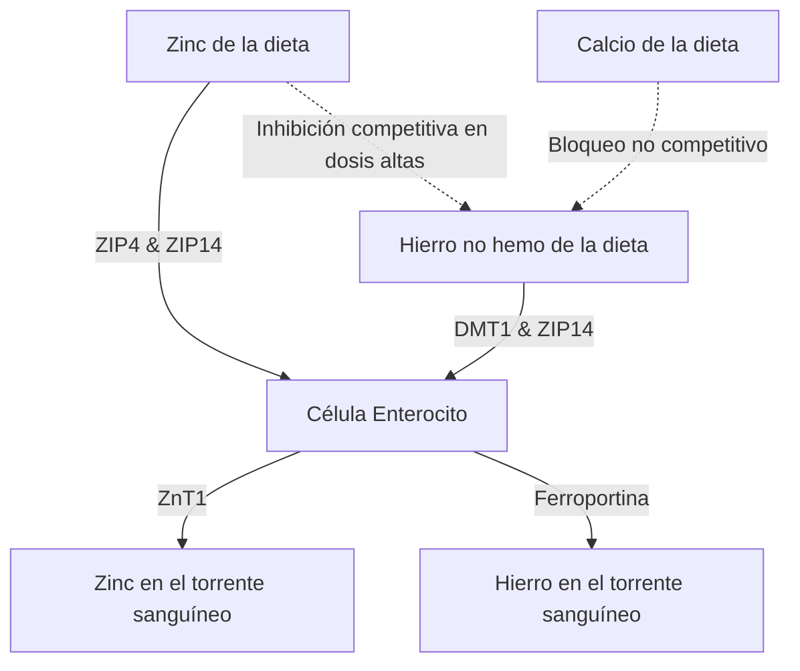

La administración de suplementos de zinc ($\text{Zn}^{2+}$) presenta una serie de paradojas fisiológicas y bioquímicas. Si bien el zinc es un oligoelemento vital que interviene en más de 300 reacciones enzimáticas, su administración oral se ve frecuentemente obstaculizada por molestias gastrointestinales agudas, la inhibición competitiva por parte de otros cationes divalentes y el agotamiento sistémico de minerales. Resolver estos problemas requiere una comprensión detallada de la cinética de los transportadores intestinales, la bioquímica de las mucosas y la cronofarmacología para diseñar protocolos de dosificación óptimos.

## La Paradoja del Estómago Vacío: Irritación de la Mucosa vs. Biodisponibilidad

El zinc administrado por vía oral presenta una difícil elección: la ingestión con el estómago vacío maximiza la biodisponibilidad celular, pero suele causar molestias gastrointestinales agudas (náuseas). Por el contrario, la administración de zinc con las comidas mitiga con éxito el malestar, pero introduce antagonistas (inhibidores) dietéticos que reducen drásticamente la absorción fraccional.

### Mecanismos Moleculares de la Irritación Gástrica y las Náuseas
La ingestión de sales inorgánicas de zinc altamente solubles en agua, como el sulfato de zinc ($\text{ZnSO}_4$) o el cloruro de zinc ($\text{ZnCl}_2$), provoca una rápida disolución en el lumen gástrico. En soluciones acuosas, estas sales se disocian por completo, generando un entorno localizado altamente concentrado y ácido con un pH de aproximadamente 4.0 a 5.0.

En estado de ayuno, la ausencia de un bolo alimenticio deja la mucosa gástrica sin amortiguación. La exposición repentina a los iones de zinc divalentes libres ($\text{Zn}^{2+}$) ejerce un efecto cáustico e irritante directo sobre las células epiteliales gástricas. Esta irritación localizada estimula a las células parietales gástricas para que hipersecreten ácido clorhídrico (HCl), reduciendo aún más el pH gástrico e induciendo la erosión de la mucosa.

La detección sensorial de este daño químico y ácido está mediada por la extensa red de neuronas sensoriales vagales que inervan la pared del estómago. Una vez activadas, estas neuronas transmiten potenciales de acción a través del nervio vago hasta el tronco encefálico. Esto inicia un reflejo emético (vómito) mediado centralmente, que se manifiesta como náuseas inmediatas, retraso en el vaciamiento gástrico y espasmos estomacales dentro de los 30 minutos posteriores a la ingestión.

### El Bloqueo de la Biodisponibilidad: Fitatos, Cereales y Lácteos

Cuando el zinc se toma con alimentos para prevenir la estimulación vagal (náuseas), su biodisponibilidad se ve gravemente comprometida por inhibidores dietéticos. El más potente de estos inhibidores es el **ácido fítico** (fitato), que se concentra en las cáscaras exteriores de los cereales no refinados, las legumbres, los frutos secos y las semillas.

Al pH fisiológico del duodeno, el ácido fítico actúa como un ligando agresivo que quela (atrapa) los iones $\text{Zn}^{2+}$ libres, formando precipitados altamente estables, insolubles y estructuralmente complejos que son completamente resistentes a la absorción intestinal. Dado que los seres humanos carecen de enzimas fitasas endógenas, estos complejos de zinc-fitato permanecen sin hidrolizarse y se excretan en las heces.

> [!CAUTION]
> Los estudios cuantitativos con marcadores radiactivos demuestran que añadir tan solo 50 mg de fitato a una comida reduce la absorción fraccional de zinc en aproximadamente un 36% (bajando de un 22% inicial a un 14%). Concentraciones más altas de fitato (250 mg) suprimen por completo la absorción a un insignificante 6–7%.

Además, los productos lácteos ejercen un efecto inhibidor independiente. La **caseína**, la principal proteína de la leche de vaca, une los iones de zinc en el lumen intestinal, reduciendo significativamente la biodisponibilidad en comparación con las formulaciones a base de proteína de suero (whey).

### Formas de Compuestos de Zinc y Tolerabilidad

| Clase Química | Forma del Compuesto de Zinc | Absorción Fraccional | Tolerabilidad Gástrica | Mecanismo de Acción |
| :--- | :--- | :--- | :--- | :--- |
| **Sal Inorgánica** | Sulfato de Zinc ($\text{ZnSO}_4$) | ~20–49.9% | Alta Irritación (~15% náuseas) | Se disocia rápidamente en $\text{Zn}^{2+}$ libre; pH ácido (4.0–5.0). |
| **Sal Orgánica** | Gluconato de Zinc | ~50.6–71.7% | Tolerabilidad Media (~5% náuseas) | pH neutro (5.5–7.0); la disociación lenta minimiza la exposición de la mucosa. |
| **Quelato Orgánico**| Bisglicinato de Zinc | ~50–60% | Tolerabilidad Muy Alta (< 5% náuseas) | Unido a la glicina; resiste la disociación gástrica y la interferencia del fitato. |
| **Quelato Orgánico**| Picolinato de Zinc | Alta (Superior a largo plazo) | Alta Tolerabilidad | Complejado con ácido picolínico; excelente acumulación en los tejidos. |

### Protocolo Científicamente Óptimo de Evitación

Para eludir por completo tanto el reflejo de náuseas vagales con el estómago vacío como el bloqueo de absorción por fitatos, se debe utilizar un protocolo clínico específico:

1. **Transición a Quelatos Orgánicos:** Los médicos deben sustituir las sales de zinc inorgánicas por quelatos orgánicos de pH neutro, como el Bisglicinato de Zinc o el Picolinato de Zinc. En el Bisglicinato de Zinc, el ión $\text{Zn}^{2+}$ está unido de forma covalente a dos ligandos de glicina, lo que protege al mineral de la disociación prematura en el ácido gástrico.
2. **Utilizar Vías de Absorción Alternativas:** A diferencia del zinc inorgánico, que depende estrictamente de transportadores saturables y dependientes del pH, los quelatos orgánicos se absorben intactos a través de vías alternativas y altamente eficientes (como los cotransportadores de péptidos).
3. **Comidas Búfer Bajas en Antagonistas:** Si un paciente presenta extrema sensibilidad y requiere un amortiguador alimenticio para evitar las náuseas, el zinc debe tomarse exclusivamente con un refrigerio ligero completamente libre de fitatos y calcio en altas dosis. Los alimentos permitidos incluyen pan blanco de masa madre (la fermentación descompone los fitatos) o proteínas animales simples (huevos o suero de leche).

> [!TIP]
> **Consejo Profesional:** Para maximizar la absorción y evitar por completo las náuseas, el protocolo ideal es tomar 15–30 mg de Bisglicinato de Zinc elemental con un refrigerio ligero y sin fitatos a primera hora de la tarde, asegurando un ayuno de 2 horas (incluyendo café y té) antes y después de la ingestión.

## La Guerra de los Transportadores: DMT1 y ZIP14

El enterocito (célula intestinal) del intestino delgado actúa como un escenario altamente competitivo para la absorción de metales divalentes. El zinc ($\text{Zn}^{2+}$), el hierro no hemo ($\text{Fe}^{2+}$) y el calcio ($\text{Ca}^{2+}$) comparten vías saturables superpuestas. Esto significa que la administración conjunta de suplementos en altas dosis suprime directamente la absorción de cada mineral.

### El Paisaje de Transportadores: ZIP4, ZIP14 y DMT1
En la membrana apical (borde en cepillo) de los enterocitos duodenales, el principal importador de zinc de la dieta es ZIP4. El hierro no hemo (vegetal/inorgánico) que ingresa al enterocito depende de una vía apical diferente: el Transportador de Metales Divalentes 1 (DMT1). Sin embargo, existe otro transportador crítico, ZIP14; aunque se clasifica como transportador de zinc, también es altamente capaz de transportar hierro ($\text{Fe}^{2+}$).

Debido a que el $\text{Zn}^{2+}$ y el $\text{Fe}^{2+}$ son muy similares en carga y radio iónico, compiten intensamente por vías de transporte compartidas (como ZIP14). Cuando se administran dosis terapéuticas de hierro (100–400 mg) simultáneamente con zinc, el hierro supera al zinc en la captación celular.

La investigación clínica demuestra que tomar hierro en altas dosis simultáneamente con una dosis estándar de 25 mg de zinc reduce la absorción fraccional de zinc en aproximadamente un 40–50%. A una dosis clínica estándar de hierro de 10 mg, se produce una inhibición recíproca significativa en una proporción estricta de 1:1.

## El Peligro del Agotamiento de Cobre: Atrapamiento Intracelular

Un peligro importante de la suplementación a largo plazo y en altas dosis con zinc es el desarrollo insidioso de una deficiencia sistémica de cobre. Esta vía está mediada por la regulación al alza de la **metalotioneína**, una proteína intracelular de unión a metales dentro de los enterocitos.

Cuando una persona consume una dosis alta de zinc (generalmente superior a 40–50 mg/día) durante un período prolongado, la gran afluencia de $\text{Zn}^{2+}$ celular actúa como una potente señal que desencadena una síntesis masiva de metalotioneína.

Aunque la síntesis de metalotioneína está impulsada en gran medida por los niveles de zinc, esta proteína posee una afinidad termodinámica por el cobre ($\text{Cu}^+$) que es sustancialmente mayor que su afinidad por el zinc. En consecuencia, cuando el cobre de la dieta se absorbe en el enterocito, las abundantes moléculas intracelulares de metalotioneína se unen rápidamente y secuestran los iones de cobre.

Este cobre queda atrapado en el complejo extremadamente estable de metalotioneína-cobre y no puede ingresar al torrente sanguíneo. Dado que las células intestinales se renuevan y se desprenden cada 3 a 5 días, el cobre atrapado en ellas se excreta a través de las heces. Con el tiempo, este bloqueo conduce a un profundo agotamiento sistémico del cobre.

> [!WARNING]
> Suplementar con dosis diarias de zinc superiores a 40 mg sin un equilibrio correspondiente de cobre en proporción 15:1 durante más de cuatro semanas consecutivas corre el riesgo de desencadenar una deficiencia severa de cobre. Si no se trata, esto puede causar pérdida de cabello, daño nervioso irreversible y anemia.

### La Proporción de Dosificación Clínicamente Segura de Zinc y Cobre
Para prevenir por completo el atrapamiento de cobre inducido por la metalotioneína durante la suplementación a largo plazo, cualquier suplemento de zinc debe combinarse con cobre en una proporción terapéutica altamente específica. La **proporción de zinc a cobre clínica segura y sinérgica es de 8:1 a 15:1**.

Tomar 1 mg de cobre (por ejemplo, como gluconato o bisglicinato de cobre) por cada 15 mg de zinc elimina por completo este peligro.

## Cronofarmacología del Zinc: Regulación Circadiana y Sueño

El momento de la administración de un nutriente es un determinante principal de su eficacia. El zinc exhibe una relación altamente compleja con el reloj biológico interno del cuerpo, actuando tanto como un regulador circadiano como un participante directo en las vías moleculares del sueño.

### Zinc, Síntesis de Melatonina y GABA
El zinc es un cofactor bioquímico fundamental requerido para la síntesis de melatonina (la hormona del sueño). Estabiliza las enzimas TPH y AANAT, que controlan la producción de melatonina. Una deficiencia de zinc detiene directamente la transcripción de AANAT, causando una caída drástica en la amplitud del pico nocturno de melatonina (insomnio).

Más allá de la síntesis de melatonina, el zinc actúa como un neuromodulador directo dentro del sistema nervioso central. Durante la excitación neuronal, el zinc actúa como un potente antagonista (bloqueador) no competitivo del receptor estimulante NMDA del glutamato. Simultáneamente, el zinc actúa como un potenciador de los receptores calmantes GABA. Esta acción dual (inhibir la excitación mientras se aumenta la relajación) facilita una transición suave hacia el sueño profundo y reparador de ondas lentas.

### Protocolo de Dosificación Optimizado de SuppTime

Para capitalizar estos ritmos biológicos, el momento óptimo para la suplementación de zinc es durante el almuerzo (mediodía) o con un refrigerio ligero al final de la tarde.

| Horario | Pila de Suplementos (Stack) | Fundamento Cronobiológico |
| :--- | :--- | :--- |
| **Mañana** | Probióticos | El bajo volumen de ácido estomacal al despertar maximiza la supervivencia bacteriana a través del paso gástrico. |
| **Desayuno** | Hierro no hemo, Vitamina C, Vitamina D3 | La vitamina C mejora la absorción del hierro; las vitaminas liposolubles se absorben con las grasas. Evita el Calcio y el Zinc. |
| **Almuerzo** | Bisglicinato de Zinc (15–30 mg) + Cobre (1–2 mg) | Formulado en una proporción de 15:1 para evitar el secuestro de cobre; separado completamente del hierro y el calcio. Prepara la melatonina nocturna. |
| **Noche** | Calcio, Glicinato de Magnesio | El magnesio relaja los sistemas musculares esqueléticos y modula los receptores calmantes GABA antes de dormir. |

## Referencias

1. Institute of Medicine (US) Panel on Micronutrients. [Zinc](https://www.ncbi.nlm.nih.gov/books/NBK222317/). *Dietary Reference Intakes for Vitamin A, Vitamin K, Arsenic, Boron, Chromium, Copper, Iodine, Iron, Manganese, Molybdenum, Nickel, Silicon, Vanadium, and Zinc.* National Academies Press, 2001.
2. National Institutes of Health, Office of Dietary Supplements. [Zinc - Health Professional Fact Sheet](https://ods.od.nih.gov/factsheets/Zinc-HealthProfessional/). *NIH Office of Dietary Supplements.* 2022.
3. Pérès JM, Bureau F, Neuville D, Arhan P, Bouglé D. [Inhibition of zinc absorption by iron depends on their ratio](https://pubmed.ncbi.nlm.nih.gov/11846013/). *Journal of Trace Elements in Medicine and Biology.* 2001.
4. Devarshi PP, Mao Q, Grant RW, Mitmesser SH. [Comparative Absorption and Bioavailability of Various Chemical Forms of Zinc in Humans: A Narrative Review](https://www.ncbi.nlm.nih.gov/pmc/articles/PMC11677333/). *Nutrients.* 2024.
5. Gupta N, Carmichael MF. [Zinc-Induced Copper Deficiency as a Rare Cause of Neurological Deficit and Anemia](https://www.ncbi.nlm.nih.gov/pmc/articles/PMC10510946/). *Cureus.* 2023.

*Este artículo tiene fines informativos únicamente y no constituye asesoramiento médico. Consulte a un profesional de la salud calificado antes de modificar su rutina de suplementos o medicamentos.*
