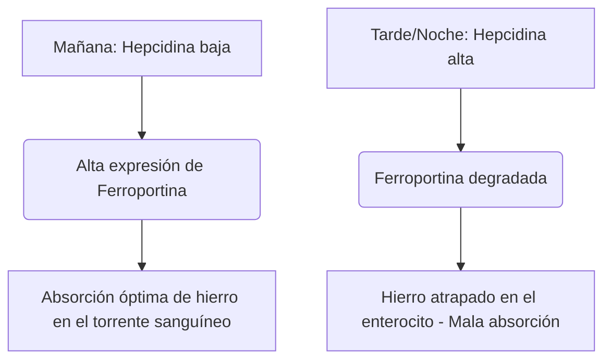

El hierro es un micronutriente indispensable que funciona como cofactor estructural y catalítico en el transporte de oxígeno, la respiración celular y la síntesis de ADN. A pesar de su abundancia en la naturaleza, el hierro es con frecuencia un nutriente limitante del crecimiento en la dieta humana. Debido a que los humanos no poseen ningún mecanismo fisiológico para la excreción activa de hierro, el equilibrio sistémico del hierro se mantiene exclusivamente a nivel de la absorción intestinal.

El hierro en la dieta se presenta en dos formas principales: **hierro orgánico (hemo)** y **hierro inorgánico (no hemo)**.

El hierro hemo es altamente biodisponible, absorbiéndose típicamente a tasas del 15% al 35%. Se transporta intacto a través del borde en cepillo apical de los enterocitos duodenales a través de la Proteína Transportadora de Hemo 1 (HCP1) y permanece protegido de los inhibidores dietéticos estándar.

Por el contrario, el hierro no hemo (hierro inorgánico) representa más del 80% de la ingesta dietética, pero exhibe un perfil de absorción altamente comprometido, con tasas de absorción que oscilan entre un mero 2% y un 20%.

> [!TIP]
> A pH fisiológico, el hierro no hemo existe predominantemente en su estado férrico (Fe³⁺) oxidado y altamente insoluble. Para ser absorbido, debe someterse a una reducción al estado ferroso (Fe²⁺) soluble por la reductasa apical citocromo b duodenal (Dcytb), antes de ingresar al enterocito a través del Transportador de Metales Divalentes 1 (DMT1).

## Vías del Hierro Hemo vs. No Hemo

| Característica / Métrica | Vía del Hierro Hemo | Vía del Hierro No Hemo (Inorgánico) |
| :--- | :--- | :--- |
| **Fuentes Dietéticas** | Tejidos animales (hemoglobina, mioglobina) | Plantas, alimentos fortificados con hierro, sales minerales |
| **Transportador Apical** | Proteína Transportadora de Hemo 1 (HCP1) | Transportador de Metales Divalentes 1 (DMT1) |
| **Estado de Valencia Requerido** | Complejo unido a porfirina | Ferroso (Fe²⁺) |
| **pH Luminal Óptimo** | Ampliamente estable; no influenciado por el ácido gástrico | Requiere alta acidez (pH < 3.0) para la solubilización |
| **Eficacia Típica de Absorción**| 15% – 35% (alta biodisponibilidad) | 2% – 20% (altamente variable) |
| **Sensibilidad a Inhibidores** | Insignificante; protegido por el anillo de porfirina | Extremadamente alta (inhibido por fitatos, polifenoles, calcio) |

## Sincronización Óptima (Cronofarmacología)

La optimización de la absorción de hierro no hemo requiere una coordinación precisa con la cinética diurna de la **hepcidina**, una hormona peptídica de 25 aminoácidos sintetizada principalmente por los hepatocitos. La hepcidina funciona como el regulador sistémico maestro de la homeostasis del hierro uniéndose directamente al exportador basolateral Ferroportina, induciendo su degradación. En consecuencia, los niveles elevados de hepcidina circulante atrapan el hierro dentro de los enterocitos duodenales y evitan su entrada en el torrente sanguíneo.

### Oscilaciones Circadianas de la Hepcidina
En condiciones fisiológicas basales, las concentraciones de hepcidina están en su punto más bajo temprano en la mañana, aumentan constantemente a lo largo de la tarde hasta alcanzar un pico y disminuyen durante la noche.

Esta curva circadiana impacta directamente la cinética del hierro oral. La **administración matutina** de suplementos de hierro permite que el mineral llegue al duodeno cuando la expresión de Ferroportina en los enterocitos está en su punto más alto. Por el contrario, la dosificación en la tarde o noche obliga al hierro a competir con un bloqueo elevado de hepcidina, lo que resulta en una reducción del 37% en la absorción fraccional de hierro.

### El Impacto de la Acidez Gástrica
El estado biofísico del hierro inorgánico depende en gran medida de la producción de ácido gástrico. La supresión farmacológica del ácido gástrico a través de Inhibidores de la Bomba de Protones (IBP - protectores gástricos) interrumpe severamente este microambiente, elevando el pH gástrico y causando la rápida oxidación del Fe²⁺ soluble al Fe³⁺ altamente insoluble.

> [!WARNING]
> Los suplementos orales de hierro deben tomarse con el estómago vacío —idealmente 1 hora antes o 2 horas después de una comida— y estrictamente separados de cualquier medicamento supresor de ácido.

## Las Interacciones Fatales (Qué NO Mezclar)

La eficacia terapéutica del hierro oral se ve fácilmente comprometida por la ingestión concurrente con varios compuestos dietéticos y agentes farmacéuticos.

### Calcio
El calcio, ya sea que se ingiera como lácteos en la dieta (leche, queso, yogur) o como suplementos minerales (carbonato de calcio), es un potente inhibidor de la absorción de hierro hemo y no hemo. La coingestión de 500 mg de carbonato de calcio con una comida que contiene hierro reduce la absorción fraccional de hierro en más del 50%.

### Taninos y Polifenoles
Los polifenoles que se encuentran en el **té negro, té verde, tés de hierbas y café** son quelantes de hierro excepcionalmente efectivos. Estos compuestos derivados de plantas se coordinan con el hierro férrico para formar complejos organometálicos grandes y altamente estables que no pueden cruzar el borde en cepillo duodenal. Agregar solo una taza de café o té a una comida puede disminuir la absorción de hierro no hemo entre un 40% y un 70%.

### Ácido Fítico
El ácido fítico es el principal compuesto de almacenamiento de fósforo en cereales integrales, cereales, nueces y legumbres. La relación molar ácido fítico-hierro es el factor dietético individual más importante que limita la biodisponibilidad del hierro en dietas basadas en plantas.

### Zinc y Magnesio
El hierro ferroso, el zinc y el magnesio comparten vías de transporte superpuestas a través de la membrana apical del enterocito (como DMT1). A dosis terapéuticas de hierro, se produce una inhibición competitiva, suprimiendo significativamente el transporte de hierro. No tome su suplemento de hierro junto con zinc o magnesio.

### Medicamentos para la Tiroides (Levotiroxina)
La coadministración de suplementos orales de hierro con levotiroxina (T4) provoca una grave interacción fármaco-nutriente. El hierro se coordina con la molécula de levotiroxina, formando un complejo insoluble que reduce la biodisponibilidad oral de la levotiroxina en un 20% a 64%.

> [!CAUTION]
> Para prevenir el fracaso clínico de su terapia tiroidea, debe haber un período estricto de separación de al menos 4 horas entre la administración de levotiroxina y de hierro.

## El Cofactor Definitivo: Vitamina C

El ácido ascórbico (Vitamina C) es el potenciador más potente de la absorción de hierro no hemo, capaz de anular los efectos inhibidores de los fitatos, polifenoles y el calcio en la dieta.

Esta relación sinérgica opera a través de un mecanismo bioquímico dual altamente eficiente:
1. **Reducción termodinámicamente favorable:** El ácido ascórbico convierte rápidamente los iones férricos (Fe³⁺) insolubles en la forma ferrosa (Fe²⁺) altamente soluble, lista para el transporte.
2. **Quelación duodenal:** El ácido ascórbico actúa como un escudo protector, evitando que el hierro se una a fitatos y polifenoles durante su transición al ambiente alcalino del duodeno.

## Efectos Secundarios y el Paradigma de Dosis en Días Alternos

El enfoque tradicional para tratar la anemia por deficiencia de hierro —recetar altas dosis de hierro oral a diario— con frecuencia fracasa debido a los graves efectos secundarios gastrointestinales (náuseas, estreñimiento) y los circuitos de retroalimentación sistémica.

Debido a la baja absorción fraccional, hasta el 90% de una dosis estándar de hierro oral permanece sin absorber en el intestino. Este exceso de hierro reacciona con el peróxido de hidrógeno para generar radicales hidroxilo altamente tóxicos, desencadenando estrés oxidativo e inflamación de la mucosa.

Además, los suplementos diarios de altas dosis de hierro desencadenan un **"Bloqueo Mucoso" (Mucosal Block)** sistémico. La ingestión de una dosis de hierro oral ≥ 60 mg induce un rápido aumento en la hepcidina sérica que permanece elevado durante 24 horas. Si se administra una segunda dosis de hierro al día siguiente, los enterocitos están físicamente bloqueados para exportarlo a la circulación portal. El hierro queda atrapado y eventualmente se excreta.

> [!TIP]
> **Dosis en días alternos:** Para evitar este bloqueo mediado por hepcidina, la hematología moderna ha cambiado hacia la administración de hierro oral **cada dos días (en días alternos)**. Los ensayos clínicos demuestran que tomar hierro cada 48 horas aumenta la absorción fraccional de hierro en un 40% a 50% en comparación con la dosis diaria consecutiva, al tiempo que reduce drásticamente los efectos secundarios gastrointestinales.

### Resumen de Protocolos Clínicos

*   **Un pH Gástrico Bajo es Esencial:** Tome el hierro con el estómago vacío con agua.
*   **Evite los Principales Inhibidores:** Evite estrictamente tomar hierro junto con calcio, lácteos, café o té.
*   **Mantenga un Espaciamiento Estricto:** Separe el hierro de la levotiroxina por al menos 4 horas.
*   **Aproveche la Vitamina C:** La coadministración de hierro con vitamina C aumenta la absorción hasta en un 300%.
*   **Adopte la Dosis en Días Alternos:** Espacie las dosis de hierro oral por 48 horas para evitar el bloqueo mucoso inducido por la hepcidina y maximizar la absorción.

## Referencias

1. Stoffel NU, Zeder C, Brittenham GM, Moretti D, Zimmermann MB. [Iron absorption from oral iron supplements given on consecutive versus alternate days and as single morning doses versus twice-daily split dosing in iron-depleted women: two open-label, randomised controlled trials](https://pubmed.ncbi.nlm.nih.gov/29032957/). *Lancet Haematol.* 2017.
2. Campbell NR, Hasinoff BB. [Ferrous sulfate reduces thyroxine efficacy in patients with hypothyroidism](https://pubmed.ncbi.nlm.nih.gov/1443969/). *Ann Intern Med.* 1992.
3. Hallberg L, Hulthén L. [Effect of ascorbic acid intake on nonheme-iron absorption from a complete diet](https://pubmed.ncbi.nlm.nih.gov/11124756/). *Am J Clin Nutr.* 2000.
4. Lönnerdal B. [Calcium and iron absorption—mechanisms and public health relevance](https://pubmed.ncbi.nlm.nih.gov/21462112/). *Int J Vitam Nutr Res.* 2010.

*Este artículo tiene fines informativos únicamente y no constituye asesoramiento médico. Consulte a un profesional de la salud calificado antes de modificar su rutina de suplementos o medicamentos.*
