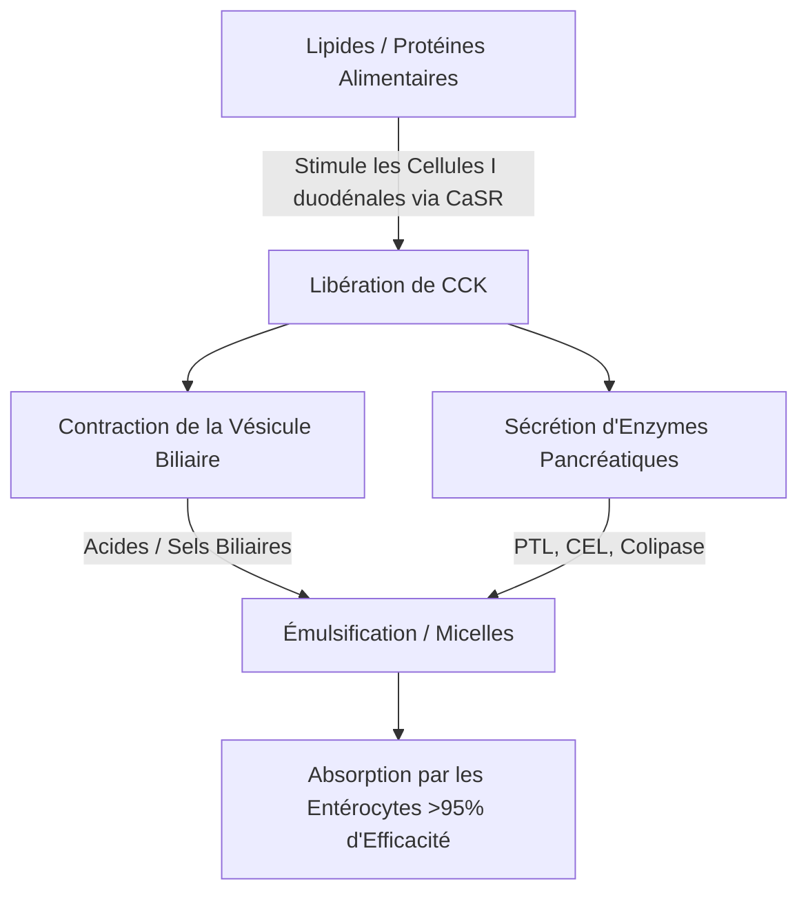
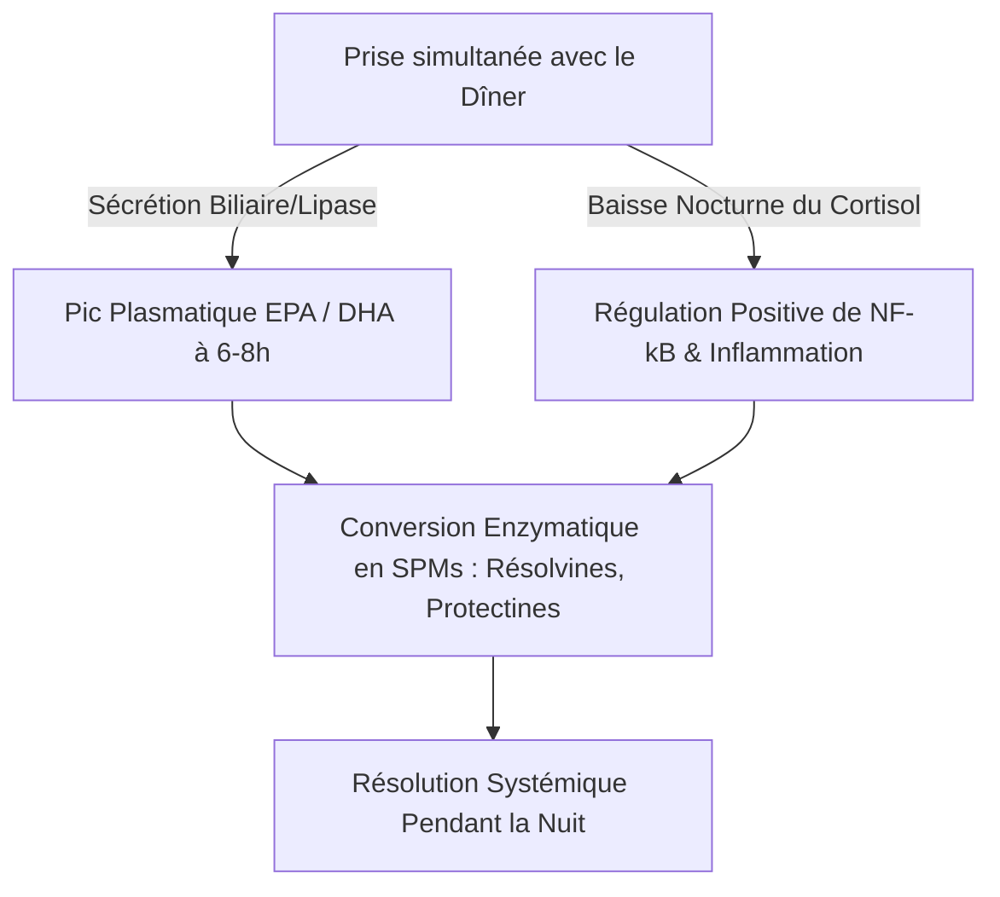

L'efficacité thérapeutique des acides gras polyinsaturés ($\text{AGPI}$) oméga-3 marins à longue chaîne, plus précisément l'acide eicosapentaénoïque ($\text{EPA}$) et l'acide docosahexaénoïque ($\text{DHA}$), est strictement régie par leur biodisponibilité intestinale. En nutrition clinique, une cause majeure d'échec thérapeutique est le « paradoxe du repas maigre » (lean-meal paradox) — l'administration de lipides marins hautement hydrophobes à jeun ou en accompagnement de repas sans matières grasses. Malgré la prise de doses nominales élevées, l'absence d'une matrice lipidique structurée ingérée simultanément empêche les mécanismes physiques et enzymatiques nécessaires à l'absorption des graisses dans la lumière aqueuse du tractus gastro-intestinal humain. Cette analyse clinique détaille les principes biophysiques, biochimiques et chronopharmacologiques qui dictent la digestion et l'absorption de l'$\text{EPA}$ et du $\text{DHA}$.

## Le Jeûne et le Paradoxe du Repas Maigre

Le tractus gastro-intestinal est fondamentalement un système aqueux. Lorsque des lipides hydrophobes (qui repoussent l'eau) tels que les huiles de poisson standard sont ingérés, ils rencontrent l'environnement hautement polaire des sucs gastriques et intestinaux. Selon les lois de la thermodynamique, les molécules hydrophobes minimisent leur contact avec l'eau, entraînant une séparation de phase rapide. Cela fait que l'huile ingérée se regroupe en de gros globules lipidiques non divisés qui flottent au-dessus du chyme gastrique aqueux.

Avaler une capsule d'oméga-3 avec un verre d'eau l'estomac vide, ou en même temps qu'un repas composé uniquement de glucides (comme un fruit ou une tranche de pain sec) ne parvient pas à déclencher les processus physiologiques nécessaires pour surmonter cette séparation de phase. Sans émulsification physique, le rapport surface/volume de la phase lipidique reste extrêmement faible. Les sites actifs hydrophiles des lipases pancréatiques ne peuvent pas accéder aux liaisons esters enfouies à l'intérieur de ces grosses gouttelettes hydrophobes. Par conséquent, boire de l'eau avec de l'huile de poisson n'aide pas à l'absorption ; au contraire, cela dilue les traces d'enzymes digestives présentes à jeun, éloignant encore davantage les globules lipidiques non émulsionnés de la membrane en brosse de l'entérocyte et conduisant à une malabsorption ainsi qu'à des troubles gastro-intestinaux.

Pour que ces lipides hautement hydrophobes traversent la couche d'eau non agitée (unstirred water layer) de la muqueuse intestinale, ils doivent être convertis en une phase dispersable dans l'eau thermodynamiquement stable. Cette transformation dépend entièrement de la chimie physique de la micellisation, un processus initié par la signalisation duodénale à médiation hormonale.

## Sels Biliaires et Formation des Micelles

La transition d'une masse d'huile hydrophobe flottante à des microgouttelettes absorbables nécessite une cascade sécrétoire et neuromusculaire coordonnée dans le duodénum. Le principal moteur hormonal de ce processus est la cholécystokinine ($\text{CCK}$), un peptide de 33 acides aminés synthétisé et sécrété par les cellules I entéroendocrines dans la muqueuse du duodénum et du jéjunum supérieur.



Dans des conditions physiologiques, la présence d'acides gras à longue chaîne et de protéines partiellement digérées dans la lumière duodénale stimule le récepteur sensible au calcium ($\text{CaSR}$) sur les cellules I, déclenchant l'exocytose rapide de la $\text{CCK}$ dans la circulation sanguine. Une fois libérée, la $\text{CCK}$ se lie aux récepteurs $\text{CCK}_A$ sur la paroi de la vésicule biliaire, provoquant sa contraction, tout en relaxant le sphincter d'Oddi et en stimulant les cellules acineuses pancréatiques pour qu'elles libèrent leurs enzymes digestives.

Les acides biliaires libérés par la vésicule biliaire — principalement des sels de sodium amphiphiles d'acide cholique et chénodésoxycholique — sont des détergents biologiques essentiels. Lorsque les concentrations d'acides biliares dans le duodénum dépassent la concentration micellaire critique ($\text{CMC}$), ils s'organisent autour des gouttelettes lipidiques hydrophobes. Le noyau stéroïde hydrophobe du sel biliaire s'associe à la phase lipidique, tandis que le groupe conjugué polaire et hydrophile (glycine ou taurine) fait face à la lumière duodénale aqueuse.

Par l'action mécanique du péristaltisme intestinal, ces gouttelettes enrobées de bile sont cisaillées en micelles mixtes. Ces agrégats colloïdaux sphériques n'ont qu'un diamètre de 3 à 10 nanomètres, augmentant ainsi de plusieurs milliers de fois la surface lipidique exposée aux lipases pancréatiques. Sans l'ingestion simultanée de graisses alimentaires saines (telles que l'huile d'olive extra vierge, l'avocat ou des jaunes d'œufs de poules élevées en plein air) pour atteindre le seuil de libération de la $\text{CCK}$, la contraction de la vésicule biliaire ne se produit pas. Dans cet état, les niveaux d'acides biliaires restent en dessous de la $\text{CMC}$, la sécrétion de lipase pancréatique est minime et les lipides oméga-3 ingérés ne peuvent pas former de micelles, ce qui empêche l'absorption.

## La Bataille des Formes Biochimiques : TG vs. EE vs. PL

Les suppléments d'oméga-3 disponibles dans le commerce existent sous trois formes moléculaires principales : les triglycérides naturels ou réestérifiés ($\text{TG}$/$\text{rTG}$), les esters éthyliques ($\text{EE}$) et les phospholipides ($\text{PL}$). La structure moléculaire de ces vecteurs détermine leur vitesse de digestion, leur dépendance à l'égard de la lipase et leur biodisponibilité.

```text
Forme Triglycéride (TG) :          Forme Ester Éthylique (EE) :   Forme Phospholipide (PL) :
     ┌─ Squelette de Glycérol           ┌─ Molécule d'Éthanol          ┌─ Tête Phosphate (Polaire)
     ├─ Acide Gras (EPA)                └─ Acide Gras (EPA)            ├─ Acide Gras (EPA)
     ├─ Acide Gras (DHA)                                               └─ Acide Gras (DHA)
     └─ Acide Gras (Autre)
```

Dans les triglycérides naturels et réestérifiés ($\text{TG}$/$\text{rTG}$), trois acides gras ($\text{EPA}$/$\text{DHA}$) sont liés à un squelette de glycérol à trois carbones. Pendant la digestion, la lipase triglycéridique pancréatique ($\text{PTL}$), agissant de concert avec son cofacteur la colipase, hydrolyse les liaisons esters aux positions $sn\text{-}1$ et $sn\text{-}3$. Cela produit deux acides gras libres et un $sn\text{-}2$-monoglycéride, tous deux hautement polaires, facilement micellisables et aisément absorbés par les entérocytes avec une efficacité de plus de 95 %.

À l'inverse, la forme d'ester éthylique ($\text{EE}$) est un produit synthétique créé lors de la concentration chimique. Le squelette de glycérol est retiré et chaque acide gras individuel est estérifié à une molécule d'éthanol ($\text{CH}_3\text{CH}_2\text{OH}$). Cette liaison ester synthétique est hautement résistante aux enzymes pancréatiques humaines. Des études in vitro et in vivo montrent que la lipase pancréatique humaine hydrolyse la liaison acide gras-éthanol dans les $\text{EE}$ à un rythme 10 à 50 fois plus lent que les liaisons glycéryle-ester dans les triglycérides.

En raison de cette hydrolyse lente, l'absorption de l'$\text{EE}$ dépend fortement d'une libération massive de lipases pancréatiques et de sels biliaires, qui n'est déclenchée que par un repas riche en graisses. Pris avec un régime pauvre en graisses, la quantité limitée de lipase pancréatique disponible ne peut pas cliver efficacement les liaisons $\text{EE}$, conduisant à une mauvaise biodisponibilité (chutant souvent à environ 20 %) et laissant les esters synthétiques non absorbés passer dans le côlon, où ils peuvent causer des effets secondaires gastro-intestinaux.

La forme phospholipide ($\text{PL}$), provenant principalement de l'huile de krill antarctique (Euphausia superba), présente une structure amphiphile où l'$\text{EPA}$ et le $\text{DHA}$ sont liés à un squelette de phosphatidylcholine. Le groupe de tête phosphate hautement polaire rend les phospholipides naturellement dispersables dans l'eau. Pour cette raison, les formes $\text{PL}$ peuvent s'auto-émulsionner et former des microgouttelettes spontanées dans le tractus gastro-intestinal, contournant l'exigence absolue d'une micellisation stimulée par les sels biliaires. Les phospholipides sont également digérés par la phospholipase $\text{A}_2$ et peuvent être directement absorbés par les entérocytes sous forme de lysophospholipides, ce qui permet une biodisponibilité élevée même à jeun ou lors d'un repas allégé.

| Forme Biochimique | Vecteur Moléculaire / Squelette | Taux d'Absorption Moyen (Repas Maigre) | Taux d'Absorption Moyen (Repas Gras) | Biodisponibilité Relative (vs. Base EE) | Dépendance à la Lipase Pancréatique |
| --- | --- | --- | --- | --- | --- |
| Ester Éthylique (EE) | Éthanol ($\text{CH}_3\text{CH}_2\text{OH}$) | $\approx 20\%$ | $\approx 60\%$ | Base de référence ($100\%$) | Absolue ; hydrolysé 10-50x plus lentement que TG |
| Triglycéride (TG / rTG) | Squelette de Glycérol | $\approx 68\%$ | $\approx 90\%$ | de $124\%$ à $186\%$ | Élevée ; rapidement clivé en 2-FFA et 1-MAG |
| Phospholipide (PL) | Phosphatidylcholine | de $\approx 80\%$ à $95\%$ | $>95\%$ | de $168\%$ à $500\%$ | Minime ; s'auto-émulsionne, contourne certaines lipases |

> [!WARNING]
> Les personnes présentant une insuffisance pancréatique exocrine (IPE), une dyskinésie biliaire ou celles ayant subi une cholécystectomie présentent une digestion endogène des lipides gravement altérée. Pour ces populations cliniques, l'administration de formulations d'esters éthyliques synthétiques (EE) sous un régime alimentaire pauvre en graisses représente un risque élevé de malabsorption complète et de troubles gastro-intestinaux, car le clivage enzymatique nécessaire est pratiquement inexistant dans ces états.

## L'Oxydation des Lipides et la Nécessité Absolue de la Vitamine E

Les caractéristiques structurelles qui rendent l'$\text{EPA}$ et le $\text{DHA}$ biologiquement actifs les rendent également hautement instables. L'$\text{EPA}$ contient cinq doubles liaisons et le $\text{DHA}$ en contient six, interrompues par des groupes méthylène. Les liaisons carbone-hydrogène au niveau des carbones méthyléniques bis-allyliques ($\text{-CH=CH-CH}_2\text{-CH=CH-}$) ont de faibles énergies de dissociation de liaison. Cela les rend exceptionnellement vulnérables à l'attaque des radicaux libres et à la peroxydation lipidique non enzymatique.

```text
Phase 1 : Initiation
  [Liaison Carbone-Hydrogène du PUFA] + [ROS / Radical Libre] ──> [Radical Lipidique Centré sur le Carbone (R•)]

Phase 2 : Propagation
  [Radical Lipidique Centré sur le Carbone (R•)] + [O2] ──> [Radical Peroxyle Lipidique (ROO•)]
  [Radical Peroxyle Lipidique (ROO•)] + [PUFA Non Oxydé] ──> [Hydroperoxyde Lipidique (ROOH)] + [Nouveau Radical Lipidique (R•)]

Phase 3 : Décomposition
  [Hydroperoxyde Lipidique Instable (ROOH)] ──> [Aldéhydes Toxiques (MDA / HHE)]
```

Une fois ingérée, l'huile de poisson est exposée à un environnement de $37^\circ\text{C}$ (température corporelle), aux acides gastriques et à l'oxygène moléculaire dissous ($\text{O}_2$). Cet environnement accélère la cascade de peroxydation lipidique à travers trois phases distinctes :

1. **Initiation :** Une espèce réactive de l'oxygène ($\text{ROS}$) arrache un atome d'hydrogène à un carbone bis-allylique, générant un radical lipidique centré sur le carbone ($\text{R}^\bullet$).
2. **Propagation :** Le radical lipidique réagit rapidement avec l'oxygène moléculaire ($\text{O}_2$) pour former un radical peroxyle lipidique ($\text{ROO}^\bullet$). Ce radical peroxyle arrache ensuite un atome d'hydrogène d'une molécule d'$\text{AGPI}$ non oxydée adjacente, générant un hydroperoxyde lipidique ($\text{ROOH}$) et un nouveau radical lipidique, perpétuant ainsi la réaction en chaîne.
3. **Décomposition :** Les hydroperoxydes lipidiques instables se décomposent en produits d'oxydation secondaires hautement réactifs et cytotoxiques, notamment des alcénals comme le malondialdéhyde ($\text{MDA}$) et le 4-hydroxyhexénal ($\text{HHE}$).

Ces produits d'oxydation secondaires sont facilement absorbés par l'intestin, incorporés dans les chylomicrons et les lipoprotéines de basse densité ($\text{LDL}$), et peuvent induire un stress oxydatif systémique, des lésions endothéliales et de l'athérogénèse.

Pour stopper ce processus, la co-formulation d'un antioxydant liposoluble rompant la chaîne est nécessaire. La vitamine E naturelle, spécifiquement le d-alpha-tocophérol ($\text{C}_{29}\text{H}_{50}\text{O}_2$), est hautement optimisée pour ce rôle. Le d-alpha-tocophérol agit comme un donneur d'hydrogène, transférant rapidement son atome d'hydrogène phénolique au radical peroxyle lipidique réactif ($\text{ROO}^\bullet$) avec une constante de vitesse extrêmement rapide d'environ $10^6\,\text{M}^{-1}\text{s}^{-1}$.

Le radical tocophéroxyle résultant est très stable en raison de la délocalisation par résonance de son électron non apparié à travers le cycle chromanol, l'empêchant d'attaquer les chaînes d'acides gras adjacentes. Cela arrête la réaction en chaîne, protégeant l'intégrité structurelle des molécules d'$\text{EPA}$ et de $\text{DHA}$ afin qu'elles puissent atteindre les tissus cibles dans leur état actif et non oxydé.

## Chronopharmacologie et la Fenêtre Anti-inflammatoire Nocturne

En biochimie des lipides, le moment de la prise (timing) est un facteur critique. Ingestion de suppléments d'oméga-3 avec le repas le plus copieux et le plus riche en graisses de la journée (généralement le dîner) optimise à la fois l'absorption et les processus naturels de guérison nocturne de l'organisme.



Premièrement, le dîner est historiquement le repas le plus riche en graisses de la journée pour de nombreuses personnes. Cela fournit le volume physique de lipides requis pour déclencher la libération maximale de $\text{CCK}$, conduisant à une contraction vigoureuse de la vésicule biliaire, une sécrétion biliaire abondante et une forte activité de la lipase pancréatique. Cela optimise la micellisation et la cinétique digestive, garantissant que presque toute la dose ingérée est absorbée avec succès.

Deuxièmement, l'administration le soir s'aligne sur les cycles immunitaires et inflammatoires circadiens de l'organisme. Les niveaux de cortisol endogène chutent naturellement à leurs plus bas niveaux diurnes en fin de soirée et au début de la nuit. Le cortisol est une hormone anti-inflammatoire puissante ; lorsque ses niveaux baissent, les voies inflammatoires systémiques — telles que celles régies par le facteur de transcription pro-inflammatoire $\text{NF}\text{-}\kappa\text{B}$ — subissent une « régulation à la hausse » relative (upregulation).

En ingérant les oméga-3 au moment du dîner, les pics de concentration plasmatique et de membrane cellulaire d'$\text{EPA}$ et de $\text{DHA}$ sont atteints 6 à 8 heures plus tard, coïncidant directement avec cette fenêtre inflammatoire nocturne. Pendant cette phase, le corps utilise ces acides gras comme substrats pour la synthèse enzymatique de Médiateurs Pro-résolutifs Spécialisés ($\text{SPM}$)—spécifiquement les résolvines, protectines et marésines—via les voies de la cyclo-oxygénase ($\text{COX}$) et de la lipoxygénase ($\text{LOX}$). Ces $\text{SPM}$ résolvent activement les micro-inflammations chroniques, favorisent le renouvellement cellulaire et soutiennent la guérison des tissus pendant le sommeil.

De plus, l'administration le soir d'oméga-3, particulièrement de $\text{DHA}$, offre des avantages neurologiques uniques. Le $\text{DHA}$ est un lipide structurel clé des membranes neuronales et joue un rôle important dans l'horloge circadienne du cerveau. Il agit sur les gènes de l'horloge (tels que BMAL1 et CLOCK) responsables de la régulation du cycle veille-sommeil.

L'intégration nocturne du $\text{DHA}$ dans les membranes synaptiques soutient la communication neuronale, renforce la synthèse de la sérotonine et optimise sa conversion en mélatonine. Les essais cliniques démontrent qu'une supplémentation constante en oméga-3 le soir améliore considérablement l'efficacité du sommeil, raccourcit la latence d'endormissement et réduit l'indice de fragmentation du sommeil (réveils nocturnes).

> [!TIP]
> Afin de maximiser la bio-incorporation cellulaire des acides gras oméga-3 à longue chaîne, les médecins devraient recommander à leurs patients d'administrer leur dose quotidienne en même temps que le repas le plus riche en lipides de la journée. La co-ingestion avec au moins 10 à 15 grammes de graisses saines monoinsaturées ou polyinsaturées (par ex., huile d'olive extra vierge ou avocat) est suffisante pour déclencher le seuil de libération de cholécystokinine nécessaire à une micellisation optimale.

## Synthèses Cliniques et Recommandations Pratiques

Pour maximiser le potentiel thérapeutique de la supplémentation en oméga-3, il faut s'éloigner de la simple ingestion de capsules à forte dose nominale au profit d'une approche basée sur la biochimie des lipides et la cinétique digestive. La pratique traditionnelle de prendre de l'huile de poisson avec de l'eau à jeun conduit souvent à une mauvaise absorption et à des effets secondaires gastro-intestinaux.

Pour des résultats thérapeutiques optimaux, les cliniciens devraient privilégier les formulations de triglycérides réestérifiés ($\text{rTG}$) ou de phospholipides ($\text{PL}$), qui présentent une cinétique d'absorption supérieure et sont moins dépendantes des repas riches en graisses que les esters éthyliques synthétiques ($\text{EE}$).

Quelle que soit la formulation choisie, le supplément doit être pris avec un repas contenant au moins 10 à 15 grammes de graisses alimentaires. Ce seuil lipidique est nécessaire pour déclencher la cascade de signalisation $\text{CCK}$ duodénale, initiant la contraction de la vésicule biliaire et la sécrétion de la lipase pancréatique pour permettre une micellisation complète.

De plus, pour protéger ces $\text{AGPI}$ très instables des dommages oxydatifs à l'intérieur du corps, la formulation doit toujours inclure un antioxydant naturel liposoluble tel que le d-alpha-tocophérol (Vitamine E).

Enfin, aligner la supplémentation sur le repas du soir garantit que le pic d'absorption coïncide avec les voies naturelles anti-inflammatoires et de réparation cellulaire nocturnes de l'organisme, maximisant ainsi les avantages cardiovasculaires, immunologiques et neurologiques de l'$\text{EPA}$ et du $\text{DHA}$.
