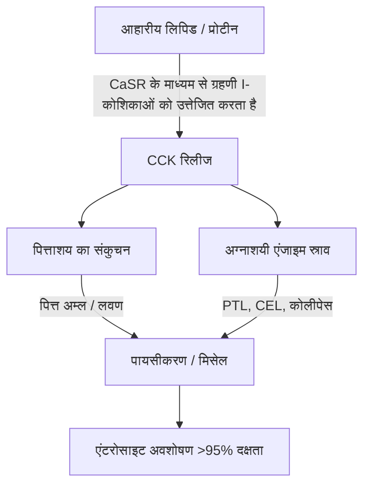

लॉन्ग-चेन मरीन ओमेगा-3 पॉलीअनसेचुरेटेड फैटी एसिड ($\text{PUFA}$), विशेष रूप से ईकोसापेंटेनोइक एसिड ($\text{EPA}$) और डोकोसाहेक्सेनोइक एसिड ($\text{DHA}$) की चिकित्सीय प्रभावकारिता, उनकी आंतों की जैव उपलब्धता द्वारा सख्ती से नियंत्रित होती है। नैदानिक पोषण में, चिकित्सीय विफलता का एक प्रमुख कारण "लीन-मील पैराडॉक्स" (lean-meal paradox) या कम वसा वाले भोजन का विरोधाभास है - उपवास की स्थिति में या वसा रहित भोजन के साथ अत्यधिक हाइड्रोफोबिक समुद्री लिपिड का प्रशासन। उच्च नाममात्र खुराक के अंतर्ग्रहण के बावजूद, संरचित लिपिड सह-अंतर्ग्रहण मैट्रिक्स (co-ingestion matrix) की कमी मानव जठरांत्र संबंधी मार्ग के जलीय लुमेन में लिपिड अवशोषण के लिए आवश्यक भौतिक और एंजाइमेटिक तंत्र को रोकती है। यह नैदानिक विश्लेषण उन बायोफिजिकल, बायोकेमिकल और क्रोनोफार्माकोलॉजिकल सिद्धांतों का विवरण देता है जो $\text{EPA}$ और $\text{DHA}$ के पाचन और अवशोषण को निर्देशित करते हैं।

## उपवास और कम वसा वाले भोजन का विरोधाभास

गैस्ट्रोइंटेस्टाइनल (जठरांत्र) मार्ग मूल रूप से एक जलीय (पानी आधारित) प्रणाली है। जब मानक मछली के तेल जैसे हाइड्रोफोबिक (पानी को विकर्षित करने वाले) लिपिड ग्रहण किए जाते हैं, तो वे गैस्ट्रिक और आंतों के रस के अत्यधिक ध्रुवीय वातावरण का सामना करते हैं। ऊष्मप्रवैगिकी (थर्मोडायनामिक्स) के नियमों के अनुसार, हाइड्रोफोबिक अणु पानी के साथ अपने संपर्क को कम करते हैं, जिससे तेजी से चरण पृथक्करण (phase separation) होता है। इसके कारण निगला गया तेल जलीय गैस्ट्रिक काइम (chyme) के ऊपर तैरने वाले बड़े, अविभाजित लिपिड ग्लोब्यूल्स (गोलिकाओं) में मिल जाता है।

खाली पेट एक गिलास पानी के साथ ओमेगा-3 कैप्सूल निगलना, या केवल कार्बोहाइड्रेट वाले भोजन (जैसे फल का एक टुकड़ा या सूखी ब्रेड का एक टुकड़ा) के साथ इसे लेने से इस चरण पृथक्करण को दूर करने के लिए आवश्यक शारीरिक प्रक्रियाएं शुरू नहीं हो पाती हैं। भौतिक पायसीकरण (emulsification) के बिना, लिपिड चरण का सतह क्षेत्र-से-आयतन अनुपात बेहद कम रहता है। अग्नाशयी लाइपेस (pancreatic lipases) के हाइड्रोफिलिक सक्रिय स्थल इन बड़ी, हाइड्रोफोबिक बूंदों के अंदर दबे एस्टर बॉन्ड तक नहीं पहुंच सकते हैं। नतीजतन, मछली के तेल के साथ पानी पीना अवशोषण में सहायता नहीं करता है; इसके बजाय, यह उपवास की स्थिति में मौजूद पाचन एंजाइमों के निशान को पतला कर देता है, बिना पायसीकृत लिपिड ग्लोब्यूल्स को एंटरोसाइट के ब्रश बॉर्डर झिल्ली से और दूर ले जाता है, जिससे कुअवशोषण (malabsorption) और गैस्ट्रोइंटेस्टाइनल परेशानी होती है।

इन अत्यधिक हाइड्रोफोबिक लिपिड को आंतों के श्लेष्म की अस्थिर जल परत (unstirred water layer) को पार करने के लिए, उन्हें थर्मोडायनामिक रूप से स्थिर, पानी में फैलने योग्य चरण में परिवर्तित किया जाना चाहिए। यह परिवर्तन पूरी तरह से मिसेलराइजेशन (micellarization) की भौतिक रसायन शास्त्र पर निर्भर है, जो हार्मोन-मध्यस्थता ग्रहणी (duodenal) सिग्नलिंग द्वारा शुरू की गई एक प्रक्रिया है।

## पित्त लवण और मिसेल (Micelle) निर्माण

तैरते हुए हाइड्रोफोबिक तेल द्रव्यमान से अवशोषित होने योग्य सूक्ष्म बूंदों (microdroplets) में संक्रमण के लिए ग्रहणी में एक समन्वित स्रावी और न्यूरोमस्कुलर कैस्केड की आवश्यकता होती है। इस प्रक्रिया का प्राथमिक हार्मोनल चालक कोलेसिस्टोकिनिन ($\text{CCK}$) है, जो ग्रहणी और ऊपरी जेजुनम के म्यूकोसल अस्तर में एंटरोएंडोक्राइन I-कोशिकाओं द्वारा संश्लेषित और स्रावित एक 33-अमीनो एसिड पेप्टाइड है।



शारीरिक स्थितियों के तहत, ग्रहणी के लुमेन में लॉन्ग-चेन फैटी एसिड और आंशिक रूप से पचे हुए प्रोटीन की उपस्थिति I-कोशिकाओं पर कैल्शियम-सेंसिंग रिसेप्टर ($\text{CaSR}$) को उत्तेजित करती है, जिससे रक्तप्रवाह में $\text{CCK}$ का तेजी से एक्सोसाइटोसिस होता है। एक बार जारी होने के बाद, $\text{CCK}$ पित्ताशय (gallbladder) की दीवार पर $\text{CCK}_A$ रिसेप्टर्स से जुड़ जाता है, जिससे यह सिकुड़ जाता है, जबकि एक साथ ओड्डी के स्फिंक्टर (Sphincter of Oddi) को आराम देता है और अग्नाशयी एसिनर कोशिकाओं (pancreatic acinar cells) को उनके पाचन एंजाइमों को छोड़ने के लिए उत्तेजित करता है।

पित्ताशय की थैली से निकलने वाले पित्त अम्ल (bile acids) - मुख्य रूप से कोलिक और चेनोडॉक्सीकोलिक एसिड के एम्फीपैथिक सोडियम लवण - आवश्यक जैविक डिटर्जेंट हैं। जब ग्रहणी में पित्त अम्ल की सांद्रता क्रिटिकल मिसेल कंसंट्रेशन ($\text{CMC}$) से अधिक हो जाती है, तो वे हाइड्रोफोबिक लिपिड बूंदों के चारों ओर खुद को व्यवस्थित कर लेते हैं। पित्त नमक का हाइड्रोफोबिक स्टेरॉयड कोर लिपिड चरण के साथ जुड़ता है, जबकि ध्रुवीय, हाइड्रोफिलिक संयुग्मित समूह (ग्लाइसिन या टॉरिन) जलीय ग्रहणी लुमेन का सामना करता है।

आंतों के क्रमाकुंचन (peristalsis) की यांत्रिक क्रिया के माध्यम से, ये पित्त-लेपित बूंदें मिश्रित मिसेल में कट (shear) जाती हैं। इन गोलाकार कोलाइडल एग्रीगेट्स का व्यास केवल 3 से 10 नैनोमीटर होता है, जिससे अग्नाशयी लाइपेस के संपर्क में आने वाले लिपिड सतह क्षेत्र में कई हजार गुना वृद्धि होती है। $\text{CCK}$ रिलीज की सीमा को ट्रिगर करने के लिए स्वस्थ आहार वसा (जैसे कि एक्स्ट्रा-वर्जिन जैतून का तेल, एवोकैडो, या पाश्चर-उठाए गए अंडे की जर्दी) के सह-अंतर्ग्रहण के बिना, पित्ताशय का संकुचन नहीं होता है। इस अवस्था में, पित्त अम्ल का स्तर $\text{CMC}$ से नीचे रहता है, अग्नाशयी लाइपेस स्राव न्यूनतम होता है, और ग्रहण किए गए ओमेगा-3 लिपिड मिसेल नहीं बना सकते हैं, जिससे अवशोषण अवरुद्ध हो जाता है।

## जैव रासायनिक रूपों की लड़ाई: TG बनाम EE बनाम PL

व्यावसायिक रूप से उपलब्ध ओमेगा-3 सप्लीमेंट तीन प्राथमिक आणविक रूपों में मौजूद हैं: प्राकृतिक या पुन: एस्टरीकृत ट्राइग्लिसराइड्स ($\text{TG}$/$\text{rTG}$), एथिल एस्टर ($\text{EE}$), और फॉस्फोलिपिड्स ($\text{PL}$)। इन वाहकों की आणविक संरचना उनकी पाचन दर, लाइपेस निर्भरता और जैव उपलब्धता को निर्धारित करती है।

```text
ट्राइग्लिसराइड (TG) रूप:              एथिल एस्टर (EE) रूप:            फॉस्फोलिपिड (PL) रूप:
     ┌─ ग्लिसरॉल बैकबोन                   ┌─ इथेनॉल अणु                     ┌─ फॉस्फेट हेड (ध्रुवीय)
     ├─ फैटी एसिड (EPA)                   └─ फैटी एसिड (EPA)                ├─ फैटी एसिड (EPA)
     ├─ फैटी एसिड (DHA)                                                     └─ फैटी एसिड (DHA)
     └─ फैटी एसिड (अन्य)
```

प्राकृतिक और पुन: एस्टरीकृत ट्राइग्लिसराइड्स ($\text{TG}$/$\text{rTG}$) में, तीन फैटी एसिड ($\text{EPA}$/$\text{DHA}$) तीन-कार्बन ग्लिसरॉल बैकबोन से जुड़े होते हैं। पाचन के दौरान, अग्नाशयी ट्राइग्लिसराइड लाइपेस ($\text{PTL}$), अपने कोफ़ेक्टर कोलीपेस (colipase) के साथ मिलकर काम करते हुए, $sn\text{-}1$ और $sn\text{-}3$ पदों पर एस्टर बॉन्ड को हाइड्रोलाइज़ करता है। यह दो मुक्त फैटी एसिड और एक $sn\text{-}2$-मोनोग्लिसराइड पैदा करता है, जो दोनों अत्यधिक ध्रुवीय होते हैं, आसानी से मिसेलराइज़ेबल होते हैं, और 95% से अधिक दक्षता के साथ एंटरोसाइट्स द्वारा आसानी से अवशोषित हो जाते हैं।

इसके विपरीत, एथिल एस्टर ($\text{EE}$) रूप रासायनिक सांद्रता (chemical concentration) के दौरान बनाया गया एक सिंथेटिक उत्पाद है। ग्लिसरॉल बैकबोन को हटा दिया जाता है, और प्रत्येक व्यक्तिगत फैटी एसिड को इथेनॉल अणु ($\text{CH}_3\text{CH}_2\text{OH}$) से एस्टरीकृत किया जाता है। यह सिंथेटिक एस्टर बॉन्ड मानव अग्नाशयी एंजाइमों के प्रति अत्यधिक प्रतिरोधी है। इन-विट्रो और इन-विवो अध्ययन बताते हैं कि मानव अग्नाशयी लाइपेस $\text{EE}$ में फैटी एसिड-इथेनॉल बॉन्ड को ट्राइग्लिसराइड्स में ग्लिसराइल एस्टर बॉन्ड की तुलना में 10 से 50 गुना धीमी दर से हाइड्रोलाइज़ करता है।

इस धीमी हाइड्रोलिसिस के कारण, $\text{EE}$ अवशोषण अग्नाशयी लाइपेस और पित्त लवण के बड़े पैमाने पर रिलीज पर अत्यधिक निर्भर है, जो केवल उच्च वसा वाले भोजन से शुरू होता है। जब कम वसा वाले आहार के साथ लिया जाता है, तो सीमित उपलब्ध अग्नाशयी लाइपेस कुशलता से $\text{EE}$ बॉन्ड को नहीं तोड़ सकता है, जिससे खराब जैव उपलब्धता (अक्सर लगभग 20% तक गिर जाती है) होती है और अवशोषित न हुए सिंथेटिक एस्टर बृहदान्त्र (colon) में चले जाते हैं, जहां वे गैस्ट्रोइंटेस्टाइनल दुष्प्रभाव पैदा कर सकते हैं।

फॉस्फोलिपिड ($\text{PL}$) रूप, जो मुख्य रूप से अंटार्कटिक क्रिल तेल (Euphausia superba) से प्राप्त होता है, में एक एम्फीपैथिक संरचना होती है जहां $\text{EPA}$ और $\text{DHA}$ एक फॉस्फेटिडिलकोलाइन बैकबोन से बंधे होते हैं। अत्यधिक ध्रुवीय फॉस्फेट हेड समूह फॉस्फोलिपिड्स को स्वाभाविक रूप से पानी में फैलने योग्य बनाता है। इस वजह से, $\text{PL}$ रूप गैस्ट्रोइंटेस्टाइनल ट्रैक्ट में स्व-पायसीकरण (self-emulsifying) और सहज सूक्ष्म बूंदों (microdroplets) का निर्माण कर सकते हैं, जिससे पित्त नमक-उत्तेजित मिसेलराइजेशन की पूर्ण आवश्यकता दरकिनार हो जाती है। फॉस्फोलिपिड्स को फॉस्फोलिपेस $\text{A}_2$ के माध्यम से भी पचाया जाता है और लाइसोफॉस्फोलिपिड्स के रूप में एंटरोसाइट्स द्वारा सीधे अवशोषित किया जा सकता है, जिसके परिणामस्वरूप उपवास या कम वसा की स्थिति में भी उच्च जैव उपलब्धता होती है।

| जैव रासायनिक रूप | आणविक वाहक / बैकबोन | औसत अवशोषण दर (कम वसा वाला भोजन) | औसत अवशोषण दर (उच्च वसा वाला भोजन) | सापेक्ष जैव उपलब्धता (EE बेसलाइन के मुकाबले) | अग्नाशयी लाइपेस निर्भरता |
| --- | --- | --- | --- | --- | --- |
| एथिल एस्टर (EE) | इथेनॉल ($\text{CH}_3\text{CH}_2\text{OH}$) | $\approx 20\%$ | $\approx 60\%$ | बेसलाइन ($100\%$) | पूर्ण; TG की तुलना में 10-50x धीमा हाइड्रोलाइज़ होता है |
| ट्राइग्लिसराइड (TG / rTG) | ग्लिसरॉल बैकबोन | $\approx 68\%$ | $\approx 90\%$ | $124\%$ से $186\%$ | उच्च; 2-FFA और 1-MAG में तेजी से कट जाता है |
| फॉस्फोलिपिड (PL) | फॉस्फेटिडिलकोलाइन | $\approx 80\%$ से $95\%$ | $>95\%$ | $168\%$ से $500\%$ | न्यूनतम; स्व-पायसीकारी, कुछ लाइपेस को दरकिनार करता है |

> [!WARNING]
> एक्सोक्राइन पैंक्रियाटिक इंसफिशिएंसी (EPI), पित्त संबंधी डिस्केनेसिया, या कोलेसिस्टेक्टोमी (पित्ताशय हटाने) के बाद के रोगियों में अंतर्जात लिपिड पाचन गंभीर रूप से क्षीण होता है। इन नैदानिक आबादी के लिए, कम वसा वाले आहार प्रतिबंधों के तहत सिंथेटिक एथिल एस्टर (EE) योगों को प्रशासित करना पूर्ण कुअवशोषण (malabsorption) और गैस्ट्रोइंटेस्टाइनल परेशानी का एक उच्च जोखिम प्रस्तुत करता है, क्योंकि इन स्थितियों में आवश्यक एंजाइमेटिक दरार लगभग न के बराबर होती है।

## लिपिड ऑक्सीकरण और विटामिन ई की पूर्ण आवश्यकता

संरचनात्मक विशेषताएं जो $\text{EPA}$ और $\text{DHA}$ को जैविक रूप से सक्रिय बनाती हैं, उन्हें अत्यधिक अस्थिर भी बनाती हैं। $\text{EPA}$ में पांच और $\text{DHA}$ में छह मेथिलीन-रुकावट (methylene-interrupted) वाले डबल बॉन्ड होते हैं। बिस-एलिलिक मेथिलीन कार्बन ($\text{-CH=CH-CH}_2\text{-CH=CH-}$) पर कार्बन-हाइड्रोजन बॉन्ड में कम बॉन्ड पृथक्करण ऊर्जा (bond dissociation energy) होती है। यह उन्हें मुक्त कट्टरपंथी (free radical) हमले और गैर-एंजाइमैटिक लिपिड पेरोक्सीडेशन (lipid peroxidation) के प्रति असाधारण रूप से संवेदनशील बनाता है।

```text
चरण 1: दीक्षा (Initiation)
  [PUFA कार्बन-हाइड्रोजन बॉन्ड] + [ROS / फ्री रेडिकल] ──> [कार्बन-केंद्रित लिपिड रेडिकल (R•)]

चरण 2: प्रसार (Propagation)
  [कार्बन-केंद्रित लिपिड रेडिकल (R•)] + [O2] ──> [लिपिड पेरोक्सिल रेडिकल (ROO•)]
  [लिपिड पेरोक्सिल रेडिकल (ROO•)] + [अन-ऑक्सीडाइज़्ड PUFA] ──> [लिपिड हाइड्रोपरॉक्साइड (ROOH)] + [नया लिपिड रेडिकल (R•)]

चरण 3: अपघटन (Decomposition)
  [अस्थिर लिपिड हाइड्रोपरॉक्साइड (ROOH)] ──> [विषाक्त एल्डिहाइड (MDA / HHE)]
```

एक बार निगल लेने के बाद, मछली का तेल $37^\circ\text{C}$ (शरीर का तापमान), गैस्ट्रिक एसिड, और घुले हुए आणविक ऑक्सीजन ($\text{O}_2$) के वातावरण के संपर्क में आता है। यह वातावरण तीन अलग-अलग चरणों के माध्यम से लिपिड पेरोक्सीडेशन कैस्केड को तेज करता है:

1. **दीक्षा:** एक प्रतिक्रियाशील ऑक्सीजन प्रजाति ($\text{ROS}$) बिस-एलिलिक कार्बन से एक हाइड्रोजन परमाणु को अलग करती है, जिससे कार्बन-केंद्रित लिपिड रेडिकल ($\text{R}^\bullet$) उत्पन्न होता है।
2. **प्रसार:** लिपिड रेडिकल आणविक ऑक्सीजन ($\text{O}_2$) के साथ तेजी से प्रतिक्रिया करके लिपिड पेरोक्सिल रेडिकल ($\text{ROO}^\bullet$) बनाता है। यह पेरोक्सिल रेडिकल तब एक आसन्न अन-ऑक्सीडाइज़्ड $\text{PUFA}$ अणु से एक हाइड्रोजन परमाणु को अलग करता है, जिससे एक लिपिड हाइड्रोपरॉक्साइड ($\text{ROOH}$) और एक नया लिपिड रेडिकल उत्पन्न होता है, जो श्रृंखला प्रतिक्रिया (chain reaction) को कायम रखता है।
3. **अपघटन:** अस्थिर लिपिड हाइड्रोपरॉक्साइड्स अत्यधिक प्रतिक्रियाशील, साइटोटोक्सिक (कोशिका विषैले) माध्यमिक ऑक्सीकरण उत्पादों में टूट जाते हैं, जिनमें मालोंडियलडिहाइड ($\text{MDA}$) और 4-हाइड्रॉक्सीहेक्सेनल ($\text{HHE}$) जैसे अल्केनल्स शामिल हैं।

ये माध्यमिक ऑक्सीकरण उत्पाद आसानी से आंत के माध्यम से अवशोषित हो जाते हैं, काइलोमाइक्रोन (chylomicrons) और कम घनत्व वाले लिपोप्रोटीन ($\text{LDL}$) में शामिल हो जाते हैं, और प्रणालीगत ऑक्सीडेटिव तनाव, एंडोथेलियल क्षति और एथेरोजेनेसिस को प्रेरित कर सकते हैं।

इस प्रक्रिया को रोकने के लिए, एक चेन-ब्रेकिंग, वसा-घुलनशील एंटीऑक्सीडेंट का सह-सूत्रीकरण (co-formulation) आवश्यक है। प्राकृतिक विटामिन ई, विशेष रूप से डी-अल्फा-टोकोफेरोल ($\text{C}_{29}\text{H}_{50}\text{O}_2$), इस भूमिका के लिए अत्यधिक अनुकूलित है। डी-अल्फा-टोकोफेरोल एक हाइड्रोजन डोनर के रूप में कार्य करता है, जो अपने फेनोलिक हाइड्रोजन परमाणु को लगभग $10^6\,\text{M}^{-1}\text{s}^{-1}$ के बेहद तेज दर स्थिरांक के साथ प्रतिक्रियाशील लिपिड पेरोक्सिल रेडिकल ($\text{ROO}^\bullet$) में तेजी से स्थानांतरित करता है।

परिणामी टोकोफेरोक्सिल रेडिकल (tocopheroxyl radical) क्रोमैनोल रिंग के पार अपने अयुग्मित इलेक्ट्रॉन (unpaired electron) के अनुनाद डेलोकलाइज़ेशन के कारण अत्यधिक स्थिर होता है, जो इसे आसन्न फैटी एसिड श्रृंखलाओं पर हमला करने से रोकता है। यह श्रृंखला प्रतिक्रिया को रोकता है, $\text{EPA}$ और $\text{DHA}$ अणुओं की संरचनात्मक अखंडता की रक्षा करता है ताकि वे अपनी सक्रिय, गैर-ऑक्सीकृत अवस्था में लक्ष्य ऊतकों तक पहुंच सकें।

## क्रोनोफार्माकोलॉजी और रात का सूजन-रोधी (Anti-inflammatory) विंडो

लिपिड बायोकेमिस्ट्री में, समय (timing) एक महत्वपूर्ण कारक है। दिन के सबसे बड़े, सबसे लिपिड-घने भोजन (आमतौर पर रात के खाने) के साथ ओमेगा-3 सप्लीमेंट का अंतर्ग्रहण अवशोषण और शरीर की प्राकृतिक रात की उपचार प्रक्रियाओं दोनों को अनुकूलित करता है।

```mermaid
graph TD
    A[रात के खाने के साथ सह-अंतर्ग्रहण] -->|पित्त/लाइपेस स्राव| B[6-8 घंटे में पीक प्लाज्मा EPA / DHA]
    A -->|रात्रिकालीन कोर्टिसोल में गिरावट| C[NF-kB अपग्रेडेशन और सूजन]
    B --> D[SPM में एंजाइमैटिक रूपांतरण: रिजॉल्विन, प्रोटेक्टिन]
    C --> D
    D --> E[रात भर प्रणालीगत संकल्प (Resolution)]
```

सबसे पहले, ऐतिहासिक रूप से कई व्यक्तियों के लिए रात का खाना दिन का सबसे वसायुक्त भोजन होता है। यह अधिकतम $\text{CCK}$ रिलीज को ट्रिगर करने के लिए आवश्यक भौतिक लिपिड मात्रा प्रदान करता है, जिससे मजबूत पित्ताशय का संकुचन, समृद्ध पित्त स्राव और उच्च अग्नाशयी लाइपेस गतिविधि होती है। यह मिसेलराइजेशन और पाचन कैनेटीक्स को अनुकूलित करता है, यह सुनिश्चित करता है कि ग्रहण की गई लगभग पूरी खुराक सफलतापूर्वक अवशोषित हो जाए।

दूसरा, शाम का प्रशासन शरीर की सर्कैडियन प्रतिरक्षा और भड़काऊ चक्रों (circadian immune and inflammatory cycles) के साथ संरेखित होता है। अंतर्जात (Endogenous) कोर्टिसोल का स्तर देर शाम और रात की शुरुआत में स्वाभाविक रूप से अपने सबसे कम दैनिक स्तर पर आ जाता है। कोर्टिसोल एक शक्तिशाली सूजन-रोधी हार्मोन है; जब इसके स्तर में गिरावट आती है, तो प्रणालीगत भड़काऊ मार्ग - जैसे कि प्रो-इंफ्लेमेटरी ट्रांसक्रिप्शन फैक्टर $\text{NF}\text{-}\kappa\text{B}$ द्वारा शासित - एक सापेक्ष "अपग्रेडेशन" (upregulation) का अनुभव करते हैं।

रात के खाने के साथ ओमेगा-3 का अंतर्ग्रहण करके, 6 से 8 घंटे बाद $\text{EPA}$ और $\text{DHA}$ की पीक प्लाज्मा और सेल झिल्ली सांद्रता पहुंच जाती है, जो इस रात के भड़काऊ विंडो (inflammatory window) के साथ सीधे मेल खाती है। इस चरण के दौरान, शरीर इन फैटी एसिड का उपयोग साइक्लोऑक्सीजिनेज ($\text{COX}$) और लिपोक्सीजेनेस ($\text{LOX}$) मार्गों के माध्यम से स्पेशलाइज्ड प्रो-रिजॉल्विंग मेडिएटर्स ($\text{SPM}$) - विशेष रूप से रिज़ॉल्विन (resolvins), प्रोटेक्टिन (protectins), और मारेसिन (maresins) - के एंजाइमेटिक संश्लेषण के लिए सब्सट्रेट के रूप में करता है। ये $\text{SPM}$ सक्रिय रूप से पुरानी सूक्ष्म-सूजन (micro-inflammation) को हल करते हैं, सेल टर्नओवर को बढ़ावा देते हैं, और नींद के दौरान ऊतक उपचार (tissue healing) का समर्थन करते हैं।

इसके अतिरिक्त, ओमेगा-3 का शाम का प्रशासन, विशेष रूप से $\text{DHA}$, अद्वितीय तंत्रिका संबंधी (neurological) लाभ प्रदान करता है। $\text{DHA}$ न्यूरोनल झिल्ली में एक प्रमुख संरचनात्मक लिपिड है और मस्तिष्क की सर्कैडियन घड़ी में महत्वपूर्ण भूमिका निभाता है। यह नींद-जागने के चक्र को विनियमित करने के लिए जिम्मेदार क्लॉक जीन (जैसे BMAL1 और CLOCK) पर कार्य करता है।

सिनैप्टिक झिल्ली में $\text{DHA}$ का रात का एकीकरण न्यूरोनल संचार का समर्थन करता है, सेरोटोनिन संश्लेषण को बढ़ाता है, और मेलाटोनिन में इसके रूपांतरण को अनुकूलित करता है। नैदानिक परीक्षण बताते हैं कि लगातार शाम का ओमेगा-3 सप्लीमेंट नींद की दक्षता में काफी सुधार करता है, नींद की शुरुआत की देरी (sleep onset latency) को कम करता है, और स्लीप फ्रेग्मेंटेशन इंडेक्स (रात के जागरण) को कम करता है।

> [!TIP]
> लॉन्ग-चेन ओमेगा-3 फैटी एसिड के सेलुलर बायो-इनकॉर्पोरेशन को अधिकतम करने के लिए, चिकित्सकों को यह सिफारिश करनी चाहिए कि मरीज अपनी दैनिक खुराक को दिन के सबसे लिपिड-समृद्ध भोजन के साथ दें। इष्टतम मिसेलराइजेशन के लिए आवश्यक कोलेसिस्टोकिनिन रिलीज की सीमा को ट्रिगर करने के लिए कम से कम 10-15 ग्राम स्वस्थ मोनोअनसैचुरेटेड या पॉलीअनसेचुरेटेड वसा (उदा. एक्स्ट्रा-वर्जिन जैतून का तेल या एवोकैडो) के साथ सह-अंतर्ग्रहण पर्याप्त है।

## नैदानिक संश्लेषण और कार्रवाई योग्य सिफारिशें

ओमेगा-3 सप्लीमेंट की चिकित्सीय क्षमता को अधिकतम करने के लिए केवल उच्च नाममात्र खुराक वाले कैप्सूल को निगलने से हटकर लिपिड बायोकेमिस्ट्री और पाचन कैनेटीक्स पर आधारित दृष्टिकोण की ओर बदलाव की आवश्यकता होती है। खाली पेट पानी के साथ मछली का तेल लेने की पारंपरिक प्रथा अक्सर खराब अवशोषण और गैस्ट्रोइंटेस्टाइनल दुष्प्रभाव की ओर ले जाती है।

इष्टतम चिकित्सीय परिणामों के लिए, चिकित्सकों को पुन: एस्टरीकृत ट्राइग्लिसराइड ($\text{rTG}$) या फॉस्फोलिपिड ($\text{PL}$) योगों को प्राथमिकता देनी चाहिए, जो सिंथेटिक एथिल एस्टर ($\text{EE}$) की तुलना में बेहतर अवशोषण कैनेटीक्स दिखाते हैं और उच्च वसा वाले भोजन पर कम निर्भर होते हैं।

चुने गए फॉर्मूलेशन के बावजूद, सप्लीमेंट को कम से कम 10 से 15 ग्राम आहार वसा वाले भोजन के साथ लिया जाना चाहिए। पूर्ण मिसेलराइजेशन की अनुमति देने के लिए ग्रहणी $\text{CCK}$ सिग्नलिंग कैस्केड को ट्रिगर करने, पित्ताशय की थैली के संकुचन और अग्नाशयी लाइपेस स्राव शुरू करने के लिए यह लिपिड सीमा आवश्यक है।

इसके अलावा, शरीर के भीतर इन अत्यधिक अस्थिर $\text{PUFA}$ को ऑक्सीडेटिव क्षति से बचाने के लिए, सूत्रीकरण में हमेशा एक प्राकृतिक, वसा-घुलनशील एंटीऑक्सीडेंट जैसे डी-अल्फा-टोकोफेरोल (विटामिन ई) शामिल होना चाहिए।

अंत में, रात के खाने के साथ सप्लीमेंटेशन को संरेखित करने से यह सुनिश्चित होता है कि पीक अवशोषण शरीर के प्राकृतिक रात्रिकालीन सूजन-रोधी और सेलुलर मरम्मत मार्गों के साथ मेल खाता है, जिससे $\text{EPA}$ और $\text{DHA}$ के हृदय, प्रतिरक्षा और तंत्रिका संबंधी लाभ अधिकतम होते हैं।
