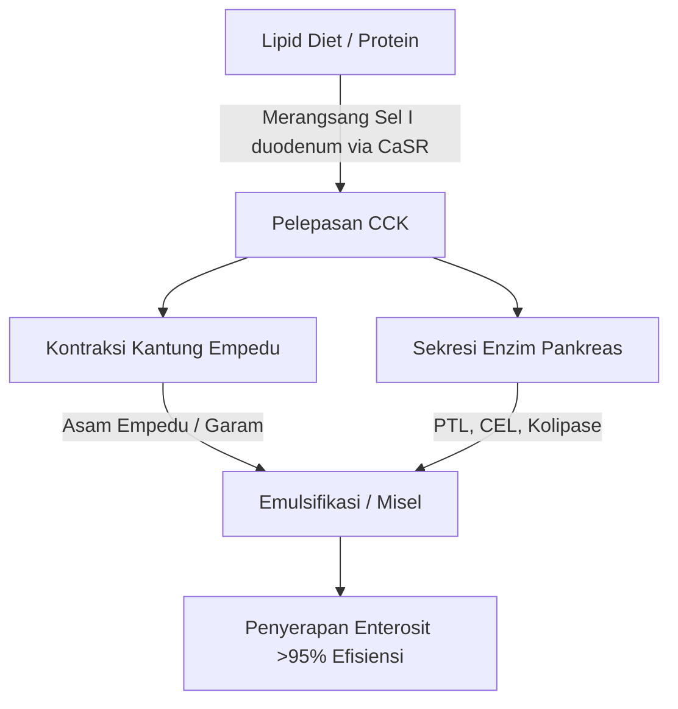
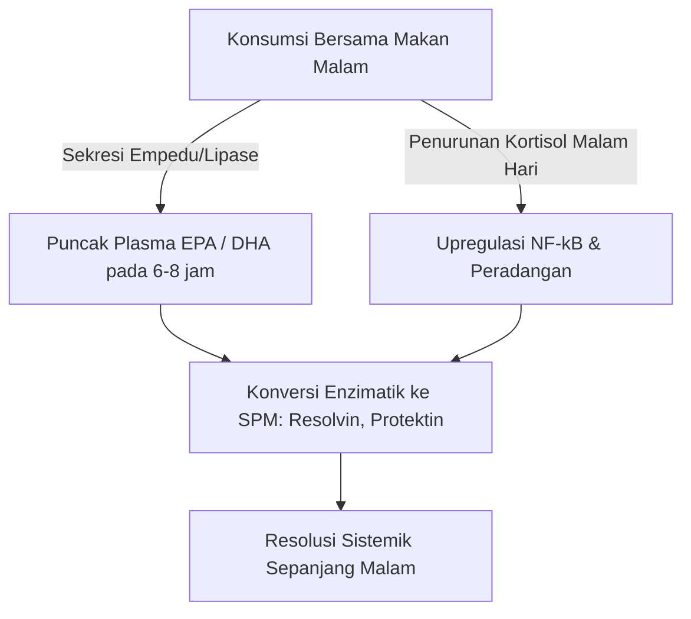

Kemanjuran terapeutik asam lemak tak jenuh ganda ($\text{PUFA}$) omega-3 laut rantai panjang, khususnya asam eikosapentaenoat ($\text{EPA}$) dan asam dokosaheksaenoat ($\text{DHA}$), sangat ditentukan oleh ketersediaan hayatinya di usus. Dalam nutrisi klinis, penyebab utama kegagalan terapi adalah "paradoks makanan tanpa lemak" (lean-meal paradox) — pemberian lipid laut yang sangat hidrofobik dalam keadaan puasa atau bersamaan dengan makanan bebas lemak. Meskipun asupan dosis nominalnya tinggi, kurangnya matriks pendamping lipid yang terstruktur mencegah mekanisme fisik dan enzimatik yang diperlukan untuk penyerapan lemak di lumen berair pada saluran pencernaan manusia. Analisis klinis ini merinci prinsip-prinsip biofisik, biokimia, dan kronofarmakologi yang mendikte pencernaan dan penyerapan $\text{EPA}$ dan $\text{DHA}$.

## Puasa dan Paradoks Makanan Tanpa Lemak

Saluran pencernaan pada dasarnya adalah sistem akuatik (berbasis air). Ketika lipid hidrofobik (penolak air) seperti minyak ikan standar tertelan, mereka menghadapi lingkungan jus lambung dan usus yang sangat polar. Menurut hukum termodinamika, molekul hidrofobik meminimalkan kontaknya dengan air, yang menyebabkan pemisahan fase yang cepat. Hal ini menyebabkan minyak yang tertelan menyatu menjadi gumpalan lipid besar yang tidak terbagi dan mengapung di atas kimus (chyme) lambung yang berair.

Menelan kapsul omega-3 dengan segelas air saat perut kosong, atau bersamaan dengan makanan yang hanya mengandung karbohidrat (seperti sepotong buah atau sepotong roti kering) gagal memicu proses fisiologis yang diperlukan untuk mengatasi pemisahan fase ini. Tanpa emulsifikasi fisik, rasio luas permukaan terhadap volume dari fase lipid tetap sangat rendah. Situs aktif hidrofilik dari lipase pankreas tidak dapat mengakses ikatan ester yang terkubur di dalam tetesan besar hidrofobik ini. Akibatnya, minum air bersama minyak ikan tidak membantu penyerapan; sebaliknya, hal itu mengencerkan jejak enzim pencernaan yang ada dalam keadaan puasa, menjauhkan gumpalan lipid yang tidak teremulsi dari membran brush border enterosit dan menyebabkan malabsorpsi serta ketidaknyamanan gastrointestinal.

Agar lipid yang sangat hidrofobik ini dapat melintasi lapisan air yang tidak teraduk (unstirred water layer) dari mukosa usus, mereka harus diubah menjadi fase yang terdispersi dalam air dan stabil secara termodinamika. Transformasi ini sepenuhnya bergantung pada kimia fisik dari miselisasi (micellarization), suatu proses yang diprakarsai oleh pensinyalan duodenum yang dimediasi hormon.

## Garam Empedu dan Pembentukan Misel

Transisi dari massa minyak hidrofobik yang mengapung menjadi tetesan mikro yang dapat diserap membutuhkan kaskade sekretori dan neuromuskular yang terkoordinasi di duodenum. Pendorong hormonal utama dari proses ini adalah kolesistokinin ($\text{CCK}$), peptida asam amino 33 yang disintesis dan disekresi oleh sel-I enteroendokrin di lapisan mukosa duodenum dan jejunum atas.



Di bawah kondisi fisiologis, keberadaan asam lemak rantai panjang dan protein yang dicerna sebagian di lumen duodenum merangsang reseptor penginderaan kalsium ($\text{CaSR}$) pada sel I, memicu eksositosis $\text{CCK}$ secara cepat ke dalam aliran darah. Setelah dilepaskan, $\text{CCK}$ mengikat reseptor $\text{CCK}_A$ pada dinding kantong empedu, menyebabkannya berkontraksi, sekaligus merelaksasi sfingter Oddi dan merangsang sel asinar pankreas untuk melepaskan enzim pencernaannya.

Asam empedu yang dilepaskan dari kantong empedu — terutama garam natrium amfipatik dari asam kolat dan kenodeoksikolat — adalah deterjen biologis yang penting. Ketika konsentrasi asam empedu di duodenum melebihi konsentrasi misel kritis ($\text{CMC}$), mereka mengatur diri di sekitar tetesan lipid hidrofobik. Inti steroid hidrofobik dari garam empedu berasosiasi dengan fase lipid, sementara gugus konjugat hidrofilik polar (glisin atau taurin) menghadap lumen duodenum berair.

Melalui aksi mekanis dari peristaltik usus, tetesan berlapis empedu ini dicukur menjadi misel campuran. Agregat koloid bola ini memiliki diameter hanya 3 hingga 10 nanometer, meningkatkan luas permukaan lipid yang terpapar lipase pankreas hingga beberapa ribu kali lipat. Tanpa konsumsi bersamaan dengan lemak makanan sehat (seperti minyak zaitun extra virgin, alpukat, atau kuning telur ayam kampung) untuk memicu ambang batas pelepasan $\text{CCK}$, kontraksi kantong empedu tidak terjadi. Dalam keadaan ini, kadar asam empedu tetap di bawah $\text{CMC}$, sekresi lipase pankreas minimal, dan lipid omega-3 yang tertelan tidak dapat membentuk misel, sehingga mencegah penyerapan.

## Pertarungan Bentuk Biokimia: TG vs. EE vs. PL

Suplemen omega-3 yang tersedia secara komersial ada dalam tiga bentuk molekul utama: trigliserida alami atau re-esterifikasi ($\text{TG}$/$\text{rTG}$), etil ester ($\text{EE}$), dan fosfolipid ($\text{PL}$). Struktur molekul dari pembawa ini menentukan laju pencernaannya, ketergantungan pada lipase, dan ketersediaan hayatinya.

```text
Bentuk Trigliserida (TG):          Bentuk Etil Ester (EE):        Bentuk Fosfolipid (PL):
     ┌─ Tulang Punggung Gliserol        ┌─ Molekul Etanol              ┌─ Kepala Fosfat (Polar)
     ├─ Asam Lemak (EPA)                └─ Asam Lemak (EPA)            ├─ Asam Lemak (EPA)
     ├─ Asam Lemak (DHA)                                               └─ Asam Lemak (DHA)
     └─ Asam Lemak (Lainnya)
```

Pada trigliserida alami dan re-esterifikasi ($\text{TG}$/$\text{rTG}$), tiga asam lemak ($\text{EPA}$/$\text{DHA}$) terikat pada tulang punggung gliserol tiga karbon. Selama pencernaan, lipase trigliserida pankreas ($\text{PTL}$), bertindak bersama dengan kofaktor kolipasenya, menghidrolisis ikatan ester pada posisi $sn\text{-}1$ dan $sn\text{-}3$. Ini menghasilkan dua asam lemak bebas dan satu $sn\text{-}2$-monogliserida, yang keduanya sangat polar, mudah dimiselisasi, dan mudah diserap oleh enterosit dengan efisiensi di atas 95%.

Sebaliknya, bentuk etil ester ($\text{EE}$) adalah produk sintetis yang dibuat selama konsentrasi kimia. Tulang punggung gliserol dihilangkan, dan setiap asam lemak individu di-esterifikasi menjadi molekul etanol ($\text{CH}_3\text{CH}_2\text{OH}$). Ikatan ester sintetis ini sangat tahan terhadap enzim pankreas manusia. Studi in-vitro dan in-vivo menunjukkan bahwa lipase pankreas manusia menghidrolisis ikatan asam lemak-etanol dalam $\text{EE}$ dengan laju yang 10 hingga 50 kali lebih lambat daripada ikatan gliseril ester dalam trigliserida.

Karena hidrolisis yang lambat ini, penyerapan $\text{EE}$ sangat bergantung pada pelepasan masif lipase pankreas dan garam empedu, yang hanya dipicu oleh makanan tinggi lemak. Ketika dikonsumsi dengan diet rendah lemak, ketersediaan lipase pankreas yang terbatas tidak dapat memecah ikatan $\text{EE}$ secara efisien, yang menyebabkan ketersediaan hayati yang buruk (sering turun hingga sekitar 20%) dan menyebabkan ester sintetis yang tidak terserap masuk ke usus besar, di mana mereka dapat menyebabkan efek samping gastrointestinal.

Bentuk fosfolipid ($\text{PL}$), terutama berasal dari minyak krill Antartika (Euphausia superba), menampilkan struktur amfipatik di mana $\text{EPA}$ dan $\text{DHA}$ terikat pada tulang punggung fosfatidilkolin. Gugus kepala fosfat yang sangat polar membuat fosfolipid secara alami dapat terdispersi dalam air. Karenanya, bentuk $\text{PL}$ dapat mengemulsi diri (self-emulsifying) dan membentuk tetesan mikro spontan di saluran pencernaan, melewati persyaratan mutlak untuk miselisasi yang dirangsang garam empedu. Fosfolipid juga dicerna melalui fosfolipase $\text{A}_2$ dan dapat diserap langsung oleh enterosit sebagai lisofosfolipid, menghasilkan ketersediaan hayati yang tinggi bahkan dalam kondisi puasa atau rendah lemak.

| Bentuk Biokimia | Pembawa Molekul / Tulang Punggung | Rata-rata Penyerapan (Makanan Rendah Lemak) | Rata-rata Penyerapan (Makanan Tinggi Lemak) | Ketersediaan Hayati Relatif (vs. Dasar EE) | Ketergantungan Lipase Pankreas |
| --- | --- | --- | --- | --- | --- |
| Etil Ester (EE) | Etanol ($\text{CH}_3\text{CH}_2\text{OH}$) | $\approx 20\%$ | $\approx 60\%$ | Dasar ($100\%$) | Mutlak; dihidrolisis 10-50x lebih lambat dari TG |
| Trigliserida (TG / rTG) | Tulang Punggung Gliserol | $\approx 68\%$ | $\approx 90\%$ | $124\%$ hingga $186\%$ | Tinggi; cepat dipecah menjadi 2-FFA dan 1-MAG |
| Fosfolipid (PL) | Fosfatidilkolin | $\approx 80\%$ hingga $95\%$ | $>95\%$ | $168\%$ hingga $500\%$ | Minimal; mengemulsi mandiri, memotong beberapa lipase |

> [!WARNING]
> Individu yang datang dengan insufisiensi pankreas eksokrin (EPI), diskinesia bilier, atau mereka pasca-kolesistektomi menunjukkan pencernaan lipid endogen yang sangat terganggu. Untuk populasi klinis ini, pemberian formulasi etil ester (EE) sintetis di bawah pembatasan diet rendah lemak menghadirkan risiko tinggi malabsorpsi lengkap dan ketidaknyamanan gastrointestinal, karena pembelahan enzimatik yang diperlukan hampir tidak ada pada kondisi ini.

## Oksidasi Lipid dan Kebutuhan Mutlak akan Vitamin E

Fitur struktural yang membuat $\text{EPA}$ dan $\text{DHA}$ aktif secara biologis juga membuatnya sangat tidak stabil. $\text{EPA}$ mengandung lima dan $\text{DHA}$ mengandung enam ikatan rangkap yang diselingi metilen. Ikatan karbon-hidrogen pada karbon metilen bis-alilik ($\text{-CH=CH-CH}_2\text{-CH=CH-}$) memiliki energi disosiasi ikatan yang rendah. Hal ini membuatnya sangat rentan terhadap serangan radikal bebas dan peroksidasi lipid non-enzimatik.

```text
Fase 1: Inisiasi
  [Ikatan Karbon-Hidrogen PUFA] + [ROS / Radikal Bebas] ──> [Radikal Lipid Berpusat Karbon (R•)]

Fase 2: Propagasi
  [Radikal Lipid Berpusat Karbon (R•)] + [O2] ──> [Radikal Peroksil Lipid (ROO•)]
  [Radikal Peroksil Lipid (ROO•)] + [PUFA Tidak Teroksidasi] ──> [Hidroperoksida Lipid (ROOH)] + [Radikal Lipid Baru (R•)]

Fase 3: Dekomposisi
  [Hidroperoksida Lipid Tidak Stabil (ROOH)] ──> [Aldehida Beracun (MDA / HHE)]
```

Setelah tertelan, minyak ikan terpapar lingkungan dengan suhu $37^\circ\text{C}$ (suhu tubuh), asam lambung, dan molekul oksigen terlarut ($\text{O}_2$). Lingkungan ini mempercepat kaskade peroksidasi lipid melalui tiga fase berbeda:

1. **Inisiasi:** Spesies oksigen reaktif ($\text{ROS}$) mengabstraksi atom hidrogen dari karbon bis-alilik, menghasilkan radikal lipid yang berpusat pada karbon ($\text{R}^\bullet$).
2. **Propagasi:** Radikal lipid bereaksi cepat dengan molekul oksigen ($\text{O}_2$) untuk membentuk radikal peroksil lipid ($\text{ROO}^\bullet$). Radikal peroksil ini kemudian mengabstraksi atom hidrogen dari molekul $\text{PUFA}$ yang berdekatan dan tidak teroksidasi, menghasilkan hidroperoksida lipid ($\text{ROOH}$) dan radikal lipid baru, yang melanggengkan reaksi berantai.
3. **Dekomposisi:** Hidroperoksida lipid yang tidak stabil terurai menjadi produk oksidasi sekunder yang sangat reaktif dan sitotoksik, termasuk alkenal seperti malondialdehid ($\text{MDA}$) dan 4-hidroksiheksenal ($\text{HHE}$).

Produk oksidasi sekunder ini mudah diserap melalui usus, dimasukkan ke dalam kilomikron dan lipoprotein densitas rendah ($\text{LDL}$), dan dapat menginduksi stres oksidatif sistemik, kerusakan endotel, dan aterogenesis.

Untuk menghentikan proses ini, diperlukan formulasi bersama dengan antioksidan pemecah rantai yang larut dalam lemak. Vitamin E alami, khususnya d-alfa-tokoferol ($\text{C}_{29}\text{H}_{50}\text{O}_2$), sangat dioptimalkan untuk peran ini. D-alfa-tokoferol bertindak sebagai donor hidrogen, dengan cepat mentransfer atom hidrogen fenoliknya ke radikal peroksil lipid reaktif ($\text{ROO}^\bullet$) dengan konstanta laju yang sangat cepat sekitar $10^6\,\text{M}^{-1}\text{s}^{-1}$.

Radikal tokoferoksil yang dihasilkan sangat stabil karena delokalisasi resonansi elektron tidak berpasangannya di seluruh cincin kromanol, mencegahnya menyerang rantai asam lemak di sekitarnya. Ini menghentikan reaksi berantai, melindungi integritas struktural molekul $\text{EPA}$ dan $\text{DHA}$ sehingga mereka dapat mencapai jaringan target dalam keadaan aktif dan tidak teroksidasi.

## Kronofarmakologi dan Jendela Anti-inflamasi Malam Hari

Dalam biokimia lipid, pengaturan waktu (timing) merupakan faktor penting. Mengonsumsi suplemen omega-3 bersamaan dengan makanan terbesar dan paling padat lipid dalam sehari (biasanya makan malam) mengoptimalkan penyerapan dan proses penyembuhan malam hari alami tubuh.



Pertama, makan malam secara historis adalah makanan paling berlemak hari itu bagi banyak orang. Ini memberikan volume fisik lipid yang diperlukan untuk memicu pelepasan $\text{CCK}$ maksimum, yang mengarah pada kontraksi kantong empedu yang kuat, sekresi empedu yang kaya, dan aktivitas lipase pankreas yang tinggi. Hal ini mengoptimalkan miselisasi dan kinetika pencernaan, memastikan bahwa hampir seluruh dosis yang tertelan berhasil diserap.

Kedua, pemberian malam hari sejalan dengan kekebalan sirkadian dan siklus inflamasi tubuh. Kadar kortisol endogen secara alami turun ke tingkat harian terendah pada larut malam dan awal malam. Kortisol adalah hormon anti-inflamasi yang kuat; ketika kadarnya turun, jalur inflamasi sistemik — seperti yang diatur oleh faktor transkripsi pro-inflamasi $\text{NF}\text{-}\kappa\text{B}$ — mengalami "upregulation" (peningkatan regulasi) relatif.

Dengan menelan omega-3 saat makan malam, konsentrasi plasma puncak dan membran sel dari $\text{EPA}$ dan $\text{DHA}$ tercapai 6 hingga 8 jam kemudian, bertepatan langsung dengan jendela inflamasi malam hari ini. Selama fase ini, tubuh menggunakan asam lemak ini sebagai substrat untuk sintesis enzimatik dari Mediator Pro-resolusi Khusus ($\text{SPM}$) — khususnya resolvin, protektin, dan maresin — melalui jalur siklooksigenase ($\text{COX}$) dan lipoksigenase ($\text{LOX}$). $\text{SPM}$ ini secara aktif mengatasi peradangan mikro kronis, mendorong pergantian sel, dan mendukung penyembuhan jaringan selama tidur.

Selain itu, pemberian omega-3 pada malam hari, khususnya $\text{DHA}$, memberikan manfaat neurologis yang unik. $\text{DHA}$ adalah lipid struktural utama dalam membran saraf dan memainkan peran penting dalam jam sirkadian otak. Ia bekerja pada gen jam (seperti BMAL1 dan CLOCK) yang bertanggung jawab untuk mengatur siklus tidur-bangun.

Integrasi malam hari dari $\text{DHA}$ ke dalam membran sinaptik mendukung komunikasi antar sel saraf, meningkatkan sintesis serotonin, dan mengoptimalkan perubahannya menjadi melatonin. Uji klinis menunjukkan bahwa suplemen omega-3 malam yang konsisten secara signifikan meningkatkan efisiensi tidur, mempersingkat latensi onset tidur, dan mengurangi indeks fragmentasi tidur (terbangun di malam hari).

> [!TIP]
> Untuk memaksimalkan penggabungan bio seluler dari asam lemak omega-3 rantai panjang, dokter harus merekomendasikan pasien untuk mengonsumsi dosis harian mereka bersamaan dengan makanan paling kaya lipid pada hari itu. Konsumsi bersama setidaknya 10-15 gram lemak tak jenuh tunggal atau tak jenuh ganda yang sehat (mis. Minyak zaitun extra-virgin atau alpukat) cukup untuk memicu ambang batas pelepasan kolesistokinin yang diperlukan untuk miselisasi optimal.

## Sintesis Klinis dan Rekomendasi yang Dapat Ditindaklanjuti

Memaksimalkan potensi terapeutik dari suplemen omega-3 membutuhkan pergeseran dari sekadar menelan kapsul dosis nominal tinggi menuju pendekatan berdasarkan biokimia lipid dan kinetika pencernaan. Praktik tradisional meminum minyak ikan dengan air saat perut kosong sering kali menyebabkan penyerapan yang buruk dan efek samping pencernaan.

Untuk hasil terapeutik yang optimal, dokter harus memprioritaskan formulasi trigliserida re-esterifikasi ($\text{rTG}$) atau fosfolipid ($\text{PL}$), yang menunjukkan kinetika penyerapan superior dan kurang bergantung pada makanan berlemak tinggi dibandingkan etil ester ($\text{EE}$) sintetis.

Terlepas dari formulasi yang dipilih, suplemen harus dikonsumsi bersama makanan yang mengandung setidaknya 10 hingga 15 gram lemak. Ambang batas lipid ini diperlukan untuk memicu kaskade pensinyalan $\text{CCK}$ duodenum, memicu kontraksi kantong empedu dan sekresi lipase pankreas untuk memungkinkan miselisasi lengkap.

Selain itu, untuk melindungi $\text{PUFA}$ yang sangat tidak stabil ini dari kerusakan oksidatif di dalam tubuh, formulasi harus selalu menyertakan antioksidan alami yang larut dalam lemak seperti d-alfa-tokoferol (Vitamin E).

Terakhir, menyelaraskan suplemen dengan makan malam memastikan bahwa puncak penyerapan bertepatan dengan perbaikan anti-inflamasi dan seluler nokturnal alami tubuh, memaksimalkan kardiovaskular, imunologi, dan neurologis dari $\text{EPA}$ dan $\text{DHA}$.

## Referensi

1. Nordøy A, et al. [Absorption of the n-3 eicosapentaenoic and docosahexaenoic acids as ethyl esters and triglycerides by humans](https://pubmed.ncbi.nlm.nih.gov/1826985/). *American Journal of Clinical Nutrition.* 1991.
2. Offman E, Marenco T, Ferber S, Johnson J, Kling D, Curcio D, Davidson M. [Steady-state bioavailability of prescription omega-3 on a low-fat diet is significantly improved with a free fatty acid formulation compared with an ethyl ester formulation: the ECLIPSE II study](https://pubmed.ncbi.nlm.nih.gov/24124374/). *Vascular Health and Risk Management.* 2013.
3. Schuchardt JP, Schneider I, Meyer H, Neubronner J, von Schacky C, Hahn A. [Incorporation of EPA and DHA into plasma phospholipids in response to different omega-3 fatty acid formulations - a comparative bioavailability study of fish oil vs. krill oil](https://pubmed.ncbi.nlm.nih.gov/21854650/). *Lipids in Health and Disease.* 2011.
4. Brown JE, Wahle KW. [Effect of fish-oil and vitamin E supplementation on lipid peroxidation and whole-blood aggregation in man](https://pubmed.ncbi.nlm.nih.gov/2282693/). *Clinica Chimica Acta.* 1990.

*Artikel ini disusun hanya untuk tujuan informasi dan bukan merupakan pengganti nasihat medis profesional. Konsultasikan dengan dokter atau tenaga kesehatan yang berkompeten sebelum mengubah rutinitas suplemen atau obat-obatan Anda.*
