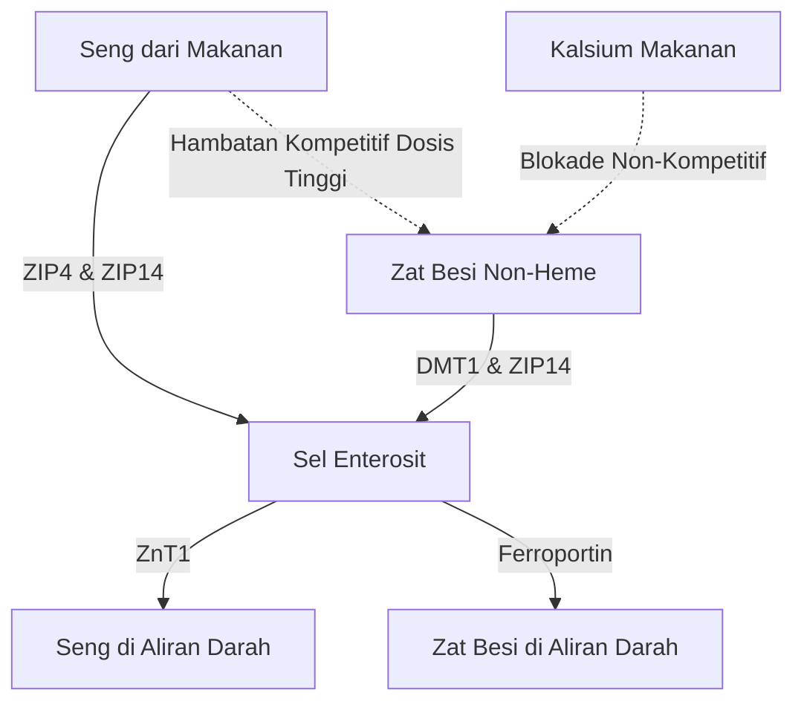

Pemberian suplemen seng ($\text{Zn}^{2+}$) menyajikan serangkaian paradoks fisiologis dan biokimia. Meskipun seng merupakan mineral esensial yang terlibat dalam lebih dari 300 reaksi enzimatik, pemberian oralnya sering terhambat oleh gangguan pencernaan akut, hambatan kompetitif oleh kation divalen lainnya, serta penipisan mineral sistemik. Menyelesaikan masalah ini memerlukan pemahaman terperinci tentang kinetika transporter usus, biokimia mukosa, dan kronofarmakologi untuk merancang protokol dosis yang optimal.

## Paradoks Perut Kosong: Iritasi Mukosa vs Bioavailabilitas

Seng yang diberikan secara oral menghadirkan pilihan yang sulit: konsumsi saat perut kosong memaksimalkan bioavailabilitas seluler tetapi sering menyebabkan gangguan pencernaan akut (mual parah). Sebaliknya, memberikan seng bersama makanan berhasil mengurangi ketidaknyamanan, tetapi memasukkan antagonis (penghambat) diet yang sangat mengurangi penyerapan.

### Mekanisme Molekuler Iritasi Lambung dan Mual
Menelan garam seng anorganik yang sangat larut dalam air—seperti seng sulfat ($\text{ZnSO}_4$) atau seng klorida ($\text{ZnCl}_2$)—menyebabkan pelarutan cepat di dalam lumen lambung. Dalam larutan air, garam ini terdisosiasi sepenuhnya, menghasilkan lingkungan lokal yang sangat terkonsentrasi dan asam dengan pH sekitar 4.0 hingga 5.0.

Dalam keadaan puasa, tidak adanya bolus makanan membuat mukosa lambung tidak memiliki penahan (buffer). Paparan tiba-tiba terhadap ion seng divalen bebas ($\text{Zn}^{2+}$) memberikan efek kaustik dan iritasi langsung pada sel epitel lambung. Iritasi lokal ini merangsang sel parietal lambung untuk mensekresi asam klorida (HCl) secara berlebihan, yang semakin menurunkan pH lambung dan memicu erosi mukosa.

Deteksi sensorik terhadap iritasi kimiawi dan asam ini dimediasi oleh jaringan luas neuron sensorik vagal yang mempersarafi dinding lambung. Setelah diaktifkan, neuron ini mengirimkan potensial aksi ke batang otak. Ini memicu refleks muntah (emetik), yang bermanifestasi sebagai mual segera, penundaan pengosongan lambung, dan kram perut dalam waktu 30 menit setelah konsumsi.

### Blokade Bioavailabilitas: Fitat, Biji-bijian, dan Susu

Ketika seng diminum bersama makanan untuk mencegah stimulasi vagal, bioavailabilitasnya sangat terganggu oleh penghambat diet. Penghambat paling kuat ini adalah **asam fitat** (fitat), yang sangat terkonsentrasi pada kulit luar biji-bijian yang belum disempurnakan, kacang-kacangan, dan biji-bijian.

Pada pH fisiologis duodenum, asam fitat bertindak sebagai ligan agresif yang mengikat (mengkelat) ion $\text{Zn}^{2+}$ bebas, membentuk endapan kompleks yang sangat stabil dan tidak larut, yang benar-benar kebal terhadap penyerapan usus. Karena manusia tidak memiliki enzim fitase di saluran cerna atas, kompleks seng-fitat ini tetap tidak terhidrolisis dan diekskresikan dalam tinja.

> [!CAUTION]
> Studi kuantitatif dengan penanda radioaktif menunjukkan bahwa menambahkan hanya 50 mg fitat ke dalam makanan mengurangi fraksi penyerapan seng sekitar 36% (turun dari dasar 22% menjadi 14%).

Selain itu, produk susu memberikan efek penghambatan yang independen. **Kasein**, fraksi protein utama dalam susu sapi, mengikat ion seng di lumen usus, secara signifikan mengurangi bioavailabilitasnya dibandingkan dengan isolat protein whey.

### Bentuk Senyawa Seng dan Toleransi

| Kelas Kimia | Bentuk Senyawa Seng | Perkiraan Absorpsi | Toleransi Lambung | Mekanisme Aksi |
| :--- | :--- | :--- | :--- | :--- |
| **Garam Anorganik** | Seng Sulfat ($\text{ZnSO}_4$) | ~20–49.9% | Iritasi Tinggi (~15% mual) | Terdisosiasi cepat; pH asam (4.0–5.0). |
| **Garam Organik** | Seng Glukonat | ~50.6–71.7% | Toleransi Menengah (~5% mual) | pH netral; disosiasi lambat meminimalkan iritasi. |
| **Kelat Organik**| Seng Bisglisinat | ~50–60% | Toleransi Sangat Tinggi (< 5% mual) | Terikat pada glisin; tahan terhadap disosiasi lambung dan fitat. |

### Protokol Dosis Optimal secara Ilmiah

Untuk menghindari refleks mual saat perut kosong dan blokade penyerapan fitat, protokol klinis khusus harus digunakan:

1. **Beralih ke Kelat Organik:** Gunakan kelat asam amino-logam organik dengan pH netral, seperti Seng Bisglisinat. Ion $\text{Zn}^{2+}$ terikat secara kovalen pada dua ligan glisin, melindungi mineral dari disosiasi prematur pada asam lambung.
2. **Makanan Penyangga Rendah Antagonis:** Jika perlu diminum dengan makanan, seng harus dikonsumsi secara eksklusif dengan camilan ringan yang sama sekali bebas dari fitat dan kalsium dosis tinggi. Makanan yang diperbolehkan termasuk roti sourdough putih (fermentasi memecah fitat) atau protein hewani sederhana (telur atau isolat whey).

> [!TIP]
> **Pro Tip:** Untuk memaksimalkan penyerapan tanpa rasa mual, protokol yang ideal adalah mengonsumsi 15–30 mg Seng Bisglisinat dengan camilan ringan bebas fitat pada awal sore, memastikan puasa 2 jam (termasuk kopi dan teh) sebelum dan sesudah konsumsi.

## Perang Transporter: DMT1 dan ZIP14

Enterosit (sel usus) di usus halus bertindak sebagai arena yang sangat kompetitif untuk penyerapan logam divalen. Seng ($\text{Zn}^{2+}$), zat besi non-heme ($\text{Fe}^{2+}$), dan kalsium ($\text{Ca}^{2+}$) berbagi jalur saturasi yang tumpang tindih. Ini berarti bahwa pemberian suplemen dosis tinggi secara bersamaan secara langsung menekan serapan masing-masing mineral.

### Lanskap Transporter: ZIP4, ZIP14, dan DMT1
Pada membran apikal enterosit duodenum, importir utama seng makanan adalah ZIP4. Zat besi non-heme (zat besi nabati/anorganik) bergantung pada jalur yang berbeda: DMT1. Namun, terdapat transporter penting lainnya, ZIP14; meskipun diklasifikasikan sebagai transporter seng, ia juga sangat mampu mengangkut zat besi ($\text{Fe}^{2+}$).

Ketika dosis zat besi terapeutik (tinggi) (100–400 mg) diberikan bersamaan dengan seng, zat besi akan mengalahkan seng dalam serapan seluler. Penelitian klinis menunjukkan bahwa mengonsumsi zat besi dosis tinggi bersamaan dengan dosis seng standar 25 mg akan mengurangi penyerapan seng sekitar 40–50%.

## Bahaya Penipisan Tembaga: Terjebak di Sel Usus

Bahaya utama dari suplementasi seng dosis tinggi jangka panjang adalah perkembangan defisiensi tembaga sistemik yang tersembunyi. Jalur ini dimediasi oleh peningkatan **metalotionein**—protein pengikat logam intraseluler di dalam enterosit.

Ketika seseorang mengonsumsi seng dosis tinggi (melebihi 40–50 mg/hari) untuk waktu yang lama, masuknya $\text{Zn}^{2+}$ seluler dalam jumlah besar bertindak sebagai sinyal kuat yang memicu sintesis metalotionein besar-besaran. 

Meskipun sintesis ini didorong oleh seng, protein ini memiliki afinitas pengikatan terhadap tembaga ($\text{Cu}^+$) yang jauh lebih tinggi daripada terhadap seng. Akibatnya, ketika tembaga dari makanan diserap, molekul metalotionein dengan cepat mengikat dan menyekuestrasi ion tembaga.

Tembaga ini terperangkap dan tidak dapat memasuki aliran darah. Karena sel-sel usus terkelupas dan diperbarui setiap 3 hingga 5 hari, tembaga yang terperangkap itu hilang di feses. Seiring waktu, blokade ini menyebabkan penipisan tembaga yang parah.

> [!WARNING]
> Mengonsumsi seng lebih dari 40 mg setiap hari tanpa keseimbangan tembaga yang sesuai dengan rasio 15:1 selama lebih dari empat minggu berturut-turut berisiko memicu defisiensi tembaga. Ini dapat menyebabkan rambut rontok, kerusakan saraf ireversibel, dan anemia.

### Rasio Seng-Tembaga yang Aman secara Klinis
Rasio seng-terhadap-tembaga yang aman dan sinergis secara klinis adalah **8:1 hingga 15:1**. Mengonsumsi 1 mg tembaga (misalnya tembaga glukonat) untuk setiap 15 mg seng menghilangkan bahaya ini sepenuhnya.

## Kronofarmakologi Seng: Irama Sirkadian dan Tidur

Waktu pemberian nutrisi sangat penting. Seng adalah kofaktor biokimia mendasar yang diperlukan untuk sintesis melatonin (hormon tidur). Ini menstabilkan enzim TPH dan AANAT. Kekurangan seng secara langsung menurunkan transkripsi AANAT, menyebabkan penurunan tajam melatonin malam hari (insomnia).

Selain itu, seng bertindak sebagai neuromodulator langsung di sistem saraf pusat. Selama eksitasi saraf, seng bertindak sebagai penghambat kuat reseptor glutamat NMDA, sekaligus meningkatkan efek penenang reseptor GABA. Tindakan ganda ini memfasilitasi transisi yang mulus menuju tidur gelombang lambat yang dalam.

### Protokol Dosis Optimal SuppTime

| Waktu | Tumpukan Suplemen (Stack) | Alasan Kronobiologis |
| :--- | :--- | :--- |
| **Pagi** | Probiotik | Volume asam lambung yang rendah saat bangun tidur memaksimalkan kelangsungan hidup bakteri. |
| **Sarapan** | Zat Besi Non-Heme, Vitamin C, Vitamin D3 | Vitamin C meningkatkan penyerapan zat besi. Hindari Kalsium dan Seng. |
| **Makan Siang / Sore**| Seng Bisglisinat (15–30 mg) + Tembaga (1–2 mg) | Diformulasikan dengan rasio 15:1 untuk mencegah penipisan tembaga; benar-benar terpisah dari zat besi dan kalsium. |
| **Malam** | Kalsium, Magnesium Glisinat | Magnesium merelaksasi otot dan memodulasi reseptor GABA sebelum tidur. |

## Referensi

1. Institute of Medicine (US) Panel on Micronutrients. [Zinc](https://www.ncbi.nlm.nih.gov/books/NBK222317/). *Dietary Reference Intakes for Vitamin A, Vitamin K, Arsenic, Boron, Chromium, Copper, Iodine, Iron, Manganese, Molybdenum, Nickel, Silicon, Vanadium, and Zinc.* National Academies Press, 2001.
2. National Institutes of Health, Office of Dietary Supplements. [Zinc - Health Professional Fact Sheet](https://ods.od.nih.gov/factsheets/Zinc-HealthProfessional/). *NIH Office of Dietary Supplements.* 2022.
3. Pérès JM, Bureau F, Neuville D, Arhan P, Bouglé D. [Inhibition of zinc absorption by iron depends on their ratio](https://pubmed.ncbi.nlm.nih.gov/11846013/). *Journal of Trace Elements in Medicine and Biology.* 2001.
4. Devarshi PP, Mao Q, Grant RW, Mitmesser SH. [Comparative Absorption and Bioavailability of Various Chemical Forms of Zinc in Humans: A Narrative Review](https://www.ncbi.nlm.nih.gov/pmc/articles/PMC11677333/). *Nutrients.* 2024.
5. Gupta N, Carmichael MF. [Zinc-Induced Copper Deficiency as a Rare Cause of Neurological Deficit and Anemia](https://www.ncbi.nlm.nih.gov/pmc/articles/PMC10510946/). *Cureus.* 2023.

*Artikel ini disusun hanya untuk tujuan informasi dan bukan merupakan pengganti nasihat medis profesional. Konsultasikan dengan dokter atau tenaga kesehatan yang berkompeten sebelum mengubah rutinitas suplemen atau obat-obatan Anda.*
