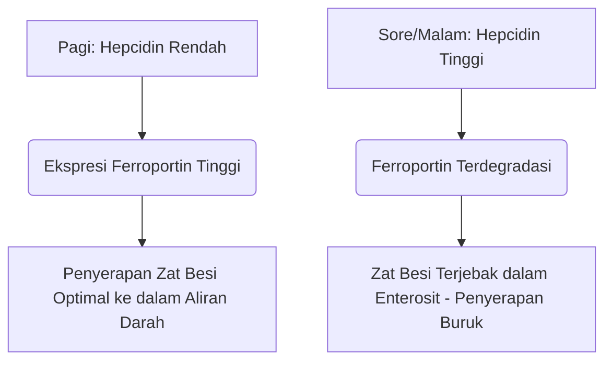

Zat besi adalah zat gizi mikro yang sangat diperlukan dan berfungsi sebagai kofaktor struktural dan katalitik dalam transportasi oksigen, respirasi seluler, dan sintesis DNA. Meskipun melimpah di lingkungan, zat besi sering kali menjadi nutrisi yang membatasi pertumbuhan dalam makanan manusia. Karena manusia tidak memiliki mekanisme fisiologis untuk ekskresi zat besi aktif, keseimbangan zat besi sistemik dipertahankan secara eksklusif pada tingkat penyerapan usus.

Zat besi dalam makanan terdapat dalam dua bentuk utama: zat besi **organik (heme)** dan zat besi **anorganik (non-heme)**.

Zat besi heme sangat tersedia secara hayati, biasanya diserap pada tingkat 15% hingga 35%. Zat besi ini diangkut secara utuh melintasi batas sikat apikal enterosit duodenum melalui Heme Carrier Protein 1 (HCP1) dan tetap terlindungi dari penghambat makanan standar.

Sebaliknya, zat besi non-heme (zat besi anorganik) mewakili lebih dari 80% asupan makanan tetapi menunjukkan profil penyerapan yang sangat terganggu, dengan tingkat penyerapan mulai dari hanya 2% hingga 20%.

> [!TIP]
> Pada pH fisiologis, zat besi non-heme sebagian besar berada dalam keadaan feri (Fe³⁺) yang teroksidasi dan sangat tidak larut. Agar dapat diserap, ia harus mengalami reduksi menjadi keadaan fero (Fe²⁺) yang larut oleh reduktase apikal duodenal sitokrom b (Dcytb), sebelum memasuki enterosit melalui Divalent Metal Transporter 1 (DMT1).

## Jalur Zat Besi Heme vs. Non-Heme

| Fitur / Metrik | Jalur Zat Besi Heme | Jalur Zat Besi Non-Heme (Anorganik) |
| :--- | :--- | :--- |
| **Sumber Makanan** | Jaringan hewan (hemoglobin, mioglobin) | Tumbuhan, makanan yang diperkaya zat besi, garam mineral |
| **Transporter Apikal** | Heme Carrier Protein 1 (HCP1) | Divalent Metal Transporter 1 (DMT1) |
| **Status Valensi yang Diperlukan** | Kompleks terikat porfirin | Fero (Fe²⁺) |
| **pH Luminal Optimal** | Sebagian besar stabil; tidak dipengaruhi oleh asam lambung | Membutuhkan keasaman tinggi (pH < 3.0) untuk kelarutan |
| **Efisiensi Penyerapan Khas**| 15% – 35% (ketersediaan hayati tinggi) | 2% – 20% (sangat bervariasi) |
| **Kepekaan terhadap Penghambat Makanan** | Dapat diabaikan; dilindungi oleh cincin porfirin | Sangat tinggi (dihambat oleh fitat, polifenol, kalsium) |

## Waktu Optimal (Kronofarmakologi)

Mengoptimalkan penyerapan zat besi non-heme memerlukan koordinasi yang tepat dengan kinetika diurnal **hepcidin**, hormon peptida 25 asam amino yang disintesis terutama oleh hepatosit. Hepcidin berfungsi sebagai pengatur sistemik utama homeostasis zat besi dengan mengikat langsung eksportir basolateral Ferroportin, yang memicu degradasinya. Akibatnya, peningkatan kadar hepcidin yang bersirkulasi menjebak zat besi di dalam enterosit duodenum dan mencegahnya masuk ke aliran darah.

### Osilasi Sirkadian Hepcidin
Di bawah kondisi fisiologis awal, konsentrasi hepcidin berada pada titik terendah pada pagi hari, terus meningkat sepanjang sore hingga mencapai puncaknya, dan menurun pada malam hari.

Kurva sirkadian ini berdampak langsung pada kinetika zat besi oral. **Pemberian pagi hari** suplemen zat besi memungkinkan mineral tersebut tiba di duodenum ketika ekspresi Ferroportin enterosit berada pada tingkat tertinggi. Sebaliknya, pemberian dosis pada sore atau malam hari memaksa zat besi untuk bersaing dengan blokade hepcidin yang meningkat, yang mengakibatkan penurunan penyerapan zat besi fraksional sebesar 37%.

### Dampak Keasaman Lambung
Keadaan biofisik zat besi anorganik sangat bergantung pada produksi asam lambung. Penekanan farmakologis asam lambung melalui Proton Pump Inhibitors (PPIs - obat maag) sangat mengganggu lingkungan mikro ini, meningkatkan pH lambung dan menyebabkan oksidasi cepat Fe²⁺ yang larut menjadi Fe³⁺ yang sangat tidak larut.

> [!WARNING]
> Suplemen zat besi oral harus diminum saat perut kosong — idealnya 1 jam sebelum atau 2 jam setelah makan — dan dipisahkan secara ketat dari obat penekan asam lambung apa pun.

## Interaksi Fatal (Apa yang JANGAN DIcampur)

Kemanjuran terapeutik zat besi oral mudah terganggu oleh konsumsi bersamaan dengan berbagai senyawa makanan dan agen farmasi.

### Kalsium
Kalsium, baik yang dikonsumsi sebagai produk susu dalam makanan (susu, keju, yogurt) atau sebagai suplemen mineral (kalsium karbonat), merupakan penghambat kuat penyerapan zat besi heme dan non-heme. Konsumsi bersamaan 500 mg kalsium karbonat dengan makanan yang mengandung zat besi mengurangi penyerapan zat besi fraksional hingga lebih dari 50%.

### Tanin dan Polifenol
Polifenol yang ditemukan dalam **teh hitam, teh hijau, teh herbal, dan kopi** adalah chelator zat besi yang sangat efektif. Senyawa turunan tumbuhan ini berkoordinasi dengan zat besi feri untuk membentuk kompleks organologam yang sangat stabil dan besar yang tidak dapat melintasi batas sikat duodenum. Menambahkan hanya secangkir kopi atau teh ke dalam makanan dapat menurunkan penyerapan zat besi non-heme sebesar 40% hingga 70%.

### Asam Fitat
Asam fitat adalah senyawa penyimpan fosfor utama dalam biji-bijian utuh, sereal, kacang-kacangan, dan kacang polong. Rasio molar asam fitat terhadap zat besi adalah faktor makanan tunggal yang paling penting yang membatasi ketersediaan hayati zat besi dalam makanan nabati.

### Seng dan Magnesium
Zat besi fero, seng, dan magnesium berbagi jalur transportasi yang tumpang tindih melintasi membran apikal enterosit (seperti DMT1). Pada dosis zat besi terapeutik, terjadi penghambatan kompetitif, yang secara signifikan menekan transportasi zat besi. Jangan meminum suplemen zat besi Anda bersamaan dengan Seng atau Magnesium.

### Obat Tiroid (Levotiroksin)
Pemberian bersamaan suplemen zat besi oral dengan levotiroksin (T4) menyebabkan interaksi obat-nutrisi yang parah. Zat besi berkoordinasi dengan molekul levotiroksin, membentuk kompleks tidak larut yang mengurangi ketersediaan hayati levotiroksin oral sebesar 20% hingga 64%.

> [!CAUTION]
> Untuk mencegah kegagalan klinis terapi tiroid Anda, harus ada jeda waktu pemisahan minimal yang ketat selama 4 jam antara pemberian levotiroksin dan zat besi.

## Kofaktor Utama: Vitamin C

Asam askorbat (Vitamin C) adalah penambah penyerapan zat besi non-heme yang paling kuat, yang mampu mengesampingkan efek penghambatan dari fitat, polifenol, dan kalsium dalam makanan.

Hubungan sinergis ini beroperasi melalui mekanisme biokimia ganda yang sangat efisien:
1. **Reduksi yang Menguntungkan Secara Termodinamika:** Asam askorbat dengan cepat mengubah ion feri yang tidak larut (Fe³⁺) menjadi bentuk fero yang sangat mudah larut (Fe²⁺), siap untuk diangkut.
2. **Kelasi Duodenal:** Asam askorbat bertindak sebagai perisai pelindung, mencegah zat besi berikatan dengan fitat dan polifenol saat bertransisi ke lingkungan basa di duodenum.

## Efek Samping & Paradigma Pemberian Dosis "Dua Hari Sekali"

Pendekatan tradisional untuk mengobati anemia defisiensi besi — meresepkan zat besi oral dosis tinggi setiap hari — sering kali gagal karena efek samping gastrointestinal yang parah (mual, sembelit) dan putaran umpan balik sistemik.

Karena penyerapan fraksional yang rendah, hingga 90% dari dosis zat besi oral standar tetap tidak terserap di saluran pencernaan. Kelebihan zat besi ini bereaksi dengan hidrogen peroksida untuk menghasilkan radikal hidroksil yang sangat beracun, memicu stres oksidatif dan peradangan mukosa.

Selanjutnya, suplemen zat besi harian dosis tinggi memicu **"Blok Mukosa" (Mucosal Block)** sistemik. Konsumsi dosis zat besi oral ≥ 60 mg menginduksi lonjakan hepcidin serum yang cepat yang tetap tinggi selama 24 jam. Jika dosis zat besi kedua diberikan pada hari berikutnya, enterosit secara fisik terhalang untuk mengekspornya ke sirkulasi portal. Zat besi terperangkap dan akhirnya diekskresikan.

> [!TIP]
> **Pemberian Dosis Dua Hari Sekali:** Untuk mengatasi blok yang dimediasi hepcidin ini, hematologi modern telah bergeser ke arah pemberian zat besi oral **dua hari sekali (setiap 48 jam)**. Uji klinis membuktikan bahwa meminum zat besi setiap 48 jam meningkatkan penyerapan zat besi fraksional sebesar 40% hingga 50% dibandingkan dengan dosis harian berturut-turut, sekaligus mengurangi efek samping gastrointestinal secara drastis.

### Ringkasan Protokol Klinis

*   **pH Lambung Rendah sangat Penting:** Minum zat besi saat perut kosong dengan air putih.
*   **Hindari Penghambat Makanan Utama:** Hindari meminum zat besi bersama kalsium, produk susu, kopi, atau teh.
*   **Pertahankan Jarak Obat yang Ketat:** Pisahkan zat besi dan levotiroksin setidaknya selama 4 jam.
*   **Manfaatkan Vitamin C:** Pemberian zat besi bersama Vitamin C meningkatkan penyerapan hingga 300%.
*   **Terapkan Dosis Dua Hari Sekali:** Berikan jarak pada dosis zat besi oral selama 48 jam untuk menghindari blok mukosa yang diinduksi hepcidin dan memaksimalkan penyerapan.

## Referensi

1. Stoffel NU, Zeder C, Brittenham GM, Moretti D, Zimmermann MB. [Iron absorption from oral iron supplements given on consecutive versus alternate days and as single morning doses versus twice-daily split dosing in iron-depleted women: two open-label, randomised controlled trials](https://pubmed.ncbi.nlm.nih.gov/29032957/). *Lancet Haematol.* 2017.
2. Campbell NR, Hasinoff BB. [Ferrous sulfate reduces thyroxine efficacy in patients with hypothyroidism](https://pubmed.ncbi.nlm.nih.gov/1443969/). *Ann Intern Med.* 1992.
3. Hallberg L, Hulthén L. [Effect of ascorbic acid intake on nonheme-iron absorption from a complete diet](https://pubmed.ncbi.nlm.nih.gov/11124756/). *Am J Clin Nutr.* 2000.
4. Lönnerdal B. [Calcium and iron absorption—mechanisms and public health relevance](https://pubmed.ncbi.nlm.nih.gov/21462112/). *Int J Vitam Nutr Res.* 2010.

*Artikel ini disusun hanya untuk tujuan informasi dan bukan merupakan pengganti nasihat medis profesional. Konsultasikan dengan dokter atau tenaga kesehatan yang berkompeten sebelum mengubah rutinitas suplemen atau obat-obatan Anda.*
