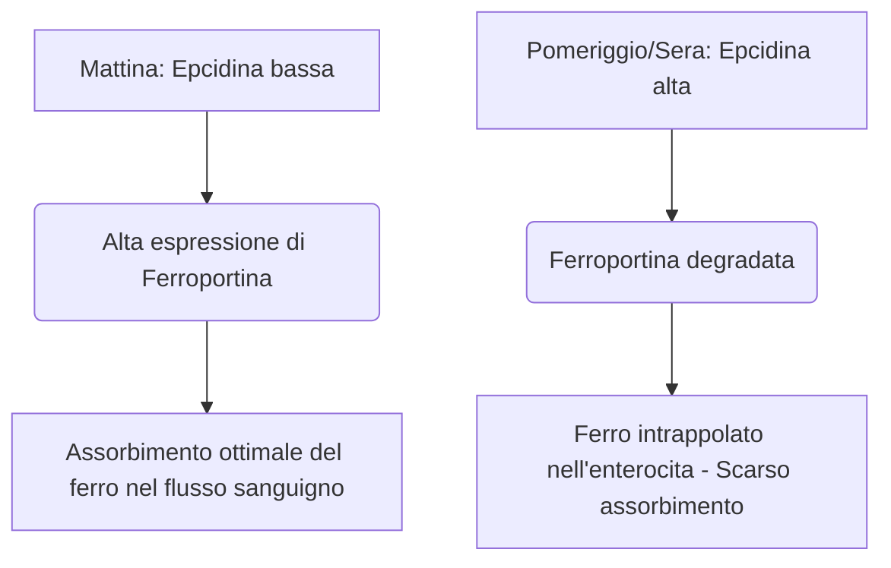

Il ferro è un micronutriente indispensabile che funge da cofattore strutturale e catalitico nel trasporto dell'ossigeno, nella respirazione cellulare e nella sintesi del DNA. Nonostante la sua abbondanza nell'ambiente, il ferro è frequentemente un nutriente limitante la crescita nella dieta umana. Poiché gli esseri umani non possiedono alcun meccanismo fisiologico per l'escrezione attiva del ferro, l'equilibrio sistemico del ferro è mantenuto esclusivamente a livello dell'assorbimento intestinale.

Il ferro alimentare si presenta in due forme primarie: ferro **organico (eme)** e **inorganico (non-eme)**.

Il ferro eme è altamente biodisponibile, tipicamente assorbito a tassi compresi tra il 15% e il 35%. Viene trasportato intatto attraverso l'orletto a spazzola apicale degli enterociti duodenali tramite la Proteina Trasportatrice dell'Eme 1 (HCP1) e rimane protetto dagli inibitori dietetici standard.

Al contrario, il ferro non-eme (ferro inorganico) rappresenta oltre l'80% dell'assunzione dietetica ma mostra un profilo di assorbimento altamente compromesso, con tassi di assorbimento che vanno da un mero 2% al 20%.

> [!TIP]
> A pH fisiologico, il ferro non-eme esiste prevalentemente nel suo stato ferrico (Fe³⁺) ossidato e altamente insolubile. Per essere assorbito, deve subire una riduzione allo stato ferroso (Fe²⁺) solubile dalla reduttasi apicale citocromo b duodenale (Dcytb), prima di entrare nell'enterocita tramite il Trasportatore di Metalli Divalenti 1 (DMT1).

## Vie del Ferro Eme vs. Non-Eme

| Caratteristica / Metrica | Via del Ferro Eme | Via del Ferro Non-Eme (Inorganico) |
| :--- | :--- | :--- |
| **Fonti Alimentari** | Tessuti animali (emoglobina, mioglobina) | Piante, alimenti fortificati con ferro, sali minerali |
| **Trasportatore Apicale** | Proteina Trasportatrice dell'Eme 1 (HCP1) | Trasportatore di Metalli Divalenti 1 (DMT1) |
| **Stato di Valenza Richiesto** | Complesso legato alla porfirina | Ferroso (Fe²⁺) |
| **pH Luminale Ottimale** | Ampiamente stabile; non influenzato dall'acido gastrico | Richiede alta acidità (pH < 3.0) per la solubilizzazione |
| **Efficacia Tipica di Assorbimento**| 15% – 35% (alta biodisponibilità) | 2% – 20% (altamente variabile) |
| **Sensibilità agli Inibitori** | Trascurabile; protetto dall'anello porfirinico | Estremamente alta (inibito da fitati, polifenoli, calcio) |

## Tempismo Ottimale (Cronofarmacologia)

L'ottimizzazione dell'assorbimento del ferro non-eme richiede una precisa coordinazione con la cinetica diurna dell'**epcidina** (Hepcidin), un ormone peptidico di 25 amminoacidi sintetizzato principalmente dagli epatociti. L'epcidina funziona come il regolatore sistemico principale dell'omeostasi del ferro legandosi direttamente all'esportatore basolaterale Ferroportina, inducendone la degradazione. Di conseguenza, livelli elevati di epcidina circolante intrappolano il ferro all'interno degli enterociti duodenali e ne impediscono l'ingresso nel flusso sanguigno.

### Oscillazioni Circadiane dell'Epcidina
In condizioni fisiologiche di base, le concentrazioni di epcidina sono al loro minimo al mattino presto, aumentano costantemente nel corso del pomeriggio fino a un picco e diminuiscono durante la notte.

Questa curva circadiana ha un impatto diretto sulla cinetica del ferro orale. La **somministrazione mattutina** di integratori di ferro consente al minerale di arrivare al duodeno quando l'espressione della Ferroportina enterocitaria è al suo massimo. Al contrario, il dosaggio pomeridiano o serale costringe il ferro a competere con un elevato blocco dell'epcidina, con una conseguente riduzione del 37% dell'assorbimento frazionario del ferro.

### L'Impatto dell'Acidità Gastrica
Lo stato biofisico del ferro inorganico dipende fortemente dalla produzione di acido gastrico. La soppressione farmacologica dell'acido gastrico tramite Inibitori della Pompa Protonica (IPP - gastroprotettori) altera gravemente questo microambiente, innalzando il pH gastrico e causando la rapida ossidazione del Fe²⁺ solubile nel Fe³⁺ altamente insolubile.

> [!WARNING]
> Gli integratori orali di ferro devono essere assunti obbligatoriamente a stomaco vuoto — idealmente 1 ora prima o 2 ore dopo un pasto — e rigorosamente separati da qualsiasi farmaco soppressore dell'acidità.

## Le Interazioni Fatali (Cosa NON Mescolare)

L'efficacia terapeutica del ferro orale è facilmente compromessa dall'ingestione concomitante con vari composti dietetici e agenti farmaceutici.

### Calcio
Il calcio, sia esso ingerito come latticini (latte, formaggio, yogurt) o come integratori minerali (carbonato di calcio), è un potente inibitore dell'assorbimento del ferro sia eme che non-eme. La co-ingestione di 500 mg di carbonato di calcio con un pasto contenente ferro riduce l'assorbimento frazionario del ferro di oltre il 50%.

### Tannini e Polifenoli
I polifenoli presenti nel **tè nero, tè verde, tisane e caffè** sono chelanti del ferro eccezionalmente efficaci. Questi composti di derivazione vegetale si coordinano con il ferro ferrico per formare complessi organometallici grandi e altamente stabili che non possono attraversare l'orletto a spazzola duodenale. L'aggiunta di una sola tazza di caffè o tè a un pasto può diminuire l'assorbimento del ferro non-eme dal 40% al 70%.

### Acido Fitico
L'acido fitico è il principale composto di stoccaggio del fosforo nei cereali integrali, nella frutta secca e nei legumi. Il rapporto molare acido fitico-ferro è il singolo fattore dietetico più importante che limita la biodisponibilità del ferro nelle diete a base vegetale.

### Zinco e Magnesio
Ferro ferroso, zinco e magnesio condividono vie di trasporto sovrapposte attraverso la membrana apicale dell'enterocita (come il DMT1). A dosi terapeutiche di ferro, si verifica un'inibizione competitiva che sopprime significativamente il trasporto del ferro. Non assumere il tuo integratore di ferro insieme a Zinco o Magnesio.

### Farmaci per la Tiroide (Levotiroxina)
La co-somministrazione di integratori orali di ferro con la levotiroxina (T4) porta a una grave interazione farmaco-nutriente. Il ferro si coordina con la molecola di levotiroxina, formando un complesso insolubile che riduce la biodisponibilità orale della levotiroxina dal 20% al 64%.

> [!CAUTION]
> Per prevenire il fallimento clinico della terapia tiroidea, deve esserci una rigorosa finestra di separazione minima di 4 ore tra la somministrazione di levotiroxina e quella di ferro.

## Il Cofattore Definitivo: Vitamina C

L'acido ascorbico (Vitamina C) è il più potente esaltatore dell'assorbimento del ferro non-eme, capace di annullare gli effetti inibitori di fitati, polifenoli e calcio dietetici.

Questa relazione sinergica opera attraverso un doppio meccanismo biochimico altamente efficiente:
1. **Riduzione Termodinamicamente Favorevole:** L'acido ascorbico converte rapidamente gli ioni ferrici (Fe³⁺) insolubili nella forma ferrosa (Fe²⁺) altamente solubile, pronta per il trasporto.
2. **Chelazione Duodenale:** L'acido ascorbico agisce come uno scudo protettivo, impedendo al ferro di legarsi a fitati e polifenoli durante il suo passaggio nell'ambiente alcalino del duodeno.

## Effetti Collaterali e il Paradigma del Dosaggio a Giorni Alterni

L'approccio tradizionale al trattamento dell'anemia da carenza di ferro — prescrivere alte dosi di ferro orale quotidianamente — fallisce frequentemente a causa di gravi effetti collaterali gastrointestinali (nausea, stitichezza) e di circuiti di feedback sistemici.

A causa del basso assorbimento frazionario, fino al 90% di una dose standard di ferro orale rimane inassorbita nel tratto gastrointestinale. Questo ferro in eccesso reagisce con il perossido di idrogeno per generare radicali idrossilici altamente tossici, innescando stress ossidativo e infiammazione della mucosa.

Inoltre, integratori giornalieri di ferro ad alte dosi innescano un **"Blocco Mucosale" (Mucosal Block)** sistemico. L'ingestione di una dose di ferro orale ≥ 60 mg induce un rapido picco di epcidina sierica che rimane elevato per 24 ore. Se una seconda dose di ferro viene somministrata il giorno successivo, gli enterociti sono fisicamente bloccati dall'esportarlo nella circolazione portale. Il ferro rimane intrappolato e viene infine escreto.

> [!TIP]
> **Dosaggio a Giorni Alterni:** Per aggirare questo blocco mediato dall'epcidina, l'ematologia moderna si è spostata verso la somministrazione di ferro orale **a giorni alterni**. Gli studi clinici dimostrano che assumere ferro ogni 48 ore aumenta l'assorbimento frazionario del ferro dal 40% al 50% rispetto al dosaggio giornaliero consecutivo, riducendo drasticamente gli effetti collaterali gastrointestinali.

### Riepilogo dei Protocolli Clinici

*   **Un Basso pH Gastrico è Essenziale:** Assumere il ferro a stomaco vuoto con acqua.
*   **Evitare i Principali Inibitori Alimentari:** Evitare rigorosamente di assumere ferro insieme a calcio, latticini, caffè o tè.
*   **Mantenere una Rigorosa Distanza tra i Farmaci:** Separare il ferro dalla levotiroxina di almeno 4 ore.
*   **Sfruttare la Vitamina C:** La co-somministrazione di ferro con Vitamina C aumenta l'assorbimento fino al 300%.
*   **Adottare il Dosaggio a Giorni Alterni:** Distanziare le dosi di ferro orale di 48 ore per evitare il blocco mucosale indotto dall'epcidina e massimizzare l'assorbimento.

## Riferimenti

1. Stoffel NU, Zeder C, Brittenham GM, Moretti D, Zimmermann MB. [Iron absorption from oral iron supplements given on consecutive versus alternate days and as single morning doses versus twice-daily split dosing in iron-depleted women: two open-label, randomised controlled trials](https://pubmed.ncbi.nlm.nih.gov/29032957/). *Lancet Haematol.* 2017.
2. Campbell NR, Hasinoff BB. [Ferrous sulfate reduces thyroxine efficacy in patients with hypothyroidism](https://pubmed.ncbi.nlm.nih.gov/1443969/). *Ann Intern Med.* 1992.
3. Hallberg L, Hulthén L. [Effect of ascorbic acid intake on nonheme-iron absorption from a complete diet](https://pubmed.ncbi.nlm.nih.gov/11124756/). *Am J Clin Nutr.* 2000.
4. Lönnerdal B. [Calcium and iron absorption—mechanisms and public health relevance](https://pubmed.ncbi.nlm.nih.gov/21462112/). *Int J Vitam Nutr Res.* 2010.

*Questo articolo ha solo scopo informativo e non costituisce un parere medico. Consulta un professionista sanitario qualificato prima di modificare la tua routine di integratori o farmaci.*
