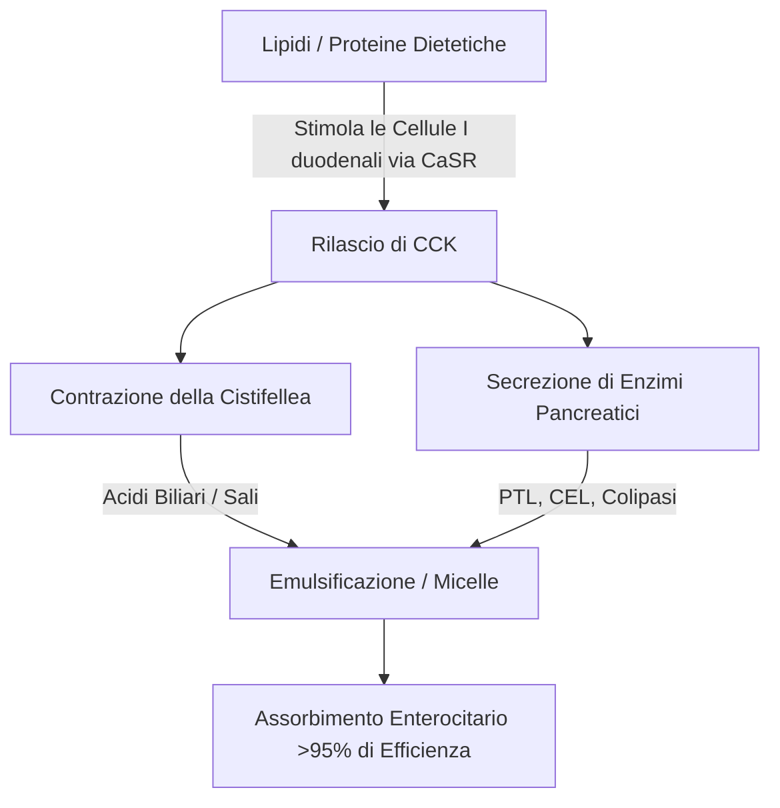
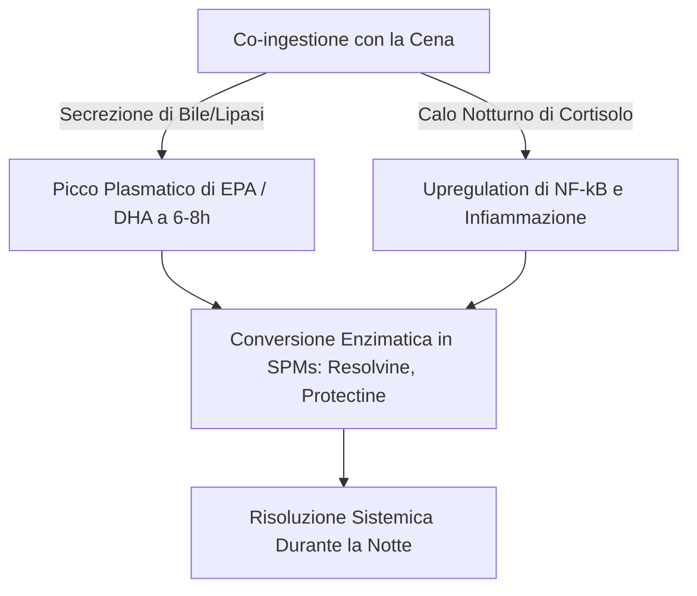

L'efficacia terapeutica degli acidi grassi polinsaturi ($\text{PUFA}$) omega-3 marini a catena lunga, in particolare l'acido eicosapentaenoico ($\text{EPA}$) e l'acido docosaesaenoico ($\text{DHA}$), è strettamente regolata dalla loro biodisponibilità intestinale. Nella nutrizione clinica, una delle principali fonti di fallimento terapeutico è il "paradosso del pasto magro" (lean-meal paradox): la somministrazione di lipidi marini altamente idrofobici a digiuno o insieme a pasti privi di grassi. Nonostante l'assunzione di alte dosi nominali, la mancanza di una matrice strutturata di co-ingestione lipidica impedisce i meccanismi fisici ed enzimatici necessari per l'assorbimento dei lipidi nel lume acquoso del tratto gastrointestinale umano. Questa analisi clinica descrive i principi biofisici, biochimici e cronofarmacologici che determinano la digestione e l'assorbimento di $\text{EPA}$ e $\text{DHA}$.

## Il Digiuno e il Paradosso del Pasto Magro

Il tratto gastrointestinale è fondamentalmente un sistema acquoso. Quando vengono ingeriti lipidi idrofobici come gli oli di pesce standard, incontrano l'ambiente altamente polare dei succhi gastrici e intestinali. Secondo le leggi della termodinamica, le molecole idrofobiche minimizzano il loro contatto con l'acqua, portando a una rapida separazione di fase. Ciò fa sì che l'olio ingerito si unisca in grandi globuli lipidici non divisi che galleggiano sulla parte superiore del chimo gastrico acquoso.

L'assunzione di una capsula di omega-3 con un bicchiere d'acqua a stomaco vuoto o insieme a un pasto a base di soli carboidrati (come un frutto o una fetta di pane secco) non innesca i processi fisiologici necessari per superare questa separazione di fase. Senza emulsificazione fisica, il rapporto superficie-volume della fase lipidica rimane estremamente basso. I siti attivi idrofili delle lipasi pancreatiche non possono accedere ai legami esterei sepolti all'interno di queste grandi gocce idrofobiche. Di conseguenza, bere acqua insieme all'olio di pesce non favorisce l'assorbimento; invece, diluisce gli scarsi enzimi digestivi presenti a digiuno, allontanando i globuli lipidici non emulsionati dalla membrana a orletto a spazzola dell'enterocita e portando a malassorbimento e disturbi gastrointestinali.

Affinché questi lipidi altamente idrofobici attraversino lo strato d'acqua non agitato (unstirred water layer) della mucosa intestinale, devono essere convertiti in una fase disperdibile in acqua termodinamicamente stabile. Questa trasformazione dipende interamente dalla chimica fisica della micellizzazione, un processo avviato dalla segnalazione duodenale mediata dagli ormoni.

## Sali Biliari e Formazione di Micelle

La transizione da una massa galleggiante di olio idrofobico a microgocce assorbibili richiede una cascata secretoria e neuromuscolare coordinata nel duodeno. Il principale motore ormonale di questo processo è la colecistochinina ($\text{CCK}$), un peptide di 33 amminoacidi sintetizzato e secreto dalle cellule I enteroendocrine nel rivestimento mucoso del duodeno e del digiuno superiore.



In condizioni fisiologiche, la presenza di acidi grassi a catena lunga e proteine parzialmente digerite nel lume duodenale stimola il recettore sensibile al calcio ($\text{CaSR}$) sulle cellule I, innescando la rapida esocitosi della $\text{CCK}$ nel flusso sanguigno. Una volta rilasciata, la $\text{CCK}$ si lega ai recettori $\text{CCK}_A$ sulla parete della cistifellea, causandone la contrazione, rilassando contemporaneamente lo sfintere di Oddi e stimolando le cellule acinari pancreatiche a rilasciare i loro enzimi digestivi.

Gli acidi biliari rilasciati dalla cistifellea (principalmente sali sodici anfipatici degli acidi colico e chenodesossicolico) sono detergenti biologici essenziali. Quando le concentrazioni di acidi biliari nel duodeno superano la concentrazione micellare critica ($\text{CMC}$), si dispongono attorno alle gocce lipidiche idrofobiche. Il nucleo steroideo idrofobico del sale biliare si associa alla fase lipidica, mentre il gruppo coniugato polare e idrofilo (glicina o taurina) si rivolge verso il lume duodenale acquoso.

Attraverso l'azione meccanica della peristalsi intestinale, queste gocce rivestite di bile vengono spezzate in micelle miste. Questi aggregati colloidali sferici hanno un diametro di soli 3-10 nanometri, aumentando di svariate migliaia di volte l'area della superficie lipidica esposta alle lipasi pancreatiche. Senza la co-ingestione di grassi alimentari sani (come olio extravergine di oliva, avocado o tuorli d'uovo allevati all'aperto) per innescare la soglia di rilascio di $\text{CCK}$, la contrazione della cistifellea non si verifica. In questo stato, i livelli di acidi biliari rimangono al di sotto della $\text{CMC}$, la secrezione di lipasi pancreatica è minima e i lipidi omega-3 ingeriti non possono formare micelle, impedendone l'assorbimento.

## Battaglia delle Forme Biochimiche: TG vs. EE vs. PL

Gli integratori di omega-3 disponibili in commercio esistono in tre forme molecolari primarie: trigliceridi naturali o riesterificati ($\text{TG}$/$\text{rTG}$), esteri etilici ($\text{EE}$) e fosfolipidi ($\text{PL}$). La struttura molecolare di questi vettori determina la loro velocità di digestione, la dipendenza dalla lipasi e la biodisponibilità.

```text
Forma Trigliceride (TG):           Forma Estere Etilico (EE):     Forma Fosfolipide (PL):
     ┌─ Scheletro di Glicerolo          ┌─ Molecola di Etanolo         ┌─ Testa di Fosfato (Polare)
     ├─ Acido Grasso (EPA)              └─ Acido Grasso (EPA)          ├─ Acido Grasso (EPA)
     ├─ Acido Grasso (DHA)                                             └─ Acido Grasso (DHA)
     └─ Acido Grasso (Altro)
```

Nei trigliceridi naturali e riesterificati ($\text{TG}$/$\text{rTG}$), tre acidi grassi ($\text{EPA}$/$\text{DHA}$) sono legati a uno scheletro di glicerolo a tre atomi di carbonio. Durante la digestione, la lipasi trigliceridica pancreatica ($\text{PTL}$), agendo insieme al suo cofattore colipasi, idrolizza i legami esterei nelle posizioni $sn\text{-}1$ e $sn\text{-}3$. Questo produce due acidi grassi liberi e un $sn\text{-}2$-monogliceride, entrambi altamente polari, facilmente micellizzabili e prontamente assorbiti dagli enterociti con un'efficienza superiore al 95%.

Al contrario, la forma di estere etilico ($\text{EE}$) è un prodotto sintetico creato durante la concentrazione chimica. Lo scheletro di glicerolo viene rimosso e ogni singolo acido grasso viene esterificato a una molecola di etanolo ($\text{CH}_3\text{CH}_2\text{OH}$). Questo legame estere sintetico è altamente resistente agli enzimi pancreatici umani. Studi in vitro e in vivo mostrano che la lipasi pancreatica umana idrolizza il legame acido grasso-etanolo negli $\text{EE}$ a una velocità da 10 a 50 volte più lenta rispetto ai legami gliceril-estere nei trigliceridi.

A causa di questa idrolisi lenta, l'assorbimento degli $\text{EE}$ dipende fortemente da un massiccio rilascio di lipasi pancreatiche e sali biliari, che è innescato solo da un pasto ricco di grassi. Quando assunta con una dieta a basso contenuto di grassi, la limitata lipasi pancreatica disponibile non può scindere in modo efficiente i legami $\text{EE}$, portando a una scarsa biodisponibilità (che spesso scende a circa il 20%) e causando il passaggio di esteri sintetici non assorbiti nel colon, dove possono causare effetti collaterali gastrointestinali.

La forma di fosfolipide ($\text{PL}$), derivata principalmente dall'olio di krill antartico (Euphausia superba), presenta una struttura anfipatica in cui $\text{EPA}$ e $\text{DHA}$ sono legati a uno scheletro di fosfatidilcolina. Il gruppo di testa fosfato altamente polare rende i fosfolipidi naturalmente disperdibili in acqua. Per questo motivo, le forme $\text{PL}$ possono auto-emulsionarsi e formare microgocce spontanee nel tratto gastrointestinale, bypassando il requisito assoluto della micellizzazione stimolata dai sali biliari. I fosfolipidi vengono anche digeriti tramite la fosfolipasi $\text{A}_2$ e possono essere assorbiti direttamente dagli enterociti come lisofosfolipidi, con conseguente elevata biodisponibilità anche in condizioni di digiuno o a basso contenuto di grassi.

| Forma Biochimica | Vettore Molecolare / Scheletro | Tasso di Assorbimento Medio (Pasto Magro) | Tasso di Assorbimento Medio (Pasto Grasso) | Biodisponibilità Relativa (vs. Base EE) | Dipendenza dalla Lipasi Pancreatica |
| --- | --- | --- | --- | --- | --- |
| Estere Etilico (EE) | Etanolo ($\text{CH}_3\text{CH}_2\text{OH}$) | $\approx 20\%$ | $\approx 60\%$ | Base ($100\%$) | Assoluta; idrolizzato 10-50x più lentamente rispetto ai TG |
| Trigliceride (TG / rTG) | Scheletro di Glicerolo | $\approx 68\%$ | $\approx 90\%$ | dal $124\%$ al $186\%$ | Alta; rapidamente scisso in 2-FFA e 1-MAG |
| Fosfolipide (PL) | Fosfatidilcolina | $\approx 80\%$ al $95\%$ | $>95\%$ | dal $168\%$ al $500\%$ | Minima; auto-emulsionante, bypassa alcune lipasi |

> [!WARNING]
> Gli individui che presentano insufficienza pancreatica esocrina (EPI), discinesia biliare o quelli post-colecistectomia mostrano una digestione lipidica endogena gravemente compromessa. Per queste popolazioni cliniche, la somministrazione di formulazioni sintetiche di esteri etilici (EE) in regime di restrizione di grassi alimentari rappresenta un alto rischio di malassorbimento completo e disturbi gastrointestinali, poiché la necessaria scissione enzimatica è virtualmente inesistente in questi stati.

## Ossidazione Lipidica e la Necessità Assoluta di Vitamina E

Le caratteristiche strutturali che rendono l'$\text{EPA}$ e il $\text{DHA}$ biologicamente attivi li rendono anche altamente instabili. L'$\text{EPA}$ contiene cinque e il $\text{DHA}$ contiene sei doppi legami interrotti da metilene. I legami carbonio-idrogeno sui carboni metilenici bis-allilici ($\text{-CH=CH-CH}_2\text{-CH=CH-}$) hanno basse energie di dissociazione del legame. Questo li rende eccezionalmente vulnerabili all'attacco dei radicali liberi e alla perossidazione lipidica non enzimatica.

```text
Fase 1: Iniziazione
  [Legame Carbonio-Idrogeno PUFA] + [ROS / Radicali Liberi] ──> [Radicale Lipidico Centrato sul Carbonio (R•)]

Fase 2: Propagazione
  [Radicale Lipidico Centrato sul Carbonio (R•)] + [O2] ──> [Radicale Perossilico Lipidico (ROO•)]
  [Radicale Perossilico Lipidico (ROO•)] + [PUFA Non Ossidato] ──> [Idroperossido Lipidico (ROOH)] + [Nuovo Radicale Lipidico (R•)]

Fase 3: Decomposizione
  [Idroperossido Lipidico Instabile (ROOH)] ──> [Aldeidi Tossiche (MDA / HHE)]
```

Una volta ingerito, l'olio di pesce è esposto a un ambiente di $37^\circ\text{C}$ (temperatura corporea), acidi gastrici e ossigeno molecolare disciolto ($\text{O}_2$). Questo ambiente accelera la cascata di perossidazione lipidica attraverso tre fasi distinte:

1. **Iniziazione:** Una specie reattiva dell'ossigeno ($\text{ROS}$) astrae un atomo di idrogeno da un carbonio bis-allilico, generando un radicale lipidico centrato sul carbonio ($\text{R}^\bullet$).
2. **Propagazione:** Il radicale lipidico reagisce rapidamente con l'ossigeno molecolare ($\text{O}_2$) per formare un radicale perossilico lipidico ($\text{ROO}^\bullet$). Questo radicale perossilico astrae quindi un atomo di idrogeno da una molecola adiacente di $\text{PUFA}$ non ossidato, generando un idroperossido lipidico ($\text{ROOH}$) e un nuovo radicale lipidico, perpetuando la reazione a catena.
3. **Decomposizione:** Gli idroperossidi lipidici instabili si decompongono in prodotti di ossidazione secondaria altamente reattivi e citotossici, compresi gli alchenali come la malondialdeide ($\text{MDA}$) e il 4-idrossiesenale ($\text{HHE}$).

Questi prodotti di ossidazione secondaria sono facilmente assorbiti attraverso l'intestino, incorporati nei chilomicroni e nelle lipoproteine a bassa densità ($\text{LDL}$), e possono indurre stress ossidativo sistemico, danno endoteliale e aterogenesi.

Per arrestare questo processo, è richiesta la co-formulazione di un antiossidante liposolubile che spezza la catena. La vitamina E naturale, in particolare il d-alfa-tocoferolo ($\text{C}_{29}\text{H}_{50}\text{O}_2$), è altamente ottimizzata per questo ruolo. Il d-alfa-tocoferolo agisce come un donatore di idrogeno, trasferendo rapidamente il suo atomo di idrogeno fenolico al radicale perossilico lipidico reattivo ($\text{ROO}^\bullet$) con una costante di velocità estremamente rapida di circa $10^6\,\text{M}^{-1}\text{s}^{-1}$.

Il radicale tocoferossilico risultante è altamente stabile a causa della delocalizzazione per risonanza del suo elettrone spaiato attraverso l'anello cromanolico, impedendogli di attaccare catene di acidi grassi adiacenti. Ciò arresta la reazione a catena, proteggendo l'integrità strutturale delle molecole di $\text{EPA}$ e $\text{DHA}$ in modo che possano raggiungere i tessuti bersaglio nel loro stato attivo e non ossidato.

## Cronofarmacologia e la Finestra Antinfiammatoria Notturna

Nella biochimica dei lipidi, il tempismo (timing) è un fattore critico. Ingerire integratori di omega-3 insieme al pasto più abbondante e più denso di lipidi della giornata (in genere la cena) ottimizza sia l'assorbimento che i naturali processi di guarigione notturna del corpo.



In primo luogo, la cena è storicamente il pasto che contiene più grassi della giornata per molti individui. Ciò fornisce il volume fisico dei lipidi necessario per innescare il massimo rilascio di $\text{CCK}$, portando a una robusta contrazione della cistifellea, a una ricca secrezione biliare e a un'elevata attività della lipasi pancreatica. Questo ottimizza la micellizzazione e la cinetica digestiva, assicurando che quasi l'intera dose ingerita venga assorbita con successo.

In secondo luogo, la somministrazione serale si allinea con i cicli immunitari e infiammatori circadiani del corpo. I livelli di cortisolo endogeno scendono naturalmente ai loro livelli diurni più bassi in tarda serata e all'inizio della notte. Il cortisolo è un potente ormone antinfiammatorio; quando i suoi livelli scendono, le vie infiammatorie sistemiche — come quelle governate dal fattore di trascrizione pro-infiammatorio $\text{NF}\text{-}\kappa\text{B}$ — subiscono una relativa "up-regulation" (sovraregolazione).

Ingerendo omega-3 a cena, le concentrazioni plasmatiche massime e della membrana cellulare di $\text{EPA}$ e $\text{DHA}$ vengono raggiunte da 6 a 8 ore dopo, in coincidenza diretta con questa finestra infiammatoria notturna. Durante questa fase, il corpo utilizza questi acidi grassi come substrati per la sintesi enzimatica di Mediatori Pro-risolventi Specializzati ($\text{SPM}$)—in particolare resolvine, protectine e maresine—attraverso i percorsi della cicloossigenasi ($\text{COX}$) e della lipossigenasi ($\text{LOX}$). Questi $\text{SPM}$ risolvono attivamente la micro-infiammazione cronica, promuovono il rinnovamento cellulare e supportano la guarigione dei tessuti durante il sonno.

Inoltre, la somministrazione serale di omega-3, in particolare $\text{DHA}$, fornisce vantaggi neurologici unici. Il $\text{DHA}$ è un lipide strutturale chiave nelle membrane neuronali e svolge un ruolo importante nell'orologio circadiano del cervello. Agisce sui geni dell'orologio (come BMAL1 e CLOCK) responsabili della regolazione del ciclo sonno-veglia.

L'integrazione notturna del $\text{DHA}$ nelle membrane sinaptiche supporta la comunicazione neuronale, migliora la sintesi della serotonina e ottimizza la sua conversione in melatonina. Studi clinici dimostrano che un'integrazione serale coerente di omega-3 migliora significativamente l'efficienza del sonno, abbrevia la latenza dell'inizio del sonno e riduce l'indice di frammentazione del sonno (risvegli notturni).

> [!TIP]
> Per massimizzare la bio-incorporazione cellulare degli acidi grassi omega-3 a catena lunga, i medici dovrebbero raccomandare ai pazienti di assumere la dose giornaliera insieme al pasto più denso di lipidi della giornata. La co-ingestione con almeno 10-15 grammi di grassi sani monoinsaturi o polinsaturi (es. olio extravergine di oliva o avocado) è sufficiente per innescare la soglia di rilascio della colecistochinina necessaria per una micellizzazione ottimale.

## Sintesi Cliniche e Raccomandazioni Pratiche

Massimizzare il potenziale terapeutico dell'integrazione di omega-3 richiede l'abbandono della semplice ingestione di capsule ad alte dosi nominali verso un approccio basato sulla biochimica dei lipidi e sulla cinetica digestiva. La pratica tradizionale di prendere olio di pesce con acqua a stomaco vuoto porta spesso a scarso assorbimento ed effetti collaterali gastrointestinali.

Per ottenere risultati terapeutici ottimali, i clinici dovrebbero dare la priorità alle formulazioni di trigliceridi riesterificati ($\text{rTG}$) o fosfolipidi ($\text{PL}$), che mostrano una cinetica di assorbimento superiore e sono meno dipendenti da pasti ricchi di grassi rispetto agli esteri etilici sintetici ($\text{EE}$).

Indipendentemente dalla formulazione scelta, l'integratore deve essere assunto insieme a un pasto contenente almeno 10-15 grammi di grassi alimentari. Questa soglia lipidica è necessaria per innescare la cascata di segnalazione della $\text{CCK}$ duodenale, iniziando la contrazione della cistifellea e la secrezione di lipasi pancreatica per consentire una completa micellizzazione.

Inoltre, per proteggere questi $\text{PUFA}$ altamente instabili dai danni ossidativi all'interno del corpo, la formulazione dovrebbe sempre includere un antiossidante naturale liposolubile come il d-alfa-tocoferolo (Vitamina E).

Infine, allineare l'integrazione con il pasto serale assicura che l'assorbimento massimo coincida con i percorsi naturali di riparazione cellulare e antinfiammatoria notturna del corpo, massimizzando i benefici cardiovascolari, immunologici e neurologici di $\text{EPA}$ e $\text{DHA}$.
