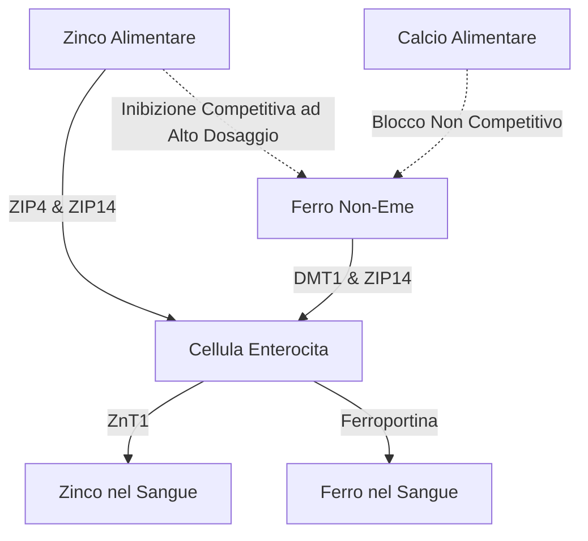

La somministrazione di integratori di zinco ($\text{Zn}^{2+}$) presenta una serie di paradossi fisiologici e biochimici. Sebbene lo zinco sia un minerale essenziale coinvolto in oltre 300 reazioni enzimatiche, la sua somministrazione orale è spesso ostacolata da disturbi gastrointestinali acuti, inibizione competitiva da parte di altri cationi divalenti e deplezione minerale sistemica. Risolvere questi problemi richiede una comprensione dettagliata della cinetica dei trasportatori intestinali, della biochimica delle mucose e della cronofarmacologia per progettare protocolli di dosaggio ottimali.

## Il Paradosso dello Stomaco Vuoto: Irritazione della Mucosa vs. Biodisponibilità

Lo zinco somministrato per via orale presenta una scelta difficile: l'ingestione a stomaco vuoto massimizza la biodisponibilità cellulare ma spesso causa gravi disturbi gastrointestinali (nausea). Al contrario, l'assunzione di zinco durante i pasti mitiga con successo il disagio, ma introduce antagonisti (inibitori) alimentari che riducono drasticamente l'assorbimento frazionato.

### Meccanismi Molecolari dell'Irritazione Gastrica e Nausea
L'ingestione di sali inorganici di zinco altamente idrosolubili, come il solfato di zinco ($\text{ZnSO}_4$) o il cloruro di zinco ($\text{ZnCl}_2$), porta a una rapida dissoluzione nel lume gastrico. In soluzioni acquose, questi sali si dissociano completamente, generando un ambiente localizzato altamente concentrato e acido con un pH di circa 4.0 - 5.0.

A stomaco vuoto, l'assenza di un bolo alimentare lascia la mucosa gastrica priva di tamponi. L'improvvisa esposizione agli ioni di zinco divalenti liberi ($\text{Zn}^{2+}$) esercita un effetto caustico e irritante diretto sulle cellule epiteliali gastriche. Questa irritazione localizzata stimola le cellule parietali gastriche a ipersecreare acido cloridrico (HCl), abbassando ulteriormente il pH gastrico e inducendo l'erosione della mucosa.

Il rilevamento sensoriale di questo insulto chimico e acido è mediato dall'estesa rete di neuroni sensoriali vagali che innervano la parete dello stomaco. Una volta attivati, questi neuroni trasmettono potenziali d'azione lungo il nervo vago fino al tronco encefalico. Questo avvia un riflesso emetico (vomito) mediato centralmente, che si manifesta come nausea immediata, svuotamento gastrico ritardato e spasmi allo stomaco entro 30 minuti dall'ingestione.

### Il Blocco della Biodisponibilità: Fitati, Cereali e Latticini

Quando lo zinco viene assunto con il cibo per prevenire la stimolazione vagale, la sua biodisponibilità è gravemente compromessa dagli inibitori alimentari. Il più potente di questi inibitori è l'**acido fitico** (fitato), che è altamente concentrato nella crusca dei cereali non raffinati, nei legumi, nelle noci e nei semi.

Al pH fisiologico del duodeno, l'acido fitico agisce come un legante aggressivo che chela (cattura) gli ioni $\text{Zn}^{2+}$ liberi, formando precipitati di coordinazione altamente stabili, insolubili e strutturalmente complessi che sono completamente resistenti all'assorbimento intestinale. Poiché gli esseri umani non possiedono enzimi fitasici endogeni nel tratto gastrointestinale superiore, questi complessi zinco-fitato non vengono idrolizzati e sono escreti nelle feci.

> [!CAUTION]
> Studi quantitativi con radiomarcatori dimostrano che l'aggiunta di soli 50 mg di fitato a un pasto riduce l'assorbimento frazionato dello zinco di circa il 36% (scendendo da un 22% basale al 14%). Concentrazioni più elevate di fitato (250 mg) sopprimono completamente l'assorbimento fino a un trascurabile 6–7%.

Inoltre, i prodotti lattiero-caseari esercitano un effetto inibitorio indipendente. La **caseina**, la principale proteina del latte vaccino, si lega agli ioni di zinco nel lume intestinale, riducendo significativamente la biodisponibilità rispetto alle proteine del siero del latte (whey).

### Forme dei Composti di Zinco e Tollerabilità

| Classe Chimica | Forma del Composto di Zinco | Assorbimento Frazionato | Tollerabilità Gastrica | Meccanismo d'Azione |
| :--- | :--- | :--- | :--- | :--- |
| **Sale Inorganico** | Solfato di Zinco ($\text{ZnSO}_4$) | ~20–49.9% | Alta Irritazione (~15% nausea) | Si dissocia rapidamente in $\text{Zn}^{2+}$; pH acido (4.0–5.0). |
| **Sale Organico** | Gluconato di Zinco | ~50.6–71.7% | Media Tollerabilità (~5% nausea) | pH neutro (5.5–7.0); lenta dissociazione. |
| **Chelato Organico**| Bisglicinato di Zinco | ~50–60% | Alta Tollerabilità (< 5% nausea) | Legato alla glicina; resiste alla dissociazione gastrica. |
| **Chelato Organico**| Picolinato di Zinco | Alta (Superiore a lungo termine) | Alta Tollerabilità | Complessato con acido picolinico; eccellente accumulo nei tessuti. |

### Protocollo di Aggiramento Scientificamente Ottimale

Per aggirare completamente sia il riflesso della nausea a stomaco vuoto sia il blocco dell'assorbimento dei fitati, si deve utilizzare un protocollo specifico:

1. **Passaggio ai Chelati Organici:** Sostituire i sali di zinco inorganici con chelati metallo-amminoacidici a pH neutro, come il Bisglicinato di Zinco. Nel Bisglicinato di Zinco, lo ione $\text{Zn}^{2+}$ è legato covalentemente a due ligandi di glicina, proteggendo il minerale dalla dissociazione prematura.
2. **Utilizzare Vie di Assorbimento Alternative:** A differenza dello zinco inorganico, che si basa su trasportatori dipendenti dal pH, i chelati organici vengono assorbiti intatti attraverso vie alternative altamente efficienti (cotrasportatori peptidici).
3. **Pasti Tampone a Basso Contenuto di Antagonisti:** Se un paziente è estremamente sensibile e richiede cibo, lo zinco dovrebbe essere assunto esclusivamente con uno spuntino privo di fitati e di calcio ad alte dosi. Gli alimenti consentiti includono pane bianco a lievitazione naturale (la fermentazione scinde i fitati) o proteine animali (uova o siero del latte).

> [!TIP]
> **Pro Tip:** Per massimizzare l'assorbimento evitando la nausea, il protocollo ideale è assumere 15–30 mg di Bisglicinato di Zinco elementare con uno spuntino leggero privo di fitati nel primo pomeriggio, assicurando un digiuno di 2 ore (inclusi caffè e tè) prima e dopo l'ingestione.

## La Guerra dei Trasportatori: DMT1 e ZIP14

L'enterocita dell'intestino tenue agisce come un'arena altamente competitiva per l'assorbimento dei metalli divalenti. Zinco ($\text{Zn}^{2+}$), ferro non-eme ($\text{Fe}^{2+}$) e calcio ($\text{Ca}^{2+}$) condividono vie di assorbimento sovrapponibili e saturabili. Ciò significa che la co-somministrazione di integratori ad alto dosaggio sopprime l'assorbimento di ciascun minerale.

### Il Panorama dei Trasportatori: ZIP4, ZIP14 e DMT1
Nella membrana apicale degli enterociti duodenali, il principale importatore per lo zinco alimentare è lo ZIP4. Il ferro non-eme (inorganico) fa affidamento su un percorso diverso: il trasportatore DMT1. Tuttavia, un altro trasportatore, lo ZIP14, sebbene classificato come trasportatore di zinco, è anche in grado di trasportare ferro.

Poiché $\text{Zn}^{2+}$ e $\text{Fe}^{2+}$ sono simili per carica e raggio ionico, competono intensamente per le vie di trasporto. Quando dosi terapeutiche di ferro (100–400 mg) vengono co-somministrate con lo zinco, il ferro supera lo zinco nell'assorbimento cellulare. La ricerca dimostra che assumere ferro e 25 mg di zinco contemporaneamente riduce l'assorbimento dello zinco di circa il 40-50%.

## Il Pericolo di Deplezione del Rame

Un grave rischio della supplementazione a lungo termine e ad alto dosaggio di zinco è lo sviluppo di una carenza sistemica di rame. Questa via è mediata dalla sovraregolazione della **metallotioneina**, una proteina intracellulare che lega i metalli all'interno degli enterociti.

Quando un individuo assume una dose elevata di zinco (spesso superiore a 40–50 mg/giorno) per un periodo prolungato, ciò innesca una massiccia sintesi di metallotioneina. Sebbene la sintesi sia guidata dallo zinco, la proteina ha un'affinità termodinamica per il rame ($\text{Cu}^+$) sostanzialmente superiore.

Quando il rame entra nell'enterocita, le abbondanti molecole di metallotioneina lo sequestrano. Il rame rimane intrappolato nell'enterocita e, quando le cellule intestinali si rinnovano ogni 3-5 giorni, viene escreto nelle feci. Nel tempo, questo porta a una profonda carenza di rame.

> [!WARNING]
> L'integrazione con dosi giornaliere di zinco superiori a 40 mg senza un corrispondente equilibrio di rame in rapporto 15:1 per più di quattro settimane consecutive rischia di innescare una grave carenza di rame, che può causare caduta dei capelli, danni neurologici irreversibili e anemia.

### Rapporto di Dosaggio Zinco-Rame
Il rapporto di zinco-rame clinico sicuro e sinergico è da **8:1 a 15:1**. Assumere 1 mg di rame (es. gluconato di rame) ogni 15 mg di zinco elimina questo pericolo.

## Cronofarmacologia dello Zinco: Sonno e Ritmo Circadiano

I tempi di somministrazione sono determinanti. Lo zinco è un cofattore essenziale per la sintesi della melatonina (ormone del sonno), stabilizzando gli enzimi TPH e AANAT. Una carenza di zinco blocca l'AANAT, causando un calo della melatonina notturna (insonnia).

Inoltre, lo zinco agisce come neuromodulatore diretto, funzionando come antagonista del recettore stimolante NMDA e contemporaneamente come modulatore positivo dei recettori calmanti GABA. Questa doppia azione facilita la transizione verso il sonno profondo a onde lente (Slow-Wave Sleep).

### Protocollo di Dosaggio Ottimizzato SuppTime

| Fascia Oraria | Combinazione Integratori | Motivazione Cronobiologica |
| :--- | :--- | :--- |
| **Mattina** | Probiotici | Il basso volume di acido gastrico massimizza la sopravvivenza batterica. |
| **Colazione** | Ferro Non-Eme, Vitamina C, Vitamina D3 | La vitamina C migliora l'assorbimento del ferro. Evitare Calcio e Zinco. |
| **Pranzo / Pomeriggio**| Bisglicinato di Zinco (15–30 mg) + Rame (1–2 mg) | Formulato in rapporto 15:1 per evitare la deplezione di rame; separato da ferro e calcio. |
| **Sera** | Calcio, Magnesio Glicinato | Il magnesio rilassa il sistema muscolare e modula i recettori GABA prima di dormire. |

## Riferimenti

1. Institute of Medicine (US) Panel on Micronutrients. [Zinc](https://www.ncbi.nlm.nih.gov/books/NBK222317/). *Dietary Reference Intakes for Vitamin A, Vitamin K, Arsenic, Boron, Chromium, Copper, Iodine, Iron, Manganese, Molybdenum, Nickel, Silicon, Vanadium, and Zinc.* National Academies Press, 2001.
2. National Institutes of Health, Office of Dietary Supplements. [Zinc - Health Professional Fact Sheet](https://ods.od.nih.gov/factsheets/Zinc-HealthProfessional/). *NIH Office of Dietary Supplements.* 2022.
3. Pérès JM, Bureau F, Neuville D, Arhan P, Bouglé D. [Inhibition of zinc absorption by iron depends on their ratio](https://pubmed.ncbi.nlm.nih.gov/11846013/). *Journal of Trace Elements in Medicine and Biology.* 2001.
4. Devarshi PP, Mao Q, Grant RW, Mitmesser SH. [Comparative Absorption and Bioavailability of Various Chemical Forms of Zinc in Humans: A Narrative Review](https://www.ncbi.nlm.nih.gov/pmc/articles/PMC11677333/). *Nutrients.* 2024.
5. Gupta N, Carmichael MF. [Zinc-Induced Copper Deficiency as a Rare Cause of Neurological Deficit and Anemia](https://www.ncbi.nlm.nih.gov/pmc/articles/PMC10510946/). *Cureus.* 2023.

*Questo articolo ha solo scopo informativo e non costituisce un parere medico. Consulta un professionista sanitario qualificato prima di modificare la tua routine di integratori o farmaci.*
