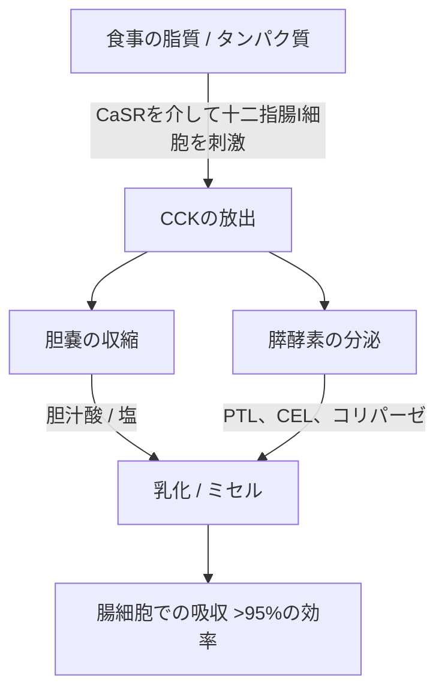
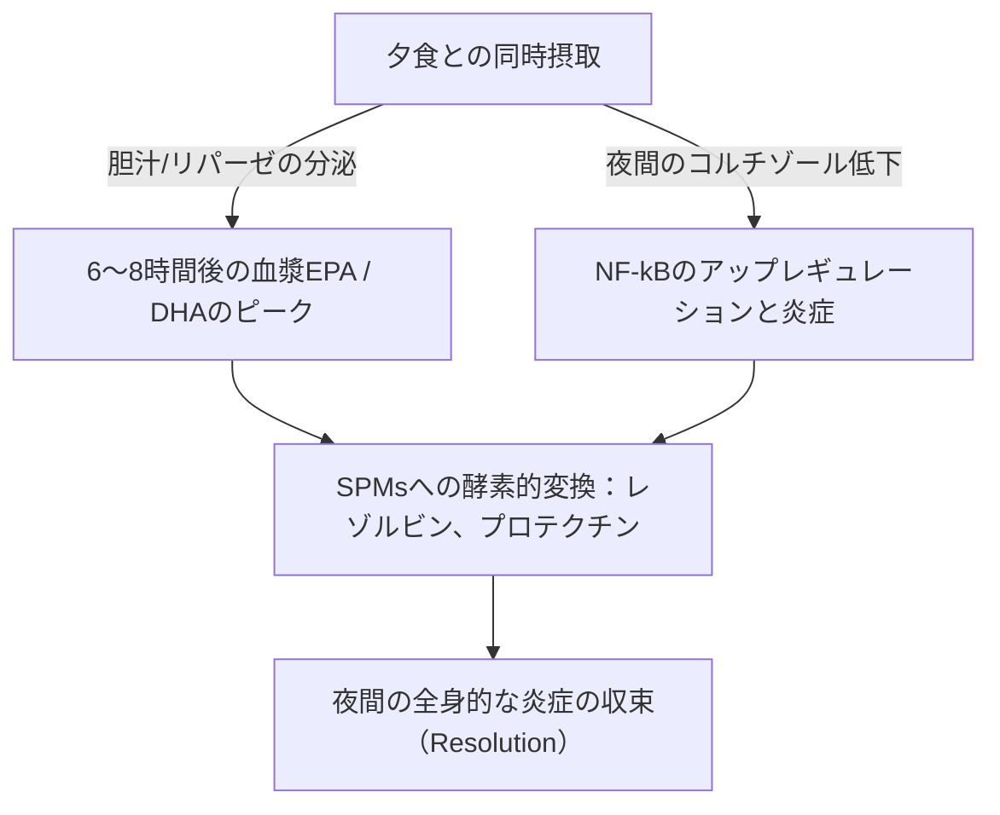

長鎖海産オメガ3多価不飽和脂肪酸（$\text{PUFA}$）、特にエイコサペンタエン酸（$\text{EPA}$）とドコサヘキサエン酸（$\text{DHA}$）の治療効果は、腸内での生物学的利用能（バイオアベイラビリティ）によって厳密に左右されます。臨床栄養学において、治療失敗の主な原因の一つは「低脂肪食のパラドックス（lean-meal paradox）」です。これは、空腹時や無脂肪の食事と一緒に、疎水性の高い海産脂質を投与してしまうことです。名目上は高用量を摂取していても、構造化された脂質共摂取マトリックスがないと、ヒトの消化管の水性内腔における脂質吸収に必要な物理的・酵素的メカニズムが働きません。この臨床分析では、$\text{EPA}$と$\text{DHA}$の消化と吸収を決定づける生物物理学的、生化学的、時間薬理学的な原理について詳しく説明します。

## 空腹と低脂肪食のパラドックス

胃腸管は根本的に水ベース（水性）のシステムです。標準的なフィッシュオイルなどの疎水性（水をはじく）脂質が摂取されると、胃液や腸液の非常に極性の高い環境に遭遇します。熱力学の法則に従い、疎水性分子は水との接触を最小限に抑えようとするため、急速な相分離が起こります。これにより、摂取したオイルは合体して大きく分割されていない脂質小滴となり、水性の胃糜汁（びじゅう）の上に浮かびます。

空腹時にコップ1杯の水と一緒にオメガ3カプセルを飲み込んだり、炭水化物のみの食事（フルーツ1切れや乾いたパン1切れなど）と一緒に摂取したりしても、この相分離を克服するために必要な生理学的プロセスは引き起こされません。物理的な乳化（エマルジョン化）がなければ、脂質相の表面積対体積比は極めて低いままです。膵リパーゼの親水性活性部位は、これら大きな疎水性の液滴の中に埋もれたエステル結合にアクセスできません。結果として、フィッシュオイルと一緒に水を飲んでも吸収の助けにはならず、むしろ空腹時に存在する微量の消化酵素を希釈してしまい、乳化されていない脂質小滴を腸細胞の刷子縁膜から遠ざけ、吸収不良や胃腸の不快感を引き起こします。

これらの疎水性の高い脂質が腸粘膜の非撹拌水層（unstirred water layer）を通過するためには、熱力学的に安定で水分散性のある相に変換される必要があります。この変換は、ホルモンを介した十二指腸のシグナル伝達によって開始されるミセル化の物理化学に完全に依存しています。

## 胆汁酸塩とミセル形成

浮遊する疎水性のオイルの塊から吸収可能な微小液滴への移行には、十二指腸における協調的な分泌と神経筋のカスケードが必要です。このプロセスの主要なホルモン駆動因子はコレシストキニン（$\text{CCK}$）です。これは33個のアミノ酸からなるペプチドで、十二指腸と上部空腸の粘膜内層にある腸内分泌I細胞によって合成・分泌されます。



生理学的条件下において、十二指腸内腔に長鎖脂肪酸や部分的に消化されたタンパク質が存在すると、I細胞上のカルシウム感知受容体（$\text{CaSR}$）が刺激され、血流中への$\text{CCK}$の急速なエキソサイトーシスが引き起こされます。放出された$\text{CCK}$は胆嚢壁の$\text{CCK}_A$受容体に結合して胆嚢を収縮させ、同時にオッディ括約筋を弛緩させ、膵腺房細胞を刺激して消化酵素を放出させます。

胆嚢から放出される胆汁酸（主にコール酸とケノデオキシコール酸の両親媒性ナトリウム塩）は、不可欠な生体洗浄剤（界面活性剤）です。十二指腸内の胆汁酸濃度が臨界ミセル濃度（$\text{CMC}$）を超えると、疎水性脂質液滴の周囲に自己配列します。胆汁酸塩の疎水性ステロイド核は脂質相と結合し、極性で親水性の結合基（グリシンまたはタウリン）は水性の十二指腸内腔を向きます。

腸の蠕動運動による機械的剪断作用を通じて、これらの胆汁でコーティングされた液滴は混合ミセルへと剪断されます。これらの球状のコロイド凝集体は直径わずか3〜10ナノメートルであり、膵リパーゼにさらされる脂質の表面積を数千倍に増加させます。$\text{CCK}$放出の閾値を引き起こすために健康的な食事性脂肪（エキストラバージンオリーブオイル、アボカド、放し飼いの卵黄など）を同時に摂取しないと、胆嚢の収縮は起こりません。この状態では、胆汁酸レベルは$\text{CMC}$未満にとどまり、膵リパーゼの分泌は最小限となり、摂取したオメガ3脂質はミセルを形成できず、吸収が妨げられます。

## 生化学的形態の戦い：TG vs. EE vs. PL

市販されているオメガ3サプリメントには、天然または再エステル化トリグリセリド（$\text{TG}$/$\text{rTG}$）、エチルエステル（$\text{EE}$）、リン脂質（$\text{PL}$）の3つの主要な分子形態が存在します。これらのキャリアの分子構造が、その消化速度、リパーゼ依存性、そして生物学的利用能を決定します。

```text
トリグリセリド(TG)形態：           エチルエステル(EE)形態：         リン脂質(PL)形態：
     ┌─ グリセロール骨格                ┌─ エタノール分子                 ┌─ リン酸基の頭部（極性）
     ├─ 脂肪酸(EPA)                     └─ 脂肪酸(EPA)                    ├─ 脂肪酸(EPA)
     ├─ 脂肪酸(DHA)                                                       └─ 脂肪酸(DHA)
     └─ 脂肪酸(その他)
```

天然および再エステル化トリグリセリド（$\text{TG}$/$\text{rTG}$）では、3つの脂肪酸（$\text{EPA}$/$\text{DHA}$）が3炭素のグリセロール骨格に結合しています。消化中、補因子であるコリパーゼと協調して働く膵トリグリセリドリパーゼ（$\text{PTL}$）が、$sn\text{-}1$および$sn\text{-}3$位のエステル結合を加水分解します。これにより、2つの遊離脂肪酸と1つの$sn\text{-}2$-モノグリセリドが生成されますが、これらはいずれも非常に極性が高く、容易にミセル化され、95%以上の効率で腸細胞に容易に吸収されます。

逆に、エチルエステル（$\text{EE}$）形態は化学的濃縮の過程で作られる合成産物です。グリセロール骨格が除去され、個々の脂肪酸がエタノール分子（$\text{CH}_3\text{CH}_2\text{OH}$）にエステル化されます。この合成エステル結合はヒトの膵酵素に対して非常に強い耐性を持ちます。インビトロおよびインビボの研究によると、ヒトの膵リパーゼが$\text{EE}$の脂肪酸-エタノール結合を加水分解する速度は、トリグリセリドのグリセリルエステル結合よりも10〜50倍遅いことが示されています。

この加水分解の遅さのため、$\text{EE}$の吸収は膵リパーゼと胆汁酸塩の大量の放出に大きく依存しており、これは高脂肪食によってのみ引き起こされます。低脂肪の食事と一緒に摂取すると、利用可能な限られた膵リパーゼでは$\text{EE}$結合を効率的に切断できず、生物学的利用能が低下（しばしば約20%まで低下）し、吸収されなかった合成エステルが結腸に移行して胃腸の副作用を引き起こす可能性があります。

主に南極オキアミ（Euphausia superba）のオイルから抽出されるリン脂質（$\text{PL}$）形態は、$\text{EPA}$と$\text{DHA}$がホスファチジルコリン骨格に結合した両親媒性構造を特徴としています。非常に極性の高いリン酸基の頭部により、リン脂質は本来水に分散しやすい性質を持っています。このため、$\text{PL}$形態は自己乳化（自己エマルジョン化）し、胃腸管内で自発的に微小液滴を形成することができるため、胆汁酸塩によるミセル化という絶対要件を回避できます。リン脂質はホスホリパーゼ$\text{A}_2$を介しても消化され、リゾリン脂質として直接腸細胞に吸収されるため、空腹時や低脂肪の条件下でも高い生物学的利用能をもたらします。

| 生化学的形態 | 分子キャリア / 骨格 | 平均吸収率（低脂肪食） | 平均吸収率（高脂肪食） | 相対的生物学的利用能（EE基準） | 膵リパーゼへの依存度 |
| --- | --- | --- | --- | --- | --- |
| エチルエステル(EE) | エタノール（$\text{CH}_3\text{CH}_2\text{OH}$） | $\approx 20\%$ | $\approx 60\%$ | 基準値（$100\%$） | 絶対的；TGの10～50倍遅く加水分解される |
| トリグリセリド(TG / rTG) | グリセロール骨格 | $\approx 68\%$ | $\approx 90\%$ | $124\%$ ～ $186\%$ | 高い；速やかに2-FFAと1-MAGに切断される |
| リン脂質(PL) | ホスファチジルコリン | $\approx 80\%$ ～ $95\%$ | $>95\%$ | $168\%$ ～ $500\%$ | 最小限；自己乳化し、一部のリパーゼを迂回する |

> [!WARNING]
> 膵外分泌不全（EPI）や胆道ジスキネジアの患者、または胆嚢摘出術後の患者は、内因性の脂質消化機能が著しく低下しています。これらの臨床集団にとって、低脂肪の食事制限下で合成エチルエステル（EE）製剤を投与することは、必要な酵素による切断がこれらの状態では実質的に存在しないため、完全な吸収不良や胃腸の不快感を引き起こす高いリスクをもたらします。

## 脂質酸化とビタミンEの絶対的な必要性

$\text{EPA}$や$\text{DHA}$を生物学的に活性にする構造的特徴は、同時にこれらを非常に不安定なものにもしています。$\text{EPA}$には5つ、$\text{DHA}$には6つのメチレンで中断された二重結合が含まれています。ビスアリルメチレン炭素（$\text{-CH=CH-CH}_2\text{-CH=CH-}$）の炭素-水素結合は、結合解離エネルギーが低いです。このため、フリーラジカルの攻撃や非酵素的な脂質過酸化に対して非常に脆弱になります。

```text
フェーズ1：開始（Initiation）
  [PUFA炭素-水素結合] + [ROS / フリーラジカル] ──> [炭素中心脂質ラジカル（R•）]

フェーズ2：伝播（Propagation）
  [炭素中心脂質ラジカル（R•）] + [O2] ──> [脂質ペルオキシルラジカル（ROO•）]
  [脂質ペルオキシルラジカル（ROO•）] + [未酸化PUFA] ──> [脂質ヒドロペルオキシド（ROOH）] + [新しい脂質ラジカル（R•）]

フェーズ3：分解（Decomposition）
  [不安定な脂質ヒドロペルオキシド（ROOH）] ──> [有毒なアルデヒド（MDA / HHE）]
```

フィッシュオイルは一旦摂取されると、$37^\circ\text{C}$（体温）、胃酸、および溶存分子状酸素（$\text{O}_2$）の環境にさらされます。この環境は、3つの明確なフェーズを通じて脂質過酸化カスケードを加速させます。

1. **開始：** 活性酸素種（$\text{ROS}$）がビスアリル炭素から水素原子を引き抜き、炭素中心脂質ラジカル（$\text{R}^\bullet$）を生成します。
2. **伝播：** 脂質ラジカルは分子状酸素（$\text{O}_2$）と急速に反応して脂質ペルオキシルラジカル（$\text{ROO}^\bullet$）を形成します。次に、このペルオキシルラジカルは隣接する未酸化の$\text{PUFA}$分子から水素原子を引き抜き、脂質ヒドロペルオキシド（$\text{ROOH}$）と新しい脂質ラジカルを生成し、連鎖反応を永続させます。
3. **分解：** 不安定な脂質ヒドロペルオキシドは分解され、マロンジアルデヒド（$\text{MDA}$）や4-ヒドロキシノネナール（$\text{HHE}$）のようなアルケナールを含む、反応性が高く細胞毒性のある二次酸化生成物になります。

これらの二次酸化生成物は腸を介して容易に吸収され、カイロミクロンや低密度リポタンパク質（$\text{LDL}$）に取り込まれ、全身の酸化ストレス、内皮損傷、アテローム発生を誘発する可能性があります。

このプロセスを止めるには、連鎖を断つ脂溶性抗酸化物質を同時に配合する必要があります。天然のビタミンE、特にd-アルファトコフェロール（$\text{C}_{29}\text{H}_{50}\text{O}_2$）は、この役割に高度に最適化されています。d-アルファトコフェロールは水素供与体として機能し、約$10^6\,\text{M}^{-1}\text{s}^{-1}$という極めて速い速度定数で、フェノール性の水素原子を反応性の脂質ペルオキシルラジカル（$\text{ROO}^\bullet$）にすばやく移動させます。

結果として生じるトコフェロキシルラジカルは、不対電子がクロマノール環全体に共鳴非局在化するため非常に安定しており、隣接する脂肪酸鎖を攻撃するのを防ぎます。これにより連鎖反応が停止し、$\text{EPA}$および$\text{DHA}$分子の構造的完全性が保護され、活性のある未酸化の状態で標的組織に到達できるようになります。

## 時間薬理学と夜間の抗炎症ウィンドウ

脂質生化学において、タイミングは決定的な要因です。1日の中で最も大きく、最も脂質密度の高い食事（通常は夕食）と一緒にオメガ3サプリメントを摂取することは、吸収と体の自然な夜間の治癒プロセスの両方を最適化します。



第一に、多くの人にとって夕食は伝統的に1日の中で最も脂肪分を多く含む食事です。これにより、最大の$\text{CCK}$放出を引き起こすために必要な物理的な脂質の量が提供され、強力な胆嚢収縮、豊富な胆汁分泌、および高い膵リパーゼ活性につながります。これがミセル化と消化のキネティクスを最適化し、摂取した用量のほぼすべてが成功裏に吸収されることを保証します。

第二に、夜間の投与は体の概日的な免疫および炎症サイクルと一致します。内因性のコルチゾールレベルは、夕方遅くから夜の初めにかけて自然に1日の中で最も低いレベルまで低下します。コルチゾールは強力な抗炎症ホルモンです。そのレベルが低下すると、炎症性転写因子$\text{NF}\text{-}\kappa\text{B}$によって支配されるような全身の炎症経路が相対的な「アップレギュレーション」を経験します。

夕食時にオメガ3を摂取することにより、$\text{EPA}$および$\text{DHA}$の血漿および細胞膜濃度は6〜8時間後にピークに達し、この夜間の炎症ウィンドウと直接重なります。この段階で、体はこれらの脂肪酸を基質として使用し、シクロオキシゲナーゼ（$\text{COX}$）およびリポキシゲナーゼ（$\text{LOX}$）経路を通じて、特異的炎症収束メディエーター（$\text{SPM}$）（特にレゾルビン、プロテクチン、マレシン）を酵素合成します。これらの$\text{SPM}$は、睡眠中に慢性的な微小炎症を積極的に解消し、細胞のターンオーバーを促進し、組織の治癒をサポートします。

さらに、オメガ3、特に$\text{DHA}$の夜間投与は独自の神経学的な利点をもたらします。$\text{DHA}$は神経細胞膜における重要な構造脂質であり、脳の概日時計（体内時計）において重要な役割を果たします。これは睡眠-覚醒サイクルの調節を担う時計遺伝子（BMAL1やCLOCKなど）に作用します。

夜間におけるシナプス膜への$\text{DHA}$の組み込みは、ニューロンのコミュニケーションをサポートし、セロトニンの合成を促進し、そのメラトニンへの変換を最適化します。臨床試験によると、一貫した夜間のオメガ3補給は、睡眠効率を大幅に改善し、入眠潜時を短縮し、睡眠分断指数（夜間の中途覚醒）を低下させることが実証されています。

> [!TIP]
> 長鎖オメガ3脂肪酸の細胞への生体取り込みを最大化するために、臨床医は患者に対し、1日のうちで最も脂質が豊富な食事と一緒に1日の用量を投与するよう推奨すべきです。最適なミセル化に必要なコレシストキニンの放出閾値を引き起こすには、少なくとも10〜15グラムの健康的な一価不飽和脂肪または多価不飽和脂肪（エキストラバージンオリーブオイルやアボカドなど）を同時に摂取することで十分です。

## 臨床的統合と実行可能な推奨事項

オメガ3サプリメントの治療の可能性を最大限に引き出すには、単に名目上の高用量カプセルを飲み込むことから、脂質生化学および消化キネティクスに基づいたアプローチへと移行する必要があります。空腹時にフィッシュオイルを水で摂取するという従来の慣行は、多くの場合、吸収不良や胃腸の副作用を引き起こします。

最適な治療結果を得るために、臨床医は、合成エチルエステル（$\text{EE}$）よりも優れた吸収キネティクスを示し、高脂肪食への依存度が低い、再エステル化トリグリセリド（$\text{rTG}$）またはリン脂質（$\text{PL}$）製剤を優先すべきです。

選択した製剤に関係なく、サプリメントは少なくとも10〜15グラムの食事性脂肪を含む食事と一緒に摂取する必要があります。この脂質の閾値は、完全なミセル化を可能にするための胆嚢収縮と膵リパーゼ分泌を開始させる、十二指腸の$\text{CCK}$シグナル伝達カスケードを引き起こすために必要です。

さらに、これらの非常に不安定な$\text{PUFA}$を体内での酸化損傷から保護するために、製剤には常にd-アルファトコフェロール（ビタミンE）などの天然の脂溶性抗酸化物質が含まれている必要があります。

最後に、サプリメントの摂取を夕食に合わせることで、吸収のピークが体の自然な夜間の抗炎症および細胞修復経路と確実に一致し、$\text{EPA}$と$\text{DHA}$の心血管、免疫、および神経学的な利点が最大化されます。

## 参考文献

1. Nordøy A, et al. [Absorption of the n-3 eicosapentaenoic and docosahexaenoic acids as ethyl esters and triglycerides by humans](https://pubmed.ncbi.nlm.nih.gov/1826985/). *American Journal of Clinical Nutrition.* 1991.
2. Offman E, Marenco T, Ferber S, Johnson J, Kling D, Curcio D, Davidson M. [Steady-state bioavailability of prescription omega-3 on a low-fat diet is significantly improved with a free fatty acid formulation compared with an ethyl ester formulation: the ECLIPSE II study](https://pubmed.ncbi.nlm.nih.gov/24124374/). *Vascular Health and Risk Management.* 2013.
3. Schuchardt JP, Schneider I, Meyer H, Neubronner J, von Schacky C, Hahn A. [Incorporation of EPA and DHA into plasma phospholipids in response to different omega-3 fatty acid formulations - a comparative bioavailability study of fish oil vs. krill oil](https://pubmed.ncbi.nlm.nih.gov/21854650/). *Lipids in Health and Disease.* 2011.
4. Brown JE, Wahle KW. [Effect of fish-oil and vitamin E supplementation on lipid peroxidation and whole-blood aggregation in man](https://pubmed.ncbi.nlm.nih.gov/2282693/). *Clinica Chimica Acta.* 1990.

*本記事は情報提供のみを目的としており、医学的なアドバイスを構成するものではありません。サプリメントや薬の摂取内容を変更する前に、資格を持つ医療専門家にご相談ください。*
