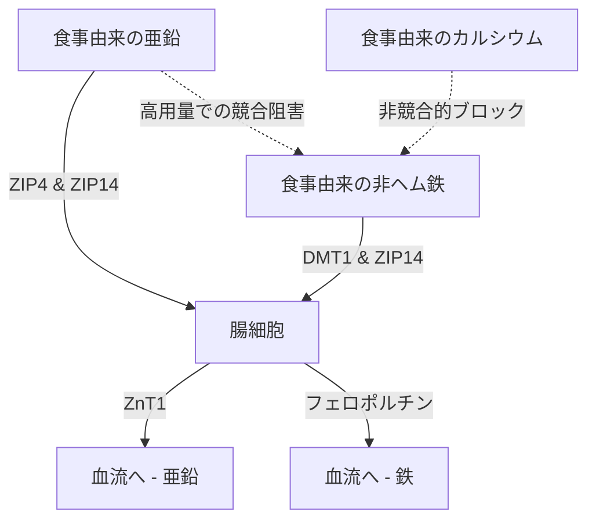

亜鉛（$\text{Zn}^{2+}$）のサプリメント摂取には、生理学的および生化学的なパラドックスが存在します。亜鉛は300以上の酵素反応に関与する重要なミネラルですが、経口摂取は、急性の胃腸障害、他の2価陽イオンとの競合阻害、および全身のミネラル枯渇によってしばしば妨げられます。これらの問題を解決し、最適な投与プロトコルを設計するには、腸管トランスポーターの動態、粘膜の生化学、および時間薬理学（クロノファーマコロジー）を詳細に理解する必要があります。

## 空腹時のパラドックス：粘膜刺激 vs 生体利用効率

経口投与される亜鉛には難しい選択があります。空腹時に摂取すると細胞への生体利用効率は最大になりますが、急性の胃腸障害（吐き気）を引き起こすことがよくあります。逆に、食事と一緒に亜鉛を投与すると不快感は軽減されますが、吸収率を大幅に低下させる食事性の阻害物質が導入されてしまいます。

### 胃の刺激と吐き気の分子メカニズム
硫酸亜鉛（$\text{ZnSO}_4$）や塩化亜鉛（$\text{ZnCl}_2$）などの水溶性の高い無機亜鉛塩を摂取すると、胃腔内で急速に溶解します。水溶液中ではこれらの塩は完全に解離し、pHが約4.0〜5.0の局所的で高濃度な酸性環境を作り出します。

絶食状態では、食物がないため胃粘膜の緩衝作用が働きません。遊離した2価の亜鉛イオン（$\text{Zn}^{2+}$）への突然の曝露は、胃上皮細胞に直接的な刺激を与えます。この局所的な刺激により、胃壁細胞が刺激されて塩酸（HCl）が過剰分泌され、胃のpHがさらに低下し、粘膜びらんを引き起こします。

この化学的および酸性の刺激は、胃壁に張り巡らされた迷走神経の知覚ニューロンによって検出されます。活性化されると、これらのニューロンは迷走神経を通って脳幹に活動電位を伝達します。これにより中枢を介した嘔吐反射が引き起こされ、摂取後30分以内に即座の吐き気や胃のけいれんとして現れます。

### 吸収の阻害：フィチン酸、穀物、乳製品

迷走神経の刺激（吐き気）を防ぐために食事と一緒に亜鉛を摂取すると、食事中の阻害物質によってその生体利用効率が著しく損なわれます。これらの阻害物質の中で最も強力なのが**フィチン酸**（フィテート）であり、未精製の穀物、豆類、ナッツ、種子の外皮に高濃度で含まれています。

十二指腸の生理的pHにおいて、フィチン酸は遊離した$\text{Zn}^{2+}$イオンと結合（キレート化）し、腸での吸収に完全に抵抗する非常に安定した不溶性の錯体を形成します。人間は上部消化管に内在性のフィターゼ酵素を持っていないため、これらの亜鉛-フィチン酸複合体は加水分解されずに便として排出されます。

> [!CAUTION]
> 放射性マーカーを用いた定量的な研究では、食事にわずか50mgのフィチン酸を追加するだけで、亜鉛の吸収率が約36％減少する（基準値の22％から14％に低下する）ことが示されています。250mgのフィチン酸では、吸収はわずか6〜7％まで完全に抑制されます。

さらに、乳製品も独立した阻害効果を発揮します。牛乳の主要なタンパク質である**カゼイン**は、腸管内で亜鉛イオンと結合し、ホエイ（乳清）タンパク質と比較して生体利用効率を著しく低下させます。

### 亜鉛化合物の形態と耐容性

| 化学的分類 | 亜鉛化合物の形態 | 吸収率の目安 | 胃の耐容性 | 作用機序 |
| :--- | :--- | :--- | :--- | :--- |
| **無機塩** | 硫酸亜鉛（$\text{ZnSO}_4$） | 約20–49.9% | 強い刺激（約15%で吐き気） | 急速に遊離$\text{Zn}^{2+}$に解離。酸性pH。 |
| **有機塩** | グルコン酸亜鉛 | 約50.6–71.7% | 中程度の耐容性（約5%で吐き気） | 中性pH。ゆっくりとした解離が刺激を最小化。 |
| **有機キレート**| ビスグリシン酸亜鉛 | 約50–60% | 非常に高い耐容性（5%未満で吐き気） | グリシンに結合。胃での解離やフィチン酸の干渉に強い。 |
| **有機キレート**| ピコリネイト亜鉛 | 高い | 高い耐容性 | ピコリン酸と複合体を形成。組織への蓄積に優れる。 |

### 科学的に最適な服用プロトコル

空腹時の吐き気とフィチン酸による吸収阻害の両方を完全に回避するには、以下のプロトコルを使用する必要があります：

1. **有機キレートへの移行:** 無機亜鉛塩を、ビスグリシン酸亜鉛のようなpH中性の有機金属アミノ酸キレートに置き換えるべきです。ビスグリシン酸亜鉛では、$\text{Zn}^{2+}$イオンが2つのグリシン配位子に共有結合しており、胃酸での早期解離からミネラルを保護します。
2. **代替吸収経路の利用:** pH依存性のトランスポーターに依存する無機亜鉛とは異なり、有機キレートは無傷のまま、ペプチドトランスポーターなどの効率的な代替経路を通じて吸収されます。
3. **拮抗物質の少ない軽食:** 患者が非常に敏感で、吐き気を防ぐために食事を必要とする場合、亜鉛はフィチン酸や高用量のカルシウムを全く含まない軽食と一緒でのみ摂取すべきです。サワードウブレッド（発酵によりフィチン酸が分解されている）や、シンプルな動物性タンパク質（卵やホエイプロテイン）が許可されます。

> [!TIP]
> **プロのヒント:** 吐き気を完全に避けながら吸収を最大化するための理想的なプロトコルは、午後の早い時間に15〜30mgのビスグリシン酸亜鉛をフィチン酸を含まない軽食と一緒に摂取し、摂取の前後2時間は絶食（コーヒーやお茶も避ける）することです。

## トランスポーターの戦争：DMT1とZIP14

小腸の腸細胞は、2価金属の吸収において非常に競争の激しい場所です。亜鉛（$\text{Zn}^{2+}$）、非ヘム鉄（$\text{Fe}^{2+}$）、カルシウム（$\text{Ca}^{2+}$）は、重複する飽和可能な経路を共有しています。つまり、これらのサプリメントを同時に高用量で投与すると、互いの吸収を直接抑制してしまいます。

### トランスポーターの状況：ZIP4、ZIP14、DMT1
十二指腸の腸細胞の細胞膜（刷子縁）において、食事由来の亜鉛の主な取り込み口はZIP4です。非ヘム鉄（植物性/無機鉄）は、異なる経路であるDMT1に依存しています。しかし、もう一つの重要なトランスポーターであるZIP14が存在します。これは亜鉛トランスポーターとして分類されていますが、鉄（$\text{Fe}^{2+}$）の輸送能力も非常に高いのです。

$\text{Zn}^{2+}$と$\text{Fe}^{2+}$は電荷とイオン半径が非常に似ているため、共有の輸送経路（ZIP14など）を激しく奪い合います。治療量（100〜400mg）の鉄を亜鉛と同時に投与すると、細胞への取り込みにおいて鉄が亜鉛に打ち勝ちます。臨床研究によると、高用量の鉄と標準的な25mgの亜鉛を同時に摂取すると、亜鉛の吸収率が約40〜50％低下することが示されています。

## 銅の枯渇の危険性：細胞内への閉じ込め

長期にわたる高用量の亜鉛補給の大きな危険性は、全身の銅欠乏症が密かに進行することです。この経路は、腸細胞内の金属結合タンパク質である**メタロチオネイン**の増加によって媒介されます。

個人が長期間にわたって高用量の亜鉛（通常、1日あたり40〜50mgを超える）を消費すると、細胞内への$\text{Zn}^{2+}$の大量の流入が強力なシグナルとして働き、メタロチオネインの合成を大規模に引き起こします。

メタロチオネインの合成は主に亜鉛によって促進されますが、このタンパク質は亜鉛に対する親和性よりも、銅（$\text{Cu}^+$）に対する熱力学的な結合親和性がはるかに高いという特徴があります。その結果、食事由来の銅が腸細胞に吸収されると、豊富に存在するメタロチオネイン分子が銅イオンに素早く結合して隔離してしまいます。

この銅は非常に安定した複合体の中に閉じ込められ、血流に出ることができません。腸細胞は3〜5日ごとに剥がれ落ちて新陳代謝するため、細胞内に閉じ込められた銅はそのまま便として排出されます。時間が経つにつれて、このブロックは深刻な全身の銅不足につながります。

> [!WARNING]
> 1日40mgを超える亜鉛を、15:1の比率の銅とのバランスをとらずに4週間以上連続して摂取すると、重度の銅欠乏症を引き起こす危険性があります。放置すると、脱毛、不可逆的な神経損傷、貧血を引き起こす可能性があります。

### 臨床的に安全な亜鉛と銅の比率
長期の補給中にメタロチオネインによる銅の閉じ込めを完全に防ぐためには、亜鉛サプリメントを非常に特異的な比率で銅と組み合わせる必要があります。臨床的に確立された安全で相乗効果のある**亜鉛対銅の比率は8:1〜15:1**です。亜鉛15mgに対して銅1mg（グルコン酸銅など）を摂取することで、この危険性を排除できます。

## 亜鉛の時間薬理学：概日リズムと睡眠

栄養素を投与するタイミングは、その有効性を決定する主要な要因です。亜鉛は体内の体内時計と非常に複雑な関係を持っており、概日リズムの調整役として、また睡眠の分子経路の直接的な参加者として機能します。

### 亜鉛、メラトニン合成、GABA
亜鉛は、睡眠ホルモンであるメラトニンの合成に必要な基本的な生化学的補因子です。メラトニン産生を制御する酵素であるTPHとAANATを安定させます。亜鉛が不足するとAANATの転写が直接的に低下し、夜間のメラトニンが急激に減少します（不眠症）。

さらに、亜鉛は中枢神経系内の直接的な神経修飾物質として機能します。神経の興奮時には、興奮性のNMDAグルタミン酸受容体の強力なアンタゴニスト（ブロッカー）として働き、同時に鎮静作用のあるGABA受容体を強化します。この二重の作用（興奮を抑えながらリラックスを高めること）により、深く回復力のある徐波睡眠（深い眠り）へのスムーズな移行が促進されます。

### SuppTime 最適化服用プロトコル

| 時間帯 | サプリメントの組み合わせ | 時間生物学的な根拠 |
| :--- | :--- | :--- |
| **朝** | プロバイオティクス | 起床時の胃酸の量が少ないため、細菌の生存率が最大になります。 |
| **朝食** | 非ヘム鉄、ビタミンC、ビタミンD3 | ビタミンCは鉄の吸収を促進。カルシウムと亜鉛は避けてください。 |
| **昼 / 夕方** | ビスグリシン酸亜鉛 (15–30mg) + 銅 (1–2mg) | 銅の枯渇を防ぐため15:1の比率で。鉄やカルシウムとは完全に分離します。 |
| **夜** | カルシウム、グリシン酸マグネシウム | マグネシウムは筋肉を弛緩させ、就寝前にGABA受容体を調節します。 |

## 参考文献

1. Institute of Medicine (US) Panel on Micronutrients. [Zinc](https://www.ncbi.nlm.nih.gov/books/NBK222317/). *Dietary Reference Intakes for Vitamin A, Vitamin K, Arsenic, Boron, Chromium, Copper, Iodine, Iron, Manganese, Molybdenum, Nickel, Silicon, Vanadium, and Zinc.* National Academies Press, 2001.
2. National Institutes of Health, Office of Dietary Supplements. [Zinc - Health Professional Fact Sheet](https://ods.od.nih.gov/factsheets/Zinc-HealthProfessional/). *NIH Office of Dietary Supplements.* 2022.
3. Pérès JM, Bureau F, Neuville D, Arhan P, Bouglé D. [Inhibition of zinc absorption by iron depends on their ratio](https://pubmed.ncbi.nlm.nih.gov/11846013/). *Journal of Trace Elements in Medicine and Biology.* 2001.
4. Devarshi PP, Mao Q, Grant RW, Mitmesser SH. [Comparative Absorption and Bioavailability of Various Chemical Forms of Zinc in Humans: A Narrative Review](https://www.ncbi.nlm.nih.gov/pmc/articles/PMC11677333/). *Nutrients.* 2024.
5. Gupta N, Carmichael MF. [Zinc-Induced Copper Deficiency as a Rare Cause of Neurological Deficit and Anemia](https://www.ncbi.nlm.nih.gov/pmc/articles/PMC10510946/). *Cureus.* 2023.

*本記事は情報提供のみを目的としており、医学的なアドバイスを構成するものではありません。サプリメントや薬の摂取内容を変更する前に、資格を持つ医療専門家にご相談ください。*
