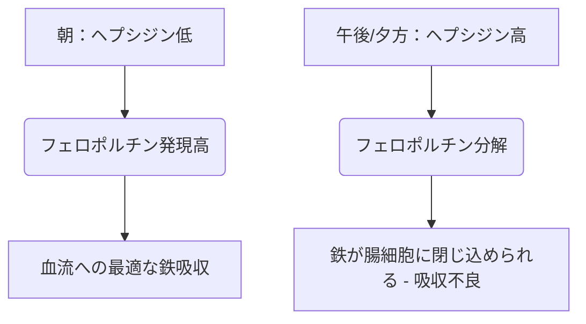

鉄は、酸素運搬、細胞呼吸、およびDNA合成における構造的および触媒的補酵素として機能する不可欠な微量栄養素です。自然界に豊富に存在するにもかかわらず、人間の食事においては成長を制限する栄養素となることがよくあります。人間には鉄を能動的に排泄する生理学的メカニズムがないため、全身の鉄バランスはもっぱら腸管吸収のレベルで維持されています。

食事に含まれる鉄は、主に**有機鉄（ヘム鉄）**と**無機鉄（非ヘム鉄）**の2つの形態で存在します。

ヘム鉄は生体利用能が非常に高く、通常15％から35％の割合で吸収されます。十二指腸腸細胞の頂端刷子縁を横切ってヘム輸送タンパク質1（HCP1）を介して無傷のまま輸送され、一般的な食事阻害因子の影響を受けません。

対照的に、非ヘム鉄（無機鉄）は食事からの摂取量の80％以上を占めますが、吸収率はわずか2％から20％の範囲であり、吸収プロファイルが著しく低下しています。

> [!TIP]
> 生理的pHにおいて、非ヘム鉄は主に酸化され、非常に不溶性の第二鉄（Fe³⁺）の状態で存在します。吸収されるには、二価金属トランスポーター1（DMT1）を介して腸細胞に入る前に、頂端還元酵素である十二指腸チトクロームb（Dcytb）によって可溶性の第一鉄（Fe²⁺）の状態に還元される必要があります。

## ヘム鉄と非ヘム鉄の経路の比較

| 特徴 / 指標 | ヘム鉄の経路 | 非ヘム鉄（無機鉄）の経路 |
| :--- | :--- | :--- |
| **食事の供給源** | 動物組織（ヘモグロビン、ミオグロビン） | 植物、鉄分強化食品、ミネラル塩 |
| **頂端トランスポーター** | ヘム輸送タンパク質1（HCP1） | 二価金属トランスポーター1（DMT1） |
| **必要な原子価状態** | ポルフィリン結合複合体 | 第一鉄（Fe²⁺） |
| **最適な腸内pH** | 広範囲で安定。胃酸の影響を受けない | 可溶化のために強酸性（pH < 3.0）が必要 |
| **一般的な吸収率**| 15% – 35%（生体利用能が高い） | 2% – 20%（変動が大きい） |
| **食事阻害因子への感受性** | ほとんどなし。ポルフィリン環により保護される | 非常に高い（フィチン酸、ポリフェノール、カルシウムにより阻害される） |

## 最適な摂取タイミング（時間薬理学）

非ヘム鉄の吸収を最適化するには、主に肝細胞で合成される25アミノ酸のペプチドホルモンである**ヘプシジン（Hepcidin）**の日内変動と正確に調整する必要があります。ヘプシジンは、基底膜側の排出トランスポーターであるフェロポルチンに直接結合してその分解を誘導することにより、全身の鉄恒常性を調節するマスターホルモンとして機能します。その結果、血中のヘプシジン濃度が上昇すると、鉄は十二指腸腸細胞内に閉じ込められ、血流への移行が妨げられます。

### ヘプシジンの日内変動
基本的な生理的条件下では、ヘプシジン濃度は早朝に最も低く、午後にかけて着実に上昇してピークに達し、夜間に低下します。

この概日曲線は、経口鉄の動態に直接影響を与えます。鉄分サプリメントを**朝に摂取**すると、腸細胞のフェロポルチン発現が最も高いときにミネラルが十二指腸に到達することができます。対照的に、午後または夕方に摂取すると、上昇したヘプシジンによるブロックと競合することになり、部分的な鉄吸収率が37％減少します。

### 胃酸の影響
無機鉄の生物物理学的状態は、胃酸の生成に大きく依存しています。プロトンポンプ阻害薬（PPI - 胃薬）による胃酸の薬理学的抑制は、この微小環境を深刻に破壊し、胃のpHを上昇させ、可溶性のFe²⁺を極めて不溶性のFe³⁺へと急速に酸化させます。

> [!WARNING]
> 経口鉄分サプリメントは、空腹時（理想的には食前1時間または食後2時間）に摂取し、胃酸分泌抑制薬（胃薬）とは厳密に分けて服用する必要があります。

## 致命的な相互作用（絶対に混ぜてはいけないもの）

経口鉄の治療効果は、さまざまな食事成分や医薬品と同時に摂取することで容易に損なわれます。

### カルシウム
カルシウムは、食事（牛乳、チーズ、ヨーグルト）またはミネラルサプリメント（炭酸カルシウム）として摂取するかどうかにかかわらず、ヘム鉄と非ヘム鉄の両方の吸収の強力な阻害剤です。鉄分を含む食事と一緒に500mgの炭酸カルシウムを同時摂取すると、部分的な鉄吸収率が50％以上減少します。

### タンニンとポリフェノール
**紅茶、緑茶、ハーブティー、コーヒー**に含まれるポリフェノールは、非常に効果的な鉄キレート剤です。これらの植物由来の化合物は第二鉄と配位結合し、十二指腸刷子縁を通過できない、非常に安定した巨大な有機金属複合体を形成します。食事にコーヒーや紅茶を1杯加えるだけで、非ヘム鉄の吸収が40％から70％減少する可能性があります。

### フィチン酸
フィチン酸は、全粒穀物、シリアル、ナッツ、マメ科植物における主要なリン貯蔵化合物です。フィチン酸と鉄のモル比は、植物ベースの食事において鉄の生体利用能を制限する最も重要な食事要因です。

### 亜鉛とマグネシウム
第一鉄、亜鉛、マグネシウムは、腸細胞の頂端膜を横切る重複した輸送経路（DMT1など）を共有しています。治療用量の鉄を摂取すると、競合阻害が発生し、鉄の輸送が著しく抑制されます。鉄分サプリメントを亜鉛やマグネシウムと一緒に摂取しないでください。

### 甲状腺薬（レボチロキシン）
経口鉄サプリメントとレボチロキシン（甲状腺ホルモン薬）の併用は、深刻な薬物-栄養素相互作用を引き起こします。鉄はレボチロキシン分子と配位結合し、不溶性の複合体を形成して、レボチロキシンの経口生体利用能を20％から64％減少させます。

> [!CAUTION]
> 甲状腺治療の失敗を防ぐため、レボチロキシンと鉄の投与間隔は最低でも厳密に4時間空ける必要があります。

## 究極の補助因子：ビタミンC

アスコルビン酸（ビタミンC）は、非ヘム鉄の吸収を最も強力に促進する物質であり、食事中のフィチン酸、ポリフェノール、カルシウムの阻害効果を無効にする能力があります。

この相乗関係は、非常に効率的な二重の生化学的メカニズムを通じて機能します：
1. **熱力学的に有利な還元：** アスコルビン酸は、不溶性の第二鉄イオン（Fe³⁺）を、輸送の準備が整った非常に可溶性の高い第一鉄（Fe²⁺）の形に急速に変換します。
2. **十二指腸でのキレート化：** アスコルビン酸は保護シールドとして機能し、十二指腸のアルカリ性環境に移行する際に鉄がフィチン酸やポリフェノールと結合するのを防ぎます。

## 副作用と「隔日摂取」パラダイム

鉄欠乏性貧血を治療するための従来のアプローチ（高用量の経口鉄を毎日処方する）は、深刻な胃腸の副作用（吐き気、便秘）と全身のフィードバックループにより、失敗に終わることがよくあります。

部分吸収率が低いため、標準的な経口鉄用量の最大90％が胃腸管で吸収されずに残ります。この余分な鉄は過酸化水素と反応して毒性の高いヒドロキシラジカルを生成し、酸化ストレスと粘膜の炎症を引き起こします。

さらに、毎日の高用量の鉄分補給は、全身的な**「粘膜ブロック（Mucosal Block）」**を引き起こします。60mg以上の経口鉄を摂取すると、血清ヘプシジンが急激に上昇し、それが24時間高値にとどまります。翌日2回目の鉄分を摂取すると、腸細胞はそれを門脈循環に排出することを物理的にブロックされます。鉄は閉じ込められ、最終的には排泄されます。

> [!TIP]
> **隔日摂取：** このヘプシジンを介したブロックを回避するため、現代の血液学は経口鉄を**1日おき（隔日）**に投与する方向へとシフトしています。臨床試験では、鉄を48時間ごとに摂取すると、連日投与と比較して部分的な鉄吸収率が40％〜50％増加し、胃腸の副作用が劇的に減少することが証明されています。

### 臨床プロトコルの要約

*   **低い胃内pHが不可欠：** 鉄分は空腹時に水と一緒に摂取してください。
*   **主な食事阻害因子を避ける：** カルシウム、乳製品、コーヒー、お茶と一緒に鉄分を摂取することは厳密に避けてください。
*   **厳格な服薬間隔を維持：** 鉄分とレボチロキシンは少なくとも4時間空けてください。
*   **ビタミンCを活用する：** 鉄分をビタミンCと一緒に摂取すると、吸収が最大300％増加します。
*   **隔日摂取を採用する：** ヘプシジンによる粘膜ブロックを回避し、吸収を最大化するために、経口鉄の服用間隔を48時間空けてください。

## 参考文献

1. Stoffel NU, Zeder C, Brittenham GM, Moretti D, Zimmermann MB. [Iron absorption from oral iron supplements given on consecutive versus alternate days and as single morning doses versus twice-daily split dosing in iron-depleted women: two open-label, randomised controlled trials](https://pubmed.ncbi.nlm.nih.gov/29032957/). *Lancet Haematol.* 2017.
2. Campbell NR, Hasinoff BB. [Ferrous sulfate reduces thyroxine efficacy in patients with hypothyroidism](https://pubmed.ncbi.nlm.nih.gov/1443969/). *Ann Intern Med.* 1992.
3. Hallberg L, Hulthén L. [Effect of ascorbic acid intake on nonheme-iron absorption from a complete diet](https://pubmed.ncbi.nlm.nih.gov/11124756/). *Am J Clin Nutr.* 2000.
4. Lönnerdal B. [Calcium and iron absorption—mechanisms and public health relevance](https://pubmed.ncbi.nlm.nih.gov/21462112/). *Int J Vitam Nutr Res.* 2010.

*本記事は情報提供のみを目的としており、医学的なアドバイスを構成するものではありません。サプリメントや薬の摂取内容を変更する前に、資格を持つ医療専門家にご相談ください。*
