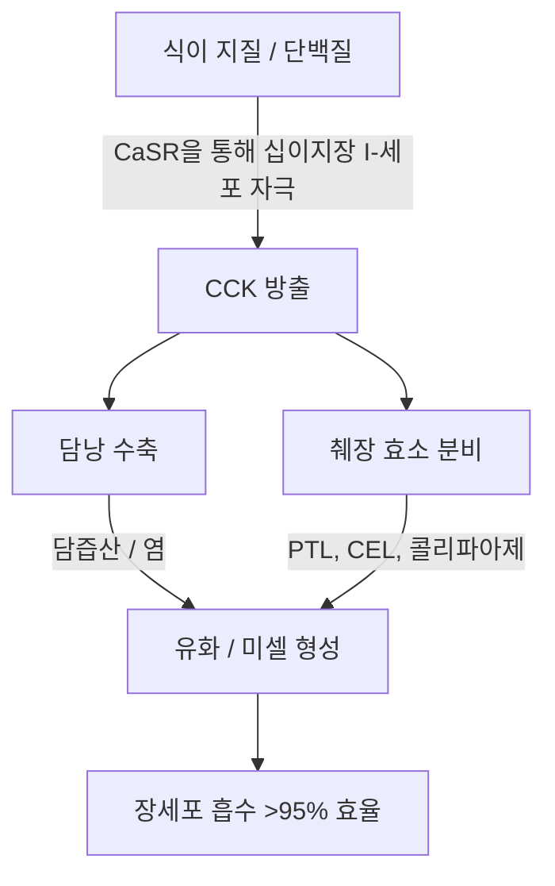

장쇄 해양 오메가-3 다중 불포화 지방산($\text{PUFAs}$), 특히 에이코사펜타엔산($\text{EPA}$)과 도코사헥사에논산($\text{DHA}$)의 치료 효능은 장내 생체 이용률에 의해 엄격하게 좌우됩니다. 임상 영양학에서 치료 실패의 주요 원인 중 하나는 "저지방 식사의 역설(lean-meal paradox)"입니다. 이는 공복 상태이거나 무지방 식사와 함께 매우 소수성인 해양 지질을 투여하는 것을 말합니다. 높은 명목상의 용량을 섭취했음에도 불구하고, 구조화된 지질 공동 섭취 매트릭스의 부재는 인간 위장관의 수성 내강에서 지질 흡수에 필요한 물리적 및 효소적 메커니즘을 방해합니다. 이 임상 분석은 $\text{EPA}$ 및 $\text{DHA}$의 소화와 흡수를 지시하는 생물 물리학적, 생화학적 및 시간약리학적 원리를 자세히 설명합니다.

## 공복과 저지방 식사의 역설

위장관은 근본적으로 수성, 즉 수분 기반 시스템입니다. 표준 어유와 같은 소수성(물과 친하지 않은) 지질을 섭취하면 위액과 장액의 매우 극성인 환경에 직면하게 됩니다. 열역학 법칙에 따라 소수성 분자는 물과의 접촉을 최소화하여 빠른 상 분리를 초래합니다. 이로 인해 섭취한 기름이 합쳐져 수성 위 유미즙 위에 떠 있는 크고 나누어지지 않은 지질 소구체(globule)를 형성합니다.

물 한 잔과 함께 공복에, 또는 탄수화물로만 구성된 식사(예: 과일 한 조각이나 마른 빵 한 조각)와 함께 오메가-3 캡슐을 섭취하는 것은 이러한 상 분리를 극복하는 데 필요한 생리적 과정을 유발하지 못합니다. 물리적 유화(emulsification) 없이는 지질 상의 표면적 대 부피 비율이 극도로 낮게 유지됩니다. 췌장 리파아제의 친수성 활성 부위는 이 크고 소수성인 물방울 안에 묻혀 있는 에스테르 결합에 접근할 수 없습니다. 결과적으로 어유와 함께 물을 마시는 것은 흡수에 도움이 되지 않으며, 오히려 공복 상태에 존재하는 미량의 소화 효소를 희석시켜 유화되지 않은 지질 소구체를 장세포의 미세융모막(brush border membrane)에서 더 멀어지게 하여 흡수 불량과 위장 장애를 초래합니다.

이러한 고도의 소수성 지질이 장 점막의 섞이지 않는 수분층(unstirred water layer)을 통과하려면 열역학적으로 안정적이고 물에 분산될 수 있는 상으로 변환되어야 합니다. 이 변환은 전적으로 호르몬 매개 십이지장 신호에 의해 시작되는 미셀화(micellarization)의 물리 화학에 의존합니다.

## 담즙산염과 미셀(Micelle) 형성

물에 떠 있는 소수성 오일 덩어리에서 흡수 가능한 미세 물방울로의 전환은 십이지장에서 조정된 신경근 및 분비 연속 반응(cascade)을 필요로 합니다. 이 과정의 주요 호르몬 동인은 십이지장 및 상부 공장의 점막 내층에 있는 장내분비 I-세포에 의해 합성되고 분비되는 33개 아미노산 펩티드인 콜레시스토키닌($\text{CCK}$)입니다.



생리적 조건에서 십이지장 내강에 장쇄 지방산과 부분적으로 소화된 단백질이 존재하면 I-세포의 칼슘 감지 수용체($\text{CaSR}$)를 자극하여 혈류로 $\text{CCK}$의 빠른 세포 외 배출을 유발합니다. 일단 방출된 $\text{CCK}$는 담낭벽의 $\text{CCK}_A$ 수용체에 결합하여 담낭을 수축시키는 동시에 오디 괄약근을 이완시키고 췌장 선방세포를 자극하여 소화 효소를 방출하도록 합니다.

담낭에서 방출되는 담즙산(주로 콜산 및 케노데옥시콜산의 양친매성 나트륨염)은 필수 생물학적 계면활성제(세제)입니다. 십이지장의 담즙산 농도가 임계 미셀 농도($\text{CMC}$)를 초과하면 소수성 지질 방울 주위에 스스로를 배열합니다. 담즙산염의 소수성 스테로이드 핵은 지질 상과 결합하는 반면, 극성인 친수성 결합기(글리신 또는 타우린)는 수성 십이지장 내강을 향합니다.

장 연동운동의 기계적 작용을 통해 담즙으로 코팅된 이 물방울들은 혼합 미셀로 쪼개집니다. 이 구형 콜로이드 응집체의 지름은 3~10나노미터에 불과하여 췌장 리파아제에 노출되는 지질 표면적을 수천 배 증가시킵니다. $\text{CCK}$ 방출의 역치를 촉발하기 위해 건강한 식이 지방(예: 엑스트라 버진 올리브 오일, 아보카도 또는 방목 달걀 노른자)을 함께 섭취하지 않으면 담낭 수축이 일어나지 않습니다. 이 상태에서는 담즙산 수치가 $\text{CMC}$ 아래에 머물고, 췌장 리파아제 분비가 최소화되며, 섭취한 오메가-3 지질은 미셀을 형성할 수 없어 흡수가 차단됩니다.

## 생화학적 형태의 전투: TG vs. EE vs. PL

시판되는 오메가-3 보충제는 세 가지 주요 분자 형태인 천연 또는 재에스테르화 트리글리세리드($\text{TG}$/$\text{rTG}$), 에틸 에스테르($\text{EE}$), 인지질($\text{PL}$)로 존재합니다. 이러한 운반체의 분자 구조가 소화 속도, 리파아제 의존도 및 생체 이용률을 결정합니다.

```text
트리글리세리드(TG) 형태:           에틸 에스테르(EE) 형태:         인지질(PL) 형태:
     ┌─ 글리세롤 백본                   ┌─ 에탄올 분자                  ┌─ 인산기 머리 (극성)
     ├─ 지방산(EPA)                     └─ 지방산(EPA)                  ├─ 지방산(EPA)
     ├─ 지방산(DHA)                                                     └─ 지방산(DHA)
     └─ 지방산(기타)
```

천연 및 재에스테르화 트리글리세리드($\text{TG}$/$\text{rTG}$)의 경우, 세 개의 지방산($\text{EPA}$/$\text{DHA}$)이 3탄소 글리세롤 백본에 결합되어 있습니다. 소화되는 동안 보조인자 콜리파아제와 함께 작용하는 췌장 트리글리세리드 리파아제($\text{PTL}$)는 $sn\text{-}1$ 및 $sn\text{-}3$ 위치의 에스테르 결합을 가수분해합니다. 이는 두 개의 유리 지방산과 하나의 $sn\text{-}2$-모노글리세리드를 생성하며, 둘 다 매우 극성이고 쉽게 미셀화되며 95% 이상의 효율로 장세포에 의해 쉽게 흡수됩니다.

반대로 에틸 에스테르($\text{EE}$) 형태는 화학적 농축 과정에서 만들어진 합성 제품입니다. 글리세롤 백본이 제거되고 각 개별 지방산이 에탄올 분자($\text{CH}_3\text{CH}_2\text{OH}$)에 에스테르화됩니다. 이 합성 에스테르 결합은 인간의 췌장 효소에 대한 저항성이 매우 높습니다. 시험관 내 및 생체 내 연구에 따르면 인간 췌장 리파아제는 $\text{EE}$의 지방산-에탄올 결합을 트리글리세리드의 글리세릴 에스테르 결합보다 10~50배 느린 속도로 가수분해합니다.

이러한 느린 가수분해 때문에 $\text{EE}$ 흡수는 고지방 식사에 의해서만 촉발되는 췌장 리파아제 및 담즙산염의 대량 방출에 크게 의존합니다. 저지방 식단과 함께 복용할 경우, 사용 가능한 제한된 췌장 리파아제는 $\text{EE}$ 결합을 효율적으로 절단하지 못하여 낮은 생체 이용률(종종 약 20%로 떨어짐)을 초래하고 흡수되지 않은 합성 에스테르가 결장으로 넘어가 위장 부작용을 일으킬 수 있습니다.

주로 남극 크릴 오일(Euphausia superba)에서 추출되는 인지질($\text{PL}$) 형태는 $\text{EPA}$와 $\text{DHA}$가 포스파티딜콜린 백본에 결합된 양친매성 구조를 특징으로 합니다. 매우 극성인 인산염 머리 그룹은 인지질이 자연적으로 물에 분산되도록 합니다. 이 때문에 $\text{PL}$ 형태는 자체 유화(self-emulsifying)되어 위장관에서 자발적인 마이크로 물방울을 형성할 수 있으며, 담즙산염에 의해 자극된 미셀화의 절대적인 요구 사항을 우회할 수 있습니다. 인지질은 또한 포스포리파아제 $\text{A}_2$를 통해 소화되며 리소인지질로서 장세포에 의해 직접 흡수될 수 있으므로 공복 또는 저지방 조건에서도 높은 생체 이용률을 가져옵니다.

| 생화학적 형태 | 분자 운반체 / 백본 | 평균 흡수율 (저지방 식사) | 평균 흡수율 (고지방 식사) | 상대적 생체 이용률 (EE 기준) | 췌장 리파아제 의존성 |
| --- | --- | --- | --- | --- | --- |
| 에틸 에스테르(EE) | 에탄올 ($\text{CH}_3\text{CH}_2\text{OH}$) | $\approx 20\%$ | $\approx 60\%$ | 기준선 ($100\%$) | 절대적; TG보다 10~50배 느리게 가수분해됨 |
| 트리글리세리드(TG / rTG) | 글리세롤 백본 | $\approx 68\%$ | $\approx 90\%$ | $124\%$ ~ $186\%$ | 높음; 빠르게 2-FFA 및 1-MAG로 절단됨 |
| 인지질(PL) | 포스파티딜콜린 | $\approx 80\%$ ~ $95\%$ | $>95\%$ | $168\%$ ~ $500\%$ | 최소; 자체 유화, 특정 리파아제 우회 |

> [!WARNING]
> 외분비 췌장 기능 부전(EPI), 담도 운동 이상증이 있는 개인 또는 담낭 절제술 후 환자는 내인성 지질 소화가 심각하게 손상된 모습을 보입니다. 이러한 임상 환자군의 경우 저지방 식이 제한 하에 합성 에틸 에스테르(EE) 제제를 투여하는 것은 이러한 상태에서는 필수적인 효소 절단이 사실상 존재하지 않기 때문에 완전한 흡수 불량 및 위장 장애에 대한 높은 위험을 나타냅니다.

## 지질 산화와 비타민 E의 절대적 필요성

$\text{EPA}$와 $\text{DHA}$를 생물학적으로 활성화시키는 구조적 특징은 또한 이들을 매우 불안정하게 만듭니다. $\text{EPA}$는 5개, $\text{DHA}$는 6개의 메틸렌 중단 이중 결합을 포함합니다. 비스-알릴성 메틸렌 탄소($\text{-CH=CH-CH}_2\text{-CH=CH-}$)의 탄소-수소 결합은 낮은 결합 해리 에너지를 갖습니다. 이로 인해 활성 산소의 공격과 비효소적 지질 과산화에 매우 취약해집니다.

```text
1단계: 개시 (Initiation)
  [PUFA 탄소-수소 결합] + [ROS / 자유 라디칼] ──> [탄소 중심 지질 라디칼(R•)]

2단계: 전파 (Propagation)
  [탄소 중심 지질 라디칼(R•)] + [O2] ──> [지질 퍼옥실 라디칼(ROO•)]
  [지질 퍼옥실 라디칼(ROO•)] + [산화되지 않은 PUFA] ──> [지질 하이드로퍼옥사이드(ROOH)] + [새로운 지질 라디칼(R•)]

3단계: 분해 (Decomposition)
  [불안정한 지질 하이드로퍼옥사이드(ROOH)] ──> [독성 알데히드(MDA / HHE)]
```

일단 섭취되면 어유는 $37^\circ\text{C}$(체온), 위산, 용존 산소 분자($\text{O}_2$) 환경에 노출됩니다. 이 환경은 세 가지 뚜렷한 단계를 통해 지질 과산화 연속 반응을 가속화합니다.

1. **개시:** 활성 산소종($\text{ROS}$)이 비스-알릴 탄소에서 수소 원자를 빼앗아 탄소 중심 지질 라디칼($\text{R}^\bullet$)을 생성합니다.
2. **전파:** 지질 라디칼은 분자 산소($\text{O}_2$)와 빠르게 반응하여 지질 퍼옥실 라디칼($\text{ROO}^\bullet$)을 형성합니다. 그런 다음 이 퍼옥실 라디칼은 인접한 산화되지 않은 $\text{PUFA}$ 분자에서 수소 원자를 빼앗아 지질 하이드로퍼옥사이드($\text{ROOH}$)와 새로운 지질 라디칼을 생성하여 연쇄 반응을 영구화합니다.
3. **분해:** 불안정한 지질 하이드로퍼옥사이드는 말론디알데히드($\text{MDA}$) 및 4-하이드록시헥세날($\text{HHE}$)과 같은 알케날을 포함하여 반응성이 매우 높고 세포 독성이 있는 2차 산화 산물로 분해됩니다.

이러한 2차 산화 산물은 장을 통해 쉽게 흡수되어 킬로미크론 및 저밀도 지단백질($\text{LDL}$)에 통합되며 전신 산화 스트레스, 내피 손상 및 죽상동맥경화증을 유발할 수 있습니다.

이 과정을 중단하려면 사슬을 끊는 지용성 항산화제를 함께 배합해야 합니다. 천연 비타민 E, 특히 d-알파-토코페롤($\text{C}_{29}\text{H}_{50}\text{O}_2$)은 이 역할에 매우 최적화되어 있습니다. D-알파-토코페롤은 수소 공여체 역할을 하여 약 $10^6\,\text{M}^{-1}\text{s}^{-1}$의 매우 빠른 속도 상수로 페놀계 수소 원자를 반응성 지질 퍼옥실 라디칼($\text{ROO}^\bullet$)에 빠르게 전달합니다.

결과로 생성된 토코페록실 라디칼은 크로마놀 고리에 걸친 짝짓지 않은 전자의 공명 비편재화로 인해 매우 안정적이어서 인접한 지방산 사슬을 공격하는 것을 방지합니다. 이것은 연쇄 반응을 중단시켜 $\text{EPA}$ 및 $\text{DHA}$ 분자의 구조적 무결성을 보호하여 활성, 비산화 상태로 표적 조직에 도달할 수 있도록 합니다.

## 시간약리학과 야간 항염증 창(Window)

지질 생화학에서 타이밍은 중요한 요소입니다. 하루 중 가장 지질 밀도가 높은 큰 식사(일반적으로 저녁 식사)와 함께 오메가-3 보충제를 섭취하면 흡수율과 신체의 자연적인 야간 치유 과정이 모두 최적화됩니다.

```mermaid
graph TD
    A[저녁 식사와 함께 섭취] -->|담즙/리파아제 분비| B[6-8시간 후 혈장 EPA/DHA 최고치]
    A -->|야간 코르티솔 저하| C[NF-kB 상향 조절 및 염증]
    B --> D[SPM으로의 효소 변환: 레졸빈, 프로텍틴]
    C --> D
    D --> E[밤새 전신적인 해결(Resolution)]
```

첫째, 저녁 식사는 역사적으로 많은 사람들에게 하루 중 가장 지방이 많은 식사입니다. 이는 최대 $\text{CCK}$ 방출을 촉발하는 데 필요한 물리적 지질 부피를 제공하여 강력한 담낭 수축, 풍부한 담즙 분비 및 높은 췌장 리파아제 활동을 유도합니다. 이것은 미셀화 및 소화 동역학을 최적화하여 섭취한 용량의 거의 전체가 성공적으로 흡수되도록 보장합니다.

둘째, 저녁 투여는 신체의 24시간 주기 면역 및 염증 주기와 일치합니다. 내인성 코르티솔 수치는 늦은 저녁과 이른 밤에 자연스럽게 일일 최저 수치로 떨어집니다. 코르티솔은 강력한 항염증 호르몬입니다. 수치가 떨어지면 전염증성 전사 인자 $\text{NF}\text{-}\kappa\text{B}$에 의해 지배되는 경로와 같은 전신 염증 경로가 상대적인 "상향 조절(upregulation)"을 경험합니다.

저녁 식사와 함께 오메가-3를 섭취하면 6~8시간 후에 $\text{EPA}$ 및 $\text{DHA}$의 최고 혈장 및 세포막 농도에 도달하여 이 야간 염증 창과 일치하게 됩니다. 이 단계에서 신체는 이러한 지방산을 기질로 사용하여 사이클로옥시게나아제($\text{COX}$) 및 리폭시게나아제($\text{LOX}$) 경로를 통해 특수화된 전분해 매개체($\text{SPM}$)-특히 레졸빈, 프로텍틴, 마레신의 효소 합성을 수행합니다. 이러한 $\text{SPM}$은 수면 중 만성 미세 염증을 적극적으로 해결하고 세포 회전율을 촉진하며 조직 치유를 지원합니다.

또한 오메가-3, 특히 $\text{DHA}$의 저녁 투여는 고유한 신경학적 이점을 제공합니다. $\text{DHA}$는 신경 세포막의 핵심 구조 지질이며 뇌의 24시간 주기 생체 시계에서 중요한 역할을 합니다. 수면-각성 주기를 조절하는 생체 시계 유전자(예: BMAL1 및 CLOCK)에 작용합니다.

시냅스막으로의 $\text{DHA}$ 야간 통합은 신경 세포 간의 소통을 지원하고 세로토닌 합성을 강화하며 멜라토닌으로의 전환을 최적화합니다. 임상 시험에 따르면 일관된 저녁 오메가-3 보충이 수면 효율을 크게 개선하고 수면 개시 잠복기를 단축하며 수면 단편화 지수(야간 각성)를 감소시킵니다.

> [!TIP]
> 장쇄 오메가-3 지방산의 세포 생체 통합을 극대화하기 위해, 임상의는 환자에게 하루 중 가장 지질이 풍부한 식사와 함께 일일 복용량을 투여할 것을 권장해야 합니다. 적어도 10~15그램의 건강한 단일 불포화 또는 다중 불포화 지방(예: 엑스트라 버진 올리브 오일 또는 아보카도)과 함께 섭취하는 것이 최적의 미셀화에 필요한 콜레시스토키닌 방출의 역치를 촉발하는 데 충분합니다.

## 임상적 종합 및 실행 가능한 권장 사항

오메가-3 보충제의 치료 가능성을 극대화하려면 높은 명목 용량의 캡슐을 단순히 섭취하는 것에서 벗어나 지질 생화학 및 소화 동역학에 기반한 접근 방식으로 전환해야 합니다. 공복에 물과 함께 어유를 섭취하는 전통적인 방식은 종종 흡수 불량과 위장 부작용을 초래합니다.

최적의 치료 결과를 얻기 위해 임상의는 합성 에틸 에스테르($\text{EE}$)보다 우수한 흡수 역학을 보이고 고지방 식사에 대한 의존도가 낮은 재에스테르화 트리글리세리드($\text{rTG}$) 또는 인지질($\text{PL}$) 제형을 우선적으로 사용해야 합니다.

선택한 제형에 관계없이 보충제는 최소 10~15그램의 식이 지방이 포함된 식사와 함께 섭취해야 합니다. 이 지질 임계값은 십이지장 $\text{CCK}$ 신호 전달 연속 반응을 촉발하여 완전한 미셀화를 허용하는 담낭 수축 및 췌장 리파아제 분비를 시작하는 데 필요합니다.

또한, 신체 내부의 산화 손상으로부터 이 매우 불안정한 $\text{PUFA}$를 보호하기 위해, 제형에는 항상 d-알파-토코페롤(비타민 E)과 같은 천연 지용성 항산화제가 포함되어야 합니다.

마지막으로, 저녁 식사와 함께 보충을 조정하면 최대 흡수가 신체의 자연적인 야간 항염증 및 세포 복구 경로와 일치하여 $\text{EPA}$ 및 $\text{DHA}$의 심혈관계, 면역계 및 신경계 이점을 극대화할 수 있습니다.

## 참고 자료

1. Nordøy A, et al. [Absorption of the n-3 eicosapentaenoic and docosahexaenoic acids as ethyl esters and triglycerides by humans](https://pubmed.ncbi.nlm.nih.gov/1826985/). *American Journal of Clinical Nutrition.* 1991.
2. Offman E, Marenco T, Ferber S, Johnson J, Kling D, Curcio D, Davidson M. [Steady-state bioavailability of prescription omega-3 on a low-fat diet is significantly improved with a free fatty acid formulation compared with an ethyl ester formulation: the ECLIPSE II study](https://pubmed.ncbi.nlm.nih.gov/24124374/). *Vascular Health and Risk Management.* 2013.
3. Schuchardt JP, Schneider I, Meyer H, Neubronner J, von Schacky C, Hahn A. [Incorporation of EPA and DHA into plasma phospholipids in response to different omega-3 fatty acid formulations - a comparative bioavailability study of fish oil vs. krill oil](https://pubmed.ncbi.nlm.nih.gov/21854650/). *Lipids in Health and Disease.* 2011.
4. Brown JE, Wahle KW. [Effect of fish-oil and vitamin E supplementation on lipid peroxidation and whole-blood aggregation in man](https://pubmed.ncbi.nlm.nih.gov/2282693/). *Clinica Chimica Acta.* 1990.

*본 글은 정보 제공을 목적으로 작성되었으며 의학적 조언을 대체하지 않습니다. 영양제나 약물 복용 방식을 변경하기 전에 반드시 자격을 갖춘 의료 전문가와 상담하시기 바랍니다.*
