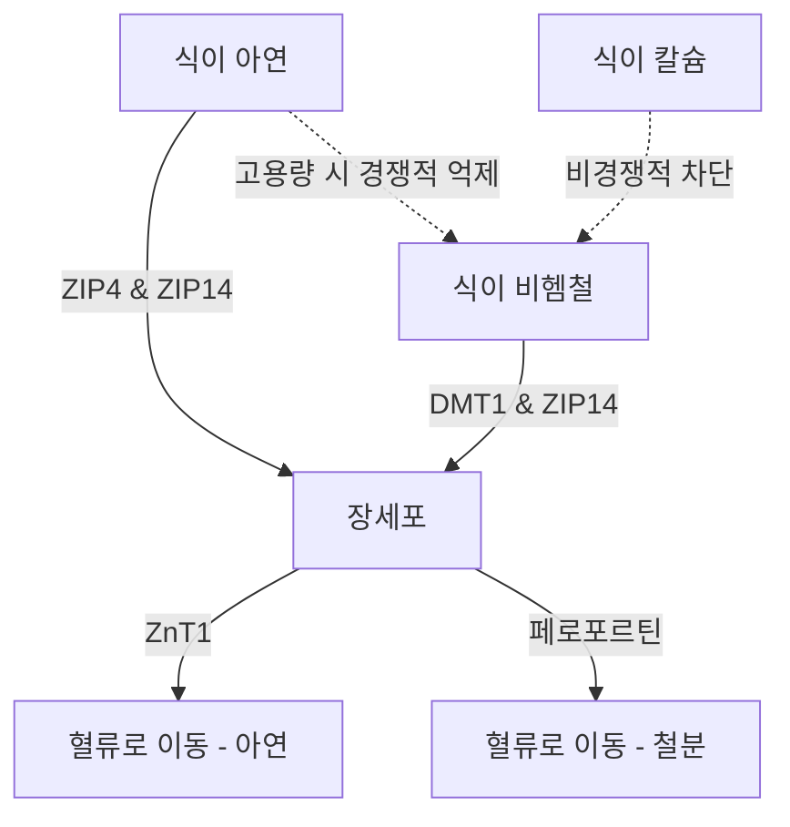

아연($\text{Zn}^{2+}$) 영양제 복용에는 일련의 생리학적, 생화학적 역설이 존재합니다. 아연은 300가지 이상의 효소 반응에 관여하는 필수 미네랄이지만, 경구 투여 시 급성 위장 장애, 다른 2가 양이온과의 경쟁적 억제, 전신 미네랄 고갈 등으로 인해 방해를 받는 경우가 많습니다. 이러한 문제를 해결하고 최적의 복용 프로토콜을 설계하려면 장내 수송체 역학, 점막 생화학 및 시간 약리학(Chronopharmacology)에 대한 상세한 이해가 필요합니다.

## 공복 역설: 점막 자극 vs 생체 이용률

경구로 투여되는 아연은 어려운 선택을 제시합니다. 공복에 섭취하면 세포 생체 이용률이 극대화되지만, 흔히 급성 위장 장애(메스꺼움)를 유발합니다. 반대로 아연을 식사와 함께 섭취하면 불편함은 완화되지만, 아연의 흡수를 방해하는 식이 억제제가 개입되어 실질적인 흡수율이 크게 떨어집니다.

### 위 자극 및 메스꺼움의 분자적 메커니즘
황산아연($\text{ZnSO}_4$)이나 염화아연($\text{ZnCl}_2$)과 같은 수용성 무기 아연염을 섭취하면 위장 내에서 빠르게 용해됩니다. 수용액에서 이러한 염은 완전히 해리되어 pH 4.0~5.0의 고농축 산성 환경을 만듭니다.

공복 상태에서는 음식물이 없어 위 점막이 보호받지 못합니다. 유리된 2가 아연 이온($\text{Zn}^{2+}$)에 갑자기 노출되면 위 상피 세포에 직접적인 부식 및 자극 효과가 발생합니다. 이 국소적인 자극은 위 벽세포를 자극하여 염산(HCl)을 과다 분비하게 하고, 위 pH를 더욱 낮추어 점막 미란(손상)을 유발합니다.

이러한 화학적, 산성 자극은 위벽에 분포된 미주 신경의 감각 뉴런을 통해 감지됩니다. 이 뉴런들이 활성화되면 뇌간으로 신호가 전달되며, 섭취 후 30분 이내에 즉각적인 메스꺼움, 위 배출 지연, 위경련으로 나타나는 구토 반사를 유발합니다.

### 흡수 차단: 피트산, 곡물 및 유제품

미주 신경 자극(메스꺼움)을 방지하기 위해 아연을 음식과 함께 섭취하면, 식이 억제제로 인해 생체 이용률이 심각하게 훼손됩니다. 가장 강력한 억제제는 **피트산(Phytic acid)**으로, 정제되지 않은 곡물, 콩류, 견과류 및 씨앗의 겉껍질에 고농도로 존재합니다.

십이지장의 생리적 pH에서 피트산은 유리된 $\text{Zn}^{2+}$ 이온을 포획(킬레이트화)하여 장내 흡수에 완전히 저항하는 매우 안정적이고 불용성인 복합체를 형성합니다. 인간은 상부 위장관에 피트산을 분해하는 피타아제 효소가 없기 때문에, 이 아연-피트산 복합체는 분해되지 않고 대변으로 배출됩니다.

> [!CAUTION]
> 방사성 동위원소를 이용한 정량적 연구에 따르면, 식사에 피트산을 단 50mg만 추가해도 아연 흡수율이 약 36% 감소합니다(기준치 22%에서 14%로 감소). 250mg의 더 높은 피트산 농도에서는 흡수율이 6~7%로 거의 완전히 억제됩니다.

또한 유제품도 독립적인 억제 효과를 발휘합니다. 우유의 주요 단백질인 **카제인**은 장내에서 아연 이온과 결합하여 유청 단백질 기반에 비해 생체 이용률을 크게 감소시킵니다.

### 아연 화합물 형태 및 내약성

| 화학적 분류 | 아연 화합물 형태 | 흡수율 | 위장 내약성 | 작용 기전 |
| :--- | :--- | :--- | :--- | :--- |
| **무기염** | 황산아연 ($\text{ZnSO}_4$) | ~20–49.9% | 강한 자극 (~15% 메스꺼움) | $\text{Zn}^{2+}$로 빠르게 해리됨; 산성 pH. |
| **유기염** | 글루콘산아연 | ~50.6–71.7% | 중간 내약성 (~5% 메스꺼움) | 중성 pH; 느린 해리로 자극 최소화. |
| **유기 킬레이트**| 비스글리시네이트 아연 | ~50–60% | 매우 높은 내약성 (< 5% 메스꺼움) | 글리신과 결합; 위산 분리 및 피트산 방해에 강함. |

### 과학적으로 최적화된 복용 프로토콜

공복 시의 메스꺼움 반사와 피트산에 의한 흡수 차단을 모두 완벽하게 피하려면 특정한 임상 프로토콜을 사용해야 합니다:

1. **유기 킬레이트로의 전환:** 무기 아연염 대신 아연 비스글리시네이트와 같은 pH 중성의 유기 금속-아미노산 킬레이트로 대체해야 합니다. 비스글리시네이트에서 $\text{Zn}^{2+}$ 이온은 두 개의 글리신 리간드와 공유 결합하여 위산에서의 조기 해리로부터 미네랄을 보호합니다.
2. **저-억제제 완충 식사:** 환자가 극도로 민감하여 음식이 반드시 필요한 경우, 아연은 피트산과 고용량 칼슘이 전혀 없는 가벼운 간식과 함께 섭취해야 합니다. 허용되는 식품에는 흰 사워도우 빵(발효를 통해 피트산이 분해됨)이나 단순 동물성 단백질(계란 또는 유청 분리 단백질)이 포함됩니다.

> [!TIP]
> **Pro Tip:** 메스꺼움을 피하면서 흡수를 극대화하는 이상적인 프로토콜은 이른 오후에 15~30mg의 원소 아연 비스글리시네이트를 피트산이 없는 가벼운 간식과 함께 섭취하고, 섭취 전후 2시간 동안 공복(커피 및 차 포함)을 유지하는 것입니다.

## 수송체 전쟁: DMT1과 ZIP14

소장의 장세포는 2가 금속 흡수를 위해 매우 경쟁이 치열한 무대입니다. 아연($\text{Zn}^{2+}$), 비헴철($\text{Fe}^{2+}$), 칼슘($\text{Ca}^{2+}$)은 중복되는 포화 가능한 경로를 공유합니다. 즉, 고용량 영양제를 동시에 투여하면 각 미네랄의 흡수가 직접적으로 억제됩니다.

### 수송체 환경: ZIP4, ZIP14, 그리고 DMT1
십이지장 장세포의 정단막(미세융모)에서 식이 아연의 주요 수입 통로는 ZIP4입니다. 비헴철(식물성/무기 철분)은 다른 경로인 DMT1에 의존합니다. 그러나 ZIP14라는 또 다른 중요한 수송체가 있습니다. 이 수송체는 아연 수송체로 분류되지만, 철분($\text{Fe}^{2+}$)도 매우 잘 수송할 수 있습니다.

$\text{Zn}^{2+}$와 $\text{Fe}^{2+}$는 전하와 이온 반경이 매우 유사하기 때문에 공유하는 수송 경로를 두고 치열하게 경쟁합니다. 치료용(고용량) 철분(100~400mg)이 아연과 동시에 투여되면 철분이 세포 흡수에서 아연을 이깁니다. 연구에 따르면 고용량 철분과 표준 25mg 아연을 동시에 섭취하면 아연 흡수율이 약 40~50% 감소합니다.

## 구리 고갈의 위험: 장세포 덫

장기적이고 고용량의 아연 보충이 갖는 가장 큰 위험은 전신 구리 결핍이 서서히 진행된다는 것입니다. 이 과정은 장세포 내의 금속 결합 단백질인 **메탈로티오네인(Metallothionein)**의 과발현에 의해 매개됩니다.

장기간 높은 용량의 아연(보통 하루 40~50mg 초과)을 섭취하면, 세포 내로 유입된 많은 양의 아연이 강력한 신호로 작용하여 메탈로티오네인 합성을 대규모로 유발합니다. 이 단백질은 아연에 의해 합성되지만, 실제로는 아연보다 구리($\text{Cu}^+$)에 대한 결합 친화도가 훨씬 높습니다.

따라서 음식을 통해 들어온 구리가 장세포로 흡수되면, 세포 내에 풍부한 메탈로티오네인 분자가 구리 이온을 빠르게 포획하여 가둬버립니다. 장세포는 3~5일마다 탈락되어 교체되므로, 세포 안에 갇힌 구리는 그대로 대변을 통해 배출됩니다. 시간이 지남에 따라 이는 심각한 구리 결핍으로 이어집니다.

> [!WARNING]
> 적절한 구리 보충(15:1 비율) 없이 하루 40mg을 초과하는 아연을 4주 이상 복용하면 심각한 구리 결핍을 유발할 위험이 있습니다. 이는 탈모, 비가역적인 신경 손상 및 빈혈을 유발할 수 있습니다.

### 안전한 아연-구리 복용 비율
장기 복용 시 메탈로티오네인에 의한 구리 고갈을 완벽히 예방하려면, 임상적으로 확립된 안전한 **아연-구리 비율인 8:1 ~ 15:1**을 지켜야 합니다. 아연 15mg당 구리 1mg을 섭취하면 이러한 위험을 제거할 수 있습니다.

## 아연의 시간 약리학: 수면과 일주기 리듬

영양소 투여 시기는 그 효능을 결정하는 주요 요인입니다. 아연은 멜라토닌(수면 호르몬) 합성에 필요한 기본적인 생화학적 조효소입니다. 아연 결핍은 멜라토닌 생성을 조절하는 효소를 억제하여 야간 멜라토닌 수치를 급격히 떨어뜨립니다(불면증).

또한 아연은 중추 신경계 내에서 직접적인 신경 조절제 역할을 합니다. 뇌가 흥분할 때 아연은 흥분성 NMDA 글루타메이트 수용체를 강력하게 차단하는 동시에 진정 효과가 있는 GABA 수용체의 작용을 강화합니다. 이러한 이중 작용은 깊고 회복력 있는 서파 수면(Slow-Wave Sleep)으로의 원활한 전환을 돕습니다.

### SuppTime 최적화 복용 프로토콜

| 시간대 | 영양제 조합 (Stack) | 시간 생물학적 근거 |
| :--- | :--- | :--- |
| **아침** | 프로바이오틱스 | 기상 직후의 낮은 위산 분비량이 유산균의 생존율을 극대화합니다. |
| **아침 식사** | 비헴철, 비타민 C, 비타민 D3 | 비타민 C는 철분 흡수를 높입니다. 칼슘과 아연은 피하세요. |
| **점심 / 오후** | 아연 비스글리시네이트(15-30mg) + 구리(1-2mg) | 구리 고갈을 막기 위해 15:1 비율로 섭취하며, 철분/칼슘과 완전히 분리합니다. |
| **밤** | 칼슘, 마그네슘 글리시네이트 | 마그네슘은 근육을 이완시키고 취침 전 GABA 수용체를 조절합니다. |
