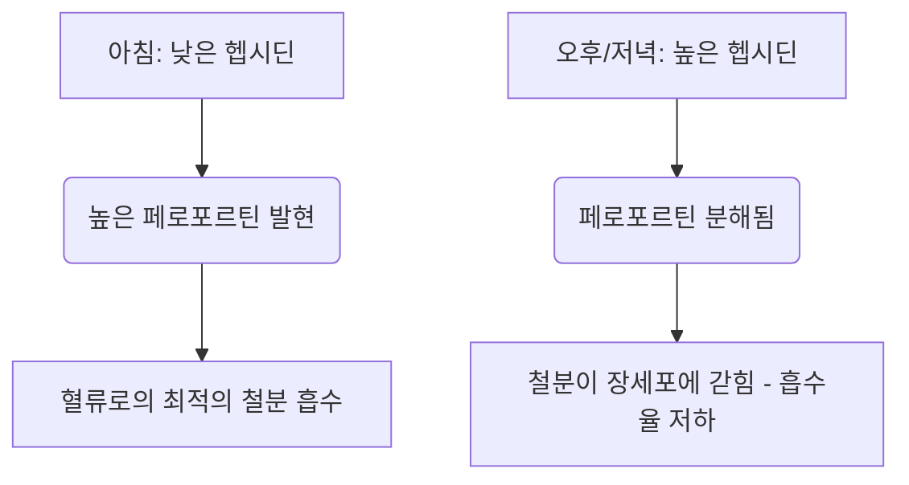

철분은 산소 운반, 세포 호흡 및 DNA 합성에 필수적인 조효소로 기능하는 미량 영양소입니다. 자연계에 풍부함에도 불구하고, 인간의 식단에서는 흔히 성장을 제한하는 영양소이기도 합니다. 인간은 철분을 능동적으로 배출하는 생리적 메커니즘이 없기 때문에, 체내 철분 균형은 전적으로 장내 흡수 단계에서 조절됩니다.

식이 철분은 크게 두 가지 형태로 존재합니다: **유기철(헴철)**과 **무기철(비헴철)**입니다.

헴철은 생체 이용률이 매우 높아 일반적으로 15%에서 35%의 비율로 흡수됩니다. 십이지장 장세포의 헴 운반 단백질 1(HCP1)을 통해 원형 그대로 운반되며, 일반적인 식단 억제제로부터 보호됩니다.

반면, 비헴철(무기철)은 식이 섭취량의 80% 이상을 차지하지만, 흡수율이 2%에서 20%에 불과하여 흡수 프로필이 크게 떨어집니다.

> [!TIP]
> 생리적 pH에서 비헴철은 주로 산화되고 불용성인 제2철(Fe³⁺) 상태로 존재합니다. 흡수되기 위해서는 먼저 장세포로 들어가기 전에 Dcytb라는 효소에 의해 용해성 있는 제1철(Fe²⁺) 상태로 환원된 후 DMT1을 통해 장세포로 들어가야 합니다.

## 헴철 vs 비헴철 경로 비교

| 특징 / 지표 | 헴철 경로 | 비헴철(무기철) 경로 |
| :--- | :--- | :--- |
| **식이 공급원** | 동물성 조직 (헤모글로빈, 미오글로빈) | 식물, 철분 강화 식품, 미네랄 염 |
| **첨단부 운반체** | 헴 운반 단백질 1 (HCP1) | 2가 금속 운반체 1 (DMT1) |
| **필요한 원자가 상태** | 포르피린 결합 복합체 | 제1철 (Fe²⁺) |
| **최적의 장내 pH** | 광범위하게 안정적; 위산의 영향을 받지 않음 | 용해를 위해 강한 산성(pH < 3.0) 필요 |
| **일반적인 흡수율**| 15% – 35% (높은 생체 이용률) | 2% – 20% (변동성 큼) |
| **식이 억제제에 대한 민감도** | 거의 없음; 포르피린 고리에 의해 보호됨 | 매우 높음 (피트산, 폴리페놀, 칼슘에 의해 억제됨) |

## 최적의 복용 시간 (시간 약리학)

비헴철 흡수를 최적화하려면 주로 간세포에서 합성되는 25개 아미노산 펩타이드 호르몬인 **헵시딘(Hepcidin)**의 일주기 리듬과 정밀하게 조율해야 합니다. 헵시딘은 기저외측 배출기인 페로포르틴(Ferroportin)에 결합하여 분해를 유도함으로써 철분 항상성을 조절하는 핵심 호르몬입니다. 결과적으로 혈중 헵시딘 수치가 높아지면 철분이 장세포 내에 갇혀 혈류로 들어가는 것을 막습니다.

### 헵시딘의 일주기 리듬
기본적인 생리적 조건에서 헵시딘 농도는 이른 아침에 가장 낮고, 오후 내내 꾸준히 상승하여 정점에 달하며, 밤에는 감소합니다.

이러한 일주기 곡선은 경구 철분 동역학에 직접적인 영향을 미칩니다. 철분 영양제를 **아침에 복용**하면 장세포의 페로포르틴 발현이 가장 높을 때 미네랄이 십이지장에 도달하게 됩니다. 반대로 오후나 저녁에 복용하면 철분이 높아진 헵시딘 차단과 경쟁하게 되어, 부분적인 철분 흡수율이 37% 감소합니다.

### 위산의 영향
무기철의 생물물리학적 상태는 위산 생성에 크게 의존합니다. 양성자 펌프 억제제(PPI - 위장약)를 통한 약리학적 위산 억제는 이러한 미세 환경을 심각하게 파괴하여 위 pH를 높이고 용해성 Fe²⁺를 불용성 Fe³⁺로 빠르게 산화시킵니다.

> [!WARNING]
> 경구 철분 영양제는 빈속에(가급적 식사 1시간 전 또는 2시간 후) 복용해야 하며, 위산 억제제(위장약)와는 엄격하게 분리하여 복용해야 합니다.

## 치명적인 상호작용 (절대 함께 섞지 말아야 할 것들)

경구 철분의 치료 효능은 다양한 식이 화합물 및 약물과 함께 섭취될 때 쉽게 손상됩니다.

### 칼슘
칼슘은 식단(우유, 치즈, 요구르트)으로 섭취하든 미네랄 영양제(탄산칼슘)로 섭취하든 관계없이 헴철 및 비헴철 흡수 모두를 강력하게 억제합니다. 철분이 포함된 식사와 함께 500mg의 탄산칼슘을 섭취하면 철분 흡수율이 50% 이상 감소합니다.

### 타닌과 폴리페놀
**홍차, 녹차, 허브차, 커피**에서 발견되는 폴리페놀은 매우 강력한 철분 킬레이트제입니다. 이러한 식물 유래 화합물은 제2철과 결합하여 십이지장 융모를 통과할 수 없는 매우 안정적이고 거대한 유기 금속 복합체를 형성합니다. 식사에 커피나 차 한 잔만 추가해도 비헴철 흡수율이 40%에서 70%까지 감소할 수 있습니다.

### 피트산
피트산은 통곡물, 시리얼, 견과류 및 콩류의 주요 인 저장 화합물입니다. 피트산 대 철분의 몰 비율은 식물성 식단에서 철분의 생체 이용률을 제한하는 가장 중요한 단일 요소입니다.

### 아연과 마그네슘
제1철, 아연, 마그네슘은 장세포 정점막(예: DMT1)을 통해 겹치는 운반 경로를 공유합니다. 치료 목적의 고용량 철분 복용 시 경쟁적 억제가 발생하여 철분 운반이 크게 억제됩니다. 철분 영양제를 아연이나 마그네슘과 함께 복용하지 마십시오.

### 갑상선 약물 (레보티록신)
경구 철분제와 레보티록신(갑상선 호르몬제)을 함께 복용하면 심각한 약물-영양소 상호작용이 발생합니다. 철분이 레보티록신 분자와 결합하여 불용성 복합체를 형성하여 레보티록신의 경구 생체 이용률을 20%에서 64%까지 감소시킵니다.

> [!CAUTION]
> 갑상선 치료 실패를 예방하기 위해서는 레보티록신과 철분 복용 사이에 최소 4시간의 엄격한 간격을 두어야 합니다.

## 최고의 조력자: 비타민 C

아스코르브산(비타민 C)은 비헴철 흡수를 돕는 가장 강력한 촉진제이며, 식이 피트산, 폴리페놀, 칼슘의 억제 효과를 압도할 수 있습니다.

이 시너지 관계는 다음과 같은 고효율 이중 생화학적 메커니즘을 통해 작동합니다:
1. **열역학적으로 유리한 환원:** 아스코르브산은 용해되지 않는 제2철 이온(Fe³⁺)을 운반할 준비가 된 매우 용해성이 높은 제1철(Fe²⁺) 형태로 빠르게 변환합니다.
2. **십이지장 킬레이션:** 아스코르브산은 보호막 역할을 하여 십이지장의 알칼리성 환경으로 넘어갈 때 철분이 피트산 및 폴리페놀과 결합하는 것을 방지합니다.

## 부작용 및 격일 복용 패러다임

매일 고용량의 경구 철분제를 처방하는 기존의 철분 결핍성 빈혈 치료법은 심각한 위장관 부작용(메스꺼움, 변비)과 전신적인 피드백 루프로 인해 실패하는 경우가 많습니다.

낮은 흡수율 때문에 표준 경구 철분 복용량의 최대 90%가 장에서 흡수되지 않고 남게 됩니다. 이 잉여 철분은 과산화수소와 반응하여 독성이 매우 강한 히드록실 라디칼을 생성하여 산화 스트레스와 점막 염증을 유발합니다.

또한, 고용량 철분제를 매일 섭취하면 전신적인 **"점막 차단(Mucosal Block)"**이 유발됩니다. 60mg 이상의 경구 철분 복용은 혈청 헵시딘의 급격한 상승을 유도하며, 이는 24시간 동안 지속됩니다. 다음 날 두 번째 철분 복용 시, 장세포는 이를 문맥 순환으로 배출하는 것이 물리적으로 차단됩니다. 철분은 갇혀 있다가 결국 배설됩니다.

> [!TIP]
> **격일 복용:** 이 헵시딘 매개 차단을 피하기 위해 현대 혈액학은 경구 철분을 **하루 걸러(이틀에 한 번)** 복용하는 방식으로 전환했습니다. 임상 시험에 따르면 철분을 48시간마다 섭취하면 매일 섭취하는 것보다 철분 흡수율이 40%~50% 증가하는 동시에 위장관 부작용이 크게 감소합니다.

### 임상 프로토콜 요약

*   **낮은 위 pH 필수:** 철분은 빈속에 물과 함께 복용하십시오.
*   **주요 식이 억제제 피하기:** 철분을 칼슘, 유제품, 커피 또는 차와 함께 복용하는 것을 엄격히 피하십시오.
*   **약물 간격 유지:** 철분과 레보티록신(갑상선약)은 최소 4시간 이상 간격을 두십시오.
*   **비타민 C 활용:** 철분을 비타민 C와 함께 복용하면 흡수율이 최대 300%까지 증가합니다.
*   **격일 복용 채택:** 헵시딘으로 인한 점막 차단을 방지하고 흡수율을 극대화하려면 48시간 간격으로 복용하십시오.
