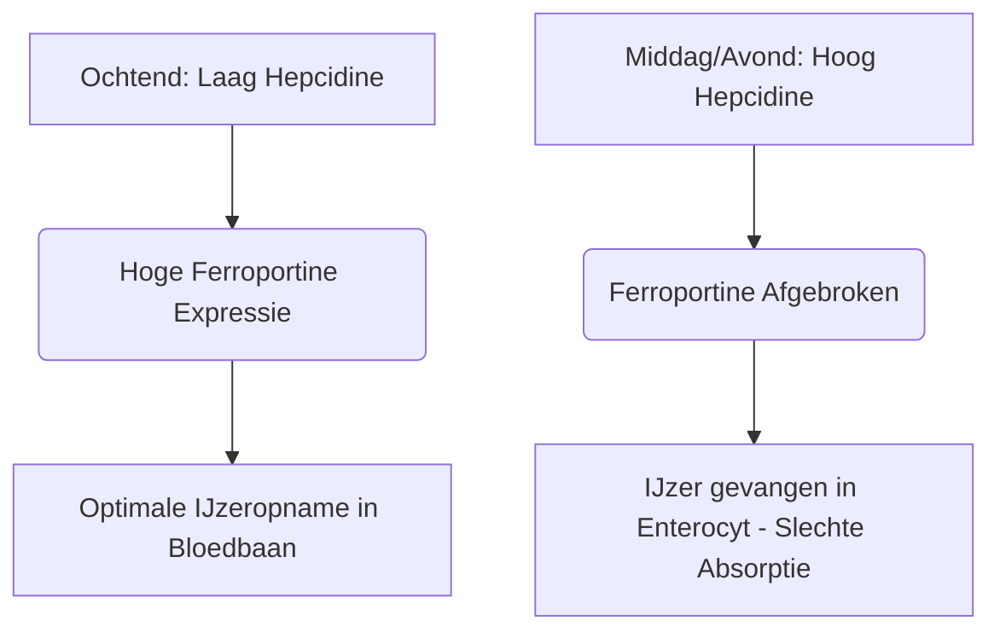

IJzer is een onmisbaar micronutriënt dat fungeert als structurele en katalytische cofactor bij zuurstoftransport, cellulaire ademhaling en DNA-synthese. Ondanks de ruime beschikbaarheid in de natuur, is ijzer vaak een groeibeperkende voedingsstof in het menselijk dieet. Omdat mensen geen fysiologisch mechanisme bezitten voor actieve ijzeruitscheiding, wordt de systemische ijzerbalans uitsluitend op het niveau van darmabsorptie gehandhaafd.

IJzer in de voeding komt voor in twee primaire vormen: **organisch (heem)ijzer** en **anorganisch (non-heem)ijzer**.

Heemijzer is zeer biologisch beschikbaar en wordt doorgaans geabsorbeerd met snelheden van 15% tot 35%. Het wordt intact getransporteerd over de apicale borstelzoom van duodenale enterocyten via Heme Carrier Protein 1 (HCP1) en blijft beschermd tegen standaard remmers in de voeding.

Non-heemijzer (anorganisch ijzer) vertegenwoordigt daarentegen meer dan 80% van de inname via de voeding, maar vertoont een sterk gecompromitteerd absorptieprofiel, met absorptiesnelheden variërend van slechts 2% tot 20%.

> [!TIP]
> Bij een fysiologische pH bevindt non-heemijzer zich voornamelijk in zijn geoxideerde, sterk onoplosbare ferri-staat (Fe³⁺). Om te worden geabsorbeerd, moet het een reductie ondergaan tot de oplosbare ferro-staat (Fe²⁺) door de apicale reductase duodenaal cytochroom b (Dcytb), voordat het de enterocyt binnenkomt via Divalent Metal Transporter 1 (DMT1).

## Heemijzer vs. Non-Heemijzer Routes

| Kenmerk / Metriek | Heemijzer Route | Non-Heem (Anorganisch) IJzer Route |
| :--- | :--- | :--- |
| **Voedingsbronnen** | Dierlijke weefsels (hemoglobine, myoglobine) | Planten, met ijzer verrijkte voedingsmiddelen, mineraalzouten |
| **Apicale Transporter** | Heme Carrier Protein 1 (HCP1) | Divalent Metal Transporter 1 (DMT1) |
| **Vereiste Valentiestatus** | Porfyrine-gebonden complex | Ferro (Fe²⁺) |
| **Optimale Luminale pH** | Grotendeels stabiel; niet beïnvloed door maagzuur | Vereist hoge zuurgraad (pH < 3.0) voor oplosbaarheid |
| **Typische Absorptie-efficiëntie**| 15% – 35% (hoge biologische beschikbaarheid) | 2% – 20% (zeer variabel) |
| **Gevoeligheid voor Remmers** | Verwaarloosbaar; beschermd door de porfyrinering | Extreem hoog (geremd door fytaten, polyfenolen, calcium) |

## Optimale Timing (Chronofarmacologie)

Het optimaliseren van de non-heemijzer absorptie vereist een nauwkeurige coördinatie met de dagelijkse kinetiek van **hepcidine**, een peptidehormoon van 25 aminozuren dat voornamelijk wordt gesynthetiseerd door hepatocyten. Hepcidine functioneert als de belangrijkste systemische regulator van de ijzerhomeostase door direct te binden aan de basolaterale exporteur Ferroportine, waardoor de afbraak ervan wordt geïnduceerd. Bijgevolg vangen verhoogde circulerende hepcidinespiegels ijzer op in de duodenale enterocyten en voorkomen ze de opname ervan in de bloedbaan.

### Circadiane Oscillaties van Hepcidine
Onder fysiologische basisomstandigheden bevinden hepcidineconcentraties zich in de vroege ochtend op hun dieptepunt, stijgen gestaag in de loop van de middag tot een piek, en dalen 's nachts.

Deze circadiane curve heeft direct invloed op de orale ijzerkinetiek. **Ochtendtoediening** van ijzersupplementen zorgt ervoor dat het mineraal in het duodenum aankomt wanneer de Ferroportine-expressie in de enterocyten op zijn hoogst is. Dosering in de middag of avond dwingt het ijzer daarentegen om te concurreren met een verhoogde hepcidineblokkade, wat resulteert in een vermindering van 37% van de fractionele ijzerabsorptie.

### De Impact van Maagzuur
De biofysische toestand van anorganisch ijzer is sterk afhankelijk van de maagzuurproductie. Farmacologische onderdrukking van maagzuur via Protonpompremmers (PPI's - maagbeschermers) verstoort deze micro-omgeving ernstig, waardoor de pH in de maag stijgt en de snelle oxidatie van oplosbaar Fe²⁺ naar sterk onoplosbaar Fe³⁺ wordt veroorzaakt.

> [!WARNING]
> Orale ijzersupplementen moeten op een lege maag worden ingenomen — idealiter 1 uur voor of 2 uur na een maaltijd — en strikt gescheiden van zuurremmende medicatie.

## De Fatale Interacties (Wat je NIET mag Mischen)

De therapeutische werkzaamheid van oraal ijzer komt gemakkelijk in het geding bij gelijktijdige inname met verschillende voedingscomponenten en geneesmiddelen.

### Calcium
Calcium, of het nu wordt ingenomen als zuivel in de voeding (melk, kaas, yoghurt) of als mineraalsupplement (calciumcarbonaat), is een krachtige remmer van zowel de heem- als de non-heemijzerabsorptie. Gelijktijdige inname van 500 mg calciumcarbonaat met een ijzerhoudende maaltijd vermindert de fractionele ijzerabsorptie met meer dan 50%.

### Tannines en Polyfenolen
Polyfenolen die worden aangetroffen in **zwarte thee, groene thee, kruidenthee en koffie** zijn uitzonderlijk effectieve ijzerchelatoren. Deze plantaardige verbindingen coördineren met ferri-ijzer om zeer stabiele, grote organometaalcomplexen te vormen die de duodenale borstelzoom niet kunnen passeren. Het toevoegen van slechts één kopje koffie of thee aan een maaltijd kan de non-heemijzerabsorptie met 40% tot 70% verminderen.

### Fytinezuur
Fytinezuur is de primaire fosforopslagverbinding in volle granen, noten en peulvruchten. De molaire verhouding tussen fytinezuur en ijzer is de allerbelangrijkste voedingsfactor die de biologische beschikbaarheid van ijzer in plantaardige diëten beperkt.

### Zink en Magnesium
Ferro-ijzer, zink en magnesium delen overlappende transportroutes over de apicale membraan van de enterocyt (zoals DMT1). Bij therapeutische ijzerdoseringen treedt competitieve remming op, waardoor het ijzertransport aanzienlijk wordt onderdrukt. Neem uw ijzersupplement niet samen met Zink of Magnesium in.

### Schildkliermedicatie (Levothyroxine)
Gelijktijdige toediening van orale ijzersupplementen met levothyroxine (T4) leidt tot een ernstige interactie tussen geneesmiddel en voedingsstof. Het ijzer coördineert met het levothyroxinemolecuul, waardoor een onoplosbaar complex wordt gevormd dat de orale biologische beschikbaarheid van levothyroxine met 20% tot 64% vermindert.

> [!CAUTION]
> Om klinisch falen van uw schildkliertherapie te voorkomen, moet er een strikte scheidingsperiode van minimaal 4 uur in acht worden genomen tussen de inname van levothyroxine en ijzer.

## De Ultieme Cofactor: Vitamine C

Ascorbinezuur (Vitamine C) is de krachtigste versterker van non-heemijzerabsorptie, in staat om de remmende effecten van fytaten, polyfenolen en calcium uit de voeding teniet te doen.

Deze synergetische relatie werkt via een zeer efficiënt tweeledig biochemisch mechanisme:
1. **Thermodynamisch Gunstige Reductie:** Ascorbinezuur zet onoplosbare ferri-ionen (Fe³⁺) snel om in de zeer oplosbare ferro-vorm (Fe²⁺), klaar voor transport.
2. **Duodenale Chelatie:** Ascorbinezuur werkt als een beschermend schild, waardoor wordt voorkomen dat het ijzer bindt aan fytaten en polyfenolen tijdens de overgang naar de alkalische omgeving van het duodenum.

## Bijwerkingen en het Paradigma van Dosering om de Dag

De traditionele aanpak voor de behandeling van bloedarmoede door ijzertekort — het dagelijks voorschrijven van hoge doses oraal ijzer — mislukt vaak als gevolg van ernstige gastro-intestinale bijwerkingen (misselijkheid, obstipatie) en systemische feedbackloops.

Vanwege de lage fractionele absorptie blijft tot 90% van een standaard orale ijzerdosis ongeabsorbeerd in het maag-darmkanaal. Dit overtollige ijzer reageert met waterstofperoxide om zeer giftige hydroxylradicalen te genereren, wat oxidatieve stress en mucosale ontsteking veroorzaakt.

Bovendien activeren dagelijkse hoge doses ijzersupplementen een systemische **"Mucosal Block" (Slijmvliesblokkade)**. Inname van een orale ijzerdosis ≥ 60 mg induceert een snelle piek in serum hepcidine die gedurende 24 uur verhoogd blijft. Als de volgende dag een tweede ijzerdosis wordt toegediend, worden de enterocyten fysiek geblokkeerd om het naar de portale circulatie te exporteren. Het ijzer zit vast en wordt uiteindelijk uitgescheiden.

> [!TIP]
> **Dosering Om de Dag:** Om deze hepcidine-gemedieerde blokkade te omzeilen, is de moderne hematologie verschoven naar het toedienen van oraal ijzer **om de dag**. Klinische studies bewijzen dat het innemen van ijzer om de 48 uur de fractionele ijzerabsorptie met 40% tot 50% verhoogt in vergelijking met opeenvolgende dagelijkse dosering, terwijl maag-darmklachten drastisch worden verminderd.

### Samenvatting van Klinische Protocollen

*   **Lage pH in de Maag is Essentieel:** Neem ijzer op een lege maag in met water.
*   **Vermijd Belangrijke Remmers in de Voeding:** Vermijd strikt de inname van ijzer samen met calcium, zuivel, koffie of thee.
*   **Houd Strikte Tussenpozen Tussen Medicatie Aan:** Scheid ijzer en levothyroxine met ten minste 4 uur.
*   **Benut Vitamine C:** Gelijktijdige toediening van ijzer met Vitamine C verhoogt de absorptie met wel 300%.
*   **Kies voor Dosering Om de Dag:** Neem orale ijzerdoses met een tussenpoos van 48 uur in om door hepcidine geïnduceerde slijmvliesblokkade te voorkomen en absorptie te maximaliseren.

## Bronnen

1. Stoffel NU, Zeder C, Brittenham GM, Moretti D, Zimmermann MB. [Iron absorption from oral iron supplements given on consecutive versus alternate days and as single morning doses versus twice-daily split dosing in iron-depleted women: two open-label, randomised controlled trials](https://pubmed.ncbi.nlm.nih.gov/29032957/). *Lancet Haematol.* 2017.
2. Campbell NR, Hasinoff BB. [Ferrous sulfate reduces thyroxine efficacy in patients with hypothyroidism](https://pubmed.ncbi.nlm.nih.gov/1443969/). *Ann Intern Med.* 1992.
3. Hallberg L, Hulthén L. [Effect of ascorbic acid intake on nonheme-iron absorption from a complete diet](https://pubmed.ncbi.nlm.nih.gov/11124756/). *Am J Clin Nutr.* 2000.
4. Lönnerdal B. [Calcium and iron absorption—mechanisms and public health relevance](https://pubmed.ncbi.nlm.nih.gov/21462112/). *Int J Vitam Nutr Res.* 2010.

*Dit artikel is uitsluitend bedoeld voor informatieve doeleinden en vormt geen medisch advies. Raadpleeg een gekwalificeerde zorgverlener voordat je je supplementen- of medicatieroutine wijzigt.*
