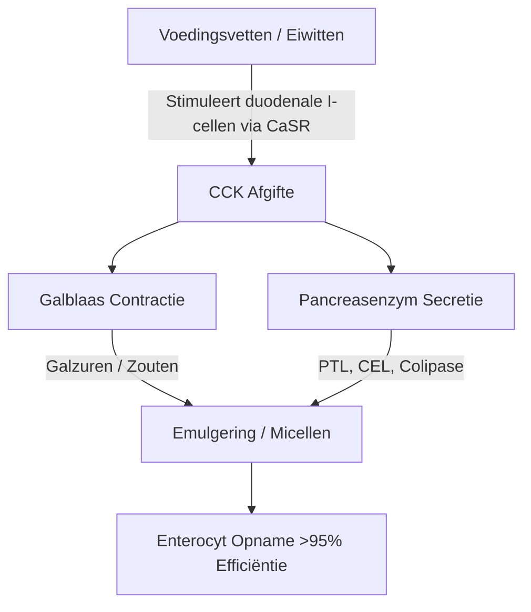
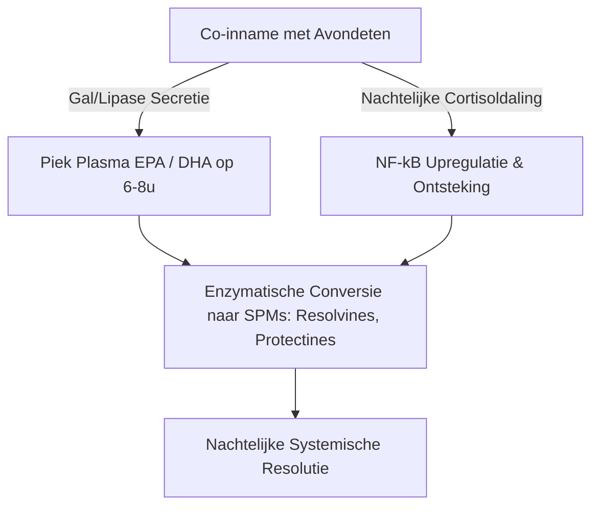

De therapeutische effectiviteit van lange-keten mariene omega-3 meervoudig onverzadigde vetzuren ($\text{PUFA}$'s), in het bijzonder eicosapentaeenzuur ($\text{EPA}$) en docosahexaeenzuur ($\text{DHA}$), wordt strikt bepaald door hun intestinale biologische beschikbaarheid. In de klinische voeding is een belangrijke oorzaak van therapeutisch falen de "lean-meal paradox" (het paradox van de magere maaltijd) — de toediening van sterk hydrofobe mariene lipiden tijdens het vasten of naast vetvrije maaltijden. Ondanks de inname van hoge nominale doses, verhindert het ontbreken van een gestructureerde lipide co-ingestie matrix de fysieke en enzymatische mechanismen die nodig zijn voor vetopname in het waterige lumen van het menselijk maag-darmkanaal. Deze klinische analyse beschrijft de biofysische, biochemische en chronofarmacologische principes die de vertering en opname van $\text{EPA}$ en $\text{DHA}$ bepalen.

## Vasten en het Paradox van de Magere Maaltijd

Het maag-darmkanaal is fundamenteel een waterig (op water gebaseerd) systeem. Wanneer hydrofobe (waterafstotende) lipiden zoals standaard visoliën worden ingenomen, komen ze in aanraking met de sterk polaire omgeving van maag- en darmsappen. Volgens de wetten van de thermodynamica minimaliseren hydrofobe moleculen hun contact met water, wat leidt tot een snelle fasescheiding. Dit zorgt ervoor dat de ingenomen olie samensmelt tot grote, onverdeelde lipide bolletjes die bovenop de waterige maagbrij drijven.

Het doorslikken van een omega-3 capsule met een glas water op een lege maag, of in combinatie met een maaltijd die alleen uit koolhydraten bestaat (zoals een stuk fruit of een droge boterham), slaagt er niet in de fysiologische processen op gang te brengen die nodig zijn om deze fasescheiding te overwinnen. Zonder fysieke emulgering blijft de verhouding tussen oppervlakte en volume van de vetfase extreem laag. De hydrofiele actieve locaties van pancreaslipasen kunnen de esterbindingen die diep in deze grote, hydrofobe druppels verborgen liggen, niet bereiken. Bijgevolg helpt het drinken van water bij visolie niet bij de opname; in plaats daarvan verdunt het de sporen van spijsverteringsenzymen die aanwezig zijn in de nuchtere toestand, waardoor de ongemulgeerde lipidebolletjes verder weg worden gehouden van het borstelzoommembraan van de enterocyten en het leidt tot malabsorptie en maag-darmklachten.

Om deze sterk hydrofobe lipiden in staat te stellen de ongeroerde waterlaag (unstirred water layer) van het darmslijmvlies te passeren, moeten ze worden omgezet in een thermodynamisch stabiele, in water dispergeerbare fase. Deze transformatie is volledig afhankelijk van de fysische chemie van micelvorming, een proces dat wordt geïnitieerd door hormoongemedieerde duodenale signalering.

## Galzouten en Micelvorming

De overgang van een drijvende, hydrofobe oliemassa naar opneembare microdruppeltjes vereist een gecoördineerde secretoire en neuromusculaire cascade in de twaalfvingerige darm (duodenum). De primaire hormonale aandrijver van dit proces is cholecystokinine ($\text{CCK}$), een peptide van 33 aminozuren gesynthetiseerd en afgescheiden door entero-endocriene I-cellen in het slijmvlies van het duodenum en het bovenste deel van het jejunum.



Onder fysiologische omstandigheden stimuleert de aanwezigheid van lange-keten vetzuren en gedeeltelijk verteerde eiwitten in het duodenale lumen de calcium-sensing receptor ($\text{CaSR}$) op I-cellen, wat de snelle exocytose van $\text{CCK}$ in de bloedbaan triggert. Eenmaal vrijgegeven bindt $\text{CCK}$ aan $\text{CCK}_A$-receptoren op de galblaaswand, waardoor deze samentrekt, terwijl tegelijkertijd de sfincter van Oddi ontspant en de acinaire cellen van de alvleesklier (pancreas) worden gestimuleerd om hun spijsverteringsenzymen vrij te geven.

De galzuren die door de galblaas worden vrijgegeven — voornamelijk amfipatische natriumzouten van cholzuur en chenodeoxycholzuur — zijn essentiële biologische detergentia (reinigingsmiddelen). Wanneer de galzuurconcentraties in het duodenum de kritische micelconcentratie ($\text{CMC}$) overschrijden, rangschikken ze zich rond de hydrofobe lipidedruppeltjes. De hydrofobe steroïdkern van het galzout associeert zich met de lipidefase, terwijl de polaire, hydrofiele geconjugeerde groep (glycine of taurine) naar het waterige duodenale lumen is gericht.

Door de mechanische werking van intestinale peristaltiek worden deze met gal gecoate druppeltjes tot gemengde micellen geknipt (sheared). Deze bolvormige colloïdale aggregaten hebben een diameter van slechts 3 tot 10 nanometer, waardoor het lipideoppervlak dat is blootgesteld aan pancreaslipasen met enkele duizenden keren wordt vergroot. Zonder de gelijktijdige inname van gezonde voedingsvetten (zoals extra vergine olijfolie, avocado of weide-eidooiers) om de drempel voor $\text{CCK}$-afgifte te activeren, treedt er geen samentrekking van de galblaas op. In deze toestand blijven de galzuurspiegels onder de $\text{CMC}$, is de afscheiding van pancreaslipase minimaal en kunnen de ingenomen omega-3 lipiden geen micellen vormen, waardoor opname wordt voorkomen.

## Strijd van Biochemische Vormen: TG vs. EE vs. PL

Commercieel verkrijgbare omega-3 supplementen bestaan in drie primaire moleculaire vormen: natuurlijke of herveresterde triglyceriden ($\text{TG}$/$\text{rTG}$), ethylesters ($\text{EE}$) en fosfolipiden ($\text{PL}$). De moleculaire structuur van deze dragers bepaalt hun verteringssnelheid, lipase-afhankelijkheid en biologische beschikbaarheid.

```text
Triglyceride (TG) Vorm:            Ethylester (EE) Vorm:          Fosfolipide (PL) Vorm:
     ┌─ Glycerolruggengraat             ┌─ Ethanolmolecule             ┌─ Fosfaatkop (Polair)
     ├─ Vetziel (EPA)                   └─ Vetziel (EPA)               ├─ Vetziel (EPA)
     ├─ Vetziel (DHA)                                                  └─ Vetziel (DHA)
     └─ Vetziel (Ander)
```

In natuurlijke en herveresterde triglyceriden ($\text{TG}$/$\text{rTG}$) zijn drie vetzuren ($\text{EPA}$/$\text{DHA}$) gebonden aan een koolstof-glycerolruggengraat. Tijdens de spijsvertering hydrolyseert de pancreas triglyceride lipase ($\text{PTL}$), werkend in combinatie met zijn cofactor colipase, de esterbindingen op de posities $sn\text{-}1$ en $sn\text{-}3$. Dit produceert twee vrije vetzuren en een $sn\text{-}2$-monoglyceride, die beide zeer polair, gemakkelijk te micelliseren en met meer dan 95% efficiëntie door enterocyten kunnen worden opgenomen.

Omgekeerd is de ethylester ($\text{EE}$) vorm een synthetisch product dat ontstaat tijdens chemische concentratie. De glycerolruggengraat wordt verwijderd en elk individueel vetzuur wordt veresterd aan een ethanolmolecuul ($\text{CH}_3\text{CH}_2\text{OH}$). Deze synthetische esterbinding is zeer resistent tegen menselijke pancreasenzymen. In vitro en in vivo studies tonen aan dat menselijke pancreaslipase de vetzuur-ethanolbinding in $\text{EE}$ hydrolyseert met een snelheid die 10 tot 50 keer langzamer is dan de glycerylesterbindingen in triglyceriden.

Vanwege deze trage hydrolyse is $\text{EE}$-absorptie in hoge mate afhankelijk van een enorme afgifte van pancreaslipasen en galzouten, die alleen wordt getriggerd door een vetrijke maaltijd. Bij inname met een vetarm dieet kan de beperkt beschikbare pancreaslipase de $\text{EE}$-bindingen niet efficiënt splitsen, wat leidt tot een slechte biologische beschikbaarheid (vaak dalend tot ongeveer 20%) en waardoor onverwerkte synthetische esters in de dikke darm terechtkomen, waar ze gastro-intestinale bijwerkingen kunnen veroorzaken.

De fosfolipide ($\text{PL}$) vorm, voornamelijk afkomstig uit Antarctische krillolie (Euphausia superba), heeft een amfipatische structuur waarbij $\text{EPA}$ en $\text{DHA}$ zijn gebonden aan een fosfatidylcholine-ruggengraat. De zeer polaire fosfaatkopgroep maakt fosfolipiden van nature dispergeerbaar in water. Hierdoor kunnen $\text{PL}$-vormen zichzelf emulgeren (self-emulsifying) en spontane microdruppeltjes vormen in het maag-darmkanaal, waardoor de absolute vereiste voor galzout-gestimuleerde micelvorming wordt omzeild. Fosfolipiden worden ook verteerd via fosfolipase $\text{A}_2$ en kunnen rechtstreeks door de enterocyten worden opgenomen als lysofosfolipiden, wat resulteert in een hoge biologische beschikbaarheid, zelfs onder nuchtere of vetarme omstandigheden.

| Biochemische Vorm | Moleculaire Drager / Ruggengraat | Gemiddelde Absorptiesnelheid (Magere Maaltijd) | Gemiddelde Absorptiesnelheid (Vetrijke Maaltijd) | Relatieve Biologische Beschikbaarheid (vs. EE Basislijn) | Pancreaslipase Afhankelijkheid |
| --- | --- | --- | --- | --- | --- |
| Ethylester (EE) | Ethanol ($\text{CH}_3\text{CH}_2\text{OH}$) | $\approx 20\%$ | $\approx 60\%$ | Basislijn ($100\%$) | Absoluut; wordt 10-50x langzamer gehydrolyseerd dan TG |
| Triglyceride (TG / rTG) | Glycerolruggengraat | $\approx 68\%$ | $\approx 90\%$ | $124\%$ tot $186\%$ | Hoog; snel gesplitst in 2-FFA en 1-MAG |
| Fosfolipide (PL) | Fosfatidylcholine | $\approx 80\%$ tot $95\%$ | $>95\%$ | $168\%$ tot $500\%$ | Minimaal; zelf-emulgerend, omzeilt bepaalde lipasen |

> [!WARNING]
> Personen met exocriene pancreasinsufficiëntie (EPI), galwegdyskinesie of post-cholecystectomie (verwijderde galblaas) vertonen een ernstig verminderde endogene lipidenvertering. Voor deze klinische populaties vormt de toediening van synthetische ethylester (EE) formuleringen onder vetarme dieetbeperkingen een hoog risico op volledige malabsorptie en gastro-intestinaal ongemak, aangezien de noodzakelijke enzymatische splitsing in deze toestanden vrijwel onbestaande is.

## Lipide-oxidatie en de Absolute Noodzaak van Vitamine E

De structurele kenmerken die $\text{EPA}$ en $\text{DHA}$ biologisch actief maken, maken ze ook zeer onstabiel. $\text{EPA}$ bevat vijf en $\text{DHA}$ bevat zes methyleen-onderbroken dubbele bindingen. De koolstof-waterstofbindingen aan de bis-allylische methyleenkoolstoffen ($\text{-CH=CH-CH}_2\text{-CH=CH-}$) hebben lage bindingsdissociatie-energieën. Dit maakt ze uitzonderlijk kwetsbaar voor de aanval van vrije radicalen en niet-enzymatische lipideperoxidatie.

```text
Fase 1: Initiatie
  [PUFA Koolstof-Waterstof Binding] + [ROS / Vrije Radicaal] ──> [Koolstofgecentreerd Lipideradicaal (R•)]

Fase 2: Propagatie
  [Koolstofgecentreerd Lipideradicaal (R•)] + [O2] ──> [Lipide-peroxylradicaal (ROO•)]
  [Lipide-peroxylradicaal (ROO•)] + [Ongeoxideerde PUFA] ──> [Lipidehydroperoxide (ROOH)] + [Nieuw Lipideradicaal (R•)]

Fase 3: Ontleding (Decompositie)
  [Onstabiel Lipidehydroperoxide (ROOH)] ──> [Toxische Aldehyden (MDA / HHE)]
```

Eenmaal ingenomen wordt de visolie blootgesteld aan een omgeving van $37^\circ\text{C}$ (lichaamstemperatuur), maagzuur en opgeloste moleculaire zuurstof ($\text{O}_2$). Deze omgeving versnelt de lipideperoxidatiecascade door drie verschillende fasen:

1. **Initiatie:** Een reactieve zuurstofsoort ($\text{ROS}$) onttrekt een waterstofatoom van een bis-allylische koolstof, waardoor een koolstofgecentreerd lipideradicaal ($\text{R}^\bullet$) wordt gegenereerd.
2. **Propagatie:** Het lipideradicaal reageert snel met moleculaire zuurstof ($\text{O}_2$) om een lipide-peroxylradicaal ($\text{ROO}^\bullet$) te vormen. Dit peroxylradicaal onttrekt vervolgens een waterstofatoom aan een aangrenzende, ongeoxideerde $\text{PUFA}$-molecuul, wat een lipidehydroperoxide ($\text{ROOH}$) en een nieuw lipideradicaal genereert, waardoor de kettingreactie wordt voortgezet.
3. **Ontleding:** De onstabiele lipidehydroperoxiden vallen uiteen in zeer reactieve, cytotoxische secundaire oxidatieproducten, waaronder alkenalen zoals malondialdehyde ($\text{MDA}$) en 4-hydroxyhexenal ($\text{HHE}$).

Deze secundaire oxidatieproducten worden gemakkelijk via de darm opgenomen, geïncorporeerd in chylomicronen en lipoproteïnen met lage dichtheid ($\text{LDL}$), en kunnen systemische oxidatieve stress, endotheelschade en atherogenese induceren.

Om dit proces te stoppen, is de toevoeging van een ketenberekend, in vet oplosbaar antioxidant in de formule vereist. Natuurlijke vitamine E, specifiek d-alfa-tocoferol ($\text{C}_{29}\text{H}_{50}\text{O}_2$), is in hoge mate geoptimaliseerd voor deze rol. D-alfa-tocoferol fungeert als een waterstofdonor, die zijn fenolische waterstofatoom snel overdraagt aan het reactieve lipide-peroxylradicaal ($\text{ROO}^\bullet$) met een extreem snelle reactiesnelheidsconstante van ongeveer $10^6\,\text{M}^{-1}\text{s}^{-1}$.

Het resulterende tocoferoxylradicaal is zeer stabiel vanwege de resonantiedelokalisatie van zijn ongepaarde elektron over de chromanolring, waardoor wordt voorkomen dat het naburige vetzuurketens aanvalt. Dit stopt de kettingreactie, beschermt de structurele integriteit van de $\text{EPA}$- en $\text{DHA}$-moleculen zodat ze hun doelweefsels in actieve, niet-geoxideerde staat kunnen bereiken.

## Chronofarmacologie en het Nachtelijke Ontstekingsremmende Venster

In de lipidenbiochemie is timing een kritieke factor. Het innemen van omega-3 supplementen in combinatie met de grootste, meest vetrijke maaltijd van de dag (meestal het avondeten) optimaliseert zowel de opname als de natuurlijke nachtelijke herstelprocessen van het lichaam.



Ten eerste is het avondeten historisch gezien voor veel mensen de meest vethoudende maaltijd van de dag. Dit levert het fysieke lipidenvolume dat nodig is om maximale $\text{CCK}$-afgifte te stimuleren, wat leidt tot krachtige galblaascontractie, rijke galsecretie en hoge pancreaslipase-activiteit. Dit optimaliseert micelvorming en spijsverteringskinetiek, en zorgt ervoor dat vrijwel de gehele ingenomen dosis met succes wordt opgenomen.

Ten tweede komt avondtoediening overeen met de circadiane immuun- en ontstekingscycli van het lichaam. Endogene cortisolspiegels dalen 's avonds laat en in het begin van de nacht van nature tot hun laagste dagelijkse niveau. Cortisol is een krachtig ontstekingsremmend hormoon; wanneer de niveaus dalen, ondergaan systemische ontstekingsroutes — zoals die welke worden gereguleerd door de pro-inflammatoire transcriptiefactor $\text{NF}\text{-}\kappa\text{B}$ — een relatieve "up-regulatie" (opwaartse regulatie).

Door omega-3 in te nemen tijdens het avondeten, worden de maximale concentraties $\text{EPA}$ en $\text{DHA}$ in het plasma en celmembranen 6 tot 8 uur later bereikt, wat direct samenvalt met dit nachtelijke ontstekingsvenster. Tijdens deze fase gebruikt het lichaam deze vetzuren als substraten voor de enzymatische synthese van "Specialized Pro-resolving Mediators" ($\text{SPM}$'s) — in het bijzonder resolvines, protectines en maresines — via de cyclo-oxygenase ($\text{COX}$) en lipoxygenase ($\text{LOX}$) routes. Deze $\text{SPM}$'s lossen actieve chronische micro-ontstekingen op, bevorderen celvernieuwing en ondersteunen weefselherstel tijdens de slaap.

Bovendien biedt avondtoediening van omega-3's, en specifiek $\text{DHA}$, unieke neurologische voordelen. $\text{DHA}$ is een belangrijk structureel lipide in neuronale membranen en speelt een belangrijke rol in de circadiane klok van de hersenen. Het werkt op klokgenen (zoals BMAL1 en CLOCK) die verantwoordelijk zijn voor de regulatie van de slaap-waakcyclus.

De nachtelijke integratie van $\text{DHA}$ in synaptische membranen ondersteunt neuronale communicatie, verhoogt de synthese van serotonine en optimaliseert de omzetting in melatonine. Klinische studies tonen aan dat een consequente avondlijke omega-3-suppletie de slaapefficiëntie aanzienlijk verbetert, de inslaaptijd verkort en de slaapfragmentatie-index (nachtelijk ontwaken) verlaagt.

> [!TIP]
> Om de cellulaire bio-incorporatie van lange-keten omega-3 vetzuren te maximaliseren, moeten clinici patiënten aanraden hun dagelijkse dosis samen te nemen met de meest vetrijke maaltijd van de dag. De co-ingestie van ten minste 10-15 gram gezonde enkelvoudig of meervoudig onverzadigde vetten (bijv. extra vergine olijfolie of avocado) is voldoende om de drempel voor de afgifte van cholecystokinine te activeren die nodig is voor optimale micelvorming.

## Klinische Syntheses en Praktische Aanbevelingen

Het maximaliseren van het therapeutische potentieel van omega-3 supplementatie vereist een verschuiving van de eenvoudige inname van capsules met een hoge nominale dosis, naar een benadering op basis van lipidebiochemie en spijsverteringskinetiek. De traditionele praktijk om visolie met water op een lege maag in te nemen, leidt vaak tot slechte absorptie en maag-darmklachten.

Voor optimale therapeutische resultaten zouden clinici prioriteit moeten geven aan herveresterde triglyceride ($\text{rTG}$) of fosfolipide ($\text{PL}$) formuleringen, die superieure absorptiekinetiek vertonen en minder afhankelijk zijn van vetrijke maaltijden dan synthetische ethylesters ($\text{EE}$).

Ongeacht de gekozen formulering, moet het supplement worden ingenomen met een maaltijd die ten minste 10 tot 15 gram voedingsvet bevat. Deze lipidedrempel is nodig om de duodenale $\text{CCK}$-signaleringscascade in gang te zetten, die de samentrekking van de galblaas en de uitscheiding van pancreaslipase initieert, om zo een volledige micelvorming mogelijk te maken.

Om deze zeer onstabiele $\text{PUFA}$'s bovendien te beschermen tegen oxidatieve schade in het lichaam, moet de formulering altijd een natuurlijk, vetoplosbaar antioxidant zoals d-alfa-tocoferol (Vitamine E) bevatten.

Ten slotte zorgt het afstemmen van supplementatie op de avondmaaltijd ervoor dat de piekabsorptie samenvalt met de natuurlijke nachtelijke anti-inflammatoire en cellulaire herstelroutes van het lichaam, waardoor de cardiovasculaire, immunologische en neurologische voordelen van $\text{EPA}$ en $\text{DHA}$ worden gemaximaliseerd.

## Bronnen

1. Nordøy A, et al. [Absorption of the n-3 eicosapentaenoic and docosahexaenoic acids as ethyl esters and triglycerides by humans](https://pubmed.ncbi.nlm.nih.gov/1826985/). *American Journal of Clinical Nutrition.* 1991.
2. Offman E, Marenco T, Ferber S, Johnson J, Kling D, Curcio D, Davidson M. [Steady-state bioavailability of prescription omega-3 on a low-fat diet is significantly improved with a free fatty acid formulation compared with an ethyl ester formulation: the ECLIPSE II study](https://pubmed.ncbi.nlm.nih.gov/24124374/). *Vascular Health and Risk Management.* 2013.
3. Schuchardt JP, Schneider I, Meyer H, Neubronner J, von Schacky C, Hahn A. [Incorporation of EPA and DHA into plasma phospholipids in response to different omega-3 fatty acid formulations - a comparative bioavailability study of fish oil vs. krill oil](https://pubmed.ncbi.nlm.nih.gov/21854650/). *Lipids in Health and Disease.* 2011.
4. Brown JE, Wahle KW. [Effect of fish-oil and vitamin E supplementation on lipid peroxidation and whole-blood aggregation in man](https://pubmed.ncbi.nlm.nih.gov/2282693/). *Clinica Chimica Acta.* 1990.

*Dit artikel is uitsluitend bedoeld voor informatieve doeleinden en vormt geen medisch advies. Raadpleeg een gekwalificeerde zorgverlener voordat je je supplementen- of medicatieroutine wijzigt.*
