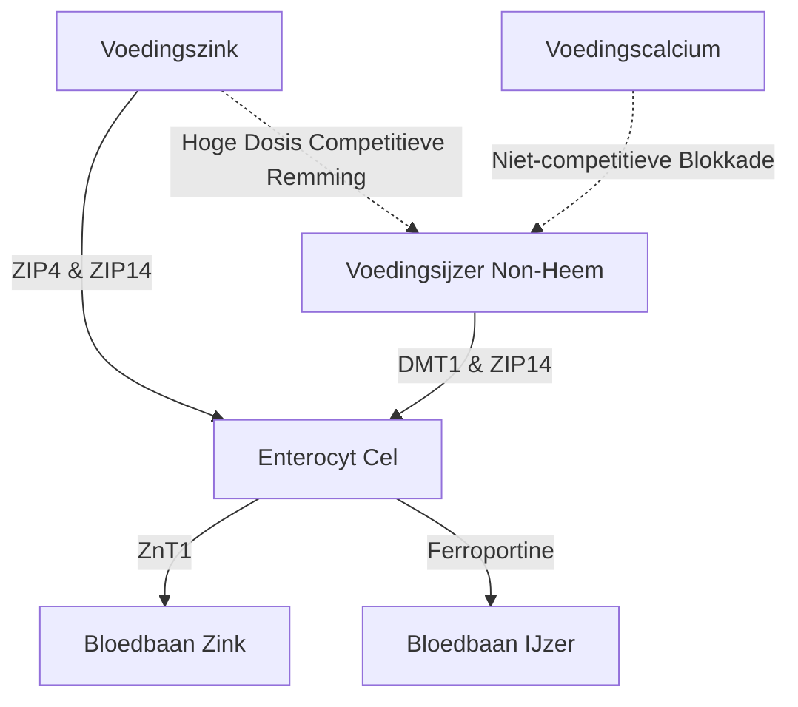

De toediening van zinksupplementen ($\text{Zn}^{2+}$) brengt een reeks fysiologische en biochemische paradoxen met zich mee. Hoewel zink een essentieel sporenmineraal is dat betrokken is bij meer dan 300 enzymatische reacties, wordt de orale inname vaak belemmerd door acute gastro-intestinale klachten, competitieve remming door andere tweewaardige kationen en systemische uitputting van andere mineralen. Om deze problemen op te lossen, is een gedetailleerd begrip nodig van darmtransporterkinetiek, mucosale biochemie en chronofarmacologie.

## De Lege-Maag-Paradox: Mucosale Irritatie vs. Biobeschikbaarheid

Oraal toegediend zink stelt ons voor een moeilijke keuze: inname op een lege maag maximaliseert de cellulaire biobeschikbaarheid, maar veroorzaakt vaak acute maagklachten (misselijkheid). Het innemen van zink met de maaltijd verzacht daarentegen de klachten, maar introduceert voedingsantagonisten (remmers) die de fractionele absorptie sterk verminderen.

### Moleculaire Mechanismen van Maagirritatie en Misselijkheid
De inname van sterk in water oplosbare, anorganische zinkzouten, zoals zinksulfaat ($\text{ZnSO}_4$) of zinkchloride ($\text{ZnCl}_2$), leidt tot een snelle oplossing in het maaglumen. In waterige oplossingen dissociëren deze zouten volledig, waardoor een sterk geconcentreerde en zure lokale omgeving ontstaat met een pH van ongeveer 4.0 tot 5.0.

In nuchtere toestand laat de afwezigheid van een voedselbolus het maagslijmvlies ongebufferd. De plotselinge blootstelling aan vrije tweewaardige zinkionen ($\text{Zn}^{2+}$) oefent een direct bijtend en irriterend effect uit op de maagepitheelcellen. Deze lokale irritatie stimuleert de maagwandcellen om hypersecretie van zoutzuur (HCl) te veroorzaken, waardoor de maag-pH verder daalt en mucosale erosie wordt geïnduceerd.

Dit activeert een uitgebreid netwerk van vagale sensorische neuronen in de maagwand. Dit initieert een centraal gemedieerde braakreflex, die zich manifesteert als onmiddellijke misselijkheid en maagkrampen binnen 30 minuten na inname.

### De Biobeschikbaarheidsblokkade: Fytaten, Granen en Zuivel

Wanneer zink met voedsel wordt ingenomen om vagale stimulatie te voorkomen, wordt de biobeschikbaarheid ervan ernstig in gevaar gebracht door voedingsremmers. De krachtigste van deze remmers is **fytaat** (fytinezuur), dat sterk geconcentreerd is in de buitenste schillen van ongeraffineerde granen, peulvruchten, noten en zaden.

Bij de fysiologische pH van de twaalfvingerige darm werkt fytaat als een agressief ligand dat vrije $\text{Zn}^{2+}$-ionen cheleert en zeer stabiele, onoplosbare en structureel complexe precipitaten vormt die volledig resistent zijn tegen darmabsorptie. Omdat mensen geen endogene fytase-enzymen hebben, blijven deze zink-fytaatcomplexen ongehydrolyseerd en worden ze met de ontlasting uitgescheiden.

> [!CAUTION]
> Kwantitatieve studies met radioactieve markers tonen aan dat toevoeging van slechts 50 mg fytaat aan een maaltijd de fractionele zinkabsorptie met ongeveer 36% vermindert (van een basislijn van 22% naar 14%).

Bovendien hebben zuivelproducten een onafhankelijk remmend effect. **Caseïne**, de belangrijkste eiwitfractie in koemelk, bindt zinkionen in het darmlumen, waardoor de biobeschikbaarheid aanzienlijk wordt verminderd in vergelijking met wei-eiwitten.

### Zinkverbindingen en Verdraagbaarheid

| Chemische Klasse | Zinkverbinding | Fractionele Absorptie | Maagtolerantie | Werkingsmechanisme |
| :--- | :--- | :--- | :--- | :--- |
| **Anorganisch Zout** | Zinksulfaat ($\text{ZnSO}_4$) | ~20–49.9% | Hoge Irritatie (~15% misselijkheid) | Dissocieert snel in vrije $\text{Zn}^{2+}$; zure pH. |
| **Organisch Zout** | Zinkgluconaat | ~50.6–71.7% | Gemiddelde Tolerantie (~5% misselijkheid) | Neutrale pH; langzame dissociatie. |
| **Organisch Chelaat**| Zinkbisglycinaat | ~50–60% | Zeer Hoge Tolerantie (< 5% misselijkheid) | Gebonden aan glycine; weerstaat maagdissociatie en fytaatinterferentie. |
| **Organisch Chelaat**| Zinkpicolinaat | Hoog | Hoge Tolerantie | Gecomplexeerd met picolinezuur; uitstekende weefselaccumulatie. |

### Wetenschappelijk Optimaal Protocol

Om zowel de misselijkheid op een lege maag als de absorptieblokkade door fytaat te voorkomen, moet een specifiek klinisch protocol worden gevolgd:

1. **Overstappen op Organische Chelaten:** Vervang anorganische zinkzouten door organische, pH-neutrale metaal-aminozuurchelaten, zoals Zinkbisglycinaat. In Zinkbisglycinaat is het $\text{Zn}^{2+}$-ion covalent gebonden aan twee glycineliganden, waardoor het mineraal wordt beschermd tegen vroegtijdige dissociatie in maagzuur.
2. **Gebruik Alternatieve Absorptieroutes:** In tegenstelling tot anorganisch zink worden organische chelaten intact geabsorbeerd via alternatieve, zeer efficiënte routes (peptidencotransporters).
3. **Buffervoedsel met Lage Antagonisten:** Als een patiënt zink met voedsel moet innemen, doe dit dan uitsluitend met een lichte snack die volledig vrij is van fytaten en hooggedoseerd calcium. Toegestane voedingsmiddelen zijn wit zuurdesembrood (fermentatie breekt fytaat af) of dierlijke eiwitten (zoals eieren of wei-isolaat).

> [!TIP]
> **Pro Tip:** Om de absorptie te maximaliseren en misselijkheid te vermijden, is het ideale protocol om 's middags 15–30 mg elementair Zinkbisglycinaat in te nemen met een lichte, fytaatvrije snack, waarbij u 2 uur ervoor en erna niet eet of koffie/thee drinkt.

## De Transporter Oorlogen: DMT1 en ZIP14

De enterocyt (darmcel) van de dunne darm is een zeer competitieve arena voor de absorptie van tweewaardige metalen. Zink ($\text{Zn}^{2+}$), non-heemijzer ($\text{Fe}^{2+}$) en calcium ($\text{Ca}^{2+}$) delen overlappende, verzadigbare routes. Dit betekent dat gelijktijdige toediening in hoge doses de opname van elkaar onderdrukt.

### Het Transporter Landschap: ZIP4, ZIP14 en DMT1
Aan de apicale membraan van de duodenale enterocyten is de primaire importeur voor voedingszink ZIP4. Non-heemijzer (plantaardig/anorganisch ijzer) is afhankelijk van een andere apicale route: DMT1. Er is echter nog een andere kritische transporter, ZIP14. Hoewel deze wordt geclassificeerd als een zinktransporter, is hij ook in staat ijzer ($\text{Fe}^{2+}$) te transporteren.

Omdat $\text{Zn}^{2+}$ en $\text{Fe}^{2+}$ zeer vergelijkbaar zijn in lading en ionstraal, concurreren ze intens om gedeelde transportroutes (zoals ZIP14). Wanneer therapeutische (hoge) doses ijzer (100–400 mg) tegelijkertijd met zink worden toegediend, verdringt het ijzer het zink. Onderzoek toont aan dat het gelijktijdig innemen van hoge doses ijzer met een standaard zinkdosis van 25 mg de zinkabsorptie met ongeveer 40-50% vermindert.

## Het Gevaar van Koperuitputting

Een groot gevaar van langdurige, hooggedoseerde zinksuppletie is de sluipende ontwikkeling van een systemisch kopertekort. Deze route wordt gemedieerd door de opregulatie van **metallothioneïne** — een intracellulair metaalbindend eiwit in de enterocyten.

Wanneer een individu gedurende een lange periode een hoge dosis zink consumeert (>40-50 mg/dag), triggert de instroom van $\text{Zn}^{2+}$ een massale synthese van metallothioneïne. Hoewel deze synthese door zink wordt aangestuurd, heeft het eiwit een aanzienlijk hogere thermodynamische affiniteit voor koper ($\text{Cu}^+$).

Wanneer voedingskoper de enterocyt binnenkomt, binden de metallothioneïnemoleculen de koperionen. Dit koper zit vast en kan niet naar de bloedbaan ontsnappen. Omdat darmcellen zich elke 3 tot 5 dagen vernieuwen, gaat het opgesloten koper verloren in de ontlasting. Na verloop van tijd leidt dit tot een ernstig kopertekort.

> [!WARNING]
> Suppletie met zinkdoses van meer dan 40 mg per dag zonder koperbalans gedurende meer dan vier weken kan leiden tot kopertekort (haaruitval, bloedarmoede, onomkeerbare zenuwschade).

### Klinisch Veilige Zink-Koper Verhouding
De klinisch veilige en synergistische zink-koperverhouding is **8:1 tot 15:1**. Het innemen van 1 mg koper (bijv. kopergluconaat) voor elke 15 mg zink elimineert dit gevaar volledig.

## Chronofarmacologie van Zink: Circadiaans Ritme en Slaap

Zink vertoont een zeer complexe relatie met de interne biologische klok van het lichaam. Het is een fundamentele biochemische cofactor die nodig is voor de synthese van melatonine (het slaaphormoon). Het stabiliseert de enzymen TPH en AANAT, die de melatonineproductie regelen. Een zinktekort vermindert de AANAT-transcriptie, wat leidt tot een daling van de nachtelijke melatonine (slapeloosheid).

Bovendien werkt zink als een neuromodulator in het centrale zenuwstelsel. Het is een krachtige antagonist van de stimulerende NMDA-glutamaatreceptor en een positieve versterker van de kalmerende GABA-receptoren. Deze dubbele werking bevordert een soepele overgang naar een diepe slaap.

### SuppTime Geoptimaliseerd Doseringsprotocol

| Tijdslot | Supplementen Combinatie | Chronobiologische Rationale |
| :--- | :--- | :--- |
| **Ochtend** | Probiotica | Laag maagzuurvolume na het ontwaken maximaliseert overleving bacteriën. |
| **Ontbijt** | Non-Heem IJzer, Vitamine C, Vitamine D3 | Vitamine C verbetert ijzerabsorptie. Vermijd Calcium en Zink. |
| **Lunch / Namiddag** | Zinkbisglycinaat (15–30 mg) + Koper (1–2 mg) | Geformuleerd in een verhouding van 15:1; volledig gescheiden van ijzer en calcium. Bereidt voor op melatonine. |
| **Nacht** | Calcium, Magnesiumglycinaat | Magnesium ontspant de skeletspieren en moduleert GABA-receptoren voor het slapen. |

## Bronnen

1. Institute of Medicine (US) Panel on Micronutrients. [Zinc](https://www.ncbi.nlm.nih.gov/books/NBK222317/). *Dietary Reference Intakes for Vitamin A, Vitamin K, Arsenic, Boron, Chromium, Copper, Iodine, Iron, Manganese, Molybdenum, Nickel, Silicon, Vanadium, and Zinc.* National Academies Press, 2001.
2. National Institutes of Health, Office of Dietary Supplements. [Zinc - Health Professional Fact Sheet](https://ods.od.nih.gov/factsheets/Zinc-HealthProfessional/). *NIH Office of Dietary Supplements.* 2022.
3. Pérès JM, Bureau F, Neuville D, Arhan P, Bouglé D. [Inhibition of zinc absorption by iron depends on their ratio](https://pubmed.ncbi.nlm.nih.gov/11846013/). *Journal of Trace Elements in Medicine and Biology.* 2001.
4. Devarshi PP, Mao Q, Grant RW, Mitmesser SH. [Comparative Absorption and Bioavailability of Various Chemical Forms of Zinc in Humans: A Narrative Review](https://www.ncbi.nlm.nih.gov/pmc/articles/PMC11677333/). *Nutrients.* 2024.
5. Gupta N, Carmichael MF. [Zinc-Induced Copper Deficiency as a Rare Cause of Neurological Deficit and Anemia](https://www.ncbi.nlm.nih.gov/pmc/articles/PMC10510946/). *Cureus.* 2023.

*Dit artikel is uitsluitend bedoeld voor informatieve doeleinden en vormt geen medisch advies. Raadpleeg een gekwalificeerde zorgverlener voordat je je supplementen- of medicatieroutine wijzigt.*
