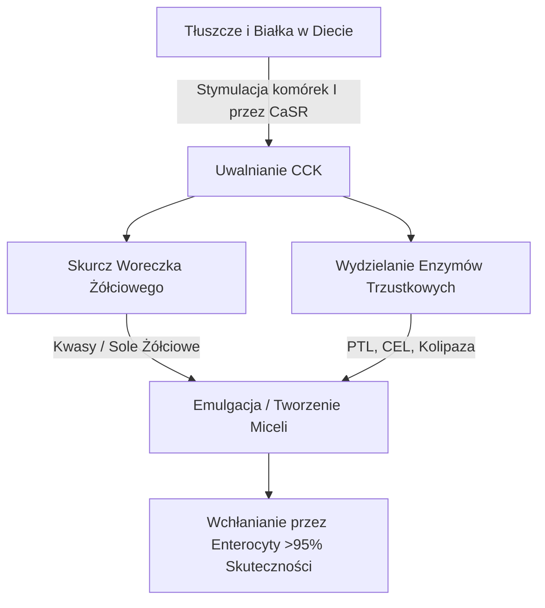
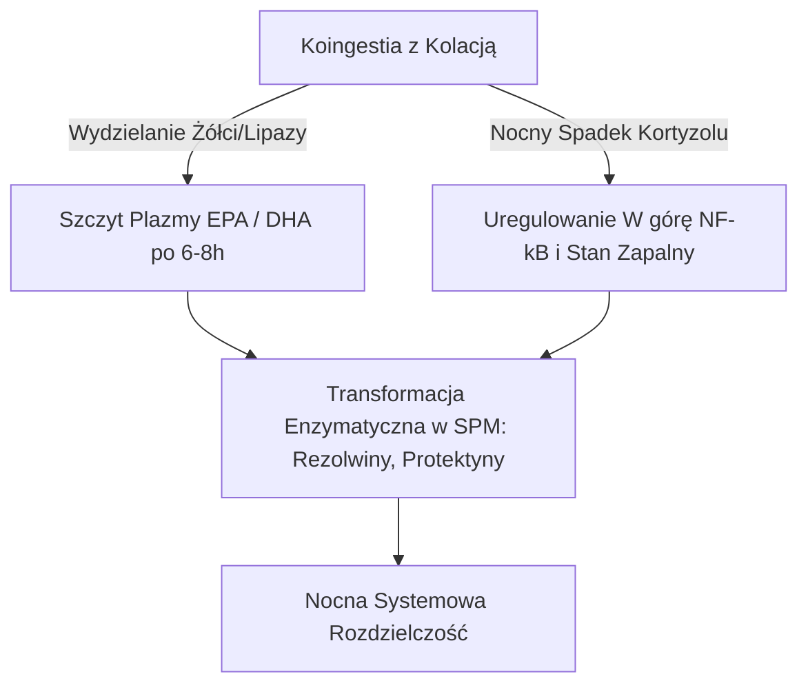

Skuteczność terapeutyczna długołańcuchowych morskich wielonienasyconych kwasów tłuszczowych omega-3 ($\text{PUFA}$), w szczególności kwasu eikozapentaenowego ($\text{EPA}$) i kwasu dokozaheksaenowego ($\text{DHA}$), jest ściśle uwarunkowana ich biodostępnością jelitową. W żywieniu klinicznym głównym powodem niepowodzeń terapeutycznych jest "paradoks chudego posiłku" (lean-meal paradox) — podawanie wysoce hydrofobowych lipidów morskich na czczo lub wraz z beztłuszczowymi posiłkami. Pomimo przyjmowania wysokich dawek nominalnych, brak zorganizowanej matrycy lipidowej przyjmowanej z pokarmem zapobiega fizycznym i enzymatycznym mechanizmom niezbędnym do wchłaniania tłuszczów w wodnym środowisku przewodu pokarmowego człowieka. Niniejsza analiza kliniczna szczegółowo opisuje biofizyczne, biochemiczne i chronofarmakologiczne zasady, które dyktują trawienie i wchłanianie $\text{EPA}$ i $\text{DHA}$.

## Post i Paradoks Chudego Posiłku

Przewód pokarmowy jest w swej istocie układem wodnym. Po spożyciu hydrofobowe lipidy, takie jak standardowe oleje rybne, napotykają wysoce polarne środowisko soków żołądkowych i jelitowych. Zgodnie z prawami termodynamiki, cząsteczki hydrofobowe minimalizują swój kontakt z wodą, co prowadzi do szybkiego rozdziału faz. Powoduje to, że spożyty olej łączy się w duże, niepodzielone krople lipidowe, które unoszą się na powierzchni wodnistej treści żołądkowej.

Połknięcie kapsułki omega-3 i popicie jej szklanką wody na pusty żołądek lub wraz z posiłkiem węglowodanowym (takim jak kawałek owocu lub kromka suchego chleba) nie uruchamia procesów fizjologicznych niezbędnych do przezwyciężenia tego podziału faz. Bez fizycznej emulgacji stosunek powierzchni do objętości fazy lipidowej pozostaje skrajnie niski. Hydrofilowe miejsca aktywne lipaz trzustkowych nie mogą uzyskać dostępu do wiązań estrowych ukrytych w tych dużych, hydrofobowych kroplach. W konsekwencji popijanie oleju rybnego wodą nie wspomaga wchłaniania; zamiast tego rozcieńcza on śladowe ilości enzymów trawiennych obecnych na czczo, oddalając niezemulgowane kropelki tłuszczu od rąbka szczoteczkowego enterocytów, prowadząc do zespołu złego wchłaniania i dyskomfortu żołądkowo-jelitowego.

Aby te wysoce hydrofobowe lipidy mogły przeniknąć przez nieruchomą warstwę wody (unstirred water layer) błony śluzowej jelit, muszą zostać przekształcone w termodynamicznie stabilną, dyspergującą w wodzie fazę. Transformacja ta jest całkowicie uzależniona od chemii fizycznej micelizacji, procesu inicjowanego przez sygnalizację hormonalną w dwunastnicy.

## Sole Żółciowe i Tworzenie Miceli

Przejście od unoszącej się hydrofobowej masy oleju do wysoce przyswajalnych mikrokropelek wymaga skoordynowanej kaskady wydzielniczej i nerwowo-mięśniowej w dwunastnicy. Głównym hormonalnym motorem tego procesu jest cholecystokinina ($\text{CCK}$), peptyd złożony z 33 aminokwasów syntetyzowany i wydzielany przez enteroendokrynne komórki typu I w błonie śluzowej dwunastnicy i górnego odcinka jelita czczego.



W warunkach fizjologicznych obecność długołańcuchowych kwasów tłuszczowych i częściowo strawionych białek w świetle dwunastnicy stymuluje receptor wykrywający wapń ($\text{CaSR}$) na komórkach I, wyzwalając gwałtowną egzocytozę $\text{CCK}$ do krwiobiegu. Po uwolnieniu $\text{CCK}$ wiąże się z receptorami $\text{CCK}_A$ na ścianie pęcherzyka żółciowego, powodując jego skurcz, a jednocześnie rozluźniając zwieracz Oddiego i stymulując komórki pęcherzykowe trzustki do uwalniania enzymów trawiennych.

Kwasy żółciowe uwalniane z pęcherzyka żółciowego — głównie amfipatyczne sole sodowe kwasu cholowego i chenodeoksycholowego — to niezbędne biologiczne detergenty. Gdy stężenie kwasów żółciowych w dwunastnicy przekracza krytyczne stężenie micelarne ($\text{CMC}$), układają się one wokół hydrofobowych kropelek lipidów. Hydrofobowy rdzeń steroidowy soli żółciowej łączy się z fazą lipidową, podczas gdy polarna, hydrofilowa grupa sprzężona (glicyna lub tauryna) skierowana jest w stronę wodnego światła dwunastnicy.

Dzięki mechanicznemu działaniu perystaltyki jelit te pokryte żółcią kropelki są ścinane w mieszane micele. Te sferyczne kruszywa koloidalne mają średnicę zaledwie 3 do 10 nanometrów, co kilkutysięcznie zwiększa powierzchnię lipidów wystawioną na działanie lipaz trzustkowych. Bez jednoczesnego spożycia zdrowych tłuszczów pokarmowych (takich jak oliwa z oliwek z pierwszego tłoczenia, awokado lub żółtka jaj z wolnego wybiegu), które przekraczają próg uwalniania $\text{CCK}$, nie dochodzi do skurczu pęcherzyka żółciowego. W takim stanie poziom kwasów żółciowych utrzymuje się poniżej $\text{CMC}$, wydzielanie lipazy trzustkowej jest minimalne, a spożyte lipidy omega-3 nie mogą tworzyć miceli, co uniemożliwia wchłanianie.

## Starcie Form Biochemicznych: TG vs. EE vs. PL

Dostępne na rynku suplementy omega-3 występują w trzech głównych formach molekularnych: naturalnych lub reestryfikowanych trójglicerydach ($\text{TG}$/$\text{rTG}$), estrach etylowych ($\text{EE}$) i fosfolipidach ($\text{PL}$). Struktura molekularna tych nośników determinuje ich tempo trawienia, zależność od lipazy i biodostępność.

```text
Forma Trójglicerydu (TG):          Forma Estru Etylowego (EE):    Forma Fosfolipidu (PL):
     ┌─ Szkielet Glicerolowy            ┌─ Cząsteczka Etanolu          ┌─ Głowa Fosforanowa (Polarna)
     ├─ Kwas Tłuszczowy (EPA)           └─ Kwas Tłuszczowy (EPA)       ├─ Kwas Tłuszczowy (EPA)
     ├─ Kwas Tłuszczowy (DHA)                                          └─ Kwas Tłuszczowy (DHA)
     └─ Kwas Tłuszczowy (Inny)
```

W naturalnych i reestryfikowanych trójglicerydach ($\text{TG}$/$\text{rTG}$) trzy kwasy tłuszczowe ($\text{EPA}$/$\text{DHA}$) są wiązane z trójwęglowym szkieletem glicerolowym. Podczas trawienia lipaza trzustkowa zależna od trójglicerydów ($\text{PTL}$), działając wraz z jej kofaktorem kolipazą, hydrolizuje wiązania estrowe w pozycjach $sn\text{-}1$ i $sn\text{-}3$. Wytwarza to dwa wolne kwasy tłuszczowe i jeden $sn\text{-}2$-monogliceryd, z których oba są wysoce polarne, łatwo ulegają micelizacji i są bez trudu wchłaniane przez enterocyty z wydajnością ponad 95%.

Z kolei forma estru etylowego ($\text{EE}$) to syntetyczny produkt tworzony podczas chemicznego zatężania. Szkielet glicerolowy zostaje usunięty, a każdy pojedynczy kwas tłuszczowy estryfikowany jest z cząsteczką etanolu ($\text{CH}_3\text{CH}_2\text{OH}$). To syntetyczne wiązanie estrowe jest wysoce odporne na działanie ludzkich enzymów trzustkowych. Badania in vitro i in vivo pokazują, że ludzka lipaza trzustkowa hydrolizuje wiązanie kwas tłuszczowy-etanol w estrach etylowych w tempie od 10 do 50 razy wolniejszym niż wiązania glicerylowo-estrowe w trójglicerydach.

Z powodu tak wolnej hydrolizy wchłanianie $\text{EE}$ jest silnie uzależnione od zmasowanego uwalniania lipaz trzustkowych i soli żółciowych, które jest uruchamiane jedynie poprzez wysokotłuszczowy posiłek. Podczas przyjmowania przy diecie niskotłuszczowej ograniczona dostępność lipazy trzustkowej nie jest w stanie skutecznie rozerwać wiązań $\text{EE}$, co prowadzi do słabej biodostępności (często spadającej do ok. 20%) i przemieszczania się niewchłoniętych syntetycznych estrów do okrężnicy, gdzie mogą powodować żołądkowo-jelitowe skutki uboczne.

Forma fosfolipidowa ($\text{PL}$), pozyskiwana głównie z antarktycznego oleju z kryla (Euphausia superba), charakteryzuje się strukturą amfipatyczną, w której $\text{EPA}$ i $\text{DHA}$ wiązane są ze szkieletem fosfatydylocholiny. Wysoce polarna fosforanowa grupa głowy sprawia, że fosfolipidy są naturalnie dyspergowalne w wodzie. Dzięki temu formy $\text{PL}$ potrafią samoemulgować i tworzyć spontaniczne mikrokrople w przewodzie pokarmowym, pomijając absolutny wymóg micelizacji stymulowanej solami żółciowymi. Fosfolipidy są również trawione przy pomocy fosfolipazy $\text{A}_2$ i mogą być bezpośrednio absorbowane przez enterocyty jako lizofosfolipidy, co skutkuje wysoką biodostępnością nawet podczas postu lub w warunkach niskotłuszczowych.

| Forma Biochemiczna | Nośnik Molekularny / Szkielet | Średnie Tempo Wchłaniania (Chudy Posiłek) | Średnie Tempo Wchłaniania (Tłusty Posiłek) | Biodostępność Względna (względem EE) | Zależność od Lipazy Trzustkowej |
| --- | --- | --- | --- | --- | --- |
| Ester Etylowy (EE) | Etanol ($\text{CH}_3\text{CH}_2\text{OH}$) | $\approx 20\%$ | $\approx 60\%$ | Punkt Odniesienia ($100\%$) | Całkowita; hydroliza 10-50x wolniejsza od TG |
| Trójgliceryd (TG / rTG) | Szkielet Glicerolowy | $\approx 68\%$ | $\approx 90\%$ | od $124\%$ do $186\%$ | Wysoka; szybko dzielony na 2-FFA i 1-MAG |
| Fosfolipid (PL) | Fosfatydylocholina | $\approx 80\%$ do $95\%$ | $>95\%$ | od $168\%$ do $500\%$ | Minimalna; samoemulgacja omija niektóre lipazy |

> [!WARNING]
> U osób, u których występuje zewnątrzwydzielnicza niewydolność trzustki (EPI), dyskineza dróg żółciowych lub po usunięciu pęcherzyka żółciowego, endogenne trawienie lipidów jest poważnie upośledzone. W przypadku tych grup pacjentów przyjmowanie syntetycznych form estrów etylowych (EE) przy niskotłuszczowych ograniczeniach dietetycznych stwarza wysokie ryzyko całkowitego braku przyswajania i dyskomfortu żołądkowo-jelitowego, ponieważ konieczne rozszczepienie enzymatyczne praktycznie w tych stanach nie istnieje.

## Oksydacja Lipidów i Absolutna Konieczność Obecności Witaminy E

Cechy strukturalne, które czynią $\text{EPA}$ i $\text{DHA}$ biologicznie aktywnymi, czynią je również bardzo niestabilnymi. $\text{EPA}$ zawiera pięć, a $\text{DHA}$ sześć wiązań podwójnych przerywanych metylenem. Wiązania węgiel-wodór przy bis-allilowych atomach węgla metylenu ($\text{-CH=CH-CH}_2\text{-CH=CH-}$) charakteryzują się niską energią dysocjacji wiązania. Czyni je to wyjątkowo podatnymi na ataki wolnych rodników i nieenzymatyczną peroksydację lipidów.

```text
Faza 1: Inicjacja
  [Wiązanie Węgiel-Wodór w PUFA] + [ROS / Wolny Rodnik] ──> [Rodnik Lipidowy Zogniskowany na Węglu (R•)]

Faza 2: Propagacja
  [Rodnik Lipidowy Zogniskowany na Węglu (R•)] + [O2] ──> [Nadtlenkowy Rodnik Lipidowy (ROO•)]
  [Nadtlenkowy Rodnik Lipidowy (ROO•)] + [Nieutlenione PUFA] ──> [Wodoronadtlenek Lipidu (ROOH)] + [Nowy Rodnik Lipidowy (R•)]

Faza 3: Dekompozycja
  [Niestabilny Wodoronadtlenek Lipidu (ROOH)] ──> [Toksyczne Aldehydy (MDA / HHE)]
```

Po spożyciu olej rybny zostaje wystawiony na działanie środowiska w temperaturze $37^\circ\text{C}$ (temperatura ciała), kwasów żołądkowych i rozpuszczonego tlenu cząsteczkowego ($\text{O}_2$). Środowisko to przyspiesza kaskadę peroksydacji lipidów przez trzy odrębne fazy:

1. **Inicjacja:** Reaktywna forma tlenu ($\text{ROS}$) odrywa atom wodoru od węgla bis-allilowego, generując rodnik lipidowy zogniskowany na węglu ($\text{R}^\bullet$).
2. **Propagacja:** Rodnik lipidowy wchodzi w szybką reakcję z tlenem molekularnym ($\text{O}_2$), tworząc rodnik nadtlenkowy ($\text{ROO}^\bullet$). Ten rodnik nadtlenkowy następnie odrywa atom wodoru od sąsiedniej, nieutlenionej cząsteczki $\text{PUFA}$, tworząc wodoronadtlenek lipidu ($\text{ROOH}$) i nowy rodnik lipidowy, co podtrzymuje reakcję łańcuchową.
3. **Dekompozycja:** Niestabilne wodoronadtlenki lipidów rozkładają się na wysoce reaktywne, cytotoksyczne wtórne produkty utleniania, obejmujące alkenale, takie jak dialdehyd malonowy ($\text{MDA}$) i 4-hydroksyheksenal ($\text{HHE}$).

Owe wtórne produkty utleniania są z łatwością przyswajane przez układ trawienny, integrowane w chylomikrony oraz lipoproteiny o niskiej gęstości ($\text{LDL}$) i potrafią wywołać ogólnoustrojowy stres oksydacyjny, urazy śródbłonkowe, a także rozwój miażdżycy.

Aby zahamować ten postęp, wymagane jest jednoczesne sformułowanie ze zrywającym łańcuch, rozpuszczalnym w tłuszczach antyoksydantem. W tej funkcji doskonale odnajduje się naturalna witamina E, a zwłaszcza d-alfa-tokoferol ($\text{C}_{29}\text{H}_{50}\text{O}_2$). D-alfa-tokoferol pełni rolę donora wodoru, szybko przenosząc swój fenolowy atom wodoru do reaktywnego rodnika nadtlenku lipidowego ($\text{ROO}^\bullet$) z ogromną prędkością na poziomie około $10^6\,\text{M}^{-1}\text{s}^{-1}$.

Powstały rodnik tokoferoksylowy staje się wysoce trwały z powodu delokalizacji rezonansowej jego niesparowanego elektronu wokół pierścienia chromanolu, zapobiegając w ten sposób zaatakowaniu sąsiednich wiązań kwasów tłuszczowych. Działanie to tłumi reakcję łańcuchową, ochraniając strukturę cząsteczek $\text{EPA}$ i $\text{DHA}$, dzięki czemu dotrą one do docelowych tkanek w czynnym, nieutlenionym kształcie.

## Chronofarmakologia a Nocne Okno Przeciwzapalne

W biochemii lipidów kluczową rolę odgrywa czas. Przyjmowanie suplementów omega-3 w trakcie największego, najbardziej bogatego w lipidy posiłku w ciągu doby (zwykle obiadu lub kolacji) wspiera na równi absorpcję, jak i naturalne uwarunkowania organizmu, sprzyjając nocnym etapom odbudowy.



Zacznijmy od faktu, że obiad/kolacja dla większości osób na przestrzeni wieków stanowili najbardziej nasycony tłuszczami moment na jedzenie w trakcie doby. Powoduje to wymuszoną fizyczną objętość lipidów odpowiednią do zainicjowania najwyższej produkcji $\text{CCK}$, która pociąga za sobą natężony skurcz woreczka żółciowego, obfitą laktację żółciową i zintensyfikowaną aktywność lipazy trzustkowej. Przekłada się to na najkorzystniejszą micelizację i dynamikę przemiany materii, zapewniającą pomyślne pochłonięcie na wpół kompletnej dawki podanego suplementu.

Druga kwestia dotyczy wpływu wieczornej dawki na stykające się cykle biologiczne związane z obronnością i stanem zapalnym. Wewnątrzkomórkowe wskaźniki kortyzolu obniżają się naturalnie do ich najdrobniejszych wymiarów dobowych późnym wieczorem, jak również po nastaniu ciemności. Hormon ten z natury jest środkiem bardzo osłabiającym procesy zapalne; toteż, w momencie obniżenia parametrów kortyzolu w obrębie zapalnym, włączając takie które reguluje pro-zapalny wskaźnik transkrypcji $\text{NF}\text{-}\kappa\text{B}$, można w nich odnotować zbliżoną „regulację w górę”.

Z tego względu, wprowadzanie do ustroju związków omega-3 połączone z posiłkiem wieczornym pozwala na szczytowe skupienie $\text{EPA}$ czy $\text{DHA}$ we frakcji plazmatycznej i przegrodzie komórkowej dopiero za około 6 - 8 godzin, zrównując się jednocześnie ze stanem przeciwzapalnym odnotowywanym w okresie drzemki nocnej. Ciało na tym etapie wyzyskuje niniejsze związki tłuszczowe za podwalinę na poczet syntezy Wyspecjalizowanych Mediatorów Pro-rozdzielczych ($\text{SPM}$) (ang. Specialized Pro-resolving Mediators) – w tym między innymi dla rezolwin, protektyn, jak też dla marezynów, przy zachowaniu kanałów z cyklooksygenazą ($\text{COX}$) wspólnie z lipooksygenazą ($\text{LOX}$). Wspomniane wyżej $\text{SPM}$ usilnie przyczyniają się do rozwiązania zagadnień mikro-stanów chorobowych od dłuższego czasu gnębiących organizm pacjenta, dopomagając obrót na szczeblu jednostki chorobowej i przy wspieraniu ozdrowienia utkania mięsnego.

Następnym plusem podawania specyfiku, ze skupieniem przede wszystkim wokół omawianego wcześniej kwasu, a konkretnie na $\text{DHA}$ to w głównej mierze wyjątkowe atuty neurologiczne na skutek aplikacji owego leku pod osłoną mroku. Ten element jest rdzeniem składowym lipidowej budowy otoczek wokół błon w strukturze nerwów, w dużym zakresie koordynując mechanizmy za sprawą działania w sferze okołodobowego zegara mózgu komórki w systemie nerwowym człowieka. Jego praca nadzoruje komórki zegarowe odpowiedzialne za regulację funkcjonowania, co można zauważyć m.in. dla uregulowania czujności lub spoczynku dobowego w powiązaniu poprzez pętlę w obszarze od genów sterujących np. dla BMAL1 wraz z CLOCK.

Aklimatyzowanie przez noc w kompozycję z powłoką synaptyczną opisywanego kwasu wspomaga transfer, oddając usługi ulepszeniu poziomu serotoniny co z kolei napędza w kierunku najlepszych rezultatów konwersji przy stymulacji na powłokę stymulując melatonię.

> [!TIP]
> Celem osiągnięcia jak największego poziomu zintegrowania przy procesie biokomórkowym, jeżeli w ogóle ma dojść u kwasów tłuszczowych posiadających specyfikę budowy dla tak długich pasm, z naciskiem w głównej mierze po stronie zalecań wystawionych dla praktykujących lekarsko, by instruować osobę potrzebującą opieki zdrowotnej do tego stopnia, aby dobowa porcja specyfiku spotkała się od razu wraz z przyjmowaniem dania najbardziej objętościowego pod kątem występujących tłuszczy w harmonogramie pory na posiłki. Kwalifikowane przyswojenie dla minerałów wymaga na samym początku połączonych co najmniej 10 - 15 g tłuszczy.

## Wnioski Kliniczne i Działania Zalecane

Stara praktyka pobierania tranu wspólnie po uprzednim połknięciu zażywając czystą zawartość H2O przy zupełnie osuszonej sferze żołądkowej, w znakomitym stopniu może wydać u osoby zainteresowanej skąpo ufundowane parametry z przyswojeniem witamin ze skutkiem wystąpienia reakcji, co bezpośrednio pożądane nie jest.

Aby zrealizować satysfakcjonujący cel klinicznie podparty, specjaliści by zyskać bez reszty nad polepszeniem szczytu odnośnie medykamentów, celowym by było narzucenie prymu dla reestryfikowanych ukompletowań ze związkiem jak u trójglicerydów ($\text{rTG}$) a ewentualnie ze składową jak obok cząstek od fosfolipidów ($\text{PL}$). Owe wariacje charakteryzują się korzystną poświatą o dominującej pozie absorpcyjnej z domieszką ograniczonej konieczności o opieraniu sich w stosunku dań dla estrów pochodzenia od złącza jak etylowe formy z grupy syntetyków typu $\text{EE}$.

Bez baczenia na sformułowany odłam obranego medykamentu, trzeba tak zgrać harmonogram podawania obok dań aby skomponowało ich bazę min. od 10 a najlepiej nie więcej za ok 15 gram kwasu od żywności tłustej. Osiągniecie ramy granicznej po części natury ze względu dla tłuszczy po co po by wprawiać w cyrkulację wyścig, który sprowadzi do pobudzenia w układzie stymulacji informującej.

Jednocześnie by na dłużej chronić ów nietrwałe związki od skazy wygenerowanej tlenową inwazją zachodzącą we wnętrzu organizmu, struktura ta wymaga do skompletowania dodatku w postać przy obronie za sprawą zjawiska ochrony utleniaczy o strukturze wtapiania by obarczać się powłoczką od lipidów, i po odgórnej ochronie pod formę dla np. od związku takiego rodzaju, który figuruje tam d-alfa-tokoferol zwanym częściej obok Vit E.

Finalnie zgrywając ułożenie specyfików, podpinając do wieczorowej sfery żywienia dopilnowuje spójnego powiązania przy maksimum ze sprawczą rączką powłoki u pacjenta co w tymże czasie nakłoni na powzięcie odpowiednich naturalnie regeneratywnych procesów nocnego mechanizmu leczącego stany wywoływane do zapalnych stanów wspólnie dla zrekonstruowania komórek, potęgując za równym tchem w najlepszych zysków ukierunkowanych dla pracy immunogennej w zjawisku w parze kardiologiczno naczyniowej razem z neurologią wspierane o $\text{EPA}$ podobnie w splotach oddolnych z użycia pod kątem kwasów typu $\text{DHA}$.

## Źródła

1. Nordøy A, et al. [Absorption of the n-3 eicosapentaenoic and docosahexaenoic acids as ethyl esters and triglycerides by humans](https://pubmed.ncbi.nlm.nih.gov/1826985/). *American Journal of Clinical Nutrition.* 1991.
2. Offman E, Marenco T, Ferber S, Johnson J, Kling D, Curcio D, Davidson M. [Steady-state bioavailability of prescription omega-3 on a low-fat diet is significantly improved with a free fatty acid formulation compared with an ethyl ester formulation: the ECLIPSE II study](https://pubmed.ncbi.nlm.nih.gov/24124374/). *Vascular Health and Risk Management.* 2013.
3. Schuchardt JP, Schneider I, Meyer H, Neubronner J, von Schacky C, Hahn A. [Incorporation of EPA and DHA into plasma phospholipids in response to different omega-3 fatty acid formulations - a comparative bioavailability study of fish oil vs. krill oil](https://pubmed.ncbi.nlm.nih.gov/21854650/). *Lipids in Health and Disease.* 2011.
4. Brown JE, Wahle KW. [Effect of fish-oil and vitamin E supplementation on lipid peroxidation and whole-blood aggregation in man](https://pubmed.ncbi.nlm.nih.gov/2282693/). *Clinica Chimica Acta.* 1990.

Niniejszy artykuł ma charakter wyłącznie informacyjny i nie stanowi porady medycznej. Przed wprowadzeniem zmian w suplementacji lub przyjmowanych lekach skonsultuj się z wykwalifikowanym pracownikiem służby zdrowia.
