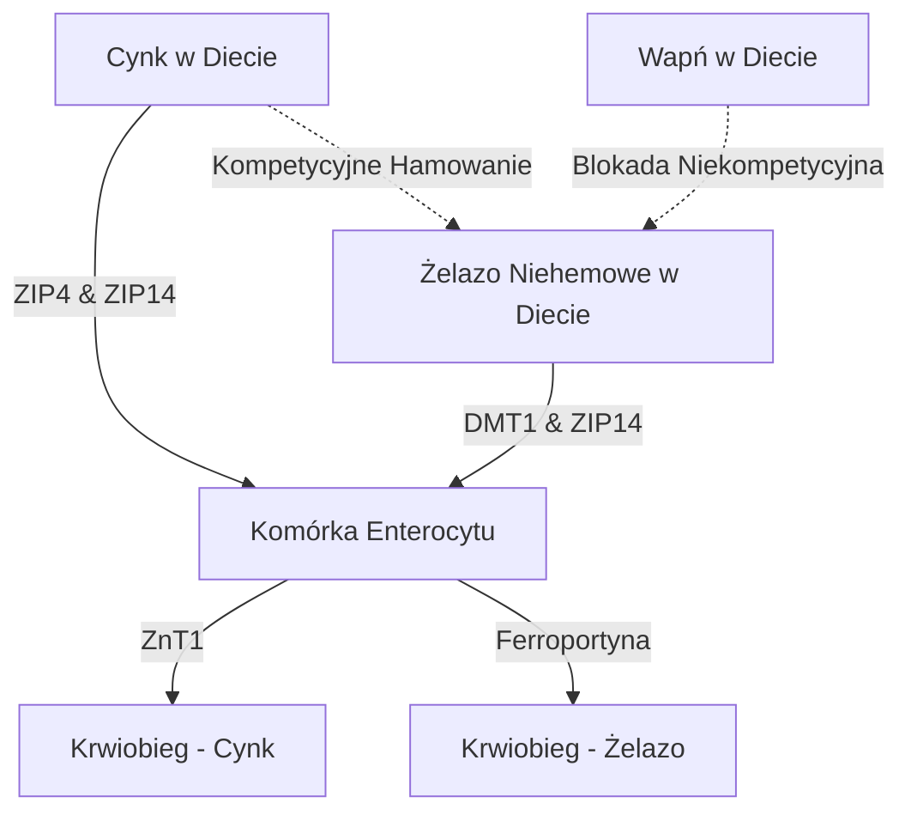

Podawanie suplementów cynku ($\text{Zn}^{2+}$) wiąże się z szeregiem fizjologicznych i biochemicznych paradoksów. Chociaż cynk jest niezbędnym minerałem śladowym biorącym udział w ponad 300 reakcjach enzymatycznych, jego doustne przyjmowanie jest często utrudnione przez ostre dolegliwości żołądkowo-jelitowe, kompetycyjne hamowanie przez inne kationy dwuwartościowe oraz ogólnoustrojowe uszczuplenie innych minerałów. Rozwiązanie tych problemów wymaga szczegółowego zrozumienia kinetyki transporterów jelitowych, biochemii błony śluzowej i chronofarmakologii w celu zaprojektowania optymalnych protokołów dawkowania.

## Paradoks Pustego Żołądka: Podrażnienie Śluzówki vs. Biodostępność

Doustnie podawany cynk stawia nas przed trudnym wyborem: spożycie na pusty żołądek maksymalizuje biodostępność komórkową, ale często powoduje ostre dolegliwości żołądkowo-jelitowe (nudności). Z kolei podawanie cynku z posiłkami skutecznie łagodzi dyskomfort, ale wprowadza dietetyczne antagonisty (inhibitory), które drastycznie zmniejszają wchłanianie.

### Molekularne Mechanizmy Podrażnienia Żołądka i Nudności
Spożycie wysoce rozpuszczalnych w wodzie, nieorganicznych soli cynku — takich jak siarczan cynku ($\text{ZnSO}_4$) lub chlorek cynku ($\text{ZnCl}_2$) — prowadzi do szybkiego rozpuszczenia w świetle żołądka. W roztworach wodnych sole te ulegają całkowitej dysocjacji, tworząc wysoce stężone i kwaśne zlokalizowane środowisko o pH około 4,0 do 5,0.

Na czczo brak jedzenia pozostawia błonę śluzową żołądka bez buforu. Nagła ekspozycja na wolne dwuwartościowe jony cynku ($\text{Zn}^{2+}$) wywiera bezpośredni żrący i drażniący wpływ na komórki nabłonka żołądka. To zlokalizowane podrażnienie stymymuluje komórki okładzinowe żołądka do nadmiernego wydzielania kwasu solnego (HCl), co dodatkowo obniża pH żołądka i indukuje nadżerki błony śluzowej.

Wykrywanie tego chemicznego i kwaśnego uszkodzenia odbywa się za pośrednictwem rozległej sieci neuronów czuciowych nerwu błędnego. Po aktywacji neurony te przesyłają potencjały czynnościowe w górę nerwu błędnego do pnia mózgu. Inicjuje to odruch wymiotny, objawiający się natychmiastowymi nudnościami, opóźnionym opróżnianiem żołądka i skurczami żołądka w ciągu 30 minut od spożycia.

### Blokada Biodostępności: Fityniany, Zboża i Nabiał

Gdy cynk jest przyjmowany z jedzeniem, jego biodostępność jest poważnie ograniczona przez inhibitory w diecie. Najsilniejszym z nich jest **kwas fitynowy** (fitynian), który jest wysoce skoncentrowany w zewnętrznych łuskach nierafinowanych ziaren zbóż, roślin strączkowych, orzechów i nasion.

W fizjologicznym pH dwunastnicy kwas fitynowy działa jako agresywny ligand, który chelatuje (wyłapuje) wolne jony $\text{Zn}^{2+}$, tworząc wysoce stabilne, nierozpuszczalne i strukturalnie złożone osady koordynacyjne, które są całkowicie oporne na wchłanianie jelitowe. Ponieważ ludzie nie posiadają enzymów fitazy w górnym odcinku przewodu pokarmowego, te kompleksy cynkowo-fitynianowe pozostają niezhidrolizowane i są wydalane z kałem.

> [!CAUTION]
> Badania pokazują, że dodanie zaledwie 50 mg fitynianów do posiłku zmniejsza wchłanianie cynku o około 36% (spadek z wyjściowych 22% do 14%).

Co więcej, produkty mleczne wywierają niezależny efekt hamujący. **Kazeina**, główne białko mleka krowiego, wiąże jony cynku w świetle jelita, znacznie zmniejszając biodostępność w porównaniu z preparatami na bazie białka serwatkowego.

### Formy Związków Cynku i Tolerancja

| Klasa Chemiczna | Forma Związku Cynku | Wchłanianie | Tolerancja Żołądkowa | Mechanizm Działania |
| :--- | :--- | :--- | :--- | :--- |
| **Sól Nieorganiczna** | Siarczan Cynku ($\text{ZnSO}_4$) | ~20–49,9% | Silne Podrażnienie (~15% nudności) | Szybko dysocjuje; kwaśne pH. |
| **Sól Organiczna** | Glukonian Cynku | ~50,6–71,7% | Średnia Tolerancja (~5% nudności) | Neutralne pH; powolna dysocjacja. |
| **Chelat Organiczny**| Diglicynian Cynku | ~50–60% | Bardzo Wysoka Tolerancja (< 5% nudności) | Związany z glicyną; odporny na dysocjację żołądkową i fityniany. |
| **Chelat Organiczny**| Pikolinian Cynku | Wysoka | Wysoka Tolerancja | Skompleksowany z kwasem pikolinowym; doskonała kumulacja w tkankach. |

### Optymalny Protokół Dawkowania

1. **Przejście na chelaty organiczne:** Należy zastąpić nieorganiczne sole cynku organicznymi chelatami, takimi jak Diglicynian Cynku. Jony cynku są tam kowalencyjnie związane z dwoma ligandami glicyny, co chroni minerał przed przedwczesną dysocjacją w kwasie żołądkowym.
2. **Wykorzystanie alternatywnych dróg wchłaniania:** Chelaty organiczne są wchłaniane w postaci nienaruszonej za pośrednictwem alternatywnych, wysoce wydajnych dróg (kotransportery peptydowe).
3. **Pielęgnacyjne Posiłki Buforowe:** Cynk należy przyjmować wyłącznie z lekką przekąską całkowicie pozbawioną fitynianów i wysokich dawek wapnia. Dopuszczalne pokarmy to biały chleb na zakwasie (fermentacja rozkłada fityniany) lub proste białka zwierzęce (jajka lub izolat serwatki).

> [!TIP]
> **Pro Tip:** Aby zmaksymalizować wchłanianie przy jednoczesnym całkowitym uniknięciu nudności, idealnym protokołem jest przyjęcie 15–30 mg elementarnego diglicynianu cynku z lekką przekąską bez fitynianów wczesnym popołudniem, zapewniając 2-godzinny post przed i po spożyciu.

## Wojny Transporterów: DMT1 i ZIP14

Enterocyt w jelicie cienkim działa jako wysoce konkurencyjna arena dla wchłaniania metali dwuwartościowych. Cynk ($\text{Zn}^{2+}$), żelazo niehemowe ($\text{Fe}^{2+}$) i wapń ($\text{Ca}^{2+}$) współdzielą nakładające się na siebie, nasycalne szlaki. Oznacza to, że jednoczesne podawanie wysokich dawek suplementów bezpośrednio hamuje wchłanianie każdego z minerałów.

### Krajobraz Transporterów: ZIP4, ZIP14 i DMT1

Na błonie szczytowej enterocytów dwunastnicy głównym importerem cynku jest ZIP4. Żelazo niehemowe polega na innym szlaku: DMT1. Jednak istnieje inny krytyczny transporter, ZIP14; chociaż jest klasyfikowany jako transporter cynku, jest również w stanie transportować żelazo ($\text{Fe}^{2+}$).

Gdy terapeutyczne (wysokie) dawki żelaza (100–400 mg) są podawane jednocześnie z cynkiem, żelazo wygrywa z cynkiem w wychwycie komórkowym. Badania kliniczne pokazują, że przyjmowanie wysokich dawek żelaza jednocześnie ze standardową dawką 25 mg cynku zmniejsza wchłanianie cynku o około 40–50%.

## Niebezpieczeństwo Niedoboru Miedzi

Poważnym zagrożeniem związanym z długoterminową suplementacją wysokimi dawkami cynku jest rozwój ogólnoustrojowego niedoboru miedzi. Szlak ten opiera się na **metalotioneinie** — wewnątrzkomórkowym białku wiążącym metale wewnątrz enterocytów.

Gdy osoba spożywa wysoką dawkę cynku (>40–50 mg/dzień) przez dłuższy czas, duży napływ komórkowego $\text{Zn}^{2+}$ wyzwala masową syntezę metalotioneiny. Chociaż synteza ta jest napędzana przez poziom cynku, białko to posiada termodynamiczne powinowactwo do miedzi ($\text{Cu}^+$), które jest znacznie wyższe niż w przypadku cynku.

W rezultacie, gdy miedź dostaje się do enterocytu, obfite cząsteczki metalotioneiny szybko się z nią wiążą i sekwestrują jony miedzi. Ta miedź zostaje uwięziona w niezwykle stabilnym kompleksie i nie może przedostać się do krwiobiegu. Ponieważ komórki nabłonka jelitowego złuszczają się co 3 do 5 dni, uwięziona miedź jest tracona w kale. Z czasem prowadzi to do głębokiego wyczerpania miedzi.

> [!WARNING]
> Suplementacja dziennymi dawkami cynku przekraczającymi 40 mg bez odpowiedniego balansu miedzi (w stosunku 15:1) przez ponad cztery tygodnie, grozi wywołaniem poważnego niedoboru miedzi. Może to spowodować wypadanie włosów, anemię i nieodwracalne uszkodzenie nerwów.

## Chronofarmakologia Cynku: Rytm Dobowy i Sen

Czas podawania składników odżywczych decyduje o ich skuteczności. Cynk wykazuje niezwykle złożony związek z wewnętrznym zegarem biologicznym organizmu.

### Cynk, Synteza Melatoniny i GABA
Cynk jest podstawowym kofaktorem niezbędnym do syntezy melatoniny (hormonu snu). Stabilizuje enzymy TPH i AANAT. Niedobór cynku zatrzymuje transkrypcję AANAT, powodując spadek nocnej melatoniny (bezsenność).

Ponadto cynk działa jako bezpośredni neuromodulator, działając jako silny bloker pobudzającego receptora NMDA glutaminianu, a jednocześnie jako wzmacniacz uspokajających receptorów GABA. Działanie to ułatwia łagodne przejście w głęboki sen wolnofalowy.

### Zoptymalizowany Protokół SuppTime

| Pora Dnia | Zestaw Suplementów | Uzasadnienie Chronobiologiczne |
| :--- | :--- | :--- |
| **Rano** | Probiotyki | Niska ilość kwasu żołądkowego po przebudzeniu maksymalizuje przeżywalność bakterii. |
| **Śniadanie** | Żelazo, Witamina C, Witamina D3 | Witamina C zwiększa wchłanianie żelaza. Unikać Wapnia i Cynku. |
| **Popołudnie** | Diglicynian Cynku (15–30 mg) + Miedź (1–2 mg) | Sformułowany w stosunku 15:1, aby zapobiec niedoborowi miedzi; całkowicie oddzielony od żelaza i wapnia. |
| **Noc** | Wapń, Glicynian Magnezu | Magnez rozluźnia mięśnie i moduluje receptory GABA przed snem. |

## Źródła

1. Institute of Medicine (US) Panel on Micronutrients. [Zinc](https://www.ncbi.nlm.nih.gov/books/NBK222317/). *Dietary Reference Intakes for Vitamin A, Vitamin K, Arsenic, Boron, Chromium, Copper, Iodine, Iron, Manganese, Molybdenum, Nickel, Silicon, Vanadium, and Zinc.* National Academies Press, 2001.
2. National Institutes of Health, Office of Dietary Supplements. [Zinc - Health Professional Fact Sheet](https://ods.od.nih.gov/factsheets/Zinc-HealthProfessional/). *NIH Office of Dietary Supplements.* 2022.
3. Pérès JM, Bureau F, Neuville D, Arhan P, Bouglé D. [Inhibition of zinc absorption by iron depends on their ratio](https://pubmed.ncbi.nlm.nih.gov/11846013/). *Journal of Trace Elements in Medicine and Biology.* 2001.
4. Devarshi PP, Mao Q, Grant RW, Mitmesser SH. [Comparative Absorption and Bioavailability of Various Chemical Forms of Zinc in Humans: A Narrative Review](https://www.ncbi.nlm.nih.gov/pmc/articles/PMC11677333/). *Nutrients.* 2024.
5. Gupta N, Carmichael MF. [Zinc-Induced Copper Deficiency as a Rare Cause of Neurological Deficit and Anemia](https://www.ncbi.nlm.nih.gov/pmc/articles/PMC10510946/). *Cureus.* 2023.

Niniejszy artykuł ma charakter wyłącznie informacyjny i nie stanowi porady medycznej. Przed wprowadzeniem zmian w suplementacji lub przyjmowanych lekach skonsultuj się z wykwalifikowanym pracownikiem służby zdrowia.
