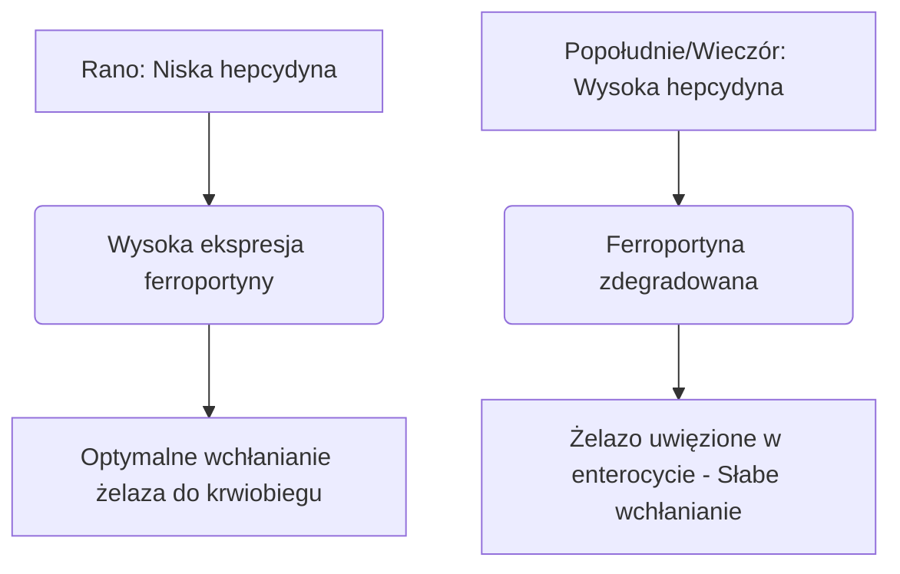

Żelazo jest niezastąpionym mikroskładnikiem odżywczym, który działa jako strukturalny i katalityczny kofaktor w transporcie tlenu, oddychaniu komórkowym i syntezie DNA. Pomimo jego obfitości w środowisku, żelazo jest często składnikiem odżywczym ograniczającym wzrost w diecie człowieka. Ponieważ ludzie nie posiadają fizjologicznego mechanizmu aktywnego wydalania żelaza, ogólnoustrojowa równowaga żelaza jest utrzymywana wyłącznie na poziomie wchłaniania jelitowego.

Żelazo w diecie występuje w dwóch podstawowych formach: **żelazo organiczne (hemowe)** i **nieorganiczne (niehemowe)**.

Żelazo hemowe charakteryzuje się wysoką biodostępnością, zazwyczaj wchłania się w ilości od 15% do 35%. Jest ono transportowane w nienaruszonej postaci przez rąbek szczoteczkowy enterocytów dwunastnicy za pośrednictwem białka nośnikowego hemu 1 (HCP1) i pozostaje chronione przed standardowymi inhibitorami pokarmowymi.

Z kolei żelazo niehemowe (żelazo nieorganiczne) stanowi ponad 80% spożycia w diecie, ale wykazuje znacznie gorszy profil wchłaniania, ze wskaźnikami wchłaniania wynoszącymi zaledwie od 2% do 20%.

> [!TIP]
> Przy fizjologicznym pH żelazo niehemowe istnieje głównie w utlenionym, wysoce nierozpuszczalnym stanie żelazowym (Fe³⁺). Aby mogło zostać wchłonięte, musi ulec redukcji do rozpuszczalnego stanu żelazawego (Fe²⁺) przez reduktazę apikalną dwunastniczego cytochromu b (Dcytb), zanim dostanie się do enterocytu przez transporter metali dwuwartościowych 1 (DMT1).

## Szlaki żelaza hemowego vs. niehemowego

| Cecha / Wskaźnik | Szlak żelaza hemowego | Szlak żelaza niehemowego (nieorganicznego) |
| :--- | :--- | :--- |
| **Źródła w diecie** | Tkanki zwierzęce (hemoglobina, mioglobina) | Rośliny, żywność wzbogacona w żelazo, sole mineralne |
| **Transporter apikalny** | Białko nośnikowe hemu 1 (HCP1) | Transporter metali dwuwartościowych 1 (DMT1) |
| **Wymagany stan wartościowości** | Kompleks związany z porfiryną | Żelazawy (Fe²⁺) |
| **Optymalne pH w świetle jelita** | Zasadniczo stabilne; niezależne od kwasu żołądkowego | Wymaga wysokiej kwasowości (pH < 3.0) do rozpuszczenia |
| **Typowa skuteczność wchłaniania**| 15% – 35% (wysoka biodostępność) | 2% – 20% (bardzo zmienna) |
| **Wrażliwość na inhibitory w diecie** | Znikoma; chronione przez pierścień porfirynowy | Niezwykle wysoka (hamowane przez fityniany, polifenole, wapń) |

## Optymalny czas (Chronofarmakologia)

Optymalizacja wchłaniania żelaza niehemowego wymaga precyzyjnej koordynacji z dobową kinetyką **hepcydyny**, 25-aminokwasowego hormonu peptydowego syntetyzowanego głównie przez hepatocyty. Hepcydyna funkcjonuje jako główny ogólnoustrojowy regulator homeostazy żelaza poprzez bezpośrednie wiązanie się z basolateralnym eksporterem ferroportyną, indukując jej degradację. W konsekwencji podwyższony poziom krążącej hepcydyny zatrzymuje żelazo w enterocytach dwunastnicy i zapobiega jego przedostawaniu się do krwiobiegu.

### Wahania dobowe hepcydyny
W podstawowych warunkach fizjologicznych stężenie hepcydyny jest najniższe wczesnym rankiem, systematycznie rośnie w ciągu popołudnia, osiągając szczyt, a następnie spada w nocy.

Ta krzywa dobowa ma bezpośredni wpływ na kinetykę żelaza podawanego doustnie. **Poranne podawanie** suplementów żelaza pozwala minerałowi dotrzeć do dwunastnicy w momencie, gdy ekspresja ferroportyny w enterocytach jest najwyższa. Z kolei dawkowanie popołudniowe lub wieczorne zmusza żelazo do konkurowania z podwyższoną blokadą hepcydynową, co skutkuje zmniejszeniem frakcyjnego wchłaniania żelaza o 37%.

### Wpływ kwasowości żołądka
Stan biofizyczny żelaza nieorganicznego jest silnie uzależniony od produkcji kwasu żołądkowego. Farmakologiczne hamowanie wydzielania kwasu żołądkowego za pomocą inhibitorów pompy protonowej (IPP - leki osłonowe na żołądek) poważnie zaburza to mikrośrodowisko, podnosząc pH w żołądku i powodując szybkie utlenianie rozpuszczalnego Fe²⁺ do wysoce nierozpuszczalnego Fe³⁺.

> [!WARNING]
> Doustne suplementy żelaza należy bezwzględnie przyjmować na pusty żołądek — najlepiej 1 godzinę przed posiłkiem lub 2 godziny po nim — i ściśle oddzielać od wszelkich leków zmniejszających wydzielanie kwasu żołądkowego.

## Niebezpieczne interakcje (Czego NIGDY nie mieszać)

Skuteczność terapeutyczna żelaza podawanego doustnie łatwo ulega pogorszeniu w przypadku jednoczesnego spożywania go z różnymi składnikami diety i środkami farmaceutycznymi.

### Wapń
Wapń, niezależnie od tego, czy jest spożywany w diecie jako nabiał (mleko, ser, jogurt), czy jako suplementy mineralne (węglan wapnia), jest silnym inhibitorem wchłaniania zarówno żelaza hemowego, jak i niehemowego. Jednoczesne spożycie 500 mg węglanu wapnia z posiłkiem zawierającym żelazo zmniejsza frakcyjne wchłanianie żelaza o ponad 50%.

### Taniny i Polifenole
Polifenole znajdujące się w **czarnej herbacie, zielonej herbacie, naparach ziołowych i kawie** są wyjątkowo skutecznymi chelatorami żelaza. Te związki pochodzenia roślinnego koordynują z żelazem na trzecim stopniu utlenienia, tworząc wysoce stabilne, duże kompleksy metaloorganiczne, które nie mogą przekroczyć rąbka szczoteczkowego dwunastnicy. Dodanie tylko jednej filiżanki kawy lub herbaty do posiłku może zmniejszyć wchłanianie żelaza niehemowego o 40% do 70%.

### Kwas fitynowy
Kwas fitynowy jest głównym związkiem magazynującym fosfor w produktach pełnoziarnistych, płatkach śniadaniowych, orzechach i roślinach strączkowych. Stosunek molowy kwasu fitynowego do żelaza jest najważniejszym pojedynczym czynnikiem dietetycznym ograniczającym biodostępność żelaza w dietach roślinnych.

### Cynk i Magnez
Żelazo (II), cynk i magnez mają wspólne, nakładające się ścieżki transportu przez błonę apikalną enterocytów (takie jak DMT1). Przy dawkach terapeutycznych żelaza dochodzi do konkurencyjnego hamowania, co znacznie hamuje transport żelaza. Nie przyjmuj suplementu żelaza razem z cynkiem lub magnezem.

### Leki na tarczycę (Lewotyroksyna)
Jednoczesne podawanie doustnych suplementów żelaza z lewotyroksyną (T4) prowadzi do poważnej interakcji leków ze składnikami odżywczymi. Żelazo koordynuje z cząsteczką lewotyroksyny, tworząc nierozpuszczalny kompleks, który zmniejsza doustną biodostępność lewotyroksyny o 20% do 64%.

> [!CAUTION]
> Aby zapobiec klinicznemu niepowodzeniu leczenia tarczycy, należy zachować ścisły odstęp czasowy wynoszący co najmniej 4 godziny między podaniem lewotyroksyny i żelaza.

## Główny kofaktor: Witamina C

Kwas askorbinowy (witamina C) jest najsilniejszym czynnikiem wspomagającym wchłanianie żelaza niehemowego, zdolnym do zniesienia hamującego działania fitynianów, polifenoli i wapnia w diecie.

Ten synergistyczny związek działa poprzez wysoce wydajny podwójny mechanizm biochemiczny:
1. **Termodynamicznie korzystna redukcja:** Kwas askorbinowy szybko przekształca nierozpuszczalne jony żelaza (III) (Fe³⁺) w wysoce rozpuszczalną postać żelaza (II) (Fe²⁺), gotową do transportu.
2. **Chelatowanie w dwunastnicy:** Kwas askorbinowy działa jak tarcza ochronna, zapobiegając wiązaniu się żelaza z fitynianami i polifenolami w miarę jego przechodzenia do zasadowego środowiska dwunastnicy.

## Skutki uboczne i paradygmat dawkowania co drugi dzień

Tradycyjne podejście do leczenia niedokrwistości z niedoboru żelaza — codzienne przepisywanie wysokich dawek żelaza doustnego — często kończy się niepowodzeniem z powodu poważnych skutków ubocznych ze strony przewodu pokarmowego (nudności, zaparcia) i ogólnoustrojowych pętli sprzężenia zwrotnego.

Ze względu na niskie wchłanianie frakcyjne nawet 90% standardowej dawki żelaza przyjmowanej doustnie pozostaje niewchłonięte w przewodzie pokarmowym. Nadmiar żelaza reaguje z nadtlenkiem wodoru, generując wysoce toksyczne rodniki hydroksylowe, które wywołują stres oksydacyjny i stan zapalny błony śluzowej.

Ponadto wysokie codzienne dawki suplementów żelaza wywołują ogólnoustrojowy **„Blok śluzówkowy” (Mucosal Block)**. Spożycie doustnej dawki żelaza wynoszącej ≥ 60 mg indukuje gwałtowny wzrost stężenia hepcydyny w surowicy, który utrzymuje się przez 24 godziny. Jeśli następnego dnia zostanie podana druga dawka żelaza, enterocyty są fizycznie blokowane przed eksportowaniem jej do krążenia wrotnego. Żelazo zostaje uwięzione i ostatecznie wydalone.

> [!TIP]
> **Dawkowanie co drugi dzień:** Aby ominąć tę blokadę za pośrednictwem hepcydyny, współczesna hematologia przeszła na podawanie żelaza doustnego **co drugi dzień**. Badania kliniczne dowodzą, że przyjmowanie żelaza co 48 godzin zwiększa frakcyjne wchłanianie żelaza o 40% do 50% w porównaniu z ciągłym dawkowaniem codziennym, jednocześnie drastycznie zmniejszając skutki uboczne ze strony przewodu pokarmowego.

### Podsumowanie protokołów klinicznych

*   **Niskie pH w żołądku to podstawa:** Żelazo należy popijać wodą na pusty żołądek.
*   **Unikaj kluczowych inhibitorów w diecie:** Bezwzględnie unikaj przyjmowania żelaza razem z wapniem, nabiałem, kawą lub herbatą.
*   **Zachowaj ścisły odstęp między lekami:** Oddziel żelazo od lewotyroksyny na co najmniej 4 godziny.
*   **Wykorzystaj witaminę C:** Jednoczesne podawanie żelaza z witaminą C zwiększa jego wchłanianie nawet o 300%.
*   **Zastosuj dawkowanie co drugi dzień:** Zrób 48-godzinny odstęp między kolejnymi dawkami żelaza doustnego, aby uniknąć bloku śluzówkowego wywołanego przez hepcydynę i zmaksymalizować wchłanianie.
