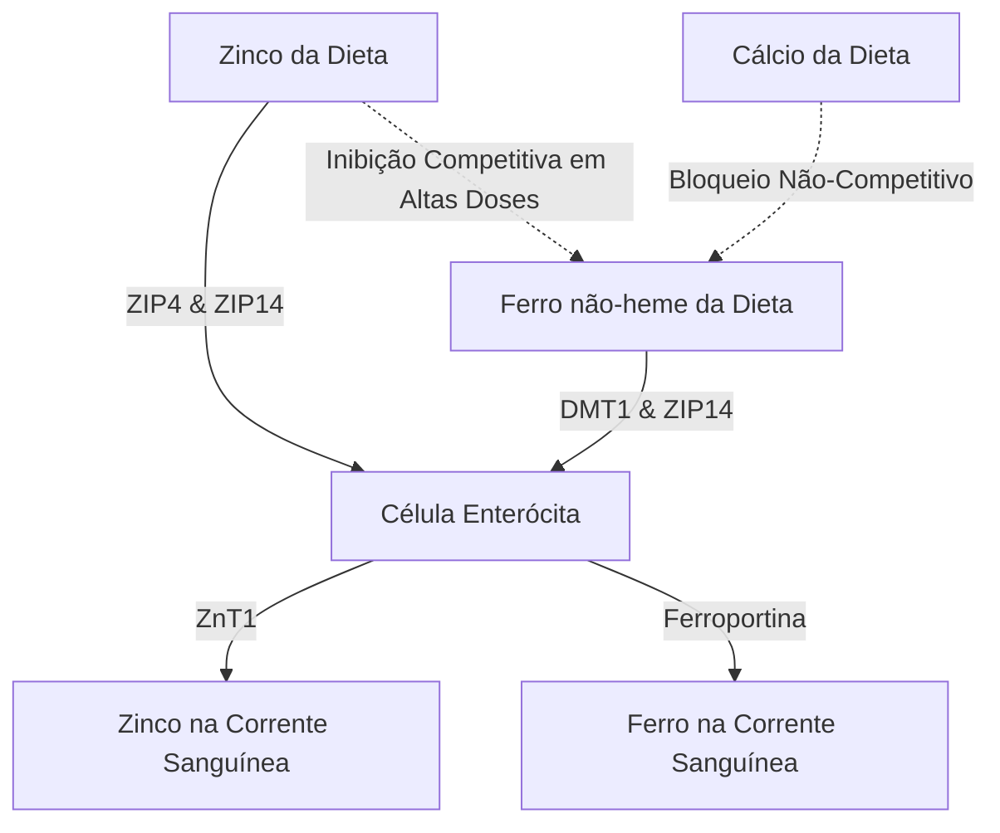

A administração de suplementos de zinco ($\text{Zn}^{2+}$) apresenta uma série de paradoxos fisiológicos e bioquímicos. Embora o zinco seja um mineral vital envolvido em mais de 300 reações enzimáticas, sua entrega oral é frequentemente prejudicada por desconforto gastrointestinal agudo, inibição competitiva por outros cátions divalentes e depleção mineral sistêmica. Resolver esses problemas requer uma compreensão detalhada da cinética dos transportadores intestinais, da bioquímica da mucosa e da cronofarmacologia para projetar protocolos de dosagem ideais.

## O Paradoxo do Estômago Vazio: Irritação da Mucosa vs. Biodisponibilidade

O zinco administrado por via oral apresenta uma escolha difícil: a ingestão com o estômago vazio maximiza a biodisponibilidade celular, mas muitas vezes causa desconforto gastrointestinal agudo (náusea). Por outro lado, administrar o zinco com as refeições mitiga com sucesso o desconforto, mas introduz antagonistas (inibidores) alimentares que reduzem drasticamente a absorção fracionada.

### Mecanismos Moleculares da Irritação Gástrica e Náusea
A ingestão de sais inorgânicos de zinco altamente solúveis em água, como o sulfato de zinco ($\text{ZnSO}_4$) ou o cloreto de zinco ($\text{ZnCl}_2$), leva à rápida dissolução no lúmen gástrico. Em soluções aquosas, esses sais se dissociam completamente, gerando um ambiente localizado altamente concentrado e ácido com um pH de aproximadamente 4.0 a 5.0.

Em estado de jejum, a ausência de um bolo alimentar deixa a mucosa gástrica sem proteção. A súbita exposição a íons de zinco divalentes livres ($\text{Zn}^{2+}$) exerce um efeito cáustico e irritante direto sobre as células epiteliais gástricas. Essa irritação localizada estimula as células parietais gástricas a hipersecretar ácido clorídrico (HCl), reduzindo ainda mais o pH gástrico e induzindo a erosão da mucosa.

A detecção sensorial desse insulto químico e ácido é mediada pela extensa rede de neurônios sensoriais vagais que inervam a parede do estômago. Uma vez ativados, esses neurônios transmitem potenciais de ação através do nervo vago até o tronco cerebral. Isso inicia um reflexo emético (vômito) mediado centralmente, manifestando-se como náusea imediata, esvaziamento gástrico retardado e espasmos estomacais 30 minutos após a ingestão.

### O Bloqueio da Biodisponibilidade: Fitatos, Grãos e Laticínios

Quando o zinco é tomado com alimentos para prevenir a estimulação vagal, sua biodisponibilidade é gravemente comprometida por inibidores alimentares. O mais potente desses inibidores é o **ácido fítico** (fitato), que está altamente concentrado nas cascas externas de grãos de cereais não refinados, leguminosas, nozes e sementes.

No pH fisiológico do duodeno, o ácido fítico atua como um ligante agressivo que quela (prende) os íons $\text{Zn}^{2+}$ livres, formando precipitados de coordenação altamente estáveis, insolúveis e estruturalmente complexos que são completamente resistentes à absorção intestinal. Como os seres humanos não possuem enzimas fitases endógenas no trato gastrointestinal superior, esses complexos de zinco-fitato permanecem não hidrolisados e são excretados nas fezes.

> [!CAUTION]
> Estudos quantitativos com marcadores radioativos demonstram que adicionar apenas 50 mg de fitato a uma refeição reduz a absorção fracionada de zinco em aproximadamente 36% (caindo de 22% para 14%). Concentrações mais altas de fitato (250 mg) suprimem completamente a absorção para meros 6–7%.

Além disso, os produtos lácteos exercem um efeito inibitório independente. A **caseína**, a principal fração proteica no leite de vaca, liga íons de zinco no lúmen intestinal, reduzindo significativamente a biodisponibilidade em comparação com formulações à base de soro de leite (whey).

### Formas de Compostos de Zinco e Tolerabilidade

| Classe Química | Forma do Composto de Zinco | Absorção Fracionada | Tolerabilidade Gástrica | Mecanismo de Ação |
| :--- | :--- | :--- | :--- | :--- |
| **Sal Inorgânico** | Sulfato de Zinco ($\text{ZnSO}_4$) | ~20–49.9% | Alta Irritação (~15% náusea) | Dissocia-se rapidamente em $\text{Zn}^{2+}$ livre; pH ácido (4.0–5.0). |
| **Sal Orgânico** | Gluconato de Zinco | ~50.6–71.7% | Tolerabilidade Média (~5% náusea) | pH neutro (5.5–7.0); dissociação lenta minimiza a exposição da mucosa. |
| **Quelato Orgânico**| Bisglicinato de Zinco | ~50–60% | Tolerabilidade Muito Alta (< 5% náusea) | Ligado à glicina; resiste à dissociação gástrica e interferência de fitato. |
| **Quelato Orgânico**| Picolinato de Zinco | Alta (Superior a longo prazo) | Alta Tolerabilidade | Complexado com ácido picolínico; excelente acúmulo nos tecidos. |

### Protocolo Cientificamente Otimizado

Para contornar completamente tanto o reflexo vagal de náusea de estômago vazio quanto o bloqueio de absorção de fitato, um protocolo clínico específico deve ser utilizado:

1. **Transição para Quelatos Orgânicos:** Os médicos devem substituir os sais inorgânicos de zinco por quelatos orgânicos de pH neutro, como o Bisglicinato de Zinco ou o Picolinato de Zinco. No Bisglicinato de Zinco, o íon $\text{Zn}^{2+}$ é ligado de forma covalente a dois ligantes de glicina, protegendo o mineral da dissociação prematura no ácido gástrico.
2. **Utilizar Vias Alternativas de Absorção:** Ao contrário do zinco inorgânico, que depende estritamente de transportadores dependentes do pH, os quelatos orgânicos são absorvidos intactos por vias alternativas e altamente eficientes (como os cotransportadores de peptídeos).
3. **Refeições Leves com Baixo Teor de Antagonistas:** Se um paciente apresentar extrema sensibilidade e exigir um alimento protetor, o zinco deve ser tomado exclusivamente com um lanche leve completamente livre de fitatos e altas doses de cálcio. Alimentos permitidos incluem pão branco de fermentação natural (sourdough) ou proteínas animais simples (ovos ou whey isolado).

> [!TIP]
> **Dica Profissional:** Para maximizar a absorção e evitar completamente as náuseas, o protocolo ideal é tomar 15–30 mg de Bisglicinato de Zinco elementar com um lanche leve e sem fitatos no início da tarde, garantindo um jejum de 2 horas (incluindo café e chá) antes e depois da ingestão.

## A Guerra dos Transportadores: DMT1 e ZIP14

O enterócito (célula intestinal) do intestino delgado atua como uma arena altamente competitiva para a absorção de metais divalentes. O zinco ($\text{Zn}^{2+}$), ferro não-heme ($\text{Fe}^{2+}$) e cálcio ($\text{Ca}^{2+}$) compartilham vias saturáveis sobrepostas. Isso significa que a coadministração de suplementos em altas doses suprime diretamente a absorção de cada mineral.

### O Cenário dos Transportadores: ZIP4, ZIP14 e DMT1
Na membrana apical (borda em escova) dos enterócitos duodenais, o principal importador do zinco da dieta é o ZIP4. O ferro não-heme (vegetal/inorgânico) que entra no enterócito depende de uma via apical diferente: o Transportador de Metal Divalente-1 (DMT1). No entanto, existe outro transportador crítico, o ZIP14; embora seja classificado como um transportador de zinco, ele também é altamente capaz de transportar ferro ($\text{Fe}^{2+}$).

Devido ao fato de $\text{Zn}^{2+}$ e $\text{Fe}^{2+}$ serem altamente semelhantes em carga e raio iônico, eles competem intensamente por vias de transporte compartilhadas (como o ZIP14). Quando doses terapêuticas (altas) de ferro (100–400 mg) são coadministradas com zinco, o ferro supera o zinco na captação celular.

A pesquisa clínica demonstra que tomar altas doses de ferro simultaneamente com uma dose padrão de 25 mg de zinco reduz a absorção fracionada de zinco em aproximadamente 40–50%. Em uma dose clínica padrão de ferro de 10 mg, ocorre inibição recíproca significativa em uma proporção estrita de 1:1.

## O Perigo da Depleção de Cobre: O Armadilha do Enterócito

Um grande perigo da suplementação de zinco em altas doses a longo prazo é o desenvolvimento insidioso de uma deficiência sistêmica de cobre. Essa via é mediada pela regulação positiva da **metalotioneína** — uma proteína intracelular de ligação a metais dentro dos enterócitos.

Quando um indivíduo consome uma dose elevada de zinco (geralmente excedendo 40–50 mg/dia) por um longo período, o grande influxo celular de $\text{Zn}^{2+}$ atua como um potente sinal transcricional, desencadeando um aumento maciço na síntese de metalotioneína.

Embora a síntesis de metalotioneína seja impulsionada principalmente pelos níveis de zinco, a proteína possui uma afinidade termodinâmica pelo cobre ($\text{Cu}^+$) substancialmente maior do que sua afinidade pelo zinco. Consequentemente, quando o cobre da dieta é absorvido no enterócito, as abundantes moléculas de metalotioneína intracelular rapidamente se ligam e sequestram os íons de cobre.

Este cobre fica preso no complexo metalotioneína-cobre extremamente estável e não pode escapar para a corrente sanguínea. Como as células epiteliais intestinais se renovam e descamam a cada 3 a 5 dias, o cobre sequestrado é perdido nas fezes. Com o tempo, esse bloqueio leva a uma depleção profunda e sistêmica de cobre.

> [!WARNING]
> A suplementação com doses diárias de zinco superiores a 40 mg sem um equilíbrio correspondente de cobre (proporção de 15:1) por mais de quatro semanas consecutivas corre o risco de desencadear severa deficiência de cobre. Isso pode causar perda de cabelo, danos neurológicos irreversíveis e anemia.

### A Proporção de Dosagem Zinco-Cobre Clinicamente Segura
Para prevenir completamente o sequestro de cobre induzido pela metalotioneína durante a suplementação de longo prazo, qualquer suplemento de zinco deve ser pareado com cobre em uma proporção terapêutica altamente específica. A **proporção segura e sinérgica de zinco-cobre é de 8:1 a 15:1**.

Tomar 1 mg de cobre (por exemplo, como gluconato de cobre) para cada 15 mg de zinco elimina completamente esse perigo.

## Cronofarmacologia do Zinco: Regulação Circadiana e Sono

O momento da administração dos nutrientes é um determinante primário da sua eficácia. O zinco exibe uma relação altamente complexa com o relógio biológico interno do corpo, atuando como um regulador circadiano e participante direto nas vias moleculares do sono.

### Zinco, Síntese de Melatonina e GABA
O zinco é um cofator bioquímico fundamental necessário para a síntese da melatonina (o hormônio do sono). Ele estabiliza as enzimas TPH e AANAT, os principais controladores da produção de melatonina. Uma deficiência de zinco regula negativamente a transcrição da AANAT, causando uma queda drástica no pico de melatonina noturna (insônia).

Além da síntese de melatonina, o zinco atua como um neuromodulador direto dentro do sistema nervoso central. Durante a excitação neuronal, o zinco atua como um potente antagonista não competitivo do receptor estimulante NMDA do glutamato. Simultaneamente, o zinco atua como um modulador alostérico positivo dos receptores GABAérgicos (calmantes). Esta dupla ação — suprimir a excitação enquanto aumenta a inibição — facilita uma transição suave para o sono profundo e restaurador.

### Protocolo de Dosagem Otimizado do SuppTime

Para capitalizar sobre esses ritmos biológicos, o momento ideal para a suplementação de zinco é durante o almoço (meio-dia) ou com um lanche leve no final da tarde.

| Horário | Combinação de Suplementos (Stack) | Justificativa Cronobiológica |
| :--- | :--- | :--- |
| **Manhã** | Probióticos | Baixo volume de ácido estomacal ao acordar maximiza a sobrevivência bacteriana através da passagem gástrica. |
| **Café da Manhã** | Ferro Não-Heme, Vitamina C, Vitamina D3 | A Vitamina C melhora a absorção do ferro; vitaminas lipossolúveis são absorvidas com a gordura dietética. Evite Cálcio e Zinco. |
| **Almoço/Tarde** | Bisglicinato de Zinco (15–30 mg) + Cobre (1–2 mg) | Formulado em uma proporção de 15:1 para evitar a armadilha do cobre; totalmente separado do ferro e do cálcio. |
| **Noite** | Cálcio, Glicinato de Magnésio | O magnésio relaxa a musculatura esquelética e modula os receptores calmantes GABA antes de dormir. |

## Referências

1. Institute of Medicine (US) Panel on Micronutrients. [Zinc](https://www.ncbi.nlm.nih.gov/books/NBK222317/). *Dietary Reference Intakes for Vitamin A, Vitamin K, Arsenic, Boron, Chromium, Copper, Iodine, Iron, Manganese, Molybdenum, Nickel, Silicon, Vanadium, and Zinc.* National Academies Press, 2001.
2. National Institutes of Health, Office of Dietary Supplements. [Zinc - Health Professional Fact Sheet](https://ods.od.nih.gov/factsheets/Zinc-HealthProfessional/). *NIH Office of Dietary Supplements.* 2022.
3. Pérès JM, Bureau F, Neuville D, Arhan P, Bouglé D. [Inhibition of zinc absorption by iron depends on their ratio](https://pubmed.ncbi.nlm.nih.gov/11846013/). *Journal of Trace Elements in Medicine and Biology.* 2001.
4. Devarshi PP, Mao Q, Grant RW, Mitmesser SH. [Comparative Absorption and Bioavailability of Various Chemical Forms of Zinc in Humans: A Narrative Review](https://www.ncbi.nlm.nih.gov/pmc/articles/PMC11677333/). *Nutrients.* 2024.
5. Gupta N, Carmichael MF. [Zinc-Induced Copper Deficiency as a Rare Cause of Neurological Deficit and Anemia](https://www.ncbi.nlm.nih.gov/pmc/articles/PMC10510946/). *Cureus.* 2023.

*Este artigo tem fins apenas informativos e não constitui aconselhamento médico. Consulte um profissional de saúde qualificado antes de alterar sua rotina de suplementos ou medicamentos.*
