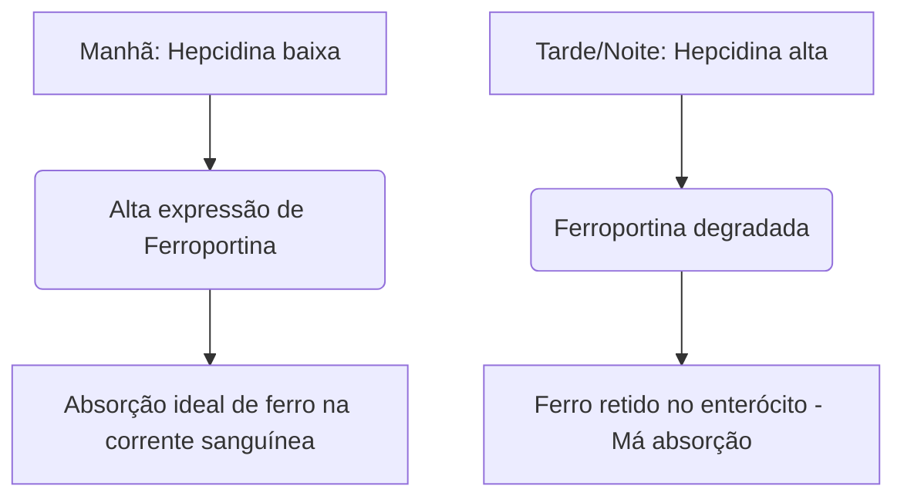

O ferro é um micronutriente indispensável que atua como cofator estrutural e catalítico no transporte de oxigênio, na respiração celular e na síntese de DNA. Apesar de sua abundância ambiental, o ferro é frequentemente um nutriente limitante do crescimento na dieta humana. Como os humanos não possuem nenhum mecanismo fisiológico para a excreção ativa de ferro, o equilíbrio sistêmico de ferro é mantido exclusivamente no nível da absorção intestinal.

O ferro na dieta ocorre em duas formas principais: ferro **orgânico (heme)** e **inorgânico (não heme)**.

O ferro heme é altamente biodisponível, normalmente absorvido a taxas de 15% a 35%. Ele é transportado intacto através da borda em escova apical dos enterócitos duodenais via Proteína Carreadora de Heme 1 (HCP1) e permanece protegido de inibidores dietéticos padrão.

Por outro lado, o ferro não heme (ferro inorgânico) representa mais de 80% da ingestão dietética, mas exibe um perfil de absorção altamente comprometido, com taxas de absorção variando de meros 2% a 20%.

> [!TIP]
> Em pH fisiológico, o ferro não heme existe predominantemente em seu estado férrico (Fe³⁺) oxidado e altamente insolúvel. Para ser absorvido, ele deve sofrer redução ao estado ferroso (Fe²⁺) solúvel pela redutase apical citocromo b duodenal (Dcytb), antes de entrar no enterócito via Transportador de Metal Divalente 1 (DMT1).

## Vias do Ferro Heme vs. Não Heme

| Característica / Métrica | Via do Ferro Heme | Via do Ferro Não Heme (Inorgânico) |
| :--- | :--- | :--- |
| **Fontes Alimentares** | Tecidos animais (hemoglobina, mioglobina) | Plantas, alimentos fortificados com ferro, sais minerais |
| **Transportador Apical** | Proteína Carreadora de Heme 1 (HCP1) | Transportador de Metal Divalente 1 (DMT1) |
| **Estado de Valência Necessário** | Complexo ligado a porfirina | Ferroso (Fe²⁺) |
| **pH Luminal Ideal** | Amplamente estável; não influenciado pelo ácido gástrico | Requer alta acidez (pH < 3.0) para solubilização |
| **Eficácia Típica de Absorção**| 15% – 35% (alta biodisponibilidade) | 2% – 20% (altamente variável) |
| **Sensibilidade a Inibidores** | Insignificante; protegido pelo anel de porfirina | Extremamente alta (inibido por fitatos, polifenóis, cálcio) |

## Cronograma Ideal (Cronofarmacologia)

A otimização da absorção de ferro não heme requer coordenação precisa com a cinética diurna da **hepcidina**, um hormônio peptídico de 25 aminoácidos sintetizado principalmente por hepatócitos. A hepcidina atua como o principal regulador sistêmico da homeostase do ferro ao se ligar diretamente ao exportador basolateral Ferroportina, induzindo sua degradação. Consequentemente, níveis elevados de hepcidina circulante retêm o ferro dentro dos enterócitos duodenais e impedem sua entrada na corrente sanguínea.

### Oscilações Circadianas da Hepcidina
Sob condições fisiológicas basais, as concentrações de hepcidina atingem seu ponto mais baixo de manhã cedo, aumentam continuamente ao longo da tarde até um pico e diminuem durante a noite.

Esta curva circadiana afeta diretamente a cinética do ferro oral. A **administração matinal** de suplementos de ferro permite que o mineral chegue ao duodeno quando a expressão de Ferroportina no enterócito está no auge. Por outro lado, a dosagem à tarde ou à noite força o ferro a competir com um bloqueio elevado de hepcidina, resultando em uma redução de 37% na absorção fracionada de ferro.

### O Impacto da Acidez Gástrica
O estado biofísico do ferro inorgânico é altamente dependente da produção de ácido gástrico. A supressão farmacológica do ácido gástrico via Inibidores da Bomba de Prótons (IBP - protetores gástricos) interrompe severamente este microambiente, elevando o pH gástrico e causando a rápida oxidação de Fe²⁺ solúvel para Fe³⁺ altamente insolúvel.

> [!WARNING]
> Os suplementos orais de ferro devem ser tomados com o estômago vazio — idealmente 1 hora antes ou 2 horas depois de uma refeição — e estritamente separados de quaisquer medicamentos supressores de ácido.

## As Interações Fatais (O Que NÃO Misturar)

A eficácia terapêutica do ferro oral é facilmente comprometida pela ingestão simultânea com vários compostos dietéticos e agentes farmacêuticos.

### Cálcio
O cálcio, seja ingerido como laticínios na dieta (leite, queijo, iogurte) ou como suplementos minerais (carbonato de cálcio), é um inibidor potente da absorção de ferro heme e não heme. A coadministração de 500 mg de carbonato de cálcio com uma refeição contendo ferro reduz a absorção fracionada de ferro em mais de 50%.

### Taninos e Polifenóis
Os polifenóis encontrados no **chá preto, chá verde, chás de ervas e café** são quelantes de ferro excepcionalmente eficazes. Estes compostos derivados de plantas coordenam-se com o ferro férrico para formar complexos organometálicos grandes e altamente estáveis que não conseguem atravessar a borda em escova duodenal. Adicionar apenas uma xícara de café ou chá a uma refeição pode diminuir a absorção de ferro não heme em 40% a 70%.

### Ácido Fítico
O ácido fítico é o principal composto de armazenamento de fósforo em grãos integrais, cereais, nozes e leguminosas. A razão molar ácido fítico-ferro é o fator dietético mais importante que limita a biodisponibilidade de ferro em dietas baseadas em plantas.

### Zinco e Magnésio
O ferro ferroso, o zinco e o magnésio compartilham vias de transporte sobrepostas através da membrana apical do enterócito (como DMT1). Em doses terapêuticas de ferro, ocorre inibição competitiva, suprimindo significativamente o transporte de ferro. Não tome seu suplemento de ferro junto com zinco ou magnésio.

### Medicamentos para a Tireoide (Levotiroxina)
A coadministração de suplementos orais de ferro com levotiroxina (T4) leva a uma grave interação medicamento-nutriente. O ferro se coordena com a molécula de levotiroxina, formando um complexo insolúvel que reduz a biodisponibilidade oral da levotiroxina em 20% a 64%.

> [!CAUTION]
> Para evitar a falha clínica da sua terapia da tireoide, deve haver um intervalo estrito e mínimo de separação de 4 horas entre a administração de levotiroxina e a de ferro.

## O Cofator Definitivo: Vitamina C

O ácido ascórbico (Vitamina C) é o potenciador mais potente da absorção de ferro não heme, capaz de anular os efeitos inibitórios dos fitatos dietéticos, polifenóis e cálcio.

Esta relação sinérgica opera através de um mecanismo bioquímico duplo altamente eficiente:
1. **Redução Termodinamicamente Favorável:** O ácido ascórbico converte rapidamente íons férricos (Fe³⁺) insolúveis na forma ferrosa (Fe²⁺) altamente solúvel, pronta para transporte.
2. **Quelação Duodenal:** O ácido ascórbico age como um escudo protetor, impedindo que o ferro se ligue a fitatos e polifenóis em sua transição para o ambiente alcalino do duodeno.

## Efeitos Colaterais e o Paradigma da Dosagem em Dias Alternados

A abordagem tradicional para tratar a anemia por deficiência de ferro — prescrever altas doses de ferro oral diariamente — frequentemente falha devido a graves efeitos colaterais gastrointestinais (náuseas, constipação) e ciclos de feedback sistêmico.

Devido à baixa absorção fracionada, até 90% de uma dose padrão de ferro oral permanece não absorvida no intestino. Esse excesso de ferro reage com o peróxido de hidrogênio para gerar radicais hidroxila altamente tóxicos, desencadeando estresse oxidativo e inflamação da mucosa.

Além disso, suplementos diários de ferro em altas doses desencadeiam um **"Bloqueio Mucoso" (Mucosal Block)** sistêmico. A ingestão de uma dose de ferro oral ≥ 60 mg induz um rápido aumento na hepcidina sérica que permanece elevada por 24 horas. Se uma segunda dose de ferro for administrada no dia seguinte, os enterócitos serão fisicamente impedidos de exportá-la para a circulação portal. O ferro fica preso e, eventualmente, é excretado.

> [!TIP]
> **Dosagem em Dias Alternados:** Para contornar este bloqueio mediado pela hepcidina, a hematologia moderna mudou para a administração de ferro oral **dia sim, dia não (em dias alternados)**. Ensaios clínicos provam que tomar ferro a cada 48 horas aumenta a absorção fracionada de ferro em 40% a 50% em comparação com a dosagem diária consecutiva, ao mesmo tempo em que reduz drasticamente os efeitos colaterais gastrointestinais.

### Resumo dos Protocolos Clínicos

*   **Baixo pH Gástrico é Essencial:** Tome ferro com o estômago vazio com água.
*   **Evite os Principais Inibidores Alimentares:** Evite estritamente tomar ferro junto com cálcio, laticínios, café ou chá.
*   **Mantenha um Espaçamento Estrito de Medicamentos:** Separe o ferro da levotiroxina por pelo menos 4 horas.
*   **Aproveite a Vitamina C:** A coadministração de ferro com Vitamina C aumenta a absorção em até 300%.
*   **Adote a Dosagem em Dias Alternados:** Espace as doses de ferro oral em 48 horas para evitar o bloqueio da mucosa induzido pela hepcidina e maximizar a absorção.

## Referências

1. Stoffel NU, Zeder C, Brittenham GM, Moretti D, Zimmermann MB. [Iron absorption from oral iron supplements given on consecutive versus alternate days and as single morning doses versus twice-daily split dosing in iron-depleted women: two open-label, randomised controlled trials](https://pubmed.ncbi.nlm.nih.gov/29032957/). *Lancet Haematol.* 2017.
2. Campbell NR, Hasinoff BB. [Ferrous sulfate reduces thyroxine efficacy in patients with hypothyroidism](https://pubmed.ncbi.nlm.nih.gov/1443969/). *Ann Intern Med.* 1992.
3. Hallberg L, Hulthén L. [Effect of ascorbic acid intake on nonheme-iron absorption from a complete diet](https://pubmed.ncbi.nlm.nih.gov/11124756/). *Am J Clin Nutr.* 2000.
4. Lönnerdal B. [Calcium and iron absorption—mechanisms and public health relevance](https://pubmed.ncbi.nlm.nih.gov/21462112/). *Int J Vitam Nutr Res.* 2010.

*Este artigo tem fins apenas informativos e não constitui aconselhamento médico. Consulte um profissional de saúde qualificado antes de alterar sua rotina de suplementos ou medicamentos.*
