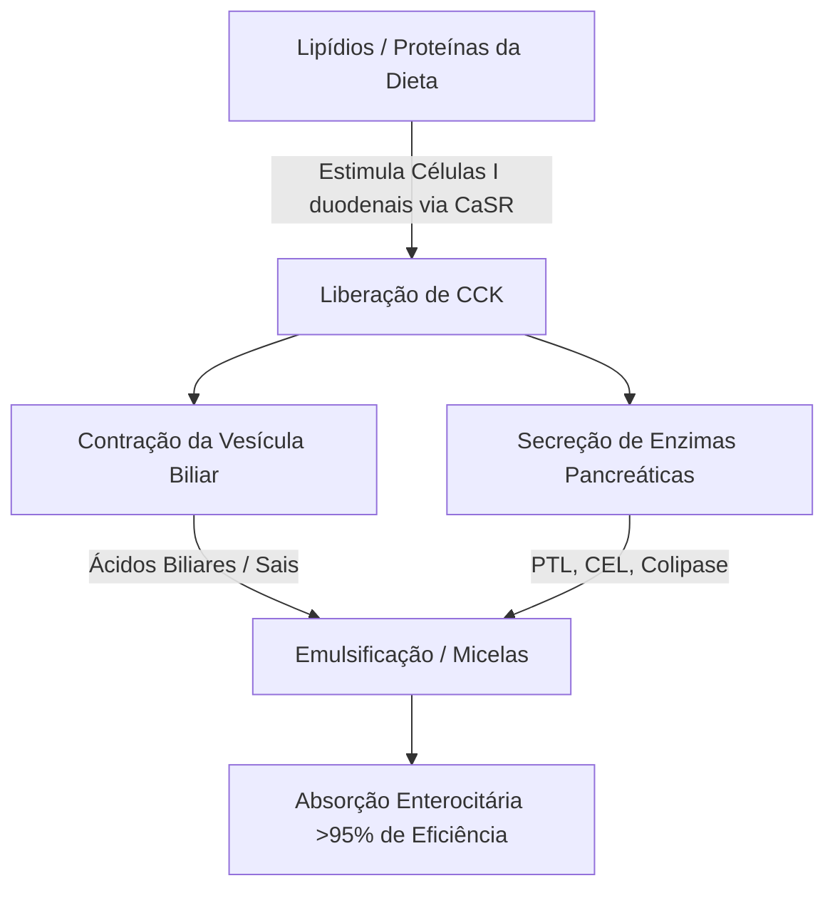
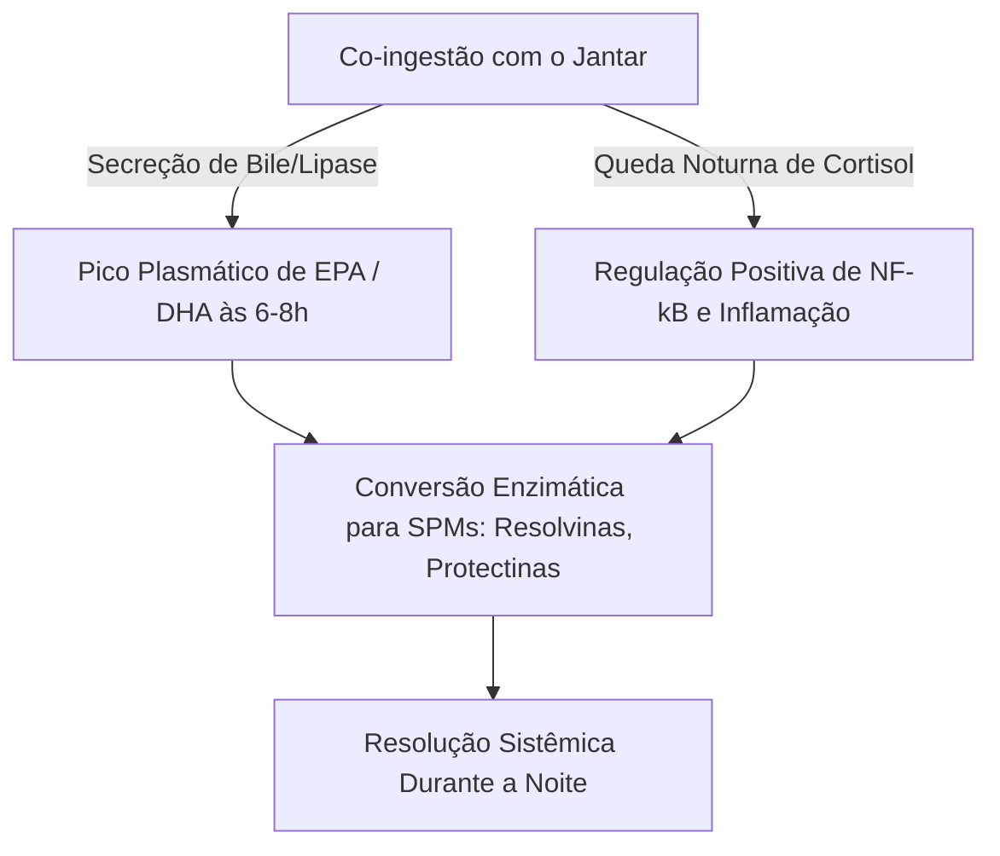

A eficácia terapêutica dos ácidos graxos poli-insaturados ($\text{PUFAs}$) ômega-3 marinhos de cadeia longa, especificamente o ácido eicosapentaenoico ($\text{EPA}$) e o ácido docosahexaenoico ($\text{DHA}$), é estritamente regida por sua biodisponibilidade intestinal. Na nutrição clínica, uma das principais fontes de falha terapêutica é o "paradoxo da refeição magra" (lean-meal paradox) — a administração de lipídios marinhos altamente hidrofóbicos em jejum ou acompanhados de refeições sem gordura. Apesar da ingestão de altas doses nominais, a falta de uma matriz estruturada de co-ingestão de lipídios impede os mecanismos físicos e enzimáticos necessários para a absorção de lipídios no lúmen aquoso do trato gastrointestinal humano. Esta análise clínica detalha os princípios biofísicos, bioquímicos e cronofarmacológicos que ditam a digestão e absorção do $\text{EPA}$ e $\text{DHA}$.

## O Jejum e o Paradoxo da Refeição Magra

O trato gastrointestinal é fundamentalmente um sistema aquoso (baseado em água). Quando lipídios hidrofóbicos, como os óleos de peixe padrão, são ingeridos, eles encontram o ambiente altamente polar dos sucos gástricos e intestinais. De acordo com as leis da termodinâmica, as moléculas hidrofóbicas minimizam seu contato com a água, levando a uma rápida separação de fases. Isso faz com que o óleo ingerido se aglutine em grandes glóbulos lipídicos não divididos que flutuam sobre o quimo gástrico aquoso.

Tomar uma cápsula de ômega-3 com um copo d'água de estômago vazio ou junto com uma refeição contendo apenas carboidratos (como um pedaço de fruta ou uma fatia de pão seco) falha em desencadear os processos fisiológicos necessários para superar essa separação de fases. Sem emulsificação física, a relação superfície-volume da fase lipídica permanece extremamente baixa. Os sítios ativos hidrofílicos das lipases pancreáticas não conseguem acessar as ligações éster enterradas dentro dessas grandes gotas hidrofóbicas. Consequentemente, beber água junto com óleo de peixe não auxilia na absorção; em vez disso, dilui os poucos traços de enzimas digestivas presentes no estado de jejum, afastando os glóbulos lipídicos não emulsificados da membrana em borda em escova do enterócito e levando à má absorção e desconforto gastrointestinal.

Para que esses lipídios altamente hidrofóbicos atravessem a camada aquosa não agitada (unstirred water layer) da mucosa intestinal, eles devem ser convertidos em uma fase dispersível em água termodinamicamente estável. Essa transformação é totalmente dependente da físico-química da micelização, um processo iniciado pela sinalização duodenal mediada por hormônios.

## Sais Biliares e Formação de Micelas

A transição de uma massa de óleo hidrofóbico flutuante para microgotas absorvíveis requer uma cascata secretora e neuromuscular coordenada no duodeno. O principal impulsionador hormonal desse processo é a colecistoquinina ($\text{CCK}$), um peptídeo de 33 aminoácidos sintetizado e secretado pelas células I enteroendócrinas no revestimento da mucosa do duodeno e jejuno superior.



Sob condições fisiológicas, a presença de ácidos graxos de cadeia longa e proteínas parcialmente digeridas no lúmen duodenal estimula o receptor sensível ao cálcio ($\text{CaSR}$) nas células I, desencadeando a rápida exocitose de $\text{CCK}$ na corrente sanguínea. Uma vez liberada, a $\text{CCK}$ se liga aos receptores $\text{CCK}_A$ na parede da vesícula biliar, causando sua contração, ao mesmo tempo que relaxa o esfíncter de Oddi e estimula as células acinares pancreáticas a liberarem suas enzimas digestivas.

Os ácidos biliares liberados pela vesícula biliar — primariamente sais de sódio anfipáticos dos ácidos cólico e quenodeoxicólico — são detergentes biológicos essenciais. Quando as concentrações de ácidos biliares no duodeno excedem a concentração micelar crítica ($\text{CMC}$), eles se organizam ao redor das gotas de lipídios hidrofóbicos. O núcleo esteroide hidrofóbico do sal biliar se associa com a fase lipídica, enquanto o grupo conjugado polar e hidrofílico (glicina ou taurina) fica voltado para o lúmen duodenal aquoso.

Através da ação mecânica do peristaltismo intestinal, essas gotas revestidas de bile são fragmentadas em micelas mistas. Esses agregados coloidais esféricos têm um diâmetro de apenas 3 a 10 nanômetros, aumentando a área de superfície lipídica exposta às lipases pancreáticas em vários milhares de vezes. Sem a co-ingestão de gorduras dietéticas saudáveis (como azeite de oliva extravirgem, abacate ou gemas de ovos caipiras) para desencadear o limiar de liberação de $\text{CCK}$, a contração da vesícula biliar não ocorre. Neste estado, os níveis de ácidos biliares permanecem abaixo da $\text{CMC}$, a secreção de lipase pancreática é mínima e os lipídios ômega-3 ingeridos não conseguem formar micelas, impedindo a absorção.

## Batalha das Formas Bioquímicas: TG vs. EE vs. PL

Suplementos de ômega-3 comercialmente disponíveis existem em três formas moleculares primárias: triglicerídeos naturais ou reesterificados ($\text{TG}$/$\text{rTG}$), ésteres etílicos ($\text{EE}$) e fosfolipídios ($\text{PL}$). A estrutura molecular desses transportadores determina sua taxa de digestão, dependência de lipase e biodisponibilidade.

```text
Forma Triglicerídeo (TG):          Forma Éster Etílico (EE):      Forma Fosfolipídio (PL):
     ┌─ Estrutura de Glicerol           ┌─ Molécula de Etanol          ┌─ Cabeça de Fosfato (Polar)
     ├─ Ácido Graxo (EPA)               └─ Ácido Graxo (EPA)           ├─ Ácido Graxo (EPA)
     ├─ Ácido Graxo (DHA)                                              └─ Ácido Graxo (DHA)
     └─ Ácido Graxo (Outro)
```

Nos triglicerídeos naturais e reesterificados ($\text{TG}$/$\text{rTG}$), três ácidos graxos ($\text{EPA}$/$\text{DHA}$) estão ligados a uma estrutura de glicerol de três carbonos. Durante a digestão, a lipase de triglicerídeos pancreática ($\text{PTL}$), agindo junto com seu cofator colipase, hidrolisa as ligações éster nas posições $sn\text{-}1$ e $sn\text{-}3$. Isso produz dois ácidos graxos livres e um $sn\text{-}2$-monoglicerídeo, ambos os quais são altamente polares, facilmente micelizáveis e prontamente absorvidos pelos enterócitos com mais de 95% de eficiência.

Por outro lado, a forma de éster etílico ($\text{EE}$) é um produto sintético criado durante a concentração química. A estrutura de glicerol é removida, e cada ácido graxo individual é esterificado a uma molécula de etanol ($\text{CH}_3\text{CH}_2\text{OH}$). Essa ligação éster sintética é altamente resistente às enzimas pancreáticas humanas. Estudos in vitro e in vivo mostram que a lipase pancreática humana hidrolisa a ligação ácido graxo-etanol nos ésteres etílicos a uma taxa que é de 10 a 50 vezes mais lenta que as ligações éster de glicerila nos triglicerídeos.

Devido a essa hidrólise lenta, a absorção de $\text{EE}$ é altamente dependente de uma liberação maciça de lipases pancreáticas e sais biliares, que só é desencadeada por uma refeição rica em gordura. Quando tomada com uma dieta com baixo teor de gordura, a lipase pancreática limitada disponível não consegue quebrar as ligações $\text{EE}$ com eficiência, levando a uma baixa biodisponibilidade (frequentemente caindo para aproximadamente 20%) e fazendo com que ésteres sintéticos não absorvidos passem para o cólon, onde podem causar efeitos colaterais gastrointestinais.

A forma de fosfolipídio ($\text{PL}$), extraída principalmente do óleo de krill antártico (Euphausia superba), apresenta uma estrutura anfipática onde o $\text{EPA}$ e o $\text{DHA}$ estão ligados a uma estrutura de fosfatidilcolina. O grupo fosfato da cabeça, altamente polar, torna os fosfolipídios naturalmente dispersíveis em água. Por causa disso, as formas de $\text{PL}$ podem se autoemulsificar e formar microgotas espontâneas no trato gastrointestinal, contornando a exigência absoluta da micelização estimulada por sais biliares. Fosfolipídios também são digeridos pela fosfolipase $\text{A}_2$ e podem ser absorvidos diretamente pelos enterócitos como lisofosfolipídios, resultando em alta biodisponibilidade mesmo em condições de jejum ou baixo teor de gordura.

| Forma Bioquímica | Transportador Molecular / Estrutura | Taxa de Absorção Média (Refeição Magra) | Taxa de Absorção Média (Refeição Rica em Gordura) | Biodisponibilidade Relativa (vs. Base EE) | Dependência de Lipase Pancreática |
| --- | --- | --- | --- | --- | --- |
| Éster Etílico (EE) | Etanol ($\text{CH}_3\text{CH}_2\text{OH}$) | $\approx 20\%$ | $\approx 60\%$ | Base ($100\%$) | Absoluta; hidrolisado 10-50x mais lento que TG |
| Triglicerídeo (TG / rTG) | Estrutura de Glicerol | $\approx 68\%$ | $\approx 90\%$ | $124\%$ a $186\%$ | Alta; rapidamente quebrado em 2-FFA e 1-MAG |
| Fosfolipídio (PL) | Fosfatidilcolina | $\approx 80\%$ a $95\%$ | $>95\%$ | $168\%$ a $500\%$ | Mínima; autoemulsificante, contorna certas lipases |

> [!WARNING]
> Indivíduos que apresentam insuficiência pancreática exócrina (IPE), discinesia biliar ou aqueles pós-colecistectomia (remoção da vesícula) exibem uma digestão de lipídios endógena severamente comprometida. Para essas populações clínicas, a administração de formulações sintéticas de éster etílico (EE) sob restrições dietéticas de baixo teor de gordura representa um alto risco de má absorção completa e desconforto gastrointestinal, pois a clivagem enzimática necessária é virtualmente inexistente nesses estados.

## Oxidação Lipídica e a Necessidade Absoluta de Vitamina E

As características estruturais que tornam o $\text{EPA}$ e o $\text{DHA}$ biologicamente ativos também os tornam altamente instáveis. O $\text{EPA}$ contém cinco e o $\text{DHA}$ contém seis ligações duplas interrompidas por grupos metileno. As ligações carbono-hidrogênio nos carbonos metilênicos bis-alílicos ($\text{-CH=CH-CH}_2\text{-CH=CH-}$) têm baixas energias de dissociação de ligação. Isso as torna excepcionalmente vulneráveis ao ataque de radicais livres e à peroxidação lipídica não enzimática.

```text
Fase 1: Iniciação
  [Ligação Carbono-Hidrogênio do PUFA] + [ROS / Radical Livre] ──> [Radical Lipídico Centrado no Carbono (R•)]

Fase 2: Propagação
  [Radical Lipídico Centrado no Carbono (R•)] + [O2] ──> [Radical Peroxil Lipídico (ROO•)]
  [Radical Peroxil Lipídico (ROO•)] + [PUFA Não Oxidado] ──> [Hidroperóxido Lipídico (ROOH)] + [Novo Radical Lipídico (R•)]

Fase 3: Decomposição
  [Hidroperóxido Lipídico Instável (ROOH)] ──> [Aldeídos Tóxicos (MDA / HHE)]
```

Uma vez ingerido, o óleo de peixe é exposto a um ambiente de $37^\circ\text{C}$ (temperatura corporal), ácidos gástricos e oxigênio molecular dissolvido ($\text{O}_2$). Esse ambiente acelera a cascata de peroxidação lipídica através de três fases distintas:

1. **Iniciação:** Uma espécie reativa de oxigênio ($\text{ROS}$) abstrai um átomo de hidrogênio de um carbono bis-alílico, gerando um radical lipídico centrado no carbono ($\text{R}^\bullet$).
2. **Propagação:** O radical lipídico reage rapidamente com o oxigênio molecular ($\text{O}_2$) para formar um radical peroxil lipídico ($\text{ROO}^\bullet$). Esse radical peroxil, então, abstrai um átomo de hidrogênio de uma molécula adjacente de $\text{PUFA}$ não oxidado, gerando um hidroperóxido lipídico ($\text{ROOH}$) e um novo radical lipídico, perpetuando a reação em cadeia.
3. **Decomposição:** Os hidroperóxidos lipídicos instáveis se decompõem em produtos de oxidação secundária altamente reativos e citotóxicos, incluindo alcenais como malondialdeído ($\text{MDA}$) e 4-hidroxi-hexenal ($\text{HHE}$).

Esses produtos de oxidação secundária são facilmente absorvidos pelo intestino, incorporados aos quilomícrons e às lipoproteínas de baixa densidade ($\text{LDL}$), e podem induzir estresse oxidativo sistêmico, dano endotelial e aterogênese.

Para interromper esse processo, é necessária a co-formulação de um antioxidante lipossolúvel que quebre a cadeia. A vitamina E natural, especificamente o d-alfa-tocoferol ($\text{C}_{29}\text{H}_{50}\text{O}_2$), é altamente otimizada para esse papel. O d-alfa-tocoferol age como um doador de hidrogênio, transferindo rapidamente seu átomo de hidrogênio fenólico para o reativo radical peroxil lipídico ($\text{ROO}^\bullet$) com uma constante de velocidade extremamente rápida de aproximadamente $10^6\,\text{M}^{-1}\text{s}^{-1}$.

O radical tocoferoxil resultante é altamente estável devido à deslocalização por ressonância de seu elétron desemparelhado através do anel cromanol, evitando que ele ataque cadeias adjacentes de ácidos graxos. Isso interrompe a reação em cadeia, protegendo a integridade estrutural das moléculas de $\text{EPA}$ e $\text{DHA}$ para que possam alcançar os tecidos-alvo em seu estado ativo e não oxidado.

## Cronofarmacologia e a Janela Anti-Inflamatória Noturna

Na bioquímica lipídica, o momento (timing) é um fator crítico. Ingerir suplementos de ômega-3 junto com a maior e mais densa refeição em lipídios do dia (normalmente o jantar) otimiza tanto a absorção quanto os processos naturais de cura noturna do corpo.



Primeiro, o jantar é historicamente a refeição que mais contém gordura do dia para muitos indivíduos. Isso fornece o volume físico de lipídios necessário para desencadear a liberação máxima de $\text{CCK}$, levando a uma contração robusta da vesícula biliar, secreção rica em bile e alta atividade da lipase pancreática. Isso otimiza a micelização e a cinética digestiva, garantindo que quase toda a dose ingerida seja absorvida com sucesso.

Segundo, a administração noturna se alinha com os ciclos imunológicos e inflamatórios circadianos do corpo. Os níveis de cortisol endógeno caem naturalmente para seus níveis diurnos mais baixos no final da tarde e início da noite. O cortisol é um hormônio anti-inflamatório potente; quando seus níveis caem, vias inflamatórias sistêmicas — como aquelas governadas pelo fator de transcrição pró-inflamatório $\text{NF}\text{-}\kappa\text{B}$ — experimentam uma "up-regulation" relativa (regulação positiva).

Ao ingerir ômega-3 com o jantar, picos nas concentrações plasmáticas e na membrana celular de $\text{EPA}$ e $\text{DHA}$ são alcançados 6 a 8 horas depois, coincidindo diretamente com essa janela inflamatória noturna. Durante essa fase, o corpo utiliza esses ácidos graxos como substratos para a síntese enzimática de Mediadores Pró-resolutivos Especializados ($\text{SPMs}$) — especificamente resolvinas, protectinas e maresinas — através das vias da ciclo-oxigenase ($\text{COX}$) e lipoxigenase ($\text{LOX}$). Esses $\text{SPMs}$ resolvem ativamente a microinflamação crônica, promovem a renovação celular e apoiam a cura dos tecidos durante o sono.

Adicionalmente, a administração noturna de ômega-3, particularmente $\text{DHA}$, fornece benefícios neurológicos únicos. O $\text{DHA}$ é um lipídio estrutural chave nas membranas neuronais e desempenha um papel importante no relógio circadiano do cérebro. Ele atua sobre genes-relógio (como BMAL1 e CLOCK) responsáveis pela regulação do ciclo sono-vigília.

A integração noturna do $\text{DHA}$ nas membranas sinápticas apoia a comunicação neuronal, aumenta a síntese de serotonina e otimiza sua conversão em melatonina. Ensaios clínicos demonstram que a suplementação noturna consistente de ômega-3 melhora significativamente a eficiência do sono, encurta a latência para o início do sono e reduz o índice de fragmentação do sono (despertares noturnos).

> [!TIP]
> Para maximizar a bioincorporação celular de ácidos graxos ômega-3 de cadeia longa, os médicos devem recomendar que os pacientes administrem sua dose diária juntamente com a refeição mais rica em lipídios do dia. A co-ingestão com pelo menos 10-15 gramas de gorduras mono ou poli-insaturadas saudáveis (ex: azeite extravirgem ou abacate) é suficiente para desencadear o limiar de liberação de colecistoquinina necessário para a micelização ideal.

## Sínteses Clínicas e Recomendações Práticas

Maximizar o potencial terapêutico da suplementação de ômega-3 requer abandonar a simples ingestão de cápsulas de alta dose nominal e adotar uma abordagem baseada na bioquímica de lipídios e na cinética digestiva. A prática tradicional de tomar óleo de peixe com água e de estômago vazio geralmente leva à má absorção e a efeitos colaterais gastrointestinais.

Para resultados terapêuticos ótimos, os médicos devem priorizar formulações de triglicerídeos reesterificados ($\text{rTG}$) ou fosfolipídios ($\text{PL}$), que mostram cinética de absorção superior e são menos dependentes de refeições ricas em gordura do que os ésteres etílicos sintéticos ($\text{EE}$).

Independentemente da formulação escolhida, o suplemento deve ser tomado com uma refeição que contenha pelo menos 10 a 15 gramas de gordura alimentar. Esse limiar lipídico é necessário para desencadear a cascada de sinalização do $\text{CCK}$ duodenal, iniciando a contração da vesícula biliar e a secreção de lipase pancreática para permitir a micelização completa.

Além disso, para proteger esses $\text{PUFAs}$ altamente instáveis contra danos oxidativos no corpo, a formulação deve sempre incluir um antioxidante lipossolúvel natural, como o d-alfa-tocoferol (Vitamina E).

Por fim, alinhar a suplementação com o jantar garante que o pico de absorção coincida com as vias noturnas naturais de reparo celular e anti-inflamatórias do corpo, maximizando os benefícios cardiovasculares, imunológicos e neurológicos do $\text{EPA}$ e $\text{DHA}$.

## Referências

1. Nordøy A, et al. [Absorption of the n-3 eicosapentaenoic and docosahexaenoic acids as ethyl esters and triglycerides by humans](https://pubmed.ncbi.nlm.nih.gov/1826985/). *American Journal of Clinical Nutrition.* 1991.
2. Offman E, Marenco T, Ferber S, Johnson J, Kling D, Curcio D, Davidson M. [Steady-state bioavailability of prescription omega-3 on a low-fat diet is significantly improved with a free fatty acid formulation compared with an ethyl ester formulation: the ECLIPSE II study](https://pubmed.ncbi.nlm.nih.gov/24124374/). *Vascular Health and Risk Management.* 2013.
3. Schuchardt JP, Schneider I, Meyer H, Neubronner J, von Schacky C, Hahn A. [Incorporation of EPA and DHA into plasma phospholipids in response to different omega-3 fatty acid formulations - a comparative bioavailability study of fish oil vs. krill oil](https://pubmed.ncbi.nlm.nih.gov/21854650/). *Lipids in Health and Disease.* 2011.
4. Brown JE, Wahle KW. [Effect of fish-oil and vitamin E supplementation on lipid peroxidation and whole-blood aggregation in man](https://pubmed.ncbi.nlm.nih.gov/2282693/). *Clinica Chimica Acta.* 1990.

*Este artigo tem fins apenas informativos e não constitui aconselhamento médico. Consulte um profissional de saúde qualificado antes de alterar sua rotina de suplementos ou medicamentos.*
