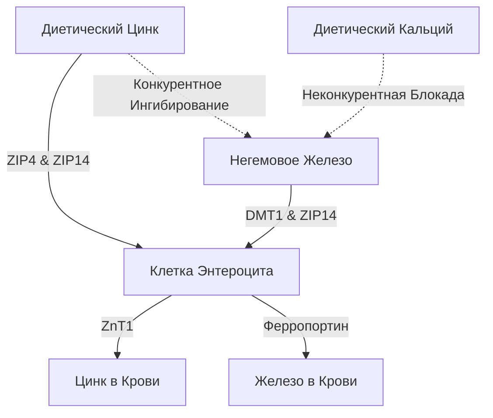

Прием добавок цинка ($\text{Zn}^{2+}$) сопровождается рядом физиологических и биохимических парадоксов. Несмотря на то, что цинк является жизненно важным микроэлементом, участвующим в более чем 300 ферментативных реакциях, его пероральный прием часто затруднен из-за острых желудочно-кишечных расстройств, конкурентного ингибирования другими минералами и системного истощения запасов меди. Решение этих проблем требует детального понимания кинетики кишечных переносчиков и хронофармакологии для разработки оптимальных протоколов.

## Парадокс Пустого Желудка: Раздражение Слизистой против Биодоступности

Пероральный прием цинка ставит перед нами сложный выбор: прием натощак максимизирует клеточную биодоступность, но часто вызывает острые желудочно-кишечные расстройства (сильную тошноту). И наоборот, прием цинка во время еды успешно смягчает дискомфорт, но вводит диетические антагонисты (ингибиторы), которые резко снижают всасывание.

### Молекулярные Механизмы Раздражения Желудка
Проглатывание хорошо растворимых в воде неорганических солей цинка — таких как сульфат цинка ($\text{ZnSO}_4$) или хлорид цинка ($\text{ZnCl}_2$) — приводит к быстрому растворению в просвете желудка. В водных растворах эти соли полностью диссоциируют, образуя высококонцентрированную кислую среду с рН от 4.0 до 5.0.

При голодании отсутствие пищевого комка оставляет слизистую оболочку желудка без буфера. Внезапное воздействие свободных двухвалентных ионов цинка оказывает прямое едкое и раздражающее действие на эпителиальные клетки. Это локализованное раздражение стимулирует париетальные клетки желудка к гиперсекреции соляной кислоты (HCl), что еще больше снижает рН желудка.

Обнаружение этого химического повреждения опосредуется обширной сетью сенсорных нейронов блуждающего нерва, иннервирующих стенку желудка. После активации эти нейроны передают потенциалы действия вверх по блуждающему нерву к стволу мозга. Это инициирует рвотный рефлекс, проявляющийся в виде немедленной тошноты, задержки опорожнения желудка и спазмов в течение 30 минут после приема.

### Блокада Биодоступности: Фитаты, Злаки и Молочные Продукты

Когда цинк принимают с пищей для предотвращения стимуляции блуждающего нерва, его биодоступность серьезно страдает от диетических ингибиторов. Наиболее мощным из этих ингибиторов является **фитиновая кислота** (фитат), которая в высокой концентрации содержится в наружных оболочках неочищенных злаков, бобовых, орехов и семян.

При физиологическом рН двенадцатиперстной кишки фитиновая кислота действует как агрессивный лиганд, который хелатирует свободные ионы $\text{Zn}^{2+}$, образуя высокостабильные, нерастворимые осадки, полностью устойчивые к всасыванию в кишечнике. Поскольку людям не хватает эндогенных ферментов фитазы, эти комплексы цинк-фитат остаются негидролизованными и выводятся с калом.

> [!CAUTION]
> Количественные исследования с радиоактивными маркерами показывают, что добавление всего 50 мг фитата к еде снижает дробное всасывание цинка примерно на 36% (снижение с базового уровня в 22% до 14%). Более высокие концентрации фитата (250 мг) полностью подавляют абсорбцию.

Кроме того, молочные продукты оказывают независимое тормозящее действие. **Казеин**, первичная белковая фракция коровьего молока, связывает ионы цинка в просвете кишечника, значительно снижая биодоступность по сравнению с препаратами на основе сывороточного белка.

### Формы Цинка и Переносимость

| Химический Класс | Форма Соединения Цинка | Всасывание | Желудочная Переносимость | Механизм Действия |
| :--- | :--- | :--- | :--- | :--- |
| **Неорганическая Соль** | Сульфат Цинка ($\text{ZnSO}_4$) | ~20–49.9% | Высокое Раздражение (~15% тошнота) | Быстро диссоциирует; кислый рН (4.0–5.0). |
| **Органическая Соль** | Глюконат Цинка | ~50.6–71.7% | Средняя Переносимость (~5% тошнота) | Нейтральный рН; медленная диссоциация минимизирует раздражение. |
| **Органический Хелат**| Бисглицинат Цинка | ~50–60% | Очень Высокая Переносимость (< 5% тошнота) | Связан с глицином; устойчив к желудочной диссоциации и фитатам. |

### Оптимальный Протокол Дозирования

1. **Переход на Органические Хелаты:** Неорганические соли цинка следует заменить на металло-аминокислотные хелаты, такие как Бисглицинат Цинка. Ион $\text{Zn}^{2+}$ ковалентно связан с двумя лигандами глицина, что защищает минерал от преждевременной диссоциации в желудочном соке.
2. **Использование Альтернативных Путей:** Хелаты всасываются интактными через высокоэффективные пептидные котранспортеры.
3. **Буферное Питание без Антагонистов:** Если цинк необходимо принимать с пищей, следует избегать фитатов и кальция. Допускается белый хлеб на закваске (ферментация расщепляет фитаты) или простые животные белки (яйца или изолят сывороточного протеина).

> [!TIP]
> **Pro Tip:** Чтобы максимизировать всасывание и полностью избежать тошноты, идеальный протокол — принимать 15–30 мг бисглицината цинка с легкой закуской без фитатов во второй половине дня, соблюдая 2-часовой интервал до и после еды.

## Войны Транспортеров: DMT1 и ZIP14

Энтероцит (клетка кишечника) тонкой кишки выступает в качестве высококонкурентной арены для поглощения двухвалентных металлов. Цинк ($\text{Zn}^{2+}$), негемовое железо ($\text{Fe}^{2+}$) и кальций ($\text{Ca}^{2+}$) имеют общие пути транспорта. Это означает, что совместное введение высоких доз добавок напрямую подавляет усвоение каждого минерала.

### Транспортеры: ZIP4, ZIP14 и DMT1
На апикальной мембране дуоденальных энтероцитов основным импортером цинка является ZIP4. Негемовое (растительное/неорганическое) железо зависит от другого пути: DMT1. Однако существует еще один критический транспортер, ZIP14; хотя он классифицируется как переносчик цинка, он также в высокой степени способен транспортировать железо ($\text{Fe}^{2+}$).

Поскольку $\text{Zn}^{2+}$ и $\text{Fe}^{2+}$ очень похожи по заряду и ионному радиусу, они интенсивно конкурируют за общие внутриклеточные пути транспорта (такие как ZIP14). Когда терапевтические дозы железа (100–400 мг) вводятся совместно с цинком, железо вытесняет цинк. Клинические исследования показывают, что совместный прием высоких доз железа со стандартной дозой цинка в 25 мг снижает фракционное всасывание цинка примерно на 40–50%.

## Опасность Истощения Меди

Серьезной опасностью длительного приема высоких доз цинка является коварное развитие системного дефицита меди. Этот путь опосредуется повышающей регуляцией **металлотионеина** — внутриклеточного металл-связывающего белка в энтероцитах.

Когда человек потребляет высокую дозу цинка (>40–50 мг/день) в течение длительного периода, большой приток клеточного цинка действует как мощный сигнал, запускающий массовый синтез металлотионеина. Хотя его синтез в значительной степени обусловлен уровнем цинка, белок обладает термодинамическим сродством к меди ($\text{Cu}^+$), которое существенно выше его сродства к цинку.

Следовательно, когда диетическая медь всасывается в энтероцит, молекулы металлотионеина быстро связывают и секвестрируют ионы меди. Эта медь оказывается запертой в комплексе и не может проникнуть в кровоток. Поскольку клетки кишечника обновляются каждые 3-5 дней, запертая в них медь выводится с калом. Со временем эта блокада приводит к глубокому системному истощению меди.

> [!WARNING]
> Ежедневный прием доз цинка, превышающих 40 мг без соответствующего баланса меди в соотношении 15:1 в течение более четырех недель подряд, может спровоцировать тяжелый дефицит меди (выпадение волос, анемия, необратимое повреждение нервов).

## Хронофармакология Цинка: Циркадный Ритм и Сон

Время введения нутриентов имеет решающее значение. Цинк является фундаментальным биохимическим кофактором, необходимым для синтеза мелатонина (гормона сна). Он стабилизирует ферменты TPH и AANAT. Дефицит цинка напрямую снижает уровень ночного мелатонина.

Кроме того, цинк действует как прямой нейромодулятор, выступая мощным блокатором возбуждающего рецептора NMDA и одновременно усилителем успокаивающих рецепторов GABA. Это двойное действие способствует плавному переходу в глубокий медленноволновой сон.

### Оптимизированный Протокол SuppTime

| Время | Комбинация Добавок | Хронобиологическое Обоснование |
| :--- | :--- | :--- |
| **Утро** | Пробиотики | Низкий объем желудочной кислоты максимизирует выживаемость бактерий. |
| **Завтрак** | Негемовое Железо, Витамин С, Витамин D3 | Витамин С улучшает усвоение железа. Избегайте кальция и цинка. |
| **Обед** | Бисглицинат Цинка (15–30 мг) + Медь (1–2 мг) | Сформулировано в соотношении 15:1 для предотвращения ловушки меди; полностью отделено от железа. |
| **Ночь** | Кальций, Глицинат Магния | Магний расслабляет мышцы и модулирует рецепторы GABA перед сном. |

## Источники

1. Institute of Medicine (US) Panel on Micronutrients. [Zinc](https://www.ncbi.nlm.nih.gov/books/NBK222317/). *Dietary Reference Intakes for Vitamin A, Vitamin K, Arsenic, Boron, Chromium, Copper, Iodine, Iron, Manganese, Molybdenum, Nickel, Silicon, Vanadium, and Zinc.* National Academies Press, 2001.
2. National Institutes of Health, Office of Dietary Supplements. [Zinc - Health Professional Fact Sheet](https://ods.od.nih.gov/factsheets/Zinc-HealthProfessional/). *NIH Office of Dietary Supplements.* 2022.
3. Pérès JM, Bureau F, Neuville D, Arhan P, Bouglé D. [Inhibition of zinc absorption by iron depends on their ratio](https://pubmed.ncbi.nlm.nih.gov/11846013/). *Journal of Trace Elements in Medicine and Biology.* 2001.
4. Devarshi PP, Mao Q, Grant RW, Mitmesser SH. [Comparative Absorption and Bioavailability of Various Chemical Forms of Zinc in Humans: A Narrative Review](https://www.ncbi.nlm.nih.gov/pmc/articles/PMC11677333/). *Nutrients.* 2024.
5. Gupta N, Carmichael MF. [Zinc-Induced Copper Deficiency as a Rare Cause of Neurological Deficit and Anemia](https://www.ncbi.nlm.nih.gov/pmc/articles/PMC10510946/). *Cureus.* 2023.

*Данная статья предназначена только для ознакомительных целей и не является медицинской консультацией. Проконсультируйтесь с квалифицированным специалистом здравоохранения, прежде чем менять свой режим приема добавок или лекарств.*
