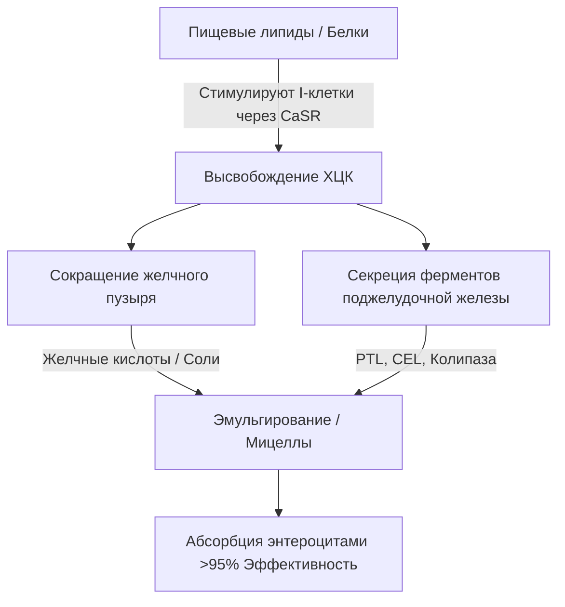
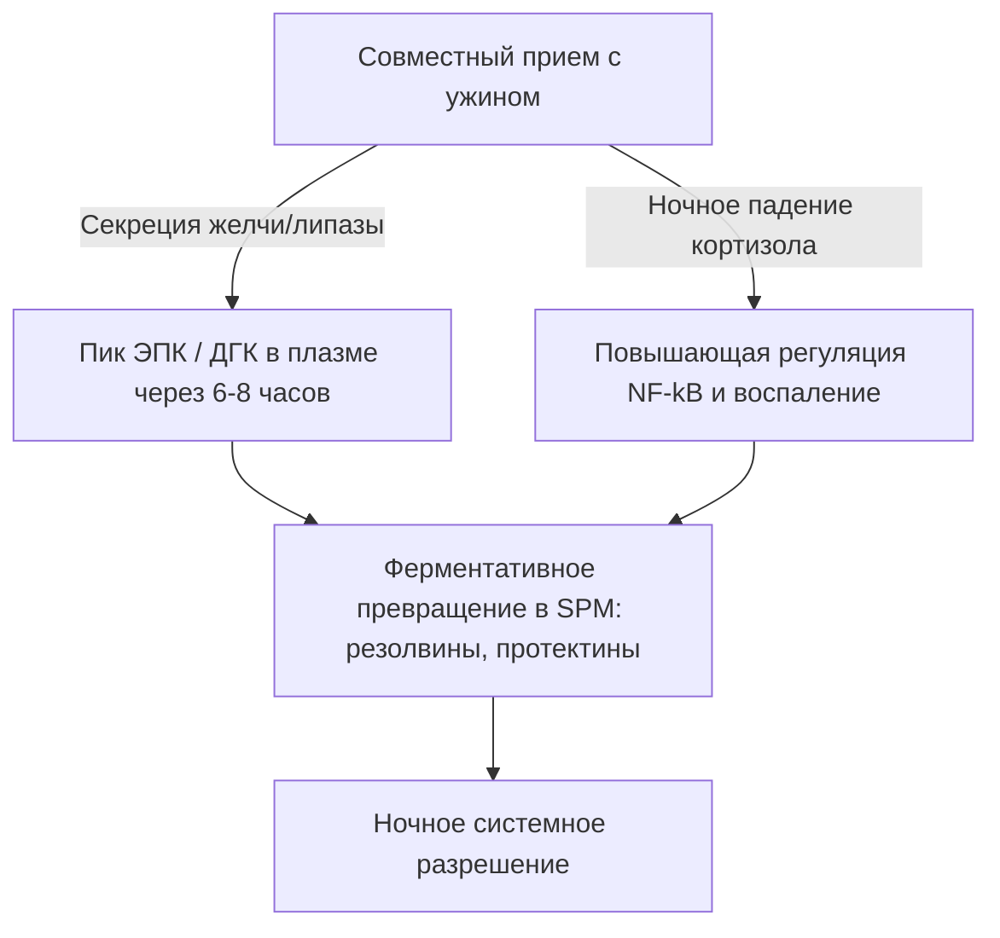

Терапевтическая эффективность длинноцепочечных морских омега-3 полиненасыщенных жирных кислот ($\text{ПНЖК}$), в частности эйкозапентаеновой кислоты ($\text{ЭПК}$) и докозагексаеновой кислоты ($\text{ДГК}$), строго определяется их биодоступностью в кишечнике. В клинической нутрициологии одной из главных причин терапевтической неудачи является «парадокс нежирной пищи» (lean-meal paradox) — прием высокогидрофобных морских липидов натощак или вместе с обезжиренной пищей. Несмотря на прием высоких номинальных доз, отсутствие структурированной матрицы совместного переваривания липидов препятствует физическим и ферментативным механизмам, необходимым для всасывания жиров в водном просвете желудочно-кишечного тракта человека. В данном клиническом анализе подробно описываются биофизические, биохимические и хронофармакологические принципы, определяющие переваривание и всасывание $\text{ЭПК}$ и $\text{ДГК}$.

## Голодание и парадокс нежирной пищи

Желудочно-кишечный тракт по своей сути является водной системой. Когда гидрофобные липиды, такие как стандартный рыбий жир, попадают внутрь, они сталкиваются с высокополярной средой желудочного и кишечного соков. Согласно законам термодинамики, гидрофобные молекулы сводят к минимуму контакт с водой, что приводит к быстрому разделению фаз. В результате проглоченный жир сливается в крупные неразделенные липидные глобулы, которые плавают на поверхности водного желудочного химуса.

Прием капсулы омега-3 со стаканом воды натощак или вместе с углеводной пищей (например, кусочком фрукта или ломтиком сухого хлеба) не запускает физиологические процессы, необходимые для преодоления этого разделения фаз. Без физического эмульгирования отношение площади поверхности к объему липидной фазы остается крайне низким. Гидрофильные активные центры панкреатических липаз не могут получить доступ к эфирным связям, скрытым внутри этих крупных гидрофобных капель. Следовательно, запивание рыбьего жира водой не способствует усвоению; напротив, вода разбавляет следовые количества пищеварительных ферментов, присутствующих в состоянии натощак, отдаляя неэмульгированные липидные глобулы от щеточной каемки энтероцитов, что приводит к мальабсорбции и желудочно-кишечному дискомфорту.

Для того чтобы эти высокогидрофобные липиды смогли пересечь неперемешиваемый водный слой (unstirred water layer) слизистой оболочки кишечника, они должны быть преобразованы в термодинамически стабильную, диспергируемую в воде фазу. Эта трансформация полностью зависит от физической химии мицеллообразования — процесса, инициируемого гормонально-опосредованной передачей сигналов в двенадцатиперстной кишке.

## Желчные соли и образование мицелл

Переход от плавающей гидрофобной массы жира к всасываемым микрокаплям требует скоординированного нейромышечного и секреторного каскада в двенадцатиперстной кишке. Главным гормональным драйвером этого процесса является холецистокинин ($\text{ХЦК}$), пептид из 33 аминокислот, синтезируемый и секретируемый энтероэндокринными I-клетками в слизистой оболочке двенадцатиперстной и верхней части тощей кишки.



В физиологических условиях наличие длинноцепочечных жирных кислот и частично переваренных белков в просвете двенадцатиперстной кишки стимулирует кальций-чувствительный рецептор ($\text{CaSR}$) на I-клетках, вызывая быстрый экзоцитоз $\text{ХЦК}$ в кровоток. После высвобождения $\text{ХЦК}$ связывается с рецепторами $\text{ХЦК}_A$ на стенке желчного пузыря, вызывая его сокращение, одновременно расслабляя сфинктер Одди и стимулируя ацинарные клетки поджелудочной железы к высвобождению пищеварительных ферментов.

Желчные кислоты, высвобождаемые из желчного пузыря (преимущественно амфипатические натриевые соли холевой и хенодезоксихолевой кислот), являются важными биологическими детергентами. Когда концентрация желчных кислот в двенадцатиперстной кишке превышает критическую концентрацию мицеллообразования ($\text{ККМ}$), они выстраиваются вокруг гидрофобных липидных капель. Гидрофобное стероидное ядро желчной соли связывается с липидной фазой, тогда как полярная, гидрофильная конъюгированная группа (глицин или таурин) обращена к водному просвету двенадцатиперстной кишки.

Благодаря механическому воздействию перистальтики кишечника эти покрытые желчью капли разбиваются на смешанные мицеллы. Эти сферические коллоидные агрегаты имеют диаметр всего 3–10 нанометров, что увеличивает площадь поверхности липидов, подвергающихся воздействию панкреатических липаз, в несколько тысяч раз. Без совместного приема здоровых пищевых жиров (таких как оливковое масло первого отжима, авокадо или яичные желтки) для запуска порога высвобождения $\text{ХЦК}$ сокращение желчного пузыря не происходит. В этом состоянии уровень желчных кислот остается ниже $\text{ККМ}$, секреция панкреатической липазы минимальна, и проглоченные липиды омега-3 не могут образовывать мицеллы, что препятствует их усвоению.

## Битва биохимических форм: TG против EE против PL

Доступные в продаже добавки омега-3 существуют в трех основных молекулярных формах: натуральные или реэтерифицированные триглицериды ($\text{TG}$/$\text{rTG}$), этиловые эфиры ($\text{EE}$) и фосфолипиды ($\text{PL}$). Молекулярная структура этих носителей определяет скорость их переваривания, зависимость от липазы и биодоступность.

```text
Форма Триглицерида (TG):           Форма Этилового Эфира (EE):    Форма Фосфолипида (PL):
     ┌─ Глицериновый остов              ┌─ Молекула Этанола            ┌─ Фосфатная Головка (Полярная)
     ├─ Жирная кислота (ЭПК)            └─ Жирная кислота (ЭПК)        ├─ Жирная кислота (ЭПК)
     ├─ Жирная кислота (ДГК)                                           └─ Жирная кислота (ДГК)
     └─ Жирная кислота (Другая)
```

В природных и реэтерифицированных триглицеридах ($\text{TG}$/$\text{rTG}$) три жирные кислоты ($\text{ЭПК}$/$\text{ДГК}$) связаны с трехуглеродным глицериновым остовом. Во время пищеварения панкреатическая триглицеридная липаза ($\text{PTL}$), действуя вместе со своим кофактором колипазой, гидролизует эфирные связи в положениях $sn\text{-}1$ и $sn\text{-}3$. При этом образуются две свободные жирные кислоты и один $sn\text{-}2$-моноглицерид, которые обладают высокой полярностью, легко мицеллизируются и легко абсорбируются энтероцитами с эффективностью более 95%.

Напротив, форма этилового эфира ($\text{EE}$) является синтетическим продуктом, созданным в процессе химического концентрирования. Глицериновый остов удаляется, и каждая отдельная жирная кислота этерифицируется молекулой этанола ($\text{CH}_3\text{CH}_2\text{OH}$). Эта синтетическая эфирная связь обладает высокой устойчивостью к ферментам поджелудочной железы человека. Исследования in vitro и in vivo показывают, что панкреатическая липаза человека гидролизует связь жирной кислоты и этанола в $\text{EE}$ со скоростью, в 10-50 раз меньшей, чем связи глицерилового эфира в триглицеридах.

Из-за такого медленного гидролиза абсорбция $\text{EE}$ сильно зависит от массивного высвобождения панкреатических липаз и солей желчных кислот, которое вызывается только приемом жирной пищи. При приеме на низкожировой диете ограниченное количество доступной панкреатической липазы не может эффективно расщеплять связи $\text{EE}$, что приводит к плохой биодоступности (часто падающей примерно до 20%) и приводит к тому, что неабсорбированные синтетические эфиры попадают в толстую кишку, где они могут вызывать желудочно-кишечные побочные эффекты.

Фосфолипидная ($\text{PL}$) форма, в основном получаемая из масла антарктического криля (Euphausia superba), имеет амфипатическую структуру, где $\text{ЭПК}$ и $\text{ДГК}$ связаны с фосфатидилхолиновым остовом. Высокополярная фосфатная головная группа делает фосфолипиды диспергируемыми в воде от природы. Благодаря этому формы $\text{PL}$ могут самоэмульгироваться и образовывать спонтанные микрокапли в желудочно-кишечном тракте в обход абсолютного требования мицеллообразования, стимулируемого солями желчных кислот. Фосфолипиды также расщепляются фосфолипазой $\text{A}_2$ и могут напрямую всасываться энтероцитами в виде лизофосфолипидов, что приводит к высокой биодоступности даже в условиях голодания или при низком содержании жира.

| Биохимическая Форма | Молекулярный Носитель / Остов | Средняя Скорость Всасывания (Нежирная Пища) | Средняя Скорость Всасывания (Жирная Пища) | Относительная Биодоступность (отн. EE) | Зависимость от панкреатической липазы |
| --- | --- | --- | --- | --- | --- |
| Этиловый эфир (EE) | Этанол ($\text{CH}_3\text{CH}_2\text{OH}$) | $\approx 20\%$ | $\approx 60\%$ | Базовая линия ($100\%$) | Абсолютная; гидролизуется в 10–50 раз медленнее, чем TG |
| Триглицерид (TG / rTG) | Глицериновый остов | $\approx 68\%$ | $\approx 90\%$ | от $124\%$ до $186\%$ | Высокая; быстро расщепляется на 2-FFA и 1-MAG |
| Фосфолипид (PL) | Фосфатидилхолин | от $\approx 80\%$ до $95\%$ | $>95\%$ | от $168\%$ до $500\%$ | Минимальная; самоэмульгируется, обходит некоторые липазы |

> [!WARNING]
> Лица с экзокринной недостаточностью поджелудочной железы (ЭНПЖ), дискинезией желчевыводящих путей или после холецистэктомии имеют серьезно нарушенное эндогенное переваривание липидов. Для таких клинических популяций применение синтетических составов этилового эфира (EE) в условиях ограничений диеты с низким содержанием жиров представляет высокий риск полной мальабсорбции и желудочно-кишечного дискомфорта, поскольку необходимое ферментативное расщепление в этих состояниях практически отсутствует.

## Окисление липидов и абсолютная необходимость витамина Е

Структурные особенности, которые делают $\text{ЭПК}$ и $\text{ДГК}$ биологически активными, также делают их крайне нестабильными. $\text{ЭПК}$ содержит пять, а $\text{ДГК}$ — шесть прерванных метиленом двойных связей. Углерод-водородные связи у бис-аллильных метиленовых атомов углерода ($\text{-CH=CH-CH}_2\text{-CH=CH-}$) обладают низкой энергией диссоциации связей. Это делает их исключительно уязвимыми для атак свободных радикалов и неферментативного перекисного окисления липидов.

```text
Фаза 1: Инициация
  [Связь Углерод-Водород ПНЖК] + [АФК / Свободный радикал] ──> [Углерод-центрированный липидный радикал (R•)]

Фаза 2: Пропагация
  [Углерод-центрированный липидный радикал (R•)] + [O2] ──> [Липидный пероксильный радикал (ROO•)]
  [Липидный пероксильный радикал (ROO•)] + [Неокисленная ПНЖК] ──> [Липидный гидропероксид (ROOH)] + [Новый липидный радикал (R•)]

Фаза 3: Разложение
  [Нестабильный липидный гидропероксид (ROOH)] ──> [Токсичные альдегиды (MDA / HHE)]
```

Попадая внутрь, рыбий жир подвергается воздействию температуры $37^\circ\text{C}$ (температура тела), желудочной кислоты и растворенного молекулярного кислорода ($\text{O}_2$). Эта среда ускоряет каскад перекисного окисления липидов, проходящий три различных фазы:

1. **Инициация:** Активные формы кислорода ($\text{АФК}$) отщепляют атом водорода от бис-аллильного атома углерода, генерируя центрированный на углероде липидный радикал ($\text{R}^\bullet$).
2. **Пропагация (Развитие):** Липидный радикал быстро реагирует с молекулярным кислородом ($\text{O}_2$), образуя липидный пероксильный радикал ($\text{ROO}^\bullet$). Этот пероксильный радикал затем отщепляет атом водорода от соседней неокисленной молекулы $\text{ПНЖК}$, образуя липидный гидропероксид ($\text{ROOH}$) и новый липидный радикал, закрепляя цепную реакцию.
3. **Разложение:** Нестабильные липидные гидропероксиды разлагаются на высокореактивные, цитотоксичные вторичные продукты окисления, включая алкенали, такие как малоновый диальдегид ($\text{MDA}$) и 4-гидроксигексеналь ($\text{HHE}$).

Эти продукты вторичного окисления легко абсорбируются через кишечник, включаются в хиломикроны и липопротеины низкой плотности ($\text{ЛПНП}$) и могут вызывать системный окислительный стресс, повреждение эндотелия и атерогенез.

Для остановки этого процесса требуется совместная формула растворимого в жирах антиоксиданта, обрывающего цепь. Природный витамин Е, в частности d-альфа-токоферол ($\text{C}_{29}\text{H}_{50}\text{O}_2$), в высшей степени оптимизирован для этой роли. D-альфа-токоферол действует как донор водорода, быстро передавая свой фенольный атом водорода реакционноспособному липидному пероксильному радикалу ($\text{ROO}^\bullet$) с чрезвычайно быстрой константой скорости, составляющей примерно $10^6\,\text{M}^{-1}\text{с}^{-1}$.

Образующийся токофероксильный радикал обладает высокой стабильностью из-за резонансной делокализации его неспаренного электрона по хроманоловому кольцу, что не позволяет ему атаковать соседние цепи жирных кислот. Это останавливает цепную реакцию, защищая структурную целостность молекул $\text{ЭПК}$ и $\text{ДГК}$, чтобы они могли достичь тканей-мишеней в своем активном, неокисленном состоянии.

## Хронофармакология и ночное противовоспалительное окно

В липидной биохимии время — критический фактор. Прием добавок омега-3 вместе с самым обильным и жиросодержащим приемом пищи за день (обычно ужином) оптимизирует как усвоение, так и естественные процессы ночного восстановления организма.



Во-первых, исторически ужин для многих людей является приемом пищи с наибольшим содержанием жира в течение дня. Это обеспечивает физический объем липидов, необходимый для запуска максимального высвобождения $\text{ХЦК}$, что приводит к сильному сокращению желчного пузыря, обильной секреции желчи и высокой активности панкреатической липазы. Это оптимизирует кинетику мицеллообразования и пищеварения, обеспечивая успешное усвоение почти всей принятой дозы.

Во-вторых, вечерний прием согласуется с циркадными иммунными и воспалительными циклами организма. Уровни эндогенного кортизола естественным образом снижаются до самых низких суточных значений поздно вечером и ранней ночью. Кортизол является мощным противовоспалительным гормоном; когда его уровень падает, системные воспалительные пути — например, управляемые провоспалительным фактором транскрипции $\text{NF}\text{-}\kappa\text{B}$ — подвергаются относительной «повышающей регуляции».

При приеме омега-3 за ужином пиковые концентрации $\text{ЭПК}$ и $\text{ДГК}$ в плазме и клеточных мембранах достигаются через 6–8 часов, что напрямую совпадает с этим ночным окном воспаления. В этой фазе организм использует эти жирные кислоты в качестве субстратов для ферментативного синтеза специализированных проразрешающих медиаторов ($\text{SPM}$) — в частности, резолвинов, протектинов и марезинов — через пути циклооксигеназы ($\text{ЦОГ}$) и липоксигеназы ($\text{ЛОГ}$). Эти $\text{SPM}$ активно разрешают хроническое микровоспаление, способствуют обновлению клеток и поддерживают восстановление тканей во время сна.

Кроме того, вечерний прием омега-3, в частности $\text{ДГК}$, обеспечивает уникальные неврологические преимущества. $\text{ДГК}$ является ключевым структурным липидом в мембранах нейронов и играет важную роль в циркадных часах мозга. Она воздействует на часовые гены (такие как BMAL1 и CLOCK), ответственные за регуляцию цикла сна-бодрствования.

Ночная интеграция $\text{ДГК}$ в синаптические мембраны поддерживает связь между нейронами, усиливает синтез серотонина и оптимизирует его превращение в мелатонин. Клинические испытания показывают, что последовательный вечерний прием добавок омега-3 значительно улучшает эффективность сна, сокращает задержку начала сна и снижает индекс фрагментации сна (ночные пробуждения).

> [!TIP]
> Чтобы максимизировать клеточную биоинкорпорацию длинноцепочечных жирных кислот омега-3, врачи должны рекомендовать пациентам принимать суточную дозу вместе с самым насыщенным липидами приемом пищи за день. Совместного приема как минимум 10–15 граммов полезных мононенасыщенных или полиненасыщенных жиров (например, оливкового масла первого холодного отжима или авокадо) достаточно, чтобы запустить порог высвобождения холецистокинина, необходимый для оптимального образования мицелл.

## Клинические выводы и практические рекомендации

Максимизация терапевтического потенциала добавок омега-3 требует отхода от простого проглатывания капсул с высокой номинальной дозой в сторону подхода, основанного на биохимии липидов и кинетике пищеварения. Традиционная практика приема рыбьего жира с водой натощак часто приводит к плохому усвоению и побочным эффектам со стороны желудочно-кишечного тракта.

Для достижения оптимальных терапевтических результатов клиницистам следует отдавать предпочтение составам с реэтерифицированными триглицеридами ($\text{rTG}$) или фосфолипидами ($\text{PL}$), которые обладают превосходной кинетикой всасывания и в меньшей степени зависят от жирной пищи, чем синтетические этиловые эфиры ($\text{EE}$).

Независимо от выбранного состава, добавку необходимо принимать вместе с пищей, содержащей не менее 10–15 граммов пищевых жиров. Этот липидный порог необходим для запуска дуоденального сигнального каскада $\text{ХЦК}$, инициирующего сокращение желчного пузыря и секрецию панкреатической липазы для обеспечения полного образования мицелл.

Кроме того, для защиты этих крайне нестабильных $\text{ПНЖК}$ от окислительного повреждения внутри организма состав всегда должен включать природный жирорастворимый антиоксидант, такой как d-альфа-токоферол (витамин Е).

Наконец, согласование приема добавок с ужином гарантирует, что пик всасывания совпадет с естественными ночными противовоспалительными и путями восстановления клеток организма, максимизируя сердечно-сосудистые, иммунологические и неврологические преимущества $\text{ЭПК}$ и $\text{ДГК}$.

## Источники

1. Nordøy A, et al. [Absorption of the n-3 eicosapentaenoic and docosahexaenoic acids as ethyl esters and triglycerides by humans](https://pubmed.ncbi.nlm.nih.gov/1826985/). *American Journal of Clinical Nutrition.* 1991.
2. Offman E, Marenco T, Ferber S, Johnson J, Kling D, Curcio D, Davidson M. [Steady-state bioavailability of prescription omega-3 on a low-fat diet is significantly improved with a free fatty acid formulation compared with an ethyl ester formulation: the ECLIPSE II study](https://pubmed.ncbi.nlm.nih.gov/24124374/). *Vascular Health and Risk Management.* 2013.
3. Schuchardt JP, Schneider I, Meyer H, Neubronner J, von Schacky C, Hahn A. [Incorporation of EPA and DHA into plasma phospholipids in response to different omega-3 fatty acid formulations - a comparative bioavailability study of fish oil vs. krill oil](https://pubmed.ncbi.nlm.nih.gov/21854650/). *Lipids in Health and Disease.* 2011.
4. Brown JE, Wahle KW. [Effect of fish-oil and vitamin E supplementation on lipid peroxidation and whole-blood aggregation in man](https://pubmed.ncbi.nlm.nih.gov/2282693/). *Clinica Chimica Acta.* 1990.

*Данная статья предназначена только для ознакомительных целей и не является медицинской консультацией. Проконсультируйтесь с квалифицированным специалистом здравоохранения, прежде чем менять свой режим приема добавок или лекарств.*
