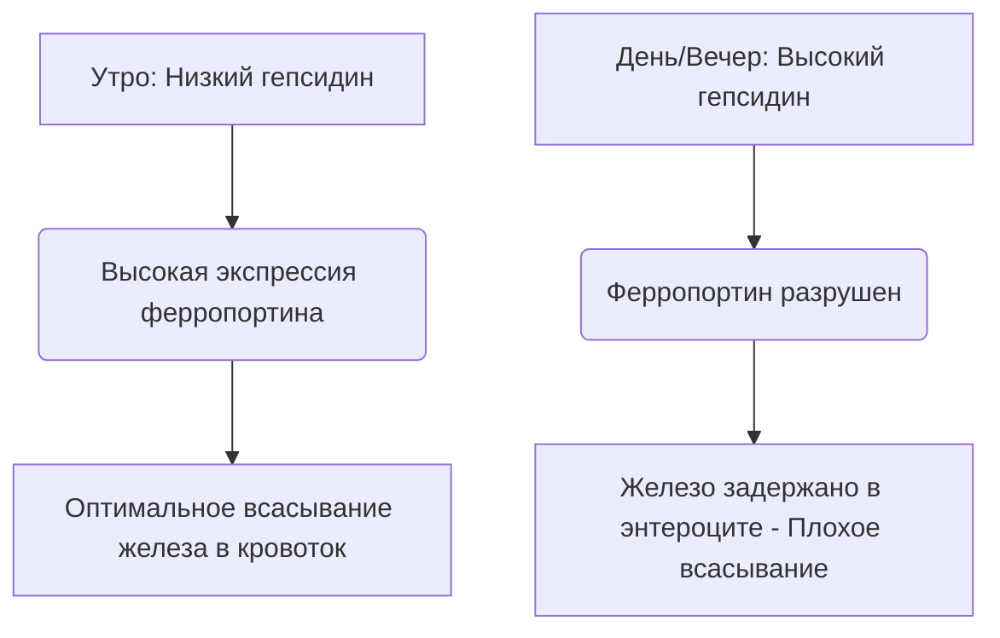

Железо является незаменимым микроэлементом, который действует как структурный и каталитический кофактор в транспорте кислорода, клеточном дыхании и синтезе ДНК. Несмотря на обилие в природе, железо часто является ограничивающим рост питательным веществом в рационе человека. Поскольку у человека нет физиологического механизма активного выведения железа, системный баланс железа поддерживается исключительно на уровне всасывания в кишечнике.

Пищевое железо встречается в двух основных формах: **органическое (гемовое)** и **неорганическое (негемовое)** железо.

Гемовое железо обладает высокой биодоступностью, обычно усваивается в объеме от 15% до 35%. Оно транспортируется в нетронутом виде через апикальную щеточную каемку энтероцитов двенадцатиперстной кишки с помощью белка-переносчика гема 1 (HCP1) и остается защищенным от стандартных пищевых ингибиторов.

И наоборот, негемовое железо (неорганическое железо) составляет более 80% рациона питания, но имеет сильно нарушенный профиль всасывания, при этом скорость всасывания варьируется всего от 2% до 20%.

> [!TIP]
> При физиологическом pH негемовое железо существует преимущественно в окисленном, высоконерастворимом состоянии трехвалентного железа (Fe³⁺). Чтобы усвоиться, оно должно подвергнуться восстановлению до растворимого состояния двухвалентного железа (Fe²⁺) апикальной редуктазой дуоденального цитохрома b (Dcytb), прежде чем попасть в энтероцит через транспортер двухвалентных металлов 1 (DMT1).

## Пути усвоения гемового и негемового железа

| Характеристика / Показатель | Путь гемового железа | Путь негемового (неорганического) железа |
| :--- | :--- | :--- |
| **Пищевые источники** | Ткани животных (гемоглобин, миоглобин) | Растения, продукты, обогащенные железом, минеральные соли |
| **Апикальный транспортер** | Белок-переносчик гема 1 (HCP1) | Транспортер двухвалентных металлов 1 (DMT1) |
| **Требуемая валентность** | Порфирин-связанный комплекс | Двухвалентное железо (Fe²⁺) |
| **Оптимальный люминальный pH** | В целом стабилен; не зависит от желудочной кислоты | Требует высокой кислотности (pH < 3.0) для растворения |
| **Типичная эффективность всасывания**| 15% – 35% (высокая биодоступность) | 2% – 20% (сильно варьируется) |
| **Чувствительность к ингибиторам** | Незначительна; защищено порфириновым кольцом | Чрезвычайно высока (подавляется фитатами, полифенолами, кальцием) |

## Оптимальное время (Хронофармакология)

Оптимизация всасывания негемового железа требует точной координации с суточной кинетикой **гепсидина**, пептидного гормона из 25 аминокислот, синтезируемого в основном гепатоцитами. Гепсидин действует как главный системный регулятор гомеостаза железа, напрямую связываясь с базолатеральным экспортером ферропортином, вызывая его деградацию. Следовательно, повышенный уровень циркулирующего гепсидина задерживает железо внутри энтероцитов двенадцатиперстной кишки и предотвращает его попадание в кровоток.

### Циркадные колебания гепсидина
В базовых физиологических условиях концентрация гепсидина находится на самом низком уровне рано утром, неуклонно повышается в течение дня до максимума и снижается в ночное время.

Эта циркадная кривая напрямую влияет на кинетику перорального железа. **Утренний прием** препаратов железа позволяет минералу попадать в двенадцатиперстную кишку, когда экспрессия ферропортина энтероцитами находится на самом высоком уровне. Напротив, дневной или вечерний прием заставляет железо конкурировать с повышенной блокадой гепсидина, что приводит к снижению фракционного всасывания железа на 37%.

### Влияние желудочной кислотности
Биофизическое состояние неорганического железа в значительной степени зависит от выработки желудочной кислоты. Фармакологическое подавление желудочной кислоты с помощью ингибиторов протонной помпы (ИПП - препараты для желудка) серьезно нарушает эту микросреду, повышая pH желудка и вызывая быстрое окисление растворимого Fe²⁺ в высоконерастворимый Fe³⁺.

> [!WARNING]
> Пероральные добавки железа следует принимать строго натощак — в идеале за 1 час до или через 2 часа после еды — и строго отдельно от любых препаратов, подавляющих кислотность.

## Опасные взаимодействия (Что НИКОГДА нельзя смешивать)

Терапевтическая эффективность перорального железа легко снижается при одновременном приеме с различными пищевыми соединениями и фармацевтическими препаратами.

### Кальций
Кальций, независимо от того, поступает ли он в виде молочных продуктов (молоко, сыр, йогурт) или в виде минеральных добавок (карбонат кальция), является мощным ингибитором всасывания как гемового, так и негемового железа. Совместный прием 500 мг карбоната кальция с пищей, содержащей железо, снижает фракционное всасывание железа более чем на 50%.

### Танины и Полифенолы
Полифенолы, содержащиеся в **черном чае, зеленом чае, травяных чаях и кофе**, являются исключительно эффективными хелаторами железа. Эти соединения растительного происхождения координируются с трехвалентным железом, образуя высокостабильные, крупные металлоорганические комплексы, которые не могут проникнуть через щеточную каемку двенадцатиперстной кишки. Добавление всего одной чашки кофе или чая к еде может снизить всасывание негемового железа на 40-70%.

### Фитиновая кислота
Фитиновая кислота является основным соединением, запасающим фосфор в цельнозерновых, крупах, орехах и бобовых. Молярное соотношение фитиновой кислоты и железа является единственным наиболее важным диетическим фактором, ограничивающим биодоступность железа в рационах на растительной основе.

### Цинк и Магний
Двухвалентное железо, цинк и магний имеют перекрывающиеся пути транспорта через апикальную мембрану энтероцитов (такие как DMT1). При приеме железа в терапевтических дозах возникает конкурентное ингибирование, значительно подавляющее транспорт железа. Не принимайте добавки железа вместе с цинком или магнием.

### Препараты для щитовидной железы (Левотироксин)
Совместный прием пероральных добавок железа с левотироксином (Т4) приводит к серьезному взаимодействию лекарство-питательное вещество. Железо координируется с молекулой левотироксина, образуя нерастворимый комплекс, который снижает пероральную биодоступность левотироксина на 20-64%.

> [!CAUTION]
> Чтобы предотвратить клиническую неудачу вашей терапии щитовидной железы, необходимо строго соблюдать минимальный интервал в 4 часа между приемом левотироксина и железа.

## Главный кофактор: Витамин С

Аскорбиновая кислота (Витамин С) является наиболее мощным усилителем всасывания негемового железа, способным подавлять ингибирующее действие пищевых фитатов, полифенолов и кальция.

Эта синергетическая связь действует через высокоэффективный двойной биохимический механизм:
1. **Термодинамически выгодное восстановление:** Аскорбиновая кислота быстро преобразует нерастворимые ионы трехвалентного железа (Fe³⁺) в хорошо растворимую форму двухвалентного железа (Fe²⁺), готовую к транспортировке.
2. **Дуоденальное хелатирование:** Аскорбиновая кислота действует как защитный экран, предотвращая связывание железа с фитатами и полифенолами при его переходе в щелочную среду двенадцатиперстной кишки.

## Побочные эффекты и парадигма приема «Через день»

Традиционный подход к лечению железодефицитной анемии — назначение высоких доз перорального железа ежедневно — часто не дает результатов из-за серьезных побочных эффектов со стороны желудочно-кишечного тракта (тошнота, запор) и системных петель обратной связи.

Из-за низкого фракционного всасывания до 90% стандартной дозы перорального железа остается неабсорбированным в желудочно-кишечном тракте. Это избыточное железо реагирует с перекисью водорода с образованием высокотоксичных гидроксильных радикалов, вызывая окислительный стресс и воспаление слизистой оболочки.

Кроме того, ежедневный прием высоких доз добавок железа вызывает системную **«Блокаду слизистой оболочки» (Mucosal Block)**. Прием пероральной дозы железа ≥ 60 мг вызывает быстрый всплеск сывороточного гепсидина, который остается повышенным в течение 24 часов. Если на следующий день принимается вторая доза железа, энтероциты физически блокируются от его экспорта в портальное кровообращение. Железо задерживается и в конечном итоге выводится из организма.

> [!TIP]
> **Прием через день:** Чтобы обойти эту опосредованную гепсидином блокаду, современная гематология перешла на прием перорального железа **через день (каждые 48 часов)**. Клинические испытания доказывают, что прием железа каждые 48 часов увеличивает фракционное всасывание железа на 40–50% по сравнению с последовательным ежедневным приемом, одновременно резко снижая побочные эффекты со стороны желудочно-кишечного тракта.

### Резюме клинических протоколов

*   **Низкий pH желудка обязателен:** Принимайте железо натощак с водой.
*   **Избегайте основных пищевых ингибиторов:** Строго избегайте приема железа вместе с кальцием, молочными продуктами, кофе или чаем.
*   **Соблюдайте строгие интервалы между лекарствами:** Разделяйте железо и левотироксин как минимум на 4 часа.
*   **Используйте витамин С:** Совместный прием железа с витамином С увеличивает усвоение до 300%.
*   **Применяйте прием через день:** Принимайте пероральные дозы железа с интервалом в 48 часов, чтобы избежать индуцированной гепсидином блокады слизистой оболочки и максимизировать усвоение.

## Источники

1. Stoffel NU, Zeder C, Brittenham GM, Moretti D, Zimmermann MB. [Iron absorption from oral iron supplements given on consecutive versus alternate days and as single morning doses versus twice-daily split dosing in iron-depleted women: two open-label, randomised controlled trials](https://pubmed.ncbi.nlm.nih.gov/29032957/). *Lancet Haematol.* 2017.
2. Campbell NR, Hasinoff BB. [Ferrous sulfate reduces thyroxine efficacy in patients with hypothyroidism](https://pubmed.ncbi.nlm.nih.gov/1443969/). *Ann Intern Med.* 1992.
3. Hallberg L, Hulthén L. [Effect of ascorbic acid intake on nonheme-iron absorption from a complete diet](https://pubmed.ncbi.nlm.nih.gov/11124756/). *Am J Clin Nutr.* 2000.
4. Lönnerdal B. [Calcium and iron absorption—mechanisms and public health relevance](https://pubmed.ncbi.nlm.nih.gov/21462112/). *Int J Vitam Nutr Res.* 2010.

*Данная статья предназначена только для ознакомительных целей и не является медицинской консультацией. Проконсультируйтесь с квалифицированным специалистом здравоохранения, прежде чем менять свой режим приема добавок или лекарств.*
