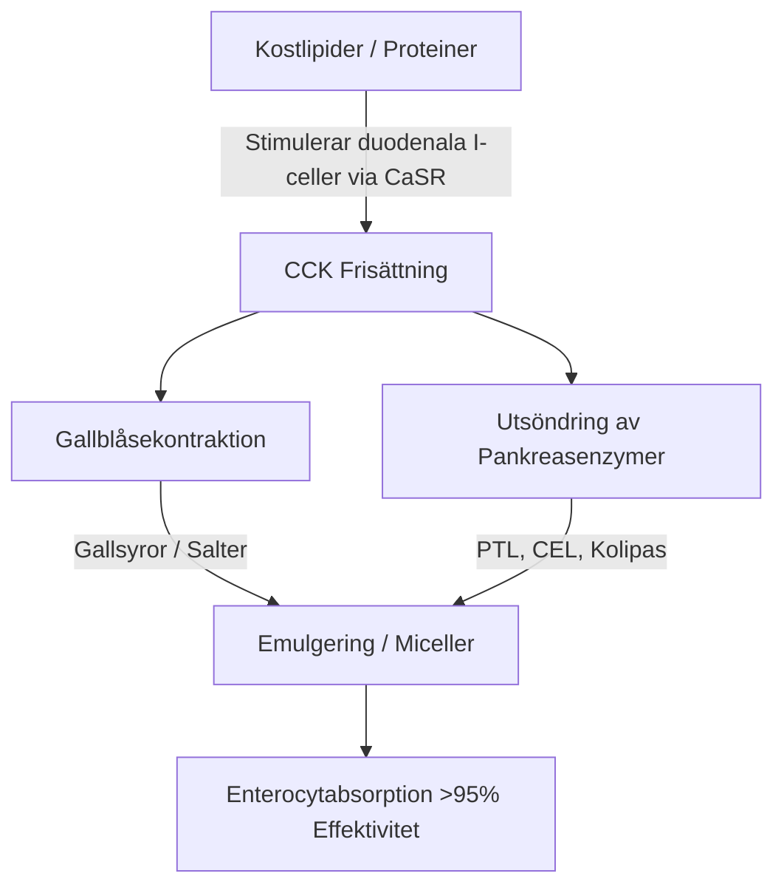

Den terapeutiska effekten av långkedjiga marina omega-3 fleromättade fettsyror ($\text{PUFA}$), specifikt eikosapentaensyra ($\text{EPA}$) och dokosahexaensyra ($\text{DHA}$), styrs strikt av deras intestinala biotillgänglighet. Inom klinisk nutrition är en av de främsta orsakerna till terapeutiskt misslyckande "paradoxen med den magra måltiden" (lean-meal paradox) — administrering av starkt hydrofoba marina lipider i fastande tillstånd eller tillsammans med fettfria måltider. Trots intag av höga nominella doser förhindrar avsaknaden av en strukturerad lipidmatris vid intaget de fysiska och enzymatiska mekanismer som krävs för lipidabsorption i det vattenhaltiga lumen i människans mag-tarmkanal. Denna kliniska analys detaljerar de biofysiska, biokemiska och kronofarmakologiska principer som dikterar matsmältningen och absorptionen av $\text{EPA}$ och $\text{DHA}$.

## Fasta och Paradoxen med den Magra Måltiden

Mag-tarmkanalen är i grunden ett vattenhaltigt (vattenbaserat) system. När hydrofoba (vattenavvisande) lipider som vanliga fiskoljor intas, möter de den starkt polära miljön i mag- och tarmsafter. Enligt termodynamikens lagar minimerar hydrofoba molekyler sin kontakt med vatten, vilket leder till en snabb fas-separation. Detta gör att den intagna oljan smälter samman till stora, odelade lipidkulor som flyter ovanpå den vattenhaltiga magkymusen.

Att svälja en omega-3 kapsel med ett glas vatten på fastande mage, eller tillsammans med en måltid bestående enbart av kolhydrater (som en fruktbit eller en skiva torrt bröd) misslyckas med att utlösa de fysiologiska processer som krävs för att övervinna denna fas-separation. Utan fysisk emulgering förblir ytarea-till-volymförhållandet för lipidfasen extremt lågt. De hydrofila aktiva sätena hos pankreaslipaser kan inte komma åt de esterbindningar som är begravda inuti dessa stora, hydrofoba droppar. Följaktligen hjälper det inte absorptionen att dricka vatten med fiskolja; istället späder det ut de spår av matsmältningsenzymer som finns i fastande tillstånd, vilket förflyttar de oemulgerade lipidkulorna längre bort från enterocytens borstbrämsmembran och leder till malabsorption och gastrointestinala besvär.

För att dessa starkt hydrofoba lipider ska kunna korsa det oomrörda vattenlagret (unstirred water layer) i tarmslemhinnan, måste de omvandlas till en termodynamiskt stabil, vattendispergerbar fas. Denna transformation är helt beroende av den fysikaliska kemin för micellbildning, en process som initieras av hormonförmedlad signalering i tolvfingertarmen (duodenum).

## Gallsalter och Micellbildning

Övergången från en flytande, hydrofob oljemassa till absorberbara mikrodroppar kräver en koordinerad sekretorisk och neuromuskulär kaskad i tolvfingertarmen. Den primära hormonella drivkraften för denna process är kolecystokinin ($\text{CCK}$), en 33-aminosyrapeptid som syntetiseras och utsöndras av enteroendokrina I-celler i slemhinnan i tolvfingertarmen och övre jejunum.



Under fysiologiska förhållanden stimulerar närvaron av långkedjiga fettsyror och delvis smälta proteiner i tolvfingertarmens lumen kalciumavkännande receptorer ($\text{CaSR}$) på I-cellerna, vilket utlöser den snabba exocytosen av $\text{CCK}$ till blodomloppet. Väl frisatt binder $\text{CCK}$ till $\text{CCK}_A$-receptorer på gallblåsans vägg, vilket får den att dra ihop sig, samtidigt som Oddis sfinkter slappnar av och de pankreatiska acinära cellerna stimuleras att frisätta sina matsmältningsenzymer.

Gallsyrorna som frisätts från gallblåsan — främst amfipatiska natriumsalter av kolsyra och kenodeoxikolsyra — är väsentliga biologiska detergenter. När gallsyrakoncentrationerna i tolvfingertarmen överstiger den kritiska micellkoncentrationen ($\text{CMC}$), ordnar de sig runt de hydrofoba lipiddropparna. Den hydrofoba steroidkärnan i gallsaltet associerar med lipidfasen, medan den polära, hydrofila konjugatgruppen (glycin eller taurin) är vänd mot det vattenhaltiga lumen i tolvfingertarmen.

Genom den mekaniska effekten av tarmens peristaltik skjuvas dessa gallbelagda droppar till blandade miceller. Dessa sfäriska kolloidala aggregat har en diameter på endast 3 till 10 nanometer, vilket ökar lipiders yta som exponeras för pankreaslipaser med flera tusen gånger. Utan ett samtidigt intag av hälsosamma kostfetter (som extra jungfruolivolja, avokado eller äggulor från frigående höns) för att utlösa tröskeln för $\text{CCK}$-frisättning, sker ingen gallblåsekontraktion. I detta tillstånd förblir gallsyranivåerna under $\text{CMC}$, sekretionen av pankreaslipas är minimal och de intagna omega-3-lipiderna kan inte bilda miceller, vilket förhindrar absorption.

## Striden mellan Biokemiska Former: TG vs. EE vs. PL

Kommersiellt tillgängliga omega-3 tillskott finns i tre primära molekylära former: naturliga eller re-esterifierade triglycerider ($\text{TG}$/$\text{rTG}$), etylestrar ($\text{EE}$) och fosfolipider ($\text{PL}$). Den molekylära strukturen hos dessa bärare bestämmer deras matsmältningshastighet, lipasberoende och biotillgänglighet.

```text
Triglycerid (TG) Form:             Etylester (EE) Form:           Fosfolipid (PL) Form:
     ┌─ Glycerolryggrad                 ┌─ Etanolmolekyl               ┌─ Fosfathuvud (Polärt)
     ├─ Fettsyra (EPA)                  └─ Fettsyra (EPA)              ├─ Fettsyra (EPA)
     ├─ Fettsyra (DHA)                                                 └─ Fettsyra (DHA)
     └─ Fettsyra (Annan)
```

I naturliga och re-esterifierade triglycerider ($\text{TG}$/$\text{rTG}$) är tre fettsyror ($\text{EPA}$/$\text{DHA}$) bundna till en trekolig glycerolryggrad. Under matsmältningen hydrolyserar pankreatiskt triglyceridlipas ($\text{PTL}$), som agerar tillsammans med sin kofaktor kolipas, esterbindningarna vid $sn\text{-}1$ och $sn\text{-}3$ positionerna. Detta producerar två fria fettsyror och en $sn\text{-}2$-monoglycerid, som båda är starkt polära, lätt micelliserbara och absorberas lätt av enterocyter med över 95% effektivitet.

Omvänt är etylesterformen ($\text{EE}$) en syntetisk produkt som skapas under kemisk koncentration. Glycerolryggraden tas bort och varje enskild fettsyra esterifieras till en etanolmolekyl ($\text{CH}_3\text{CH}_2\text{OH}$). Denna syntetiska esterbindning är starkt resistent mot mänskliga pankreasenzymer. In vitro- och in vivo-studier visar att humant pankreaslipas hydrolyserar fettsyra-etanolbindningen i $\text{EE}$ med en hastighet som är 10 till 50 gånger långsammare än glycerylesterbindningarna i triglycerider.

På grund av denna långsamma hydrolys är $\text{EE}$-absorptionen starkt beroende av en massiv frisättning av pankreaslipaser och gallsalter, vilket endast utlöses av en fettrik måltid. När det tas med en fettsnål kost kan den begränsade tillgängliga pankreaslipasen inte effektivt klyva $\text{EE}$-bindningarna, vilket leder till dålig biotillgänglighet (sjunker ofta till cirka 20%) och orsakar att oabsorberade syntetiska estrar passerar in i tjocktarmen, där de kan orsaka gastrointestinala biverkningar.

Fosfolipidformen ($\text{PL}$), främst härledd från antarktisk krillolja (Euphausia superba), har en amfipatisk struktur där $\text{EPA}$ och $\text{DHA}$ är bundna till en fosfatidylkolinryggrad. Den starkt polära fosfathuvudgruppen gör fosfolipider naturligt vattendispergerbara. På grund av detta kan $\text{PL}$-former självemulgera och bilda spontana mikrodroppar i mag-tarmkanalen, vilket kringgår det absoluta kravet på gallsaltstimulerad micellbildning. Fosfolipider digereras också via fosfolipas $\text{A}_2$ och kan absorberas direkt av enterocyterna som lysofosfolipider, vilket resulterar i hög biotillgänglighet även vid fasta eller fettsnåla förhållanden.

| Biokemisk Form | Molekylär Bärare / Ryggrad | Genomsnittlig Absorptionshastighet (Mager Måltid) | Genomsnittlig Absorptionshastighet (Fettrik Måltid) | Relativ Biotillgänglighet (vs. EE Baslinje) | Pankreaslipasberoende |
| --- | --- | --- | --- | --- | --- |
| Etylester (EE) | Etanol ($\text{CH}_3\text{CH}_2\text{OH}$) | $\approx 20\%$ | $\approx 60\%$ | Baslinje ($100\%$) | Absolut; hydrolyseras 10-50x långsammare än TG |
| Triglycerid (TG / rTG) | Glycerolryggrad | $\approx 68\%$ | $\approx 90\%$ | $124\%$ till $186\%$ | Högt; klyvs snabbt till 2-FFA och 1-MAG |
| Fosfolipid (PL) | Fosfatidylkolin | $\approx 80\%$ till $95\%$ | $>95\%$ | $168\%$ till $500\%$ | Minimalt; självemulgerande, kringgår vissa lipaser |

> [!WARNING]
> Individer som uppvisar exokrin pankreasinsufficiens (EPI), gallvägsdyskinesi eller de efter kolecystektomi (borttagen gallblåsa) uppvisar kraftigt nedsatt endogen lipidnedbrytning. För dessa kliniska populationer utgör administrering av syntetiska etylesterformuleringar (EE) under fettsnåla kostrestriktioner en hög risk för fullständig malabsorption och gastrointestinalt obehag, eftersom den nödvändiga enzymatiska klyvningen är praktiskt taget obefintlig i dessa tillstånd.

## Lipidoxidation och det Absoluta Behovet av Vitamin E

De strukturella egenskaper som gör $\text{EPA}$ och $\text{DHA}$ biologiskt aktiva gör dem också extremt instabila. $\text{EPA}$ innehåller fem och $\text{DHA}$ innehåller sex metylen-avbrutna dubbelbindningar. Kol-vätebindningarna vid de bis-allyliska metylenkolen ($\text{-CH=CH-CH}_2\text{-CH=CH-}$) har låg bindningsdissociationsenergi. Detta gör dem exceptionellt sårbara för attacker från fria radikaler och icke-enzymatisk lipidperoxidation.

```text
Fas 1: Initiering
  [PUFA Kol-Väte Bindning] + [ROS / Fri Radikal] ──> [Kol-centrerad Lipidradikal (R•)]

Fas 2: Propagering (Spridning)
  [Kol-centrerad Lipidradikal (R•)] + [O2] ──> [Lipid-peroxylradikal (ROO•)]
  [Lipid-peroxylradikal (ROO•)] + [Ooxiderad PUFA] ──> [Lipidhydroperoxid (ROOH)] + [Ny Lipidradikal (R•)]

Fas 3: Dekomposition (Sönderfall)
  [Instabil Lipidhydroperoxid (ROOH)] ──> [Toxiska Aldehyder (MDA / HHE)]
```

När fiskoljan har svalts exponeras den för en miljö med $37^\circ\text{C}$ (kroppstemperatur), magsyror och löst molekylärt syre ($\text{O}_2$). Denna miljö påskyndar lipidperoxidationskaskaden genom tre distinkta faser:

1. **Initiering:** En reaktiv syreförening ($\text{ROS}$) abstraherar en väteatom från ett bis-allyliskt kol, vilket genererar en kolcentrerad lipidradikal ($\text{R}^\bullet$).
2. **Propagering:** Lipidradikalen reagerar snabbt med molekylärt syre ($\text{O}_2$) för att bilda en lipid-peroxylradikal ($\text{ROO}^\bullet$). Denna peroxylradikal abstraherar sedan en väteatom från en intilliggande ooxiderad $\text{PUFA}$-molekyl, vilket genererar en lipidhydroperoxid ($\text{ROOH}$) och en ny lipidradikal, vilket vidmakthåller kedjereaktionen.
3. **Dekomposition:** De instabila lipidhydroperoxiderna bryts ner till starkt reaktiva, cytotoxiska sekundära oxidationsprodukter, inklusive alkenaler som malondialdehyd ($\text{MDA}$) och 4-hydroxihexenal ($\text{HHE}$).

Dessa sekundära oxidationsprodukter absorberas lätt via tarmen, inkorporeras i kylomikroner och lågdensitetslipoproteiner ($\text{LDL}$) och kan inducera systemisk oxidativ stress, endotelskada och aterogenes.

För att stoppa denna process krävs samtidig formulering av en kedjebrytande, fettlöslig antioxidant. Naturligt E-vitamin, specifikt d-alfa-tokoferol ($\text{C}_{29}\text{H}_{50}\text{O}_2$), är mycket optimerat för denna roll. D-alfa-tokoferol fungerar som en vätedonator, som snabbt överför sin fenoliska väteatom till den reaktiva lipid-peroxylradikalen ($\text{ROO}^\bullet$) med en extremt snabb hastighetskonstant på cirka $10^6\,\text{M}^{-1}\text{s}^{-1}$.

Den resulterande tokoferoxylradikalen är mycket stabil på grund av resonansdelokaliseringen av dess oparade elektron över kromanolringen, vilket förhindrar den från att attackera intilliggande fettsyrakedjor. Detta stoppar kedjereaktionen, vilket skyddar den strukturella integriteten hos $\text{EPA}$- och $\text{DHA}$-molekylerna så att de kan nå målvävnaderna i sitt aktiva, ooxiderade tillstånd.

## Kronofarmakologi och det Nattliga Antiinflammatoriska Fönstret

Inom lipidbiokemi är tajming (timing) en kritisk faktor. Att inta omega-3 tillskott tillsammans med dagens största, mest lipidtäta måltid (vanligtvis middagen) optimerar både absorptionen och kroppens naturliga nattliga läkningsprocesser.

```mermaid
graph TD
    A[Samtidigt intag med Middagen] -->|Galla/Lipas Sekretion| B[Topp i Plasma EPA / DHA vid 6-8h]
    A -->|Nattlig Kortisolsänkning| C[Uppreglering av NF-kB & Inflammation]
    B --> D[Enzymatisk Omvandling till SPMs: Resolviner, Protektiner]
    C --> D
    D --> E[Systemisk Upplösning (Resolution) under Natten]
```

För det första är middagen historiskt sett den fetaste måltiden på dagen för många individer. Detta ger den fysiska lipidvolym som krävs för att utlösa maximal $\text{CCK}$-frisättning, vilket leder till robust gallblåsekontraktion, riklig gallsekretion och hög pankreaslipasaktivitet. Detta optimerar micellisering och matsmältningskinetik, vilket säkerställer att nästan hela den intagna dosen framgångsrikt absorberas.

För det andra är kvällsadministrering i linje med kroppens dygnsrytm för immun- och inflammatoriska cykler. Endogena kortisolnivåer sjunker naturligt till sina lägsta dagliga nivåer under sen kväll och tidig natt. Kortisol är ett potent antiinflammatoriskt hormon; när dess nivåer sjunker upplever systemiska inflammatoriska vägar — såsom de som styrs av den pro-inflammatoriska transkriptionsfaktorn $\text{NF}\text{-}\kappa\text{B}$ — en relativ "uppreglering" (upregulation).

Genom att inta omega-3 till middagen nås maximala koncentrationer av $\text{EPA}$ och $\text{DHA}$ i plasma och cellmembran 6 till 8 timmar senare, vilket sammanfaller direkt med detta nattliga inflammatoriska fönster. Under denna fas använder kroppen dessa fettsyror som substrat för den enzymatiska syntesen av specialiserade pro-upplösande mediatorer ($\text{SPM}$) — specifikt resolviner, protektiner och maresiner — via cyklooxygenas- ($\text{COX}$) och lipoxygenas ($\text{LOX}$) vägarna. Dessa $\text{SPM}$ löser aktivt upp kronisk mikroinflammation, främjar cellomsättning och stöder vävnadsläkning under sömnen.

Dessutom ger kvällsadministrering av omega-3, särskilt $\text{DHA}$, unika neurologiska fördelar. $\text{DHA}$ är en viktig strukturell lipid i neuronala membran och spelar en viktig roll i hjärnans dygnsrytmklocka. Den verkar på klockgener (som BMAL1 och CLOCK) som är ansvariga för att reglera sömn-vaken-cykeln.

Nattlig inkorporering av $\text{DHA}$ i synaptiska membran stöder neuronal kommunikation, ökar serotoninsyntesen och optimerar dess omvandling till melatonin. Kliniska prövningar visar att ett konsekvent kvällstillskott av omega-3 avsevärt förbättrar sömneffektiviteten, förkortar insomningslatensen och minskar sömnfragmenteringsindex (nattliga uppvaknanden).

> [!TIP]
> För att maximera den cellulära bioinkorporeringen av långkedjiga omega-3-fettsyror, bör kliniker rekommendera patienter att administrera sin dagliga dos tillsammans med dagens mest lipidrika måltid. Samtidigt intag med minst 10-15 gram hälsosamma enkel- eller fleromättade fetter (t.ex. extra jungfruolivolja eller avokado) är tillräckligt för att utlösa den tröskel för frisättning av kolecystokinin som är nödvändig för optimal micellbildning.

## Kliniska Synteser och Konkreta Rekommendationer

Att maximera den terapeutiska potentialen hos omega-3 tillskott kräver en förskjutning från att bara svälja hög-doserade kapslar mot en strategi baserad på lipidbiokemi och matsmältningskinetik. Den traditionella metoden att ta fiskolja med vatten på fastande mage leder ofta till dålig absorption och gastrointestinala biverkningar.

För optimala terapeutiska resultat bör kliniker prioritera formuleringar av re-esterifierade triglycerider ($\text{rTG}$) eller fosfolipider ($\text{PL}$), som visar överlägsen absorptionskinetik och är mindre beroende av fettrika måltider än syntetiska etylestrar ($\text{EE}$).

Oavsett vilken formulering som väljs, måste tillskottet intas tillsammans med en måltid som innehåller minst 10 till 15 gram kostfett. Denna lipidtröskel är nödvändig för att utlösa den duodenala $\text{CCK}$-signaleringskaskaden, vilket initierar gallblåsekontraktion och utsöndring av pankreaslipas för att möjliggöra fullständig micellbildning.

För att skydda dessa extremt instabila $\text{PUFA}$ från oxidativa skador inuti kroppen, måste formuleringen dessutom alltid innehålla en naturlig, fettlöslig antioxidant som d-alfa-tokoferol (Vitamin E).

Slutligen säkerställer anpassning av tillskottet till kvällsmåltiden att den maximala absorptionen sammanfaller med kroppens naturliga nattliga antiinflammatoriska och cellulära reparationsvägar, vilket maximerar de kardiovaskulära, immunologiska och neurologiska fördelarna med $\text{EPA}$ och $\text{DHA}$.
