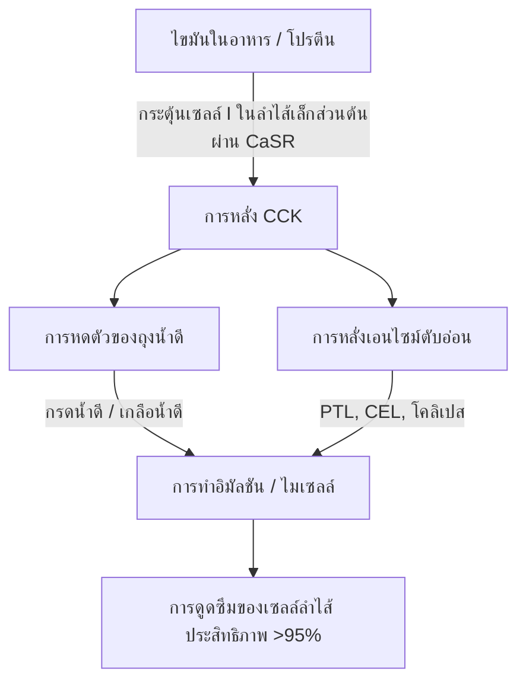
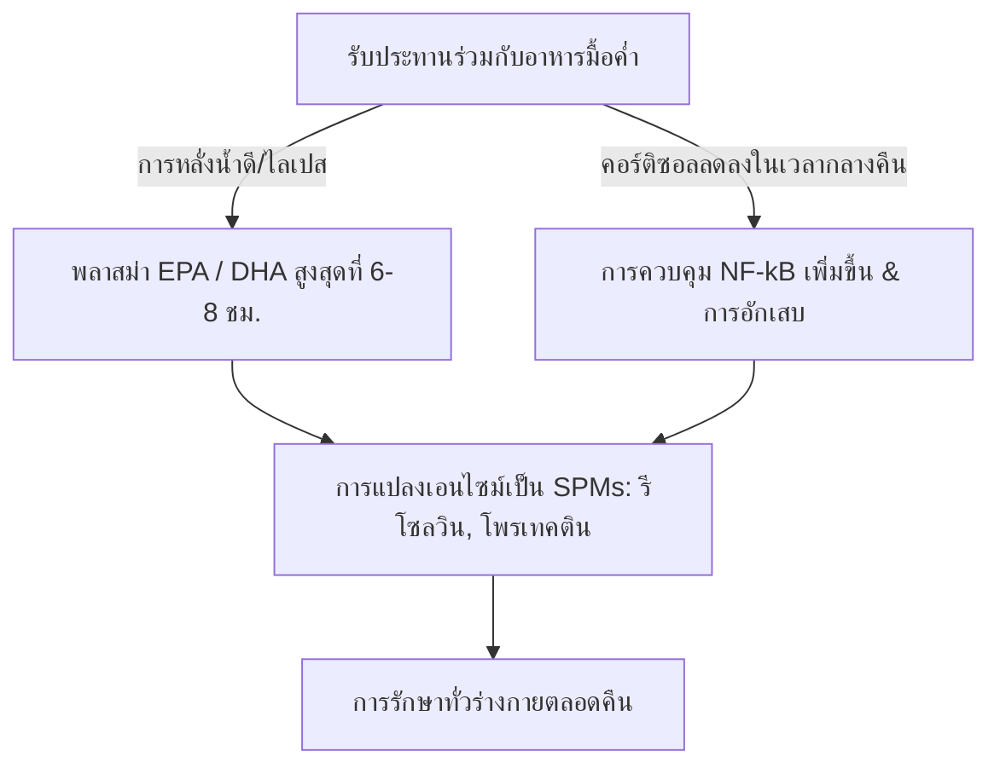

ประสิทธิภาพในการรักษาของกรดไขมันไม่อิ่มตัวเชิงซ้อนโอเมก้า 3 สายยาวจากทะเล ($\text{PUFA}$) โดยเฉพาะกรดไอโคซาเพนทาอีโนอิก ($\text{EPA}$) และกรดโดโคซาเฮกซาอีโนอิก ($\text{DHA}$) ถูกควบคุมอย่างเคร่งครัดโดยชีวปริมาณออกฤทธิ์ (Bioavailability) ในลำไส้ ในทางโภชนาการคลินิก สาเหตุหลักของความล้มเหลวในการรักษาคือ "ความขัดแย้งของมื้ออาหารไขมันต่ำ" (lean-meal paradox) — การบริหารให้ไขมันจากทะเลที่มีคุณสมบัติไม่ชอบน้ำ (Hydrophobic) สูงในสภาวะอดอาหารหรือรับประทานพร้อมกับมื้ออาหารที่ปราศจากไขมัน แม้ว่าจะรับประทานในปริมาณที่สูง แต่การขาดเมทริกซ์ไขมันที่รับประทานร่วมกันที่มีโครงสร้างเหมาะสม จะขัดขวางกลไกทางกายภาพและเอนไซม์ที่จำเป็นสำหรับการดูดซึมไขมันในลูเมนของเหลวในระบบทางเดินอาหารของมนุษย์ การวิเคราะห์ทางคลินิกนี้ให้รายละเอียดเกี่ยวกับหลักการทางชีวฟิสิกส์ ชีวเคมี และโครโนฟาร์มาโคโลยี (Chronopharmacology) ที่กำหนดการย่อยและการดูดซึม $\text{EPA}$ และ $\text{DHA}$

## การอดอาหารและความขัดแย้งของมื้ออาหารไขมันต่ำ

ระบบทางเดินอาหารเป็นระบบที่มีน้ำเป็นส่วนประกอบหลัก เมื่อรับประทานไขมันที่ไม่ชอบน้ำ (ผลักน้ำ) เช่น น้ำมันปลามาตรฐาน ไขมันเหล่านี้จะพบกับสภาพแวดล้อมที่มีขั้วสูงของน้ำย่อยในกระเพาะอาหารและลำไส้ ตามกฎของอุณหพลศาสตร์ โมเลกุลที่ไม่ชอบน้ำจะลดการสัมผัสกับน้ำให้เหลือน้อยที่สุด ทำให้เกิดการแยกตัวของเฟส (Phase separation) อย่างรวดเร็ว สิ่งนี้ทำให้น้ำมันที่กลืนเข้าไปรวมตัวกันเป็นหยดไขมันขนาดใหญ่ที่ไม่แบ่งตัว ลอยอยู่เหนือไคม์ (Chyme) ของเหลวในกระเพาะอาหาร

การกลืนแคปซูลโอเมก้า 3 พร้อมน้ำหนึ่งแก้วในขณะท้องว่าง หรือรับประทานพร้อมกับอาหารที่มีคาร์โบไฮเดรตเพียงอย่างเดียว (เช่น ผลไม้หนึ่งชิ้น หรือขนมปังแห้งหนึ่งแผ่น) ไม่สามารถกระตุ้นกระบวนการทางสรีรวิทยาที่จำเป็นในการเอาชนะการแยกตัวของเฟสนี้ได้ หากไม่มีการทำให้อิมัลชันทางกายภาพ (Emulsification) อัตราส่วนพื้นที่ผิวต่อปริมาตรของเฟสไขมันจะยังคงต่ำมาก ตำแหน่งที่ออกฤทธิ์ (Active sites) ที่ชอบน้ำของเอนไซม์ไลเปสจากตับอ่อนไม่สามารถเข้าถึงพันธะเอสเทอร์ที่ถูกฝังอยู่ภายในหยดไขมันขนาดใหญ่เหล่านี้ได้ ด้วยเหตุนี้ การดื่มน้ำร่วมกับน้ำมันปลาจึงไม่ช่วยในการดูดซึม แต่กลับไปเจือจางเอนไซม์ย่อยอาหารที่มีอยู่เพียงเล็กน้อยในสภาวะอดอาหาร ทำให้หยดไขมันที่ไม่ได้ทำให้อิมัลชันอยู่ห่างจากขอบแปรง (Brush border membrane) ของเซลล์เอนเทอโรไซต์ (Enterocyte) นำไปสู่การดูดซึมผิดปกติและอาการไม่สบายทางเดินอาหาร

เพื่อให้ไขมันที่ไม่ชอบน้ำสูงเหล่านี้สามารถผ่านชั้นน้ำที่ไม่ได้กวน (Unstirred water layer) ของเยื่อบุลำไส้ได้ จะต้องเปลี่ยนให้เป็นเฟสที่สามารถกระจายตัวในน้ำได้และมีความเสถียรทางอุณหพลศาสตร์ การเปลี่ยนแปลงนี้ขึ้นอยู่กับเคมีกายภาพของการสร้างไมเซลล์ (Micellarization) ซึ่งเป็นกระบวนการที่เริ่มต้นจากการส่งสัญญาณในลำไส้เล็กส่วนต้น (Duodenum) ที่สื่อกลางโดยฮอร์โมน

## เกลือน้ำดีและการสร้างไมเซลล์ (Micelle)

การเปลี่ยนผ่านจากมวลน้ำมันที่ไม่ชอบน้ำที่ลอยอยู่ ไปเป็นหยดขนาดเล็กที่สามารถดูดซึมได้ จำเป็นต้องมีกลไกการหลั่งและระบบประสาทและกล้ามเนื้อที่ประสานกันในลำไส้เล็กส่วนต้น ฮอร์โมนหลักที่ขับเคลื่อนกระบวนการนี้คือ โคเลซิสโตไคนิน ($\text{CCK}$) ซึ่งเป็นเปปไทด์กรดอะมิโน 33 ตัว ที่สังเคราะห์และหลั่งโดยเซลล์เอนเทอโรเอนโดครินชนิดไอ (Enteroendocrine I-cells) ในเยื่อบุของลำไส้เล็กส่วนต้นและเจจูนัมส่วนบน



ภายใต้สภาวะทางสรีรวิทยา การมีอยู่ของกรดไขมันสายยาวและโปรตีนที่ย่อยบางส่วนในลูเมนของลำไส้เล็กส่วนต้น จะกระตุ้นตัวรับการรับรู้แคลเซียม ($\text{CaSR}$) บนเซลล์ I ทำให้เกิดการปล่อย $\text{CCK}$ ออกสู่กระแสเลือดอย่างรวดเร็ว (Exocytosis) เมื่อถูกปล่อยออกมา $\text{CCK}$ จะจับกับตัวรับ $\text{CCK}_A$ ที่ผนังถุงน้ำดี ทำให้ถุงน้ำดีหดตัว ในขณะเดียวกันก็ทำให้กล้ามเนื้อหูรูดออดดี (Sphincter of Oddi) คลายตัว และกระตุ้นเซลล์อะซินาร์ของตับอ่อน (Pancreatic acinar cells) ให้ปล่อยเอนไซม์ย่อยอาหาร

กรดน้ำดีที่ปล่อยออกมาจากถุงน้ำดี—โดยหลักคือเกลือโซเดียมแอมฟิพาทิกของกรดโคลิกและกรดคีโนดีออกซีโคลิก—เป็นสารทำความสะอาดทางชีวภาพ (Biological detergents) ที่จำเป็น เมื่อความเข้มข้นของกรดน้ำดีในลำไส้เล็กส่วนต้นเกิน ความเข้มข้นของการเกิดไมเซลล์วิกฤต ($\text{CMC}$) พวกมันจะจัดเรียงตัวรอบๆ หยดไขมันที่ไม่ชอบน้ำ แกนสเตียรอยด์ที่ไม่ชอบน้ำของเกลือน้ำดีจะจับกับเฟสของไขมัน ในขณะที่กลุ่มคอนจูเกตที่มีขั้วและชอบน้ำ (ไกลซีนหรือทอรีน) จะหันเข้าหาลูเมนของลำไส้เล็กส่วนต้นที่เป็นน้ำ

ด้วยการทำงานเชิงกลของการบีบตัวของลำไส้ (Peristalsis) หยดที่เคลือบด้วยน้ำดีเหล่านี้จะถูกเฉือนเป็นไมเซลล์แบบผสม การรวมตัวของคอลลอยด์ทรงกลมเหล่านี้มีเส้นผ่านศูนย์กลางเพียง 3 ถึง 10 นาโนเมตร ช่วยเพิ่มพื้นที่ผิวของไขมันที่สัมผัสกับไลเปสจากตับอ่อนได้หลายพันเท่า หากไม่มีการรับประทานไขมันที่ดีต่อสุขภาพร่วมด้วย (เช่น น้ำมันมะกอกเอ็กซ์ตร้าเวอร์จิน อะโวคาโด หรือไข่แดงจากไก่เลี้ยงปล่อย) เพื่อกระตุ้นให้ถึงเกณฑ์การปล่อย $\text{CCK}$ การหดตัวของถุงน้ำดีจะไม่เกิดขึ้น ในสถานะนี้ ระดับกรดน้ำดีจะยังคงอยู่ต่ำกว่า $\text{CMC}$ การหลั่งไลเปสจากตับอ่อนจะมีน้อยมาก และไขมันโอเมก้า 3 ที่รับประทานเข้าไปจะไม่สามารถสร้างไมเซลล์ได้ ซึ่งเป็นการขัดขวางการดูดซึม

## การต่อสู้ของรูปแบบทางชีวเคมี: TG vs. EE vs. PL

อาหารเสริมโอเมก้า 3 ที่มีจำหน่ายทั่วไปมีอยู่ในรูปแบบโมเลกุลหลักสามรูปแบบ ได้แก่ ไตรกลีเซอไรด์ตามธรรมชาติหรือแบบรีเอสเทอริไฟด์ ($\text{TG}$/$\text{rTG}$) เอทิลเอสเทอร์ ($\text{EE}$) และฟอสโฟลิปิด ($\text{PL}$) โครงสร้างโมเลกุลของตัวพานี้จะกำหนดอัตราการย่อย การพึ่งพาเอนไซม์ไลเปส และชีวปริมาณออกฤทธิ์

```text
รูปแบบไตรกลีเซอไรด์ (TG):           รูปแบบเอทิลเอสเทอร์ (EE):        รูปแบบฟอสโฟลิปิด (PL):
     ┌─ โครงสร้างกลีเซอรอล              ┌─ โมเลกุลเอทานอล                ┌─ ส่วนหัวฟอสเฟต (มีขั้ว)
     ├─ กรดไขมัน (EPA)                  └─ กรดไขมัน (EPA)                ├─ กรดไขมัน (EPA)
     ├─ กรดไขมัน (DHA)                                                   └─ กรดไขมัน (DHA)
     └─ กรดไขมัน (อื่นๆ)
```

ในไตรกลีเซอไรด์ตามธรรมชาติและแบบรีเอสเทอริไฟด์ ($\text{TG}$/$\text{rTG}$) กรดไขมันสามตัว ($\text{EPA}$/$\text{DHA}$) จะเกาะอยู่กับโครงสร้างกลีเซอรอลคาร์บอน 3 อะตอม ในระหว่างการย่อยอาหาร เอนไซม์ตับอ่อนไตรกลีเซอไรด์ไลเปส ($\text{PTL}$) ทำงานร่วมกับโคแฟกเตอร์ โคลิเปส (Colipase) จะไฮโดรไลซ์พันธะเอสเทอร์ที่ตำแหน่ง $sn\text{-}1$ และ $sn\text{-}3$ ซึ่งจะสร้างกรดไขมันอิสระสองตัวและ $sn\text{-}2$-โมโนกลีเซอไรด์หนึ่งตัว ซึ่งทั้งคู่มีขั้วสูง สามารถสร้างไมเซลล์ได้ง่าย และเซลล์เอนเทอโรไซต์ดูดซึมได้อย่างง่ายดายด้วยประสิทธิภาพมากกว่า 95%

ในทางกลับกัน รูปแบบเอทิลเอสเทอร์ ($\text{EE}$) เป็นผลิตภัณฑ์สังเคราะห์ที่สร้างขึ้นในระหว่างการทำให้เข้มข้นทางเคมี โครงสร้างกลีเซอรอลจะถูกถอดออก และกรดไขมันแต่ละตัวจะถูกเอสเทอริไฟด์เป็นโมเลกุลเอทานอล ($\text{CH}_3\text{CH}_2\text{OH}$) พันธะเอสเทอร์สังเคราะห์นี้มีความทนทานต่อเอนไซม์ตับอ่อนของมนุษย์สูงมาก การศึกษาในหลอดทดลอง (In-vitro) และในสิ่งมีชีวิต (In-vivo) แสดงให้เห็นว่า ไลเปสตับอ่อนของมนุษย์จะไฮโดรไลซ์พันธะกรดไขมัน-เอทานอลใน $\text{EE}$ ด้วยอัตราที่ช้ากว่าพันธะกลีเซอริลเอสเทอร์ในไตรกลีเซอไรด์ถึง 10 ถึง 50 เท่า

เนื่องจากการไฮโดรไลซิสที่ช้านี้ การดูดซึม $\text{EE}$ จึงต้องพึ่งพาการหลั่งไลเปสจากตับอ่อนและเกลือน้ำดีในปริมาณมาก ซึ่งจะถูกกระตุ้นด้วยมื้ออาหารที่มีไขมันสูงเท่านั้น เมื่อรับประทานร่วมกับอาหารที่มีไขมันต่ำ เอนไซม์ไลเปสจากตับอ่อนที่มีอยู่อย่างจำกัดจะไม่สามารถตัดพันธะ $\text{EE}$ ได้อย่างมีประสิทธิภาพ ส่งผลให้ชีวปริมาณออกฤทธิ์ต่ำ (มักจะลดลงเหลือประมาณ 20%) และทำให้เอสเทอร์สังเคราะห์ที่ไม่ถูกดูดซึมผ่านเข้าสู่ลำไส้ใหญ่ ซึ่งอาจทำให้เกิดผลข้างเคียงต่อระบบทางเดินอาหาร

รูปแบบฟอสโฟลิปิด ($\text{PL}$) ซึ่งส่วนใหญ่ได้มาจากน้ำมันคริลล์แอนตาร์กติก (Euphausia superba) มีโครงสร้างแอมฟิพาทิกที่ $\text{EPA}$ และ $\text{DHA}$ เกาะอยู่กับโครงสร้างฟอสฟาติดิลโคลีน (Phosphatidylcholine) กลุ่มหัวฟอสเฟตที่มีขั้วสูงทำให้ฟอสโฟลิปิดสามารถกระจายตัวในน้ำได้ตามธรรมชาติ ด้วยเหตุนี้ รูปแบบ $\text{PL}$ จึงสามารถทำให้อิมัลชันด้วยตัวเอง (Self-emulsifying) และสร้างหยดขนาดเล็กในระบบทางเดินอาหารได้เอง โดยข้ามข้อกำหนดที่แท้จริงของการสร้างไมเซลล์ที่กระตุ้นด้วยเกลือน้ำดี นอกจากนี้ ฟอสโฟลิปิดยังถูกย่อยผ่านฟอสโฟลิเปส $\text{A}_2$ และสามารถดูดซึมโดยตรงโดยเซลล์เอนเทอโรไซต์เป็นไลโซฟอสโฟลิปิด (Lysophospholipids) ส่งผลให้มีชีวปริมาณออกฤทธิ์สูงแม้ในสภาวะอดอาหารหรือไขมันต่ำ

| รูปแบบชีวเคมี | ตัวพาโมเลกุล / โครงสร้าง | อัตราการดูดซึมเฉลี่ย (มื้อไขมันต่ำ) | อัตราการดูดซึมเฉลี่ย (มื้อไขมันสูง) | ชีวปริมาณออกฤทธิ์สัมพัทธ์ (เทียบกับพื้นฐาน EE) | การพึ่งพาไลเปสจากตับอ่อน |
| --- | --- | --- | --- | --- | --- |
| เอทิลเอสเทอร์ (EE) | เอทานอล ($\text{CH}_3\text{CH}_2\text{OH}$) | $\approx 20\%$ | $\approx 60\%$ | พื้นฐาน ($100\%$) | สัมบูรณ์; ไฮโดรไลซ์ช้ากว่า TG 10-50 เท่า |
| ไตรกลีเซอไรด์ (TG / rTG) | โครงสร้างกลีเซอรอล | $\approx 68\%$ | $\approx 90\%$ | $124\%$ ถึง $186\%$ | สูง; ถูกตัดอย่างรวดเร็วเป็น 2-FFA และ 1-MAG |
| ฟอสโฟลิปิด (PL) | ฟอสฟาติดิลโคลีน | $\approx 80\%$ ถึง $95\%$ | $>95\%$ | $168\%$ ถึง $500\%$ | น้อยมาก; ทำอิมัลชันด้วยตัวเอง ข้ามไลเปสบางชนิด |

> [!WARNING]
> ผู้ที่มีภาวะตับอ่อนทำงานบกพร่อง (Exocrine Pancreatic Insufficiency - EPI), โรคทางเดินน้ำดีทำงานผิดปกติ (Biliary dyskinesia) หรือผู้ที่ได้รับการผ่าตัดถุงน้ำดีออก จะมีการย่อยสลายไขมันภายนอกที่บกพร่องอย่างรุนแรง สำหรับประชากรทางคลินิกเหล่านี้ การให้สูตรเอทิลเอสเทอร์ (EE) สังเคราะห์ภายใต้ข้อจำกัดของอาหารไขมันต่ำ ก่อให้เกิดความเสี่ยงสูงต่อการดูดซึมผิดปกติอย่างสมบูรณ์และความรู้สึกไม่สบายทางเดินอาหาร เนื่องจากการตัดของเอนไซม์ที่จำเป็นนั้นแทบจะไม่มีเลยในสภาวะเหล่านี้

## การออกซิเดชั่นของไขมัน และความจำเป็นอย่างยิ่งยวดของวิตามินอี

คุณสมบัติทางโครงสร้างที่ทำให้ $\text{EPA}$ และ $\text{DHA}$ มีฤทธิ์ทางชีวภาพ ยังทำให้โมเลกุลเหล่านี้ไม่เสถียรอย่างยิ่ง $\text{EPA}$ มีพันธะคู่ห้าพันธะและ $\text{DHA}$ มีหกพันธะ ซึ่งคั่นด้วยกลุ่มเมทิลีน พันธะคาร์บอน-ไฮโดรเจนที่คาร์บอนบิสอัลลิลิกเมทิลีน ($\text{-CH=CH-CH}_2\text{-CH=CH-}$) มีพลังงานการแยกพันธะที่ต่ำ สิ่งนี้ทำให้โมเลกุลอ่อนแอเป็นพิเศษต่อการโจมตีของอนุมูลอิสระ (Free radicals) และการเกิด Lipid peroxidation ที่ไม่ใช้เอนไซม์

```text
ระยะที่ 1: การเริ่มต้น (Initiation)
  [พันธะคาร์บอน-ไฮโดรเจนของ PUFA] + [ROS / อนุมูลอิสระ] ──> [อนุมูลอิสระของไขมันที่มีคาร์บอนเป็นศูนย์กลาง (R•)]

ระยะที่ 2: การแพร่กระจาย (Propagation)
  [อนุมูลอิสระของไขมันที่มีคาร์บอนเป็นศูนย์กลาง (R•)] + [O2] ──> [อนุมูลอิสระไลพิดเปอร์รอกซิล (ROO•)]
  [อนุมูลอิสระไลพิดเปอร์รอกซิล (ROO•)] + [PUFA ที่ยังไม่ออกซิไดซ์] ──> [ลิพิดไฮโดรเปอร์ออกไซด์ (ROOH)] + [อนุมูลไขมันใหม่ (R•)]

ระยะที่ 3: การสลายตัว (Decomposition)
  [ลิพิดไฮโดรเปอร์ออกไซด์ที่ไม่เสถียร (ROOH)] ──> [อัลดีไฮด์ที่เป็นพิษ (MDA / HHE)]
```

เมื่อรับประทานเข้าไป น้ำมันปลาจะสัมผัสกับสภาพแวดล้อมที่อุณหภูมิ $37^\circ\text{C}$ (อุณหภูมิร่างกาย) กรดในกระเพาะอาหาร และออกซิเจนระดับโมเลกุลที่ละลายน้ำ ($\text{O}_2$) สภาพแวดล้อมนี้ช่วยเร่งกระบวนการ Lipid peroxidation ผ่านสามระยะที่แตกต่างกัน:

1. **การเริ่มต้น:** อนุมูลอิสระ (Reactive Oxygen Species - $\text{ROS}$) ดึงอะตอมไฮโดรเจนออกจากคาร์บอนบิสอัลลิลิก ทำให้เกิดอนุมูลอิสระของไขมันที่มีคาร์บอนเป็นศูนย์กลาง ($\text{R}^\bullet$)
2. **การแพร่กระจาย:** อนุมูลอิสระของไขมันทำปฏิกิริยาอย่างรวดเร็วกับออกซิเจนโมเลกุล ($\text{O}_2$) เพื่อสร้างอนุมูลอิสระไลพิดเปอร์รอกซิล ($\text{ROO}^\bullet$) อนุมูลเพอร์รอกซิลนี้จะดึงอะตอมไฮโดรเจนออกจากโมเลกุล $\text{PUFA}$ ที่อยู่ติดกันและยังไม่ออกซิไดซ์ ทำให้เกิดลิพิดไฮโดรเปอร์ออกไซด์ ($\text{ROOH}$) และอนุมูลอิสระของไขมันตัวใหม่ ซึ่งทำให้ปฏิกิริยาลูกโซ่ดำเนินต่อไป
3. **การสลายตัว:** ลิพิดไฮโดรเปอร์ออกไซด์ที่ไม่เสถียร จะสลายตัวเป็นผลิตภัณฑ์ออกซิเดชั่นทุติยภูมิที่มีปฏิกิริยาสูงและเป็นพิษต่อเซลล์ รวมถึงอัลคีนัล เช่น มาลอนไดอัลดีไฮด์ ($\text{MDA}$) และ 4-ไฮดรอกซีเฮกเซนาล ($\text{HHE}$)

ผลิตภัณฑ์ออกซิเดชันทุติยภูมิเหล่านี้จะถูกดูดซึมผ่านลำไส้ได้อย่างง่ายดาย นำเข้าสู่ไมโครอิมัลชัน (Chylomicrons) และไลโปโปรตีนชนิดความหนาแน่นต่ำ ($\text{LDL}$) และสามารถกระตุ้นให้เกิดความเครียดจากปฏิกิริยาออกซิเดชันทั่วร่างกาย (Systemic oxidative stress) ความเสียหายของผนังหลอดเลือด (Endothelial damage) และการเกิดหลอดเลือดตีบ (Atherogenesis)

เพื่อหยุดกระบวนการนี้ จำเป็นต้องมีสูตรร่วมกับสารต้านอนุมูลอิสระที่ละลายในไขมันเพื่อทำลายสายโซ่ปฏิกิริยา วิตามินอีจากธรรมชาติ โดยเฉพาะ d-alpha-tocopherol ($\text{C}_{29}\text{H}_{50}\text{O}_2$) ได้รับการปรับแต่งอย่างเหมาะสมสำหรับบทบาทนี้ D-alpha-tocopherol ทำหน้าที่เป็นตัวให้ไฮโดรเจน โดยส่งผ่านอะตอมไฮโดรเจนฟีโนลิกไปยังอนุมูลอิสระไลพิดเปอร์รอกซิลที่ไวต่อปฏิกิริยา ($\text{ROO}^\bullet$) อย่างรวดเร็วด้วยอัตราค่าคงที่ที่เร็วมากประมาณ $10^6\,\text{M}^{-1}\text{s}^{-1}$

อนุมูลโทโคฟีรอกซิล (Tocopheroxyl radical) ที่ได้จะมีความเสถียรสูงเนื่องจากการกระจายตัวของอิเล็กตรอนที่ไม่มีคู่ผ่านวงแหวนโครมานอล (Chromanol ring) ทำให้ป้องกันไม่ให้ไปโจมตีสายโซ่กรดไขมันที่อยู่ติดกัน สิ่งนี้จะหยุดปฏิกิริยาลูกโซ่ ปกป้องความสมบูรณ์ของโครงสร้างของโมเลกุล $\text{EPA}$ และ $\text{DHA}$ เพื่อให้สามารถเข้าถึงเนื้อเยื่อเป้าหมายในสถานะที่ตื่นตัวและไม่ออกซิไดซ์ได้

## โครโนฟาร์มาโคโลยี และช่วงเวลาต้านการอักเสบในเวลากลางคืน

ในทางชีวเคมีของไขมัน ช่วงเวลา (Timing) เป็นปัจจัยสำคัญ การรับประทานอาหารเสริมโอเมก้า 3 ร่วมกับมื้ออาหารที่ใหญ่ที่สุดและมีไขมันมากที่สุดของวัน (โดยปกติคือมื้อค่ำ) จะช่วยเพิ่มประสิทธิภาพทั้งการดูดซึมและกระบวนการเยียวยารักษาในเวลากลางคืนตามธรรมชาติของร่างกาย



ประการแรก ในอดีตมื้อค่ำมักจะเป็นมื้ออาหารที่มีไขมันสูงที่สุดของวันสำหรับหลายๆ คน สิ่งนี้ให้ปริมาณไขมันทางกายภาพที่จำเป็นในการกระตุ้นการหลั่ง $\text{CCK}$ สูงสุด ซึ่งนำไปสู่การหดตัวของถุงน้ำดีที่แข็งแรง การหลั่งน้ำดีที่อุดมสมบูรณ์ และการทำงานของไลเปสจากตับอ่อนสูง สิ่งนี้ช่วยปรับไมเซลล์และจลนพลศาสตร์ของการย่อยอาหารให้เหมาะสม เพื่อให้แน่ใจว่าเกือบทั้งหมดของปริมาณที่รับประทานเข้าไปจะถูกดูดซึมได้สำเร็จ

ประการที่สอง การบริหารในตอนเย็นสอดคล้องกับวงจรภูมิคุ้มกันและการอักเสบตามนาฬิกาชีวภาพของร่างกาย ระดับคอร์ติซอลภายในจะลดลงตามธรรมชาติจนถึงระดับต่ำสุดในแต่ละวันในช่วงหัวค่ำและต้นคืน คอร์ติซอลเป็นฮอร์โมนต้านการอักเสบที่มีศักยภาพ เมื่อระดับลดลง วิถีทางอักเสบในระบบ — เช่น แนวทางที่ควบคุมโดยปัจจัยการถอดรหัสที่สนับสนุนการอักเสบ $\text{NF}\text{-}\kappa\text{B}$ — จะได้รับประสบการณ์การ "ควบคุมเพิ่มขึ้น" (Upregulation) สัมพัทธ์

โดยการรับประทานโอเมก้า 3 ในมื้อค่ำ ความเข้มข้นสูงสุดในพลาสม่าและเยื่อหุ้มเซลล์ของ $\text{EPA}$ และ $\text{DHA}$ จะถึงที่ 6 ถึง 8 ชั่วโมงต่อมา ซึ่งสอดคล้องโดยตรงกับช่วงเวลาต้านการอักเสบในเวลากลางคืนนี้ ในระหว่างช่วงนี้ ร่างกายจะใช้กรดไขมันเหล่านี้เป็นสารตั้งต้นสำหรับการสังเคราะห์เอนไซม์ของสารไกล่เกลี่ยต้านการอักเสบเฉพาะทาง ($\text{SPM}$) — โดยเฉพาะ รีโซลวิน (Resolvins), โพรเทคติน (Protectins) และ มารีซิน (Maresins) — ผ่านวิถี ไซโคลออกซีจีเนส ($\text{COX}$) และ ไลพอกซีจีเนส ($\text{LOX}$) $\text{SPM}$ เหล่านี้จะแก้ไขการอักเสบระดับจุลภาคเรื้อรังอย่างแข็งขัน ส่งเสริมการผลัดเซลล์ และสนับสนุนการซ่อมแซมเนื้อเยื่อในระหว่างการนอนหลับ

นอกจากนี้ การบริหารโอเมก้า 3 ในตอนเย็น โดยเฉพาะ $\text{DHA}$ ให้ประโยชน์ทางระบบประสาทที่ไม่เหมือนใคร $\text{DHA}$ เป็นไขมันโครงสร้างที่สำคัญในเยื่อหุ้มเซลล์ประสาท และมีบทบาทสำคัญในนาฬิกาชีวภาพของสมอง มันทำหน้าที่กับยีนนาฬิกา (เช่น BMAL1 และ CLOCK) ที่รับผิดชอบในการควบคุมวงจรการนอนหลับ-ตื่น

การรวม $\text{DHA}$ ในเวลากลางคืนเข้ากับเยื่อหุ้มไซแนปส์ รองรับการสื่อสารของเซลล์ประสาท เพิ่มการสังเคราะห์เซโรโทนิน (Serotonin) และเพิ่มประสิทธิภาพการเปลี่ยนเป็นเมลาโทนิน (Melatonin) การทดลองทางคลินิกแสดงให้เห็นว่าการเสริมโอเมก้า 3 ในตอนเย็นอย่างสม่ำเสมอ ช่วยเพิ่มประสิทธิภาพการนอนหลับอย่างมาก ลดระยะเวลาในการเข้าสู่การนอนหลับ (Sleep onset latency) และลดดัชนีการแตกกระจายของการนอนหลับ (การตื่นนอนตอนกลางคืน)

> [!TIP]
> เพื่อเพิ่มประสิทธิภาพการรวมไขมันเข้าสู่เซลล์ของกรดไขมันโอเมก้า 3 สายยาว แพทย์ควรแนะนำให้ผู้ป่วยรับประทานยารายวันร่วมกับมื้ออาหารที่มีไขมันมากที่สุดของวัน การรับประทานร่วมกับไขมันไม่อิ่มตัวเชิงเดี่ยวหรือไม่อิ่มตัวเชิงซ้อนที่ดีต่อสุขภาพ (เช่น น้ำมันมะกอกเอ็กซ์ตร้าเวอร์จิน หรือ อะโวคาโด) อย่างน้อย 10-15 กรัม ก็เพียงพอแล้วที่จะกระตุ้นเกณฑ์การปล่อยโคเลซิสโตไคนินที่จำเป็นสำหรับการสร้างไมเซลล์ให้เหมาะสมที่สุด

## ข้อสรุปทางคลินิกและคำแนะนำที่สามารถนำไปปฏิบัติได้

การเพิ่มศักยภาพในการรักษาของอาหารเสริมโอเมก้า 3 ให้สูงสุด จำเป็นต้องเปลี่ยนจากการกลืนแคปซูลที่มีปริมาณยาสูงเพียงอย่างเดียว ไปสู่วิธีการที่อิงตามชีวเคมีของไขมันและจลนพลศาสตร์ของการย่อยอาหาร การปฏิบัติตามประเพณีดั้งเดิมที่รับประทานน้ำมันปลาพร้อมน้ำในขณะท้องว่าง มักจะนำไปสู่การดูดซึมที่ไม่ดีและผลข้างเคียงทางเดินอาหาร

เพื่อให้ได้ผลลัพธ์ทางคลินิกที่ดีที่สุด แพทย์ควรให้ความสำคัญกับสูตรผสมของ รีเอสเทอริไฟด์ ไตรกลีเซอไรด์ ($\text{rTG}$) หรือ ฟอสโฟลิปิด ($\text{PL}$) ซึ่งแสดงจลนพลศาสตร์การดูดซึมที่เหนือกว่า และพึ่งพามื้ออาหารที่มีไขมันสูงน้อยกว่าเมื่อเทียบกับเอทิลเอสเทอร์สังเคราะห์ ($\text{EE}$)

ไม่ว่าจะเลือกสูตรผสมใด อาหารเสริมจะต้องรับประทานร่วมกับมื้ออาหารที่มีไขมัน 10 ถึง 15 กรัม เป็นอย่างน้อย เกณฑ์ไขมันนี้จำเป็นต่อการกระตุ้นน้ำตกสัญญาณ $\text{CCK}$ ในลำไส้เล็กส่วนต้น ซึ่งเริ่มการหดตัวของถุงน้ำดีและการหลั่งเอนไซม์ไลเปสจากตับอ่อน เพื่อให้เกิดการสร้างไมเซลล์อย่างสมบูรณ์

ยิ่งไปกว่านั้น เพื่อปกป้อง $\text{PUFA}$ ที่ไม่เสถียรอย่างมากเหล่านี้จากความเสียหายจากปฏิกิริยาออกซิเดชั่นภายในร่างกาย สูตรผสมจะต้องมีสารต้านอนุมูลอิสระที่ละลายในไขมันจากธรรมชาติเสมอ เช่น d-alpha-tocopherol (วิตามินอี)

ท้ายที่สุด การจัดเรียงอาหารเสริมพร้อมกับมื้อค่ำจะทำให้มั่นใจได้ว่าการดูดซึมสูงสุดสอดคล้องกับวิถีต้านการอักเสบและการซ่อมแซมเซลล์ตามธรรมชาติในเวลากลางคืนของร่างกาย ซึ่งเพิ่มประโยชน์สูงสุดทางหลอดเลือดและหัวใจ วิทยาภูมิคุ้มกัน และระบบประสาทของ $\text{EPA}$ และ $\text{DHA}$

## แหล่งข้อมูลอ้างอิง

1. Nordøy A, et al. [Absorption of the n-3 eicosapentaenoic and docosahexaenoic acids as ethyl esters and triglycerides by humans](https://pubmed.ncbi.nlm.nih.gov/1826985/). *American Journal of Clinical Nutrition.* 1991.
2. Offman E, Marenco T, Ferber S, Johnson J, Kling D, Curcio D, Davidson M. [Steady-state bioavailability of prescription omega-3 on a low-fat diet is significantly improved with a free fatty acid formulation compared with an ethyl ester formulation: the ECLIPSE II study](https://pubmed.ncbi.nlm.nih.gov/24124374/). *Vascular Health and Risk Management.* 2013.
3. Schuchardt JP, Schneider I, Meyer H, Neubronner J, von Schacky C, Hahn A. [Incorporation of EPA and DHA into plasma phospholipids in response to different omega-3 fatty acid formulations - a comparative bioavailability study of fish oil vs. krill oil](https://pubmed.ncbi.nlm.nih.gov/21854650/). *Lipids in Health and Disease.* 2011.
4. Brown JE, Wahle KW. [Effect of fish-oil and vitamin E supplementation on lipid peroxidation and whole-blood aggregation in man](https://pubmed.ncbi.nlm.nih.gov/2282693/). *Clinica Chimica Acta.* 1990.

*บทความนี้จัดทำขึ้นเพื่อวัตถุประสงค์ในการให้ข้อมูลเท่านั้น มิได้มีเจตนาให้ใช้ทดแทนคำแนะนำทางการแพทย์แต่อย่างใด กรุณาปรึกษาผู้เชี่ยวชาญด้านสุขภาพที่มีคุณสมบัติเหมาะสมก่อนปรับเปลี่ยนการรับประทานอาหารเสริมหรือยาของท่าน*
