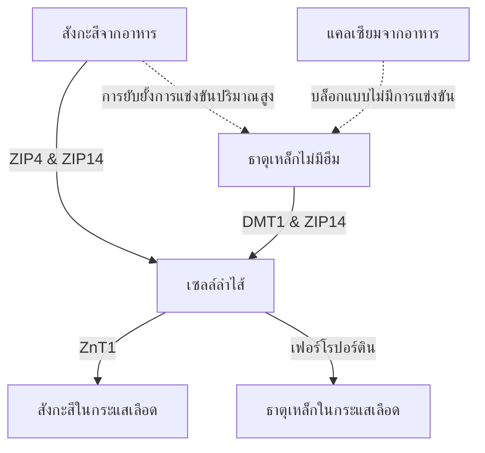

การให้ยาเสริมสังกะสี ($\text{Zn}^{2+}$) ทำให้เกิดความขัดแย้งทางสรีรวิทยาและชีวเคมีหลายประการ แม้ว่าสังกะสีจะเป็นแร่ธาตุที่จำเป็นซึ่งเกี่ยวข้องกับปฏิกิริยาของเอนไซม์มากกว่า 300 ชนิด แต่การรับประทานทางปากมักเป็นอุปสรรคเนื่องจากอาการปวดท้องอย่างรุนแรง การยับยั้งการแข่งขันโดยแคตไอออนประจุบวกอื่นๆ และการพร่องแร่ธาตุในระบบ การแก้ปัญหาเหล่านี้ต้องการความเข้าใจอย่างละเอียดเกี่ยวกับพลศาสตร์ของตัวขนส่งในลำไส้ ชีวเคมีของเยื่อบุ และเภสัชวิทยาตามเวลา (Chronopharmacology) เพื่อออกแบบโปรโตคอลการให้ยาที่เหมาะสมที่สุด

## ความขัดแย้งของการกินตอนท้องว่าง: การระคายเคืองเยื่อบุทางเดินอาหาร vs การดูดซึม

สังกะสีที่รับประทานทางปากมีตัวเลือกที่ยากลำบาก: การกินตอนท้องว่างจะช่วยให้การดูดซึมในเซลล์สูงสุด แต่มักทำให้เกิดอาการปวดท้องอย่างรุนแรง (คลื่นไส้) ในทางกลับกัน การให้สังกะสีพร้อมอาหารช่วยบรรเทาความรู้สึกไม่สบายได้สำเร็จ แต่จะทำให้มีสารยับยั้งในอาหารที่ลดการดูดซึมได้อย่างมาก

### กลไกระดับโมเลกุลของการระคายเคืองในกระเพาะอาหารและอาการคลื่นไส้
การกินเกลือสังกะสีอนินทรีย์ที่ละลายน้ำได้ดี เช่น ซิงค์ซัลเฟต ($\text{ZnSO}_4$) หรือซิงค์คลอไรด์ ($\text{ZnCl}_2$) นำไปสู่การละลายอย่างรวดเร็วภายในรูของกระเพาะอาหาร ในสารละลายในน้ำ เกลือเหล่านี้จะแยกตัวออกอย่างสมบูรณ์ ทำให้เกิดสภาพแวดล้อมที่มีความเข้มข้นสูงและเป็นกรดในบริเวณรอบๆ โดยมีค่า pH อยู่ที่ประมาณ 4.0 ถึง 5.0

ในสถานะอดอาหาร การไม่มีก้อนอาหารทำให้เยื่อบุกระเพาะอาหารไม่ได้รับการปกป้อง การสัมผัสกับไอออนสังกะสีอิสระ ($\text{Zn}^{2+}$) อย่างกะทันหันจะส่งผลให้เกิดการกัดกร่อนและการระคายเคืองโดยตรงต่อเซลล์เยื่อบุผิวกระเพาะอาหาร การระคายเคืองที่เกิดขึ้นเฉพาะที่นี้จะกระตุ้นให้เซลล์ข้างขม่อมของกระเพาะอาหารหลั่งกรดไฮโดรคลอริก (HCl) มากเกินไป ส่งผลให้ค่า pH ของกระเพาะอาหารลดลงอีกและทำให้เยื่อบุผิวกระเพาะอาหารสึกกร่อน

สิ่งนี้จะกระตุ้นเส้นประสาทส่วนปลายที่ส่งสัญญาณการระคายเคืองไปยังก้านสมอง ซึ่งทำให้เกิดปฏิกิริยาสะท้อนกลับที่ทำให้เกิดอาเจียน ทำให้มีอาการคลื่นไส้ทันที กระเพาะอาหารว่างช้า และปวดเกร็งกระเพาะอาหารภายใน 30 นาทีหลังจากกลืนกิน

### การปิดกั้นการดูดซึม: ไฟเตต ธัญพืช และผลิตภัณฑ์จากนม

เมื่อกินสังกะสีพร้อมอาหารเพื่อป้องกันการกระตุ้นประสาทเวกัส (คลื่นไส้) การดูดซึมของสังกะสีจะลดลงอย่างมากเนื่องจากสารยับยั้งในอาหาร สารยับยั้งที่มีประสิทธิภาพมากที่สุดคือ **กรดไฟติก** (ไฟเตต) ซึ่งมีความเข้มข้นสูงในเปลือกนอกของเมล็ดธัญพืชที่ไม่ผ่านการขัดสี พืชตระกูลถั่ว ถั่วเปลือกแข็ง และเมล็ดพืช

ที่ค่า pH ทางสรีรวิทยาของลำไส้เล็กส่วนต้น กรดไฟติกจะทำหน้าที่เป็นลิแกนด์ที่รุนแรงซึ่งจะคีเลต (ดักจับ) ไอออน $\text{Zn}^{2+}$ อิสระ ทำให้เกิดตะกอนที่เสถียร ไม่ละลายน้ำ และมีโครงสร้างที่ซับซ้อน ซึ่งต้านทานการดูดซึมของลำไส้ได้อย่างสมบูรณ์ เนื่องจากมนุษย์ขาดเอนไซม์ไฟเตส สารเชิงซ้อนสังกะสี-ไฟเตตเหล่านี้จึงยังคงไม่ถูกไฮโดรไลซ์และถูกขับออกมาทางอุจจาระ

> [!CAUTION]
> การศึกษาแสดงให้เห็นว่าการเติมไฟเตตเพียง 50 มก. ลงในมื้ออาหารจะช่วยลดการดูดซึมสังกะสีได้ประมาณ 36% (ลดลงจาก 22% พื้นฐานเหลือ 14%) ความเข้มข้นของไฟเตตที่สูงขึ้น (250 มก.) ยับยั้งการดูดซึมได้อย่างสมบูรณ์

นอกจากนี้ ผลิตภัณฑ์จากนมยังมีผลในการยับยั้งอย่างอิสระ **เคซีน** ซึ่งเป็นเศษส่วนโปรตีนหลักในนมวัว จะไปจับกับไอออนของสังกะสีในรูของลำไส้ ซึ่งช่วยลดการดูดซึมได้อย่างมากเมื่อเทียบกับเวย์โปรตีน

### โปรโตคอลที่เหมาะสมทางวิทยาศาสตร์

เพื่อหลีกเลี่ยงการสะท้อนความคลื่นไส้ในขณะท้องว่างและหลีกเลี่ยงการปิดกั้นการดูดซึมของไฟเตต จะต้องใช้โปรโตคอลทางคลินิกที่เฉพาะเจาะจง:

1. **เปลี่ยนไปใช้สารอินทรีย์คีเลต:** เปลี่ยนเกลือสังกะสีอนินทรีย์ด้วยคีเลตโลหะและกรดอะมิโนที่เป็นกลาง เช่น ซิงค์ บิสไกลซิเนต (Zinc Bisglycinate) ไอออนของสังกะสีจะจับกับลิแกนด์ไกลซีนสองตัวแบบโควาเลนต์ ซึ่งช่วยปกป้องแร่ธาตุจากการแยกตัวก่อนเวลาอันควรในกรดในกระเพาะอาหาร
2. **ของว่างที่มีสารต้านอนุมูลอิสระต่ำ:** หากผู้ป่วยมีความอ่อนไหวสูง สังกะสีควรรับประทานร่วมกับของว่างเบาๆ ที่ไม่มีไฟเตตและแคลเซียมปริมาณสูง อาหารที่อนุญาต ได้แก่ ขนมปังซาวร์โดว์ขาว (การหมักทำลายไฟเตต) หรือโปรตีนจากสัตว์แบบง่ายๆ (ไข่ หรือ เวย์ไอโซเลต)

> [!TIP]
> **เคล็ดลับสำหรับมือโปร:** เพื่อเพิ่มการดูดซึมให้สูงสุดพร้อมๆ กับหลีกเลี่ยงอาการคลื่นไส้อย่างสิ้นเชิง โปรโตคอลในอุดมคติคือการรับประทาน ซิงค์ บิสไกลซิเนต 15-30 มก. ร่วมกับของว่างเบาๆ ที่ปราศจากไฟเตตในช่วงบ่ายตรู่ โดยต้องงดอาหาร 2 ชั่วโมง (รวมถึงกาแฟและชา) ก่อนและหลังรับประทาน

## สงครามการขนส่ง: DMT1 และ ZIP14

เซลล์ลำไส้เล็กทำหน้าที่เป็นพื้นที่แข่งขันสูงสำหรับการดูดซึมโลหะไดวาเลนต์ สังกะสี ($\text{Zn}^{2+}$), ธาตุเหล็กที่ไม่มีฮีม ($\text{Fe}^{2+}$) และแคลเซียม ($\text{Ca}^{2+}$) มีเส้นทางที่อิ่มตัวร่วมกัน ซึ่งหมายความว่าการบริหารอาหารเสริมปริมาณสูงร่วมกันจะระงับการดูดซึมแร่ธาตุแต่ละชนิดโดยตรง

### ภูมิทัศน์ของผู้ขนส่ง: ZIP4, ZIP14 และ DMT1
ที่เยื่อหุ้มเซลล์ของเซลล์ลำไส้เล็กส่วนต้น ตัวนำเข้าหลักสำหรับสังกะสีในอาหารคือ ZIP4 ธาตุเหล็กที่ไม่มีฮีม (ธาตุเหล็กจากพืช/อนินทรีย์) อาศัยเส้นทางอื่น: DMT1 อย่างไรก็ตาม มีตัวขนส่งที่สำคัญอีกตัวหนึ่งคือ ZIP14; แม้ว่าจะถูกจัดเป็นตัวขนส่งสังกะสี แต่ก็สามารถขนส่งธาตุเหล็กได้สูงเช่นกัน

เมื่อให้ธาตุเหล็กในปริมาณที่ใช้รักษา (100–400 มก.) ร่วมกับสังกะสี ธาตุเหล็กจะทำได้ดีกว่าสังกะสีในการดูดซึมเข้าสู่เซลล์ การวิจัยทางคลินิกแสดงให้เห็นว่าการรับประทานธาตุเหล็กในปริมาณสูงพร้อมกับสังกะสีปริมาณมาตรฐาน 25 มก. จะช่วยลดการดูดซึมสังกะสีลงประมาณ 40–50%

## อันตรายจากการสูญเสียทองแดง

อันตรายที่สำคัญของการเสริมสังกะสีในปริมาณสูงในระยะยาวคือการพัฒนาที่ซ่อนเร้นของการขาดทองแดงในระบบ เส้นทางนี้เป็นสื่อกลางโดยการเพิ่มการควบคุมของ **metallothionein** ซึ่งเป็นโปรตีนจับโลหะภายในเซลล์ในเซลล์ลำไส้

เมื่อบริโภคสังกะสีในปริมาณสูง (> 40–50 มก./วัน) เป็นระยะเวลานาน ไอออนของสังกะสีจะไปกระตุ้นให้เกิดการสังเคราะห์เมทัลโลไทโอนีนจำนวนมาก โปรตีนนี้มีความสัมพันธ์ผูกพันทางอุณหพลศาสตร์กับทองแดง ($\text{Cu}^+$) ที่สูงกว่าความสัมพันธ์กับสังกะสีอย่างมาก

เมื่อทองแดงในอาหารถูกดูดซึมเข้าสู่เซลล์ลำไส้ โมเลกุลของเมทัลโลไทโอนีนจะเข้าจับและแยกไอออนของทองแดงอย่างรวดเร็ว ทองแดงนี้ถูกกักขังอยู่ในเซลล์และไม่สามารถเข้าไปในกระแสเลือดได้ และจะถูกขับออกมาทางอุจจาระ เมื่อเวลาผ่านไป การอุดตันนี้ทำให้ทองแดงหมดไปอย่างรุนแรง

> [!WARNING]
> การเสริมด้วยสังกะสีในปริมาณที่เกิน 40 มก. ต่อวันโดยไม่มีความสมดุลของทองแดงในอัตราส่วน 15:1 นานกว่าสี่สัปดาห์ติดต่อกัน อาจทำให้เกิดการขาดทองแดงอย่างรุนแรง (ผมร่วง ทำลายเส้นประสาทอย่างถาวร และโรคโลหิตจาง)

## เภสัชวิทยาตามเวลาของสังกะสี: จังหวะชีวิตและการนอนหลับ

ระยะเวลาของการบริหารสารอาหารเป็นตัวกำหนดหลักของประสิทธิภาพ สังกะสีทำหน้าที่เป็นปัจจัยเสริมทางชีวเคมีขั้นพื้นฐานที่จำเป็นสำหรับการสังเคราะห์เมลาโทนิน (ฮอร์โมนการนอนหลับ) มันทำให้เอนไซม์ TPH และ AANAT เสถียร การขาดสังกะสีจะลดทอนการถอดความของ AANAT โดยตรง ทำให้เมลาโทนินออกหากินเวลากลางคืนลดลงอย่างรุนแรง (นอนไม่หลับ)

นอกจากนี้ สังกะสียังทำหน้าที่เป็นตัวประสานประสาทโดยตรง โดยทำหน้าที่เป็นตัวป้องกันตัวรับกลูตาเมต NMDA ในขณะเดียวกันก็เสริมตัวรับ GABA ให้สงบลง การกระทำสองอย่างนี้อำนวยความสะดวกในการเปลี่ยนเข้าสู่การนอนหลับลึกอย่างราบรื่น

### โปรโตคอล SuppTime

| เวลา | อาหารเสริม | เหตุผลทางเวลา |
| :--- | :--- | :--- |
| **เช้า** | โปรไบโอติก | ปริมาตรกรดในกระเพาะอาหารต่ำเมื่อตื่นนอน ช่วยเพิ่มการอยู่รอดของแบคทีเรีย |
| **อาหารเช้า**| ธาตุเหล็ก, วิตามินซี, วิตามินดี 3 | วิตามินซีช่วยเพิ่มการดูดซึมธาตุเหล็ก หลีกเลี่ยงแคลเซียมและสังกะสี |
| **บ่าย** | ซิงค์ บิสไกลซิเนต (15–30 มก.) + ทองแดง (1–2 มก.) | สูตรในอัตราส่วน 15:1 เพื่อป้องกันการสูญเสียทองแดง แยกออกจากธาตุเหล็กและแคลเซียม |
| **กลางคืน** | แคลเซียม, แมกนีเซียม ไกลซิเนต | แมกนีเซียมคลายกล้ามเนื้อและปรับตัวรับ GABA ก่อนนอน |
