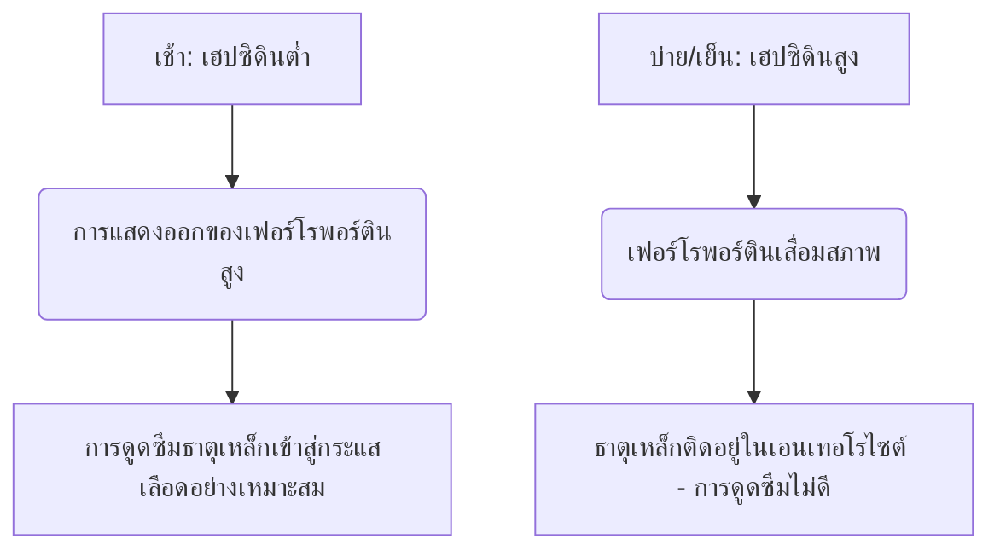

ธาตุเหล็กเป็นสารอาหารรองที่ขาดไม่ได้ ซึ่งทำหน้าที่เป็นโคแฟกเตอร์ทางโครงสร้างและตัวเร่งปฏิกิริยาในการขนส่งออกซิเจน การหายใจระดับเซลล์ และการสังเคราะห์ DNA แม้ว่าธาตุเหล็กจะมีอยู่มากมายตามธรรมชาติ แต่ธาตุเหล็กมักเป็นสารอาหารที่จำกัดการเจริญเติบโตในอาหารของมนุษย์ เนื่องจากมนุษย์ไม่มีกลไกทางสรีรวิทยาในการขับธาตุเหล็กออกอย่างแข็งขัน ความสมดุลของธาตุเหล็กในระบบจึงถูกรักษาไว้เฉพาะที่ระดับการดูดซึมในลำไส้เท่านั้น

ธาตุเหล็กในอาหารเกิดขึ้นในสองรูปแบบหลัก: **ธาตุเหล็กอินทรีย์ (ฮีม)** และ **ธาตุเหล็กอนินทรีย์ (ไม่ใช่ฮีม)**

ธาตุเหล็กฮีมมีชีวปริมาณออกฤทธิ์สูงมาก โดยทั่วไปจะถูกดูดซึมในอัตรา 15% ถึง 35% มันถูกขนส่งอย่างสมบูรณ์ผ่านขอบแปรงที่ปลายสุดของเซลล์เอนเทอโรไซต์ในลำไส้เล็กส่วนต้นผ่านโปรตีนขนส่งฮีม 1 (HCP1) และยังคงได้รับการปกป้องจากตัวยับยั้งในอาหารมาตรฐาน

ในทางกลับกัน ธาตุเหล็กที่ไม่ใช่ฮีม (ธาตุเหล็กอนินทรีย์) คิดเป็นสัดส่วนมากกว่า 80% ของปริมาณที่ได้รับจากอาหาร แต่มีโปรไฟล์การดูดซึมที่ลดลงอย่างมาก โดยมีอัตราการดูดซึมตั้งแต่ 2% ถึง 20% เท่านั้น

> [!TIP]
> ที่ระดับ pH ทางสรีรวิทยา ธาตุเหล็กที่ไม่ใช่ฮีมส่วนใหญ่จะอยู่ในสถานะเฟอร์ริก (Fe³⁺) ที่ถูกออกซิไดซ์และไม่ละลายน้ำอย่างมาก เพื่อที่จะดูดซึมได้ มันจะต้องผ่านการรีดักชันให้อยู่ในสถานะเฟอร์รัส (Fe²⁺) ที่ละลายน้ำได้โดยเอนไซม์ไซโตโครมบีในลำไส้เล็กส่วนต้น (Dcytb) ก่อนที่จะเข้าสู่เอนเทอโรไซต์ผ่านทางตัวขนส่งโลหะไดวาเลนต์ 1 (DMT1)

## เส้นทางธาตุเหล็กฮีมเทียบกับธาตุเหล็กที่ไม่ใช่ฮีม

| คุณลักษณะ / ตัวชี้วัด | เส้นทางธาตุเหล็กฮีม | เส้นทางธาตุเหล็กที่ไม่ใช่ฮีม (อนินทรีย์) |
| :--- | :--- | :--- |
| **แหล่งอาหาร** | เนื้อเยื่อสัตว์ (ฮีโมโกลบิน, ไมโอโกลบิน) | พืช, อาหารเสริมธาตุเหล็ก, เกลือแร่ |
| **ตัวขนส่งส่วนปลาย** | โปรตีนขนส่งฮีม 1 (HCP1) | ตัวขนส่งโลหะไดวาเลนต์ 1 (DMT1) |
| **สถานะวาเลนซ์ที่ต้องการ** | คอมเพล็กซ์ที่จับกับพอร์ไฟริน | เฟอร์รัส (Fe²⁺) |
| **pH ของลูเมนที่เหมาะสม** | เสถียรในวงกว้าง ไม่ได้รับอิทธิพลจากกรดในกระเพาะอาหาร | ต้องการความเป็นกรดสูง (pH < 3.0) ในการละลาย |
| **ประสิทธิภาพการดูดซึมโดยทั่วไป**| 15% – 35% (ชีวปริมาณออกฤทธิ์สูง) | 2% – 20% (มีความแปรปรวนสูง) |
| **ความไวต่อตัวยับยั้งในอาหาร** | เล็กน้อย ได้รับการปกป้องโดยวงแหวนพอร์ไฟริน | สูงมาก (ถูกยับยั้งโดยไฟเตต โพลีฟีนอล แคลเซียม) |

## เวลาที่เหมาะสม (Chronopharmacology)

การเพิ่มประสิทธิภาพการดูดซึมธาตุเหล็กที่ไม่ใช่ฮีมต้องอาศัยการประสานงานที่แม่นยำกับจลนพลศาสตร์รายวันของ **เฮปซิดิน (Hepcidin)** ซึ่งเป็นเปปไทด์ฮอร์โมนที่มีกรดอะมิโน 25 ตัว ซึ่งสังเคราะห์โดยเซลล์ตับเป็นหลัก เฮปซิดินทำหน้าที่เป็นตัวควบคุมหลักของระบบภาวะธำรงดุลของธาตุเหล็กโดยจับกับตัวส่งออกทางด้านข้างฐานอย่างเฟอร์โรพอร์ติน (Ferroportin) โดยตรง ทำให้เกิดการย่อยสลาย ส่งผลให้ระดับเฮปซิดินในเลือดที่สูงขึ้นจะดักจับธาตุเหล็กไว้ภายในเซลล์เอนเทอโรไซต์ของลำไส้เล็กส่วนต้น และป้องกันไม่ให้เข้าสู่กระแสเลือด

### การแกว่งตัวตามจังหวะเซอร์คาเดียนของเฮปซิดิน
ภายใต้สภาวะทางสรีรวิทยาพื้นฐาน ความเข้มข้นของเฮปซิดินจะอยู่ที่จุดต่ำสุดในตอนเช้าตรู่ ค่อยๆ สูงขึ้นตลอดช่วงบ่ายจนถึงจุดสูงสุด และลดลงในช่วงกลางคืน

เส้นโค้งเซอร์คาเดียนนี้ส่งผลโดยตรงต่อจลนพลศาสตร์ของธาตุเหล็กในช่องปาก **การรับประทานธาตุเหล็กในตอนเช้า** จะช่วยให้แร่ธาตุไปถึงลำไส้เล็กส่วนต้นเมื่อการแสดงออกของเฟอร์โรพอร์ตินของเอนเทอโรไซต์อยู่ในระดับสูงสุด ในทางตรงกันข้าม การให้ยาในช่วงบ่ายหรือเย็นจะบังคับให้ธาตุเหล็กต้องแข่งขันกับการปิดกั้นของเฮปซิดินที่เพิ่มขึ้น ส่งผลให้การดูดซึมธาตุเหล็กบางส่วนลดลง 37%

### ผลกระทบของความเป็นกรดในกระเพาะอาหาร
สถานะทางชีวฟิสิกส์ของธาตุเหล็กอนินทรีย์ขึ้นอยู่กับการผลิตกรดในกระเพาะอาหารเป็นอย่างมาก การยับยั้งกรดในกระเพาะอาหารทางเภสัชวิทยาผ่านยายับยั้งโปรตอนปั๊ม (PPIs - ยาลดกรด) จะขัดขวางสภาพแวดล้อมจุลภาคนี้อย่างรุนแรง ทำให้ pH ในกระเพาะอาหารเพิ่มขึ้นและทำให้ Fe²⁺ ที่ละลายน้ำได้ถูกออกซิไดซ์อย่างรวดเร็วเป็น Fe³⁺ ที่ไม่ละลายน้ำอย่างมาก

> [!WARNING]
> ต้องรับประทานผลิตภัณฑ์เสริมอาหารธาตุเหล็กในขณะท้องว่าง โดยหลักการแล้วควรรับประทาน 1 ชั่วโมงก่อนหรือ 2 ชั่วโมงหลังอาหาร และแยกจากยาลดกรดทุกชนิดอย่างเคร่งครัด

## ปฏิกิริยาที่เป็นอันตราย (สิ่งที่ไม่ควรผสม)

ประสิทธิภาพการรักษาของธาตุเหล็กในช่องปากจะลดลงอย่างง่ายดายเมื่อรับประทานร่วมกับสารประกอบในอาหารและสารทางเภสัชกรรมต่างๆ

### แคลเซียม
แคลเซียม ไม่ว่าจะรับประทานเป็นผลิตภัณฑ์นมในอาหาร (นม ชีส โยเกิร์ต) หรือเป็นแร่ธาตุเสริม (แคลเซียมคาร์บอเนต) เป็นตัวยับยั้งการดูดซึมธาตุเหล็กทั้งฮีมและไม่ใช่ฮีมอย่างมีประสิทธิภาพ การรับประทานแคลเซียมคาร์บอเนต 500 มก. ร่วมกับมื้ออาหารที่มีธาตุเหล็กจะลดการดูดซึมธาตุเหล็กบางส่วนลงมากกว่า 50%

### แทนนินและโพลีฟีนอล
โพลีฟีนอลที่พบใน **ชาดำ ชาเขียว ชาสมุนไพร และกาแฟ** เป็นสารคีเลตธาตุเหล็กที่มีประสิทธิภาพเป็นพิเศษ สารประกอบที่ได้จากพืชเหล่านี้ประสานกับธาตุเหล็กเฟอร์ริกเพื่อสร้างสารเชิงซ้อนออร์กาโนเมทัลลิกขนาดใหญ่ที่มีความเสถียรสูง ซึ่งไม่สามารถข้ามขอบแปรงของลำไส้เล็กส่วนต้นได้ การเพิ่มกาแฟหรือชาเพียงถ้วยเดียวในมื้ออาหารสามารถลดการดูดซึมธาตุเหล็กที่ไม่ใช่ฮีมได้ 40% ถึง 70%

### กรดไฟติก
กรดไฟติกเป็นสารประกอบกักเก็บฟอสฟอรัสหลักในธัญพืชเต็มเมล็ด ซีเรียล ถั่ว และพืชตระกูลถั่ว อัตราส่วนโมลาร์ของกรดไฟติกต่อธาตุเหล็กเป็นปัจจัยทางอาหารที่สำคัญที่สุดเพียงปัจจัยเดียวที่จำกัดการดูดซึมธาตุเหล็กในอาหารที่เน้นพืชเป็นหลัก

### สังกะสีและแมกนีเซียม
เฟอร์รัส สังกะสี และแมกนีเซียม มีเส้นทางการขนส่งที่ทับซ้อนกันผ่านเยื่อหุ้มเซลล์ของเอนเทอโรไซต์ (เช่น DMT1) เมื่อได้รับธาตุเหล็กในขนาดยารักษา จะเกิดการยับยั้งแบบแข่งขัน ซึ่งกดการขนส่งธาตุเหล็กอย่างมีนัยสำคัญ อย่ารับประทานอาหารเสริมธาตุเหล็กร่วมกับสังกะสีหรือแมกนีเซียม

### ยารักษาไทรอยด์ (Levothyroxine)
การให้ยาเสริมธาตุเหล็กทางปากร่วมกับเลโวไทรอกซีน (T4) นำไปสู่ปฏิกิริยาระหว่างยากับสารอาหารที่รุนแรง ธาตุเหล็กประสานกับโมเลกุลของเลโวไทรอกซีน เกิดเป็นสารประกอบที่ไม่ละลายน้ำ ซึ่งลดการดูดซึมของเลโวไทรอกซีนทางปากลง 20% ถึง 64%

> [!CAUTION]
> เพื่อป้องกันความล้มเหลวทางคลินิกของการรักษาไทรอยด์ของคุณ ต้องเว้นระยะห่างขั้นต่ำอย่างเคร่งครัด 4 ชั่วโมงระหว่างการรับประทานเลโวไทรอกซีนและธาตุเหล็ก

## สุดยอดโคแฟกเตอร์: วิตามินซี

กรดแอสคอร์บิก (วิตามินซี) เป็นตัวกระตุ้นการดูดซึมธาตุเหล็กที่ไม่ใช่ฮีมที่มีศักยภาพสูงสุด สามารถลบล้างผลการยับยั้งของไฟเตตในอาหาร โพลีฟีนอล และแคลเซียมได้

ความสัมพันธ์แบบเสริมฤทธิ์กันนี้ทำงานผ่านกลไกทางชีวเคมีคู่ที่มีประสิทธิภาพสูง:
1. **การลดระดับตามอุณหพลศาสตร์:** กรดแอสคอร์บิกจะเปลี่ยนไอออนเฟอร์ริกที่ไม่ละลายน้ำ (Fe³⁺) เป็นรูปแบบเฟอร์รัสที่ละลายน้ำได้สูง (Fe²⁺) อย่างรวดเร็ว พร้อมสำหรับการขนส่ง
2. **การคีเลตในลำไส้เล็กส่วนต้น:** กรดแอสคอร์บิกทำหน้าที่เป็นเกราะป้องกัน เพื่อป้องกันไม่ให้ธาตุเหล็กจับกับไฟเตตและโพลีฟีนอลในขณะที่เปลี่ยนเข้าสู่สภาพแวดล้อมที่เป็นด่างของลำไส้เล็กส่วนต้น

## ผลข้างเคียงและกระบวนทัศน์การให้ยาแบบ "วันเว้นวัน"

แนวทางดั้งเดิมในการรักษาโรคโลหิตจางจากการขาดธาตุเหล็ก ได้แก่ การสั่งจ่ายธาตุเหล็กทางปากในขนาดสูงทุกวัน มักจะล้มเหลวเนื่องจากผลข้างเคียงทางระบบทางเดินอาหารอย่างรุนแรง (คลื่นไส้ ท้องผูก) และวงจรป้อนกลับที่เป็นระบบ

เนื่องจากการดูดซึมบางส่วนต่ำ จึงมักมีธาตุเหล็กถึง 90% ของขนาดมาตรฐานที่รับประทานทางปากตกค้างอยู่และไม่ถูกดูดซึมในระบบทางเดินอาหาร ธาตุเหล็กส่วนเกินนี้จะทำปฏิกิริยากับไฮโดรเจนเปอร์ออกไซด์เพื่อสร้างอนุมูลไฮดรอกซิลที่มีพิษสูง ทำให้เกิดความเครียดจากปฏิกิริยาออกซิเดชันและการอักเสบของเยื่อเมือก

นอกจากนี้ การเสริมธาตุเหล็กในปริมาณสูงทุกวันยังกระตุ้นให้เกิด **"การปิดกั้นเยื่อเมือก" (Mucosal Block)** อย่างเป็นระบบ การรับประทานธาตุเหล็กทางปาก ≥ 60 มก. กระตุ้นให้เฮปซิดินในเลือดพุ่งสูงขึ้นอย่างรวดเร็ว ซึ่งจะยังคงอยู่ในระดับสูงเป็นเวลา 24 ชั่วโมง หากให้ธาตุเหล็กครั้งที่สองในวันถัดไป เอนเทอโรไซต์จะถูกปิดกั้นทางกายภาพจากการส่งออกไปยังระบบไหลเวียนพอร์ทัล ธาตุเหล็กถูกกักขังและขับออกมาในที่สุด

> [!TIP]
> **การรับประทานยาวันเว้นวัน:** เพื่อหลีกเลี่ยงการปิดกั้นที่เป็นสื่อกลางโดยเฮปซิดิน การดูแลรักษาทางโลหิตวิทยาสมัยใหม่ได้เปลี่ยนไปสู่การให้ธาตุเหล็กทางปาก **วันเว้นวัน** การทดลองทางคลินิกพิสูจน์ให้เห็นว่าการรับประทานธาตุเหล็กทุกๆ 48 ชั่วโมงจะเพิ่มการดูดซึมธาตุเหล็กบางส่วนขึ้น 40% ถึง 50% เมื่อเทียบกับการให้ยาทุกวันติดต่อกัน ในขณะที่ลดผลข้างเคียงทางระบบทางเดินอาหารลงอย่างมาก

### บทสรุปของเกณฑ์วิธีทางคลินิก

*   **pH ในกระเพาะอาหารต่ำเป็นสิ่งสำคัญ:** รับประทานธาตุเหล็กในขณะท้องว่างด้วยน้ำเปล่า
*   **หลีกเลี่ยงตัวยับยั้งหลักในอาหาร:** หลีกเลี่ยงการรับประทานธาตุเหล็กร่วมกับแคลเซียม ผลิตภัณฑ์นม กาแฟ หรือชาโดยเด็ดขาด
*   **รักษาระยะห่างของยาอย่างเคร่งครัด:** แยกธาตุเหล็กและเลโวไทรอกซีนห่างกันอย่างน้อย 4 ชั่วโมง
*   **ใช้วิตามินซีร่วมด้วย:** การให้ธาตุเหล็กร่วมกับวิตามินซีจะช่วยเพิ่มการดูดซึมได้ถึง 300%
*   **ใช้การให้ยาวันเว้นวัน:** เว้นระยะห่างการให้ธาตุเหล็กทางปาก 48 ชั่วโมง เพื่อหลีกเลี่ยงการปิดกั้นเยื่อเมือกที่เกิดจากเฮปซิดินและเพิ่มการดูดซึมให้สูงสุด

## แหล่งข้อมูลอ้างอิง

1. Stoffel NU, Zeder C, Brittenham GM, Moretti D, Zimmermann MB. [Iron absorption from oral iron supplements given on consecutive versus alternate days and as single morning doses versus twice-daily split dosing in iron-depleted women: two open-label, randomised controlled trials](https://pubmed.ncbi.nlm.nih.gov/29032957/). *Lancet Haematol.* 2017.
2. Campbell NR, Hasinoff BB. [Ferrous sulfate reduces thyroxine efficacy in patients with hypothyroidism](https://pubmed.ncbi.nlm.nih.gov/1443969/). *Ann Intern Med.* 1992.
3. Hallberg L, Hulthén L. [Effect of ascorbic acid intake on nonheme-iron absorption from a complete diet](https://pubmed.ncbi.nlm.nih.gov/11124756/). *Am J Clin Nutr.* 2000.
4. Lönnerdal B. [Calcium and iron absorption—mechanisms and public health relevance](https://pubmed.ncbi.nlm.nih.gov/21462112/). *Int J Vitam Nutr Res.* 2010.

*บทความนี้จัดทำขึ้นเพื่อวัตถุประสงค์ในการให้ข้อมูลเท่านั้น มิได้มีเจตนาให้ใช้ทดแทนคำแนะนำทางการแพทย์แต่อย่างใด กรุณาปรึกษาผู้เชี่ยวชาญด้านสุขภาพที่มีคุณสมบัติเหมาะสมก่อนปรับเปลี่ยนการรับประทานอาหารเสริมหรือยาของท่าน*
