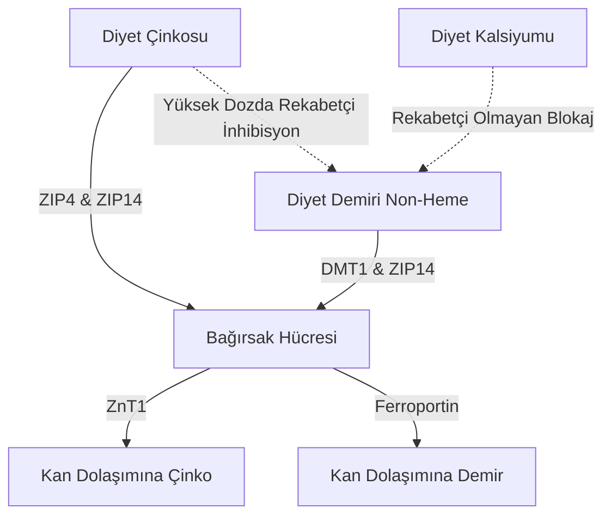

Çinko ($\text{Zn}^{2+}$) takviyesi uygulaması, bir dizi fizyolojik ve biyokimyasal paradoks barındırır. Çinko 300'den fazla enzimatik reaksiyonda yer alan hayati bir eser mineral olsa da, oral yolla (ağızdan) alınması genellikle akut gastrointestinal rahatsızlıklar, diğer minerallerle rekabetçi inhibisyon (engelleme) ve sistemik mineral tükenmesi ile sekteye uğrar. Bu sorunları çözmek ve optimum dozlama protokolleri tasarlamak için bağırsak taşıyıcı kinetiğinin, mukozal biyokimyanın ve kronofarmakolojinin ayrıntılı bir şekilde anlaşılması gerekir.

## Aç Karnına Paradoksu: Mukozal İrritasyon vs. Biyoyararlanım

Ağız yoluyla alınan çinko zor bir seçim sunar: Aç karnına almak hücresel biyoyararlanımı en üst düzeye çıkarır ancak genellikle akut mide rahatsızlığına (şiddetli bulantı) neden olur. Tersine, çinkoyu yemeklerle birlikte uygulamak bu rahatsızlığı başarıyla hafifletir, ancak bu kez de fraksiyonel emilimi ciddi şekilde azaltan diyet antagonistlerini devreye sokar.

### Mide İrritasyonu ve Bulantının Moleküler Mekanizmaları
Çinko sülfat ($\text{ZnSO}_4$) veya çinko klorür ($\text{ZnCl}_2$) gibi suda yüksek oranda çözünen inorganik çinko tuzlarının yutulması, mide lümeninde hızla çözünmelerine yol açar. Sulu çözeltilerde bu tuzlar tamamen ayrışarak pH'ı yaklaşık 4.0 ila 5.0 olan oldukça yoğun ve asidik lokalize bir ortam oluştururlar.

Açlık durumunda, yiyecek kütlesinin olmaması mide mukozasını tamponsuz (korumasız) bırakır. Serbest çinko iyonlarına ($\text{Zn}^{2+}$) aniden maruz kalmak, mide epitel hücreleri üzerinde doğrudan yakıcı ve tahriş edici bir etki yaratır. Bu lokal tahriş, mide paryetal hücrelerini daha fazla hidroklorik asit (HCl) salgılaması için uyarır, mide pH'ını daha da düşürür ve mukozal erozyona yol açar.

Bu kimyasal ve asidik hasarın tespiti, mide duvarını saran vagal duyu nöronlarından oluşan geniş bir ağ aracılığıyla gerçekleşir. Bu duyu nöronları aktive olduğunda, beyin sapına aksiyon potansiyelleri iletir. Bu da, yutulduktan sonraki 30 dakika içinde ani mide bulantısı, gecikmiş mide boşalması ve mide spazmları olarak kendini gösteren merkezi aracılı bir emetik (kusma) refleksini başlatır.

### Biyoyararlanım Engeli: Fitatlar, Tahıllar ve Süt Ürünleri

Vagal stimülasyonu ve mide bulantısını önlemek için çinko yiyeceklerle birlikte alındığında, bu kez de diyetteki inhibitörler tarafından biyoyararlanımı ciddi şekilde tehlikeye girer. Bu inhibitörlerin en güçlüsü, rafine edilmemiş tahılların, baklagillerin, yemişlerin ve tohumların dış kabuklarında yoğun olarak bulunan **fitik asit**tir (fitat).

Duodenumun fizyolojik pH'ında fitik asit, serbest $\text{Zn}^{2+}$ iyonlarını şelatlayan, bağırsak emilimine tamamen dirençli, son derece kararlı, çözünmez ve yapısal olarak karmaşık çökeltiler oluşturan agresif bir ligand görevi görür. İnsanların üst gastrointestinal sisteminde endojen fitaz enzimleri bulunmadığından, bu çinko-fitat kompleksleri parçalanamaz ve dışkı ile atılır.

> [!CAUTION]
> Kantitatif radyoişaretli çalışmalar, bir öğüne sadece 50 mg fitat eklenmesinin bile fraksiyonel çinko emilimini yaklaşık %36 oranında azalttığını (başlangıçtaki %22'den %14'e düşürdüğünü) göstermektedir. 250 mg'lık daha yüksek fitat konsantrasyonları ise fraksiyonel emilimi tamamen baskılayarak %6-7 gibi ihmal edilebilir bir seviyeye indirir.

Ayrıca süt ürünleri de bağımsız bir inhibitör etki gösterir. İnek sütündeki birincil protein olan **kazein**, bağırsak lümenindeki çinko iyonlarını bağlar. Kazein baskın öğünler, çinkonun biyoyararlanımını önemli ölçüde azaltır.

### Çinko Bileşik Formları ve Tolerans

| Kimyasal Sınıf | Çinko Formu | Tahmini Emilim Oranı | Mide Toleransı | Etki Mekanizması |
| :--- | :--- | :--- | :--- | :--- |
| **İnorganik Tuz** | Çinko Sülfat ($\text{ZnSO}_4$) | ~%20–49.9 | Yüksek Tahriş (~%15 mide bulantısı) | Serbest $\text{Zn}^{2+}$'ye hızla ayrışır; asidik pH (4.0–5.0). |
| **Organik Tuz** | Çinko Glukonat | ~%50.6–71.7 | Orta/Yüksek Tolerans (~%5 bulantı) | Nötr pH (5.5–7.0); yavaş ayrışma mukoza maruziyetini en aza indirir. |
| **Organik Şelat**| Çinko Bisglisinat | ~%50–60 | Çok Yüksek Tolerans (< %5 bulantı) | Glisine bağlıdır; midede erken ayrışmaya ve fitat engeline dirençlidir. |
| **Organik Şelat**| Çinko Pikolinat | Yüksek (Uzun vadede üstün) | Yüksek Tolerans | Pikolinik asit ile komplekslenmiştir; dokularda mükemmel birikim sağlar. |

### Bilimsel Olarak Optimal Dozlama Protokolü

Hem aç karnına oluşan mide bulantısı refleksini hem de fitat emilim bloğunu tamamen aşmak için özel bir klinik protokol kullanılmalıdır:

1. **Organik Şelatlara Geçiş:** İnorganik çinko tuzları yerine Çinko Bisglisinat veya Çinko Pikolinat gibi organik, nötr pH'lı metal-amino asit şelatları tercih edilmelidir. Çinko Bisglisinat formunda $\text{Zn}^{2+}$ iyonu iki glisin ligandına kovalent olarak bağlıdır ve minerali mide asidinde erken ayrışmadan korur.
2. **Alternatif Emilim Yollarını Kullanmak:** Kesinlikle pH'a bağımlı taşıyıcılara dayanan inorganik çinkonun aksine, organik şelatlar peptit eş taşıyıcıları gibi alternatif ve oldukça verimli yollarla bozulmadan emilirler.
3. **Düşük İnhibitörlü Tampon Öğünler:** Eğer kişi aşırı hassasiyet gösteriyor ve mide bulantısını engellemek için yemekle almak zorunda kalıyorsa, çinko kesinlikle fitat ve yüksek doz kalsiyum içermeyen hafif bir atıştırmalıkla alınmalıdır. İzin verilen gıdalar arasında beyaz ekşi mayalı ekmek (fermantasyon süreci fitatı parçalar) veya basit hayvansal proteinler (yumurta vb.) bulunur.

> [!TIP]
> **Pro Tip:** Mide bulantısını tamamen önlerken emilimi en üst düzeye çıkarmak için ideal protokol; 15-30 mg elementel Çinko Bisglisinat'ı öğleden sonra hafif, fitat içermeyen bir atıştırmalıkla (örneğin beyaz ekşi mayalı tost) almak ve alımdan önce ve sonra en az 2 saatlik bir açlık (kahve ve çay dahil) sağlamaktır.

## DMT1 ve ZIP Taşıyıcı Savaşları: Rekabetçi İnhibisyon

İnce bağırsak enterositi (bağırsak hücresi), iki değerlikli metallerin emilimi için oldukça rekabetçi bir arenadır. Çinko ($\text{Zn}^{2+}$), non-heme demir ($\text{Fe}^{2+}$) ve kalsiyum ($\text{Ca}^{2+}$) birbiriyle örtüşen taşıma yollarını paylaşır. Yani bu minerallerin yüksek dozda birlikte alınması, doğrudan birbirlerinin emilimini engeller.

### Taşıyıcı Manzarası: ZIP4, ZIP14 ve DMT1
Duodenal enterositlerin üst zarlarında (fırçamsı kenar), diyet çinkosu için birincil taşıyıcı kanal ZIP4'tür. Heme olmayan (bitkisel/inorganik) demir ise enterosite girmek için farklı bir kanal olan Divalent Metal Taşıyıcı-1'e (DMT1) güvenir. Ancak, ZIP14 adı verilen başka bir kritik taşıyıcı daha vardır; bu kanal öncelikle bir çinko taşıyıcısı olarak sınıflandırılsa da, aslında $\text{Fe}^{2+}$ (demir) taşımada da oldukça yeteneklidir.

$\text{Zn}^{2+}$ ve $\text{Fe}^{2+}$ yük ve boyut olarak birbirlerine çok benzedikleri için, paylaşılan taşıma yolları (örneğin ZIP14) için yoğun bir şekilde rekabet ederler. Terapötik (yüksek) dozlarda demir (100-400 mg) çinko ile birlikte uygulandığında, demir kapıları tutar ve çinkoyu dışarıda bırakır.

Klinik araştırmalar, yüksek dozda demirin standart 25 mg'lık bir çinko dozuyla aynı anda alınmasının, fraksiyonel çinko emilimini yaklaşık %40-50 oranında azalttığını göstermektedir. Standart bir 10 mg klinik demir dozunda, katı bir 1:1 oranında dahi karşılıklı önemli bir engelleme meydana gelir.

## Bakır Tüketimi Tehlikesi: Hücre İçine Hapsolma

Uzun süreli, yüksek doz çinko takviyesinin en büyük tehlikelerinden biri sinsi bir sistemik bakır eksikliğinin gelişmesidir. Bu durum, bağırsak hücrelerindeki hücre içi metal bağlayıcı bir protein olan **metallotiyonein**'in inanılmaz derecede artmasıyla oluşur.

Bir kişi uzun bir süre boyunca yüksek dozda çinko (genellikle günde 40-50 mg'ı aşan) tükettiğinde, hücre içindeki bu büyük çinko akışı güçlü bir sinyal olarak işlev görür ve çok büyük miktarlarda metallotiyonein üretimini tetikler.

Metallotiyonein üretimi büyük ölçüde çinko tarafından tetiklense de, bu proteinin bakıra ($\text{Cu}^+$) olan bağlanma eğilimi (afinitesi), çinkoya olan eğiliminden kat kat daha yüksektir. Sonuç olarak, diyetle alınan bakır bağırsak hücresine girdiğinde, içeride bekleyen bol miktardaki metallotiyonein molekülleri bakır iyonlarını hızla yakalar ve kendine hapseder.

Bu bakır, son derece kararlı bu kompleksin içinde mahsur kalır ve kana karışamaz. Bağırsak hücreleri her 3-5 günde bir yenilenip döküldüğünde, içlerinde hapsolmuş bakır ile birlikte dışkı yoluyla vücuttan atılırlar. Zamanla bu durum derin ve sistemik bir bakır eksikliğine yol açar.

> [!WARNING]
> Günde 40 mg'ı aşan çinko dozlarını, yanında uygun oranda bakır takviyesi olmadan dört haftadan uzun süre kullanmak, şiddetli bakır eksikliğini tetikleyebilir. Bu durum tedavi edilmezse, saç dökülmesine, geri dönüşü olmayan sinir hasarına ve anemiye neden olabilir.

### Klinik Olarak Güvenli Çinko-Bakır Dozlama Oranı
Uzun süreli takviye sırasında metallotiyonein kaynaklı bakır hapsini tamamen önlemek için, alınan herhangi bir çinko takviyesinin bakır ile son derece spesifik bir terapötik oranda eşleştirilmesi gerekir. Klinik olarak belirlenmiş güvenli ve sinerjik **çinko-bakır oranı 8:1 ila 15:1'dir.** 

Her 15 mg çinko için 1 mg bakır (Bakır Bisglisinat vb.) almak bu tehlikeyi tamamen ortadan kaldırır.

## Çinkonun Kronofarmakolojisi: Uyku ve Sirkadiyen Ritim

Besin alımının zamanlaması, takviyenin işe yarayıp yaramayacağını belirleyen birincil faktördür. Çinko, vücudun iç biyolojik saati ile oldukça karmaşık bir ilişkiye sahiptir; hem sirkadiyen bir düzenleyici hem de uyku mekanizmalarının doğrudan bir katılımcısı olarak hareket eder.

### Çinko, Melatonin Sentezi ve GABA
Çinko, uyku hormonu olan melatoninin sentezi için gerekli temel bir biyokimyasal kofaktördür. Melatonin üretimindeki kritik enzimler olan TPH ve AANAT'ın çalışmasını sağlar. Çinko eksikliği, AANAT'ın çalışmasını doğrudan durdurarak gece melatonin zirvesinin ciddi şekilde düşmesine (uykusuzluğa) neden olur.

Melatonin sentezinin ötesinde çinko, merkezi sinir sistemi içinde doğrudan bir nöromodülatör olarak hareket eder. Uyarıcı bir reseptör olan NMDA glutamat reseptörünün güçlü bir antagonistidir (engelleyicisi). Eş zamanlı olarak çinko, sakinleştirici GABA reseptörlerinin etkilerini güçlendirir. Bu ikili eylem—uyarılmayı engellerken sakinleşmeyi artırmak—derin ve onarıcı Yavaş Dalga Uykusuna (Slow-Wave Sleep) pürüzsüz bir geçişi kolaylaştırır.

### SuppTime Optimize Edilmiş Zamanlama Protokolü

Bu biyolojik ritimlerden yararlanmak için çinko takviyesi için en uygun zaman öğle yemeği veya hafif bir akşamüstü atıştırmalığıdır.

| Zaman Dilimi | Takviye Yığını (Stack) | Kronobiyolojik Gerekçe |
| :--- | :--- | :--- |
| **Sabah** | Probiyotikler | Uyanıldığındaki düşük mide asidi hacmi, probiyotik bakterilerin mideden canlı geçişini ve hayatta kalmasını en üst düzeye çıkarır. |
| **Kahvaltı** | Non-Heme Demir, C Vitamini, D3 Vitamini | C Vitamini demir emilimini artırır; yağda çözünen vitaminler diyet yağları ile emilir. Kalsiyum ve Çinko'dan kaçının. |
| **Öğle/Akşamüstü** | Çinko Bisglisinat (15–30 mg) + Bakır (1–2 mg) | Bakır tuzağını önlemek için 15:1 oranında formüle edilmiştir; demir ve kalsiyumdan tamamen ayrılmıştır. Gece melatoninine hazırlık yapar. |
| **Gece** | Kalsiyum, Magnezyum Glisinat | Magnezyum kas iskelet sistemlerini rahatlatır ve uykudan önce sakinleştirici GABA reseptörlerini modüle eder. |

## Kaynaklar

1. Institute of Medicine (US) Panel on Micronutrients. [Zinc](https://www.ncbi.nlm.nih.gov/books/NBK222317/). *Dietary Reference Intakes for Vitamin A, Vitamin K, Arsenic, Boron, Chromium, Copper, Iodine, Iron, Manganese, Molybdenum, Nickel, Silicon, Vanadium, and Zinc.* National Academies Press, 2001.
2. National Institutes of Health, Office of Dietary Supplements. [Zinc - Health Professional Fact Sheet](https://ods.od.nih.gov/factsheets/Zinc-HealthProfessional/). *NIH Office of Dietary Supplements.* 2022.
3. Pérès JM, Bureau F, Neuville D, Arhan P, Bouglé D. [Inhibition of zinc absorption by iron depends on their ratio](https://pubmed.ncbi.nlm.nih.gov/11846013/). *Journal of Trace Elements in Medicine and Biology.* 2001.
4. Devarshi PP, Mao Q, Grant RW, Mitmesser SH. [Comparative Absorption and Bioavailability of Various Chemical Forms of Zinc in Humans: A Narrative Review](https://www.ncbi.nlm.nih.gov/pmc/articles/PMC11677333/). *Nutrients.* 2024.
5. Gupta N, Carmichael MF. [Zinc-Induced Copper Deficiency as a Rare Cause of Neurological Deficit and Anemia](https://www.ncbi.nlm.nih.gov/pmc/articles/PMC10510946/). *Cureus.* 2023.

*Bu makale yalnızca bilgilendirme amaçlıdır ve tıbbi tavsiye niteliği taşımaz. Takviye veya ilaç rutininizi değiştirmeden önce yetkin bir sağlık uzmanına danışın.*
