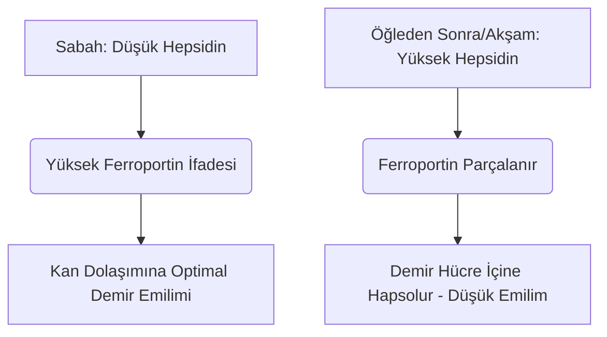

Demir, oksijen taşınması, hücresel solunum ve DNA sentezinde yapısal ve katalitik bir kofaktör olarak işlev gören vazgeçilmez bir mikro besindir. Çevresel bolluğuna rağmen, insan diyetinde sıklıkla büyüme sınırlayıcı bir besin maddesi konumundadır. İnsanlarda aktif demir atılımı için fizyolojik bir mekanizma bulunmadığından, sistemik demir dengesi tamamen bağırsak emilimi seviyesinde korunur.

Diyetteki demir iki ana formda bulunur: **organik (hem formunda)** ve **inorganik (hem formunda olmayan)** demir.

Heme demiri yüksek oranda biyoyararlanımlıdır, genellikle %15 ila %35 oranlarında emilir. Duodenal enterositlerin apikal fırçamsı kenarı boyunca Heme Taşıyıcı Protein 1 (HCP1) aracılığıyla bozulmadan taşınır ve diyetle alınan standart inhibitörlerden korunur.

Buna karşın, non-heme demir (inorganik demir) diyet alımının %80'inden fazlasını oluşturmasına rağmen, %2 ila %20 arasında değişen çok düşük bir emilim profili sergiler.

> [!TIP]
> Fizyolojik pH'ta, non-heme demir ağırlıklı olarak oksitlenmiş, yüksek oranda çözünmeyen ferrik (Fe³⁺) formunda bulunur. Emilişebilmesi için, enterosite Divalent Metal Taşıyıcı 1 (DMT1) yoluyla girmeden önce, apikal redüktaz olan duodenal sitokrom b (Dcytb) tarafından çözünür ferröz (Fe²⁺) durumuna indirgenmesi gerekir.

## Heme ve Non-Heme Demir Kıyaslaması

| Özellik / Metrik | Heme Demiri Yolu | Non-Heme (İnorganik) Demir Yolu |
| :--- | :--- | :--- |
| **Diyet Kaynakları** | Hayvansal dokular (hemoglobin, miyoglobin) | Bitkiler, demirle zenginleştirilmiş gıdalar, mineral tuzları |
| **Apikal Taşıyıcı** | Heme Taşıyıcı Protein 1 (HCP1) | Divalent Metal Taşıyıcı 1 (DMT1) |
| **Gereken Değerlik** | Porfirin bağlı kompleks | Ferröz (Fe²⁺) |
| **Optimal Lümen pH'ı** | Genellikle stabildir; mide pH'ından etkilenmez | Çözünme için yüksek asidik (pH < 3.0) olmalıdır |
| **Tipik Emilim Oranı** | %15 – %35 (yüksek biyoyararlanım) | %2 – %20 (çok değişkendir) |
| **Diyet İnhibitörlerine Hassasiyet**| İhmal edilebilir; porfirin halkası tarafından korunur | Son derece yüksek (fitatlar, polifenoller, kalsiyum tarafından engellenir) |

## Optimal Zamanlama (Kronofarmakoloji)

Non-heme demir emilimini optimize etmek, esas olarak hepatositler tarafından sentezlenen 25 amino asitlik bir peptid hormon olan **hepsidin**'in (hepcidin) günlük ritmiyle hassas bir koordinasyon gerektirir. Hepsidin, bazolateral dışa aktarıcı Ferroportin'e doğrudan bağlanıp parçalanmasını sağlayarak sistemik demir homeostazının ana düzenleyicisi olarak çalışır. Sonuç olarak, dolaşımdaki yüksek hepsidin seviyeleri demiri duodenal enterositlerin içine hapseder ve kan dolaşımına girmesini engeller.

### Hepsidinin Sirkadiyen Ritmi
Temel fizyolojik koşullar altında, hepsidin konsantrasyonları sabahın erken saatlerinde en düşük seviyededir, öğleden sonra istikrarlı bir şekilde yükselerek zirveye ulaşır ve gece boyunca düşer.

Bu sirkadiyen eğri oral demir kinetiğini doğrudan etkiler. Demir takviyelerinin **sabah uygulanması**, mineralin duodenuma enterosit Ferroportin ekspresyonunun en yüksek olduğu zamanda ulaşmasını sağlar. Buna karşılık, öğleden sonra veya akşam dozlaması demiri yüksek bir hepsidin blokajıyla rekabet etmeye zorlar ve fraksiyonel demir emiliminde %37'lik bir düşüşe neden olur.

### Mide Asiditesinin Etkisi
İnorganik demirin biyofiziksel durumu büyük ölçüde mide asidi üretimine bağlıdır. Proton Pompa İnhibitörleri (PPI - mide koruyucular) yoluyla mide asidinin farmakolojik olarak baskılanması bu mikroçevreyi ciddi şekilde bozar, mide pH'ını yükseltir ve çözünür Fe²⁺'nin hızla oldukça çözünmez Fe³⁺'e oksitlenmesine neden olur.

> [!WARNING]
> Oral demir takviyeleri kesinlikle aç karnına — ideal olarak yemekten 1 saat önce veya 2 saat sonra — alınmalı ve asit baskılayıcı mide ilaçlarından kesinlikle ayrı tutulmalıdır.

## Kritik Etkileşimler (Asla Karıştırılmaması Gerekenler)

Oral demirin terapötik etkinliği, çeşitli diyet bileşikleri ve farmasötik ajanlarla eş zamanlı yutulmasıyla kolayca tehlikeye atılır.

### Kalsiyum
Kalsiyum, ister diyet yoluyla (süt, peynir, yoğurt) isterse mineral takviyeleri olarak alınsın, hem Heme hem de Non-Heme demir emiliminin güçlü bir inhibitörüdür. Demir içeren bir öğünle birlikte 500 mg kalsiyum karbonatın birlikte alınması, fraksiyonel demir emilimini %50'den fazla azaltır.

### Tanenler ve Polifenoller
**Siyah çay, yeşil çay, bitki çayları ve kahvede** bulunan polifenoller olağanüstü derecede etkili demir bağlayıcılarıdır. Bu bitkisel kaynaklı bileşikler, duodenal fırçamsı kenarı geçemeyen oldukça kararlı, büyük organometalik kompleksler oluşturmak için ferrik demir ile koordine olurlar. Bir öğüne sadece tek bir fincan kahve veya çay eklemek, non-heme demir emilimini %40 ila %70 oranında azaltabilir.

### Fitik Asit
Fitik asit, tam tahıllar, yemişler ve baklagillerdeki birincil fosfor depolama bileşiğidir. Bitkisel diyetlerde demir biyoyararlanımını sınırlayan en önemli diyet faktörü fitik asit/demir molar oranıdır.

### Çinko ve Magnezyum
Ferröz demir, çinko ve magnezyum, enterosit apikal zarı boyunca (DMT1 gibi) örtüşen taşıma yollarını paylaşırlar. Terapötik demir dozlarında, rekabetçi inhibisyon meydana gelir ve demir taşınmasını önemli ölçüde baskılar. Demir takviyenizi Çinko veya Magnezyum ile birlikte almayın.

### Tiroid İlaçları (Levotiroksin)
Oral demir takviyelerinin levotiroksin (T4) ile birlikte uygulanması ciddi bir ilaç-besin etkileşimine yol açar. Demir, levotiroksin molekülü ile koordine olarak, levotiroksinin oral biyoyararlanımını %20 ila %64 oranında azaltan çözünmeyen bir kompleks oluşturur.

> [!CAUTION]
> Tiroid tedavinizin klinik olarak başarısız olmasını önlemek için, levotiroksin ve demir uygulaması arasında kesinlikle en az 4 saatlik bir ayırma penceresi bırakılmalıdır.

## Nihai Kofaktör: C Vitamini

Askorbik asit (C Vitamini), non-heme demir emiliminin en güçlü arttırıcısıdır ve diyet fitatlarının, polifenollerin ve kalsiyumun inhibitör (engelleyici) etkilerini geçersiz kılma yeteneğine sahiptir.

Bu sinerjik ilişki son derece verimli, ikili bir biyokimyasal mekanizma yoluyla işler:
1. **Termodinamik Açıdan Uygun İndirgeme:** Askorbik asit, çözünmeyen ferrik iyonları (Fe³⁺) hızla, taşımaya hazır olan yüksek oranda çözünür ferröz (Fe²⁺) forma dönüştürür.
2. **Duodenal Şelasyon:** Askorbik asit koruyucu bir kalkan görevi görerek demirin duedonumun alkali ortamına geçerken fitatlara ve polifenollere bağlanmasını engeller.

## Yan Etkiler ve "Gün Aşırı" Dozlama Paradigması

Demir eksikliği anemisini tedavi etmeye yönelik geleneksel yaklaşım (günlük olarak yüksek doz oral demir reçete etmek) ciddi gastrointestinal yan etkiler (mide bulantısı, kabızlık) ve sistemik geri bildirim döngüleri nedeniyle sıklıkla başarısız olur.

Düşük fraksiyonel emilim nedeniyle, standart bir oral demir dozunun %90'a kadarı bağırsakta emilmeden kalır. Bu fazla demir, yüksek derecede toksik hidroksil radikalleri oluşturmak üzere hidrojen peroksit ile reaksiyona girerek oksidatif strese ve mukozal inflamasyona neden olur.

Dahası, günlük yüksek demir takviyeleri sistemik bir **"Mukozal Blokaj"** tetikler. 60 mg veya üzeri oral demir dozu yutulması, serum hepsidininde 24 saat boyunca yüksek kalan hızlı bir artışa neden olur. Ertesi gün ikinci bir demir dozu uygulanırsa, enterositlerin portal dolaşıma aktarması fiziksel olarak engellenir. Demir hapsolur ve nihayetinde dışkıyla atılır.

> [!TIP]
> **Gün Aşırı Dozlama:** Bu hepsidin aracılı bloğu aşmak için, modern hematoloji, oral demirin **gün aşırı (her iki günde bir)** uygulanmasına doğru kaymıştır. Klinik araştırmalar, demirin her 48 saatte bir alınmasının, ardışık günlük dozlamaya kıyasla fraksiyonel demir emilimini %40 ila %50 oranında artırdığını ve GI yan etkilerini büyük ölçüde azalttığını kanıtlamaktadır.

### Klinik Protokol Özeti

*   **Düşük Mide pH'ı Şarttır:** Demiri su ile aç karnına alın.
*   **Temel Diyet İnhibitörlerinden Kaçının:** Demiri kesinlikle kalsiyum, süt ürünleri, kahve veya çay ile birlikte almaktan kaçının.
*   **İlaç Aralığını Sıkı Tutun:** Demir ve levotiroksini en az 4 saat ayırın.
*   **C Vitamininden Faydalanın:** Demirin C Vitamini ile birlikte alınması emilimi %300'e kadar artırır.
*   **Gün Aşırı Dozlamayı Benimseyin:** Hepsidin kaynaklı mukozal tıkanıklığı önlemek ve emilimi en üst düzeye çıkarmak için oral demir dozlarını 48 saat arayla alın.
