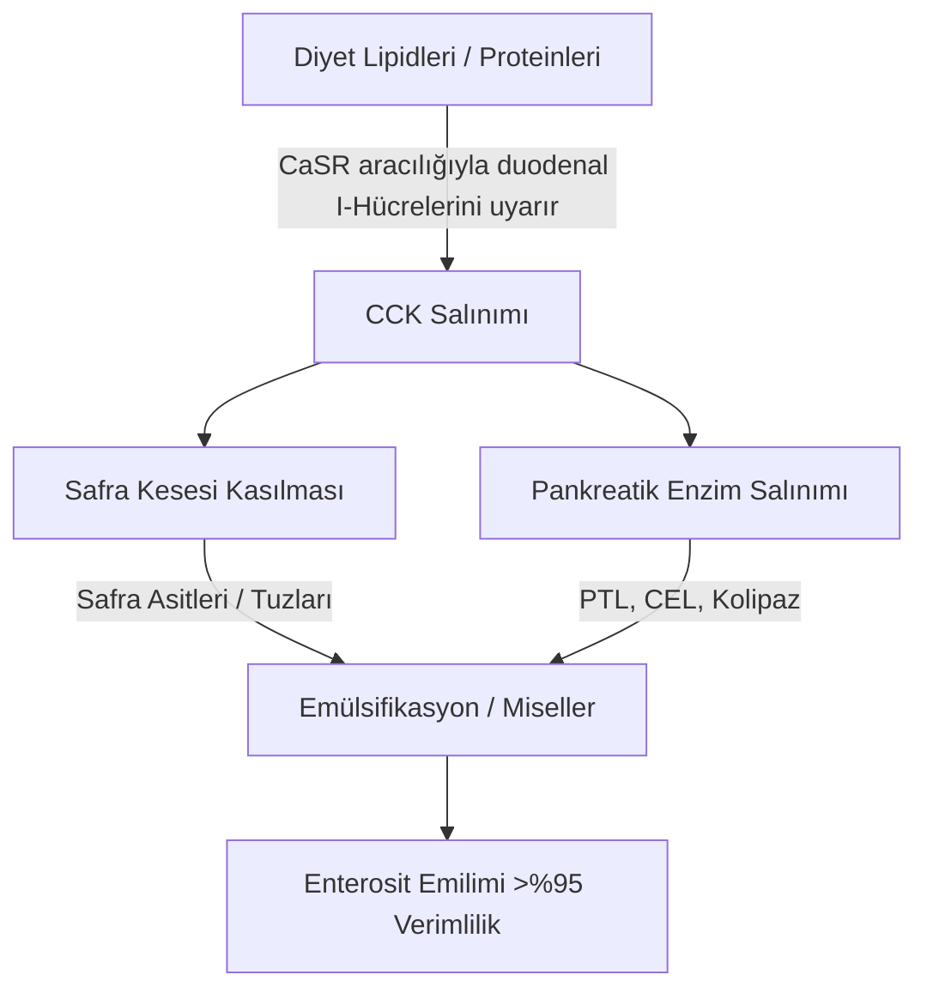
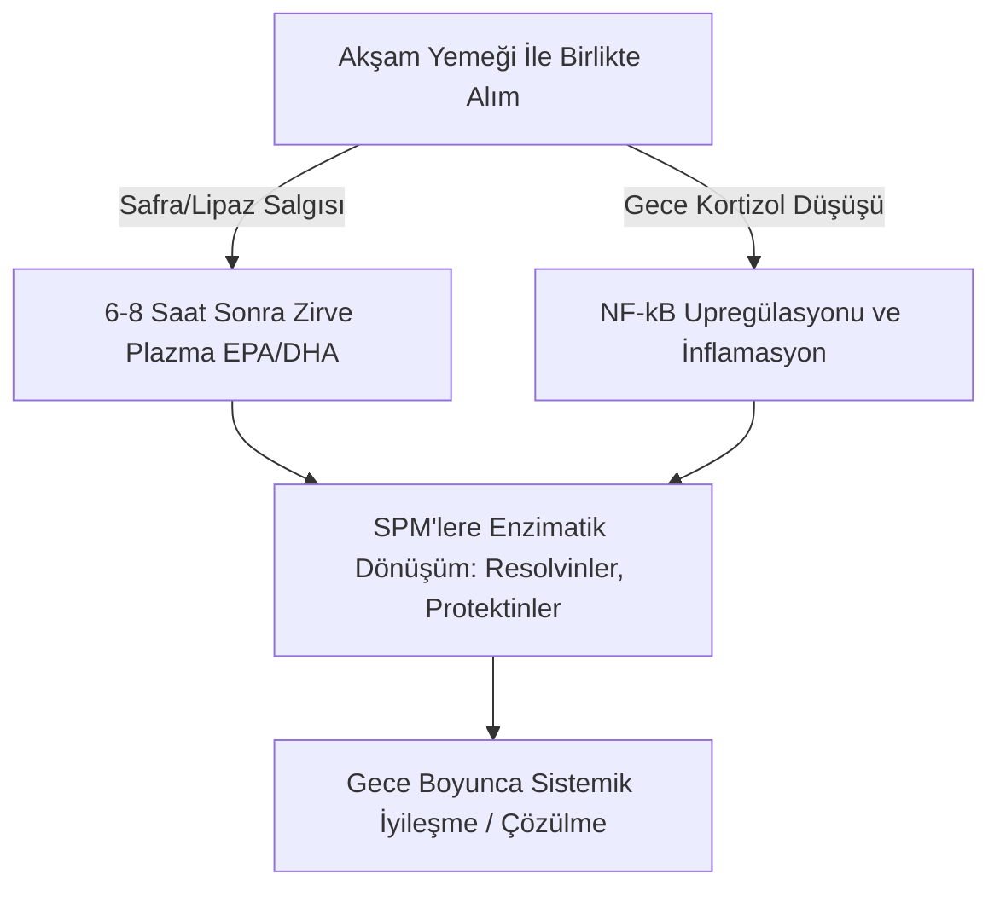

Uzun zincirli deniz kaynaklı omega-3 çoklu doymamış yağ asitlerinin ($\text{PUFAs}$), özellikle eikosapentaenoik asit ($\text{EPA}$) ve dokosahekzaenoik asitin ($\text{DHA}$) terapötik etkinliği, tamamen bağırsaklardaki biyoyararlanımlarına (bioavailability) bağlıdır. Klinik beslenmede, terapötik başarısızlığın ana kaynaklarından biri "yağsız öğün paradoksu"dur; yani son derece hidrofobik deniz lipidlerinin açlık durumunda veya yağsız öğünlerle birlikte uygulanması. Yüksek dozlarda alınmasına rağmen, lipidlerin birlikte sindirildiği yapısal bir matrisin olmaması, insan gastrointestinal sisteminin sulu (aqueous) ortamında lipid emilimi için gereken fiziksel ve enzimatik mekanizmaları engeller. Bu klinik analiz, $\text{EPA}$ ve $\text{DHA}$'nın sindirimini ve emilimini yöneten biyofiziksel, biyokimyasal ve kronofarmakolojik ilkeleri detaylandırmaktadır.

## Açlık ve Yağsız Öğün Paradoksu

Gastrointestinal sistem (mide-bağırsak kanalı) temel olarak su bazlı bir sistemdir. Standart balık yağları gibi hidrofobik lipidler yutulduğunda, mide ve bağırsak sıvılarının oldukça polar (kutuplu) ortamıyla karşılaşırlar. Termodinamik yasalarına göre hidrofobik moleküller suyla temaslarını en aza indirerek hızlı bir faz ayrışmasına yol açar. Bu, yutulan yağın sulu mide kimusunun üzerinde yüzen büyük, bölünmemiş lipid kürecikleri halinde birleşmesine neden olur.

Aç karnına veya sadece karbonhidrat içeren bir öğünle (örneğin bir parça meyve veya bir dilim kuru ekmek) bir bardak su ile bir omega-3 kapsülü patlatmak, bu faz ayrışmasının üstesinden gelmek için gereken fizyolojik süreçleri tetiklemekte başarısız olur. Fiziksel emülsifikasyon olmadan, lipid fazının hacim-yüzey alanı oranı son derece düşük kalır. Pankreatik lipazların hidrofilik aktif bölgeleri, bu büyük, hidrofobik damlacıkların içine gömülmüş ester bağlarına erişemez. Sonuç olarak, balık yağı ile birlikte su içmek emilime yardımcı olmaz; aksine açlık durumunda bulunan az miktardaki sindirim enzimlerini daha da seyrelterek, emülsifiye olmamış lipid küreciklerini enterosit (bağırsak hücresi) fırçamsı kenar zarından uzaklaştırır, malabsorbsiyona (emilim bozukluğu) ve gastrointestinal rahatsızlıklara yol açar.

Bu oldukça hidrofobik lipidlerin bağırsak mukozasının hareketsiz su katmanını (unstirred water layer) geçebilmeleri için, termodinamik olarak stabil, suda dağılabilen bir faza dönüştürülmeleri gerekir. Bu dönüşüm tamamen hormon aracılı duodenal sinyallemenin başlattığı miselleşme (micellarization) fizikokimyasına bağlıdır.

## Safra Tuzları ve Misel (Micelle) Oluşumu

Yüzen, hidrofobik bir yağ kütlesinden emilebilir mikro-damlacıklara geçiş, onikiparmak bağırsağında (duodenum) koordineli bir nöromüsküler ve salgı kaskadı gerektirir. Bu sürecin birincil hormonal itici gücü, onikiparmak bağırsağı ve üst jejunumun mukoza astarındaki enteroendokrin I-hücreleri tarafından sentezlenen ve salgılanan 33 amino asitli bir peptit olan kolesistokinindir ($\text{CCK}$).



Fizyolojik koşullar altında, onikiparmak bağırsağı lümeninde uzun zincirli yağ asitlerinin ve kısmen sindirilmiş proteinlerin varlığı I-hücrelerindeki kalsiyum algılayıcı reseptörü ($\text{CaSR}$) uyararak $\text{CCK}$'nin kan dolaşımına hızlı ekzositozunu tetikler. Serbest bırakıldıktan sonra $\text{CCK}$, safra kesesi duvarındaki $\text{CCK}_A$ reseptörlerine bağlanarak kasılmasına neden olurken, aynı anda Oddi sfinkterini gevşetir ve pankreatik asiner hücreleri sindirim enzimlerini serbest bırakmaları için uyarır.

Safra kesesinden salınan safra asitleri - öncelikle kolik ve kenodeoksikolik asitlerin amfipatik sodyum tuzları - temel biyolojik deterjanlardır. Onikiparmak bağırsağındaki safra asidi konsantrasyonları kritik misel konsantrasyonunu ($\text{CMC}$) aştığında, kendilerini hidrofobik lipid damlacıklarının etrafında düzenlerler. Safra tuzunun hidrofobik steroid çekirdeği lipid fazıyla ilişki kurarken, polar, hidrofilik konjuge grup (glisin veya taurin) sulu duodenal lümene bakar.

Bağırsak peristaltizminin mekanik etkisi sayesinde safra kaplı bu damlacıklar parçalanarak karma (mixed) misellere dönüşür. Bu küresel kolloidal kümelerin çapı sadece 3 ila 10 nanometredir ve pankreatik lipazlara maruz kalan lipid yüzey alanını birkaç bin kat arttırır. $\text{CCK}$ salınımı eşiğini tetiklemek için sağlıklı diyet yağları (örneğin sızma zeytinyağı, avokado veya mera yumurtası sarısı) birlikte alınmazsa safra kesesi kasılması gerçekleşmez. Bu durumda safra asidi seviyeleri $\text{CMC}$'nin altında kalır, pankreatik lipaz salınımı minimumdur ve alınan omega-3 lipidleri misel oluşturamaz, bu da emilimi önler.

## Biyokimyasal Formların Savaşı: TG vs. EE vs. PL

Ticari olarak satılan omega-3 takviyeleri üç ana moleküler formda bulunur: doğal veya yeniden esterlenmiş trigliseritler ($\text{TG}$/$\text{rTG}$), etil esterler ($\text{EE}$) ve fosfolipidler ($\text{PL}$). Bu taşıyıcıların moleküler yapısı sindirim hızlarını, lipaza olan bağımlılıklarını ve biyoyararlanımlarını belirler.

```text
Trigliserit (TG) Formu:            Etil Ester (EE) Formu:         Fosfolipid (PL) Formu:
     ┌─ Gliserol Omurgası               ┌─ Etanol Molekülü             ┌─ Fosfat Başı (Polar)
     ├─ Yağ Asidi (EPA)                 └─ Yağ Asidi (EPA)             ├─ Yağ Asidi (EPA)
     ├─ Yağ Asidi (DHA)                                                └─ Yağ Asidi (DHA)
     └─ Yağ Asidi (Diğer)
```

Doğal ve yeniden esterlenmiş trigliseritlerde ($\text{TG}$/$\text{rTG}$), üç yağ asidi ($\text{EPA}$/$\text{DHA}$) üç karbonlu bir gliserol omurgasına bağlıdır. Sindirim sırasında, kofaktörü kolipazın yanında hareket eden pankreatik trigliserit lipaz ($\text{PTL}$), $sn\text{-}1$ ve $sn\text{-}3$ pozisyonlarındaki ester bağlarını hidrolize eder. Bu, her ikisi de yüksek oranda polar, kolayca misellenebilen ve enterositler tarafından %95'in üzerinde bir verimlilikle kolayca emilen iki serbest yağ asidi ve bir $sn\text{-}2$-monogliserit üretir.

Tersine, etil ester ($\text{EE}$) formu kimyasal konsantrasyon sırasında oluşturulan sentetik bir üründür. Gliserol omurgası çıkarılır ve her bir yağ asidi bir etanol molekülüne ($\text{CH}_3\text{CH}_2\text{OH}$) esterlenir. Bu sentetik ester bağı insan pankreas enzimlerine karşı oldukça dirençlidir. İn vitro ve in vivo çalışmalar, insan pankreatik lipazının $\text{EE}$'deki yağ asidi-etanol bağını, trigliseritlerdeki gliseril ester bağlarına göre 10 ila 50 kat daha yavaş bir oranda hidrolize ettiğini göstermektedir.

Bu yavaş hidroliz nedeniyle, $\text{EE}$ emilimi sadece yüksek yağlı bir öğünle tetiklenen pankreatik lipazların ve safra tuzlarının büyük miktarda salınımına son derece bağımlıdır. Düşük yağlı bir diyette alındığında, mevcut sınırlı pankreatik lipaz $\text{EE}$ bağlarını etkili bir şekilde kesemez, bu da düşük biyoyararlanıma (genellikle yaklaşık %20'ye düşer) yol açar ve emilmeyen sentetik esterlerin kolona geçerek mide-bağırsak rahatsızlıklarına (gaz, ishal vb.) neden olmasına yol açar.

Ağırlıklı olarak Antarktika kril yağından (Euphausia superba) elde edilen fosfolipid ($\text{PL}$) formu, $\text{EPA}$ ve $\text{DHA}$'nın bir fosfatidilkolin omurgasına bağlı olduğu amfipatik bir yapıya sahiptir. Yüksek polar fosfat baş grubu fosfolipidleri doğal olarak suda dağılabilir hale getirir. Bu nedenle, $\text{PL}$ formları gastrointestinal sistemde kendi kendini emülsifiye edebilir (self-emulsifying) ve safra tuzlarıyla uyarılan miselleşme ihtiyacını tamamen atlayarak spontane mikro-damlacıklar oluşturabilir. Fosfolipidler ayrıca fosfolipaz $\text{A}_2$ yoluyla sindirilir ve açlık veya düşük yağ koşullarında bile yüksek biyoyararlanım sağlayarak lizofosfolipidler olarak doğrudan enterositler tarafından emilebilir.

| Biyokimyasal Form | Moleküler Taşıyıcı / Omurga | Ortalama Emilim Oranı (Düşük Yağlı Öğün) | Ortalama Emilim Oranı (Yüksek Yağlı Öğün) | Göreceli Biyoyararlanım (EE Tabanına Göre) | Pankreatik Lipaz Bağımlılığı |
| --- | --- | --- | --- | --- | --- |
| Etil Ester (EE) | Etanol ($\text{CH}_3\text{CH}_2\text{OH}$) | $\approx \%20$ | $\approx \%60$ | Taban (%100) | Mutlak; TG'den 10-50 kat daha yavaş hidrolize olur |
| Trigliserit (TG / rTG) | Gliserol Omurgası | $\approx \%68$ | $\approx \%90$ | $\%124$ ila $\%186$ | Yüksek; hızla 2-FFA ve 1-MAG'a bölünür |
| Fosfolipid (PL) | Fosfatidilkolin | $\approx \%80$ ila $\%95$ | $>\%95$ | $\%168$ ila $\%500$ | Minimal; kendi kendini emülsifiye eder, bazı lipazları atlar |

> [!WARNING]
> Ekzokrin pankreatik yetmezliği (EPI), biliyer diskinezisi olan veya kolesistektomi (safra kesesinin alınması) ameliyatı geçirmiş kişilerde endojen lipid sindirimi ciddi şekilde tehlikeye girmiştir. Bu klinik popülasyonlar için, düşük yağlı diyet kısıtlamaları altında sentetik etil ester (EE) formülasyonlarının uygulanması, gerekli enzimatik bölünme bu durumlarda neredeyse var olmadığı için tam malabsorbsiyon (emilim bozukluğu) ve gastrointestinal rahatsızlık açısından yüksek risk oluşturur.

## Lipid Oksidasyonu ve E Vitamininin Mutlak Gerekliliği

$\text{EPA}$ ve $\text{DHA}$'yı biyolojik olarak aktif hale getiren yapısal özellikler aynı zamanda onları oldukça kararsız (unstable) hale getirir. $\text{EPA}$'da beş ve $\text{DHA}$'da altı metilen kesintili çift bağ bulunur. Bis-alilik metilen karbonlarındaki ($\text{-CH=CH-CH}_2\text{-CH=CH-}$) karbon-hidrojen bağları düşük bağ ayrışma enerjilerine sahiptir. Bu durum onları serbest radikal saldırılarına ve enzimatik olmayan lipid peroksidasyonuna (oksitlenme/bozulma) karşı son derece savunmasız bırakır.

```text
Faz 1: Başlama (Initiation)
  [PUFA Karbon-Hidrojen Bağı] + [ROS / Serbest Radikal] ──> [Karbon Merkezli Lipid Radikali (R•)]

Faz 2: İlerleme (Propagation)
  [Karbon Merkezli Lipid Radikali (R•)] + [O2] ──> [Lipid Peroksil Radikali (ROO•)]
  [Lipid Peroksil Radikali (ROO•)] + [Oksitlenmemiş PUFA] ──> [Lipid Hidroperoksit (ROOH)] + [Yeni Lipid Radikali (R•)]

Faz 3: Bozunma (Decomposition)
  [Kararsız Lipid Hidroperoksit (ROOH)] ──> [Toksik Aldehitler (MDA / HHE)]
```

Balık yağı yutulduğunda $37^\circ\text{C}$ sıcaklığa (vücut ısısı), mide asitlerine ve çözünmüş moleküler oksijene ($\text{O}_2$) maruz kalır. Bu ortam lipid peroksidasyon kaskadını üç farklı aşamada hızlandırır:

1. **Başlama (Initiation):** Reaktif oksijen türleri ($\text{ROS}$) bis-alilik bir karbondan bir hidrojen atomunu soyarak karbon merkezli bir lipid radikali ($\text{R}^\bullet$) oluşturur.
2. **İlerleme (Propagation):** Lipid radikali moleküler oksijen ($\text{O}_2$) ile hızla reaksiyona girerek bir lipid peroksil radikali ($\text{ROO}^\bullet$) oluşturur. Bu peroksil radikali daha sonra bitişik oksitlenmemiş bir $\text{PUFA}$ molekülünden bir hidrojen atomu çalarak bir lipid hidroperoksit ($\text{ROOH}$) ve yeni bir lipid radikali oluşturur ve zincirleme reaksiyonu sürdürür.
3. **Bozunma (Decomposition):** Kararsız lipid hidroperoksitleri, malondialdehit ($\text{MDA}$) ve 4-hidroksiheksenal ($\text{HHE}$) gibi alkenaller dahil olmak üzere oldukça reaktif, sitotoksik ikincil oksidasyon ürünlerine ayrışır.

Bu ikincil oksidasyon ürünleri bağırsak yoluyla kolayca emilir, şilomikronlara ve düşük yoğunluklu lipoproteinlere ($\text{LDL}$) dahil edilir ve sistemik oksidatif stresi, endotel hasarını ve aterogenezi (damar sertliği) tetikleyebilir.

Bu süreci durdurmak için zincir kırıcı, lipidde çözünen bir antioksidanın formülasyona eklenmesi gerekir. Doğal E vitamini, özellikle d-alfa-tokoferol ($\text{C}_{29}\text{H}_{50}\text{O}_2$), bu rol için oldukça optimize edilmiştir. D-alfa-tokoferol bir hidrojen vericisi olarak hareket eder ve fenolik hidrojen atomunu yaklaşık $10^6\,\text{M}^{-1}\text{s}^{-1}$ gibi son derece hızlı bir oran sabitiyle reaktif lipid peroksil radikaline ($\text{ROO}^\bullet$) hızla aktarır.

Ortaya çıkan tokoferoksil radikali, eşleşmemiş elektronunun kromanol halkası boyunca rezonans delokalizasyonu nedeniyle oldukça kararlıdır ve bitişik yağ asidi zincirlerine saldırmasını önler. Bu durum zincirleme reaksiyonu durdurur, $\text{EPA}$ ve $\text{DHA}$ moleküllerinin yapısal bütünlüğünü korur, böylece hedef dokulara aktif, oksitlenmemiş (bozulmamış) halde ulaşabilirler.

## Kronofarmakoloji ve Gece Anti-İnflamatuar Penceresi

Lipid biyokimyasında zamanlama kritik bir faktördür. Omega-3 takviyelerinin günün en büyük, lipid (yağ) açısından en yoğun öğünüyle (genellikle akşam yemeği) birlikte alınması hem emilimi hem de vücudun doğal gece iyileşme süreçlerini optimize eder.



Birincisi, akşam yemeği tarihsel olarak birçok kişi için günün en çok yağ içeren öğünüdür. Bu, maksimum $\text{CCK}$ salınımını tetiklemek için gereken fiziksel lipid hacmini sağlayarak güçlü safra kesesi kasılmasına, zengin safra salgısına ve yüksek pankreatik lipaz aktivitesine yol açar. Bu da miselleşme ve sindirim kinetiğini optimize ederek alınan dozun neredeyse tamamının başarıyla emilmesini sağlar.

İkincisi, akşam dozu vücudun sirkadiyen bağışıklık ve inflamatuar (iltihap) döngüleriyle uyumludur. Endojen kortizol seviyeleri akşam geç saatlerde ve gece erken saatlerde doğal olarak en düşük diürnal (günlük) seviyelerine iner. Kortizol güçlü bir anti-inflamatuar hormondur; seviyeleri düştüğünde, pro-inflamatuar transkripsiyon faktörü $\text{NF}\text{-}\kappa\text{B}$ tarafından yönetilenler gibi sistemik inflamatuar yollar nispi bir "upregülasyon" yaşar (yani iltihaplanmaya eğilim artar).

Omega-3'lerin akşam yemeğiyle birlikte alınmasıyla, en yüksek (zirve) plazma ve hücresel zar $\text{EPA}$ ve $\text{DHA}$ konsantrasyonlarına 6 ila 8 saat sonra ulaşılır ve bu doğrudan geceki bu inflamatuar pencereyle örtüşür. Bu aşamada vücut, bu yağ asitlerini siklooksijenaz ($\text{COX}$) ve lipoksijenaz ($\text{LOX}$) yolları aracılığıyla "Özelleşmiş Çözümleyici Mediatörlerin" ($\text{SPMs}$) - özellikle resolvinler, protektinler ve maresinlerin - enzimatik sentezi için substrat olarak kullanır. Bu $\text{SPM}$'ler uyku sırasında kronik mikro-inflamasyonları aktif olarak çözer, hücresel yenilenmeyi destekler ve doku iyileşmesini sağlar.

Buna ek olarak, omega-3'lerin, özellikle de $\text{DHA}$'nın akşam saatlerinde alınması benzersiz nörolojik faydalar sağlar. $\text{DHA}$, nöron zarlarında kilit bir yapısal lipiddir ve beynin sirkadiyen saatinde (iç saat) önemli bir rol oynar. Uyku-uyanıklık döngüsünü düzenlemekten sorumlu olan saat genleri (BMAL1 ve CLOCK gibi) üzerinde etki gösterir.

$\text{DHA}$'nın sinaptik zarlara gece boyu entegre olması nöronal iletişimi destekler, serotonin sentezini arttırır ve melatonine dönüşümünü optimize eder. Klinik araştırmalar, tutarlı akşam omega-3 takviyesinin uyku verimliliğini (kalitesini) önemli ölçüde iyileştirdiğini, uykuya dalma süresini kısalttığını ve uyku bölünme indeksini (gece uyanmalarını) azalttığını göstermektedir.

> [!TIP]
> Uzun zincirli omega-3 yağ asitlerinin hücresel biyolojik birikimini (emilimini) en üst düzeye çıkarmak için, klinisyenler hastalarına günlük dozlarını günün en yağlı öğünüyle birlikte uygulamalarını önermelidir. Optimal miselleşme için gerekli kolesistokinin salınımı eşiğini tetiklemek üzere, en az 10-15 gram sağlıklı tekli doymamış veya çoklu doymamış yağ (örn. sızma zeytinyağı veya avokado) ile birlikte alınması yeterlidir.

## Klinik Sentezler ve Uygulanabilir Öneriler

Omega-3 takviyesinin terapötik potansiyelini maksimize etmek, yüksek nominal dozda (kağıt üzerinde yüksek mg yazan) kapsüllerin basitçe yutulmasından uzaklaşmayı ve lipid biyokimyası ile sindirim kinetiğine dayalı bir yaklaşıma geçmeyi gerektirir. Geleneksel olarak balık yağını aç karnına suyla alma uygulaması genellikle zayıf emilime ve gastrointestinal yan etkilere yol açar.

En iyi terapötik sonuçlar için klinisyenler, üstün emilim kinetiği gösteren ve yüksek yağlı öğünlere sentetik etil esterlerden ($\text{EE}$) daha az bağımlı olan, yeniden esterlenmiş trigliserit ($\text{rTG}$) veya fosfolipid ($\text{PL}$) formülasyonlarına öncelik vermelidir.

Hangi formülasyon seçilirse seçilsin, takviye kesinlikle en az 10 ila 15 gram diyet yağı (sağlıklı yağlar) içeren bir öğünle birlikte alınmalıdır. Bu yağ (lipid) eşiği, safra kesesi kasılmasını ve tam miselleşmeye izin verecek pankreatik lipaz salgısını başlatan duodenal $\text{CCK}$ sinyal kaskadını tetiklemek için gereklidir.

Ayrıca, oldukça kararsız olan bu PUFA'ları vücut içindeki oksidatif (bozulma) hasarlardan korumak için, formülasyonun her zaman d-alfa-tokoferol gibi doğal, lipidde çözünen bir antioksidan (E Vitamini) içermesine dikkat edilmelidir.

Sonuç olarak, takviyenin akşam yemeğiyle uyumlu hale getirilmesi (akşam yemeğinden hemen sonra veya yemek sırasında alınması), zirve emilimin vücudun doğal gece anti-inflamatuar ve hücresel onarım yollarıyla örtüşmesini sağlayarak, $\text{EPA}$ ve $\text{DHA}$'nın kalp-damar, bağışıklık ve nörolojik faydalarını maksimize eder.

## Kaynaklar

1. Nordøy A, et al. [Absorption of the n-3 eicosapentaenoic and docosahexaenoic acids as ethyl esters and triglycerides by humans](https://pubmed.ncbi.nlm.nih.gov/1826985/). *American Journal of Clinical Nutrition.* 1991.
2. Offman E, Marenco T, Ferber S, Johnson J, Kling D, Curcio D, Davidson M. [Steady-state bioavailability of prescription omega-3 on a low-fat diet is significantly improved with a free fatty acid formulation compared with an ethyl ester formulation: the ECLIPSE II study](https://pubmed.ncbi.nlm.nih.gov/24124374/). *Vascular Health and Risk Management.* 2013.
3. Schuchardt JP, Schneider I, Meyer H, Neubronner J, von Schacky C, Hahn A. [Incorporation of EPA and DHA into plasma phospholipids in response to different omega-3 fatty acid formulations - a comparative bioavailability study of fish oil vs. krill oil](https://pubmed.ncbi.nlm.nih.gov/21854650/). *Lipids in Health and Disease.* 2011.
4. Brown JE, Wahle KW. [Effect of fish-oil and vitamin E supplementation on lipid peroxidation and whole-blood aggregation in man](https://pubmed.ncbi.nlm.nih.gov/2282693/). *Clinica Chimica Acta.* 1990.

*Bu makale yalnızca bilgilendirme amaçlıdır ve tıbbi tavsiye niteliği taşımaz. Takviye veya ilaç rutininizi değiştirmeden önce yetkin bir sağlık uzmanına danışın.*
