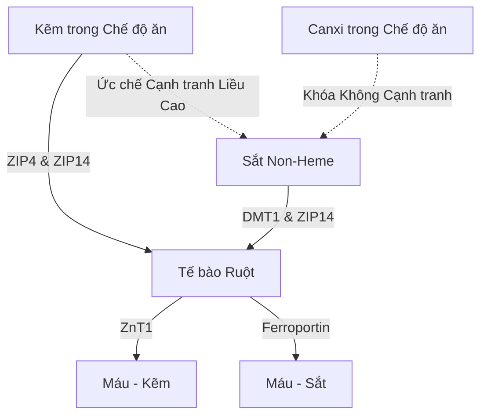

Việc uống kẽm bổ sung ($\text{Zn}^{2+}$) mang đến một loạt các nghịch lý sinh lý học và hóa sinh. Mặc dù kẽm là một khoáng chất vi lượng thiết yếu tham gia vào hơn 300 phản ứng enzym, việc uống kẽm thường bị cản trở bởi các cơn đau dạ dày - ruột cấp tính, sự ức chế cạnh tranh bởi các cation hóa trị hai khác, và sự suy giảm khoáng chất toàn thân. Việc giải quyết những vấn đề này đòi hỏi sự hiểu biết sâu sắc về động học của các chất vận chuyển đường ruột, hóa sinh niêm mạc và thời gian dược lý học (chronopharmacology) để thiết kế các phác đồ dùng thuốc tối ưu.

## Nghịch lý Bụng Đói: Kích ứng Niêm mạc và Sinh khả dụng

Kẽm uống đường miệng đưa ra một lựa chọn khó khăn: uống khi bụng đói tối đa hóa khả năng hấp thu của tế bào nhưng thường gây ra đau dạ dày (buồn nôn dữ dội). Ngược lại, uống kẽm cùng bữa ăn giúp giảm bớt sự khó chịu, nhưng lại đưa vào các chất đối kháng (chất ức chế) trong chế độ ăn uống, làm giảm đáng kể khả năng hấp thu.

### Cơ chế Phân tử của Kích ứng Dạ dày và Buồn nôn
Uống các loại muối kẽm vô cơ tan nhiều trong nước—như kẽm sulfate ($\text{ZnSO}_4$) hoặc kẽm chloride ($\text{ZnCl}_2$)—dẫn đến sự hòa tan nhanh chóng trong lòng dạ dày. Trong dung dịch nước, các muối này phân ly hoàn toàn, tạo ra một môi trường axit cục bộ đậm đặc với độ pH từ khoảng 4.0 đến 5.0.

Trong tình trạng nhịn ăn, sự vắng mặt của thức ăn khiến niêm mạc dạ dày không có lớp đệm bảo vệ. Việc tiếp xúc đột ngột với các ion kẽm tự do ($\text{Zn}^{2+}$) gây ra tác động ăn mòn và kích ứng trực tiếp lên các tế bào biểu mô dạ dày. Sự kích ứng cục bộ này kích thích các tế bào thành dạ dày tăng tiết axit clohydric (HCl), làm giảm thêm độ pH dạ dày và gây xói mòn niêm mạc.

Cảm giác kích ứng hóa học và axit này được phát hiện bởi mạng lưới rộng lớn các tế bào thần kinh cảm giác phế vị (vagal) phân bố ở thành dạ dày. Khi được kích hoạt, các tế bào thần kinh này truyền điện thế hoạt động lên não bộ. Điều này gây ra phản xạ nôn, biểu hiện là buồn nôn ngay lập tức, chậm làm rỗng dạ dày và co thắt dạ dày trong vòng 30 phút sau khi uống.

### Cản trở Sinh khả dụng: Phytate, Ngũ cốc và Sữa

Khi uống kẽm cùng thức ăn để ngăn ngừa kích thích phế vị (buồn nôn), sinh khả dụng của nó bị suy giảm nghiêm trọng bởi các chất ức chế trong chế độ ăn uống. Chất ức chế mạnh nhất là **Axit phytic** (phytate), tập trung cao ở lớp vỏ ngoài của ngũ cốc nguyên cám, các loại đậu, hạt.

Ở độ pH sinh lý của tá tràng, axit phytic hoạt động như một chất liên kết mạnh mẽ (chelate) các ion $\text{Zn}^{2+}$ tự do, tạo thành các kết tủa phức hợp ổn định, không hòa tan, hoàn toàn không thể hấp thụ qua ruột. Vì con người không có enzyme phytase trong đường tiêu hóa trên, các phức hợp kẽm-phytate này không bị thủy phân và bị bài tiết qua phân.

> [!CAUTION]
> Các nghiên cứu định lượng chỉ ra rằng việc thêm chỉ 50 mg phytate vào bữa ăn sẽ làm giảm khoảng 36% khả năng hấp thu kẽm (giảm từ 22% xuống 14%). Nồng độ phytate cao hơn (250 mg) sẽ ức chế hoàn toàn sự hấp thu.

Hơn nữa, các sản phẩm từ sữa có tác dụng ức chế độc lập. **Casein**, thành phần protein chính trong sữa bò, liên kết với các ion kẽm trong lòng ruột, làm giảm đáng kể khả năng hấp thu so với các công thức dựa trên whey protein.

### Các Dạng Kẽm và Khả năng Dung nạp

| Lớp Hóa học | Dạng Kẽm | Tỷ lệ Hấp thu | Khả năng Dung nạp Dạ dày | Cơ chế Hoạt động |
| :--- | :--- | :--- | :--- | :--- |
| **Muối Vô cơ** | Kẽm Sulfate ($\text{ZnSO}_4$) | ~20–49.9% | Kích ứng Cao (~15% buồn nôn) | Phân ly nhanh thành $\text{Zn}^{2+}$ tự do; pH axit. |
| **Muối Hữu cơ** | Kẽm Gluconate | ~50.6–71.7% | Dung nạp Trung bình (~5% buồn nôn) | pH trung tính; phân ly chậm giảm thiểu kích ứng. |
| **Chelate Hữu cơ**| Kẽm Bisglycinate | ~50–60% | Dung nạp Rất Cao (< 5% buồn nôn) | Liên kết với glycine; chống lại sự phân ly dạ dày và phytate. |

### Phác đồ Tránh Nôn Tối ưu theo Khoa học

Để hoàn toàn tránh cả phản xạ buồn nôn khi bụng đói và sự cản trở hấp thu của phytate, phải sử dụng một phác đồ lâm sàng cụ thể:

1. **Chuyển sang Chelate Hữu cơ:** Thay thế muối kẽm vô cơ bằng các chelate axit amin-kim loại hữu cơ có độ pH trung tính, chẳng hạn như Kẽm Bisglycinate. Các ion kẽm được liên kết đồng hóa trị với hai phối tử glycine, bảo vệ khoáng chất khỏi sự phân ly sớm trong axit dạ dày.
2. **Bữa ăn Đệm Ít Chất Đối kháng:** Nếu người bệnh cực kỳ nhạy cảm và bắt buộc phải dùng kèm thức ăn, kẽm chỉ nên được uống cùng một bữa ăn nhẹ hoàn toàn không có phytate và canxi liều cao. Thức ăn cho phép bao gồm bánh mì trắng lên men tự nhiên (sourdough - quá trình lên men phá vỡ phytate) hoặc protein động vật đơn giản (trứng hoặc whey isolate).

> [!TIP]
> **Mẹo Chuyên gia:** Để tối đa hóa khả năng hấp thu trong khi hoàn toàn tránh được buồn nôn, phác đồ lý tưởng là uống 15–30 mg Kẽm Bisglycinate với một bữa ăn nhẹ không có phytate vào đầu giờ chiều, đảm bảo nhịn ăn 2 giờ (bao gồm cả cà phê và trà) trước và sau khi uống.

## Cuộc chiến của các Chất Vận chuyển: DMT1 và ZIP14

Tế bào ruột (enterocyte) của ruột non hoạt động như một đấu trường cạnh tranh khốc liệt đối với sự hấp thu các kim loại hóa trị hai. Kẽm ($\text{Zn}^{2+}$), sắt non-heme ($\text{Fe}^{2+}$) và canxi ($\text{Ca}^{2+}$) có chung các con đường vận chuyển có thể bão hòa. Điều này có nghĩa là việc dùng chung các chất bổ sung liều cao sẽ ức chế trực tiếp sự hấp thu của mỗi khoáng chất.

### Các Chất Vận chuyển: ZIP4, ZIP14 và DMT1
Ở màng đỉnh của tế bào ruột tá tràng, kênh vận chuyển chính đối với kẽm trong chế độ ăn là ZIP4. Sắt non-heme (sắt vô cơ/thực vật) phụ thuộc vào một con đường khác: DMT1. Tuy nhiên, có một chất vận chuyển quan trọng khác là ZIP14; mặc dù được phân loại là chất vận chuyển kẽm, nó cũng có khả năng vận chuyển sắt ($\text{Fe}^{2+}$) rất cao.

Khi dùng liều sắt điều trị (100–400 mg) đồng thời với kẽm, sắt sẽ đánh bại kẽm trong việc hấp thu vào tế bào. Nghiên cứu lâm sàng chứng minh rằng dùng đồng thời liều cao sắt với liều kẽm tiêu chuẩn 25 mg làm giảm khoảng 40–50% tỷ lệ hấp thu kẽm.

## Nguy cơ Suy giảm Đồng: Mắc kẹt trong Tế bào Ruột

Một nguy cơ lớn của việc bổ sung kẽm liều cao trong thời gian dài là sự phát triển âm thầm của tình trạng thiếu hụt đồng toàn thân. Con đường này được trung gian bởi sự điều hòa tăng lên của **metallothionein**—một loại protein liên kết kim loại nội bào trong các tế bào ruột.

Khi một cá nhân tiêu thụ liều cao kẽm (> 40–50 mg/ngày) trong một thời gian dài, sự tràn vào của kẽm tế bào hoạt động như một tín hiệu mạnh mẽ kích hoạt quá trình tổng hợp lượng lớn metallothionein. Mặc dù sự tổng hợp của nó được thúc đẩy bởi mức kẽm, protein này có ái lực liên kết với đồng ($\text{Cu}^+$) cao hơn đáng kể so với kẽm.

Do đó, khi đồng trong chế độ ăn được hấp thu vào tế bào ruột, các phân tử metallothionein dồi dào sẽ nhanh chóng liên kết và cô lập các ion đồng. Lượng đồng này bị kẹt lại trong phức hợp cực kỳ ổn định và không thể xâm nhập vào máu. Vì các tế bào ruột bong tróc và thay mới mỗi 3-5 ngày, lượng đồng bị kẹt lại sẽ bị thải ra ngoài qua phân. Theo thời gian, sự tắc nghẽn này dẫn đến suy giảm đồng nghiêm trọng.

> [!WARNING]
> Bổ sung kẽm vượt quá 40 mg mỗi ngày mà không cân bằng lượng đồng với tỷ lệ 15:1 trong hơn bốn tuần liên tiếp có nguy cơ gây thiếu đồng nghiêm trọng (rụng tóc, tổn thương thần kinh không thể phục hồi và thiếu máu).

### Tỷ lệ Kẽm-Đồng An toàn Lâm sàng
Tỷ lệ kẽm-đồng an toàn và hiệp đồng lâm sàng là **8:1 đến 15:1**. Uống 1 mg đồng (ví dụ: đồng gluconate) cho mỗi 15 mg kẽm giúp loại bỏ hoàn toàn nguy cơ này.

## Thời gian Dược lý học của Kẽm: Nhịp Sinh học và Giấc ngủ

Kẽm là một đồng yếu tố hóa sinh cơ bản cần thiết cho sự tổng hợp melatonin (hormone giấc ngủ). Nó ổn định các enzyme TPH và AANAT. Thiếu kẽm làm giảm trực tiếp sự phiên mã của AANAT, gây sụt giảm mạnh melatonin vào ban đêm (mất ngủ).

Ngoài ra, kẽm hoạt động như một chất điều hòa thần kinh trực tiếp. Nó hoạt động như một chất ức chế mạnh mẽ đối với thụ thể glutamate NMDA (gây hưng phấn), đồng thời tăng cường các thụ thể GABA (làm dịu). Hành động kép này giúp dễ dàng chuyển sang giấc ngủ sâu.

### Phác đồ Dùng thuốc Tối ưu SuppTime

| Thời điểm | Kết hợp Bổ sung | Cơ sở Sinh học Thời gian |
| :--- | :--- | :--- |
| **Sáng** | Probiotics | Lượng axit dạ dày thấp khi thức dậy tối đa hóa khả năng sống sót của vi khuẩn. |
| **Bữa Sáng** | Sắt Non-Heme, Vitamin C, Vitamin D3 | Vitamin C tăng cường hấp thu sắt. Tránh Canxi và Kẽm. |
| **Trưa / Chiều** | Kẽm Bisglycinate (15–30 mg) + Đồng (1–2 mg) | Tỷ lệ 15:1 để ngăn suy giảm đồng; hoàn toàn tách biệt với sắt và canxi. |
| **Đêm** | Canxi, Magie Glycinate | Magie làm thư giãn cơ bắp và điều chỉnh thụ thể GABA trước khi ngủ. |

## Tài liệu tham khảo

1. Institute of Medicine (US) Panel on Micronutrients. [Zinc](https://www.ncbi.nlm.nih.gov/books/NBK222317/). *Dietary Reference Intakes for Vitamin A, Vitamin K, Arsenic, Boron, Chromium, Copper, Iodine, Iron, Manganese, Molybdenum, Nickel, Silicon, Vanadium, and Zinc.* National Academies Press, 2001.
2. National Institutes of Health, Office of Dietary Supplements. [Zinc - Health Professional Fact Sheet](https://ods.od.nih.gov/factsheets/Zinc-HealthProfessional/). *NIH Office of Dietary Supplements.* 2022.
3. Pérès JM, Bureau F, Neuville D, Arhan P, Bouglé D. [Inhibition of zinc absorption by iron depends on their ratio](https://pubmed.ncbi.nlm.nih.gov/11846013/). *Journal of Trace Elements in Medicine and Biology.* 2001.
4. Devarshi PP, Mao Q, Grant RW, Mitmesser SH. [Comparative Absorption and Bioavailability of Various Chemical Forms of Zinc in Humans: A Narrative Review](https://www.ncbi.nlm.nih.gov/pmc/articles/PMC11677333/). *Nutrients.* 2024.
5. Gupta N, Carmichael MF. [Zinc-Induced Copper Deficiency as a Rare Cause of Neurological Deficit and Anemia](https://www.ncbi.nlm.nih.gov/pmc/articles/PMC10510946/). *Cureus.* 2023.

*Bài viết này chỉ nhằm mục đích cung cấp thông tin và không thay thế cho tư vấn y tế chuyên môn; trước khi thay đổi chế độ bổ sung hoặc thuốc đang sử dụng, bạn nên tham khảo ý kiến của chuyên gia y tế có chuyên môn phù hợp.*
