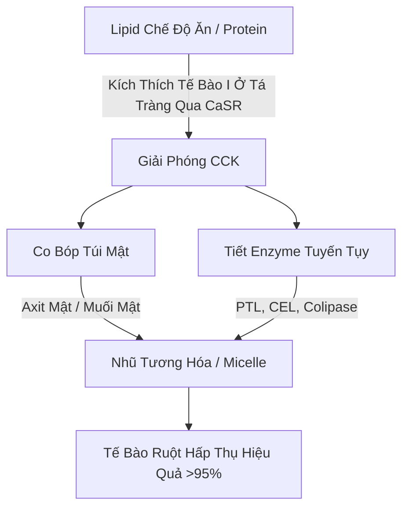
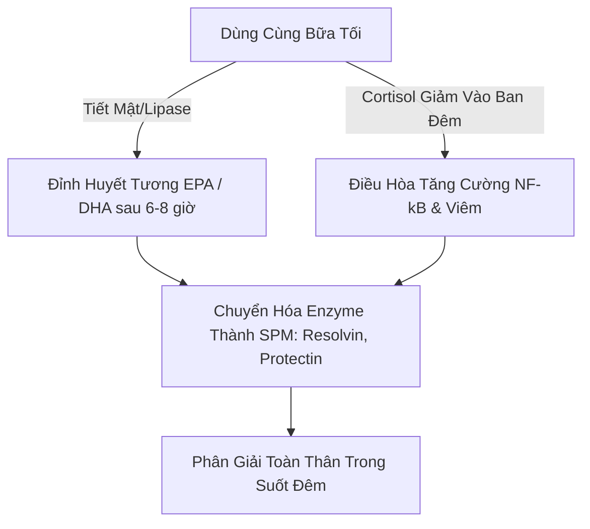

Hiệu quả điều trị của axit béo không bão hòa đa Omega-3 chuỗi dài từ biển ($\text{PUFA}$), đặc biệt là axit eicosapentaenoic ($\text{EPA}$) và axit docosahexaenoic ($\text{DHA}$), bị chi phối nghiêm ngặt bởi sinh khả dụng tại ruột của chúng. Trong dinh dưỡng lâm sàng, một nguyên nhân chính gây thất bại trong điều trị là "nghịch lý bữa ăn không béo" (lean-meal paradox) — việc dùng các lipid biển có tính kỵ nước cao trong trạng thái nhịn ăn hoặc cùng với các bữa ăn không có chất béo. Bất chấp việc tiêu thụ liều lượng danh nghĩa cao, việc thiếu một mạng lưới lipid dùng kèm có cấu trúc ngăn cản các cơ chế vật lý và enzym cần thiết cho quá trình hấp thụ chất béo trong lòng ống dẫn nước của đường tiêu hóa ở người. Phân tích lâm sàng này nêu chi tiết các nguyên tắc sinh lý sinh lý, sinh hóa và dược lý học thời gian quyết định quá trình tiêu hóa và hấp thụ $\text{EPA}$ và $\text{DHA}$.

## Nhịn Ăn Và Nghịch Lý Bữa Ăn Không Béo

Đường tiêu hóa về cơ bản là một hệ thống ngậm nước (gốc nước). Khi tiêu thụ các lipid kỵ nước (đẩy nước) như dầu cá tiêu chuẩn, chúng gặp phải môi trường phân cực cao của dịch dạ dày và ruột. Theo các định luật nhiệt động lực học, các phân tử kỵ nước giảm thiểu sự tiếp xúc của chúng với nước, dẫn đến sự phân tách pha nhanh chóng. Điều này khiến dầu ăn vào kết tụ thành các hạt lipid lớn, không bị chia cắt nổi trên lớp dưỡng trấp (chyme) dạ dày ngậm nước.

Uống một viên nang Omega-3 với một cốc nước khi bụng đói, hoặc cùng với một bữa ăn chỉ có carbohydrate (chẳng hạn như một miếng trái cây hoặc một lát bánh mì khô) không thể kích hoạt các quá trình sinh lý cần thiết để vượt qua sự phân tách pha này. Nếu không có quá trình nhũ tương hóa vật lý, tỷ lệ diện tích bề mặt trên thể tích của pha lipid vẫn cực kỳ thấp. Các vị trí hoạt động ưa nước của enzyme lipase tuyến tụy không thể tiếp cận các liên kết este nằm sâu bên trong các giọt lớn, kỵ nước này. Do đó, việc uống nước cùng với dầu cá không hỗ trợ quá trình hấp thụ; thay vào đó, nó làm loãng các enzym tiêu hóa có sẵn ở trạng thái nhịn ăn, đẩy các hạt lipid không được nhũ tương hóa ra xa khỏi lớp màng diềm bàn chải (brush border membrane) của tế bào biểu mô ruột (enterocyte) và dẫn đến kém hấp thu cũng như rối loạn tiêu hóa.

Để các lipid có tính kỵ nước cao này đi qua lớp nước không khuấy động (unstirred water layer) của niêm mạc ruột, chúng phải được chuyển đổi thành một pha có thể phân tán trong nước và ổn định về mặt nhiệt động lực học. Quá trình biến đổi này hoàn toàn phụ thuộc vào tính chất hóa lý của quá trình micell hóa (micellarization), một quá trình được bắt đầu bằng tín hiệu ở tá tràng thông qua hormone.

## Muối Mật Và Quá Trình Hình Thành Micelle

Sự chuyển tiếp từ một khối dầu nổi, kỵ nước sang các vi giọt có thể hấp thụ được đòi hỏi một chuỗi hoạt động bài tiết và thần kinh cơ được phối hợp tại tá tràng. Động lực hormone chính của quá trình này là cholecystokinin ($\text{CCK}$), một chuỗi peptide gồm 33 axit amin được tổng hợp và tiết ra bởi các tế bào nội tiết đường ruột loại I (Enteroendocrine I-cells) ở lớp niêm mạc của tá tràng và phần trên của hỗng tràng.



Trong các điều kiện sinh lý, sự hiện diện của các axit béo chuỗi dài và protein tiêu hóa một phần trong lòng tá tràng kích thích thụ thể cảm nhận canxi ($\text{CaSR}$) trên tế bào I, gây ra quá trình xuất bào nhanh chóng của $\text{CCK}$ vào máu. Khi được giải phóng, $\text{CCK}$ liên kết với thụ thể $\text{CCK}_A$ trên thành túi mật, khiến nó co bóp, đồng thời làm giãn cơ vòng Oddi và kích thích các tế bào nang tuyến tụy (pancreatic acinar cells) giải phóng các enzym tiêu hóa của chúng.

Axit mật do túi mật tiết ra — chủ yếu là muối natri lưỡng tính (amphipathic) của axit cholic và axit chenodeoxycholic — là những chất tẩy rửa sinh học thiết yếu. Khi nồng độ axit mật trong tá tràng vượt quá nồng độ micelle tới hạn ($\text{CMC}$), chúng tự sắp xếp xung quanh các giọt lipid kỵ nước. Lõi steroid kỵ nước của muối mật liên kết với pha lipid, trong khi nhóm liên hợp cực, ưa nước (glycine hoặc taurine) hướng về phía lòng tá tràng có nước.

Thông qua tác động cơ học của nhu động ruột, những giọt được bao phủ bởi mật này bị cắt xé thành các micelle hỗn hợp. Những khối keo hình cầu này chỉ có đường kính từ 3 đến 10 nanomet, làm tăng diện tích bề mặt lipid tiếp xúc với lipase tuyến tụy lên hàng ngàn lần. Nếu không tiêu thụ đồng thời chất béo lành mạnh trong chế độ ăn uống (chẳng hạn như dầu ô liu nguyên chất, bơ hoặc lòng đỏ trứng gà thả rông) để kích hoạt ngưỡng giải phóng $\text{CCK}$, sự co bóp túi mật sẽ không xảy ra. Ở trạng thái này, nồng độ axit mật duy trì ở mức dưới $\text{CMC}$, sự tiết lipase tuyến tụy ở mức tối thiểu và lipid Omega-3 hấp thụ vào không thể tạo thành micelle, ngăn cản sự hấp thụ.

## Trận Chiến Của Các Dạng Sinh Hóa: TG vs. EE vs. PL

Các chất bổ sung Omega-3 có sẵn trên thị trường tồn tại ở ba dạng phân tử chính: chất béo trung tính tự nhiên hoặc tái este hóa (Triglycerides - $\text{TG}$/$\text{rTG}$), este ethyl ($\text{EE}$) và phospholipid ($\text{PL}$). Cấu trúc phân tử của các chất mang này quyết định tốc độ tiêu hóa, sự phụ thuộc vào lipase và sinh khả dụng của chúng.

```text
Dạng Triglyceride (TG):            Dạng Ethyl Ester (EE):         Dạng Phospholipid (PL):
     ┌─ Khung Glycerol                  ┌─ Phân Tử Ethanol             ┌─ Đầu Phosphate (Phân Cực)
     ├─ Axit Béo (EPA)                  └─ Axit Béo (EPA)              ├─ Axit Béo (EPA)
     ├─ Axit Béo (DHA)                                                 └─ Axit Béo (DHA)
     └─ Axit Béo (Khác)
```

Ở các chất béo trung tính tự nhiên và tái este hóa ($\text{TG}$/$\text{rTG}$), ba axit béo ($\text{EPA}$/$\text{DHA}$) liên kết với một khung glycerol ba carbon. Trong quá trình tiêu hóa, enzym lipase triglyceride tuyến tụy ($\text{PTL}$), hoạt động cùng với đồng yếu tố colipase của nó, thủy phân các liên kết este ở vị trí $sn\text{-}1$ và $sn\text{-}3$. Quá trình này tạo ra hai axit béo tự do và một $sn\text{-}2$-monoglyceride, cả hai đều có tính phân cực cao, dễ tạo thành micelle và dễ dàng được các tế bào biểu mô ruột hấp thụ với hiệu suất trên 95%.

Ngược lại, dạng ethyl este ($\text{EE}$) là một sản phẩm tổng hợp được tạo ra trong quá trình cô đặc hóa học. Khung glycerol bị loại bỏ, và mỗi axit béo riêng lẻ được este hóa với một phân tử ethanol ($\text{CH}_3\text{CH}_2\text{OH}$). Liên kết este tổng hợp này có khả năng kháng cao đối với các enzym tuyến tụy ở người. Các nghiên cứu in-vitro và in-vivo chứng minh rằng lipase tuyến tụy ở người thủy phân liên kết axit béo-ethanol trong $\text{EE}$ ở tốc độ chậm hơn từ 10 đến 50 lần so với các liên kết glyceryl-este trong triglyceride.

Do quá trình thủy phân chậm chạp này, sự hấp thụ $\text{EE}$ phụ thuộc rất nhiều vào sự giải phóng ồ ạt của lipase tuyến tụy và muối mật, chỉ được kích hoạt bởi một bữa ăn nhiều chất béo. Khi dùng với chế độ ăn ít béo, lượng lipase tuyến tụy hạn chế có sẵn không thể phân cắt các liên kết $\text{EE}$ một cách hiệu quả, dẫn đến sinh khả dụng kém (thường giảm xuống khoảng 20%) và khiến các este tổng hợp không được hấp thụ di chuyển vào đại tràng, nơi chúng có thể gây ra các tác dụng phụ về đường tiêu hóa.

Dạng phospholipid ($\text{PL}$), chủ yếu có nguồn gốc từ dầu nhuyễn thể Nam Cực (Antarctic krill oil - Euphausia superba), có cấu trúc lưỡng tính (amphipathic) trong đó $\text{EPA}$ và $\text{DHA}$ liên kết với khung phosphatidylcholine. Nhóm đầu phosphate có tính phân cực cao làm cho phospholipid phân tán trong nước một cách tự nhiên. Do đó, các dạng $\text{PL}$ có thể tự nhũ hóa (self-emulsifying) và hình thành các vi giọt ngẫu nhiên trong đường tiêu hóa, bỏ qua yêu cầu bắt buộc về quá trình micelle hóa được kích thích bởi muối mật. Phospholipid cũng được tiêu hóa thông qua enzym phospholipase $\text{A}_2$ và có thể được các tế bào ruột hấp thụ trực tiếp dưới dạng lysophospholipid, mang lại sinh khả dụng cao ngay cả khi nhịn ăn hoặc dùng ít chất béo.

| Dạng Sinh Hóa | Chất Mang Phân Tử / Khung | Tỷ Lệ Hấp Thụ Trung Bình (Bữa Ăn Ít Béo) | Tỷ Lệ Hấp Thụ Trung Bình (Bữa Ăn Nhiều Béo) | Sinh Khả Dụng Tương Đối (So Với Mức Nền EE) | Phụ Thuộc Vào Lipase Tuyến Tụy |
| --- | --- | --- | --- | --- | --- |
| Ethyl Ester (EE) | Ethanol ($\text{CH}_3\text{CH}_2\text{OH}$) | $\approx 20\%$ | $\approx 60\%$ | Mức Nền ($100\%$) | Tuyệt Đối; thủy phân chậm hơn TG 10-50x |
| Triglyceride (TG / rTG) | Khung Glycerol | $\approx 68\%$ | $\approx 90\%$ | $124\%$ đến $186\%$ | Cao; phân tách nhanh chóng thành 2-FFA và 1-MAG |
| Phospholipid (PL) | Phosphatidylcholine | $\approx 80\%$ đến $95\%$ | $>95\%$ | $168\%$ đến $500\%$ | Tối Thiểu; tự nhũ hóa, bỏ qua một số lipase |

> [!WARNING]
> Những cá nhân mắc chứng Suy Tuyến Tụy Ngoại Tiết (EPI), rối loạn vận động đường mật hoặc những người sau phẫu thuật cắt bỏ túi mật có chức năng tiêu hóa lipid nội sinh bị suy yếu nghiêm trọng. Đối với nhóm lâm sàng này, việc sử dụng các công thức ethyl este (EE) tổng hợp trong điều kiện hạn chế chế độ ăn ít chất béo có nguy cơ cao gây ra tình trạng kém hấp thu hoàn toàn và khó chịu ở đường tiêu hóa, vì quá trình phân cắt enzym cần thiết gần như không tồn tại trong các tình trạng bệnh lý này.

## Quá Trình Oxy Hóa Lipid Và Nhu Cầu Tuyệt Đối Về Vitamin E

Các đặc điểm cấu trúc làm cho $\text{EPA}$ và $\text{DHA}$ có hoạt tính sinh học cũng khiến chúng cực kỳ không ổn định. $\text{EPA}$ chứa năm và $\text{DHA}$ chứa sáu liên kết đôi bị đứt quãng bởi nhóm methylene. Các liên kết carbon-hydro tại các carbon methylene bis-allylic ($\text{-CH=CH-CH}_2\text{-CH=CH-}$) có năng lượng phân ly liên kết thấp. Điều này làm cho chúng đặc biệt dễ bị tấn công bởi gốc tự do và quá trình peroxy hóa lipid không do enzym.

```text
Giai Đoạn 1: Khởi Xướng (Initiation)
  [Liên Kết Carbon-Hydro của PUFA] + [ROS / Gốc Tự Do] ──> [Gốc Lipid Trung Tâm Carbon (R•)]

Giai Đoạn 2: Lan Truyền (Propagation)
  [Gốc Lipid Trung Tâm Carbon (R•)] + [O2] ──> [Gốc Lipid Peroxyl (ROO•)]
  [Gốc Lipid Peroxyl (ROO•)] + [PUFA Chưa Bị Oxy Hóa] ──> [Lipid Hydroperoxide (ROOH)] + [Gốc Lipid Mới (R•)]

Giai Đoạn 3: Phân Hủy (Decomposition)
  [Lipid Hydroperoxide Không Ổn Định (ROOH)] ──> [Aldehyde Độc Hại (MDA / HHE)]
```

Sau khi nuốt vào, dầu cá sẽ tiếp xúc với môi trường $37^\circ\text{C}$ (nhiệt độ cơ thể), axit dạ dày và oxy phân tử hòa tan ($\text{O}_2$). Môi trường này thúc đẩy chuỗi peroxy hóa lipid qua ba giai đoạn riêng biệt:

1. **Khởi Xướng:** Một gốc oxy phản ứng ($\text{ROS}$) lấy đi một nguyên tử hydro từ một carbon bis-allylic, tạo ra một gốc lipid tập trung vào carbon ($\text{R}^\bullet$).
2. **Lan Truyền:** Gốc lipid phản ứng nhanh với oxy phân tử ($\text{O}_2$) để tạo thành gốc peroxyl lipid ($\text{ROO}^\bullet$). Gốc peroxyl này sau đó chiết xuất một nguyên tử hydro từ một phân tử $\text{PUFA}$ chưa bị oxy hóa lân cận, tạo ra một hydroperoxide lipid ($\text{ROOH}$) và một gốc lipid mới, duy trì phản ứng dây chuyền.
3. **Phân Hủy:** Các hydroperoxide lipid không ổn định bị phân hủy thành các sản phẩm oxy hóa thứ cấp có tính phản ứng cao, gây độc tế bào, bao gồm các alkenal như malondialdehyde ($\text{MDA}$) và 4-hydroxyhexenal ($\text{HHE}$).

Các sản phẩm oxy hóa thứ cấp này dễ dàng được hấp thụ qua ruột, kết hợp vào chylomicron và lipoprotein mật độ thấp ($\text{LDL}$), và có thể gây ra căng thẳng oxy hóa toàn thân (systemic oxidative stress), tổn thương nội mô và hình thành xơ vữa động mạch.

Để ngăn chặn quá trình này, việc kết hợp với một chất chống oxy hóa hòa tan trong chất béo, bẻ gãy chuỗi là bắt buộc. Vitamin E tự nhiên, đặc biệt là d-alpha-tocopherol ($\text{C}_{29}\text{H}_{50}\text{O}_2$), được tối ưu hóa cao cho vai trò này. D-alpha-tocopherol hoạt động như một chất nhường hydro, nhanh chóng chuyển nguyên tử hydro phenolic của nó sang gốc lipid peroxyl phản ứng ($\text{ROO}^\bullet$) với hằng số tốc độ cực nhanh khoảng $10^6\,\text{M}^{-1}\text{s}^{-1}$.

Gốc tocopheroxyl tạo thành rất ổn định do sự phân vùng cộng hưởng của điện tử chưa ghép cặp qua vòng chromanol, ngăn không cho nó tấn công các chuỗi axit béo lân cận. Điều này làm ngừng phản ứng dây chuyền, bảo vệ tính toàn vẹn cấu trúc của các phân tử $\text{EPA}$ và $\text{DHA}$ để chúng có thể đến các mô đích ở trạng thái hoạt động, chưa bị oxy hóa.

## Dược Lý Học Thời Gian Và Khung Giờ Chống Viêm Ban Đêm

Trong sinh hóa lipid, thời gian (timing) là một yếu tố quan trọng. Uống chất bổ sung Omega-3 cùng với bữa ăn lớn nhất, nhiều chất béo nhất trong ngày (thường là bữa tối) sẽ tối ưu hóa cả sự hấp thụ và quá trình chữa lành ban đêm tự nhiên của cơ thể.



Thứ nhất, về mặt lịch sử, bữa tối là bữa ăn có nhiều chất béo nhất trong ngày đối với nhiều người. Điều này cung cấp khối lượng lipid vật lý cần thiết để kích hoạt quá trình giải phóng $\text{CCK}$ tối đa, dẫn đến co bóp túi mật mạnh mẽ, tiết mật dồi dào và hoạt động của lipase tuyến tụy cao. Yếu tố này tối ưu hóa động học hình thành micelle và tiêu hóa, đảm bảo rằng gần như toàn bộ liều lượng ăn vào đều được hấp thu thành công.

Thứ hai, việc dùng thuốc vào buổi tối phù hợp với chu kỳ tuần hoàn miễn dịch và viêm nhiễm của cơ thể. Nồng độ cortisol nội sinh giảm xuống mức thấp nhất tự nhiên hàng ngày vào cuối buổi tối và đầu đêm. Cortisol là một loại hormone chống viêm mạnh; khi nồng độ của nó giảm xuống, các con đường gây viêm toàn thân — chẳng hạn như các con đường bị chi phối bởi yếu tố phiên mã tiền viêm $\text{NF}\text{-}\kappa\text{B}$ — sẽ trải qua một quá trình "điều hòa tăng cường" (upregulation) tương đối.

Bằng cách dùng Omega-3 vào bữa tối, nồng độ đỉnh trong huyết tương và màng tế bào của $\text{EPA}$ và $\text{DHA}$ sẽ đạt được sau 6 đến 8 giờ, trùng khớp trực tiếp với khung thời gian viêm nhiễm ban đêm này. Trong giai đoạn này, cơ thể sử dụng các axit béo này làm chất nền cho quá trình tổng hợp enzym của các Chất Trung Gian Tiền Phân Giải Chuyên Biệt ($\text{SPM}$) — đặc biệt là resolvin, protectin và maresin — thông qua con đường cyclooxygenase ($\text{COX}$) và lipoxygenase ($\text{LOX}$). Các $\text{SPM}$ này tích cực giải quyết các chứng viêm vi mô mãn tính, thúc đẩy quá trình thay mới tế bào và hỗ trợ quá trình lành mô trong khi ngủ.

Hơn nữa, việc dùng Omega-3 vào buổi tối, đặc biệt là $\text{DHA}$, mang lại những lợi ích thần kinh độc đáo. $\text{DHA}$ là một lipid cấu trúc quan trọng trong màng tế bào thần kinh và đóng vai trò quan trọng trong đồng hồ sinh học của não. Nó hoạt động trên các gen đồng hồ sinh học (như BMAL1 và CLOCK) chịu trách nhiệm điều chỉnh chu kỳ thức-ngủ.

Sự tích hợp $\text{DHA}$ vào ban đêm vào các màng tiếp hợp (synaptic membranes) hỗ trợ giao tiếp của tế bào thần kinh, tăng cường tổng hợp serotonin và tối ưu hóa quá trình chuyển đổi của nó thành melatonin. Các thử nghiệm lâm sàng chứng minh rằng việc bổ sung omega-3 đều đặn vào buổi tối giúp cải thiện đáng kể hiệu quả giấc ngủ, rút ngắn thời gian khởi phát giấc ngủ và làm giảm chỉ số gián đoạn giấc ngủ (thức giấc giữa đêm).

> [!TIP]
> Để tối đa hóa sự kết hợp sinh học vào tế bào của axit béo Omega-3 chuỗi dài, các bác sĩ lâm sàng nên khuyên bệnh nhân dùng liều lượng hàng ngày cùng với bữa ăn nhiều chất béo nhất trong ngày. Việc tiêu thụ cùng với ít nhất 10-15 gam chất béo không bão hòa đơn hoặc không bão hòa đa lành mạnh (ví dụ: dầu ô liu nguyên chất hoặc bơ) là đủ để kích hoạt ngưỡng giải phóng cholecystokinin cần thiết cho quá trình micelle hóa tối ưu.

## Tóm Tắt Lâm Sàng Và Các Khuyến Nghị Thực Hành

Tối đa hóa tiềm năng điều trị của các chất bổ sung Omega-3 đòi hỏi phải chuyển từ việc chỉ đơn giản là nuốt các viên nang có liều lượng danh nghĩa cao sang một cách tiếp cận dựa trên sinh hóa lipid và động học tiêu hóa. Thói quen truyền thống uống dầu cá với nước khi bụng đói thường dẫn đến kém hấp thu và các tác dụng phụ về tiêu hóa.

Để có kết quả điều trị tối ưu, các bác sĩ lâm sàng nên ưu tiên các công thức triglyceride tái este hóa ($\text{rTG}$) hoặc phospholipid ($\text{PL}$), những loại này thể hiện động học hấp thu vượt trội và ít phụ thuộc vào các bữa ăn nhiều chất béo hơn so với ethyl ester ($\text{EE}$) tổng hợp.

Bất kể công thức được chọn là gì, chất bổ sung phải được dùng cùng với bữa ăn chứa ít nhất 10 đến 15 gam chất béo trong chế độ ăn uống. Ngưỡng lipid này là cần thiết để kích hoạt tín hiệu $\text{CCK}$ ở tá tràng, bắt đầu sự co bóp túi mật và bài tiết lipase tuyến tụy để cho phép quá trình hình thành micelle hoàn toàn.

Hơn nữa, để bảo vệ các $\text{PUFA}$ rất không ổn định này khỏi tác hại của quá trình oxy hóa bên trong cơ thể, công thức thuốc phải luôn bao gồm một chất chống oxy hóa hòa tan trong chất béo tự nhiên như d-alpha-tocopherol (Vitamin E).

Cuối cùng, việc dùng thực phẩm bổ sung cùng với bữa ăn tối đảm bảo rằng quá trình hấp thụ tối đa trùng khớp với các con đường sửa chữa tế bào và chống viêm tự nhiên vào ban đêm của cơ thể, tối đa hóa lợi ích về tim mạch, miễn dịch và thần kinh của $\text{EPA}$ và $\text{DHA}$.

## Tài liệu tham khảo

1. Nordøy A, et al. [Absorption of the n-3 eicosapentaenoic and docosahexaenoic acids as ethyl esters and triglycerides by humans](https://pubmed.ncbi.nlm.nih.gov/1826985/). *American Journal of Clinical Nutrition.* 1991.
2. Offman E, Marenco T, Ferber S, Johnson J, Kling D, Curcio D, Davidson M. [Steady-state bioavailability of prescription omega-3 on a low-fat diet is significantly improved with a free fatty acid formulation compared with an ethyl ester formulation: the ECLIPSE II study](https://pubmed.ncbi.nlm.nih.gov/24124374/). *Vascular Health and Risk Management.* 2013.
3. Schuchardt JP, Schneider I, Meyer H, Neubronner J, von Schacky C, Hahn A. [Incorporation of EPA and DHA into plasma phospholipids in response to different omega-3 fatty acid formulations - a comparative bioavailability study of fish oil vs. krill oil](https://pubmed.ncbi.nlm.nih.gov/21854650/). *Lipids in Health and Disease.* 2011.
4. Brown JE, Wahle KW. [Effect of fish-oil and vitamin E supplementation on lipid peroxidation and whole-blood aggregation in man](https://pubmed.ncbi.nlm.nih.gov/2282693/). *Clinica Chimica Acta.* 1990.

*Bài viết này chỉ nhằm mục đích cung cấp thông tin và không thay thế cho tư vấn y tế chuyên môn; trước khi thay đổi chế độ bổ sung hoặc thuốc đang sử dụng, bạn nên tham khảo ý kiến của chuyên gia y tế có chuyên môn phù hợp.*
