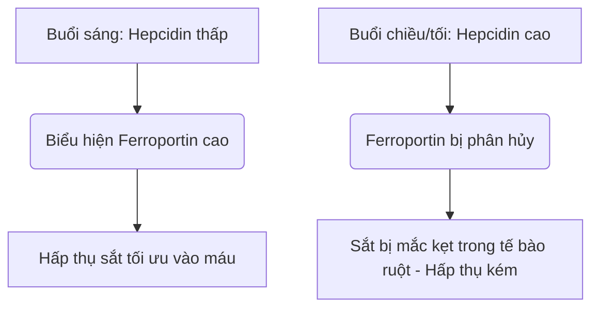

Sắt là một vi chất dinh dưỡng không thể thiếu có chức năng như một đồng yếu tố cấu trúc và xúc tác trong quá trình vận chuyển oxy, hô hấp tế bào và tổng hợp DNA. Mặc dù có nhiều trong tự nhiên, sắt thường là một chất dinh dưỡng hạn chế sự phát triển trong chế độ ăn uống của con người. Vì con người không có cơ chế sinh lý nào để bài tiết sắt chủ động, sự cân bằng sắt toàn thân được duy trì độc quyền ở mức độ hấp thụ ở ruột.

Sắt trong chế độ ăn uống xảy ra ở hai dạng chính: **sắt hữu cơ (heme)** và **sắt vô cơ (non-heme)**.

Sắt heme có sinh khả dụng cao, thường được hấp thụ ở mức 15% đến 35%. Nó được vận chuyển nguyên vẹn qua diềm bàn chải đỉnh của tế bào ruột tá tràng thông qua Protein mang Heme 1 (HCP1) và vẫn được bảo vệ khỏi các chất ức chế chế độ ăn uống tiêu chuẩn.

Ngược lại, sắt non-heme (sắt vô cơ) chiếm hơn 80% lượng hấp thụ qua chế độ ăn uống nhưng thể hiện cấu hình hấp thụ bị tổn hại nghiêm trọng, với tỷ lệ hấp thụ chỉ dao động từ 2% đến 20%.

> [!TIP]
> Ở độ pH sinh lý, sắt non-heme tồn tại chủ yếu ở trạng thái sắt (Fe³⁺) bị oxy hóa, rất không hòa tan. Để được hấp thụ, nó phải trải qua quá trình khử thành trạng thái sắt (Fe²⁺) hòa tan bởi men khử đỉnh cytochrom b tá tràng (Dcytb), trước khi xâm nhập vào tế bào ruột thông qua Divalent Metal Transporter 1 (DMT1).

## Con đường sắt Heme so với sắt Non-Heme

| Đặc điểm / Số liệu | Con đường sắt Heme | Con đường sắt Non-Heme (Vô cơ) |
| :--- | :--- | :--- |
| **Nguồn thức ăn** | Mô động vật (hemoglobin, myoglobin) | Thực vật, thực phẩm tăng cường sắt, muối khoáng |
| **Chất vận chuyển đỉnh** | Protein mang Heme 1 (HCP1) | Chất vận chuyển kim loại hóa trị hai 1 (DMT1) |
| **Trạng thái hóa trị bắt buộc** | Phức hợp gắn porphyrin | Sắt (Fe²⁺) |
| **Độ pH tối ưu trong lòng ống** | Ổn định rộng rãi; không bị ảnh hưởng bởi axit dạ dày | Yêu cầu độ axit cao (pH < 3.0) để hòa tan |
| **Hiệu quả hấp thụ điển hình**| 15% – 35% (sinh khả dụng cao) | 2% – 20% (rất thay đổi) |
| **Độ nhạy cảm với các chất ức chế chế độ ăn uống** | Không đáng kể; được bảo vệ bởi vòng porphyrin | Cực kỳ cao (bị ức chế bởi phytates, polyphenol, canxi) |

## Thời điểm tối ưu (Thời dược học)

Tối ưu hóa sự hấp thụ sắt non-heme đòi hỏi sự phối hợp chính xác với động học ban ngày của **hepcidin**, một hormone peptide gồm 25 axit amin được tổng hợp chủ yếu bởi tế bào gan. Hepcidin có chức năng như bộ điều chỉnh hệ thống chính của cân bằng nội môi sắt bằng cách liên kết trực tiếp với Ferroportin, chất xuất khẩu bên cơ sở, gây ra sự suy thoái của nó. Do đó, nồng độ hepcidin lưu thông tăng cao sẽ nhốt sắt bên trong các tế bào ruột tá tràng và ngăn cản sự xâm nhập của nó vào máu.

### Dao động theo nhịp sinh học của Hepcidin
Trong điều kiện sinh lý cơ bản, nồng độ hepcidin ở mức thấp nhất vào sáng sớm, tăng đều đặn trong suốt buổi chiều đến đỉnh điểm và giảm vào ban đêm.

Đường cong sinh học này tác động trực tiếp đến động học sắt qua đường uống. Việc **sử dụng thuốc vào buổi sáng** các chất bổ sung sắt cho phép khoáng chất này đến tá tràng khi biểu hiện Ferroportin của tế bào ruột ở mức cao nhất. Ngược lại, liều dùng vào buổi chiều hoặc buổi tối buộc sắt phải cạnh tranh với sự phong tỏa hepcidin gia tăng, dẫn đến giảm 37% lượng sắt hấp thụ một phần.

### Tác động của Axit dạ dày
Trạng thái sinh lý sinh học của sắt vô cơ phụ thuộc nhiều vào việc sản xuất axit dạ dày. Ức chế dược lý của axit dạ dày thông qua Thuốc ức chế bơm proton (PPIs - thuốc dạ dày) phá vỡ nghiêm trọng môi trường vi mô này, làm tăng độ pH của dạ dày và gây ra quá trình oxy hóa nhanh chóng Fe²⁺ hòa tan thành Fe³⁺ cực kỳ không hòa tan.

> [!WARNING]
> Thuốc bổ sung sắt đường uống phải được dùng khi bụng đói — lý tưởng nhất là 1 giờ trước hoặc 2 giờ sau bữa ăn — và tách biệt hoàn toàn khỏi bất kỳ loại thuốc ức chế axit nào.

## Những tương tác nguy hiểm (Những thứ KHÔNG BAO GIỜ được trộn lẫn)

Hiệu quả điều trị của sắt qua đường uống dễ bị ảnh hưởng khi uống cùng lúc với các hợp chất chế độ ăn uống và các tác nhân dược phẩm khác nhau.

### Canxi
Canxi, cho dù được hấp thụ dưới dạng sữa trong chế độ ăn uống (sữa, pho mát, sữa chua) hoặc dưới dạng bổ sung khoáng chất (canxi cacbonat), là một chất ức chế mạnh sự hấp thụ sắt heme và non-heme. Việc uống chung 500 mg canxi cacbonat với bữa ăn có chứa sắt làm giảm lượng sắt hấp thụ một phần hơn 50%.

### Tannin và Polyphenol
Polyphenol được tìm thấy trong **trà đen, trà xanh, trà thảo mộc và cà phê** là những chất tạo phức sắt đặc biệt hiệu quả. Các hợp chất có nguồn gốc thực vật này phối hợp với sắt ferric để tạo thành các phức hợp cơ kim lớn, có độ ổn định cao mà không thể vượt qua diềm bàn chải tá tràng. Thêm chỉ một tách cà phê hoặc trà vào bữa ăn có thể làm giảm sự hấp thụ sắt non-heme từ 40% đến 70%.

### Axit Phytic
Axit phytic là hợp chất dự trữ phốt pho chính trong ngũ cốc nguyên hạt, ngũ cốc, các loại hạt và đậu. Tỷ lệ mol của axit phytic so với sắt là yếu tố chế độ ăn uống quan trọng nhất hạn chế sinh khả dụng của sắt trong chế độ ăn dựa trên thực vật.

### Kẽm và Magie
Sắt đen, kẽm và magiê có chung con đường vận chuyển chồng chéo qua màng đỉnh của tế bào ruột (chẳng hạn như DMT1). Ở liều lượng sắt điều trị, sự ức chế cạnh tranh xảy ra, ức chế đáng kể quá trình vận chuyển sắt. Không dùng chung chất bổ sung sắt của bạn với Kẽm hoặc Magie.

### Thuốc tuyến giáp (Levothyroxine)
Việc sử dụng chung thuốc bổ sung sắt đường uống với levothyroxine (T4) dẫn đến tương tác nghiêm trọng giữa thuốc và chất dinh dưỡng. Sắt phối hợp với phân tử levothyroxine, tạo thành một phức hợp không hòa tan làm giảm sinh khả dụng đường uống của levothyroxine từ 20% đến 64%.

> [!CAUTION]
> Để ngăn ngừa sự thất bại lâm sàng của liệu pháp tuyến giáp của bạn, phải có một khoảng thời gian tách biệt tối thiểu nghiêm ngặt là 4 giờ giữa việc sử dụng levothyroxine và sắt.

## Yếu tố đồng sáng giá nhất: Vitamin C

Axit ascorbic (Vitamin C) là chất tăng cường mạnh nhất sự hấp thụ sắt non-heme, có khả năng ghi đè tác dụng ức chế của phytates, polyphenol và canxi trong chế độ ăn uống.

Mối quan hệ hiệp đồng này hoạt động thông qua một cơ chế sinh hóa kép hiệu quả cao:
1. **Khử thuận lợi về mặt nhiệt động học:** Axit ascorbic nhanh chóng chuyển hóa các ion sắt không hòa tan (Fe³⁺) thành dạng sắt hòa tan cao (Fe²⁺), sẵn sàng để vận chuyển.
2. **Che hóa tá tràng:** Axit ascorbic hoạt động như một lá chắn bảo vệ, ngăn cản sắt liên kết với phytates và polyphenol khi nó chuyển đổi vào môi trường kiềm của tá tràng.

## Tác dụng phụ và Mô hình liều lượng "Cách ngày"

Cách tiếp cận truyền thống để điều trị thiếu máu do thiếu sắt — kê đơn sắt uống liều cao hàng ngày — thường thất bại do các tác dụng phụ nghiêm trọng ở đường tiêu hóa (buồn nôn, táo bón) và các vòng phản hồi hệ thống.

Do tỷ lệ hấp thụ một phần thấp, lên đến 90% liều lượng sắt uống tiêu chuẩn vẫn không được hấp thụ khi nó đi xuống đường tiêu hóa. Lượng sắt dư thừa này phản ứng với hydro peroxit để tạo ra các gốc hydroxyl cực độc, gây ra căng thẳng oxy hóa và viêm niêm mạc.

Hơn nữa, các chất bổ sung sắt liều cao hàng ngày sẽ kích hoạt **"Khối lượng niêm mạc" (Mucosal Block)** hệ thống. Việc ăn một liều lượng sắt uống ≥ 60 mg gây ra sự gia tăng nhanh chóng nồng độ hepcidin trong huyết thanh và duy trì mức tăng cao trong 24 giờ. Nếu dùng liều sắt thứ hai vào ngày hôm sau, các tế bào ruột sẽ bị ngăn chặn về mặt vật lý khỏi việc xuất khẩu nó vào hệ tuần hoàn tĩnh mạch cửa. Sắt bị mắc kẹt và cuối cùng bị đào thải.

> [!TIP]
> **Liều lượng cách ngày:** Để vượt qua rào cản do hepcidin làm trung gian này, huyết học hiện đại đã chuyển sang việc sử dụng sắt uống **cách ngày (hai ngày một lần)**. Các thử nghiệm lâm sàng chứng minh rằng việc bổ sung sắt mỗi 48 giờ sẽ làm tăng lượng sắt hấp thụ một phần từ 40% đến 50% so với liều lượng hàng ngày liên tiếp, đồng thời giảm đáng kể các tác dụng phụ ở đường tiêu hóa.

### Tóm tắt các Giao thức Lâm sàng

*   **Độ pH dạ dày thấp là điều cần thiết:** Uống sắt khi bụng đói với nước.
*   **Tránh các chất ức chế chế độ ăn uống chính:** Tuyệt đối tránh dùng sắt cùng với canxi, các sản phẩm từ sữa, cà phê hoặc trà.
*   **Duy trì khoảng cách dùng thuốc nghiêm ngặt:** Tách riêng sắt và levothyroxine ít nhất 4 giờ.
*   **Tận dụng Vitamin C:** Dùng chung sắt với Vitamin C giúp tăng khả năng hấp thụ lên đến 300%.
*   **Áp dụng liều lượng cách ngày:** Đặt các liều lượng sắt uống cách nhau 48 giờ để tránh tình trạng tắc nghẽn niêm mạc do hepcidin gây ra và tối đa hóa sự hấp thụ.

## Tài liệu tham khảo

1. Stoffel NU, Zeder C, Brittenham GM, Moretti D, Zimmermann MB. [Iron absorption from oral iron supplements given on consecutive versus alternate days and as single morning doses versus twice-daily split dosing in iron-depleted women: two open-label, randomised controlled trials](https://pubmed.ncbi.nlm.nih.gov/29032957/). *Lancet Haematol.* 2017.
2. Campbell NR, Hasinoff BB. [Ferrous sulfate reduces thyroxine efficacy in patients with hypothyroidism](https://pubmed.ncbi.nlm.nih.gov/1443969/). *Ann Intern Med.* 1992.
3. Hallberg L, Hulthén L. [Effect of ascorbic acid intake on nonheme-iron absorption from a complete diet](https://pubmed.ncbi.nlm.nih.gov/11124756/). *Am J Clin Nutr.* 2000.
4. Lönnerdal B. [Calcium and iron absorption—mechanisms and public health relevance](https://pubmed.ncbi.nlm.nih.gov/21462112/). *Int J Vitam Nutr Res.* 2010.

*Bài viết này chỉ nhằm mục đích cung cấp thông tin và không thay thế cho tư vấn y tế chuyên môn; trước khi thay đổi chế độ bổ sung hoặc thuốc đang sử dụng, bạn nên tham khảo ý kiến của chuyên gia y tế có chuyên môn phù hợp.*
