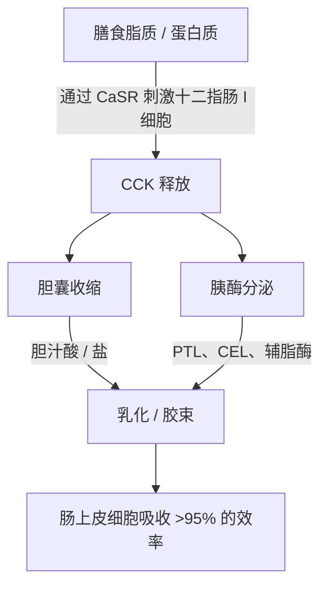
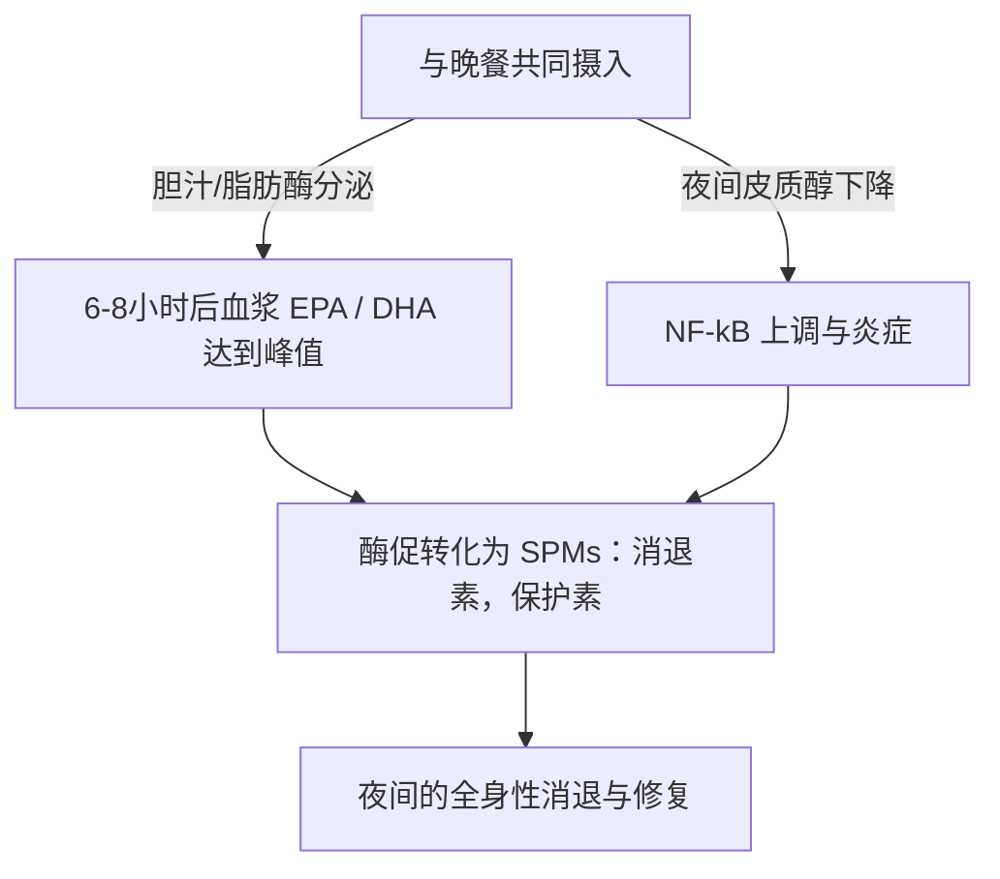

长链海洋 Omega-3 多不饱和脂肪酸（$\text{PUFA}$），特别是二十碳五烯酸（$\text{EPA}$）和二十二碳六烯酸（$\text{DHA}$）的治疗功效，严格取决于它们的肠道生物利用度。在临床营养学中，治疗失败的一个主要原因是“低脂饮食悖论（lean-meal paradox）”——在空腹状态下或与无脂饮食一起服用高度疏水性的海洋脂质。尽管服用了高标称剂量的补充剂，但缺乏结构化的脂质共摄入基质，阻碍了在人体胃肠道水性管腔中吸收脂质所需的物理和酶促机制。本临床分析详细介绍了决定 $\text{EPA}$ 和 $\text{DHA}$ 消化和吸收的生物物理、生化和时间药理学原理。

## 禁食与低脂饮食悖论

胃肠道从根本上说是一个水性（基于水）的系统。当摄入如标准鱼油等疏水性（斥水性）脂质时，它们会遇到极性极强的胃液和肠液环境。根据热力学定律，疏水性分子会最大限度地减少与水的接触，导致快速的相分离。这会导致摄入的油脂聚集成大的、未分割的脂质小球，漂浮在水性食糜的顶部。

空腹时用一杯水吞服 Omega-3 胶囊，或与纯碳水化合物饮食（如一片水果或一片干面包）一起服用，无法触发克服这种相分离所需的生理过程。如果没有物理乳化，脂质相的表面积与体积比将保持极低。胰脂肪酶的亲水性活性位点无法接触到埋藏在这些巨大疏水性液滴内部的酯键。因此，用水送服鱼油并不能促进吸收；相反，它会稀释空腹状态下存在的微量消化酶，使未乳化的脂质小球进一步远离肠上皮细胞的刷状缘膜，导致吸收不良和胃肠道不适。

为了使这些高度疏水性的脂质穿过肠粘膜的非搅拌水层（unstirred water layer），它们必须转化为热力学稳定、可分散在水中的相。这种转化完全依赖于胶束化（micellarization）的物理化学过程，这是一个由激素介导的十二指肠信号传导启动的过程。

## 胆汁盐与胶束形成

从漂浮的疏水性油块转变为可吸收的微滴，需要在十二指肠内进行协调的分泌和神经肌肉级联反应。这一过程的主要激素驱动因素是胆囊收缩素（$\text{CCK}$），这是一种由十二指肠和空肠上部粘膜内层的肠内分泌 I 细胞合成和分泌的 33 氨基酸肽。



在生理条件下，十二指肠管腔内长链脂肪酸和部分消化蛋白质的存在会刺激 I 细胞上的钙敏感受体（$\text{CaSR}$），引发 $\text{CCK}$ 快速胞吐进入血液。一旦释放，$\text{CCK}$ 就会与胆囊壁上的 $\text{CCK}_A$ 受体结合，导致胆囊收缩，同时放松奥迪括约肌（Sphincter of Oddi），并刺激胰腺腺泡细胞释放消化酶。

胆囊释放的胆汁酸——主要是胆酸和鹅脱氧胆酸的两亲性钠盐——是必不可少的生物清洁剂（表面活性剂）。当十二指肠中的胆汁酸浓度超过临界胶束浓度（$\text{CMC}$）时，它们会围绕在疏水性脂质液滴周围。胆汁盐的疏水性类固醇核心与脂质相结合，而极性、亲水性的结合基团（甘氨酸或牛磺酸）则朝向水性十二指肠管腔。

通过肠道蠕动的机械作用，这些包裹着胆汁的液滴被剪切成混合胶束。这些球形胶体聚集体的直径仅为 3 到 10 纳米，使暴露于胰脂肪酶的脂质表面积增加了数千倍。如果没有同时摄入健康的膳食脂肪（如特级初榨橄榄油、牛油果或散养蛋黄）来触发 $\text{CCK}$ 释放的阈值，就不会发生胆囊收缩。在这种状态下，胆汁酸水平保持在 $\text{CMC}$ 以下，胰脂肪酶分泌极少，摄入的 Omega-3 脂质无法形成胶束，从而阻碍了吸收。

## 生化形式之争：TG vs. EE vs. PL

市售的 Omega-3 补充剂主要以三种分子形式存在：天然或甘油三酯再酯化（$\text{TG}$/$\text{rTG}$）、乙酯（$\text{EE}$）和磷脂（$\text{PL}$）。这些载体的分子结构决定了它们的消化速度、对脂肪酶的依赖性以及生物利用度。

```text
甘油三酯 (TG) 形式：               乙酯 (EE) 形式：                磷脂 (PL) 形式：
     ┌─ 甘油骨架                        ┌─ 乙醇分子                     ┌─ 磷酸盐头部 (极性)
     ├─ 脂肪酸 (EPA)                    └─ 脂肪酸 (EPA)                 ├─ 脂肪酸 (EPA)
     ├─ 脂肪酸 (DHA)                                                    └─ 脂肪酸 (DHA)
     └─ 脂肪酸 (其他)
```

在天然和再酯化的甘油三酯（$\text{TG}$/$\text{rTG}$）中，三个脂肪酸（$\text{EPA}$/$\text{DHA}$）结合在一个三碳甘油骨架上。在消化过程中，胰甘油三酯脂肪酶（$\text{PTL}$）与其辅助因子辅脂酶协同作用，水解 $sn\text{-}1$ 和 $sn\text{-}3$ 位置的酯键。这会产生两个游离脂肪酸和一个 $sn\text{-}2$-甘油一酯，它们都具有高极性，容易胶束化，并且很容易被肠上皮细胞吸收，效率超过 95%。

相反，乙酯（$\text{EE}$）形式是在化学浓缩过程中产生的合成产物。甘油骨架被移除，每个单独的脂肪酸被酯化到一个乙醇分子（$\text{CH}_3\text{CH}_2\text{OH}$）上。这种合成酯键对人类胰酶具有高度的抗性。体外和体内研究表明，人类胰脂肪酶水解 $\text{EE}$ 中脂肪酸-乙醇键的速度比水解甘油三酯中甘油酯键的速度慢 10 到 50 倍。

由于水解缓慢，$\text{EE}$ 的吸收高度依赖于胰脂肪酶和胆汁盐的大量释放，而这只有高脂饮食才能引发。当与低脂饮食一起服用时，有限的可用胰脂肪酶无法有效裂解 $\text{EE}$ 键，导致生物利用度差（通常降至约 20%），并导致未吸收的合成酯进入结肠，在那里它们会引起胃肠道副作用。

磷脂（$\text{PL}$）形式主要来源于南极磷虾油（Euphausia superba），具有两亲性结构，其中 $\text{EPA}$ 和 $\text{DHA}$ 结合在磷脂酰胆碱骨架上。高极性的磷酸盐头部基团使磷脂自然地可分散在水中。正因为如此，$\text{PL}$ 形式可以在胃肠道中自乳化（self-emulsifying）并自发形成微滴，从而绕过了胆汁盐刺激胶束化的绝对要求。磷脂也通过磷脂酶 $\text{A}_2$ 消化，并且可以直接作为溶血磷脂被肠上皮细胞吸收，即使在禁食或低脂条件下也能实现高生物利用度。

| 生化形式 | 分子载体 / 骨架 | 平均吸收率（低脂饮食） | 平均吸收率（高脂饮食） | 相对生物利用度（以 EE 为基准） | 胰脂肪酶依赖性 |
| --- | --- | --- | --- | --- | --- |
| 乙酯 (EE) | 乙醇 ($\text{CH}_3\text{CH}_2\text{OH}$) | $\approx 20\%$ | $\approx 60\%$ | 基准线 ($100\%$) | 绝对依赖；水解速度比 TG 慢 10-50 倍 |
| 甘油三酯 (TG / rTG) | 甘油骨架 | $\approx 68\%$ | $\approx 90\%$ | $124\%$ 至 $186\%$ | 高；迅速裂解为 2-FFA 和 1-MAG |
| 磷脂 (PL) | 磷脂酰胆碱 | $\approx 80\%$ 至 $95\%$ | $>95\%$ | $168\%$ 至 $500\%$ | 极低；自乳化，绕过部分脂肪酶 |

> [!WARNING]
> 患有外分泌胰腺功能不全（EPI）、胆道运动功能障碍或胆囊切除术后的个体，其内源性脂质消化功能严重受损。对于这些临床人群，在低脂饮食限制下服用合成乙酯（EE）制剂，存在完全吸收不良和胃肠道不适的高风险，因为在这些状态下几乎不存在必要的酶促裂解。

## 脂质氧化与维生素 E 的绝对必要性

使 $\text{EPA}$ 和 $\text{DHA}$ 具有生物活性的结构特征，也使它们变得极不稳定。$\text{EPA}$ 含有五个，$\text{DHA}$ 含有六个被亚甲基中断的双键。双烯丙基亚甲基碳（$\text{-CH=CH-CH}_2\text{-CH=CH-}$）上的碳-氢键具有较低的键解离能。这使得它们极易受到自由基攻击和非酶促脂质过氧化作用的影响。

```text
阶段 1：引发（Initiation）
  [PUFA 碳-氢键] + [ROS / 自由基] ──> [以碳为中心的脂质自由基 (R•)]

阶段 2：增殖（Propagation）
  [以碳为中心的脂质自由基 (R•)] + [O2] ──> [脂质过氧自由基 (ROO•)]
  [脂质过氧自由基 (ROO•)] + [未氧化的 PUFA] ──> [脂质氢过氧化物 (ROOH)] + [新的脂质自由基 (R•)]

阶段 3：分解（Decomposition）
  [不稳定的脂质氢过氧化物 (ROOH)] ──> [有毒醛类 (MDA / HHE)]
```

鱼油一旦被摄入，就会暴露在 $37^\circ\text{C}$（体温）、胃酸和溶解的分子氧（$\text{O}_2$）环境中。这种环境会通过三个不同的阶段加速脂质过氧化级联反应：

1. **引发：** 活性氧（$\text{ROS}$）从双烯丙基碳中提取一个氢原子，产生一个以碳为中心的脂质自由基（$\text{R}^\bullet$）。
2. **增殖：** 脂质自由基与分子氧（$\text{O}_2$）迅速反应，形成脂质过氧自由基（$\text{ROO}^\bullet$）。然后，该过氧自由基从相邻的未氧化 $\text{PUFA}$ 分子中提取一个氢原子，产生脂质氢过氧化物（$\text{ROOH}$）和新的脂质自由基，从而使链式反应持续进行。
3. **分解：** 不稳定的脂质氢过氧化物分解成高反应性、具有细胞毒性的二次氧化产物，包括丙二醛（$\text{MDA}$）和 4-羟基壬烯醛（$\text{HHE}$）等烯醛。

这些二次氧化产物很容易通过肠道被吸收，掺入乳糜微粒和低密度脂蛋白（$\text{LDL}$）中，并可能诱发全身性氧化应激、内皮损伤和动脉粥样硬化。

为了阻止这一过程，补充剂配方中必须加入一种能阻断链式反应的脂溶性抗氧化剂。天然维生素 E，特别是 d-α-生育酚（$\text{C}_{29}\text{H}_{50}\text{O}_2$），非常适合这一角色。d-α-生育酚作为氢供体，以大约 $10^6\,\text{M}^{-1}\text{s}^{-1}$ 的极快反应速率常数，将其酚氢原子快速转移给具有反应性的脂质过氧自由基（$\text{ROO}^\bullet$）。

由于未成对电子在苯并二氢吡喃环（chromanol ring）上发生共振离域，由此产生的生育酚自由基非常稳定，从而防止它攻击相邻的脂肪酸链。这阻断了链式反应，保护了 $\text{EPA}$ 和 $\text{DHA}$ 分子的结构完整性，使其能够以具有活性的、未氧化的状态到达目标组织。

## 时间药理学与夜间抗炎窗口

在脂质生物化学中，时机（timing）是一个关键因素。在一天中摄入量最大、脂质密度最高的一餐（通常是晚餐）中摄入 Omega-3 补充剂，可以同时优化吸收率和身体自然的夜间愈合过程。



首先，从历史上看，晚餐对许多人来说是一天中脂肪含量最高的一餐。这提供了触发最大 $\text{CCK}$ 释放所需的物理脂质体积，从而导致强烈的胆囊收缩、丰富的胆汁分泌和高胰脂肪酶活性。这优化了胶束化和消化动力学，确保几乎所有摄入的剂量都能成功被吸收。

其次，在晚上服用与人体的昼夜免疫和炎症周期相吻合。在傍晚和夜间，内源性皮质醇水平自然下降至每天的最低水平。皮质醇是一种强效的抗炎激素；当它的水平下降时，全身性炎症途径——例如由促炎转录因子 $\text{NF}\text{-}\kappa\text{B}$ 控制的炎症途径——会经历相对的“上调”（upregulation）。

在晚餐时摄入 Omega-3，$\text{EPA}$ 和 $\text{DHA}$ 的血浆和细胞膜浓度会在 6 到 8 小时后达到峰值，这正好与这个夜间炎症窗口相吻合。在这一阶段，身体将这些脂肪酸作为底物，通过环氧合酶（$\text{COX}$）和脂氧合酶（$\text{LOX}$）途径，进行特异性促炎症消退介质（$\text{SPMs}$）——特别是消退素（resolvins）、保护素（protectins）和巨噬细胞炎症消退素（maresins）——的酶促合成。这些 $\text{SPMs}$ 积极消退慢性微炎症，促进细胞更新，并在睡眠期间支持组织愈合。

此外，在晚上服用 Omega-3（特别是 $\text{DHA}$）能提供独特的神经学益处。$\text{DHA}$ 是神经元细胞膜中的关键结构脂质，在大脑的生物钟中起着重要作用。它作用于负责调节睡眠-觉醒周期的生物钟基因（如 BMAL1 和 CLOCK）。

在夜间，$\text{DHA}$ 融入突触膜可以支持神经元通讯，增强血清素的合成，并优化其向褪黑激素的转化。临床试验表明，持续的夜间 Omega-3 补充能显著改善睡眠效率，缩短入睡潜伏期，并降低睡眠片段化指数（夜间醒来的次数）。

> [!TIP]
> 为了最大化长链 Omega-3 脂肪酸的细胞生物掺入率，临床医生应建议患者在每天脂质最丰富的一餐中服用每日剂量。与至少 10-15 克的健康单不饱和或多不饱和脂肪（例如，特级初榨橄榄油或牛油果）一起摄入，就足以触发最佳胶束化所需的胆囊收缩素释放阈值。

## 临床综合与可行性建议

最大化 Omega-3 补充剂的治疗潜力需要改变观念，不能仅仅吞下高标称剂量的胶囊，而应转向基于脂质生物化学和消化动力学的方法。空腹用水送服鱼油的传统做法通常会导致吸收不良和胃肠道副作用。

为了获得最佳的治疗效果，临床医生应优先考虑再酯化甘油三酯（$\text{rTG}$）或磷脂（$\text{PL}$）配方，与合成乙酯（$\text{EE}$）相比，它们显示出优越的吸收动力学，并且对高脂饮食的依赖性更低。

无论选择哪种配方，补充剂都必须与含有至少 10 到 15 克膳食脂肪的一餐一起服用。这个脂质阈值对于触发十二指肠 $\text{CCK}$ 信号级联反应是必需的，它启动胆囊收缩和胰脂肪酶分泌，以实现完全的胶束化。

此外，为了保护这些高度不稳定的 $\text{PUFA}$ 在体内免受氧化损伤，补充剂配方必须始终包含天然的脂溶性抗氧化剂，如 d-α-生育酚（维生素 E）。

最后，将补充时间与晚餐对齐可确保吸收峰值与身体自然的夜间抗炎和细胞修复途径相吻合，从而最大限度地发挥 $\text{EPA}$ 和 $\text{DHA}$ 在心血管、免疫和神经学方面的益处。

## 参考文献

1. Nordøy A, et al. [Absorption of the n-3 eicosapentaenoic and docosahexaenoic acids as ethyl esters and triglycerides by humans](https://pubmed.ncbi.nlm.nih.gov/1826985/). *American Journal of Clinical Nutrition.* 1991.
2. Offman E, Marenco T, Ferber S, Johnson J, Kling D, Curcio D, Davidson M. [Steady-state bioavailability of prescription omega-3 on a low-fat diet is significantly improved with a free fatty acid formulation compared with an ethyl ester formulation: the ECLIPSE II study](https://pubmed.ncbi.nlm.nih.gov/24124374/). *Vascular Health and Risk Management.* 2013.
3. Schuchardt JP, Schneider I, Meyer H, Neubronner J, von Schacky C, Hahn A. [Incorporation of EPA and DHA into plasma phospholipids in response to different omega-3 fatty acid formulations - a comparative bioavailability study of fish oil vs. krill oil](https://pubmed.ncbi.nlm.nih.gov/21854650/). *Lipids in Health and Disease.* 2011.
4. Brown JE, Wahle KW. [Effect of fish-oil and vitamin E supplementation on lipid peroxidation and whole-blood aggregation in man](https://pubmed.ncbi.nlm.nih.gov/2282693/). *Clinica Chimica Acta.* 1990.

本文仅供参考，不构成医疗建议。在改变您的补充剂或药物使用方案之前，请咨询合格的医疗专业人员。
