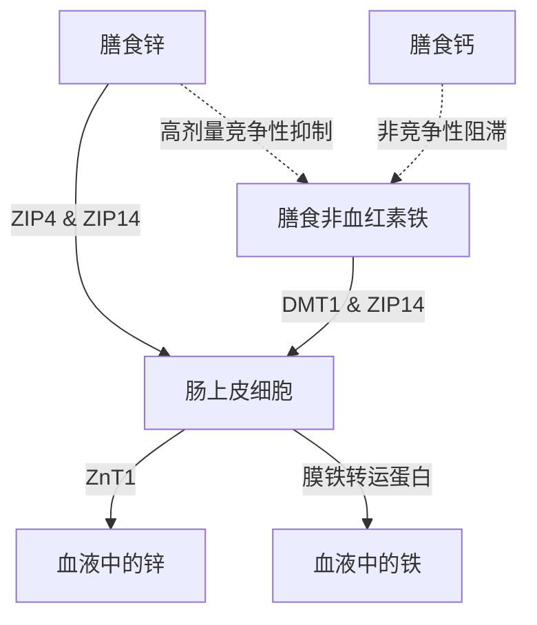

口服锌（$\text{Zn}^{2+}$）补充剂存在一系列生理和生化上的悖论。虽然锌是参与300多种酶反应的重要微量矿物质，但其口服摄入经常会受到急性胃肠道不适、与其他二价阳离子的竞争性抑制以及全身性矿物质消耗的阻碍。解决这些问题需要深入了解肠道转运蛋白动力学、黏膜生化学和时间药理学，从而设计出最佳的服用方案。

## 空腹悖论：黏膜刺激 vs 生物利用度

口服锌补充剂面临着一个艰难的抉择：空腹服用可使细胞生物利用度最大化，但往往会引起急性的胃肠道不适（恶心）。相反，与食物一起服用可成功缓解不适，但会引入饮食中的拮抗剂（抑制剂），从而严重降低锌的吸收率。

### 胃刺激与恶心的分子机制
摄入高水溶性的无机锌盐——如硫酸锌（$\text{ZnSO}_4$）或氯化锌（$\text{ZnCl}_2$）——会导致其在胃腔内迅速溶解。在水溶液中，这些盐完全解离，产生一个高浓度且呈酸性的局部环境，pH值约为4.0至5.0。

在禁食状态下，由于没有食物团，胃黏膜处于缺乏缓冲的状态。突然暴露于游离的二价锌离子（$\text{Zn}^{2+}$）会对胃上皮细胞产生直接的腐蚀和刺激作用。这种局部刺激会促使胃壁细胞过量分泌盐酸（HCl），进一步降低胃的pH值，并可能引发黏膜糜烂。

这种化学和酸性刺激会被遍布胃壁的迷走神经感觉神经元网络所感知。一旦被激活，这些神经元就会通过迷走神经将动作电位传递到脑干。这会引发由中枢介导的呕吐反射，表现为摄入后30分钟内出现立即的恶心、胃排空延迟和胃痉挛。

### 吸收阻滞：植酸、谷物与乳制品

当锌与食物一起服用以防止迷走神经刺激（恶心）时，其生物利用度会受到饮食抑制剂的严重损害。这些抑制剂中最强的是**植酸**，它高度浓缩在未精制谷物、豆类、坚果和种子的外壳中。

在十二指肠的生理pH值下，植酸充当一种侵略性的配体，螯合（捕获）游离的 $\text{Zn}^{2+}$ 离子，形成高度稳定、不溶且结构复杂的沉淀物，这些沉淀物完全无法被肠道吸收。由于人类上消化道缺乏内源性的植酸酶，这些锌-植酸复合物保持不被水解的状态，并随粪便排出体外。

> [!CAUTION]
> 使用放射性标记物的定量研究表明，仅在膳食中添加 50 毫克植酸，锌的吸收率就会减少约 36%（从 22% 降至 14%）。而 250 毫克的植酸浓度则会将吸收率完全压制到可忽略的 6-7%。

此外，乳制品也具有独立的抑制作用。**酪蛋白**（牛奶中的主要蛋白质片段）会在肠腔内结合锌离子，与乳清蛋白相比，其会显著降低锌的生物利用度。

### 锌化合物的形态与耐受性

| 化学类别 | 锌化合物形态 | 估计吸收率 | 胃肠耐受性 | 作用机制 |
| :--- | :--- | :--- | :--- | :--- |
| **无机盐** | 硫酸锌（$\text{ZnSO}_4$） | ~20–49.9% | 高度刺激（~15%恶心） | 迅速解离为游离的 $\text{Zn}^{2+}$；酸性pH。 |
| **有机盐** | 葡萄糖酸锌 | ~50.6–71.7% | 中度耐受（~5%恶心） | 中性pH；缓慢解离，刺激性较小。 |
| **有机螯合物**| 甘氨酸锌 | ~50–60% | 极高耐受度（<5%恶心） | 与甘氨酸结合；抵抗胃酸解离和植酸干扰。 |

### 科学的最佳服用方案

要完全避开空腹时的恶心反射和植酸的吸收阻滞，必须采用特定的临床方案：

1. **转向有机螯合物：** 应使用 pH 中性的有机金属-氨基酸螯合物（如甘氨酸锌）来替代无机锌盐。在甘氨酸锌中，$\text{Zn}^{2+}$ 离子与两个甘氨酸配体共价结合，保护矿物质免受胃酸的过早解离。
2. **利用低拮抗剂的缓冲食物：** 如果患者极其敏感，需要食物缓冲以防止恶心，锌应仅与完全不含植酸和高剂量钙的清淡零食一起服用。允许的食物包括白酸面团面包（发酵过程分解了植酸）或简单的动物蛋白（鸡蛋或分离乳清蛋白）。

> [!TIP]
> **专家提示：** 为了在完全避免恶心的同时最大化吸收，理想的方案是在下午早些时候将 15-30 毫克的元素甘氨酸锌与不含植酸的清淡零食一起服用，并确保摄入前后有两小时的空腹时间（包括咖啡和茶）。

## 转运蛋白之战：DMT1 与 ZIP14

小肠的肠上皮细胞是二价金属吸收竞争极其激烈的场所。锌（$\text{Zn}^{2+}$）、非血红素铁（$\text{Fe}^{2+}$）和钙（$\text{Ca}^{2+}$）共享重叠且可饱和的转运路径。这意味着高剂量补充剂的共同给药会直接抑制彼此的吸收。

### 转运蛋白格局：ZIP4、ZIP14 和 DMT1
在十二指肠肠上皮细胞的顶端膜上，膳食锌的主要进口通道是 ZIP4。非血红素铁（植物/无机铁）则依赖于另一条路径：DMT1。然而，还有另一种关键的转运蛋白 ZIP14；虽然它被归类为锌转运蛋白，但它同样具有高度运输铁（$\text{Fe}^{2+}$）的能力。

由于 $\text{Zn}^{2+}$ 和 $\text{Fe}^{2+}$ 在电荷和离子半径上非常相似，它们会激烈竞争共享的细胞内转运路径（如 ZIP14）。当治疗剂量（高剂量）的铁（100-400毫克）与锌同时给药时，铁在细胞摄取上会战胜锌。临床研究表明，同时服用高剂量铁和标准的 25 毫克锌会将锌的吸收率降低约 40-50%。

## 铜耗竭的危险：细胞内的困境

长期服用高剂量锌补充剂的一个重大危险是全身性铜缺乏症的隐匿发展。这一路径是由肠上皮细胞内一种结合金属的蛋白质——**金属硫蛋白**的向上调节所介导的。

当个体长期摄入高剂量的锌（通常超过40-50毫克/天）时，大量细胞内 $\text{Zn}^{2+}$ 的涌入会作为一个强烈的信号，引发金属硫蛋白的大规模合成。尽管其合成很大程度上是由锌水平驱动的，但该蛋白质对铜（$\text{Cu}^+$）的结合亲和力大大高于其对锌的亲和力。

因此，当膳食中的铜被吸收到肠上皮细胞时，大量存在的金属硫蛋白分子会迅速结合并封存铜离子。这些铜被困在极其稳定的复合物中，无法进入血液。由于肠道细胞每3至5天就会脱落更新，困在其中的铜便随粪便排出。随着时间的推移，这种阻滞会导致严重的系统性铜耗竭。

> [!WARNING]
> 连续四周以上每天服用超过 40 毫克的锌，而没有按照 15:1 的比例进行相应的铜平衡，就有引发严重铜缺乏症的风险。这可能导致脱发、不可逆的神经损伤和贫血。

### 临床安全的锌铜比例
在长期补充期间，为了完全防止金属硫蛋白引起的铜困境，任何锌补充剂都必须以高度特定的治疗比例与铜配对。临床上确定的安全且具有协同作用的**锌铜比例为 8:1 至 15:1**。每 15 毫克锌摄入 1 毫克铜可完全消除此危险。

## 锌的时间药理学：昼夜节律与睡眠

营养素的给药时间是决定其功效的主要因素。锌是合成褪黑素（睡眠激素）所需的基础生化辅因子。锌缺乏会直接下调 AANAT（控制褪黑素产生的酶）的转录，导致夜间褪黑素大幅下降（失眠）。

此外，锌在中枢神经系统中作为一种直接的神经调节剂。在神经兴奋时，锌充当兴奋性 NMDA 谷氨酸受体的强效拮抗剂（阻断剂），同时增强具有镇静作用的 GABA 受体。这种双重作用——抑制兴奋的同时增强放松——有助于平稳过渡到深度的慢波睡眠。

### SuppTime 优化的服用方案

| 时间段 | 补充剂组合 | 时间生物学依据 |
| :--- | :--- | :--- |
| **早晨** | 益生菌 | 刚醒来时胃酸量较低，可最大化细菌在胃酸中的存活率。 |
| **早餐** | 非血红素铁、维生素C、维生素D3 | 维生素C促进铁吸收。请避开钙和锌。 |
| **午餐 / 下午** | 甘氨酸锌 (15–30 毫克) + 铜 (1–2 毫克) | 以 15:1 的比例配制以防止铜耗竭；与铁和钙完全分开。 |
| **夜晚** | 钙、甘氨酸镁 | 镁在睡前放松骨骼肌肉系统并调节具有镇静作用的 GABA 受体。 |

## 参考文献

1. Institute of Medicine (US) Panel on Micronutrients. [Zinc](https://www.ncbi.nlm.nih.gov/books/NBK222317/). *Dietary Reference Intakes for Vitamin A, Vitamin K, Arsenic, Boron, Chromium, Copper, Iodine, Iron, Manganese, Molybdenum, Nickel, Silicon, Vanadium, and Zinc.* National Academies Press, 2001.
2. National Institutes of Health, Office of Dietary Supplements. [Zinc - Health Professional Fact Sheet](https://ods.od.nih.gov/factsheets/Zinc-HealthProfessional/). *NIH Office of Dietary Supplements.* 2022.
3. Pérès JM, Bureau F, Neuville D, Arhan P, Bouglé D. [Inhibition of zinc absorption by iron depends on their ratio](https://pubmed.ncbi.nlm.nih.gov/11846013/). *Journal of Trace Elements in Medicine and Biology.* 2001.
4. Devarshi PP, Mao Q, Grant RW, Mitmesser SH. [Comparative Absorption and Bioavailability of Various Chemical Forms of Zinc in Humans: A Narrative Review](https://www.ncbi.nlm.nih.gov/pmc/articles/PMC11677333/). *Nutrients.* 2024.
5. Gupta N, Carmichael MF. [Zinc-Induced Copper Deficiency as a Rare Cause of Neurological Deficit and Anemia](https://www.ncbi.nlm.nih.gov/pmc/articles/PMC10510946/). *Cureus.* 2023.

本文仅供参考，不构成医疗建议。在改变您的补充剂或药物使用方案之前，请咨询合格的医疗专业人员。
